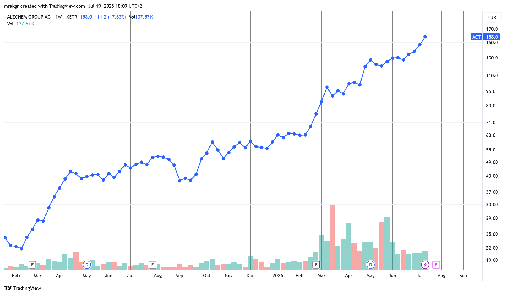
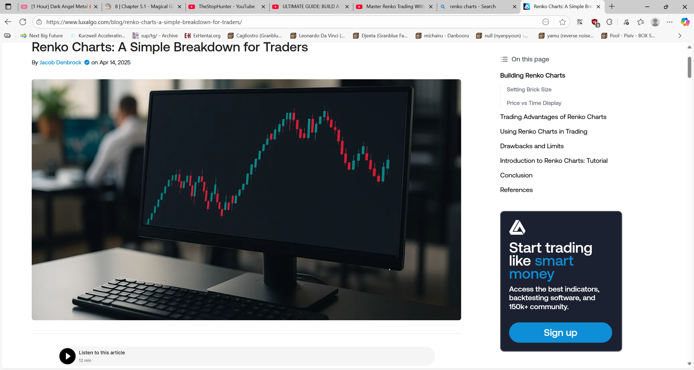
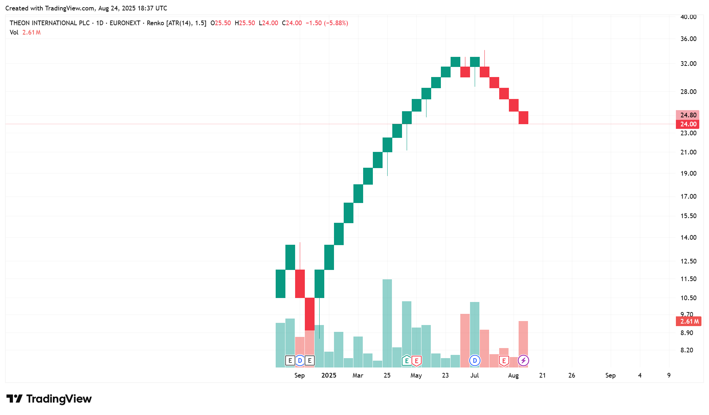
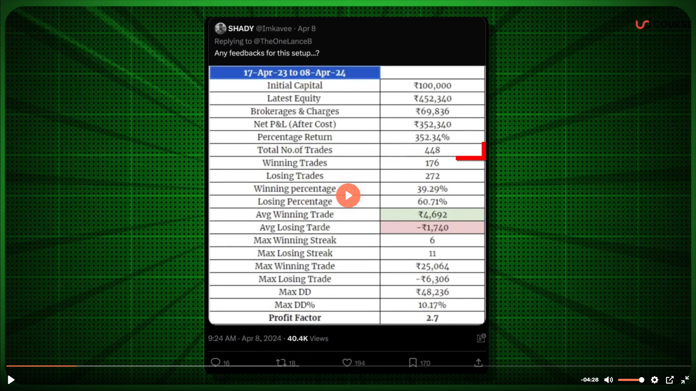
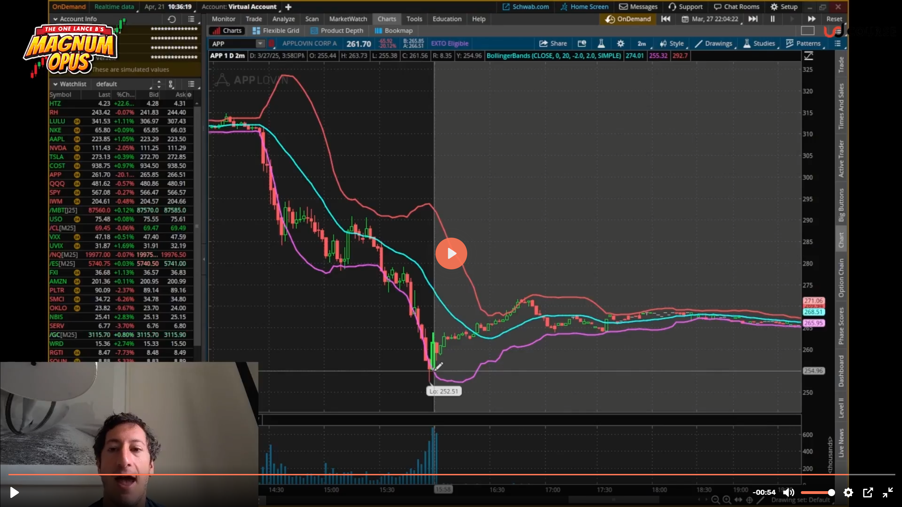
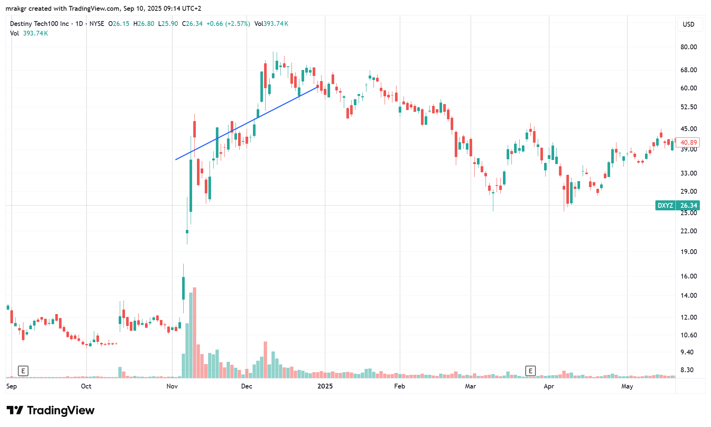
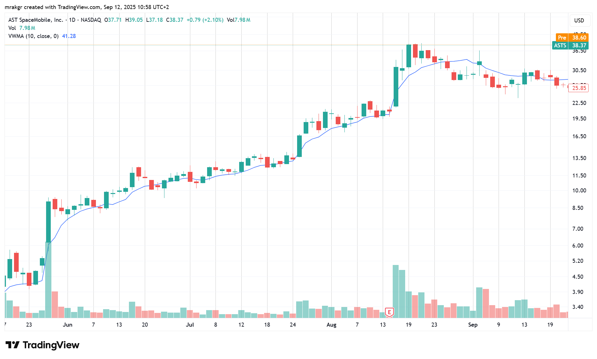
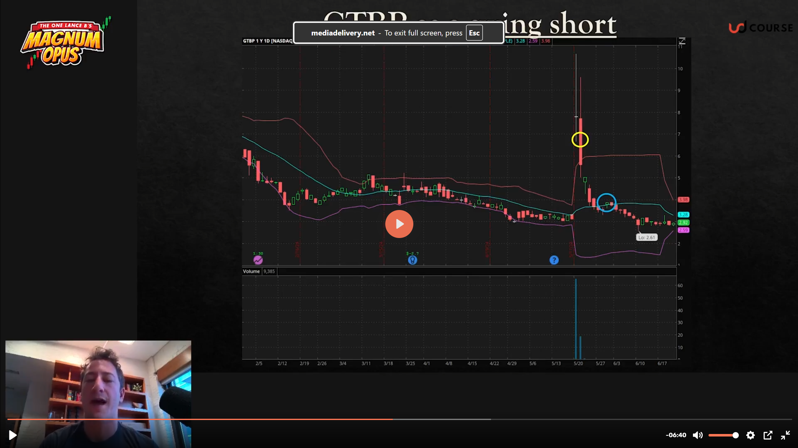
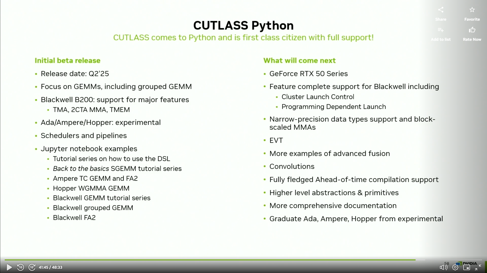

6/29/2025

10:10am. In order to help ensure discipline in my trading, I've decided according to my usual style to open a public trading journal.

Because of my work with Tao Ceti, I am too busy to spend monologuing in the Spiral language or the ML library repo, and I am probably being a nuisance posting stock market & trading related messages in the company's Discord channel. It's not a big deal since there are only 2 other guys there, but I doubt they are interested in this, so I should move that kind of posting in its proper place.

I've been considering various avenues to improve my trading.

One option would be to put some effort into actually understanding what I am trading, so I am considering learning finance and economics. There should be good courses on these subjects like on platforms like Coursera or Udacity. I should also start doing fundamental research. But I am skeptical of those approaches to getting better for reasons I will get into later.

Over the past week I've had many days when I've been stressed out due to the market specifically, and had trouble sleeping. Being tired the next day has been impacting my performance at work negatively. And it's not really pleasant to be awake a couple of nights in a row because my brain is simply refusing to switch off and get some rest, even though I was lying in bed.

I've started trading 3 months ago, and my holding periods are long so there haven't been many of them, so I'll be going over them later. But for now, let me start with the most important part of this repo which is describing my trading methodology. I'll do that in a separate file.

8:25pm. I'll do the analysis later as I am really tired from writing that [large document](/methodology.md). Hopefully this will allow me to reach catharsis. I just want to get this out so I can sleep well during the night.

I wish I could just tell my brain to take a break, but that isn't how it works for me.

7/1/2025

10:30pm. https://youtu.be/dfGuhlQ-CLQ?list=PLOPDD0ChIJDhbKz0bquZeNkECGKZxpRpK
Sheridan Titman On His Seminal Paper on Momentum Investing and What He Has Learned Since

Watching this video and he says some very interesting things like that momentum actually works better the more efficient the market is. It works best in the US, but in Japan or China it doesn't.

Will work on trade analysis during the weekend. Don't feel like it during my workdays.

So far the week did start out pretty challenging. I absolutely must hold this week and the next 3. As scary as the market is now, it's much more dangerous to sell out early than late.

7/2/2025

9:40am. I got up early today I started wondering about Japanese stocks and whether what Sheridan said was true.

So what I've been doing for the past hour is going over the stock charts of all the Japanese stocks sorted by 6 month momentum, and I cannot find even a single one worth trading.

The 8-week uptrend rule simply doesn't work, the momentum stocks just spike and then sit there for months. They also generally have huge and sudden declines, and have wild swings all over the place. There is no trend, they just pierce. So I think he is right.

I am sure that if I only had the Tokyo market to trade, I might as well retire.

I didn't realize at all how much my method is dependant on liquidity. It does seem to be the case that the more efficient the market is, the better it works. Japan needs a proper bull market to draw the money into it.

Given the lesson, I think the top down approach is even more important than I thought. There is a bull market is europe which will make my methods work well. Having the money come into the market is what is needed for liquidity, which should ameliorate the wild swings we see in Tokyo stocks.

7/4/2025

10:10pm. Finally the workdays are over. I'll do some trade analysis starting tomorrow.

https://youtu.be/robBbj7jZFo
Buying Winning Stocks Through Momentum Investing w/ Wes Gray (MI140)

Interesting interview. He says that companies with good price action have a fundamentally cheaper access to capital which improves their fundamentals.

https://youtu.be/robBbj7jZFo?t=1312
> The US is the greatest survivor bias experiment of all time.

https://youtu.be/robBbj7jZFo?t=1832
> The minute you try to impose quality or valuation, anything that smells like a value investor was involved, you're just going to ruin the momentum strategy.

This interview on momentum is by a value guy who mechanised it. It's pretty interesting.

https://youtu.be/robBbj7jZFo?t=2889
> It's a total value dog because it's just so cheap on cash flow basis and the expectations were so terrible, but those guys couldn't get out of their own way trying to raise capital to help them out. All of a sudden, they go on a short squeeze, price action goes bonkers and because they can raise capital for like negative cost to capital it seems...I don't know if that a concept...now they're like fundamentally in a better position as a business than they've ever been in the history of their lives! Just because of price action!

https://youtu.be/X9Yapfh9VlE
An In Depth Look at Momentum Investing and Trend Following with Jack Vogel

I'll leave this one for tomorrow.

7/5/2025

1:20pm. https://youtu.be/PT6lhOaBufk?t=1436
Here’s How To Trade The High-Octane IPO Boom | Investing With IBD

Didn't know that Stripe will IPO.

https://youtu.be/lpqmTse5TKI?t=2416
Why Minervini Calls Volatility A Rare Moment For This Market | Investing With IBD

I wonder what the Strategy 33 Model is doing. Right now I am just watching financial videos and looking at charts. I meant to continue the analysis from last week, but ended up doing what I want instead.

I'll finish this video and then resume.

3pm. Let me do some work on the analysis. Enough watching vids.

7/6/2025

10:45am. Reading Peter Lynch's One Up On Wall Street book.

I find this investment philosophy very interesting. Based on what he is saying I should have invested in Nvidia, though at that point I had no money to invest and had thrown in the towel.

Reading this makes me realize that I was wrong about not being connected to anything. I have my own narrow circle of competence due to my work as a software engineer.

9:25pm. https://www.youtube.com/watch?v=kJtCKz1o5H4
The Dark Side of Value Investing | Practical Lessons from Aswath Damodaran

7/7/2025

9:30am. https://youtu.be/inI0SC3Zj4A
Bitcoin on the Balance Sheet: Why Companies Are Turning to Crypto as a Treasury Strategy

This video is amazing. I wasn't aware what was driving the Bitcoin prices up lately.

7pm. https://cow.fi/
Token - Maple Financial

I'll go into what these two mean later. Logris showed me an example of amazing earnings acceleration that led the price rise in Maple Financial. He made a mistake of not betting big on this opportunity in my view.

7/8/2025

9:15pm. https://www.youtube.com/watch?v=7v6DQ4qyYIo
How to Build a Trend Following System | Interview with Tom Basso | Hedge Fund Manager

He is saying that buy and sell decisions aren't as important as beginners think they are.

Yeah, I think I need to loosen up.

I've been thinking about my trading going forward and if the current positive price action continues into the end of next week, I am going to buy RHM in order to increase my exposure to it. The ETF only has 10% in it, but I'd like if it were higher. Bringing it up to 20% by buying shares of it directly should do the trick.

I need to loosen up. I did a good job by trading my portfolio in pieces and I should continue that. Every two weeks I should be increasing or decreasing instead of standing still.

Doing this move would only change my long exposure from 101 to 110% and after I get paid from my job, the margin would get paid down to 100%.

I do want to start phasing out my ETF trading in favor of trading stocks directly. I am not going to be adding any more to my ETF positions.

Ironically, I think the way I've been trading ETFs now is how I'll trade when I am much bigger. But right now I am just throwing away alpha.

To be honest, the line between beta and alpha is blurred to me. Beta is alpha during bull markets.

10:45pm. https://youtu.be/jD4nynuWfEU
The Reality of Relative Strength Based Trading with Linda Raschke

There is so much out there on how to trade well these days. I'll watch this tomorrow.

7/10/2025

9:50pm. 

God, I wish I had Jeffrey Neumann's insight. He is to trading what Elon Musk is to entrepreneurship. I was never envious of other traders until I read his interview in the newest Market Wizards book.

They are both lucksacks, but unlike Elon whose past successes seem like a fluke now, Jeffrey has the intelligence to match his success.

I am reminded of Ed Seykota's quote that it's rare that nature provides the ability to meet a burning desire in a person.

10pm. I've decided. I think at the end of next week, I am going to sell down my DEFS position in order to make room for RHM.

I want to bring up my exposure in that stock up to 25% at least. Then in two weeks I am going to sell it to make room for something else, and that way I am going to wean myself off ETFs and into individual market leaders.

I told myself I wasn't going to do it, but deep down I know that I need to do this at some point and I might as well do it 'now'. By 'now' I mean, every two weeks. 

10:05pm. There are a lot of stocks going up right now, but if I want to be successful, I should avoid random individual momentum and trade themes.

There are 3 major ones and 1 minor (East Europe) in play currently.

1) Defense stocks.
2) AI.
3) Crypto.
4) East Europe - Croatia and Slovenia.

It's not just European defense stocks, for some reason South Korea is going crazy and there are a ton of momentum picks in that market.

AI is mostly Nvidia, but it has some stocks on its tails like CoreWeave. I think that 2-3 months down the road once it digest the rapid runup, I am probably going to be buying it.

Crypto is mostly Bitcoin. It seems like it's close to breaking out, but I want to give it 3 weeks in order to see how it acts around the breakout point.

In Croatia where I live there is a lot of inflation and the stock markets of Crotia and Slovenia have burst from 1.5 decade long consolidations. Reminds me of China and the emerging markets in the 00s. Back then it also made a huge move.

Too bad I didn't buy this instead of the euro ETFs or ASWC.

I need to pay more attention from here on out.

I just checked in IB, and I am restricted buying due to dumb European regulations. But maybe these regulations are doing me a favor. I really should be trading individual stocks instead of ETFs. ETFs are filled with laggards which will drag down my performance long term.

10:25pm. As an aside, here are some pullbacks that are good buying opportunities on my watchlist.

These are opportunities to buy momentum stocks at a better price point, but what makes them opportunities is that I stretched out my holding period to a minimum of two weeks.

I think the realization that I have to be operating at a 2 - 12 week timescales and move gradually in 2 week steps is the most important insight from my 6 years of failed trading and 11 years of absence. More than smart, I must be patient.

You can make a lot of money in stocks just by holding them for 1-3 months irrespective of patterns.

The market has a strong long bias and I simply didn't appreciate that at all. I simply didn't.

I need to sense the themes, and I need to rotate into the leaders. Then I have to hold and be on the looking for momentum pettering out on the 8 week scale in the leaders. If I can just watch the leaders, they will tell me when the market has topped.

If you're looking at the SPY, it's very hard to know what is happening, but when you see stocks that usually go up 30% per month stop doing that it's very much obvious.

I don't need a mechanical system like in the Janus factor book. I can tell what the themes are just by looking at the stocks themselves.

7/12/2025

12:50pm. Let me do some writing here. First, in a fit of inspiration yesterday I wrote a lot of posts to Logris, and I am going to paste some of them here.

Logris is a smart fundamental investor, and I am struggling to explain the principles behind my trading in a face to face talk so I wrote them down for him. And for me it's a good exercise to keep reinforcing them.

///

Finding KDEF got me curious about the South Korean market, and when I looked, I found there were a lot of great momentum picks in that market. It's amazing. I could imagine that after 3 decades of only tripling in price, it might be gearing up for another huge bull market. My view is that when a stock goes up 30% in a month it's no big deal, but it's an entirely different manner when the entire market does it. That has a lot of signal to it. It's not a certain thing that it will turn into a large bull market going forward, but it changes the odds.

***

There are also big bull markets in Slovenian and Crotian markets. For some reason the Expat Croatian ETF is underperforming the Crobex index greatly so I wouldn't recommend it.

On the ground in Croatia, there has been a lot of inflation, but I get the sense that the living standards are rising. People are complaining about the rising tourism prices, but the tourists are buying into them and the place is packed so that explains the bull market. In general, these markets are easy to handle using trend following systems.

***

I get the sense that I picked a really good time to get back into trading. The market really shrugged off the tariff negativity and is streaming higher, which is strong indication we're in a bull market. Even BTC is breaking out.

***

The UK market is the opposite of South Korea. All the momentum picks on the London market are absolute trash. The high fliers are mostly pump and dumps. The rest which I'd actually consider buying smoother ones have highly volatile low quality patterns. High quality patterns are like you'd see on RHM currently. High momentum, and also low volatility on the weeklies which will make it much easier to tell when the trend has shifted.

I've done a huge amount of chart reading in the past, and part of why I threw in the towel is because I haven't been able to discover anything that has a predictive quality in terms of future price direction. Despite doing it for years, I've had to conclude that the day to day price is mostly random. I'd buy a stock, try holding the winners and cutting losers, but it just ended up churning my account. I wasn't at all good at trend following. Ironically, all the price randomness made me go the wrong way and caused me to shorten my time horizons when I should've been expanding them.

But now that I've come back to trading and corrected my holding periods, I also have insight about price movements that I didn't before...

***

You cannot predict prices, but what is true that different market regimes exist: trending markets (either bull or bear) and sideways markets. What I am doing now is thinking of various different scenarios: are we in a bull market, bear or a trendless market and putting % odds on each. I am sharpening my intuition about the current market environment by studying how prices behave in each of such environments, which helps me narrow down the odds of various scenarios.

***

And because prices cannot be predicted, and it's only possible to interpret the characteristics of the current market, that means that the only real way to do market research is to actually take a position. My current theory is that by doing so the market will essentially tell me what the trend is. I understand now that it's actually necessary to be in the market to be able to tell what it's characteristics are. By taking a risk, I am essentially paying the market to do research for me.

***

The Maple Financial trade you've showed me is essentially trend following on fundamentals. You had sharply rising earnings, without knowing more, you know that it's likely that they will keep rising. You cannot be sure, but maybe you can say it's 70-80% likely? And prices follow earnings. So when eventually the earnings start stalling, you'll lower your odds of future price rises and that will make it more likely that you'll sell your position.

***

In the stock market, I know that prices follow earnings, but I don't have an army of analysts to study the various companies, so I have I have to draw my inferences in the opposite direction. If I see rising prices, I have to conjecture that good things are happening and vice versa.

***

To a degree, you can definitely tell which companies are good or not by their price action. In the extreme case, if you have a stock under 3$ a share, jumping 50% per day, you can tell that it's most likely a pump and dump and not a long term holding because most pumps and dumps act like that. And if a stock is not very volatile, that is has small daily changes, but has good persistence on the longer timescales - 2 weeks and up, then that tells you that it could be better than a random pick going forward.

***

That's the basics of it. The advanced part of trading is to be aware of things like groups movements, that the leaders top ahead of the market and drag down the sentiment when they inevitably start breaking. The Janus Factor book I posted goes into this in detail, but I don't think a mechanical system is necessary. You can generally see leading stocks expanding on the upside, toping ahead of the market and then breaking. The latter part causes investors in those become fearful. If you look at the charts of S&P the breaking points where the market becomes volatile seem random, but the panic starts from the leaders breaking and then spreads to the rest of the market.

***

I really love it when the market breaks sharply as it always results in great buying opportunities going forward. I've seen this over and over by now that it's become ingrained that panic leads to high returns in the future.

***

Regarding chart patterns, they don't work, but what I've realized recently that counterfactual thinking about the price action does. This has been trying to awaken in me for a long while.

***

To illustrate this, one stock which I am watching is CoreWeave.

It looks like this on the weeklies. I hate buying runups like these as that just leads to a lot of volatility. Large rises have a lot of pump in them regardless they are smooth or jumpy, which gets followed by a dump. I think the Quantitative Momentum book that I posted illustrated this well. Statistically, large 1 month moves lead to mean reversion while 6 month moves lead to expansion. That's just the statistical view. The counterfactual way of thinking where you are putting odds on various scenarios, would allow you to see while it's true that there is an immediate danger of reversal in the present, you know that the market leads would hold on to their gains even after a huge rise such as this one.

So by waiting a 2 months from this point in time, you can essentially cut off most of the laggards from scenario, which leaves the winners. Right now it might be the case that say, the stock is 25% likely to be in an uptrend, 50% flat, and 25% that it's going to sell off and enter a downtrend, but by waiting the necessary amount of time, it reveals the cards the market is holding.

***

By waiting 2 months the dump scenarios will get eliminated, leaving mostly the upwards trend continuation scenarios intact. At that point, the odds of an uptrend will be 60%, 20% flat and 20% downtrend.

***

I think that's how reasoning by price action works.

***

During my failing period, I don't think I understood this, so what I did was tried following the trend by buying strong runups like the ones in CRWV only to get stopped out.

***

I didn't get what exactly was the point of waiting for the 'handle' part in these chart patterns. Back then I thought that by waiting in this scenario, I'd just be missing out on a potential winner.

***

And I did understand one part correctly - the biggest winners of the future do start out by making huge initial moves like CRWV did here. So back then it made sense that I should be buying when the stock looks very overextended. That didn't work well for me.

***

I will admit, the defense stocks do look overextended now, so there is a possibility that they might go sideways for a prolonged period of time. A part of me thinks that.

***

But we're in a strong bull market. And they are the dominant group, so what else are the investors going to put money but the dominant group. If wasn't for the April tariff tipping the market's hand, I'd be a lot more scared holding these stocks right now.

***

I had to write this because when I talk to you about finance, you always talk about about fundamentals, and I am struggling in the head of the moment to elucidate how to bring out my own perspective because you are thinking in a very different way than I do.

***

Oh yeah, incidentally, do you know know why cutting losses is good in trading?

***

Assuming you are long an uptrending stock, and the price declines an abnormal % below your buy point that gives you important information. You know how winners act, and they don't do sharp declines, so you know that the odds have changed. Instead of the odds of an uptrend scenario being 70%, a single day's price action can lower it to 40% and make other less beneficial scenarios much more likely. If it takes time, say two weeks and doesn't recover even if it's something like being 10% down, while that might not damage your account balance much, it can do great damage to your estimation of whether the stock is a leader! So the rational move becomes to sell and move that money in better opportunities.

***

In your Curve trade, you were never considering the trend of a stock to begin with, and you didn't sell it when it fell. But that's fine, from a technical perspective it wasn't in an uptrend, so it going down 10-30% didn't invalidate your investment thesis.

***

The way I see it, when you bought it at 0.3 it was a sideways, choppy non-trend, and at 0.2 it was still in the same scenario. From that perspective, nothing abnormal was happening. So it made no sense to sell when it went down.

***

With Maple Financial, it had a definite trend and you could trade based on whether it matches the profile of a winner, with stops in order to limit your risk.

***

It's a different world from value investing.

***

From my current perspective, trading is easier than it seemed. You know that daily price action is mostly random, so you don't have to be hung up about specific patterns. It's mostly about momentum on various monthly timescales, and volatility on the shorter ones. Of course, if you are fishing for uptrends, then you want to hold winners as 1 month momentum when you're heading into it positioned long verifies the trading thesis. Strong leaders have to go up on the 8 - 12 week timescale. The best ones do it on an 8 week timescale.

***

Up they start going up far too quickly and the volume starts coming in, that's a sign to exit as the large traders will be taking advantage of that opportunity to sell the stock to future bag holders.

***

If you miss this opportunity, the only other option is to sell on declines once the 8 week pattern starts breaking. Alternatively, the declines can become particularly large even before the 8 weeks are up which is another sign of trend change. I've also notice that often the leaders will slow down even if they don't turn and that's also a sell signal. Strong upwards momentum becomes weak upwards momentum, and that makes the stock vulnerable to a selloff.

***

I think that what I am most afraid of when it comes to euro defense stocks right now. Then ran up so hard that I wouldn't be surprised if they start getting exhausted. We might end up holding weak leaders rather than strong ones. But we can still make money from that scenario.

***

I am also starting to become bullish on BTC due to it's price action. If it can break out gently and maintain the level for a few weeks, that will make it likely that's in an uptrend and not in a consolidation. I wouldn't expect BTC to make a strong move like in the past, but maybe it could uptrend for a couple of months once it gets going. The beauty of strong leaders is that they give you a lot of time to get in.

***

It's the stocks that act jumpy and run away that are bad trading candidates.

***

The market is very strong right now so I doubt that BTC will turn into a rout, but the breakout might fail and it might consolidate for many months instead.

***

Incidentally, why is pyramiding and averaging up good in these situations?

***

The theory behind is that when you have a probable uptrend, but not a confirmed one you bet small, and as the odds of it rise, you commensurately adjust your size to account for the improved odds. It makes zero sense if you already have a confirmed signal to get in.

***

Also psychologically it becomes easier to buy if the trading vehicle moves significantly from the buy point if you have half or a third of your position already.

***

Going into the future, I'll be using that technique to scale in every two weeks from low points - like after market panics, rather than breakouts.

***

It makes sense to do this after market panics because how the market acts after panics tells you a lot about the true environment. In bull markets the low prices get bought up, but in bear markets the buying pressure disappears and they head lower. So by buying on the way up, you are using a technique that primarily works in uptrends, and gives you a small loss in downtrends. And gives you some protection against choppy, sideways markets.

***

Going by that reasoning, one trading idea is to buy a partial position in CRWV now and scale in gradually as the odds of it being a winner improve. You know that winners hold on to their gains, so wouldn't make sense to buy on the way down, only on the way up.

***

This is also why averaging down is so bad. It ensures that the trader maximizes his losses on the way down when the stock is in downtrending mode.

***

When you're buying on the way up you don't get the best price, but at least it keeps you out of losers.

***

On a similar vein, by taking small profits often, it leads to rotation into laggards. Though that must be balanced by the fast that strong momentum is mean reverting.

***

The only real defense against short term mean reversion is to be aware of the market themes and buy winners that have potential to run far instead of random momentum picks.

***

Or to be keenly aware of the individual stocks fundamentals and future earnings potential.

***

Mhhhh...I think this should be good enough to illuminate how I think about the markets.

***

One last thing, what about selling on the way up?

***

I think I should do it. Even if the winner is proven, being long after a long period advance will increase the risk. Instead of gambling, it makes sense to adjust position based on odds, and long advances make the odds of a short term countertrend more likely. The advances are what traders are aiming for, but they are also worth fearing. We'd want to reduce our positions when the risk increases and increase them when the risk decreases.

***

Yeah, this should do it. I've never been a good trader, and I have only started crystalizing my experiences in the past few months so we'll see what the results will turn out to be.

///

There was more in the thread, but I'll keep those parts private.

1:15pm. Now comes planning time. I've decided to sell 40% of DEFS and put them into stocks...

1:55pm. I think the main thing I should do now is check out on which exchanges these stocks are trading and get the market data subscriptions. Last time when I rotated my portfolio I did so with delayed data, which isn't the smartest way of doing things.

The market data is so damn expensive!

This is the one I need for LTMC.

Ok, nevermind. I'll just look at the delayed quotes as I have and move the limits gradually until they get hit.

I hate paying for services.

But snapshots could be worth it.

Ok, I see it. Nope, I don't have snapshots for LTMC, but I have for US stocks.

1:55pm. Ok, thinking time.

Subscribing to Xerta and Borsa Italiana (BVMI) 77 + 18 = 95 euros per month. Over a year that would come up to ~1,200 euros. So to make this trade worth it, the value of real time data has to be greater than the slippage I'd incur from using delayed quotes.

Even with a 1m portfolio those data expenses would come up to 0.12% per year. For me, they'd be 10x that. Am I willing to pay 1.2% of my annual return to get this data?

I don't think I am.

The slippage would have to be worse than 1.2% cummulative over the course of a year for real time data to be worth subscribing to.

I think I'll just save my money.

2:05pm. With that decided, tactics time. The way I rotated out of AWCS and into DEFS was weird, so what I am going to do this time is plan things better.

I'll go with the prinicple of buying slowly and selling quickly.

On Thursday I'll put in my limit orders and then sell DEFS at the market as they get executed. There will be a short period where I will be leveraged 140% as a result, but I won't go broke due to it.

2:10pm. I think I'll restrain my urge to buy low and just put in orders at the previous day closing price. Some of the time the stock will gap up and I won't get filled, but a lot of the time it should be fine. The problem with most breakout is that they take too long to run afterwards, not that they're too quick! You have to hold them for a month to get the best result.

2:15pm. The problem with the AWCS to DEFS rotation is that I was too squeeamish over being 200% long even for a short time intraday, but I shouldn't have worried that much.

I put in a pretty patient and low limit for DEFS, that I was surprised it got hit. That would give me an edge on the trade.

4:20pm. No, it made sense to play it cautiosly like that and it worked out well in the end so all is fine. I shouldn't consider the way I acted a mistake.

If anything, I should blame myself for not doing enough research and jumping into the wrong ETF to begin with.

4:50pm. I am changing my mind. I am going to first buy RHM, then sell the needed DEFS, then buy R3NK, sell DEFS, buy LTMC, and finally sell DEFS. I thought that I put in the order to buy these and then sell DEFS as they get hit, but I think I want to play it cautiously. I don't want to get caught 140% long on the wrong side of the market. I want to go 120% long at most, which is why I'll rotate the DEFS position step by step.

5:50pm. It'd be best to do this quickly. I should come in at noon when it's quiet and just do the trades at the market prices. It's not like last month where the equities were selling off. Now the risk is that I'll miss the upside.

6:25pm. I guess I'll have to think about this more. I didn't think that DEFS position would hinder me so much. But it's not like I'll break the market by selling it, so I should just do it.

I've had really good luck with limit orders and being patient in entering my trades so I am loath to abandon that.

6:55pm. There are two ways of looking at a bull market. You imagine prices going up as if being pushed up from below. The implication of that kind of perspective is that they might blast off at any moment so I should better get in quickly.

Another perspective is that they are being weighted down and pushed downwards by some unseen force, but bravely and resolutely keep up despite the headwinds. In this pespective, downwards counter-trend moves are to be expected, and the lack of selling pressure means that the stock is resisting the downwards push from above.

After many years, I think that the latter model is far closer to reality than the first one which I had as a beginner.

The lesson is that I should not be afraid of letting things run their course for another week. There is no need to get scared about missing opportunity.

7:35pm. https://www.schwab.com/learn/story/does-market-timing-work

I read this yesterday and it a good lesson. The investor who played the market perfectly buying at every yearly low didn't do that much better than the one who bought at the high.

I think I am probably overvaluing getting in at a better place when the uptrend has been established. It's more important to sit tight than to time. Sometimes I should use limit orders to get in, but I shouldn't let that be my sole strategy.

Especially when I need to rotate, I'd be better off just doing it.

With the DEFS trade, once my first limit order was hit, I should have sold all that I had of ASWC at the market and bought DEFS right there even if it's 5.43 rather than 5.40.

Even if back then that might have been justifiable and worked, if try trading a whole portfolio of stocks like that, it's not going to end well.

I need to loosen up a bit more. The reason I failed a decade ago wasn't because of poor execution, but lack of planning.

My plan back then was to look for a plan. But treating the market like a video game isn't how one adapts to it.

8:45pm. Reading /a/ threads on FX Senshi Kurumi.

This pretty much happened to me. In the end, all the daily noise got to me and I quit. I didn't lose money, but 6 years of going nowhere is quite a loss regardless.

I remember in an interview with Jerry Parker that he said that investors think that trend following is the easy way to make money in the market, but he remarked that trend following is the most gut wrenching to trade there is.

8:50pm. To be fair, what CTAs do is take one marginal trade after another hoping to get lucky.

Momentum trading has a better edge. Compared to regular trend following, I am actually selective about what I trade rather than literally every single intrument in the world.

Here is an addendum to the plan. Maybe spending 1.2% per year on market subscriptions would be worth it if it improves my trade entries. On Monday, I'll take a look at the stocks I mentioned and see how large their spreads are before deciding whether to get a subscription. It's not like I have to keep paying them every single month.

Actually, I don't have to do that. I can just come in 1h before the close, at 4:30pm pick a spot and raise my bids by 0.1% every minute. That's bound to improve my execution, but the risk is that I might miss my trades.

But then I'd be doing that during my work hours...

It be a viable strategy if I were trading full time, but I am not. Gh...

Most likely the spreads won't be too bad.

How about this as entry strategy - I'll just keep moving my bid up to the low of the last 15m. I'll do that move every 15m.

If a stock has large spreads, that will ensure that I don't get raped by them.

If it turns out that the stock is strongly trending during the day, there is a chance that won't work, but intraday price action is noisy and trendless most of the time.

In fact, when it comes to limit orders, I should be using such a system for trading my salary from USDC into EUR.

I've been winging it with larger targets and time stops, and it has been a net benefit, but I know that I am just noise trading, and I'd be better off just shipping that into my stock market account instead.

But I don't think that hammering the market with market orders is the solution either. It sets a bad habit.

I'll decide what to do once I see the spreads.

9:10pm. 

Come to think of it, back when I was studying how to trade, after reading some trading books, I thought that momo trading is the way to trade, but momo stocks are a tiny universe of the whole market. There is no way that big players can take advantage of this style beyond a certain size. That really goes for everything.

But the most scalable approach is definitely value investing.

You have a centibillionaire value investor Buffet, but only centimillionaire momo traders.

Honestly I'd be happy with a cool 10m. Most people would rather have 10 million fast than 100 billion slow, and I am one of them.

I have other things that need doing.

9:20pm. One of the reasons why I must trade is because at this point in time I don't know what my expected annual return is. If it's 100% per year, that'd be fantastic, but even if it's just 5-10% per year higher than index investing that'll still make the effort worth it.

I think at worst, I'll just break even again.

The only way to lose big money with this method is to rid the big winners on the way down - in other words, not cut my losses.

The other way would be to take too much risk, either by using leverage, overly concentrated stock positions, or investing in poor candidates.

With 20-30% positions I'll be getting close to the line on that second point, but that's not over the line. 25% per market leader is just about right.

9:35pm. I could be reading the manga, but the /a/ threads are more interesting to me these days.

9:45pm. Lol.

10pm. Kurumi-chan's author is hillarious.

10:05pm. This is insightful

I never realized it before, but this is true up to a point. I never thought that a bank might not care if it doesn't get the loan paid.

I mean, if it never books a loss, where is it going to show up?

This subject might be something worth asking the chatbots in the future. I assumed there'd be guardrails against this, but if a bank is intent on hiding losses only the regulators would possibly know. It's not like banks would lose their own money from making bad loans. They'd just cause inflation.

...No this has to be wrong. If this behavior becomes widespread you get the 2008 crisis. The financial sector got destroyed by the markets at that time once the extent of the losses was realized.

10:25pm. Reading this manga makes me deeply uncomfortable. I've seen it described as psychological ryona, and that description is very apt.

She was already close to dying, why is she increasing the position size after barely surviving?

Does she at some point realize she needs risk management in order to win?

Is this what Jesse Livermore was like?

She should read Mark Minervini's books.

Fx Senshi Kurumi-chan should be a must read for every trader. Amazing how the author trades the same way, and has learned nothing from his own manga. That is truly next level dedication to his work.

10:35pm. You can imagine how well the trade went for her.

I should remember this could very well be me if I leverage myself in the stock market, or bet more than 25% on a single stock. Or don't cut my losses or buy into obvious pump and dumps.

It really hits too hard.

11:30pm. If there is one thing I've learned from index investing, it's that being long the market pays in general. I wouldn't like be subservient to the market, but it is a giant money sucking machine, and stocks that aren't going down are likely to go up. This is the basis of my entire trading plan really. Of course after a certain point I assume that stocks that aren't going up will go down and get out. The 8 weeks rule guides me.

7/13/2025

8:40am. I have two goals for today:

1) Even though I am trading momentum, I think I am still weak in the market timing department. Which is ridiculous.

I've read the Janus Factor book, understood it completely, but the reality is that I am still half assing it.

So let me do something smart about that.

I'll create a few momentum screens specifically for market timing.

2) Yesterday I thought about how I would close my trades if my PC went bust. As precautionary measure, I wrote my 2FA password on a piece of paper and also wrote down the IB password. I've even ordered a printer so I can print out all my sensitive info on a piece of paper in order to back it up. Of course I have it written by hand already, but it's easy to fuck up handwritten notes, so I am going to eliminate that risk from the equation once it gets here. I'll print out that paper, cut it up with scissors, and tape it where it won't easily get found.

But in addition to that, I am going to look into how to place trades from my mobile phone. I don't like the mobile app, but I need to get familiar with it in case of emergencies.

I already have the MS Authenticator installed with all of the 2FA apps there. And I also installed IBKR Mobile on it months ago.

But I think if I try logging into it, it'll be in read only mode. I need to figure out how to do it regularly.

8:45am. A part of me think I should be working working on that poker bot, but screw that. Right now I am cashing in my skills with the job at Tao Ceti.

It's not a bad thing to think about factors related to investing. I need to put the safeguards in place completely.

10:50am. Done tuning myself into the broader market momentum.

Now let me play with the IBKR Mobile app.

12pm. Got it. I figured out where the settings are on my mobile and turned on screen lock. Now using MS Authenticator, I can log into the IBRK Mobile app. As a test I tried putting in a day limit order for RHM far below the market and it worked.

Wonderful, I am completely safe. I'll be able to close out my positions in a pinch even if my PC is inoperable.

7:40pm. Change of plans, I don't want to be bothered on Friday, so I am just going to do it on Monday, 8 days from now. The original plan was to wait 2 weeks, and then come in next week to do the rotation so I should learn from my March experience and not let myself be dragged in. The market has a tendency of dumping on Monday anyway, so I'll wait.

I am 100% long either way so I shouldn't get impatient.

9:50pm. I guess it pays to cover all the bases.

Imagine that the market dumps 5% next week in one day. What exactly would be my plan regarding that?

I am not thinking about these situations enough. Do I just let myself be stopped out, wait two weeks with the intention of pyramiding up two weeks, or do I have a two week time stop before selling at a loss?

The solution is really to compromise and sell half my positions. There is negative EV of being on the wrong side of a move leading into a panic, but what I am trying to exploit are powerful upwards trends, so I shouldn't get into the habit of fighting the market. I did that in April, but I did it with 33% of my account.

If you're trading the index, buying panics and selling when its calm is the only strategy really, but with stocks, it's all about the momentum during the quiet periods.

It'd be very shocked if a dump just came out of the blue though. It could only happen due to a 9/11 type of black swan event.

Right now the defense stocks have their upwards momentum weakened, it's not like in April, so if they get smashed now they'll really crack. I think the upwards momentum has started last week, but it isn't here yet, and there is no guarantee it won't turn out to be a sideways move.

10:10pm. Also I am thinking about BTC. Regardless if I buy or let it pass, one thing I am sure is that I should treat my decision with confidence.

I can rationalize letting it pass, by saying that it feels like a very crowded trade. Everyone in the world is watching it with great speculative interest. And there is no shortage of momentum picks currently so the money that doesn't go towards BTC can go towards something else.

Or I can buy a little in 8 days along with the rest and try pyramiding up every two weeks according to my usual rules. 

Whatever I chose, one thing I am sure is that I must trade with confidence.

If I get in, I must do so with conviction that it will go up.

The market rewards conviction even if it's wrong.

Conviction on holding winners for months, and cutting losses quickly.

I knew the trading wisdom during my losing period, but I didn't understand the importance of conviction.

10:15pm. I want to just let it pass in favor of focusing on euro defense stocks. There is also South Korea. It'd suck having to trade overnight, but it's always a choice. There are also US market opportunities despite the foreign investors exiting those markets.

It'd be a sacrifice to trade Korean equities, but if I want to be successful, I should do it.

That having said...I am only considering this if euro momo leaders stocks start going sideways. I'll have to really think what to do in that case.

Hmmm, it opens at 2am and closes at 8:30am.

I'd have to adjust my schedule, but I could realistically aim get up at 7am. That'd give me enough time to catch the close and place my trades if I wanted to go down that path.

Most of the time, I've already been getting up at 8am lately.

10:25pm. Logris explained to me the reasons why companies are turning into BTC treasuries, but this kind of desperation to get in by the large traders isn't something I'd expect to happen before a big up move. 

The reason is that university endowments and pension punds for example, have their own internal rules against buying the Bitcoin ETFs directly, so they are trying to get exposure to BTC very inefficiently by buying treasury companies instead.

I am pretty sure this wasn't happening during the last bull run.

At any rate, they are going to be the bag holders when the party stops. I don't understand why large investors managing pension funds are acting like retail traders would. There is no way they'll be able to liquidate the treasury companies once the market turns.

But either way, as far as I am concerned this is no way to speculate.

Trying to reason about future price movements like this won't get me far, in the end it's all about rotating into momentum and following the trend.

I've never been successful about predicting price action even once.

If there is anything to garner from the BTC price action, it's that investor sentiment is definitely turning bullish.

There will be good times ahead, for the next few months.

10:50pm. I've come to a conclusion regarding BTC. The way I treat stocks is a conduit for investor sentiment.

I should treat crypto the same way. Buy and sell them in sync with the market as I would any other stock and not think of them in an isolated manner as if they exist in a bubble. Back in 2020 - 2021, BTC might have gone up a lot, but so have many other sectors. Many ETFs went up 100% from the Covid lows, and I am sure the actual momo leaders have gone up many times that during the period, as much as BTC did.

Also, it's possible to interpret the large trader desperation to enter the market as being bullish going forward, so I should just ignore those kinds of opinions either way.

The only question I should be asking myself is whether BTC is better than the momo stock choices and act accordingly.

Forget BTC. Forget individual stocks. Forget anectotal reasoning.

For me, there should only be the momentum. Even though I am focusing on leaders, I must never forget that I am trading the market and not the stocks themselves.

I'll ponder seriously whether to enter the South Korean market over the week.

In addition, I should do more research on other Asian markets. I am curious if South Korea is alone in its great advance. Maybe similar markets will also have great momo picks?

7/15/2025

5:40pm. Finally done with the printer and stock research.

Let me save the messages I sent to Logris here. I am not sure if they mean anything to him at this point, but they do to me.

///

Ah damn, it doesn't seem like IBKR gives access to South Korean markets.

***

It seems it only 2 years ago made regulatory changes that would allow foreigners to invest, but none of the major brokers including IB made the move to allow trading of SK securities. Agh, I was 99.9% sure that I'd have access to it. Nevermind.

***

I guess ETFs are our best bet for this. I think I'll give it a pass myself, as I'd have to use a CFD to trade it. I'd have to pay an extra 2% in fees per year due to that. There are plenty of momentum picks in the markets I do have access to already that I don't want to bother going down that route.

***

Since it's a new ETF, there isn't even a CFD on KDEF currently. I once asked IB to add a CFD on QTUM and they did so. I could try asking them for it.

****

Besides that, even though it's not 30% of the index that's making new highs, the Hong Kong market is pretty strong. 11 / 63 = 17.5% of the stocks in the Hang Seng index have 6 month perf above 50%. Outside the index, even after I filter for price * volume above 1B, there are 104 / 251 = 41.4% stocks on the screener currently. Only 4 stocks are below -33% on a 6 month basis.

***

For reference, in the US, if I filter price for volume above 5b to get 258 in the screener, and then look for 6 month perf above 50%, I get 32 stocks in total. 312 / 258 = 12.4%.

***

The US market is a lot more liquid and larger though. If I filter by 100m price * volume (turnover) I get 2354. Filter that by 6 month momentum above 50%, and I get 182. 182 / 2354 = 7.7%.

***

Damn, I thought it might be better once we include less liquid stocks, but it's even worse. Maybe liquidity is good for future performance?

***

 

Europe is 33 / 276 = 12%. It actually isn't that much better than the US.

***

 

With a lower turnover, I get 88 / 627 = 14%.

***

There you have it. We should be focusing on either South Korea or Hong Kong. You said that you'll open an account with IBKR, but maybe we both should be looking into South Korean brokers like Mirae.

***

I'll make a ticket asking about access to South Korean markets. The IB reps can be unhelpful and annoying, but I haven't been ignored by them ever.

***

 

159 / 382 = 41.6%. Outside the index, SK is similar to Hong Kong in terms of breadth.

***

 

287 / 1281 = 22.4%. Increasing the universe of tradable stocks doesn't improve the breadth, but reduces it. It seems that for every market, there is a liquidity sweet spot.

***

The South Korean market is actually pretty large with 2.3k stocks in total on it, and this is of similar size to the Hong Kong market.

***

Japan has breath of around 12-14% depending on which liquidity level I am looking at.

***

That's about it. I opened a ticket on IB, asking them about the South Korean market and I should get an answer next week. I'll tell you how it goes.

***

This is roughly how research looks for me. In the Quantitative Momentum book, they've found that rotating the momentum portfolio every month gives the best returns, but they had around 50 stocks in that portfolio. Right now I am still thinking how many equities I want to trade at any given time. Given that the momentum on euro defense stocks is waning, I'll go for 10, and only concentrate my positions to 5 or even 4 when the momentum is particularly strong on an 8 week basis. Right now I am afraid the stocks I am looking at might consolidate for a prolonged period of time, so it makes sense to spread my bets around.

***

After some more research I see that HK's bull market is different from SK's and Europe's. It has a lot of pharmaceutical, IT and retail companies. I didn't see any industrial ones like in SK. Most HK momo stocks are extended at the moment so it's not the right time to enter this market. I am also out of tune with the HK market, so it'd be best to wait for a broader market decline before making changes to my focus. I'll give it a pass for now. There will be chances to buy further down the road.

///

5:55pm. I made a mistake with the South Korea Momo screenshot. Nevermind that.

Phew, I am so tired from all the research today.

The more I think about it the less sure I am that I want to ditch my DEFS position.

When I looked at portfolio analyzer this morning, I was surprised to find that I am up 18% on the year in % terms. It feels like I've been barely threading water, but surprisingly I am up a non insignificant amount.

I started from such a low point, that I am only up like a single monthly salary...which isn't that bad if I think about it. I've been trading for 3-4 month maybe.

Ok, now let me think. If I want to sell my DEFS position and rotate into individual stocks, which should I pick? I'll ignore the large bull market in Hong Kong and Asia to focus on euro denominated stocks.

I am still bullish on euro defense stocks, but as you can see on the chart, their momentum has been waning lately. Last week I though that I should go 25% long RHM and 20% other stocks, but it cannot be justified in this case. I think I'd sleep better at night if I wasn't so invested in it.

It'd be fine to buy R3NK on the way up from a decline.

This one is LSE so that means stamp tax, but it also has a listing on the German bourse. I could just get it there.

EXA would be pretty hard to buy here so if I did so, instead of the standard 10%, I'd use 5% as my initial buy. Should have gotten it last week. If I'd been trading individual stocks that's what I would have done.

These 8 stocks that I've posted so far have all been defense related. The following won't be.

Casino and gambling stock. High tight flag pattern.

GRE is a bit interesting.

Take a look at this large selloff. Initially, these large sells are a bear pattern, but if the market can resist the selling, after a month or so it becomes a bull pattern. TKA also had this pattern.

You can see how in mid May it had an earnings breakdown, which is bad. But since the momentum didn't follow through on the downside, now it's actually a bull pattern.

6:15pm. Maybe I should just focus on Europe for the time being and give Asia a rest. Somebody has to trade Euro stocks and it might as well be me.

Ok, so...

RHM = 10%
HAG = 10%
R3NK = 10%
BAB = 10%
LDO = 10%

These come up to 50%.

TKA = 10%
HO = 10%
EXA = 5%

These come up to 25%.

LTMC
ACT
FCT
GRE

Now I need to pick 3 out of these 4...

On review, let me eliminate ACT. The reason being is that it's extended now, so I don't want to enter right here. Unlike EXA, I don't expect ACT to be the next TASR even though it has sweet momentum. 2 weeks ago it would have been the ideal time to buy, but right now, it's not so much.

So that comes down to:

LTMC = 10%
FCT = 10%
GRE = 10%

105% in total. Nice. 2 weeks from now if EXA is still going up I'll add 5% to bring it up to 10 and that will make me 110% long, which is fine. I don't want to be margined, but going up to 110% is ok.

Let me just do it. ETFs are training wheels and trading them will hurt me in the long run. It's best I give myself the flexibility to trade whatever I want. Maybe I'll lose my profits for the year through these actions, and it will turn out that I am not suited for stock trading. But I will take that risk.

On Monday, I'll come in at 2pm, which is 3.5 hours before the close, sell my DEFS position and start buying these 1 by 1. I'll go with the strategy of buying 15m lows that I discussed last week.

Let me organize my IB watchlist in advance.

7/20/2025

12:40pm. Ah, I fucked up. I might not have time to figure out how to trade a basket of stocks on Monday.

My original plan was to buy the stocks one by one, but that won't cut it. I need to figure out how to trade them with a push of a button as a basket.

Trading a single ETF is much simpler in comparison.

Let me finish the book by Tom Basso and I'll watch the IBKR vids on basket trading.

https://www.youtube.com/watch?v=-U8tLqrVrII
TWS BasketTrader Part 1 – Create a Basket

https://youtu.be/lRFjzorhBVo
How to use BasketTrader by Interactive Brokers for swing trading

I'll have to take a break from my job tomorrow in order to figure this out while the market is open.

What are adaptive limit orders?

Sigh, I am going through so much trouble simply because I don't want to spend even a day not in the market. If only I could sell DEFS and then gradually buy the stocks that I want this would be easier.

But I don't want to do that. Being away from the market even for a day means I could lose 1-2%.

What are these multi instrument tools?

4pm. Those things are useless.

After playing around with the platform for a while I see that I am best off using the watchlist + chart combo to trade. I can place buy and sell orders using the chart and that will work well. I tried using BasketTrader, but it's buggy. For some reason the Total Quantity columns kept saying it's different from the Order Quantity and that freaked me out.

The plan I am going to follow is to rotate my portfolio in 30% steps.

I've put in a limit order to sell 30% of my RHM position, and 10% buy order to buy RHM, HAG and R3NK each. For periods like these I'll allow my margin level to go up to 130%. If my DEFS gets sold and none of the buys trigger, I'll add 3 more longs to the mix. I'll move the orders after every day's close.

Instead of trying to do things quickly, I'll try to do things slowly.

There is no helping it.

I sort put in orders and cancelled them, so I hope they don't get triggered by accident on Monday and give me double buys.

In the end, I guess process I'll be following will be similar for the ASWC to DEFS rotation. At worst, I'll sell 30% of my DEFS and not have any of my buys trigger. That would be bearable compared to exiting the market 100%. If that happens I'll keep pulling my limit orders for the individual stocks until they trigger. If I see a good opportunity in the individual stocks to buy on a dip I might decide to get active during the day, but otherwise I'll just take it slowly and adjust my orders after the market closes.

7/23/2025

9:20pm. https://youtu.be/f19bfHpCths?t=365

The second interview is really interesting. He says that instead of buying and putting on a stop loss, the retail trader should instead put an order where the stop loss would be.

This week I've fucked up the rotation and am getting killed in the market. I'll do a review on Saturday.

In short, I've overestimated how willing I am to be 130% long in a declining market. I've gotten whipsawed really badly.

Also in the future I'll just pay the damn spread and be done with it.

Sure I might be giving up 0.1-0.2% every time I rotate my portfolio if I hit the market bids and asks directly, but that's still much better than letting the market end up dictating my level of exposure because I used limit orders.

I've gotten way too lucky on the ASWC to DEFS rotation and it gave me bad habits it seems.

Well, in situation I just need to hold.

I've been thinking and I'll dispense with the strong momentum rules. I don't feel like selling even though the 8 week momentum has dried up. I'll take a risk and wait until the end of the next month. The market will tip its hand by grinding up slowly before accelerating.

As long as the move isn't very overdone, I think that sitting tight is the right move. So far it's been only 8 months into the defense stock bull market. There are likely 2 more years more to go.

Weak momentum in an uptrend is a sell in the late stages, but a buy in the early stages. I'll use my intution to decide whether to hold or to sell.

I just want to experience what it's like to be long big winners in a bull market.

There are three main things I can control in the market:

* My trading instruments.
* My position sizes.
* My holding periods.

I cannot really control the entries and exists. I can only control what I trade, and how I size those trades, and how long I hold the positions for.

I won't make money by timing the market's random number generator.

I need to hold the trades for a few months at least to get the benefits of the uptrend.

I only really started buying euro defense stocks in mid June. Or maybe even mid May earlier if you count ASWC.

So far the trade isn't working out, but how about instead of giving up I hold for another 3 months?

That should have some effect.

I am even thinking of changing my style to ignore bull market corrections. Long bear markets when the six month momentum turns negative sure, I'll avoid those. But I don't want to give up here. I don't have any good way of anticipating them anyway. When their momentum was strong, the defense stocks pretty much brushed off the April panic anyway. Minervini says that traders would be better off ignoring the market on a day to day basis, and there might be something to that.

If the position actually start stopping me out, then fine. I'll accept that. But right now the market isn't declining, it's consolidating and slowly uptrending.

7/26/2025

10:45am. I fucked up big time with those limit orders. On Monday the 3 buy orders for RHM, R3NK and HAG got triggered, but the DEFS sell didn't leaving me 130% long in a declining market and I had a very stressful time this week as a consequence. Fuck.

I am not sure how much I've lost relative to what I would've had I simply bought at the market and paid the spread, but I probably set 1.5% of my net worth on fire for no good reason. Shit.

My plan for how to rotate into the stocks that I wanted was very undefined. I have the rules for how long to hold and when to buy and sell in general, but I was far too lucky with limit orders in the past few months and this week it was time to pay the price for that.

The initial mishap with limit orders aside and all the stress that came out of it aside, I think I did manage to find the plan in the end. The best thing that I could have done is to come in 45m before the close and just buy the stocks that have declined at the market. This was roughly what I suggested, but discarded in favor of limit orders.

The biggest mistake that I made was overestimating my risk tolerance. I told myself that being 130% long would have been fine, but once the market starting selling off, I definitely felt a lot of pressure to reduce down to 100%. And in fact that's what I did. Had I not taken these dumb risks and paid the spreads I would have gotten far better prices for my DEFS sales. I think I am down 5% from the highs of last week currently. It would have been 6% had I not bought EXA and it went up 20%. On 8th August I am definitely buying more. I might have to break the rules on not buying on sharp rises as this stock is a momentum beast, it might really be the next TASR. Stocks like those rarely offer good buy points.

I usually don't like buying stocks that are up more than 20% for the month, but I might have to consider buying EXA in small amounts to average up even if it's up 30-40%.

Also, if it dips next week to 110 by the end of Friday, I think I'll risk it and buy another 5% to increase my position to 11%.

Then I'll aim to buy another 5% two weeks after that.

It's true, the stock might top at any time, but that goes for any stock.

Given my style, I'll make most of my money from exceptional situations where a stock keeps going up for many months after I buy it.

Averaging up will reduce my profits from regular trades, but it will keep me in the game of holding momentum leaders during their ascent.

Let me go over all of my trades in turn.

First on, 7/21 I bought RHM, HAG, and R3NK for about 10% of my portfolio each.

Wow, I pretty much got in at the worst possible time on RHM at 1837. The limit order that I put in was probably the daily high. The other two aren't any better.

I got HAG at 103.

I got R3NK at 71.2.

While I got destroyed in the first two, R3NK was relatively strong so I didn't suffer as much.

What I did with DEFS was really horrible. I should have just recognized my mistake and sold right there on Monday's close in order to rebalance my portfolio properly, but instead I decided to put in a limit order near Friday's highs at around 5.85. So when I sold it later in pieces, it was because I absolutely didn't want to go above 130% long and was forced to make room for other stocks that I wanted to buy.

That covered what happened on Monday which was 7/21/2025.

On Tuesday I bought TKA at 10.945. On Monday it had a huge rise and I regretted not getting in on Friday, so when it sunk so sharply on Tuesday I decide to pull the trigger and got it on the daily low.

I sold DEFS at 5.65 to make room for it. There were a lot of DEFS trades that day so I'll go over it later.

EXA was the only 5% position in my portfolio and I bought it at 100.6.

I got GRE at 66.3.

I got LTMC at 24.3.

Let me calculate how much of DEFS I sold that day.

Around 45% of my entire position at around 5.65. At this point I had resorted to using limit orders to enter and exit positions, but they were more similar to market orders as I'd put in a limit order close to the market and then drag it closer to the current price. It's like using market orders, but I am not letting the broker completely decide the price that I get it. Some of these stocks are very illiquid so there is no sense of risking getting bad fills.

Since I am still using delayed data, I don't know what the exact bid/ask quotes are in order to put in the order at midpoint, so I ended up hitting the market.

At the end of Tuesday I had 7 of my desired buys and I was 120% long the market.

On Wednesday...

I got HO at 240. I did that at around noon when it sold off, only to watch it dump more near the close. At that point I realized that playing with limit orders and getting in at noon was a mixed bag for me. It wasn't worth the stress I was having to endure, and even for the AWCS to DEFS rotation, had I not bought it near the lows at 5.41, but near the close at around 5.45 I would have still been fine. What really matters is waiting a few days to get a better price, not picking the exact low and trying to avoid the spread.

Every time I'd buy a stock like this, I'd sell 10% DEFS to compensate. I managed to get out of it at 5.69 that day. In fact, since I don't have a position in it anymore, let me grab a chart of it from the IBKR platform. As mentioned, the IBKR version has a lot more intraday data. I'd like to post a TradingView one instead, but it barely has anything on it.

Oh, it has the red arrows showing my trade times. Yeah, it was pretty horrible experience all around doing this. I've learned the wrong thing from the AWCS to DEFS and the ESPO to AWCS rotations. They taught me that if I mess with limit orders I'll make better trades. Trading the EUR/USDC with limit orders every time I got my salary and getting lucky was the start of that habit. The only reason it worked then is because I had the leeway to be patient and wait for the limit to be hit which I didn't have this time around.

Since I didn't have the leeway, I should have just dumped that trash right at the market and bought what I wanted.

It's not so much the loss that made this stressful, but the fact that for the duration of the week, the trade had gone out of my control essentially and the market itself was controlling what my level of exposure to it was. I had that limit order far higher than it should be. Maybe next week I'll recoup the losses thanks to the bull market, so I could have held on for longer, but that wouldn't have been good trading. I have to think about the possibility that the 3 weeks won't be rossy for me and control my risk in case that ever happens. So I had to sell as I rotated, I couldn't have let my level of exposure spiral out of control.

I didn't want it to be even 130%. 110% long is my hard limit. I'll never let this happen again.

On Thurday I bought LDO at 48.7 an hour after the open. I got baited hard by pullback after the initial positive action, and got in at the start of a negative trend day on the wrong side. Sold DEFS at 5.736 to compensate.

And on Friday I made my final two buys: ACT at 150.2 and FCT at 16.58. I wrote that I'd buy BAB instead of ACT last week, but now that I've changed my strategy to using market (limit) orders paying for the truck sized spread or the UK stamp tax is much less attractive to me. I thought about it for a while and decided to just give it a pass.

Instead both ACT which I had been considering on previous week's friday, but decided to avoid in favor of BAB and FCT had precipitous declines so I decided that the best time to get in was now.

I also liquidated the last 30% of my DEFS position at 5.605.

That puts me at around 108% long at the moment and I am satisfied with that.

We'll see how this will do in the coming weeks. The defense stocks have a lot of earnings reports coming up which could affect the whole group in either a positive or negative way.

I've been long the defense stocks for a while now and they've gone nowhere, so I want to see some positive action by mid to late August otherwise I'll have to get out fundamentals or not.

If they resume their act as market leaders I'll make a lot of money and if not, hopefully I won't lose too much.

That's momentum trading for you.

The system I am using is mostly price action based and it's not a particularly complicated system.

My stocks might go down in the following weeks and give me 10-20% losses that would leave me out of 1-2 months salary, but I've learned that I need to take risks if I want to attain anything.

I've only started trading this system, and I don't know how well it will do in practice. It's not like I backtested it. I only know some principles that I am trying to internalize.

A year or two down the road, this might turn out to have been a failure, but unlike a decado ago, I want to be able to say that I gave it my all.

It has a chance of succeeding and I don't want my failure to be because I've been too scared to enter the waters.

I want to be in control of my own fate.

If the market won't give me what I want then so be it, but I'll try to get it from it first.

I've spent a lot of time thinking about the market and if I want to make profit part time, I just cannot trade in any other way than this. If it doesn't work, then I guess I'd have been better off as an index investor.

7/28/2025

Had to screenshot this. This does explain why people don't just fill up their portfolio with market leaders. The volatility is eye watering. Since Thales broke through long term support I decided to sell it and buy EXA instead and SAAB_B.

Compared to the Friday on the 18th, I am down a whole monthly salary now, but I still feel like I am on the right path here. I believe in this method. If the euro defense stocks really are destined to top here, I'll sell in 3-5 weeks next month. I'll stick to the plan.

I made sure not to use too much leverage, and I am currently only 110% long. Once I get the salary I'll bring that down to 100%, so I am not worried about getting a margin call.

What might happen next week is some stop hunting. A big trader could chicken out and we could see the bids pulled temporarily.

It's really important to hold here and give the trade time to develop because after the hunt is done the stocks have a tendency to blast off to the upside.

Traders get paid to take on risk. I am not going to get anything by bailing out every time I am under heat.

The 8 and 12 week rules exist for a reason.

7/29/2025

6:35pm. It's ironic, yesterday during the day I was pretty cool, but after the market closed I started getting anxious.

At some point while I was in bed I decided that I don't want to look at the market at all for the next 2.5 weeks, not until after the 15th August close.

So that is what I will do.

Yesterday the market leaders were selling off strongly, and I think that based on how panics happens quickly that there might be a stop hunting type of selloff this week, perhaps even today. I don't know, I won't look at it. There is no point in me looking at it, and if I get anxious, I might end up panic selling.

If I lose on the euro defense stock trades then so be it. But I don't want to lose because the leaders dipped 10-15% on the day and I closed my positions out for the sake of mental relief.

Fear could prevent me from keeping my winners and fear could make me close out my positions far too soon.

I am using almost no margin for a very real reason. So I can keep hold of my positions.

Sigh I am so weak. For the sake of victory I decided to look away from reality.

It's really making me glad that I have this job now, so I can feed my account in case of losses.

If you look at the monthly charts of the market leaders, they are very smooth, but on a particular day they could be moving 3-5% both up and down on average. It's pretty scary to load up your porfolio on them.

But at the same time, it makes zero sense to keep a part of my portfolio in cash in a bull market. So what I am doing now is the only choice.

If I only look at the 2 weekly closes, it will smooth out my equity curve and my emotional state.

Ironically, that's how I started out trading back in March and April and the ASWC to DEFS rotation drew me in, and I was having fun for a while watching the markets, but now it's time I withdraw again.

I'll focus on programming, top up my account in the next few months and try again if I fail.

I don't think I should lose too much on euro defense stocks, but it has to be noted that the 12 week rule is more dangerous than the 8 week one.

If you use the 12 week rule at the top of the market, you'll get hit hard. The 8 week rule in contrast will let you off much more lightly.

Rather than sheared, I might get skinned alive in August.

6:50pm. Ah whatever. Trading blind is a tool in my toolbox. It could turn out to be a particularly potent tool. Being anxious about the market constantly is worse than actual losses. And while doing it blind will enlarge my losses, it will make holding winners much easier.

Unlike what O'Neil and Minervini say, I don't think it's necessary to cut losses at 7-10%.

They should be cut whenever a decline in a stock indicated a potential trend change.

Compared to using a time based stop like I am doing now, they will give me shorter losses, but also lower my winning percentage significantly.

I want to aim to keep my losers for at most a month, and my winners for as long as the uptrend continues. I am not sure how long that will be, but I'd like it if I could hold my winners for 6 months.

The longer the better.

7/30/2025

9:25pm. Here is what I wrote earlier in the day in the company's Discord. It's pretty much my journal at this point. The other guys don't really talk to me much, it's too bad.

///

I'll be pretty focused this month as I've detached myself literally from the stock market.

***

Last week, the poorly done rotation whipped me badly and the Monday selloff in the euro defense stocks made me very anxious after the close despite me being so cool during the day. Last week, I've rotated my entire portfolio from the defense ETF and into the individual market leaders, but the leaders themselves have 3-5x the daily volatility of the stock market indices, so it feels like I am 400% long the stock market despite not being on margin. This is probably the reason why the momentum strategies aren't more popular.

Here is how it looked for me on Monday:

***

Over the past few months I've been studying the market and I've been coming up with rules to apply on top of the base system, but even though I have a plan, I've been really getting punched in the face.

***

Given the Monday weakness, and the fact that selloffs happens quickly, I thought that this week would be the ideal time for stop hunting to happen in the market, and I've realized that in my mental state if I saw half the stocks in my portfolio being down 10-15% in the morning that I've would definitely sell in a panic, plan or no plan.

***

So my decision is to go back to the bare basics of my trading system which are time based rules. 8-12 weeks for holding winners, and 2-4 weeks for selling losers. I won't look at the market at all until the end of August.

***

The reality of human behavior, and I not an exception to this, is that our decision making tends to have an element of randomness to it.

***

Therefore, if I am watching the market constantly, like once every hour while the market is open for the day, for around 8 times per day times and 22 days per month, that means I am making over 160 trading decision per month for every single stock in my portfolio. That is essentially why it's hard to hold on to winners. In addition to that, the price based rules get tweaked, so it's easy to sell losers quickly and generally churn one's account.

***

Back in March - May I was only looking at the market once every two weeks, and have been cool during that time, then I started having fun, but now I want to detach myself from the market again. I've started to sense that I've started spinning my hamster wheel and rationalizing. In programming I can focus hard on a problem and come up with novel insights and designs, but in trading no matter how much I focus and think I won't be able to predict the future any better. Being smart in the market would just build up my anxiety that much faster. Thinking about the markets would only feed my demons.

***

Sigh, but this is admission that I basically cannot control myself in the markets at all. It's pretty disappointing.

***

Well, if the trades work out, I'll comfort myself by counting the euros in my account. And if they don't the salary I am making from this job will be enough to bring it back to even.

***

I know that the fear of losses is often worse than the losses themselves.

***

I am still a kid.

***

I might be nearing 40, but I haven't grown up at all, to be affected so badly by the market. The only thing that has changed in the last two decades is that I am willing to accept his about myself. I cannot help it that I am weak, but compared to my childhood days I recognize that strong feelings will not make me strong. They won't catalyze the transformation in myself that I desire.

///

9:35pm. In the end I haven't really found the holy grail, but moving my focus away from price and towards time is the key that will unlock my trading. Deciding the timescales for losers and winners is all that I need.

I have some price and volume based rules, but they are overrated. I don't need them.

Make no mistake, the decision to go back to fundamentals and not even look at the market is a pretty ballsy one.

It's a pretty aggressive way to trade.

10:55pm. https://youtu.be/OjUDJEXxPyE
Lance Breitstein: Verified 8-Figure Trader Gives Master Class, Scalping Strategies, Edge

This interview is actually pretty good. I thought it'd be a scam trader, but he knows what he's talking about.

7/31/2025

10:10pm. This is nice.

I could be down big right now, but because I am not looking at either the market or my account, I could care less about it.

This kind of trading that I am doing surprises even me, but I guess I've been heading in this direction for a while.

I started with William O'Neil's book, but in the end, the form my trading will take will only have a loose resemblance to what he and Minervini recommend.

There is no doubt about it - because I am using time rather than price stops, I am going to have situations where the stocks blows past the usual 7-8% recommendation and is down 20-30% by the time I look at it.

But on the flip side, the current ruleset means that I will be letting winners run much more aggressively and will be benefiting where more conservative traders would have exited prematurely.

Guys like Minervini and Zanger are awesome, but I am not interested in being glued to the screen like that.

I want to trade in a much simpler manner in the end. I wish stocks had smooth moves on the daily charts, but they don't.

Back then, I wanted to make money trading, but I never once wanted to make trading my main occupation. I wanted to hit and run, but now I am different.

I want to make trading a part of my lifestyle and live in peace with the markets.

I might end up living long, and if I am getting exhausted by the trading effort, I'll burn out.

Even if I never end up being good as the market wizards, and I probably won't, it should be good enough if I manage to take something out of the markets.

I have some rules about climax tops and bottoms. The interview with Lance Breitstein was pretty good, it reinforced some of the things that I had been suspecting. After blow off panics, I could probably mix my monentum style and buy value stocks that show the appropriate trend persistence on the monthly charts.

I had thought that I should keep track of the markets in case my stocks explode in either direction, but nevermind that. I'll leave those opportunities to the more active traders.

I think that if I am really bad as a trader, I should make the market index return at worst, or break even.

I couldn't have possibly pulled this move off back when I started, but I have a decently diverse portfolio so I know based on experience that in the short term I'll make close to the market return.

The quality of my picks isn't so bad that the market will end the August flat, and I'll be down 50% or something ridiculous like that. More likely I'll be within a reasonable range of the index.

I am afraid that if this is a blow off top in defense stocks, and if it is I might get crushed in August, but more likely this is a consolidation before a further upleg.

If this is a top, I'll get crushed in August, and if it's a consolidation according to the momentum rules of market leaders, August should be when the upmove resumes since it didn't happen in July.

I'll wait a month and then flip the cards to see what they turn out to be.

Rather than being nervous, I am filled with anticipation now.

I thought I could do better, but watching the market and my account fluctuate up and down and trying not to go on tilt is like watching porn and expecting not to be aroused. Or drinking alchohol and expecting not to be drunk.

I am an idiot. Just what did I think would happen?

I guess I do need the post-Singularity mind editing technology to properly stabilize my mind frame in the face of price volatility.

10:35pm. I'll forget about the grand desires and just take whatever my system gives me. I'll ride out the ups and the lows, keep my portfolio stocked with stocks in strong uptrends and see where the journey takes me.

If August turns out to be a dump, I'll take my losses and wait a month before trying the same stocks again if they are acting well.

I am not sure if I could do better by cutting losses quicker, but I do believe in my time based rules. There is something to them.

There is also a chance that defense stocks end up doing nothing and finish the month flat. In that case I'll sell them and wait until they start moving again.

But in this situation, will RHM for example just start consolidating for 3 months in a row? I feel it's unlikely. True leaders move on the monthlies.

10:45pm. If it ends up working well, this kind of trading where I keep the market at a bay and only look at it once every 2-4 weeks will be reasonably novel. I've never seen anybody suggest trading like this. It's like I am breaking all the rules by doing this.

The time based rules system I am using cannot be simplified anymore than it currently is.

I feel that this way of trading truly defines who I actually am.

It suits me so well, in good ways and bad.

It's not the best, but I like it.

If it fails, I'll accept it.

If few years from now it turns out that I've only lost money using this approach, I'll be able to walk away from the market for good. I'll become an index investor and focus my effort on that poker bot that is currently on hiatus.

But getting this job at Tao Ceti shows that my luck isn't as bad as I thought it would be. I thought I was cursed, but I lucked out in the end.

Maybe my trading will turn out the same?

8/3/2025

Here is what I sent to Logris just now.

///

I won't be looking at the prices of my stocks until the end of August in order to avoid panic selling on shakeouts and let the trades develop, so we won't have much to talk about related to finance on Monday. Right now I am just watching trader interviews and here is Chris Camillo who's one of the market wizards profiled by Schwager in the latest market wizards book that I posted on Discord: https://youtu.be/aZlBMDXNMA0

He has the most innovative and out of the box method of using social data to trade, and doesn't even use charts or fundamentals, we could both learn a lot from him. I am surprised that he has his own Discord community (that he ironically calls Dumb Money) and is teaching other people to trade in his style. Coming back to trading after over a decade of absence, I feel like the level of resources available to retail traders has gotten far better than then. I don't have the time to do it full time right now, so I am using a basic momentum system based on time rules instead, but if I were intending to do this full time I would definitely be looking more into this.

///

I need to get into this at some point. I might end up trading full time down the road, so I should join this Chris' community and see what I can learn from him at that point.

I also watched the interview by Rob Booker, and there was an ad for Cobra Trading. Maybe if I opened an account with Cobra I could find borrows in order to short pump and dumps, Tim Sykes style. IBKR never has the has the shares available so that strategy would be impossible with it.

Over a decade ago, I want to try out that strategy, but I only had 3k in my IBKR account so I doubt I could have opened one with a better broker for this kind of style. In the US a 5k is needed in order to just open a margin account. Back then I couldn't have even daytraded had I wanted to because of the pattern daytrading rule, so that would have been another challenge to overcome.

Agh...

Could I have traded a portfolio of 10 stocks back then like now? 300$ here and there? I doubt it. 3k is just so low.

Undercapitalization imposed all kinds of restrictions on me, both real and mental. The only choice was to fail.

But now I can do it properly. I don't have to feel pressured to trade, to limit risk, or to dart in and out. I can just focus on holding my winners to the exclusion of everything else.

4.5 months into my trading career with a bigger account, and I am trading completely differently than I did back on. The end of August cannot come soon enough. I've been browsing /biz/ and it seems there has been a big selloff in the market last week. The S&P finally cracked and it seems Bitcoin sold off, I don't know by how much for either. Don't know how my own portfolio has reacted to that, but it cannot be good. But it doesn't matter.

RHM can go down over 50% at some point in August, but it doesn't mattern as long as it closes above 1900 by the end of August.

I feel that if nothing else, this kind of attitude is strong. Anybody capable of saying this cannot be a weak hand. There has to be an edge in it.

I know that the market definitely has a habit of selling off below support before blasting off to make new highs. This kind of system was the only thing that I could have imagined working well given that kind of behavior.

12:45pm. Oh, it seems Chris Camillo wrote a book 'Laughing at Wall Street'. I just got it off Libgen.

1:50pm. 

Oh my god, having pro traders explain their setups is a huge advantage that I didn't have back then. I could watch these videos and take the best ideas applicable to my style.

I know just by looking at this that huge declines after strong 1-2 momentum are bound to lead to surges.

...I don't like that he is shorting on that tiny pop. Nevermind this setup.

I doubt it has any edge. Forget this.

3pm. The Chris Camillo interview was great, but some of these other videos are nothing.

https://youtu.be/LM1HBtj3Yew
Analyst & Investor Underwater Day | Fincantieri

Enough, let me just watch this presentation since I didn't have time last week and I will detatch myself from the market.

I hate how uninformative B The Trader's video titles are. They are pure clickbait. Every title is he 'X took Y to Z!!!'

https://www.youtube.com/@wordsofrizdom/videos

I suppose I could watch some of these. He also has an interview with Camillo.

3:10pm. https://youtu.be/AfPPTnJAn04
He is THE Elite Options Trader and This is How He Does It

A guy who says he doesn't use stops, but that's not really true. Everybody has a stop of some point.

For some people like Buffet, dying would be a stop. I on the other hand have my time stops. I'll watch this video, but I wouldn't be surprise to find out he uses time stops. I want to find traders who have been successful using the time stop approach so I could crib ideas from them.

3:15pm. https://youtu.be/AfPPTnJAn04?t=445

He says he trades momentum and that is mainly what he does. I am trying to master that style as well, so that has my ears perked. I get the sense it's going to be a decent video.

3:20pm. https://youtu.be/AfPPTnJAn04?t=600

> Brando: Going from, I would say, 4 figures to the 6 figures is the hardest part. 
> Interviewer: Really? Why is that?
> Brando: Because your margin of error is so small. And typically when you only have that amount, your total net worth is very low. Probably, the last amount of dollars that you actually have. So when you get to that 6 figure mark from 4 figures, you've probably built some kind of system that actually works, so now it's scalable. Meaning, going from a 100 grand to a 100 million is a lot easier.

Yeah, having a job to actually support one's trading is a great system.

3:55pm. I've moved to watching the Fincantieri presentation.

I think it's time to decide, but I've already made the choice haven't I? I have a bunch of rules, but I can only move in either 2 week or 4 week steps. I might as well move all my trading so it is long term and end of month.

I'll just trade like that for the duration of the job.

And afterwards I got some ideas from Lance Breitstein about trading exhaustion moves. I can also try out Tim Sykes' short selling system as well.

I could also go the Chris Camillo route since it is very scalable.

But my own system has a lot of appeal. Not looking at the market means all the volatility of day to day swings essentially vanishes leaving only the trend for me.

Anybody looking at my account move is bound to be nauseous, but if it makes me 50-200% per year in the end, who cares?

I feel that momentum strategy backtests don't capture its benefits accurately. In an any given year there are huge winners which go up month over month. My portfolio is filled with stocks that could potentially do that.

If I could ride them aggressively, I know that I can make huge gains over the long term.

So while I have this job, I'll focus on extracting as much possibility from the current market themes and see where they take me.

If I could do this full time, I could put my programming skills to full use and work on the poker bots or daytrading systems or anything else.

Maybe I could train an LLM on Tik Tok comments in order to automate Chris Camillo's approach?

It one thing to follow trends on a chart, but it is another to data mine social media sites for investment opportunities.

5:20pm. That option trader is probably a scammer. Relentlessly pumping his course and telegram while people are calling him out on Twitter is a bad look.

Words of Rizdom might be verifying the trading statements, but the key is 'might'. It's not like they show the trading statements to the viewers so there is no way to be sure. It's not like trading statements can't be faked when the scammer is determined enough.

5:25pm. Yesterday I also watched an interview with a slick guy who's also a pump and dump short seller that had some good advice, but that story when they took large forex positions in order to capture yield without a stop was gruesome.

A decade ago, Tim Sykes would also regularly ignore his stops. You'd think he'd get killed at some point, but that never happened while I was tracking his performance. I think Lance explained it best that a trader can have poor risk management and still win if he's taking setups that have edge.

https://youtu.be/AQ1ztW7Lr44
He Made Millions Breaking a Major Trading Rule!

It was this one. I'd honestly never trade forex. The carry trade isn't a significant edge.

But it's a very interesting interview nonetheless. He's speaking out against frequent trading, and that's something I can get behind.

I know that the more often I trade, the lower my returns will be.

The guy's name is Rob Booker.

5:45pm. https://youtu.be/zig4Q1U6ko4?t=1065
Steven Dux - Trading $27,000 to OVER $50+ MILLION

This guy has the right idea. He talks about using statistics for trading. I should've done that a decade ago, but I didn't. If I wanted to though, I now have programming skills and know a lot of ML, so I could take that approach. I think this one is legit.

With long term trend trading, I don't see much of a point to it though. The most important aspects of such a system I already have covered based on time rules.

https://youtu.be/zig4Q1U6ko4?t=1559

Here here is talking about how the dolar volume that retail has is limited, and that if you're a hedge fund, you don't want to buy all the shares because you'll take a loss just playing with yourself.

These interviews do have some gems. I should watch them.

What he is saying is common sense, but even what Chris Camillo does should be too, but how many people do it.

7pm. He is getting called out in the comments about not crediting his mentor Tim Sykes, and instead claiming he learned it all from books. I don't know why traders sometimes act like that.

///

I mean well Tim Sykes give an idea to short OTC and small cap example GUS strategy but not even close to make it profitable.  Steven developed it into a full profitable strategy in 2016. Then follow Bounce Short strategy, OEGD, multi day runner strategy. All of that he invented himself. And if you truly know the reason why Steven never gave credit to Tim Sykes cuz he built his wealth off of his students. Steven and Tim Grittani found his glitch and then quit his chatroom and later both are much more successful than Tim and Tim make a living off his student still. Don’t press someone for something you not fully know duh

///

...Hmmmm, yeah, at some point I should look into Steven's strategies.

Tim Sykes developed a short selling strategy for super volatile stocks. I described it once before. A stock makes a few 50% up days on high volume, or one huge day, and then in the next day it closes down slightly which is a short signal. Then it dumps the next day.

But there should be more to it, a way to take advantage of the upside, the shortside and the bounce after the crash. I've sometimes seen the capitulation pattern in those that Lance Breitstein talked about.

The opportunity these guys are taking advantage of is completely orthogonal to what I am doing too, so combining the systems could improve the risk adjusted returns significantly.

But I am not confident in my ability to execute it. I am certainly not going to bother trying to while holding a full time programming job.

But simply having this path available to me if the programming job is lost is a big benefit.

7:05pm. I also feel like Dan Zanger must have used these kinds of strategies to make his big money in 1999. The long momentum plays he and Minervini are talking about wouldn't have given him those kinds of returns that he would need to turn 25k into 40m.

In my own trading currently, I specifically want to avoid the setups Steven is taking because they are all about huge short term momentum, and those are poor long term plays unless they break the pattern somehow.

As I keep watching the show, I keep wondering how D-Wave (QBTS) is doing? I wonder if it will break out in August according to the 12 week rule. It violated the 8 week one, but 12 week one is still on track.

7:35pm. https://www.youtube.com/watch?v=-8Ks4dU6eSc
Market Wizard EXPOSES The 6 Biggest Trading Myths | John Netto

I completely forgot about this guy. I cannot remember him at all in the book. Ah, I don't like the futures traders in the book as they're all short term traders trading the news.

Oh yeah, he built his own software to trade the news faster than anybody else. Smart guy.

Since he wrote a book, I'll have a look at it next week.

https://www.youtube.com/watch?v=1si-dBHXWko
A Simple Break & Retest Trading Strategy Made Him Profitable - Vincent Desiano

I am getting tired of these interviews. I want to understand the setups these people are using, not hear them meander for hours about psychology.

I am not sure these interviews are good for that. The interview with Lance really spoiled me.

11:25pm. Apart from people like Camillo which obviously have a significant edge in the market, I can't tell if the techical guys are just getting lucky.

...I mean, I might be one of them, but monthly momentum on stocks that have persistent momentum is a solid edge.

Anything less that 2 weeks might as well be noise.

8/4/2025

1:15pm. https://youtu.be/CbXLET07r7k?t=1957
Cem Karson - You Need to Know This BEFORE Trading Options

This part where he talks about options being distributions on asset prices is really speaking to me. Yeah, that makes sense, but if that's true, that means I don't understand options even a little.

Rather than looking at charts, looking at price probabilities based on options might have something to it.

10:25pm. Too bad Cem just vaxes poetically about options.

https://youtu.be/Vinyl5fKDW8?list=PLBVwIU37953qr7DBLMJVXqcaVrJAaQy3D
Complete Guide on Futures Contracts (Orderflow Full Course Beginner to Advanced EP.1)

This could be really interesting. Let me watch some of this. He says he'll give me the pattern that can be backtested right away.

First time seeing orderflow charts.

Even though I don't intend to daytrade, I really need to improve my execution. The more I know the better.

11:35pm. 

I had no idea level 3 even existed.

11:40pm. In hindsight, I did waste 6 years of my life trading back then didn't I? I didn't daytrade, but given that I didn't know all this even existed speaks volumes about my level of knowledge. I guess to success a mentor really is necessary unless you have a lot of talent, which when it comes to trading I definitely don't.

When it comes to certain domains, certain people have special intuition.

8/5/2025

11:35pm. https://youtu.be/HL-7skV0f-s
The Magic of Dual Momentum

Watching this currently. I am going to reread William O'Neil's book as well. I am fatigued from the interviews by short term traders.

12:15pm. That video was a great intro to momentum. It's the style that I am using. But I am not blidly following the price action, but am also weighting my buys based on fundamental understanding. I also have a lot more stringent absolute momentum filter of 50% rather than 20%.

https://youtu.be/5DLIrs6w1Qw
Why Stop Losses Can Be Bad For Your Wealth!

During 2007 - 2014, what I am going to refer to as my beginning stage, I slavishly obeyed my loss taking discipline. But the matter of stops bears taking a deeper look.

I'll have to leave this video for tomorrow, but I'll eagerly watch it then.

8/6/2025

10:05pm. Finally have some time to watch videos.

https://youtu.be/MgAbd8XStxY
Trading The Mayhem

I like Helix Trader's vids. They are very informative.

https://youtu.be/acTtXB184Pc
William O'Neil gives CANSLIM workshop (January 2010)

It seems William O'Neil passed away in 2023 at the age of 90. RIP.

I only learned this just now. I noticed that people are talking about him in past tense.

8/7/2025

10:20am. https://www.youtube.com/@TheAlgorithmicAdvantage/videos

Found this channel on quant trading. I think this kind of approach is what I should be looking into even if indirectly. Statistics + counterfactual reasoning is the way to riches in the market. I am not going to use stats as it would take too much of my time currently, but I'll get good ideas from watching these videos.

8/9/2025

10:55am. It's Saturday and I am chilling.

Let me just write down my SAAB.B and EXA buys from 2 weeks ago.

BOUGHT 5% SAAB.B @ 507.9 
BOUGHT 5% EXA @ 114.6
SOLD 10% HO @ 229.3

This was on 7/28/2025. I broke my rules and traded even though 2 weeks had not elapsed.

At that point I realized that I am getting far too involved with the market and that it's time to detach.

In my opinion trading off the monthly bars is very viable, which is why decided to just not even look at the market for a while in order to reset.

After the end of August, I am going to go back to a 2 week rhythm, but I think that I am going to hold losses for 4 weeks unless they are particularly bad. For example, large % large volume decline on terrible news. I'll also sell winners if they accelerate up rapidly like in a climax move.

Otherwise I'll just try to hold on to my winners for as long as possible and try to not let market action unsettle me.

Maybe it's a hard thing to come up with a great system, but it's easy to come up with a system that is easy to trade.

I do feel like this way of doing things will be particularly effective.

Compared to when I started, one consequence of adopting this approach is that I am going to ignore general market declines (like in April) unless they affect my stocks. Minervini said that most traders would be better off ignoring the market, and that is what I am going to do.

It's a lot easier to lose 20% of my account in a month than to lose 10% several times and watch it bounce up and down in trepidation.

Ever since I stopped looking at the market my work performance has gone up significantly and my anxiety has decreased.

When I lost 10% of my portfolio in 6 trading days at the end of last month, I was in shock.

It's easy to understand why that is. Once you lose 10% in 6 days, it's easy to imagine that you could lose 50% in 30 days.

Logically, you know that isn't possible - the markets aren't going to just go straight down, but it started to gnaw at me. My emotional involvement wasn't being rewarded by the market. It was the opposite.

So yeah, I'll wait until the end of August, ditch my losers on the next Monday and buy something else to replace them.

Trading once a month is a good way to balance out loss cutting and holding through shakeouts.

Intuitively, I know that a lot of the stocks that would hit a 10%-30% stop will recover in a few weeks, but I cannot allow them to be violated all them time. So balancing out my actions by only trading end of month will have that effect that sometime I will stocks recover and sometimes I will sell them.

11:15am. Market leaders very rarely have down months in an uptrend, so this will be a good system.

The less effort I put in my trading, and the more I can focus on things that really matter in life, like the pursuit of the Singularity, the better I will do.

Even if I don't end up achieving market wizard level of returns, I should still do better than the indices.

And I know that in big bull markets, this method will outperform greatly.

I am literally homing in on the biggest future gainers and investing my money in them. I cannot imagine this method doing negatively over the long run. I might end up buying tops here and there, but it's not that easy to buy tops.

11:20am. The ironic thing is that this method is what I've been searching for all along a decade ago and couldn't find it. As soon as I loosened up and adjusted my attitude and goals, it came to me right away. How pitiful my past was.

I am nobody great in the end. The most I can do is make up for it by making a few good trades.

Hopefully the euro defense stock trades work out and none of the other stocks in my portfolio like EXA end up being scams.

If euro stocks end up messing me up, I think I'll move to trading asia stocks. South Korea is inaccessible from IBKR, but Hong Kong isn't so I'll try focusing on it and seeing where that gets me.

12:15pm. https://youtu.be/2Mm_1wS40m0?list=PLBVwIU37953qr7DBLMJVXqcaVrJAaQy3D
banks don't hunt for your stop loss... here's how it ACTUALLY works

I don't like watching any more rando videos, but I'll watch this course from Andrea Cimi at least as it's pretty informative. I get the sense that I am not getting too much from the quant trader vids.

https://www.youtube.com/@tradingwithrayner/videos

Ueh, I enjoy vids like the Helix trader ones where he introduced various trading system. Not sure if this channel has any of that.

Yeah, it does have some results. Not bad. I guess the channel is worth following then.

1pm. https://youtu.be/YPIRGiMKtuI
Forex Trading is TWISTED and I'm Profiting From it

Andrea has really good editing, it's amazing.

So it's tomorrow at 6pm. Maybe I'll have a look. I am curious if they have anything I could add to my trading methodology.

1:25pm. I think I'll do a recording using OBS.

1:50pm. 

Knowing how to execute large orders is valuable no matter what kind of trader you are.

This is nice. I have to find a to plot VWAP moving averages on daily price charts.

2:25pm. Well, it's hardly a priority.

https://youtu.be/7D32Zvmt-6Q
Trading Strategies That Work (Backed By Data)

Let me watch this and then I'll stop for the day. I just find learning about trading fun, even though the system I am using now couldn't be simpler.

10:30pm. It's really not like me to apply to a webinar, so I won't obligate myself to watch one intended for daytraders, especially given that they say no prior experience is needed.

Instead, weren't there books I wanted to read instead, on options trading for example. I also haven't touched the book by Camillo.

It'd be cool if I could find some books on quantified options strategies that have backtested results.

10:50pm. 

The way I understand it, there is an edge is selling options in general. There is a market premium to it similar to momentum.

https://youtu.be/P2eZOTxsEX4
0DTE vs 45DTE | Options Backtest

Ok...I understand something about options.

While with regular stock trading I'll be able to wing it using the 8 and the 12 week momentum rules, options I shouldn't touch unless I backtest the strategies. Otherwise I will have zero idea what to expect in those trades.

https://youtu.be/HnNBOReTb8g
This SIMPLE Trading Strategy Has Generated 26,210% Over The Last 20 Years...

Teo is okay. One thing I haven't realized until I watched his first video today is that momentum trading really is different from trend following.

I am also realizing that I don't want to trade CANSLIM, but that I want to go in the direction of pure momentum trading. I watched some IBD videos, and I don't like the charts they are showing.

I definitely would never trade a system that just buys breakouts. As a momentum trader, I am really looking for a powerful monthly move to start a trend and they don't happen in most of these markets. Also, the nature of commodities is different from stocks to begin with.

I've never put any stock in indicators whatsoever a decade ago, but some of the scalping examples he is showing seem interesting.

Yeah, I've been looking down on these, but now that I know what they are measuring, I could see them being useful on occasion.

Not for my kind of trading.

I've been watching this video, and this guy is getting great results trading forex on all things.

Maybe my failure is merely due to lack of imagination in the end. I could have gotten the data and backtested it.

MACD at least could give the trader some objectivity about the momentum during reversal trades. Hold the trade while MACD is going in your favor and sell when it stops doing that.

I've never thought that mean reversal could be a valid concept in trading, but I am chaning my mind after seeing all of these backtested results.

12:50pm. https://youtu.be/d-Pojh3EBX4
Gary Antonacci Reveals TOP Dual Momentum Investing Strategies

Damn, I am tired. I need to go to bed.

8/10/2025

10am. Gary Antonacci - Dual Momentum Investing_ An Innovative Strategy for Higher Returns with Lower Risk (2014, McGraw-Hill)

Found this book. I'll take a look at it.

10:55am. So far the best book on momentum investing is Quantitative Momentum and the Janus Factor. Most Wall Street pros seem to be dumb money and the brief skim over Gary's book didn't do much to convince me otherwise. The only thing they do smartly is diversify and collect management fees.

Got the `The Option Trader’s Hedge Fund`. Seems like it could be good.

11:20pm. Nah, it doesn't have any backtested strategies in it.

As I said, I might do momentum trading on feeling, but options trading should be heavily quantitative. Unless I backtest the options strategy, it would just be pure gambling on my part.

`Options as a Strategic Investment`. Also got this book, so let me take a look at it.

12:20pm. These books are useless. Forget them. I want backtested profitable options strategies, not long tomes of the author's opinion on the subject.

1pm. Since I really don't feel like watching the webinar, what I am going to do is hit record and watch it afterwards. I already watched all of Andrea Cimi's playlist videos, and don't want to spend my time on a rehash. It's not like I am aiming to become a daytrader seriously.

Let me just test if recording works when the screen turns off.

1:15pm. It doesn't turn off while a recording is in progress, but if I power it off manually, the display capture turns black. I'll just leave the 'Turn off display setting' to never until the webinar is done.

With that taken care of...since options books are a bust, let me read the one by Chris Camillo.

There is also the latest edition of William O'Neil's book. But these charts are so damn small!

This is why I hate epub readers.

Let me try Thorium Reader.

Thorium Reader is better than Aquile, but not quite there. The problem is that the images are simly too low res. Let me try finding a pdf of this book.

No need to pay for an education when Libgen exists.

I am impressed that in the latest edition he is showing stock charts from Jesse Livermore's time.

Yeah, the pdf is much better. I hate how Thorium Reader doesn't full screen the image. What the hell.

1:55pm. O'Neil style chart reading is incredibly subjective. The buy and sell rules he offers aren't an actual system.

This would be my one criticism of the book.

2:05pm. A lot of these charts are actually aren't that great outside the short lived meat of the move.

I think I shouldn't aim the big winners for the entirety of the move. There are many periods where they consolidate for a long time and break out again and so on.

And buy points are on cherry picked breakouts.

2:20pm. But I do like my own momentum system.

Rather than joining Andrea's group, I should join Camillo's and see how they operate.

2:40pm. Surprised how many stock charts the 4th edition has. It's all about them.

Interesting what he has to say on large caps. We're currently in such a market with the megacaps like NVDA and MSFT controlling the market.

I think he talked about this a decado ago, but I completely forgot about it. Big companies don't create jobs.

This part of the book was really important for me. Group action makes the big winners much more obvious.

5:25pm. 

Ah damn it, I am going to have to miss this since I'll be going to the beach in half an hour.

Actually, it might just be enough time to let me into the room.

5:40pm. I think I am going to make this the last weekend dedicated to reading random books. If I have time for this I'd be better of taking the time to study Cutlass instead and brush up on my GPU programming skills.

That poker bot could make me millions.

5:45pm. 

I really want to get good at this type of investing at some point in my life.

Momentum trading has its perks, but it's only a substitute for index investing. You can never have more than mid level of conviction just by buying due to strong price action.

Maybe I'll hit some homeruns and have really good years. But I'll only be able to get so good by reading price charts.

I can accept this even though I am a momentum trader. It's just that I don't have any better systems at the moment.

9:55pm. I didn't think I'd be at the beach for so long. I'll review the recording later. Amazing that they're offering free 1-on-1 consultations. This will no doubt be life changing to some.

I had a lot of time to think about it while swimming, and I think I just have to accept my place.

The kinds of analysis that Chris is doing I am not even in a position to attempt doing. That story where he shorted a stock because he noticed a change in the store shelves would actually be far harder for me to do than read the company's income statements back to back and try to get an edge that way.

Because I am not in the fucking US.

Am I really going to start reading TikTok comments, read fashion mags or things of that nature?

I'd be better off trying to code a daytrading system. And if I am going to go in that direction, I might as well get back to work on the poker bot.

I am being pull into the market by my own greed. I said that I want 50-200% per year. But I need to detach myself from the market. Having high expectations of price action trading is bound to lead to disappointment. My edge is not so strong that I can just expect to make those kinds of returns whenever I want.

I should try to aim for 20% per year and see where that gets me.

I should try to not end up a loser in 2025. When I flip the cards at the end of August, I might be in for a nasty surprise. If I discover that I am down 20%, it's going to be hard to dig myself out of that hole.

What really sticks out in Chris' book is that he bashes other approaches and then puts his savings into an index fund. At this point, I am starting to think that index funds are in a bubble.

There is no way that the entire investment world can just keep plowing the market into index funds without that distorting the market.

Index funds are in the end a long term momentum strategy. Since I have better momentum strategies in mind, I cannot possibly invest in an index, that'd be crazy.

10:10pm. The main lesson of his and Peter Lynch's approach is to recognize the value of information that you have.

Let me continue reading the book. I'll leave Andrea's video for next week.

11:30pm. Ugh, I cannot read the book anymore as I am too tired at this point in the day. Chris is such a genius for developing this kind of investment methodology.

I'll recommend the book to Logris again. I am halfway through it currently.

8/11/2025

Got some tips from Logris on these tokens, but I am not going to act on those. Reminiscences of a Stock Operator has a lot to say on the subject of tips. I would also have to transfer the money out of my IBKR account back into my crypto wallet and I don't want to dot hat. That having said, he made a really interesting case on buying ETH. I'll (most likely) buy it next month since the momentum is there. I'll have enough to buy my usual position once I get paid.

The basic case is that the market is glitching out and treasury companies have announced huge buying volumes in ETH, he is bullish on it. So from a fundamental perspective it makes sense, and from a techical perspective the momentum is almost there too, 3 weeks to see whether it sells off from the top after the recent sharp rise would be just right.

I didn't like the hedge fund market wizards when I first read it, but I was skimming it now and this caught my eye. It's not something I'd ever consider, but I'll have to look at the bond charts later to see how it worked out.

I need to consider trading bonds in some situations.

They did great in 2008 too. Might have worked out better than a short trade.

Even so, I would like a short trade once the downtrend is established rather than try to catch a crash.

One thing that disturbed me in William O'Neil's book is that the 20s leaders that he showed me all broke out to the upside before the crash. My own rules would have gotten me creamed unfortunately.

I can only hope that there were some stocks breaking to the downside to signal the top otherwise it'll be bad at the end of the next bull market.

There is a lot of opportunity to lose money everywhere.

8/12/2025

6:10pm. 

I think on rereading that I was unfair on the hedge fund market wizards book. I kind of like it now.

You know, I really wonder what Mark Minervini's track record was after the 2000s? It'd be cool if the 'momentum masters' posted all of their trades. When it comes to Minervini, I've yet to see any of his results past the 5 great years he had in the Stock Market Wizards book.

It cannot possibly been as large as 200% otherwise he would be owning the world by now. He did great in a investing contest a few years ago, so it's not like I think he's done poorly. I am just curious what's the actual realistic return for somebody of his caliber.

9:05pm. 

I admit, I am thinking of trading options. A lot of the momentum situations I am in have the potential to go up a lot in the intermediate term, so buying long dated options makes sense in the light of what they are saying here.

Instead of buying ETH outright, I should look into how much ETH calls are going for. I could even do it on an US ETF, which are likely to be more liquid than the european counterparts.

9:15pm. Mhhh, but is there a point of even considering it? ETH options would likely have extreme IV. I'd be better off buying the outright.

That's the problem with momentum. I realized 3 weeks ago that it was a volatility beast when I lost 10% of my portfolio in 6 trading days.

...I have no idea. I found some options charts, but in contrast to the underlying data, options are hard to interpret for me.

This was a great chapter in the book. Can I somehow get historical option price data from IBKR?

Egh.

8/15/2025

12:55pm. https://youtu.be/F2TTfZzigYk
"Momentum Investing: Simple, But Not Easy" by Dr. Wes Gray from QuantCon 2017

20m in and this video is great.

9:20pm. Brrrr, the sea water was so freezing in the past two days.

But at any rate, Friday is here and I have two days where I am free of work.

Maybe I'll finally have time to finish Camillo's book.

It's really a pity that I cannot follow such an investment approach due to how labor intensive it is, but maybe in some future life I'll be able to make use of the principles.

https://youtu.be/IkwSwJF7-bA
What You Need to Know About Momentum Investing | Six Experts Help Us Understand the Basics

There is never enough about momentum.

https://youtu.be/pICIXeWV9WE
The Bitcoin Treasury "Infinite Money Glitch"

8/16/2025

10:40am. I was looking up backtesting info on IBD distribution days and found this old blog again.

https://quantifiableedges.com/blog/

Glad to see it is still around. I used to read it in the last decade.

I've been thinking about CANSLIM, and the advice it gives for market timing, and when to buy individual stocks, is definitely its weakest part. Also on the charts of some of its big winners at the start of the book, there are stocks which had weak momentum post-breakout. Furthermore, the very first chart of ...

Stocks like these you can find plentiful in the Japanese market today and they are a nightmare to trade. For momentum to work, liquidty is necessary.

After I read O'Neil's book the first time, I didn't understand the importance of consistent momentum at all.

Sure it's a big winner, but you'll be hard pressed to make money trading them. They pop and then they hold steady for many months leaving your money dead.

The fact they the book is showcasing charts like these is a demonstration that Will O'Neil doesn't really get it. And his book is a mishmash of rules.

I'll be better of just understanding what the market themes are and rotating into them. The best stock for me is the one which goes up month after month after I buy it.

Let me finish Camillo's book.

https://quantifiableedges.blogspot.com/2009/08/distribution-days-quantified.html

Oh yeah, let me not forget to post this.

11:25am. https://www.reddit.com/r/wallstreetbets/comments/1k3o8au/asts_dd_the_space_trade_will_cum/

I am not into fundamentals, but I am into the style Camillo's expusing and he is talking about message boards. It might be worth keeping track of DDs on /r/wallstreetbets just in case something good pops up.

11:35am. Done with Chris' book. It turns out that I was not far from the end when I left it off a week ago. I enjoyed both Laughing At Wall Street and the Hedge Fund Market Wizards. The latter, I changed my mind on. A decade ago, my impression is that it was a congo line of managers from Harvard that beat the market by a few %, but today I quite like it.

I'll read the DD on ASTS at some later point, I am not interested in them right now.

ASTS was one of my momentum picks so I am interested in the reasoning behind it.

11:45am. Oh yeah, I forgot the webinar by Cimitan. Let me take a look.

It's very good, but I'd have hoped a daytrading system would be more like a straight line up. He's had like 3 flat months. This isn't qualitatively much better than my momentum trading, even I doubt I'll have 300% months ever. But my momentum trading takes a few hours over the weekend instead of being glued to the screen every day.

Also surprised this is in forex. In the videos Andrea says that we don't have access to order flow in forex, so how did they manage that?

Very streaky. I guess their opportunities don't come around every day. They are more like snipers than grinders.

These results are rough, but I respect them. These guys are far beyond the average guru.

I am not sure I could bear making money for 3 months and the losing them for the rest of the year if I were a daytrader.

Hell, I stopped looking at the market for a reason recently. I'll have losing 9 month periods at some point, but those will just be 9 or 18 data points to me depending how often I look at the market which will be much more bearable emotionally.

Only 2 more weeks until I check where my defense stocks are. I am looking forward to it.

I am watching my OBS Recording, but I also got a link over email with a recording.

https://www.worldclassedge.com/workshop-replay

Here it is.

He's asking what various retail strategies that he mentioned have in common? My answer would be that they are completely subjective.

Let me go back to my recording so I can see the chat.

...No, it's not showing the messages from other people just from the admin.

Does this have any validity on longer term timeframes?

I don't think I need this for my momentum approach, but it's very useful knowledge to have if I end up making daytrading bots.

12:45pm. 

In fact, psychology was never the issue for me a decade ago. Nor was taking losses. I just could never gather the courage to extend my risk tolerance in both time and price.

I have no idea why people act like psychology is the reason they are losers. If they had a great edge to begin with, it wouldn't matter.

1:35pm. Enough. The time for expensive courses has passed for me. A decade ago I wouldn't have been able to afford the 6k fee, and today I don't need it.

Andrea is a real salesman marking it down from 60k.

Honestly, this was a waste of time. The webinar had a lot less info than his Youtube vids.

2:20pm. I Youtubed Chris and some of the vids see him talking about Bitcoin and Tesla. This sends a signal that I should be watching more videos with him in it. I want to see what his reasoning for these trades is. Given how far the TSLA sales have plunged it's a miracle the shares aren't 10x lower than they are now, so why the hell is he buying it? I have to know.

Also how could he possibly get an info arb edge on Bitcoin?

2:55pm. https://youtu.be/tgD9ucSeiMU
Investing Expert: Wall Street HATES My Strategy— Just Read TikTok Comments | Chris Camillo

...Ah, fuck I just put in RHM into Yahoo Finance curious about the message boards and I saw the quote for it. Damn, I didn't mean to do that.

Ok, so that trade will be a loser. Nwm. I'll let it run to completion and maybe make up the euro defense stock losses on cryptos. Out of sight, out of mind.

It can always go up in the next two weeks.

I only saw the quote and not the trajectory, so maybe it's a short term dip?

Hopefully not every stock in my portfolio will be a loser.

3:35pm. That video is 3h long so I cannot watch it all on a single sitting. Let me play some Limbus Company.

I feel really bad about seeing the RHM quote. I think I am down 10% on it.

I am envious of Chris, but I don't have any better system than gambling on momentum. I'll keep doing it until I find something.

9:15pm. I am back from swimming and it helped clear my head a little.

Stock goes up - I am a genius, the next market wizard.
Stock goes down - Maybe I should give up trading?

I am too old for that shit. I was actually sad for a few hours when I saw RHM down.

I think this is finally enough to decide it. I am going to go in the direction of monthly rebalancing and not watch the market in the interim.

It won't be the 2-4 week rule for losers, but just the 4 week rule.

Chris has a really deep connection with the world that I cannot help, but be envious about. Making millions of dollars by reading Tik Tok comments is next level 250 IQ trading.

But I am going to try deep detachment and see where that gets me.

I am not going to become a market wizard this way, but I don't have to become one.

I have a different mission, don't I? To cause the Singularity.

Imagine I wasted all my time hounding message boards for stock info instead. Now that would be a loss.

I was really desperate to get the job that I have now, and it helped me get a start, but I started getting a swelled head once I came back to trading.

I'll take a step back.

My goal should be to trade only 12 days a year, once per month.

I had other rules, true, but they aren't worth the price of unbalancing me. To win at trading, I only needed to determine the correct step sizes and that's it.

Maybe if I were trading ETFs and they were trending nicely, I could do with smaller steps, but individual stock trading is all about riding the momentum of big winners.

Even timing the market is pointless as they will shrug off the corrections.

It seems like they wouldn't given their volatility, but they will.

I haven't said it yet, but this way of trading gave me a lot of insight.

It made me realize that the daily volatility essentially doesn't matter.

And as far as edges are concerned, being able to ignore what happens day to day, and having such a system is a powerful thing.

I thought that by watching the market and the stocks I am trading I could achieve something and improve my results, but the reality is the complete opposite.

And that's actually conventient, since it gives me an excuse to work only 1 day a month on trading.

9:35pm. I'll accumulate the money from my job into my account, momentum trading will add something to that over time, and I will have my financial freedom while I work on other things.

In two weeks, I'll most likely sell the loser euro defense stocks. I'll ignore the fact that they are down now, but I acknowledge that I made a mistake not selling them when they were lagging in a rising market.

What I will do with that money is put it into crypto which are prepping for the next bull move starting with Ethereum. The next on my list are Tron and Bitcoin. I will never start off those positions at 20%, but starting the month at 10% and brining it up to 20% as they go up is fine.

With my winning stocks, I can also add to them. Maybe EXA will be up and I'll have the chance to bring it up to 20%.

And as for euro defense stocks, I can wait until they pick up momentum again to buy them. In fact, waiting at least a month after I get out is a good way to avoid getting whipsawed. A stock can often go up and down on a daily basis during the course of a month, but it rarely does that month-to-month. So having a slow rhythm acts as a filter.

9:45pm. The overall goal of my trading system is to catch big winners and hold them for the duration of their move.

That is how I'll get to million and beyond.

I wonder if EXA really will turn out to be the next TASR. Maybe not, but I was too squeamish to buy 10% initially simply because I was worried about it's daily volatility. But with my current system, that daily volatility will be a complete non-issue, so I'll be able to show my true power.

I don't need that many big winners in a year. If 10 is too much, then I'll just find 5. Crypto will do fine as well.

I am going to show that the last 20 years weren't a waste of time.

I'll get my finances in order and get back to work on causing the Singularity.

One minor change I will do is that for September I will make it a 5 week rule for the sake of only trading once per month. There 52 weeks in a year and 12 months, and they don't divide evenly, so I'll have to add a week here and there to distribute the remainder.

11:15pm. https://www.youtube.com/@DumbMoneyLive/playlists

Holy crap, he has a Youtube channel. Shitload of shorts too.

8/17/2025

10:15am. Either way, even if I get out in two weeks, that won't be the end of the euro defense stock trade. It might consolidate for a while and then break out later again, so I'll have to keep an eye on it even if I am out. Goddamit, won't TradingView have another discount so I can have all the watchlists I want?

The finance service people are all such bloodsuckers.

4:45pm. Done with the beach. I am super annoyed that the euro defense stocks all decided to start lagging as soon as the bull market was getting stated.

I need to restate what my goals should be.

In this bull market I need to find the winners and ride them. I only need 5. And 3 of them could be crypto. Crypto is the big theme again.

If I can put 60% of my portfolio in BTC, ETH and Tron and have it quadruple, that could make my year right there.

My account is exactly at the point where my salary is enough to make up for the losses, but not contribute to it significantly.

And it's a bull market, so this is the time to be taking risks. I have exactly the right method to avoid getting shaken out too.

The last time I started trading, in 2008 I was also very bullish and it was a prelude to the market crash.

I think given what is happening with crypto, with insane money flowing into it, when the bear market comes there will be many casualties, and will result in a prolonged bear market.

During that time I will not be doing any trading, so while the times are good now, I need to make the most of them.

The company I am a part of is in the process of transforming itself into a treasury company and will likely go bust when the crypto bubble bursts.

I shouldn't overly diversify.

Half of the reason why I am long 10 stocks currently instead of 5 is because I was afraid of the daily volatility. But now that I've fixed my attention, I won't be affected by it. I'll only look at the market once a month. When the weekend comes I'll really focus on research, but otherwise, I'll try to avoid getting affected by the price action.

4:55pm. I've been thinking how long I should do this job for, but really, the market will stop me out on its own eventually. Right now it suits me perfectly to continue and that is what I should do.

12:10am. https://youtu.be/pxm76s7FIVc
The Fake Trader Interview Industry

I am starting to think that some of the trader interviews I've linked to are fake. The initial interview with Lance Breitstein got me excited, but these random losers 'verifiedly' making huge returns can't all be real. I'll watch this tomorrow as it should be amusing.

I am pretty sure Lance and Chris are real, but don't know about some of the others peddling courses. In fact that option trader guy I linked to was surely fake. And the rest have faded from memory and just wasted my time wathing them.

8/18/2025

1:05pm. https://youtu.be/-LrPKcJ_xjo
Why Passive Investing Could End Badly

10:15pm. I really enjoyed the passive investing video.

Maybe I have something in common with index investors in the end. I kind of enjoy the ambience of the market, but don't like trading. I just have to make it work for myself.

https://youtu.be/alf4SAEZq7w
Why Weekly Charts Will Make You a Profitable Trader

Before this video I was listening to Peter Brandt and he said he doesn't trade during trading hours. He only uses market orders on open.

https://youtu.be/R1sNTB2Vh7w
48 Years of Trading Lessons with Market Wizard Peter Brandt

Could I get away with something like that, or would I get raped by the MMs if I tried it?

Because if it would work for me, why wouldn't I trade on the open? It'd beat having to be there during trading hours.

By the way, Peter's consistency is really sick. 50% returns every year for a given period between 2014-2020.

8/19/2025

3:15pm. https://youtu.be/uLj05swdi40
Value Is Useless. Momentum Is Everything | Leigh Drogen on the Real Edge in Crypto

When I was making the town hall demo, this caught my eye on Youtube.

10:30pm. In the passive investing video `Why Passive Investing Could End Badly` I really liked the observation that debt sprees actually end in deflation. It makes that deflation would happen if loans cannot be repaid. Then he said that the way of them results in inflation.

It was actually a really insightful video and I recommend it.

`Why Weekly Charts Will Make You a Profitable Trader`

I lost interest halfway.

`48 Years of Trading Lessons with Market Wizard Peter Brandt`

I watched this all the way and enjoyed it.

`Value Is Useless. Momentum Is Everything`

Let me watch this clickbait. Edit: It was boring.

12:20am. https://www.youtube.com/watch?v=E6QjMPa3KcM
Our Biggest Trade Ever (and what we're buying next)

Forget that crypto vid. I am watching this currently.

8/20/2025

6:10pm. https://youtu.be/TjZ8JlNk0xU
The magic of momentum trading - Alan Clement

Helix Trader is always good.

8:55pm. https://youtu.be/CpFBsB3I-ws
“Low-effort Trading Strategies” – Cesar Alvarez

I am going in this direction, so this video could be interesting.

https://youtu.be/CpFBsB3I-ws?t=741

He is saying that so many people are doing monthly rotations that he purposely avoids the first day of the month to do it. Good tip.

10:30pm. I've been liking this kind of trading so far if you can call it that. My natural inclination is to cut losses quickly, so not looking at the market will have the effect of refocusing on letting winners run. By cutting off my attention, I also cut off the emotional response and let the trade proceed in an optimal fashion.

I wonder if the euro defense stocks will really rally enough to keep me in the trade by the time I flip the cards at the end of next week?

It is possible. 2 weeks is enough for RHM to go from 1650 when I saw it last to 1900.

But either way, I don't like how the momentum is fading this long into the trade. But yeah, some stocks will rally on the week 11 and 12 and keep you in. The rules are there for a reason.

I have to strike a balance between loss cutting and letting winners run. The problem with loss cutting is that it often cuts potential future winners.

When trading indidual stocks as opposed to the whole market, the rules of the game are different.

It's all about catching the big winners and riding the wave. That is the way to big returns.

It's all about catching the top 1% of all moves in a given year.

If my attention isn't contributing anything to the trade, the best move once I've taken my positions is to get out of their way.

Ultimately, I think over the long run my decision to get away from the tickers will turn out to be a master stroke. Even though I didn't predict the market, I perfectly predicted my own emotional responses and compensated for them.

Not only will this make me successful, but once the paid work is done with, I will be able to continue my previous lifestyle of working on my own projects without getting consumed by the markets.

Lazy trading is how trading should be done.

Even if I traded full time and became a market wizards, that is nothing compared to the pursuit of the Singularity.

Trading is means to an end, not the end goal.

I just have to keep going and I will breach the 1m barrier eventually. At that point, I won't ever have to think about jobs again.

I'll go back to Youtubing. :)

And, maybe with last month's move I did drive a firm wedge between who I am now and who I was a decade ago.

Maybe if I could be just a bit more successful, this wound in my heart that I've been bearing will heal?

The job I have is great, but if I cannot find success in the markets, that just means I will forever have to resign myself to waging, so the outcome of the next few years of my trading will play a pivotal role in my life.

8/22/2025

8:05pm. https://youtu.be/puiJC9YVax0
The Market's Best-Kept Secret | Travis Prentice on Momentum's Surprising Edge

Done with work for this week.

Time to chill.

8:25pm. https://www.youtube.com/@Stockbeevideos

One of the market wizards in the latest book mentioned Stockbee, and I often read the Stockbee blog over a decade ago. Just found out now that the author has a Youtube channel.

I remember that the content back then was quite good.

https://youtu.be/puiJC9YVax0?t=1884
 
Here they talk about momentum in Japan. 

In my opinion, what Japan needs is a big bull market and the momentum will start working again.

Though rather than wait for Japan, if euro stocks give me too much trouble I'll look to trade Hong Kong instead.

9:45pm. https://youtu.be/HFEs7eUbkHA
How to make money using one day momentum

Don't know why I never considered swing trading using daily momentum. Some of these stocks have smooth moves.

10:10pm. Too intense for me. I like the slower pace more.

https://youtu.be/Y1cmPVbSU7c
How to profit from the Cinderella Strategy

His explanation of the earning surpise is the best over. I remember learning this well from Stockbee.

Either way, at the of next week, I will finally flip the cards. And I've decided that I am going to push my luck with my winners. Forget the defense stocks. I want to push my luck with stocks that have great monthly momentum first and foremost.

Eventually I am going to stumble into huge movers if I follow that strategy consistently and make a lot of money.

The downside is that it will require concentrating my positions, but I have the leeway to risk that.

It doesn't matter if it turns out to be crypto, or EXA or whatever.

I need to find the strongest stocks with the monthly momentum and spin to win.

https://youtu.be/7j7H9Ovg9nU
Match setup to your time commitment

Great video.

https://youtu.be/mWE9J2Nta6g
How to find persistant momentum

Not sure what to think about this one. I've had the insight recently that if you're not looking at the daily price action, you can actually completely ignore the daily volatility.

8/23/2025

11:05am. https://youtu.be/Y1cmPVbSU7c
How to profit from the Cinderella Strategy

This video is so good that it needs to be linked to twice.

https://youtu.be/U6uL1SepW88
How to use momentum to make money

https://youtu.be/H1fUbgfutAo
The $100 Million Dollar Trading Setup - The Episodic Pivot Breakout

Pradeep Bonde is a really busy guru.

https://youtu.be/H1fUbgfutAo?t=857

I found it interesting that he says he isn't look at earnings, but rather sales growth because that is what the market was rewarding.

2:55pm. Pradeep mentioned he uses OPG orders. I had no idea these existed.

OPG stands for Opening Price Guaranteed. So I could use these to minimize slippage?

Oh, nice. I should these instead of coming in 45m before the close.

3:25pm. In the interview with Peter Brandt, he also mentioned he used market on open orders which I found strage at the time. He also doesn't look at the market during the day. Smart guy.

I myself was fine at first, but then I started to overtrade and break my rules. I don't think I actually verged into making the wrong decisions last month, but it's very likely I would have had I not detached myself.

The reason why I really like OPG orders is that I am trading with delayed data and dragging those limit orders around during the day is a huge impediment to me. I'll also be able to trade stocks on exchanges on which I have no data for much more easily now.

4:05pm. https://youtu.be/H1fUbgfutAo?t=4481
> I see every day people telling each other that stocks which hold up the best are the ones which go on to make the move. If you do a 50% study, you'll debunk that in 5 minutes because the stocks which go on to make the biggest move don't come from the stocks which hold up well, but the stocks which are beaten down the most.

Oh, this is great.

Lol, maybe I should have avoided the defense stocks in favor of uranium ones. Well either way, you have to focus on the extremes.

I was just unfortunate with defense stocks having their momentum started to fade in a strong market.

> Now that is what creates an edge. If you just take a second hand edge and just say what others are saying, then you're not going to believe that.
> When you look at these stocks which make 50% moves, then have one thing in common. They have news and they're coming from a weakness, they're not coming from strength.

4:15pm. Let me go to the beach. This was a productive study session. I am going to be using OPG orders exclusively from now on.

8:50pm. https://traderlion.com/podcast/pradeep-bonde-entering-episodic-pivots/

I am doing some research on entries and there is literally nothing out there on OPG orders and MOC orders. But I found this article where Pradeep is discussing entries here.

Retail traders sure get the short end of the stick.

https://youtu.be/uW95Cj44cLk
Delayed reaction Episodic Pivots

Yeah, the earnings getting prices in right away is one of the important reasons why I decided to widen my trading periods significantly compared to a decade ago.

I think I was experiementing with buying earnings during my 2007 - 2014 attempt without much luck, though I wasn't very disciplined with waiting for good setups.

The problem is that explosive earnings don't come around that often and buying vanilla kind of earnings just didn't work that well for me.

I really hated it when stocks make most of their move via earnings jumps. I'd just buy those breakouts and watch them go nowhere.

I think earnings trades are best done the way Chris Camillo does them. And longer term momentum trades are best done the way I am doing them currently by going with the flow of the market.

The crypto setups that are happening currently are pretty nice. I'll cut the losers next month and rotate that cash into them.

If you're trading delayed reactions to episodic pivots, and maybe buying pullbacks in stocks that had them, that just regular momentum trading. Suits me perfectly.

I'd honestly rather not pile into news. I like doing things at my own pace than reacting to changes.

10:20pm. https://youtu.be/we5LLjFlHCc
QULLAMAGGIE Stock Trading Strategy EXPLAINED | $5k to $100m!

Maybe I'll watch this later, but by this point I have everything I need. I only heard about Qullamaggie very recently. He was Pradeep Bonde's student.

Let me just say that I really dislike this way of framing the market. It has zero relation with reality, and it's much better to trade based on 3-12 month momentum. Let me make it 4-12 month momentum as I'd never buy a stock just because it has had good 3 month momentum, but I would 4.

I want to say that when you're holding stocks for months, the specific patterns stop mattering and your returns depends on the market conditions and the market themes. Momentum is a part of that.

It's so annoying that I cannot use regular TradingView and have to resort to private browsers.

Monthly charts are really good for getting a sense for the trend. I am kind of feeling bullish on this stock. But the last month has been very negative for it.

It hugely gapped down on earnings, and sold off in big volume. So the assumption based on that is that it is in a downtrend.

But if it could resist the selloff and start going up on the monthly charts, that would actually be a very bullish setup that hasn't been popularized to death.

SMCI reminds me of Nvidia in its earlier years. Nvidia also had fatal looking selloffs that it shrugged off. I really like how the stock got crushed from 90 to below 20.

For contrarian minded investors, rather than buying earnings breakouts which come later in the cycle, it could be a good idea to look for large selloffs that get absorbed and then start to go long the company once it starts recovering.

Stocks like PLTR had that kind of pattern.

Buying euro defense stocks in that light does feel like I am buying quite late in the cycle doesn't it?

But there is no way the market anticipated Trump or what he would do to the global trade. So I want to stay fundamentally bullish for longer.

I am really looking forward to seeing whether RHM and the rest will meet or dash my expectation by the end of the month.

8/24/2025

10:10am. https://www.youtube.com/watch?v=KciAjkEFA6s
My setups, methodology, and how to build trading mastery

https://youtu.be/VdQSDGZBLQE
Market mechanics, setups and more

https://youtu.be/Q8TrrG1jVFk
Know when your setups work and don't work

Let me go to the source, I'll watch some of Qullamaggie's stuff.

Suppose I lost this job today with Tao Ceti, what I could do is start some intense research on trading systems, and see if I can find good mean reversion daytrades. I do have options when it comes to making money. I can go up the ladder of sophistication quite a bit.

10:15am. The problem is that I am not too confident yet, and my account isn't large enough to be a full time trader. If I could 3x it somehow that could change, and I would have enough to retire.

If I didn't spend 6 years going nowhere a decade ago, I would be a lot more confident when it comes to daytrading now.

For short term trading, what would make a big difference is that this time around I would cheat and definitely throw all the technology that I can onto the problem. All of my programming skill.

For long term trading, I am satisfied with naive momentum, but for short term trading where the edges are thinner, I would make sure that I have the stats on my side. Statistics might be the holy grail in trading.

Agh, how do I borrow to short these kinds of stocks?

Do I need a different brokerage from IBKR? Is that the only choice?

10:30am. I hate it that all of these guys short the parabolic stocks and I can't do it.

Oh, parabolic long. I actually wasn't aware of these last decade and only conjectured their existence in recent months. I read a Youtube comment that Steve Dux trades those. Also, Lance Breitstein said he trades capitulations.

In, `How I trade for a Living`, Gary Smith talked about intraday reversals.

I definitely could stand to learn more about swing trading.

> You want to find the stock with the big ranges. That is where the big money is.

One of his scans in an earlier video...

https://youtu.be/cx9cxMRvh7s
Qullamaggie – How I Traded a Small Account in the Beginning | Small Account Growth & Strategy

In this one in particular, he had ADR as one of his scan criteria.

11am. I am feeling some inspiration. Why don't I do it?

* Get the data.
* Do the research.
* Make the trades.

I have all the skills and more in order to become a quant trader.

There is no need to bet it all on the same discretionary long term momentum system. I can do better than it.

I don't have much time to do this kind of work, but I could start gathering data even starting next week.

I tried out the IBKR API a few months ago at work.

11:05am. Yeah, just adding these specific kinds of reversal trades could add 100k a year to my account, so why not put in the work? Am I just going to be watching trader videos every single weekend like I am doing now?

That time could better be spent doing actual market research.

...

For every given moment in time I could do a pattern matching scan.

Given a particular stock and 5-30 days of past price action, calculate a mean squared error of all the stocks in the past closest to that price action. Then use those patterns to build scenarios.

How did similar patterns act in the past when they won, lost and went sideways.

Even for something like trading news, I could have an LLM summarize it and create a quality score. How big is the acceleration, how surprising it is, what is the past price action of the stock. The better the news and the more negative the past price action, the bigger the upside.

11:10am. Even though I might not believe in my trading skills, I do believe in my programming skills. I should try out the simple statistical systems and see where they get me.

I won't beat the larger quants, but I'll have an edge over other retail traders.

11:15am. Let me watch these videos. I won't start the research work today, but I'll let it simmer in my mind for a bit.

I should just learn to swing trade these capitulations.

If I build a fully automated system, it will be capabable of making far more precise entries and exits than I ever could. I would be like a money printing machine of the long run.

https://youtu.be/KciAjkEFA6s?t=1740
> The key is to trade stocks that have a lot of range.
> I see people trading stocks that have no volume, no range, there is nothing going on...

I ended up doing this during the end of my trading journey a decade ago.

Stocks are so random and volatile, and I was trying to find places where they could have good persistence for swing trades. Couldn't do it.

He's up 2.5 million.

11:50am. Yeah, I am a bit upset right now. I have all these programming skills, and what. Am I just going to be a mid tier discretionary trader in the end? I can do way better.

I could get a ton of use out of memory systems for swing trading.

I am looking at these guys and they are using very simple systems. It's possible to go up a level of sophistication without overfitting.

I can start off very small to test things out first.

Short term quant swing trading.

12:15pm. Let me watch these videos to the end.

12:20pm. https://qullamaggie.com/my-3-timeless-setups-that-have-made-me-tens-of-millions/

Yeah, it's a grind watching his videos. I cannot even see what people on Twitch are telling him. But he has these articles on his website.

And that was pretty much what he covered. I know all this from Pradeep and so on.

In the last decade, I was very lazy when it came to trading breakouts even though that was one of my main systems back then. For such an intense system, I'd want to also automate it.

Discretionary trading should be long term and lazy, and systematic trading should be short term and intense.

12:30pm. Let me stop here. I am not going to watch any more videos on how to trade. Rather, I am going to change my focus on video that talk about how to get the data and such.

I am not sure if just getting historical data from the IBKR API is the way to go, so that should be the first things I should research.

How to get split adjusted data, how to get the news for a future LLM system and so on. How to get the earnings reports.

Once I have that I'll actually be able to put my programming skills to good use for making trading systems.

Maybe I'll resume Youtubing at that time.

12:35pm. Qullamaggie inspired me to become a quant trader. I think anybody looking at me from the outside could only have been wondering when I was going to go in this direction. It seems like such an obvious path to take, and I've been resistant to it. I guess it has been slowly building up. One way to transcend my old self might be to have courage and extend my holding periods to weeks and months. Another way is to go all-in on tech. I'll do both and cement my success. Tom Basso and other systems traders say that a big part of their success is trading multiple systems. I can take a note from that.

1:45pm. https://youtu.be/9Y3yaoi9rUQ
Algorithmic Trading – Machine Learning & Quant Strategies Course with Python

My usual process as a software engineer when encountering a new domain is to look for tools and do research on ways to make my future work easier. That means, watching videos, reading articles and so on. In the recent years, I've started to rely on chatbots for a part of that effort.

This is what Perplexity had to say when I asked it about getting data, but I don't want to just trust it. Instead I'll also spend time manually gathering resources before deciding on a plan.

This Python course is a decent first step into quant trading.

Sigh, yeah this has been long coming. How many people are there in the world who could be better at programming than me? I doubt there are many. That is one main difference from a decade ago. I'll get to poker bots eventually, as games are the main pathway to the Singularity.

Like with this job at Tao Ceti that I have now, I could target some lower hanging fruit when it comes to making money using agents. I think that short term trading could be a lot easier than making a poker bot so I'll tackle this approach.

I've worked very hard over the past decade, so I might as well harvest the fruits of my labor. I can take the easy path for once.

2pm. 

This looks like it will be pretty interesting actually. I thought that they'd just cover dumb indicator models, but all of these projects are beyond what I expected.

4:05pm. Let me leave the course for later. I want to see how the infrastructure is setup. That is the most important thing for me now.

https://youtu.be/xVUuA4TPN6U
Systematic Trading from Scratch: What Programs To Use and How To Install Them

There might be interesting stuff here. They also use IB.

I'll want to do my coding in F# and Spiral. But since it will involve ML, I suppose I can give Python a chance.

https://youtu.be/GTPeyOCr170
Why Systematic Trading is a Shortcut to Success - Part 1

I've compared the Nasdaq to Dax, and it seem I made a mistake trading the euro stocks. I am actually pretty pissed at this. I could have bought those beaten down stocks and I would have gotten way better returns than had I touched the defense stocks. I feel some sense of betrayal at this. So much for fundamentals. If these trades fail by the end of next month, I'm going to pivot into US tech stocks.

And if this kind of trading gives me poor results by the end of next year, I am going to go full systematic.

This bullshit isn't worth the concern.

I need a plan B if long term momentum trading turns out to be a poor fit for me.

It's not like I'll be out of options either way.

I can make my success a certainty.

4:30pm. 

Systems Academy. I decided to pass on World Class Edge by Andrea Cimitan, but Systems Academy might be more up my alley.

4:35pm. 

15-20k is very expensive. It's not worth it for a part time project. It's also offered on a limited basis.

4:45pm. https://youtu.be/W8Z1CmCTS0A
Why Systematic Trading is a Shortcut to Success - Part 2

5:40pm. Time to go to the beach.

https://www.youtube.com/watch?v=k9lWvFfW8lg
Ultimate Guide: Build A Successful Systematic Trading System (7 Step Process)

I'll watch this when I get back.

8:15pm. Damn, the water was freezing. Why am I even going swimming?

This is pretty interesting. It makes me want to watch the video. Next weekend...I'll be reviewing charts, but in general, I am going to make it my goal to figure out how I can get good data either from IBKR or some other platform. While swimming I've realized that more than trying to figure out a swing trading strategy, I need to do momentum studies of all the stocks in the past two decades.

The stock screener won't be sufficient for this effort.

I need to be able to see all the winners in a particular year and during the various time periods.

After I have the data, I'll be able to let me programming skills take care of the rest.

What's this?

8:25pm. https://youtu.be/1DHqNYu1St4
Master Renko Trading With This Game-Changing Book! (2025)

All of this sounds so retarded.

Oh, I saw that TradingView had this kind of chart, and it looked more visually appealing, but I didn't really understand what it was about.

https://www.luxalgo.com/blog/renko-charts-a-simple-breakdown-for-traders/

Hmmmm, is this something I need?

https://youtu.be/o3U8Yb2PLcc
Introduction to Renko Charts: Tutorial

Actually this is pretty cool.

This is super cool. This is a renko chart based on ATR of 14. Here is how the candlestick chart looks like...

Yeah, this isn't pointless. Being able to see the trend clearly and focus on it has its uses.

I have no idea what line break charts even are.

THEON and KTG are two stocks I was considering buying, but they got crushed.

Here is how it looks like in actuality.

Hmmm, I see. Even though I say that it should use ATR or %, it rounds them to 1, 1.5 or 2. I guess that makes sense.

9pm. Honestly, I never thought about prices in terms of boxes like these. There is a point to it.

If stocks moved in smooth trends like these, trading would sure be easy.

9:55pm. Nevermind the Renko charts. They just give the illusion of being easy.

I had time to think about systematic trading more seriously.

And it all comes back my view that AI is all about memory systems.

I am a shitter simply because all I am doing is trading price info.

Chris Camillo one the other hand is Goat because he reads Tik Tok comments and message boards.

Wouldn't it be great if I could relate all the info in the world in a way that is understandable?

If I had some stock like RHM, I wish I could look into that system and say how it relates to all the other stocks that have ever been in that situation in the past. But not just price info, but all the relevant factors in the real world as well. If I could create such a system, trading would fall like a domino. It's all a matter of having sufficient intelligence rather than operating blindly. For now, it'd be great if for swing trading I could gather the necessary data and at least determine what the right entries for such trades are. For mean reversion longs and shorts. What puts me off mean reversion trading is that I could never quite figure that out.

I am really not into systems that much. I'd rather have a big database over which to do a similarity search. Then once I understand the possible scenarios based on historical data, then the trading plan for that specific situation can be formulated. That is how I want to trade. Not via indicators. But via memory.

I think in hedge fund market wizards, one of them took this approach and had success with it.

I want to try it as well.

I definitely don't want to make a trading system by optimizing the parameters for a bunch of indicators. None of them mean shit.

10:10pm. I'll have time to think about this, and if the momentum approach I am using now really craps out, I am going to take it seriously and marry my trading with the approach towards AI that I am trying to spearhead.

8/25/2025

12:55pm. 

This is from the video:

https://youtu.be/HXxHunu_Hkk
Backtesting.py (2/2) - Intraday ORB Strategy in Python

Pradeep in one of his videos mentioned Mark Boucher, I think it was in the TradeLion video. It sounded vaguely familiar, but I had trouble remembering who he was. Today I remember that he wrote a book on opening range breakouts. He wrote the Hedge Fund Edge book in 1999 which talked about opening range breakouts.

No, I have to be wrong. I must be thinking of a different book. This can't be it.

...Forget what I said. Let me finish the video.

I think if I want a daytrading system I'd do well to backtest this.

1:10pm. Maybe I am acting like this due to feeling a bit directionless at work currently. I need to stop thinking about this so much and focus on what is really important.

I said it back then, knowing the stats won't change the outcomes for my style of trading.

8:45pm. 

Let me read this paper.

Wow, this is amazing.

Volume Weighted Average Price (VWAP) - The Holy Grail for Day Trading Systems
A Profitable Day Trading Strategy For The U.S. Equity Market

https://papers.ssrn.com/searchresults.cfm?term=day%20trading

The papers can be found for free here.

So this is a variation on the OBR system they wrote about in earlier papers.

I feel like I am benefiting from reading this paper. I could make use of a system such a this on stocks in play.

This system made 100% per year despite having a 17% win rate. Crazy.

Maybe I should backtest how this would work for longer term trading?

Going into the paper I was sure they do a mean reversion system rather than a trend following one. Quite surprising that wasn't the case.

I keep hearing that daytraders should avoid the midday. This seems to bear out.

Maybe Toby Crabel is the one I was thinking of?

You know what? I think I could do my momentum trading during regular market periods and do systematic daytrading during volatile ones. That could be very effective.

This is what I could have done in 2007 - 2014 instead of bashing my head like a moron. I could have picked up programming and created a system such as this even I couldn't daytrade in the US due to the PDT rule.

I could daytraded it in the EU markets.

9:55pm. https://youtu.be/j1XAcdEHzbU
Quant Trader on Retail vs. Institutional Trading

Oh, this video where he talks about market making is very informative. I honestly know very little about that part of the markets.

8/26/2025

10am. https://youtu.be/8EV78upUQw0
Exposing the #1 Day Trading Show & ALL Fake Gurus

This is covering Words of Rizdom. I can't say I am at all surprised.

Let me watch it for a bit and then I will start work. I have no idea whether it's because I'll flip the cards at the end of Friday, but I've been feeling stressed.

10:05am. Yeah, I think even Cimitan cannot be excluded from being a fraud. That story that he paid 60k for 3 days of Patrick Mills' time is crazy.

It's simply hard to tell from the outside, and I'd have to pay 6k for the priviledge of finding out. The main reason why I didn't is because I don't want to become a daytrader.

I think that picking up programming skills and getting completely systematic would be a far better way of building an edge.

6k isn't that small amount of money. If my parents weren't here I could live off that for a year in Croatia. And the time would be far better spent doing market analysis and creating daytrading systems.

I really do like Andrea's ideas regarding volume. The VWAP paper proves there is something to looking at volume. I bet it would be possible to improve it significantly. But you know, just because you've been given a new way of doing art, doesn't mean you'll be a good artist. That's the crux of the issue here.

So he lets pretty much anyone on his show. Lol. Sure, he says in his latest videos that they've been verified, but we only have his word for it. It's kind of like taking a known criminal's word that he'll be clean.

> God is powering my edge.

Loooool. This is hillarious.

> A high risk to reward system.

Lollol.

Minervini made a video saying that risk/reward is the holy grail of trading. I kind of get the sense that many of the discretionary traders don't really know what their edge is, and I am probabbly guilty of that at this point in time as well.

I didn't know he outright stole people's money in a rugpull.

Oh my god, now Iman is promoting his own shit. I must be retarded not to see this coming.

At this point, if you see anybody selling you anything you might as well go the other way. Is there even a need to verify them?

6:35pm. Done with work, but damn do I not feel like programming anymore.

The VWAP daytrading paper really had a powerful effect on me. I want to implement it even over the pokerbot now.

It's rare to stumble into life changing pieces of information like that. All I need is to eat dirt in my momentum trading over the next couple of months, and I'll just be ready to go full quant.

Let me watch those vids on expert WCE traders. I really want to know how Patrick Mills gets the order flow for his forex trading. I've heard that successful forex traders only trade at specific times where there is volume. Maybe that has something to do with it.

Stock trading is most profitable for daytraders in the first and the last hours of trading, so that probably applies the same to forex.

I simply hadn't understood daytrading at all up to now, but now I feel like I've grasped a new perspective on it.

7:40pm. Based on the video that I watched, Patrick Nill isn't trading forex at all, but regular futures on stocks, bonds and oil.

I guess that makes sense. 

8:50pm. https://youtu.be/cslZUUiHfms
He won 6 World Trading Cups With ONLY 2 Tools... - Patrick Nill

In this video they say the trade forex, but don't use volume and order flow there.

You know what, even if I don't decide to use that VWAP algorithm to daytrade, it could have it's uses for entering longer term positions.

It's a trend following algorithm which is always in the market, so it could be useful for establishing long positions for example.

I could use it to enter swing trades.

Well, it would need to be backtested.

9:35pm. One interesting tidbit towards the end is that the other guy mentioned that the banks sell customer positioning data that he buys in order to trade against them.

I didn't know that the banks are doing that.

So I learn something new every day.

These guys are futures traders, but I am going to focus on to keep focusing on stocks and see where that takes me.

I actually want to try out the VWAP system on the opposite of what they did in the paper - on low prices manipulated stocks where there is a lot of dumb money.

Too bad I can't trade crypto in my IBKR account. I bet the system would work great on meme coins.

9:40am. Sigh, when the weekend comes I am definitely making time to gather the necessary data. I'll write the F# scripts to test the system afterwards.

I've already downloaded the data using IBKR's API for some large caps stocks in the past. I just have to build on that.

9:50pm. I am sure the system would work before commissions, but I wonder if once I put in the 0.05% per trade that IBKR has on euro stocks, whether I'll manage to beat the fees. There is also the spread so it would be even worse. I might have a chance if I trade really volatile situations.

8/27/2025

9:40am. 

I think I could do well to read some quant trading books.

https://libgen.gs/edition.php?id=137396089

I can just get this one off libgen. He's using MATLAB of all things.

It's weird. I could barely sleep last night and I ended work early to go to the beach, but now I am feeling refreshed.

This could be really useful for me. Especially data vendors and platforms, though I intend to do my own backtesting.

The amount of effort it would take to do it laughable compared to implementing a poker game on a GPU. Watching these people use Python notebooks to backtest trading strategies makes me feel like I am going up against kids.

10:15pm. I admit I've been a fool for not going down this path earlier.

If I am going to have any regret in life, then it should be this. I should regret not picking up programming sooner and not recognizing its power.

Discretionary traders tend to do better than quant ones, but I could keep getting better infinitely as a quant. Especially going into the post-Singularity era.

I've been comparing myself to Chris, and I recognize my own inferiority. I recognize that instead of looking at charts, I should be doing statistics on them. Looking at the patterns through the eyes of the machines.

The way to win at trading is to attain objectivity.

Objectivity is probably the true holy grail of trading.

If you know a coin is biased 60/40, that is everything you need. You don't have to ask for anything more or anything less.

Oh wow, this info is worth its weight in gold.

I wonder if there is anything wrong with just getting it from IBKR.

10:45pm. Let me go to bed here. I am going to introduce order to my life tomorrow. I'll put some stops in place so that there are no regrets whichever way the tide turns.

8/29/2025

8:30am. Sweet bliss. I've decided to take a day off from work for the first time in a year. I've been missing sleep for days and I am in a state of being pissed off at my coworkers. Sigh, I am so emotional, completely unfit to be a trader.

Today was supposed to be the day I flip the cards and check my stocks, but I'll leave that for tomorrow. Finding out I am down today would kill me.

My main goal is to get some shut eye tonight and starting next week I'll lower my hours to a bearable level until I get my feeling again.

If not, I'll quit and dedicate myself to quant research and poker botting.

I love my CTO, but his management skills could use some work.

Maybe I'll talk about it some other time, I do not want to say more about my private matters in this public journal.

8:40am. This job that I have currently pays so well and used to have so much promise. I really loved it at the start.

But this week was harsh.

Mhhh...

In fact I had plenty of days like these when I was working on my own projects, and I bounced from them. But this is the first time this happened at this particular job.

Sigh, I do not want to quit. I want to continue doing my best for a while longer.

I just have focus on that one idea - doing my best.

8:50am. This would be a good time to check out that quant trading book, but I am pretty tired.

I think it's really important in times like these not to be too harsh on yourself. This too shall pass.

7:35pm. I managed to get some sleep during the day.

Let's flip the cards.

Time see how much I lost.

Ah, goddamit. Nooo!

Literally only FCT is a winner. Every single stock other than it that I picked is a loser. I think I lost 10%, maybe a bit more. About a month's salary.

7:45pm. And I know I was thinking about quitting today, but I just got removed from all the company channels with no prior warning. It does look like I was fired from Tao Ceti.

> Hi Marko,
> As of the end of day on August 29, 2025, your contract with CETI AI North America is terminated. Per our agreement, you are required to delete all CETI AI intellectual property, including any downloaded repositories.

Yeah. I got this email.

8:05pm. Current plan, sell all my stocks, close the IBKR account and close the Rajnet company. Wooooowwww...

The reason why this happened is probably because all the comments I posted bashing the founders in the company Discord. I was always on a timer with this company since I wrote anything and everything on my mind there.

Now I feel really bad about being mad at Curtis and Logris today. At least I got the current month's salary.

You cannot believe how agonizing today was. I was thinking the whole time whether to quit or now based on the spur of emotion and this resolved it for me.

I am shocked, but also liberated.

I think I'll take a break for a week or two before resuming Youtubing.

I'll put in the sell orders for the market open tomorrow.

9:35pm. This is the signal. I am going to get serious about finishing that poker bot and doing market research.

The longer I put this off by doing salaried work, the worse off I'll be off long term.

10pm. I remember a long time ago getting an email looking for a dev for a poker system. I should try digging it up and seeing if they are still working on it.

8/30/2025

9am. I slept well tonight.

I have a lead for an upcoming job, but besides that I'll have a talk with Logris about what he'll do next week. We had some talks about what will happen if the company went under due to some corruption scandal, but we didn't talk about what would happen if I got fired out of the blue as none of us expected it.

I expect him to hunker down and try to make the ICF project work with another dev, but I'll see how it goes.

9:40am. Today, let me just read the Machine Trading book and maybe find some data sources.

Oh yes, I need to put in the orders to sell all my stocks too.

It's Saturday, but I keep feeling like it's Sunday because I never take a day off on Friday and I did so this week. I have time.

11:40am. The Tao Ceti ICF project can be considered dead now. Even if they hire somebody else to take my place, it's unlikely that he'll be able to fill the hole. My skills are pretty high, and you cannot tell if a dev is good by talking to him and reading his resume. Hiring is a gamble, and they got lucky with me. Once you start cutting profits short, the luck will run out eventually.

12:10pm. https://youtu.be/CKXp_sMwPuY
Quant on Trading and Investing

Let me watch this. I'll also read the book by Ernest Chan today.

I'll be doing this kind of studying quite a lot over the coming months. I am glad that I am back to it.

1:15pm. 

So that's why selling vol is profitable on average.

3:25pm. There is bad weather currently so I turned off and went to take a nap. During that time I think what the possible reasons for the firing might be. It was all of a sudden, I only got a termination notice and lost access to all the company channels. This was a 7-man company. I've received no warning prior to that. There might have been signs, but it was like going from 5 to 100 rather than 0 to 100.

I think it's best not to think about it. There could be any number of reasons, and it's not possible to pinpoint the exact one.

Worrying too much about this would let regret creep in.

I think for the past month, it's true, my attitide compared to when I joined was much worse. Logris told me that I was grouchy during out Thursday meeting, and it's true.

I just didn't notice it and should've taken a vacation earlier.

But being stressed out is like a from in a boiling pot. You don't notice it when it when the temperature creeps up on you slowly. It's a lot easier to notice it in others than it is in yourself, especially when you have a goal of working hard.

Yeah, you work hard, but you tend to do things which aren't necessarily the best for preservation.

When working hard starts to hurt, you don't stop, but you start doing things that might alleviate that pain at a subconscious level.

A good manager would notice that and tell you to take a break. He'd also not let team members become adversaries.

3:35pm. I've felt shocked, but I also felt very relieved.

3:40pm. 

This stuff with implied probabilities is very new to me, and makes perfect sense. What a great video. I'll be checking out more from this guy. Quants are the true technical analysts.

3:55pm. This is amazing video. The point that algorithms don't remove the behavioral component in a non-converging process is 10/10 insight.

https://youtu.be/NlqpDB2BhxE?t=698

He says here that there are a lot of edges to extract with big data.

That is good news to me!

https://youtu.be/NlqpDB2BhxE?t=714
> There are systematic inefficiencies in the market that can be exploited in a quantitative capacity, especially with sufficient data. Once you get into the space of operating with big data, large amounts of news, text, maybe even videos, audio *snap* you can extract a lot of signal and make optimal decisions in this uncertainty, constructing portfolios that exibit this expected value and accumulation of expected value over time.

Yeah, this is it.

This is what I should be doing.

Long term momentum trading is just one of the systems I could use.

Since all of my trades are showing a loss, that does say something about the market regime. During sideways markets, it wouldn't be bad to only use intraday systems.

Also, that 10% loss does sting a lot more now than had I had the job. It would have been nice to have an uncorrelated return stream and keep drawdowns to a minimum.

5:05pm. Now that I have the time, I see that I could learn a lot from this guy.

If it was the old me, from the previous decade before I decided to become a programmer, but now he's a goldmine.

6:25pm. https://youtu.be/NlqpDB2BhxE?t=1257

This stuff on volatility selling is great.

6:35pm. 

This is great. I wish I understood macro better, but I can't really connect the broad fundamental stuff with the actual price action. That's why I gave momentum a try.

Oh, incidentally, my plan for this weekend was to look at stock charts to find more trades, but given the price action of euro leaders which might be a prelude to further declines in the market, and my current shellshocked situation, I am going to pause trading for a few months.

I might be closing the account so I am no condition either financially or psychologically to trade.

I'll just close out my all positions on the next open and stay in cash for a while.

Yeah, just stay in cash and wait for another market panic before redeploying. That will do well. The next time though, maybe instead of buying leaders, I should just buy the most volatile ETFs I could find like the uranium ones for example and hold those.

Given the lack of momentum in the market, what's my edge in being long here? There isn't any.

Am I supposed to chase NVDA or PLTR here? I don't feel like it.

The situation we had in August was pretty good, and I nailed being long then and buying on the way up, but I bought the wrong stocks in the end.

Fuck euro leaders. Had I dumped everything into NVDA or something similar I would be up quite a bit now.

6:45pm. Yeah, it's important to recognize the mistake that I made. I'll have chances to make up for my 10% loss in the future. I bet too much at the top as the salary was pouring in.

Oh yeah, in the end the decision to not look at my portfolio was correct. I definitely would have sold RHM and the rest much lower had I done so.

...

Also, I know that crypto is acting great, but it's just too obvious. I wish there was a broad shakeout in the market, so that I could lower my risk. It just goes back to waiting for a panic to happen.

Yeah, no edge here. Just some topping action. The market can go sideways for a long while in this regime though before a significant decline happens, so I'll have time to charge up.

Yes, forget chasing crypto here. I'll wait for the next panic and buy momos on the way up then.

In the past when cryptos were good buys, it was after market panics.

6:55pm. It's weird. There is some link between volatility trading and trend following, but I am not sure what it is.

Remmber the Covid craze? The market paniced and then made a huge amazing rally led by crypto and it was right after a huge panic. It lasted for a decent amount of time as well. I am starting to see this pattern over and over.

7:25pm. I really should do a study which groups of stocks do best after market panics. Buying resilience didn't work this time.

7:50pm. https://youtu.be/kQPCTXxdptQ?t=599

I don't feel like watching these videos anymore. Let me stop here for the day.

Maybe I should watch some anime? Read some manga?

8:45pm. Let me make a bear case for the market.

There are obvious bubbles in crypto with the stock market investors paying treasury companies free money to buy what are essentially scams.

All of this is happening in the backdrop of a global trade war.

I was hoping to see small caps leading the way down, but they're doing really well.

I guess the timing isn't right, but the thesis is that fundamentals have to kick in eventually.

A bear market in stocks would resolve the issue of the Trump presidency, instead by just plowing the money in the market, the investors are lending Trump legitimacy. I guess they are expecting the tarrifs to be struck down.

Ah, forget it.

8/31/2025

9:30am. Didn't sleep tonight, but had a talk with Logris just now and let it out just what I think of his teachings to Curtis, so I feel relieved. Let me open my IBKR account and see how much exactly I have left in it. I am afraid to see the number despite calculating it yesterday.

Now that I am looking at my actual P&L, for some reason I am down only 2% instead of 10?

Ah, maybe it's because most of the drop happened during the last week of July.

Ah whatever. It could've been worse. Had I started in Feb with my full roll, I would be up now. I put my money in one group which didn't go up in this damn bull market. IWM is near its high, so maybe it will start topping here if I am lucky. Otherwise I'll just wait and repeat the process.

I know I am supposed to rotate into the real leaders to make the money, that was the plan, but I just don't feel like chasing and want a break to stabilize my mind. Let me put in the OPG orders for tomorrow.

10:20am. Done. Agh...

Here is DEFS. Had I just held it, I would done better than rotating my stocks in the highest performing ones.

...

...Well, what is done is done.

After some thinking, I think I'll keep the company and the IBKR account open. While it is true that I have large expenses now, once I stop paying income tax and remove the expenses that actually flow back to myself in the form of salary or my family, it's more like 7%/year that I need to beat. Even so, I'd have to withdraw 24% from my trading account regardless. If I get no income for a while I'll easily be down a significant amount of my trading capital just from that.

10:35am. Yeah, now it's rest and relaxation time. I'll take it easy for a few weeks, just reading stuff and then I'll start work on daytrading systems.

Knowing me, I most likely won't really be taking a break. I'll most likely get the data to test the VWAP daytrading system, because I like punishment.

Let me play Limbus Company maybe?

Maybe I should have breakfast and go back to sleep?

I have the choices now. I can spend a month doing nothing. 

Today I didn't get much sleep so I shouldn't be focusing on work or learning.

8:25pm. Yeah, I relaxed nicely today. Tomorrow, I will start going back to who I really was.

Quant trading will be my new route. I'll get back to Spiral and poker botting eventually, but I need to build some edges in the market first.

That should be a good new playlist on my Youtube channel.

Ultimately, I was lucky to get in with Tao Ceti, and now I am lucky to get out. I owe Logris more than just a debt of gratitude for giving me the great opportunity, but now it's time to move on.

It's time for a rematch with the market after the 2007 - 2014 period of going nowhere. I am going to take all of the knowledge that I've attained and crystalize it. I am going to find the true way to trade.

I am very undisciplined when it comes to waiting for good opportunities.

Daytrading aside, if you look at guys like Minervini and Zanger, they trade high volume breakouts. If I want to make huge returns I need to trade stocks which move fast, have volume and limit my risk tightly. Not something I can do on a part time basis.

My current momentum system doesn't fit that bill. I have to adjust and do real research on how to do swing trading. The same goes for daytrading.

If I want consistency, position trading like I am doing now won't work. I fundamentally did the right thing buying on the way up from the bottom, but ended up putting the money in the wrong instruments and got squat.

8:40pm. I already spent a while looking into IBKR's API and even downloaded the historical data for some large caps. I definitely have to look into it again to get into the swing of things.

Once I have the data, then I will be able to get significant work done.

In fact, it isn't necessary that I do in-depth research. I can start my journey by looking into high volume breakouts that have happened in the past year and build from there.

In the Momentum Masters book, Minervini and pals talk a lot about how they trade. Why not test those insights quantitatively? I am bound to get some tips on how to trade better.

It's inevitable that some people will simply luck into good systems and become wizards that way. I am not one of those people, but I can just take their insights and transform them into algorithms.

I have tons of ideas. I basically already know how to trade, but I've yet to cross the threshold into true skill and consistency. What I am missing is research and a rigorous trading plan.

9/1/2025

8:25am. In 5m I'll start getting a wave of emails telling me the sells on the open. The GRE position and 0.5 shares of RHM are not market sells, but limit orders above the open so I'll have to manage those directly.

https://www.youtube.com/watch?v=glhfpGjurxA
Trump’s Presidency Is In Chaos After Tariffs Struck Down

Oh wow.

8:30am. Weird. Don't tell me today is a holiday.

Actually it is, but it shouldn't be in europe.

Why am I not getting any notifications? Let me check.

I think the euro markets open at this time.

Ah damn, it actually opens at 9am instead of 8:30. How did I make this mistake?

Well, it's not like I am an active trader. I know that it closes at 5:30pm at least.

8:50am. https://youtu.be/klwnw3iSRuM
Simplicity in Systematic Trading | Robert Carver

I had ideas of what kinds of quant studies I want to do in the future, but for the near term, why don't I just watch quant videos. I want to watch this and more from Roman Paolucci. Later, I'll join his QuantGuild.

Today I slept well, but my heart is still heavy.

I wonder how Logris and Curtis feel about this. This whole firing ended up starting with a beef between me and Curtis over us developing two different versions of the ICF in isolation and my insistence that we converge to a single one and that he pick up F# (or C#) and contribute to my codebase. Honestly, I would have been very happy to give him the entirety of it while I do something else after I've managed to design all the major pieces. But I got ignored and he just went back to working on his own despite us having a deal with Logris that he would make an effort to learn F#.

I was very unhappy about that, and made it known in the `team-dev` channel.

I kept offering to teach him F# quite a few number of times, including having pair programming sessions, but my offer to him was never taken up. He just wanted to do everything on his own in Python. He'd literally not talk to me in Discord whenever he was displeased. Curtis absolutely was never the type to argue about anything, if he was displeased he'd tune out and work on his own.

I didn't at all expect that things would go this way. My impression of Curtis was that his programming skills were weak, but Logris kept reassuring me that he is a great programmer, so I reserved my judgement and though that at some point he'd overcome his inertia and step up.

I wonder what he thinks about this outcome?

I am not going to be working on the project anymore and it will be up to him to drive it to completion.

9am. Oh, here are the sells.

9:01am. And it's over. I am completely flat now.

No need to think about the market anymore.

9:05am. Right now what happened feels like an execution. There is only death, and there is no right or wrong. There are no more discussions to be had.

From a certain perspective, Curtis won, so is he happy about that?

They might hire another dev to fill my gap, and if that dev wants to rewrite the ICF in Java or Golang because writing highly concurrent backend applications isn't the best idea, what will his response be? To ignore the newcomer, and keep working on his own?

What will Logris learn from this experience?

9:15am. I'll never get the answers to these questions, and neither do they matter.

Let me go back to watching the videos.

I've made huge amount of money from this job in a relatively short amount of time. I've been working for over 10 months without break. So it's fine to relax.

9:40am. I'll get Rob Carver's `Systematic Trading` book of Libgen later.

9:55am. https://youtu.be/klwnw3iSRuM?t=1501

What he's saying here is interesting. Let back up.

> I belive that if you have a good position management framework in place then how good your ability to forecast or how good your trading rules are is much less important to the extent that you can actually run simulations with completely random entries so you basically simulate a trader who is basically no better than flipping a coin and if you feed that into a position management risk framework and set that up correctly that guy will still make money.

This is actually pretty extreme thing to say.

> And that's partly because in the past we've seen trends in markets and if you're setting up a system where you've got big stop losses they will naturally tend to pick up on trends, but it's still an interesting finding. And if you then add trading rules that do a good job of predicting where the market's going to go that does add performance to a system, but not as much as you might expect.

Hmmm...

10:10am. A common trading adage is to let profits run and cut losses early.

I've always believed in it. The only thing that has changed is that I decided to find out what the numbers really are.

10:55am. Making a very high return over over 100% per year consistently isn't out of the picture for me.

What I need is to find edges that will let me take profitable short term trades. The momentum system that I've described is too long term and undiversified for me to trade it to great effect. Some years it's going to do great and in others, it will struggle.

I need to find stock specific edges in the short term. I'll find those in high volatility situations that aren't necessarily captured by the monthly momentum system. Then I just need to do a lot of trades with positive expectancy and I will make significant money in the end, way above the market return.

Right now, I don't have the rules.

Since it's short term price action, I suspect that I am going to be trading mean reversion, but I'll also be looking into breakouts.

I roughly know what I want. I need to do the research, figure out the rules.

I'll also be testing out the VWAP and the ORB systems on super volatile stocks.

I just couldn't figure out a swing trading system for stocks that move 50% per day, but I might be able to use a daytrading system on them. In particular I want a system that I could use on the long side, since such stocks even though they are great short candidate have such low borrowing supply. I tried trading Tim Sykes style a decade ago, but could never get reserve any borrows with IBKR.

I'll look into how Steven Dux does it and try to automate some of his strategies. Qullamagie also trades parabolic situations as well.

I like those trades more than Stockbee style breakouts.

I fucking hate earnings breakouts because so much of the time the stock does nothing after they happen.

But I think I might be able to do better on them if I daytrade or swing trade for 1-3 days. I'll have to backtest the rules to be sure.

11:05am. I just think it's very difficult to understand what works in daytrading by looking at the charts.

I'll need the computer to help me analyze the price data.

Also, I will have to look at how Andrea Cimitan does it. Maybe now it would be worth it to sign up to his course even if it's 6k.

Not right now though, but at some point in the future if the job lead that I have now fails to manifest.

I want to learn more about how they use volume to find profitable trades.

There are a lot of leads, so before I dive into paid courses I'll first go over all the basics.

It will take me months to build up the system. I haven't even gotten started on the studies.

11:25pm. https://youtu.be/klwnw3iSRuM?t=3256
> A system which is fully automated, but not completely trusted is potentially lethal.

https://youtu.be/klwnw3iSRuM?t=4300

Here he talks that with 6 months of data, for a HFT trader would be petabytes of data they can look through.

12:20pm. https://youtu.be/6tnREqUJ1WY
Trading Backtests Are Misleading - Here's what to do instead

Here is Lance Breitstein. I watched only one video from him, but I am sure he's real deal and not a fake that you often see on these kinds of trader interviews.

This is a very good video. All of these things that he is talking about could be good alpha.

1pm. I really to figure out how to trade news at some point. I don't get it at all.

He mentions Qullamaggie and says that the most important criterion for a momentum swing trade is a news catalyst.

1:05pm. Yeah, you know what. After I do a basic VWAP system, I am going to put some time looking into news trading. Having an LLM to help analyze news could be a big source of alpha when combined with other systems.

I think I might subscribe to his Twitter as everything this guy is saying is excellent.

Assuming I could put his advice to good use, I could make a lot of money.

But I am not an active trader by nature. I don't want to trade the news personally. I want a system that could do that automatically.

I think it maybe took me 2 decades to figure out that I am the first one.

I won't be able to beat Chris Camillo using his method. I should at least give my strenghts a try.

https://youtu.be/6tnREqUJ1WY?t=3364
> Take the really crazy moves and just document and write them up.

2:40pm. Maybe I could just pick out the news which could potentially be eventful and then let the 1-min VWAP system just daytrade that stock for the day. I wonder how well that could work?

Also, pump and dumps after make huge initial moves, if I could capture some of the upside using daytrades, that could be hugely profitable.

The intraday charts just look completely random to me, so the basic VWAP system could give structure to some of that.

A lot the times I've observed that stocks make huge moves in the first 1-2h and then just sit there. I honestly couldn't figure out how that could possibly taken advantage of, but a VWAP system could do it.

Like what is a good daytrade? You go long/short and the stock just goes in your favor for the entire day. The same applies for the longer timeframes.

It'd just never occur to me use an always active moving average system with a 1 minute period.

How could possibly something like that be profitable in index ETF trading? Crazy.

I am pretty sure they did account for commissions in the paper.

There has to be some kind of a catch, but the system does have all the main features that I'd look for: lets winners run, cuts losses quickly, takes not just price, but also volume into account.

It also goes in at the first minute so it would catch all the best trades too.

I always approached daytrading with the perspective of letting the morning session run out, and was wondering why the chart looked so random afterwards.

I am just not smart enough.

I can look at the highs and the lows on a chart and that is it.

I couldn't have possibly backtested a system like the VWAP one in my head.

If it was profitable for index trading, there is no way it won't be on shit tier pump and dump stocks.

2:55pm. I guess it was inevitable. He's creating his own trading course.

Lol, I'll get it eventually. That's not what's important right now.

...Actually, he is saying that most of it will be totally free.

Wow, he is the real deal.

3:05pm. I am tired of videos. The one with Lance was especially good though.

I want to start with the VWAP strategy, and figure out where it works and where it doesn't. No doubt once I apply it I'll find tweaks to make it better.

The reason why I need backtesting is because daytrading edges are slim and I need to be objective in my trading.

I already admitted that I couldn't have figured out the VWAP on my own. Who knows what else I might find if I focus.

I am thinking back to volume profile, and maybe how I could find some volume clustering strategies.

But I'll leave those advanced types of trading for later. No need to bother myself with that.

I'd be much better off trying to figure out the market conditions that would make the basic daytrading strategy effective instead making a basic strategy advanced.

5:30pm. The euro markets have such high fees. I'll focus on the US markets for daytrading strategies.

Maybe if I traded CFDs on euro stocks instead...

No. The trouble with that thought is that I want to trade the most volatile stocks there are, and CFDs are present only on the most liquid ones.

Also no, the CFDs aren't any cheaper than trading shares directly on the european markets. What a shitty continent that I live on.

Whatever faults the US might have, its financial markets are truly first rate.

7:10pm. 

I guess I'll have time for these trading tutorial sessions now.

Looking back, I am so lazy when it comes to doing actual trading analysis. That's true even now. I couldn't care less about economic events.

But I am warming up to news trading now that I have the daytrading system to at least attempt capturing the momentum.

Mhhh, what I will do tomorrow is watch Roman's quant trading vids. They are a bit heavy, but it might not be too bad to learn more about option trading.

What I am starting to want is to do some programming and trade analysis. Maybe I'll try getting the data from the IBKR API tomorrow.

9:05pm. https://theonelanceb.com/

Here is the Magnum Opus course by Lance. It feels like I am getting really lucky with finding good learning resources in 2025.

That VWAP system was a great find as well. Don't know how well it will work once I check it out myself, but it gives me a good starting point with which to do further refinement.

Besides, in the first minute of trading, is there much you can do other than go in the direction of momentum? I believe in it.

https://youtu.be/JlkOv61DgiE
How I Made $10 Million in ONE Trade

9:30pm. https://youtu.be/D2P-0xh6aEM
The Anchored VWAP Edge Most Traders Never Discover

What's the anchored VWAP? This seems promising.

Oh, this is an immensely useful video.

I had no idea about VWAP a decade ago.

I'll check it out on TradingView later.

9:45pm. In truth, I don't feel like watching Roman's vids tomorrow. I want to watch Lance's and then get to work on backtesting various ideas.

Maybe I'll find a way to pirate this off Yandex. Didn't he say it would be free?

...I did a search and couldn't find it for free, but I did find a few resellers that do offer it for 50$.

I might get it later. I'll pay him back later using my daytrading profits, lol.

https://www.youtube.com/watch?v=bKvEfCGJS4g
What Is a Trading Playbook? (and Why YOU Need One)

I really like this. Yeah, this is what I am trying to do with backtesting.

Yeah, it's going to be an effort that is going to last a while, but 2 years should be enough to develop a much better system than the long term momentum one in full.

That is if I don't fall into another job.

I just found The Playbook by Mike Bellafiore on Libgen. I'll read it tomorrow.

Yeah, enough for today. Let me grab dinner and I'll go to bed. I haven't had a break in a while.

Everything is set. I need to help my friend on that upcoming job, but otherwise if the opportunity doesn't materialize, I'll spend the next few years learning how to trade properly.

That should be fun. I am kind of tired of working on Spiral and poker botting. I want to make good use of the large amount of euros that I made on this job, and try to do this for a change.

The capital gains tax in Croatia is only 10%. Not as good as 0% which it was a decade ago, but it's decent.

It feels I am making strong conceptual gains with all the great info on Youtube.

I was thinking about exponential VWAP as an indicator, but using an episodic pivot day as the anchor would work as well. It's a great idea.

Just by knowing it, I've attained a new tool in my trading arsenal.

I love it.

Programming is all about adding tools to your kit.

I would hate to look for info arb opportunities like Chris Camillo, but I love learning new methods and techniques.

11:25pm. Damn, the intro chapter of the The Playbook is brutal. His dad has a stroke and his mom dies. When he says that things will get worse, I decided to leave it for tomorrow.

9/2/2025

8:50am. Tried watching the vid by Roman on trading implied vol, but it is putting me to sleep. I think I'll just get the course by Lance, but first let me take a look at The Playbook again.

Since I got fired my ego took a hit, and I feel a lot more vulnerable. It's going to take me a while to get that confidence back.

Sigh, I did want to quit myself, but I didn't want to get fired. I think I could've gotten back on my feet with a week of vacation. It'd certainly have been a better choice for the company, if it cared at all about the project. I might say that Curtis doesn't have the skills for to do the project, but he has plenty of skills to just keep giving demos at the investor town halls for the next couple of years. This is just what the founders need. The primary business of the company is betting the treasury on crypto, so what does it matter if the project succeeds or fails? It's just a story they can keep selling to investors. That is the real product.

I did well up to the final week of August when my two teammates pushed me towards burnout and then terminated me.

I never want to work at a company where the owners don't care about what they are creating and are just treating it as just another of their 10 ventures that they have ongoing. Though, the new technology I picked up and the salary was very much worth it. If I had to do it, I'd do it all over again, and then just quit cleanly instead of burning out and getting terminated like I have. I cannot deny I was pretty much asking them to fire me in the last week.

8:55am. At any rate, I need to find a better system than the one I have now. A system with tight risk control. The long term momentum system is far too lose and would get me killed on market crashes.

If I could have tight stops and large profits, I will have made it.

I'll just be able to keep playing the edge over and over to make money. The most important thing is to actually get the edge first.

Having an edge, and the skill to take advantage of it is what separates pros from the amateurs at this game.

Especially now that I can't top up when I am down using my salary, limiting drawdowns becomes much more important. When you need to make money, the psychology changes immediatelly.

9:10am. In order to trade the long term momentum system I've described since the start of the journal, you need a relaxed and loose mindset. You need to just let the market do what it wants.

I am not in the mood for that at the moment.

This book is so damn raw, it's amazing. It feels like I am reading an upcoming classic. It gives the same vibe as Reminiscences of a Stock Operator.

He is right. I haven't done this at all during the 2007 - 2014 period. I just did trades at random hoping to stumble into the winning system. I also did what Qullamaggie said not to do which is avoiding volatility.

9:50am. In truth, the way I want to trade is to find the stocks with the strongest momentum and ride them long. But such stocks aren't like the long term momentum plays. They are pump and dumps that tend to crash hard and sudden. If I tried the 2 week system on them, I'd go broke soon.

This book seems very promising. I'll change my approach a little. For swing and daytrading, I don't need long term backtesting spanning back decades. For swing trading I'll stick to the last 5 years, and for daytrading 1 year of data is enough.

In fact the recent data is the most important. I just need some clue as to what the most important setups are and how to take advantage of them. I should create a system for every setup. Right now, I am just not sure how to daytrade other than the VWAP system. I'll have to figure out something better.

I should look up these books. 'The Art and Science of Technical Analysis' and 'Technical Analysis Using Multiple Timeframes'.

I'll have to look up the SMB Capital info. They have a Youtube channel that I never checked.

This looks so good. These kinds of opportunities are in fact ideal for the VWAP system. If I can find trend days like these, I'll get rich quickly.

But it'd be very difficult to swing trade these. Suppose I went short the previous day when EDU had the huge plunge, there is always the risk that it might spike up huge.

Managing risk intraday is what really makes this trade work.

You know, when all is said and done, I think I don't understand swing trading at all.

I thought I did, but I don't. Specifically, I don't understand the risk management aspect of it.

11:35am. I feel that just by understanding the VWAP system, I've gained a huge amount of understanding of intraday trading.

I had an idea for a bid/ask system. I am wondering if there is a pattern in the bid/ask patterns over time. There will likely be patterns that can improve or reduce the odds of a trade after it is active and I should dissect the trades and look for them.

Since the system is constantly flipping between long and short, it has a significant danger of getting whipsawed. I could add rules to stop trading after getting whipsawed more than a few times in a single day.

12:05pm. I really feel like I could do it now.

I understand the nature of randomness in trading and have come to accept it. I know that taking small losses and letting winners run will let me stay on the right side of trends.

So I don't have to think too much of it. I just have to find really volatile stocks and follow those principles from the open. VWAP will improve my chances significantly, and I'll find other edges as well.

I understand that I don't need to complicate things. The ideal is to just hold the trade as long as it's going in the direction of the trend.

And compared to long term systems, every day in daytrading will give me a new sample. So I'll be able to iterate much faster.

I understood for the VWAP system a very important thing.

Compared to my momentum system, where I'd sell down after 1 month and hold for 3-9 months, in daytrading, I can sell after 1 minute and hold for 389. So the time I am in my winners compared to losers is much more loopsided.

1:45pm. Honestly, I am thinking what kinds of studies I can do and what my goal is.

I had different ideas earlier, but I realized now that I should initially approach it much like studying super-performace stocks.

For the past year, I should get a list of the biggest trend days in all the stocks, both positive and negative. And then I should test the VWAP system on that.

That will tell me right away where there is anything to the system or not. Until I test everything out myself, I cannot be sure whether the paper is right.

I'll get the best trend days, and test the system on those with the expectation that it should capture them in their entirety.

Then I'll work back from that. Given the trend days, what are the conditions leading up to them.

Then once I make the rules to get the conditions, I should test forward from the conditions which will give me both the trend days and sideways ones. And that will give me an accurate picture of the system.

I'll be able to see whether there are ways of improving it from there.

If my goal is to capture the trend days, I think that any rules I can add to the system will be defensive in nature.

2:10pm. > You may have noticed SMB added The Options Tribe, an options trading and education arm.

He mentioned in the earlier paragraph that some traders which couldn't hack it in equity trading were successful in options. I should check out the SMB offerings.

3:20pm. 

Yeah, this killed me in the last decade. I learned from that mistake this time around.

3:55pm. I am currently 104/484 pages into this book. The culture of continual improvement that SMB embodies is something I find appealing.

Some companies have the philosphy of wanting their workers to be fungible, but as a consequence the top performers will never want to perform at those place.

4:05pm. Stopping for some exercise. I am enjoying The Playbook. It's good therapy after the termination. I am still sore about it. I have no idea when I will get over it.

Since I am aiming to be a quant I don't have to stress myself about winning at trading. I should just have fun coding up bots to do it for me. I'll be trading in sim mode initially anyway.

5:15pm. 121/484.

These trade examples are extremely valuable. This is an amazing book.

I am also starting to appreciate that there are amazing intraday trends in stocks.

I could probably apply my momentum philosophy in a different manner in this timeframe.

Last decade I didn't even consider daytrading as a possibility, but maybe it will turn out well?

Hmmm, for stocks in play that have this kind of volatility, just how will I do position sizing?

It's something I'll have to figure out.

https://www.amazon.com/Playbook-Inside-Think-Professional-Trader-ebook/dp/B08S487RPX

Let me just link to this for once on Amazon as a way of promotion, since I've been posting excerpts without permission in this public journal. 

Hope I don't get struck by a copyright notice from SMB :)

Oh damn it, the last I time I wrote something like that, it was: 'Hope I still have a job tomorrow :)' in the `team-dev` channel on Discord.

...Lol.

5:30pm. Ah, who cares if I have to take the journal down. If the world wants me to take it down, I'll take it down. If the company doesn't appreciate the craftsmanship in my software dev work then I'll move somewhere else.

That is the right way to live.

Putting the quality of your work above the job itself is how a true programmer should be. If I wanted to be a normie collecting a paycheck, I would have done it. I want to eat what I kill.

9/3/2025

6:50am. Yesterday I was depressed, but today I am willing to acknowledge my mistakes.

Sure, it was my two teammates who put me on tilt which culminated in my firing, but to say that I failed to control my emotions doesn't go to the meat of the matter. I simply made a mistaken assumption from the start that I stubbornly refused to correct in the face of all evidence.

From the very first PR in the early months at the company where C(urtis) rewrote part of my F# codebase in shitty Python, ignoring my advice to use types as well as other requirements I explicitly told him he should do, and I ripped his work in the review, and he started withdrawing as a result, I thought that with criticism and guidance, he could grow into a software dev that I could work with. When he started withdrawing, both me and L(ogris) treated him with velvet gloves and excused his unfriendly behavior. I was doing all my work very publically in the `team-dev` channel on Discord, making 100s of posts a day, literal walls of text like in this journal, while he had always set his status on invisible and there were many days where didn't bother to even login to say hi. This culminate in us doing the ICF project independently in two separate repos. I had my own work done publically in a repo owned by Ceti, but C was doing his work in his own private repos that me and L weren't even aware existed.

When this came out, we made a deal that he would learn some F#, and the very next week (the one where I got fired), he snubbed me and broke his deal.

I went on tilt, even started to argue and become insubordinate to L, and this pushed me towards burnout, and then I got fired. I suspect that C might have shown some of the smack I was saying about the founders in the `team-dev` group to them.

My mistake was simply the deep seated desire to both cooperate and maintain high technical standards in my work. When C made cooperation impossible, I simply wasn't prepared for it. My main mistake was from the start assuming that he was a teammate and not an adversary. Because why would he be an adversary? Is learning F# that hard?

I guess for some people it is. They'd rather get me fired and do a highly concurrent backend project in crappy, untyped Python than listen to any of my advice ever or attempt to learn what I am trying to teach them.

I can only see this as a learning experience.

The job definitely didn't go as per plan.

One factor why I assumed that he would change direction towards improving himself is because constant praise C received by L. He kept telling him how willing to learn C was and how better he was than the rest in their previous job, and how courageous and willing to learn and pick up new things he was. So I just assumed that my initial impression of him was mistaken, but it wasn't. It was right on point! I shouldn't have let L influence my opinion of C. Whatever he is, he isn't a good learner!

In our last meeting, L was telling him of his previous experiences and it seems where C was good had all to do with dev ops! It occured to me as L was talking that all the languages he mentioned that C was supposedly good at were configuration languages.

And indeed from what I've seen, C is good at devops just as L says!

Agh.....

Dev ops has barely anything to do with software engineering. Templating configuration files for Kubernetes or CI/CD pipelines is significantly less complex than doing actual software engineering. 

But at the same time it requires a lot of system specific knowledge, so I hate doing it. C actually loves it.

7:15am. This is so messed up. Indeed, C could make the argument that I didn't respect (and recognize) him for what he was. I definitely didn't.

Ah whatever. This was my first full time job as a programmer, so I was bound to make a few misjudgements. As far as I can tell, I never failed once on the technical side, so that is fine.

Social aspects were never my forte, I never had the experience for them. 

Ignoring that once per week job with Aman where he went over the line and I quit, this was my first time interacting with other professionals. I'll definitely learn from this.

I managed to pick up quite a few new tech. Even on the .NET side, I've learned a lot about .NET channel based concurrency and how to do ASP.NET microservices. In my own personal workflow, I learned how to use WSL and moved to doing all my work in it. I learned quite a lot about Docker and a little about Kubernetes writing numerious configuration files for them. I learned shell scripting both in Bash and Powershell. I learned about hosting LLMs as servers using vLLM and various other frameworks. I've worked remotely with HGX machines that had 8 H100 GPUs in them. I've debugged Go code written by others successfully. I've made integrations with 3rd party demand sources like OpenRouter and the Zapier and Make platforms. I've written LLM benchmarking code and created interactive charts from the compiled data. I've written websites that can interact with vLLM hosted models. I've done the Stripe integration for that website, and build both the frontend in React and the backend in ASP.NET. I've also made image generation using ComfyUI hosted models on the backend possible on that same website. I've done language model demand prediction using time series models. I've also done revenue optimization using Minizinc with the SCIP solver; the job was to find ways of optimally hosting LLM models on various machines given the demand predictions made by the time series model. I've worked with event based databases such as KurrentDb. And the ICF itself is essentially highly scalable reverse proxy that does request dispatching from various demand sources to various provider clusters in the system, that is also integrated with the revenue optimizer which we called the autoscaler, and uses the event db that I mentioned to store data. 

Before my firing, I was going to implement request monitoring so the dispatcher could do routing optimally, as well as billing, and it would have been way easier to do that using an event db than a SQL db. C was using an SQL db in his own independent version of the ICF project, complete ignoring, as is usual, all the research that I was posting in the `team-dev` channel on Discord.

I am not sure what version, my own or C's now that I am gone from the company, but if they go with C's poorly done work and L's unrefined design, they won't get anywhere. I'll ask L about it after the company goes under in the upcoming crypto bear market.

I cannot complain about the pay. I got what I was promised, and it was very good.

I need to keep an eye on the Tao Ceti token. L mentioned that there might be buyers due to the upcoming treasury deal. I want to exit my position if the demand is there. If only I could also remove the tokens that I've staked that would be great. Not sure if I'll be able to do so because I staked them in early February. So I won't be able to take them out until Feb 2026. I regret doing that so much now. In fact, it didn't take long after I've done that to start feeling regret.

I staked the Ceti tokens to earn more of them and then 3 months later the price was down over 80%. It's so illiquid that I couldn't sell it even if I wanted to until a buyer steps in.

Back in May I desperately wanted that we start hosting LLM models on places like OpenRouter, so we could plug the revenue hole and get the token price up, but for some reason the CFO couldn't open a Stripe account for the company despite it taking months. It turned out that the shady structure of the crypto company made Stripe not want to do business with it.

8am. Yeah, I acknowledge my mistake and vow to do better next time.

Yesterday I was feeling depressed, but I feel better today.

Now that I have both the experience and financial backing to give me confidence, I'll be able to negotiate better jobs in the future.

8:20am. You know, let compare my final cash balance with my deposits on IBKR. I am actually not sure how much I am down compared to how much I desposited.

Ok, I've compared the deposits to my current balance, and it seems I am up 4.4% for the year.

...That's actually nice. I thought I was down 10% or something.

8:25am. There is no point in blaming C for anything. Some people simply don't have the talent and the desire, and I didn't accept that, which made me frustrated. I put my hand into the fire and got burnt. I acted unprofessionally. I didn't have a plan for the situation and reacted emotionally.

10:30am. https://youtu.be/mRWLQGMGY80
I was wrong about AI costs (they keep going up)

This is very relevant to me since I was in an AI company until recently. I had no idea how bad the token costs are getting. From I can tell, reasoning doesn't even do that much, it's just a LARP by the models, so the AI companies are pretty much killing themselves for no reason.

I used to host Deepseek models and switched back to Llama as it wasn't wasting my time with the reasoning LARP.

https://youtu.be/6TMPWvPG5GA
Please stop vibe coding like this

When Theo is good, he's very good.

1:40pm. Last Thusday, I really wanted to go to the beach with my brother and one of his friends, but I had to work. Now I am free to do what I want.

So far I am 200/484 pages into the book. I had a talk with my accountant and we'll keep the company open for the next 2 months before closing it. I want to see if the job lead pans out otherwise I'll close the company and reopen it later. I won't worry about it. A few months of expenses here and there won't make a difference.

9/4/202

8:05am. I slept well until I woke up an hour or two ago and couldn't get back to it. I wish I could get a bigger fill. But that's the usual for me.

I am still thinking about what trading ideas to test.

I had a plan and then changed it to waiting, which proves that I don't believe in it. But it's not like its baseless. The best RR is within couple of months after a panic, after that the uptrend slows and there is risk of topping.

But it's not like it's even topping right now apart from euro defense stocks.

So I could just be wasting valuable opportunity.

But at the same time I am not willing to hold on a monthly basis to find out. If I had a good system for it, I'd be willing to do short term swing trades that have tight stops and limited risk, but I don't want to hold through month long declines.

So I have to find that system.

I think the VWAP system is right for daytrading, and the results for it will most likely turn out to be valid, but using it in the real world would kill me with slippage especially if I tried it with large positions. Nothing will ever turn out to be easy. I'll have to use it as a basis and work on my own execution.

The only advantage I have is that my account is small, so I might be able to trade it if I buy on the bid rather than the ask. With it as a basis, I could consider holding after the close for longer term swing trades, pulling my stops up just below previous day lows.

8:15am. I need to have the computer help me do the studies. I need to find out the tendencies of the market and where my edge lies exactly in an objective manner. You can only do so much staring at the charts. Some people could, but I am not one of them. I've proven that much already.

I am not a talented trader by any means, and right now I am not even a skilled one.

8:20am. I should just take the time to do it properly. Now everything is going for me. A 6 figure account, time and the programming skill. If I cannot win under these circumstances, I never will. Even if the market continues roaring higher, I should forget about FOMO. The true money will come from my knowledge and skill, not from stocks going up.

8:40am. Just who would be foolish enough not to feel fear in this situation? But I want to move forward from 6 to 7 figures, I need to learn how to trade. Forget about learning to be the best. I just need to become profitable. Much like in 2007 - 2014, I haven't changed and the year will end on a breakeven note. I missed the real leaders and didn't rotate quickly enough. But it does feel I am a bit better than during that period now. It's just not enough. It's not nearly enough.

8:50am. The way the Tao Ceti job ended was pretty stupid, but I have to keep going forward. I'll just believe in myself and the skills I've been accumulating for the past decade.

This book is so intense. I have to say that working so hard to be a successful discretionary daytrader doesn't appeal to me. I'll have to really put in the work if I want to automate the process completely.

Maybe I could design a memory system for swing trading. If I aim for 3-5 day swings I could uncover something.

I could put in templates of successful and unsuccessful trades and have the system pattern match and trade based off that. What really matters is the price action after the trade is made rather than what preceedes it for such a system.

> Give me six hours to chop down a tree, and I will spend the first four sharpening the axe. —Abraham Lincoln

I am definitely putting this advice to use now.

I think merely the process of attempting to automate my trading should break a lot of the misconceptions and delusions that I have about trading. I'll definitely get better in the attempt.

I technically started trading during my college years too. In fact, I dropped it to pursue trading. I won't let it play out like it did last time.

Just like there are good and bad discretionary traders, there will be good and bad quants.

I am going to put all of my pride as a programmer to succeed this time. I won't be attacking it as a gamer, but using the very talent at which I am strongest. Sigh, there are so many people ahead of me. Let's just take it one step at a time. If I live a long life, I'll get the power to take advantage of my experience.

10:15pm. Even I got back into the market today, and put the money into different momentum bets, and they went up big, that wouldn't mean anything. It wouldn't be me succeeding at the game as a programmer. I'd have made money, but I wouldn't have learned a thing. There are proper and improper ways to win. I am all about propriety, and following the true way. I will find it.

10:35pm. 

> So if you’re a college student who doesn’t have enough capital to trade with your discount online broker, burn the boats!

WTF? Sounds nice, but it's not easy to get a trading stake in the real world. Not having sufficient capitalization is one of the major reasons why I couldn't make it in the past decade. Hell, it wasn't easy to get a programming job either. I had to do it for close to a decade and was putting out videos on my Youtube channel just to get a chance in the door.

Making money is hard. Trading or coding.

> If you are making a bounce play, you must buy more when the stock holds higher. If you cannot, then eliminate this trade from your PlayBook. The math will not work for you then.

Huh, really? It's actually a requirement to add on the way up in order to maximize expectancy?

This gives me a lot to think about regarding system design.

Lolol. I want to work there.

12:05pm. I've decided. I don't think swing trading without first mastering intraday trading is possible. I am going to dedicate some sim time to intraday trading, watching the tape and so on.

I am already at the point of understanding the importance of time stops, averaging up in 2 week steps after panics, so I can apply some of those principles to intraday trading.

1:40pm. It's so great that I now have time to relax. Just like yesterday, today at 3:30pm I'll be going to the beach, to get some R&R.

After come back the WCE live session is waiting for me.

And after I finish the book, I'll leave Lance's course for later, instead just dive into quant research. The first thing to take care of will be getting the data. I'll have to do some research where to get it from, starting with the IBKR API.

Once I cross that part, maybe I'll start making vids, but let me leave that for later.

2pm. Back when I was active, I used to read the TraderFeed blog daily. Brett Steenbarger's posts were a fun read. The post that stick out in my memory is where he chastised a daytrader for not doing research about how the market acts during the open, and instead doing the research only wanting just some cheap psychological cool-aid. The reason that sticks out is because I was guilty of that same error and yet decided not to go out of my way and fix it.

261/484. He's been mentioned a few time in the book like on this page.

2:30pm. 264/484. I don't trust myself at all. A giveback rule wouldn't be a bad idea for me. In fact, it's not voluntary at their firm.

2:40pm. Beach time.

8:10pm. The WCE screencast was well worth watching. A recording of it will be posted on their Youtube channel probably.

https://squeezemetrics.com/download/white_paper.pdf

I never knew this before. Knowing about GEX (gamma exposure) is very insightful. Negative values should amplify the chances of there being a trend day while positive values will constrain it to a range. This is something I should test for when I backtest the VWAP model. I'll try constraining it to low GEX values and see if that improves returns any when I do the backtesting.

For my OBR strategy I should be looking at assets with negative GEX values.

9:05pm. 295/484.

> So I just want to offer this idea. This is helpful to me, which is, a lot of times when you start to get bigger, you get apprehensive to cover. You don’t want to give back your open P&L. And a really helpful thing to do, for me, is to set automatic stops and let the stops do their thing. So if you are short three or four lots and you have an issue of covering too early, one of the things that’s helpful is just to say “Look, this is either going to go to my target price, or I’m going to get stopped out. What’s the right thing to do?” The right thing to do is if I’m this big, it’s to get stopped out. So I just put my stops in and I let myself get stopped out. (Move the stops up as the trade is working for you.) That’s a very helpful thing when you are trading with bigger size. Not to cover too early in a position like this. Anyone do something similar?

More sagely advice. Stops should be put in whenver you start to get relaxed about a position.

9/5/2025

7:20am. Wow, I seem to be getting up earlier and earlier. I am sleeping well during the actual sleeping periods, but I could do without the early morning wakeups. But this is not bad.

I guess I am enjoying myself learning trading again. Change of plans, after I finish the book I'll dive into Lance's course after all. I'll get it for 40$ from somewhere and start studying it. Only after that will I start studying on my own.

It's very weird. I never expected my full time re-entry into trading would be with daytrading.

I recall Qullamaggie said he started out by trading opening range breakings, and I want to follow in his footsteps.

> Make a habit of judging every technical level you view from one to ten. This will help build your charting skill.

I think I do this subconsciously already, but it wouldn't be bad to make it explicit. Of course, rather than doing it how they do, it would be better to use a volume profile. WCE taught me that.

> (And, seriously, if you need some more capital, you are consistently profitable, and you need someone to take your added downside risk, give SMB, or a firm like ours, a ring. This is what a true prop firm does.)

Yeah, now that I have the leeway to improve my skills in the worst case, if I can get good, then prop firms are an option.

9:10am. I wonder what the theory behind Opening Drive plays is.

All I know is that getting in at the close of the first 1-min opening bar in the direction of VWAP is a good idea.

The VWAP system proves as much.

I just can't wait to start backtesting things. It's going to give me so much insight. Backtesting is replacing my own eyes with eyes of the machines. I couldn't see it before I became a programmer, but using a computer to help me trade will open me up to the kinds of reasoning that would be impossible as a human being otherwise. I am really looking forward to it.

It will just give me so much more tools at my disposal that will raise my odds of success significantly.

9:15am. 349/484. This book is 10/10 so far. It has so much actionable advice, I'd put it even above Reminiscences.

I should start off by trying to do all these things except for trading bigger. I want to trade the most volatile stocks out there. The ones most likely to make huge moves from open to close.

> Next, as mentioned at the beginning of this chapter as we discussed taking on more risk with your trading, you also want to invest in your trading advancement. Dabble with higher-price and bigger-spread stocks. Attempt Opening Drive Plays. Play with stocks that are more volatile. Start with 100 shares. Just try it. Invest in your trading career by taking some growing pains losses in these high beta stocks and bigger-spread stocks. Consider this your investment in your trading education for additional trading strategies.

9:40am. 351/484. Holy crap. I really should only use stops if the price closes at 1 min bar. Otherwise the HFTs will eat me alive.

I am really going to have to create a bot specifically for executing trades. I don't want to enter them manually instead I need to build a dashboard that I can click on and have it buy just above bid and pull them up at a set interval.

Also, I don't want to trade VWAP all the time. I want that during the opening times, but then I want to loosen up and add to my winning trades.:

10:30am. 365/484. This kind of trade would chop the VWAP system. Also the OBR system.

I'll have to manually decide what kind of system I want to use for each particular situation.

I guess for some stocks, I will have to buy the opening dip and only switch to VWAP trading 10m in.

I will decide how I want to trade things during the backtesting phase. This trade he showcased feels quite tough.

> Use after-hours and premarket trading to gain an edge.

I need to figure out how this part works.

10:40am. I am reviewing some of the backend related skills I (independently) learned while working at Tao Ceti, and I've realized that gRPC + channel based concurrency + ASP.NET servers will make creating the trading bots much easier. Some thoughts:

* I had no idea about how useful gRPC is before I started work on the ICF project. Learning it was a major gain.
* Channel based concurrency was something I was already very well versed in, but not using the std lib .NET `System.Threading.Channel` classes. Discovering those and making use of them was a significant gain. As much as I like the Hopac library, I created the Spiral language server using it, it's abandonware at this point. It's better practice to use native .NET channels and tasks.
* I got some serious experience in designing and implementing ASP.NET backend application while on the job. Right now I am much more confident about the right way of doing things is.

I can't say my coworkers taught me anything (apart to not go on tilt) but the effort I put in is its own reward. Programming rewards continuous cultivation and going outside one's comfort zone. I definitely don't have a single reason to regret the last decade.

It gave me the power to do that I want, and it gave me a trading stake. And now it will give me the power to beat the market.

I will find the edges and exploit them.

10:55am.

> The advantage of a stock printing in the after-hours and in premarket is that it gives us clues on how it will behave when the market opens. There are certain after-hours and premarket setups that make us more confident that there will be an opening drive.

I wonder what the premarket price action he is talking about is?

> Yeah, and when these trades don’t work, you take a pretty big rip, and you’ll start your day with a pretty big loss....

These trade reviews are so good. They are talking about it as an advanced trade.

> I think one of our better technical analysis trades is when something explodes from a resistance level, has a nice up move away from a resistance level, and then pulls back to that price again quickly. This is a good area to buy. It’s a very strong and powerful technical analysis trade.

I think I often saw this pattern.

> So you might not be great at buying things that necessarily pull back, but you might want to make a distinction that when something was at resistance and it moved away from that resistance very strongly [and] then pulls back on light volume to that price, that’s a very solid technical trade.

In fact, the Nikkei panic trade on which Lance Breitstein made 10m was exactly this sort of pattern.

It sold of hugely, had huge snap rally, and then sold off slowly back to resistance before starting to climb back up.

Tbh, when it comes to buying down, I am never sure where to put my stops, so I'd rather buy down and get out if it doesn't work in 15m or so.

The usual time based system that I am using for my longer term trades.

The most important thing is that the edge be there in a trade, not that I use price stops.

These kinds of trades have a cup pattern, so it'd be good to buy when the selling start to run into real resistance and the price starts curving up.

11:30am. I need to trade based on momentum principles, I just have to find out where they can be applied intraday.

For the Opening Drive plays, I should definitely code a bot to do them as they require strong execution skills.

Don't want to be clicking buttons while the market is moving quickly.

11:35am. I could probably replace price stops with time stops and momentum, as well as VWAP and still be profitable, but I will have to further research.

6:30pm. I am back from the beach...

This is weird, there are definitely entries missing from the journal?

No, I wrote in an email that I was going to the beach. I am confusing things.

> In our training program, The SMB Foundation, we have our traders practice entering orders for ten minutes a day, every day until they are fast. You are an electronic trader. You cannot be slow and error prone. It is like being a concert pianist and thinking it’s okay to mess up during a live performance. It’s not. Practice entering your orders.

His reply to a losing trader's email is so classy. I'll probably need practice entering orders if I try doing the demo mode manually.

> I have urged in my writing to master the best setups, often clean trending moves. And also to not spend a great deal of time trying to master the shakeouts. 

Good advice.

7:05pm. 400/484.

> Excellent. And one last point about this trade is that when you can combine the idea with tape reading, then you can load the boat with minimal risk. 

Here they are talking about the pullback trade. Compared to buying breakouts I could never understand it, but I think that a lot of my market misunderstandings come from lack of good intraday trading skills.

I just need to get better.

A decade ago, I was always resticted.

* By my account size. The PDT rule pretty much excluded me from daytrading.
* By the need to come up with a silver bullet.
* By the need to win as quickly as possible to both not waste time and prove my brilliance to the world.

But even without all those restrictions, I doubt I could have won. My main issue is that I simply didn't have an edge, and didn't know how to build one.

This chapter really promotes coaching and mentoring and the reasons he gives out make sense to me. I'll seriously consider mentoring after the initial analysis phase.

This part where they mix different timeframe for the same trade does feel wrong.

I really dislike this. These kinds of explanations is fundamentally the wrong way to teach and instead what it be replaced with is statistical data.

Hmmm, I saw this often on the daily charts...

A huge selloff, a short bounce, then another high intensity sell off. Then comes a bounce that actually works.

Well actually, no. I am thinking about the quantum stocks like D-Wave and Rigetti. Those had huge 1 month momentum followed by 60% selloffs. They had short failed bounces followed by right ones.

If I could have caught some of those green bars during the day, that could have made my month. The same goes for the red bars.

I am looking at NVTS and wondering if there is any point to this, but to daytrade it?

That big upday in July was such a wonderful Opening Drive play. But what would the others who were swing trading or position trading it get?

Jack shit.

It had a good pattern premarket on July 21. The 5 min bars go up just by about that much.

Trying to play the swing trade in start of August would get you killed on the gap.

Yeah, I get it. I should do my best to make a profitable daytrading system. Volume definitely matters a lot.

7:50pm. Let me get back to the book. I'll definitely finish it tomorrow.

And I'll move on to Lance's course. I don't feel like programming just yet. It has been exactly a week since my firing, and my psychological state is starting to improve, but not so much that I want to work.

So I'll play like this.

8:30pm. I am turbo skeptical that it's possible to just mix timeframes on the same pullback trade. But I do think there is something to the swing trading breakouts from low points. Maybe that is what Minervini is doing?

I think that perhaps for swing trading the key might be to find positive intermediate momentum, short term oversold conditions and buy the bounce from the lows.

If I could chain this with intraday trading for tight risk control maybe something could come of it.

10:20pm. Finished the book.

It was a great read. Tomorrow I'll try getting Lance's course. That will give me even more ideas for the playbook.

Why bother doing trend following on the longer term timeframes when you can try catching them on the intraday timescales?

10:30pm. One thing I am absolutely sure of after reading this book is that the bog standard VWAP system won't be enough. I am going to have to learn to scale my positions up and down, much like I do in my longer term trading.

In fact, besides trading ETFs which was a mistake in itself, I should rotated a third of my position out of them as soon as they started having negative and flat months and into better instruments.

Let me list my mistakes:

* Not waiting for a proper panic in the market before buying.
* Putting my money into the wrong ETF - ESPO.
* Putting my money into the wrong ETF again - ASWC.
* Putting the money into the right ETF - DEFS, but not realizing it had a more liquid alternative.
* Rotating from the ETF into the wrong stocks.
* Not being flexible enough to bet groups coming up from weakness and being fixated on the 'leaders' the whole time.

My mistake currently could be that I am out of the market, but it's a special situation so I'll leave it aside.

Pyramiding up would have been more impressive had I started from the April lows. I had it in my mind that euro defense stocks were leaders and that didn't work out well.

I'll learn from this mistake next time.

But...

Yeah, I need to learn to trade the news and follow in Qullamaggie footsteps. There is a huge amount of opportunity in that kind of trading that I shouldn't ignore. All kinds of powerful intraday trends that I can take advantage of. Long term momo trading doesn't come close to daytrading in terms of opportunity.

10:35pm. Let me go get dinner and I'll go to bed. Tomorrow, the learning continues.

9/6/2025

8:15am. I going at it. In the end I managed to find the Elite course by Lance on one of the search results for 18$ and paid for it using Ethereum. I got the link, let's see if I got scammed by the site.

8:20am. Yes, yes I did. I got scammed for 18$.

There is literally nothing in these folders. No files at all.

8:25am. Argh, I've gotten arrogant since I got some money. In the past I would never have paid to download anything.

8:30am. I'll give it one more try. That site which I won't name scammed me, and there are a bunch of other ones which could potentially scam me, so I'll gamble.

8:35am. I don't want to work on crypto companies again, but I do owe Logris for teaching me how to use hardware wallets and transact with crypto.

8:40am. I had to pay 36$ this time around instead of 18, but I got access to it. I wish there were downloads for it...it I bought the stream version. I thought it'd include the download as well.

Ah, whatever. I think maybe I'll be able to download it Ytdl.

8:50am. Nope. Ah whatever. If the site goes under and I lose access to the course, I'll get it from somwhere else. I should gotten it through an affiliate of the site that was 3$ cheaper and also offered downloads.

I'll consider this a lesson. Instead of wasting my time trying to download it from their hosted CDN, let me just start watching it.

9:25am. Oh, it seems that on Udcourse, I'll get the download links 10 days later. Ok, that's fine.

10am. > Huge pro tip: I love annotating charts.

When I looked at Qullamagie's charts I was surprised how many annotations they had regarding news events.

10:05am. Oh, he is saying that as long as the selling is steady and not a capitulation, that he'd look for a continuation. Yes, makes sense.

If I could go beyond the VWAP system and into a pattern matching one, this could be a huge advantage for me.

Yeah, just like for poker, I need a memory system.

That is really what all this is leading up towards. Can I teach the machine to recognize patterns and act upon them? If I could that would give me a massive edge. If you think about it, creating a playbook is a process of gathering the data. For a quant the next step would be to have the machine trade the setups instead of doing it manually. That is what I need. If I could do it, not only would I be able to massive shortcut the learning curve, but I would also be able to massively improve my ML skills.

Even if I could become profitable by doing everything by hand, that would come at the expense of my coding skills, and I don't want that. Ultimately the market or poker doesn't matter. Causing the Singularity does.

But causing the Singularity is not a real goal that I can strive towards. All I can do is keep getting better at programming, and hope that I some point I'll cross the threshold.

10:40am. Yeah, it's all coming together. I need a system that can react to conditions rather than simple moving averages crossings.

I thought I'd be diverging from poker significantly, but all I am getting is a similar challenge in a different guise. And I'll have to use NNs or different kinds of memory systems to surmount it.

I need a system that has a feel for momentum and can react to changes quickly.

It's a perfect challenge for me who is on the path of transcendence.

Fuck, if I cannot make a system that can tell apart the setups and react accordingly, I have no business whatsoever dreaming about the Singularity. I might as well accept that I'll be mediocre as a programmer until the day I die.

What is the point of the deep learning revolution if I cannot feed it price patterns? I need to figure it out.

11:35am. Putting so much exercise into execution doesn't sit right with me, especially given that my RSI hasn't healed. It's not a skill that I need. The more I can substitute with programming the better off I'll be. Let the work of the machines be the work of my own hands.

When you read The Playbook and now Lance's course, you really get the sense just how much effort trading really requires.

I don't want to be a soldier or play an FPS like they do. I want to be the general sitting behind the lines in a cushy office and giving orders. I'll still have to work towards it, but it isn't the same path.

12:40pm. Done with breakfast. I am currently engrossed in thought as to how I would do the pattern matching bot as opposed to simple ones.

I have an idea. Simply taking stock price data and training a NN on it won't work. Instead what I have to do is create a generative model of stock prices and have the NN predict the latent variables of such a system. Then based on those variables, the bot will be able to make good trading decisions.

Yeah, that's it. At my skill level, there is simply nothing better I could possibly do.

I am not a genius and I don't know the secrets of intelligence. I know that simple OBR and VWAP moving average models won't be enough.

And I know that trying to take NN models regardless of which one is bound to give poor results as they aren't true memory systems.

The middle ground is probabilistic programming.

I am 100% sure of it. There is simply no other choice. All paths other than it lead to failure.

12:50pm. It a bit exciting actually. By taking this path I'll be able to do some real programming work. I'll definitely learn a lot.

And if I fail, so be it. I'll accept my defeat. Making a lot of money as a trader is besides the point.

I want more than anything else for the world to accept me.

I don't want the world to accept the prop trader me who puts in 60h/week trying to do it in a discretionary way.

I want it to accept my pursuit of the Singularity. I want it to recognize this effort.

I want...my own Way.

2:10pm. Oh wow. I have an idea for a trading game. And by inverting that trading game so as to infer the latents, I could create a trading system far superior than the indicator based ones. And the closer I made the game to reality the better the system would be.

Yeah, the answer isn't backtesting, but modeling. It's the Bayesian approach. The way to trade based on pure machine reasoning.

All I have to do is create a trading game, invert it and I'll be able to make millions.

And...this is in fact heavily dependent on my own understanding of the market. The more I understand the market, the better the game I'll be able to make.

This path would bring it all together. All my struggles and all my skill.

I am really starting to feel it now. I think the system I have in mind should be doable. I still don't know how to deal with volume though. I am going to have to gather statistics on the relationship between volume and price and bake it into the game model.

7:40pm.

> If you're like me, it takes a lot of effort and sacrifice to get good sleep.

I think I should put some of this advice and probably all of it to use. Maybe moving the computer out of my room wouldn't be a bad thing?

I always wake up tired and too early for some reason, though my sleep has much improved since I quit my job.

8:05pm. So far I am near the end of the second module and am really liking the course. I made the right choice to get it.

And plus it gave me time to figure out what my quant approach to the market should be. I guess it's not a coincidence that PyMC and Bayesian statistics are popular with quants. I'll be following in those footsteps.

It's not like poker where modeling the opponents is very difficult, and to make up for it there is the all-powerful CFR algorithm.

In stock trading, what I have to do is model the momentum and various scenarios and setups stocks might find themselves in. I can only model those by composing random processes and distributions.

I really love that this is my conclussion.

The next few years are going to be really fun and informative.

I am going to take Lance's advice and join a team of other traders at some point. A trading pod of 4-6 people.

I should be taking all of Lance's advice to heart. The WCE team is in Europe. Once I develop my approach I'll apply for mentorship with them.

8:10pm. All of those plans depend on whether I get a job next month or not. If I do get one, I'll spend some time working on predicting petrol station prices instead of stock prices.

Let's see...how about I set my minimum salary requirement to 125k euro per year? It's going to be a pay cut compared to what I was making at Tao Ceti, but even if it's to help my friend in his upcoming venture, I don't want to tie myself up too cheaply. I am not even remotely desperate to find work at the moment, and the less time I spend doing trading research the worse off I'll be in the long run. It's just that this is something that I want to do.

8:25pm. It's pitiful, but even though I've spent so much time on learning to trade, over a half a decade, I am still in stage 2 essentially. It's going to take a while to get to 6.

9:30pm. 

This course is amazing. How is it possible that I learned so little in my first 6 years of trading? Even now I have barely any idea how to size my bets or what the good setups are.

Amazing how good the learning material is in year 2025.

Here is my challenge. I'll take everything Mike and Lance have to teach them and I'll program them into the computer.

This is how I want to win.

9/7/2025

7:30am. I am up early, but I haven't slept too poorly. Let me chill a bit and then I will return to Lance's course.

8:30am. Let me resume.

Oh, lol. I put the course into a cart on another site and now it's begging me to come back and finish the purchase. Didn't expect this would happen.

Ah, who cares, I already bought it and it's only a 10$ difference. The biggest problem is me getting scammed for 18$ on another site, that was a 50% discount in the wrong direction. A warning sign was that it only had crypto payments and had recently opened. I'll remember that pattern in the future.

8:35am. Let me resume with Lance's course.

My own thinking is completely inline with Lance's - complete with the fact that 99.9% of all price action is noise.

That's why he recommends we focus on:

* 0.1% of most impactful headlines.
* 0.1% of the most euphoric moves.
* 0.1% of the largest selloffs.
* 0.1% of the most abnormal volue.

9:25am. 

I really will have to dive into SMB's Youtube channel at some point.

10:10am. Let me continue. There are a lot of videos to go through, and there is a lot of ground to cover.

I am also really forward to trying out the probabilistic programming approach afterwards.

I'll probably be watching this course for the next 7 days. I have no idea how long it is exactly, but there are a lot of modules and this one is far larger than the previous ones.

10:20am. 

> A lot of the traders at SMB Capital where I have an advisory role have rules when VIX is at certainly levels. In a more volatile market, you can get a way with certain strategies that in a less volatile market you can't.

Having a completely objective system will make determining whether I am trading poorly or if the market has changed much easier.

> Edge trumps everything.

I agree, I agree.

Having a completely objective system that trades based on rational resoning, means I won't have to care about stops or profit taking targets. I'll be able to fully put my trust in it. And it will be fast and never make emotional mistakes. It will also be able to size up on the best setups and do exponential bet sizing.

If I can do this properly, I'll be able to go from stage 2 to 6 within a few short years.

10:35am. 

These perf figures are sick. Yeah, this is what I want to work towards. Who cares about making 5% vs 30% this year.

10:50am. 

I could have figured this out myself, and it was at the back of my mind, but for some reason didn't. The implication of buying at resistance is that I shouldn't be selling at the other end of the range, but midway. Holding for a full retracement isn't the optimal move.

1:50pm. 

This is all good advice. It will take me a lot of modeling effort to create my system, but it will pay off big in the end.

The reason why I am not moving into poker is because I don't know the step beyond Hopfileld Dictionaries, and don't want the hassle of fighting against the poker rooms. But if I go down the probabilistic programming route, maybe I'll be able to discover something tangible and deepen my relationships with the machines.

2:30pm. https://www.interactivebrokers.com/campus/ibkr-quant-news/bayesian-statistics-in-finance-a-traders-guide-to-smarter-decisions/

Not quite what I had in mind.

https://youtu.be/JwqjuUnR8OY
Time Series Analysis for Quant Finance

I want to see what he has to say about this and AI.

Let me just finish the video by Lance.

> I want to ride the trend as long as it's steady and consistent. But the more capitulatory it gets, the more eager I am to lock in profits.

3:55pm. https://youtu.be/tX7b2KT63WQ
What Does AI Actually Learn

I'll leave this for after I get back from the beach. Let me take off for a bit here.

8:30pm. Finally back at my seat. Let me watch that video.

9:10pm. He says that NNs aren't great at predicting where most of the data is random.

https://youtu.be/iuodBAqFGY4
How Stealing Strategies Made Me $200,000

This video caught my eye. It's discussing the difference between inefficiencies and risk premiums.

I haven't read the other two, but Quantitative Momentum was great.

It's weird, but it seems my quant approach is going to be completely different than what everybody else is doing. And that's actually great!

It means I have a real shot at capturing very real alpha this way.

9/8/2025

7:55am. I am up, and it time to resume my studies.

God, I wish the AI bubble would pop. It's an embarassment. The chatbots being touted as AI is an embarassment.

Hopefully the investors will run out of money at some point.

https://youtu.be/NqOj__PaMec
How to Trade

9:15am. Ah, whatever. Let me first finish the Youjo Senki batch. I can't seem to pry myself off it.

https://mangadex.org/chapter/9bf081c5-7b22-4470-8e12-ec9393673daa/

I am very much enjoying my free time now. Being able to go to Mangadex and enjoy what I am reading is a great luxury.

10:10am. Come to think of it, Roman Paolluci has a lot to say on the subject of market making. Yesterday's video had an example of using Kalman filters to trade. At any rate, I think that maybe it wouldn't be a bad idea to have a fast system just for the sake of executing trades.

I can't scalp using transformer models due to how slow they would be.

10:15am. > When the trades go in your favor right off the bat, it's a strong signal that the market is acknowledging...

I know exactly why this is from a probabilistic perspective. I can't wait to start programing again to test out my theories.

Minervini and Stuart Walton said as much in the stock market wizards book.

This is important to know.

I'll be able to explain all of this probabilistically when I start working on the simulations.

I'll have the system infer which type of trade it is in.

11:15am. Ok, that's it for module 4. Now come the `05-Technical Analysis Concepts`.

That is going to go straight into the system.

11:20am. 

> As you document and study and document these over time, you'll find that volume confirmation on these breakouts is in the aggregate an useful indicator.

He says that not every high volume breakout will work, and not every low volume breakout will fail, but high volume does improve the chances.

These are Pradeep Bonde (Stockbee) and Kristjan Qullamaggie.

1:30pm. 

At some level I am aware of the importance of consolitations, but some of this is new to me. Hmm....

He is saying that proper consolidation is important for price consolidation and the extreme moves that weren't preceded by a consolidation lead to mean reversion.

Basically this.

I really recommmend anybody reading this journal to just get the course even if it's for 35$ at a shady Russian site.

2:25pm. Let me go to the beach. To be honest, I am starting to get bored of the course and am itching to try my own way, but I'll persevere.

8:30pm. I am back from the beach and watching rando Yt vids.

https://youtu.be/Ij7gT34BQCs?t=758
You should NOT work at a startup

> I just spent two weeks, this was really hard, I am really proud of the solution, to which you manager says: "Oh. That's cool. Can you get that ticket closed? It's been there for two weeks."
> It's the worst feeling ever. It will take great people and churn them so fast it's unbelievable. Agh.

Sigh. Ok, change of plans. I don't owe L(ogris) anything. I said I did in our last communication, but fuck it. I wasn't at all wrong to consider quiting myself on Friday, it's a good thing I got fired instead. 

Friday, 10 days ago was simply the worst. I couldn't sleep the entire night, and after morning came, I spent 6 hours in bed feeling enraged at both C(urtis) and L(ogris) trying to calm my fury. I finally managed to fall asleep and take a nap for a few hours and refreshed my mind, only to log into my computer and find out I was fired, completely locked out of the company channels. Then I spent the next few days in shock.

This is going to be a grudge that is going to last for years at the entire T(ao) C(eti) company and everyone involved.

The rational thing would be to sweep it under the rug and move on, and that is what I am trying to do, but it's going to take time for the wound to heal. I am going to win a true victory in the stock market and wipe that sour feeling that way.

8:40pm. L(ogris) is very smart, so I can't tell whether he is bad at programming or not. Maybe his praise of C(urtis)' work might have not been mere smoothing over and flattery? I'll never get an answer to that, and I haven't seen him do dev work even once. I have no idea whether he counts as an engineering manager, but I get the sense that the people he worked with in the past had amazingly low skills. 

...I don't think anybody at the company recognized how good I really was.

Hmmm...well nevermind that. I should try not to think about it. The emotion overpowers all of my rationality when it comes to this subject. But, if I am going to owe L(ogris) a debt of gratitude then I should really feel it rather than try to force it out from the depths of my heart.

8:45pm. Going into that job I was really desperate for validation from the job market, and that gave me a much needed boost. I had started thinking that it would be impossible for me to ever get a job, and getting into the company gave me the feeling that I had some value.

The first couple of months before it became apparent after 2 months of trying that the CFO couldn't open a Stripe account for the company were the best. And everything after I found out that the company put its treasury into Bitcoin is just depressing. I lost a lot of faith in the company when I found that out. It made it difficult to work on the ICF project even without my coworkers causing trouble for me.

I am absolutely going to avoid anything having to crypto in the future, but if I had to do it all over again without the cash in the trunk I would do it.

8:50pm. Maybe the upcoming job will be good. Who knows. Maybe I won't get a good salary and that will be that. Maybe I won't even get an offer.

So I won't assign too much importance to it. I have a large account now. I have plenty of leeway.

I need to learn how to trade.

The main thing the upcoming job has is that it's quant trading adjacent since it involves predicting prices of petrol stations. So if the offer is decent it makes sense to take it, but otherwise, it's fine.

I'll aim to wrap up Lance's course and resume Youtubing. I have the intro episodes planned out.

9/9/2025

8am. 

I think it should be possible to make a swing trading system after following up on the daytrading work.

Looking at the charts there are plenty of trends after short term breakouts where it trends for a few days.

I could make use of that.

8:10am. No, I'll leave that for later. The problem is that on the daily charts it whips around so much from day to day. With daytrading I could have extreme risk control, but unlike with longer term momentum trading it doesn't feel right to enter at the close and put a stop. I guess I still don't understand swing trading.

I'd do better to enter above VWAP intraday and then take it from there if there is a trend day.

Let me resume Lance's course.

It honestly feels like swing trading is the hardest of all the styles.

The hard part about momentum trading is only that it's long term.

8:15am. https://www.techradar.com/pro/microsoft-joins-world-nuclear-association-as-it-doubles-down-on-small-modular-reactors-and-fusion-energy

Next Big Future sold me on nuclear power being cheapest and cleanest, so its revival due to the AI boom might be one good thing to come out of it.

Yeah, I'll have to do this.

This course is great altogether. If I want swing trading, I need to find the areas where it would be most effective.

> Moves on fresh news are more likely to continue than revert.

He also says this. Yeah, I knew all of this. Then why don't I actually put it together into a system? What am I afraid of?

9:55am. 

There are all kinds of opportunities in the market everywhere you look. Bayesian reasoning will be enough to handle these patterns.

Let me go back to the psychology lessons with Lance.

10am. I am struck of how he says that GOAT athletes call out their teammates for underperforming. Reminds me of me and C(urtis). When he broke our deal, that really pissed me off. And he had the temerity to snub me by saying his trash work could replace mine. L(ogris) didn't back me, and in fact started arguing with me, and the rest was history.

Those two are mediocrities. I did my best to repay L(ogris) by letting him not be involved in technical matters too much. He made his own mistake by sticking his nose into it.

10:30am. Ok, I think I got something. The course I am watching is incomplete and I'll have to get the real one from Lance directly at some point. In the first video he introduces Jonathan Katz and then spends doing interviews with Tom Crawford. The previous module only had a single video too.

10:50am. Done with psychology. Now comes the real world application module. That should be interesting.

11am. 

> So for all of you at home, this is a great use of AI. AI can pull up the market cap, AI can pull up the revenue...

Yeah, if I could make an AI model that could analyze the news, or even make use of an existing LLM model, that could be a huge source of alpha.

11:05am. 

He says that this situation is interesting to him for a long trade. Huh, really?

He says he collected a lot of data. I never would have thought that this trade would be a long.

But if he says it, he's probably right.

11:15am. The course in Udcourse is missing the videos for April, so yes, it's definitely behind. Still, this module is the real meat of the course. He is going through trades and his reasoning behind them.

I'll get the real thing eventually, but it's selling for 1.7k annually. I guess that means he'll be working on it as he goes along.

11:20am. Let me go through the modules. Now it's all actual trade reviews.

Actually, before I do that, let me watch the Finding a Broker video.

One thing I am very concerned about is how to find borrows for the short trades. That's been a huge problem for me when I wanted to try trading Tim Sykes' system.

11:55am. 

So this is how it looks like on the main site. Will get it definitely after I build everything I need for my own system first.

This will take me a couple of months of programming work.

That's 2 down, 19 more to go in the module.

Let me take a break here. Time to eat.

1:15pm. Let me resume Lance's course.

3:30pm. 

Holy crap, I really need to learn how to interpret the news. There is so much alpha in that.

Ok, enough. Time to go to the beach. I'll watch the course, create the models, start following the news. One step at a time.

I'll build up my fortune one step at a time.

9:05pm. I am back. I've been out for quite a while it seems. Me, my bro and a friend went out for lunch today.

If I had a job, that wouldn't have been possible.

Yeah...I think maybe being glued to the news feed in order to make split second trades like Lance does is too much, but thinking about the news critically, and figuring which of the high volume breakouts would have chance to go up for multiple legs could make me a lot of money.

Let me watch another vid from the course.

Wow, what the fuck?

https://www.marketwatch.com/story/frenzied-as-ever-the-dan-ives-led-worldcoin-treasury-purchase-is-only-latest-example-of-market-madness-43c247ad

It bought Chainlink apparently.

Huge Hicrosoft deal. This could be a good swing trade.

Some of the lower priced stocks have volume pumps, but collapse immediatelly after volume fades. I think I'll have to model different kinds of stocks so the model can learn that some are to be avoided.

Another crypto treasury play. If crypto isn't a bubble, I have no idea what is.

The market is sending me a signal - pay attention to news.

I think this stock is just a NBIS sympathy play.

You know, Lance's method of draging the stop along the weekly lows is something I've never though of trying out myself, but I can see how in certain situations it would work, and it makes more sense than what I am doing on the monthlies.

It would have stopped me out here and there, but it would have saved me a lot of pain in RHM.

https://youtu.be/hSnu9-cpdeY
Why Trading is a Terrible Career

Lol.

Ok, I can officially credit Lance with teaching me to use 1-min, 2-min, 5-min, daily, weekly lows as stop points.

It's not like I couldn't figure it out myself, it's just that I didn't realize that this could be the solution to my problem of risk management in momentum systems.

Yeah, definitely. If I use lows for stops, I wouldn't have to worry nearly as much about my positions going the other way.

For EXA 2 week lows would have worked great.

UNH has been in the news as a Buffet buy. Could make for a decent swing trade.

I need a bot to sell the daily and weekly lows, but that one would be a lot cheaper to run and easier to make than the daytrading bot.

Sigh, take a look at this.

I could make a rule to ignore these probes. But having a large selloff like this and then the stock breaking out later is a strong signal.

10:45pm. How about this system?

* Buy breakouts on weekly bar closes.
* Sell if the weekly bar low gets pierced and the stock closes down for the week. If it closes near the highs ignore it.

This would've been a better system than the montly one I've been using.

Yeah, trading month by month must have been lunacy.

I got the sense when I read O'Neil's book that with that rule I would be long all the crashes.

10:50pm. Ok, I get it. Let me go to bed.

9/10/20255

9:05am. I couldn't sleep properly as I was too excited about this system.

This system that I proposed would have caught the move from...

21.3 to 44 and...

53.2 to 68.

It would have caught most of the leg up in the QQQs.

It would have made an awesome trade in NVTS and would have protected me from the false breakout.

I am going to buy 100 shares of NBIS at the open and trade it using this system.

Would have made an awesome swing long.

Sorry, it doesn't seem that Copy Image does highlights properly.

Note that it's far below the two volume updays.

Would have caught the entire move in NVDA.

Wow...

This system is much better than the monthly based one.

It catches the large moves up and protects me from the downside much better.

9:25am. Yeah, let me begin experimenting with it and news based trading. If I could start averaging 2k/month, I could avoid having to shut down my company.

And also being able to trade based off the weeklies means that there wouldn't be a conflict of interest between this system and the upcoming job.

9:40am. Yeah, swing trading the weeklies is the answer.

Yeah, on the weeklies, BTC isn't really that strong recently. The breakout isn't working.

The same could be said for Ethereum.

9:45am. Ok...

Because this system limits risk much better than the previous one, I could get away with concentrating more. I could add on the way up, and go up to 30% or even more in a single instrument.

Let me take a look at the NBIS fundamentals and the recent news.

Seems good.

Seems like a turnaround play. Those work well. Yeah, let me do it. The main thing that I need is discipline and I'll get to where I want to be.

10:20am. I've set the alarms so I can put in the order during premarket hours.

I like the UNH breakout, but I will skip it for now.

10:40am. Yeah, unless something better comes along, let me focus all my effort into trading NBIS. I'll be dipping in gently with 5k positions and adding on the way up every Friday 9:30pm if the trend holds.

10:45am.

Ah so this is how MOC orders work. I couldn't find them last time. It turns out I needed to select it under the order type rather than time. Market On Open (OPG) orders on the other hand are selected under price.

10:55am. Had I been trading like this since the start of the year, it's plausible that I could have been up 100% or more now.

Putting my money in strongest groups and then not pivoting in time after they started to struggle hurt me greatly.

This current system gives me an answer to the question of how to avoid 1987 and 1929 style crashes. I don't lose much of the upside because it would still work on the best plays, but it'd cut my risk drastically due to not holding losers as long as the previous system does.

Looking at this chart, the crpto boom feels screwed. MSTR which is a leader is lagging badly.

11:20am. https://youtu.be/dFZgmVGUmlM
Prop Firm CEO: I Analyzed 50,000 Traders, THIS Is What The Top 1% Do!

Let me finally watch this and then I will resume Lance's course.

This trade was such a massive fail. With current system, I could have avoided a lot of the drawdowns of August. It could have been a lot worse. I got lucky.

With my current system, I would have just sold TKA...

At the close of the weekly bar once it broke the prior 2 week lows. That would have saved me a lot of money.

The system wouldn't have worked well in 2008 due to how volatile the period was.

The only choice would have been to trade off monthly charts or try to play it with a narrow stop and hit a cascade.

Ok, from now on, I am going to call a persistent trend on a daily, weekly or any other time frame a cascade. A requirement is that it obeys the system.

So the system which I will trade now on I'll call the weekly Cascade system.

It's very similar to what Lance is using with 2-minute bars.

11:45am. Let me go back to the interview.

12:35pm. Done with breakfast. Let me put in the order now because the weather is bad.

12:40pm. Put in an OPG order on NBIS for 50 shares. And I hear thunder outside so maybe I'll turn everything off.

1:55pm. My sleep tonight was poor, so I'll skip studying Lance's course for today.

I just switched from position trading to making a bot to swing trading using the news.

Strategy hopping. That's what low level traders do, and I am stage 2 despite being at it for long, so I guess it makes sense that I'd make this move.

2pm. In fact, I do think I tried trading Pradeep Bonde's episodic pivot strategy in the 2007 - 2014 period, but I wasn't successful at it. I certainly didn't have an explicit system that I was trying to trade like the long term momentum one, or the cascade swing trading one like now.

Yeah, I don't think I was particularly selective when it came to trading earnings suprises. I think I just traded random surprises and was wondering why the stocks aren't moving much afterwards.

NBIS has a 30b market cap, but just added 17b of revenue with that MS deal. I think this will be a decent catalist.

Not to mention, it didn't even have revenues last year.

It's also an AI play.

A negative is that is's 95 when it was below 20 a year ago. So it already 5x'd by the time this catalyst occured.

The most important thing in this trade is that I buy on the way up on the weeklies if the volume and the price action are confirming the momemtum.

2:10pm. I am starting to get the feeling for trading back after losing my job.

I am using a volume screen now instead of the 6 month momentum. Maybe that will work better. 95% of the stocks on this volume screen are trash. Maybe I should just filter out all the stocks below 5$?

I am a bit turned off from the daytrading system because I'd have to filter the stocks it trades manually. If it tried trading the shit stocks on this list, it would go broke quickly.

For each stock, I need to actual think about the pattern and the news catalyst associated with it.

Ironically, while I was modeling the probabilistic program for the daytrading system in my mind, that is when I realized the importance of volume. A change in volume can indicate a regime change in a stock, so it's good to have on your side.

2:45pm. Ok for now, let me do it Peter Brandt style. I'm not going to even look at the market action during the trading day. I can just do my trading using open orders.

If a stock I am owning is getting euphoric I'll be sure to exit it near the close, but right now I don't have to care about that.

I am not going to touch NBIS until the end of next week.

I am also going to do my homework during the morning.

The most important thing about having a trading system is to believe in it and to not be stressed about your positions. I'll gradually ease myself into the market as I go along.

2:50pm. Let me watch some of Lance's vids after all.

3:30pm. BOUGHT 50 NBIS @ 91.61

Got it using the OPG order. The price was far less than I expected, but I suppose this is good. Now it's just a matter of holding it and making sure it's cascade trending up on a weekly basis.

4:45pm. He says that I should really keep an Excell of news headlines that move stocks.

5pm. Nothing of interest in the euro markets today.

I just need to keep track of stocks which have volume flowing into them and act accordingly.

Let me go back to Lance's vids.

I keep calling my system a swing trading system, but it's more likely to still be a position trading system given that I am using weekly bars.

I should focus on creating a decent track record and getting outside money if % returns turn out to be unsatisfactory.

Once I start feeling confident, maybe I should apply to trade at a prop firm.

5:10pm. Let me just put in a few words on the euro defense stocks. They've been acting weak for the past few months, and I was using the wrong system, but even with the correct system that I am using now, I don't like the trade.

I really wish the market could wash out and panic. That would be a great setup for long trades.

Sigh, I can't tell. Do I have any skill at all or do I not? Understanding that I need a panic to align the RR in my favor is some skill.

But then I botched this year's trading so badly. I have no idea what was I thinking with the 2 week system, and then closing my eyes and using the 1 month system. Not only did I lose more money than I should've, I wasted a lot of time I could have used to make good trades.

It really felt that the 2 week system was the crystallization of my experience, but it ended up being a dud.

5:25pm. 

> There isn't any right way to trade. You can be a homerun hitter. You can be a sniper. You can scalp little trades like these.

5:55pm. Let me pause here on the start of the `10-June 2024 – Top Opps Dissected` video. These videos are 40m long, so I can't just devour them constantly.

Some stocks are making strong moves after stock or convertible note offerings.

I'd rate this as a B setup. Could work, but it's hardly great. The best setups are total neglect combined with blowout earnings.

What this setup does have going for it is a huge washout on earnings, and now it has reversed that and is trading sharply higher.

It's so hard to know.

Slow moving stock, not what I am interested in.

Slow mover to the upside.

Great investment, not a great trading opportunity.

Maybe I really will have to check out daytrading.

If I had to bet, maybe I'd just buy UNH. But I don't.

Is starting to gap up. That's a sell signal, not a buy signal.

6:55pm. What a shitty market. There is no action anywhere. I am done for the day.

I'll stop watching Lance's vids.

7:05pm. The bull market is still ongoing, but we're at the hard part of it. We're going to see weird price action now that the stocks have run up and various shakeouts.

I am so vexed. This is such a waste of time. I am spending my life here trying to figure out which way the numbers will move.

Forget the daytrading system. I should just establish a routine and do my position trading with the weekly charts.

In the meantime, I should go back to GPU programming and resume work on the poker bot.

The pursuit of the Singularity is something I can be proud of.

In the stock market, I should just focus on making a profit here and there, but I shouldn't make it my main profession.

...Something like news trading could have huge alpha. I really wish I could automate it. The same goes for all the other setups.

But it'd be hard to have AI understand language and connect that to trading decisions. LLMs aren't true intelligence.

No, more to the point, I simply don't have time to do everything.

I should get back to GPU programming.

Now that I have a sizable account, I should either get that upcoming job, or hunker down and save my money while I go back to working on my hobby project.

It's fine if I take 5% positions like in NBIS here and there when there are good opportunities, but otherwise there is no need to strain myself.

7:20pm. Agh, I decently excited last night over the new system. And it's an improvement. But I think if I want consistent profits I either need that daytrading system I had envisioned or I need to deal with the poker bot to get some proper income.

7:25pm. For now, it still hasn't been even 2 weeks since I got fired, so I should consider myself on a vacation.

If I am stressing out about the market, that is going against the point.

9pm. https://youtu.be/xx8GvtAxilk
Qullamaggie Swing Trading School

I'll leave the `Qullamaggie Swing Trading School` for tomorrow. Maybe I should mix it up a bit and give Lance a break?

9/11/20255

7am. If I could only figure out the difference between A, B and C setups that would be all that I need. And I do know the difference.

Yeah, back in 2007 - 2014 even though I was trying out O'Neil's method, and then Pradeep, I was extremely focused on trying to find smooth daily action and got frustrated when it would not manifest.

Holding for months and weeks is something that never even occured to me.

It's fine to go from the monthly to the weekly.

I need to burn this kind of price acceptance action into my retina. If NBIS keeps making higher highs and higher lows on the weeklies that is all that I need. If it pierces the lows, then it should retrace them swiftly by the end of the week.

The most important thing for NBIS isn't for it to go up next week. I want to see it put in a narrow week. That range contraction will establish what the highs and the lows should be. Then I'll be able to add to the trade and trade off those levels.

I made the right thing to learn from 2007 - 2014 and loosen up in 2025, but I went too far at it. I need to tighten up.

7:10am.

These narrow weeks are great actually. When an asset makes a big upmove that makes it difficult to understand where the support and resistance is, but once the range contracts, that makes it a lot easier.

7:15am. I've been undervaluing them greatly. It's not like they are a profitable pattern by themselves, but the narrow weekly candles make my job as trader much easier.

Especially given what the cascade system is. Narrow candles act as ideal levels before the uptrend resumes. If the price breaks below I can just wash my hands of the trade.

Also, narrow candles in a strong uptrend when they are violated tend to be done smoothly giving me time to get out.

7:40am. That kind of system would get killed on stocks like NVDA in the past.

7:55am. Well, it depends on how I played it. If I losened up a little and had good entries, I'd still do well.

Not as good as buy holding for the duration of the trend, but still decent.

8:15am. Let me post a chart of INT here.

What a first rate breakout. And it's still having narrow weeks. Just looking at it I get the sense that it's still a buy.

As long lasting as some of Nvidia past rallies were, it's wasn't necessarily the best trading stock.

Yeah, I get it.

I want to trade stocks like INT.

If NBIS acts right, you can be I am going to be adding to it.

Now let me watch Qullamagie's video.

8:20am. https://youtu.be/xx8GvtAxilk
Qullamaggie Swing Trading School

I just have to put it all together and I will be able to turn a leaf in my profitability.

> Like, I haven't left mom's basement. I take out the garbage and stuff.
> And I go upstairs to bring the food down. But I rarely leave mom's basement....
> I don't really meet a lot of girls.
> So I can't say that I've noticed more female interest.

Oh, my god. He's just like me. The bald head and the mustache fooled me.

Actually, let me go through all the volume gainers in the US now that the market is closed.

This could be a good find.

Don't want to buy this right now, but maybe next week if it narrows down.

Both of these are AI plays.

Ok, I am interested in them.

Missed the breakout on this one. But I can wait for a narrow week.

There are decent opportunities everywhere you look.

8:45am. Ok, the first weekly break I'll use my intuition whether or not to ignore. Often even in good stocks there are snapback rallies in the next week or 2. But that will be my limit.

Yeah, 1 week for a snapback rally should be the limit, more than that is a sign that the momentum is fading.

These rules would have gotten me out of the euro defense stocks so much more quickly.

Worth watching. A lot of volume is coming into this one.

This one is also ramping up on the Oracle deal. Yeah, I've read the news that OpenAI signed an 300b deal with Oracle.

Here is a good example of a snapback rally.

Really good fundamentals.

I don't have to fear crashes at all with this system. I should go in more aggressively.

Amazing trade. It's topping now.

This one isn't just a buy, but a buy today.

The fundamentals aren't crazy good.

This is also a buy at the open.

Good annual growth.

This could be a buy. What are the fundamentals?

It's an overpriced shit crypto company. Nwm.

I don't see this as topping action.

Could also be a buy at the open.

The fundamentals aren't that good, but the margin is improving.

...I am going to pass on this.

The stock has a tendency to top on earnings.

I have no idea whether this pattern is good, so that means it's not.

I'll keep it on my watch list and see whether it has a narrow week.

I am a fool. There is so much opportunity every day.

This one is a miss. Great pattern though. It broke out ahead of earnings rather than on them.

What I am hoping for is that NBIS ends up being like this one.

Not interesting to me now, but it would have been an amazing trade in the 2023 - 2024 period.

As a trader this is exactly what I am looking for.

A lot of volume is coming into this stock.

Could be a buy down the road. I don't want to buy it after it has gone up 20% for 3 straight weeks.

Don't want to buy this, but take a look at the V pattern on the weekly chart.

Lance daytrades those on the 2 min chart.

Let me also add ANET to the list of buys.

Do I buy this one after all?

Would have been a great buy on the narrow week.

Nevermind, I don't want to initiate a bunch of buys on B tier setups that are merely breaking out, but have no news catalyst otherwise. It's not a point that I make a lot of money now.

It's that I build up my skills for what is to come.

The next 7 weeks are still my vacation time so I'll only put my money into the choicest setups.

10:10am. Let me go back to watching Qullamagie's vid.

He's saying that this is a 5 star setup. Interesting.

Yeah, I am a bit weak when it comes to buying beaten down stocks. I need to change that.

Come to think of it, I've never actually tried trading high volume breakouts specifically for some reason. At least, I don't think I've tried sorting my watching by volume in the last decade.

WTF? I actually have a journal from that period. What the hell was I doing back then? It doesn't matter.

He says this is a 5 star setup. Not much volume on the breakout though.

Interesting that this is a 5 star setup to him. Well, he made 100m, so he knows better than me. I'll burn it into my mind.

https://youtu.be/xx8GvtAxilk?t=1143
> You need to find a stock that makes a big move, then pulls back and goes sideways for a while, finds support at either the 10, the 20 or the 50 day moving average and bounces, starts building higher lows like here or has an undercut and reclaim.

10:50am. The power is out. Let me shut down.

11:20am. 

So this kind of pattern is good too?

I'll keep it in mind. Stockbee says that the goal is to buy on day 1 of a momentum burst and sell on day 3-5.

11:30am. Done with breakfast. Let me focus.

I don't think I am going to be able to get big returns solely by trading the weeklies. The biggest winners tend to rush out of the gates after their breakout so the volume screener is something I'll have to focus on.

But well, they don't always jump out right away.

I'll have to think about it carefully.

By holding stocks for longer, I think that I am restricting myself to stocks that don't move as much.

I might be better off doing what he says which is to sell in 3-5 days if there is no follow through. I am not a fan of selling parts of my position though.

But still, that might be the answer to improving my consistency.

11:35am. I should give the cascade system a rest and really study Qullamagie's breakout trading method. He really got it from Pradeep though.

He is trading very high volatility stocks with tight stops. That really opens him up to a lot of positive skew when he is right.

Yes, let's put off trading anything more than NBIS until I can think things through more deeply.

Ah, he is trying to buy this at the opening range highs. Damn. I don't like that.

This is a 7 star setup on a 5 star scale for him.

11:55am. > I usually don't buy the stock if its up more on the day than its average true range.

> 5 fraud reports so far

Lol'd at that chart note.

I see, so you have to get in at a good price in these kinds of stocks, and for that it's not good enough to just put in an order at the close. You have to buy the breakout intraday.

That's labor intensive.

I should just avoid such opportunities.

https://youtu.be/xx8GvtAxilk?t=2396
> I am gonna show you just a very simple swing trading method.
> Very simple.
> There is no reason why you couldn't double your account year-in and year-out.
> And in a good market more than double your account.

I am listening.

Also, I should start paying attention to the ATR.

He bought this right in the middle of the range. He's really on top of things.

12:15pm. https://youtu.be/xx8GvtAxilk?t=2863

Let me pause here at 47m. I need a break.

12:20pm. I wonder how he's placing his stops?

12:35pm. Yeah, I think I should just believe him when he says that it's possible to get 100% year consistently.

I should finish these courses, the school, do my backtesting, create the bots to help me trade.

The daytrading bots aside, I can have them monitor the stocks and buy them intraday when they break out in order to get better entry prices.

A little by little I could build up the edges.

And while my current system might not be good enough to reach peak performance, it is useful. I could trade off weekly charts and do my scans only during weekends if I get a job again.

I just have to live my life the way I want. I don't have to be the best trader.

12:50pm. Damn it, according to his rules the stocks I was considering buying are all overextended. They are above the ATR.

12:55pm. I cannot follow his system right now. I am not willing to be glued to the screen in order to make 100% per year.

1:25pm. Let me resume.

It feels like I am just repeating the same mistake as in the past decade. Back then my biggest mistake isn't that I didn't follow my system, but I didn't really have a system apart from cutting losses quickly.

Now Q is giving a new system, but how should I know how good it is?

Wouldn't it be a good idea to backtest his ideas and get some feedback before I decide to try trading it. The same goes with the cascade system.

If it's merely buying breakouts, I could design a simple daytrading system for that that could buy stocks above key levels instead of waiting for the close.

So far the rules seem to be:

* Buy breakouts from oversold conditions.
* Sell below 10 day moving average.
* Trade high ATR stocks.

It seems simple, but maybe the system is even better than the one I am using simply because buying breakouts opens you up to a lot of positive skew.

Mean reversion systems would sell a stock after it recovers a little, but if you hold for the surge you open yourself up to it going up 100% and more.

And trading frequently and selling losers frequently forces you to rotate into the strongest stocks.

Also compared to buying catalysts, this system is much more general purpose.

1:30pm. But like with the VWAP system, I don't really have any idea how good it would be compared to the one I came up yesterday. I'll have to backtest it to get a basic sense for it. If the VWAP system can make 40% per year with 10% drawdown, maybe there are better systems out there.

2:05pm. Forget about initiating new buys for now. I need to rebuild my trading system using backtested results. I need to take it seriously.

The weekend system won't be enough.

Instead of looking at volume gainers, I should backtest the system and automate it. I don't need a probabilistic program for the swing trading system.

https://youtu.be/K0F73Sq90j0
Breakouts, Home Runs & Exponential Returns · Kristjan Kullamägi

Let me pause the Swing Trading school so I can watch this interview with him.

https://youtu.be/K0F73Sq90j0?t=660
> I probably made my first million mostly daytrading.

This guy is far too awesome.

https://youtu.be/Q8TrrG1jVFk
Know when your setups work and don't work

I'll watch this after I finish.

> Yes, in the first few years since I started making money it was still at times hard to believe, since in the first two years when I was mostly losing money it was such a horrible experience. I got scars for life. I was constantly depressed. And when I started consistently making money it felt like unreal. It's like, is this really happening? I can actually make a living off of this?

Sigh, I want this kind of experience so bad. I need to work harder than I did in 2007 - 2014 period.

> Is it just due to luck? But after a while I realized that it's the same. What I am doing is trading the same patterns over and over again.

3pm. Just added the average true range to the screener. Incidentally, I finally learned what it is today. `max [abs (prev_clos - today_high); abs (prev_close - today_low); today_high - today_low]` then you take the max of that for a given number of bars, generally 14.

It's fine if I just take a month or two out of the market's busy schedule to deal with my trading. I don't need to rush it.

https://youtu.be/K0F73Sq90j0?t=1761

This stuff where he is telling me about leading stocks being the most resilient isn't something I'll fall for again. I got fucked hard this year following this advice.

3:10pm. I just checked how EXA behaved compared to the 10 and 20 day moving averages and it would have sold way too early compared to my cascade system.

If I get a job, I think I'll just scan for narrow week patterns on high momo stocks and buy the stocks on the Monday open using OPG orders. That seems like the best path to go down on.

It takes a lot of effort to go through the entire volume screen every day.

It takes me a few hours.

3:15pm. He says he buys the opening range highs.

He buys the 1 min range, then the 5 min range and the 60 min range. It's a simple system that he is using.

And the stop is always at the lows of the day.

This is good info. I like this system.

So I guess he buys the 1 min breakout, if he stops out, he tries the 5 min breakout and if that stops him out he tries the 60 min breakout?

3:25pm. He only waits for the close on the moving averages to close out his positions. Ok...

...Just heard from my bro. It seems we will be going to be beach today as well.

Nice. I didn't think I'd be getting any exercise today given how bad the weather was yesterday.

> Intraday violations are very common and that is something that got me when I was learning and experimenting with this method.

3:50pm. 

> You don't have to monitor them. That's the good part about swing trading.
> You have these bull runs.
> It's a low effort type of trading. You have to put in a lot of effort at first to learn all of these things, these patterns, the fundamental drivers of the stocks, the overall market. It takes many years to put it together. But once you get it it's a fairly low effort type of trading.

3:55pm. https://youtu.be/K0F73Sq90j0?t=3312

Let me stop here. I am going to the beach.

7:40pm. Phew, I am back.

7:50pm. I really wanted to go back and look at the chart of Tazor (now Axon) back in 2003 in order to get a sense of how my current system would have far on it. In fact it'd have done decently well.

It went up 10% from the open when I bought it, but now it's starting to hang near my purchase price. Meh.

There is no point in hurrying. I think I'll move to doing all my trades over the weekend and then entering and exiting using OPG orders.

8pm. Let me continue the Qullamaggie interview.

Over the weekends, I am going to change how I do screening. I am going to be looking at volume screens on the weekly and monthly charts.

9pm. https://youtu.be/xx8GvtAxilk?t=3532
Qullamaggie Swing Trading School

Let me stop at 58:52 here, I had enough for one day. I'll finish this tomorrow and return to Lance's course.

9/12/2025

8:05am. 

I couldn't sleep last night. I realized the implication of Qullamaggie's brand of swing trading.

I've been looking at the chart of RHM and EXA and realized that my current system is very similar to a 20 day Friday close system. No need to think deeply about the patterns like I have, and call it cascades. I can just use a 20 day SMA and sell when the trade closes below it on Friday, either at that day's close or next week on the open.

Indeed, when it comes to RHM or EXA, it would have caught a lot more of the move than the 10 MA system.

But I also realized that swing trading with tight averages like he does, means he opens himself up a lot more to positive skew.

He will have more trades than me, he will have faster and bigger winners. And if he trades like that, the more the winners will be influenced by getting better entry prices.

Since he has more trades the execution matters more for him.

And I realized that this could be the difference between breaking even and making 100% per year, and my confidence broke.

8:25am. Yeah, it matters a lot whether you sell at the 10 or the 20 day moving average. That guy is doing what I couldn't have imagined. It really is swing trading and not position trading like I am doing now.

Forget my cascade system rules. I think I'll just use the 20 day volume weighted MA for my sells.

8:40am. Let's go back to the cascade system. I started it, and I should at least make a single trade using it.

The swing trading system that Q uses is very tight.

I wouldn't have thought at all of using something as tight as it at all.

I must finish the course and then start doing in depth research.

What I thought works in the market might not necessarily be the thing that works best.

Looking at a chart and trying to figure out how a particular system works without the aid of machines isn't a good way of learning trading after all.

8:45am. That guy is very lucky to have stumbled into such a high % return system.

I on the other hand am just so bad.

I really cannot and shouldn't trade without the help of the computer.

The more I systematize, backtest and model the market, the better I will do.

My first goal:

* Master automated swing trading.

If he can make 100% per year trading a simple system, then I should be able to suss that out using a systematic approach.

Let me watch these fucking courses. Just what did I get myself into?

I really did waste my first 6 years of trading.

I'd have been much better picking up programming and systematizing it.

Now I am just looking at charts and making the same mistake again.

I am not going to be able to figure it out by looking at charts. Pretty much nobody can do that other than guys like Zanger and now Qullamaggie.

8:50am. Forget looking at the market until next weekend and doing screening. I'll just be tempted to make trades.

During the night my morale broke when I compared myself to Q and I realized that I don't know and couldn't reason out at all whether my simple system is better than his.

I realized that his system might have missed some of the meat on EXA and RHM, but it also opened him up a lot more to positive skew. And that might make a huge difference in overall returns.

When that happened I realized that I really wanted to sell NBIS and go flat.

Damn it, I am making below market returns even in a bull market, but I so want to make 100% per year.

9am. 

To his credit, I haven't been looking at ADR and ATR explicitly, and he is forcing me to. He is also forcing me to think shorter term. He is also forcing me to think of the market like a slot machine instead of getting attached to trades.

He is showing me setups on a chart, but the thing is - I already know all of this! I know how to find good setups on a chart, but unlike him I am not making any money!

It seems I am not using the tools properly, and I am not even aware of what the problem is!

They are just vague notions in my mind rather than cast-in-iron principles.

I already knew most of this a decade ago, and couldn't make any money then. And I couldn't make any money this year either.

9:10am. 

What really got me last decade is that the stock charts always look so random and mean reverting to me. I ended up resorting to trying to find smooth stocks and trading those, but that didn't work at all. And then I threw in the towel. I was literally beaten by the market.

9:15am. 

He says that I need to screenshot this and build a database.

But is this a really good setup, or does it merely look good on a chart?

I cannot answer this question at all. I cannot prove anything.

9:20am. > You'll get the best breakouts in a bull market and in a bull market you'll have 100s of stocks. There is no point in putting more than 25% of your account in a stock.

https://youtu.be/xx8GvtAxilk?t=4761

> Opening range you buy it, and lows of the day is your stop.

I am going to need daytrading systems just to support my long term trading it seems.

https://youtu.be/xx8GvtAxilk?t=5016
> [The dollar volume] depends on your account size. Just take your account size and do that times 30 or 50.

10:15am. 

I am starting to see it. Maybe a system that trades the strong closes and the bounces above the 10 day VWMA would be good?

My failure to trade well could be entirely due to my preconceptions.

When it gets going, it really holds above the 10 day VWMA cleanly doesn't it?

10:30am. 

The lightbulb is starting to flick for me.

I don't really have to sell every time it closes near the 10 day average. Strong stocks tend to bounce hard from that level during uptrends.

I could buy some of these breakouts and trade them. I could buy pullbacks to the 10 day average.

10:40m. I am addicted to trading, just in a different manner from Q.

Let me look at more of his setups. Let me go back to the video. I said I wouldn't look at the charts, and now I am looking at them, observing how the prices act around the 10 day VWMA carefully.

Compared to Lance, Q just seems to be turning over my preconception of how totrade. It's upsetting me.

But I am starting to see it. If I want 100% per year consistently I need to up my game.

This is the usual climax pattern. If I had a VWAP system implemented, I'd be very tempted to trade these kinds of stocks once they start gapping up off the open.

Just look at how it acted off the open. The VWAP system would have had a field day with this. So would an OBR system.

But what really sticks out at me is how the stock acted relative to the moving average post breakout. It did close a tiny bit below it at one point, but started holding up.

That is a pattern.

I should try trading it.

As for daytrading. I think this stock could have another uptrend day today, but I don't have a system capable of handling it.

Wow, if I could learn to trade stocks like these successfully, I could have a successful career as a trader.

This stock has had a lot of shakeouts with the 10 day system.

It's important to get back in when trading it.

11am. Yeah, I can mix up various momentum methods. There is no reason I couldn't use the cascade system in combination with this one.

11:15am. 

I don't regret selling it at all, but this was a great swing setup when I had sold it.

11:25am. I am not watching the video at all. All I am doing is looking at the charts and thinking deeply.

Let me watch some more of it.

I guess it's inevitable that I have to go through the pain of learning in order to get good at this. It will take me a while to regain my shattered confidence. I still haven't gotten over the firing, and it is nowhere else better reflected than in my trading.

11:40am. https://youtu.be/xx8GvtAxilk?t=5616

Here he is talking about different periods in the market and how it's possible to double and triple your account during bull runs that comes after corrections.

I am going to do much better next time.

I am going to try trading a combination of the 10 day VWMA and the cascade system moving between defense and offense seamlessly.

https://youtu.be/xx8GvtAxilk?t=5635

> If you have more than 10 brain cells, you can make a lot of money. But what most people don't have is patience and temper. Just waiting and doing nothing.
> Most people want the fix, including me. They need to be doing something all the time.

https://youtu.be/xx8GvtAxilk?t=5735
> These are as close to magic as you can get.

He's really praising the 10, 20 and 50 day moving averages.

> There is a reason for all of these things. There is a reason for every indicator I use. It's because they work.

https://youtu.be/xx8GvtAxilk?t=6194
> All you guys have to focus on is the momentum, because all the big earnings are gonna have the momentum.

He is saying how we don't have to focus on earnings for this system, only momentum.

Ok, plan time. I overestimated my risk tolerance and I am really not happy with how NBIS is acting.

If it closes below 86, I am just going to get out of this the next morning.

So much about earnings plays. Good thing I only put in 5k.

I got really lucky that I got it at 91 at the open instead of 98 at the previous day's close.

https://youtu.be/xx8GvtAxilk?t=6279
> You don't need any intraday scans. All you need to do is use the 1-month, 3-month, 6-month momentum scans, find setups, you need to run them after the close, find good setups and put them in a watchlist and then you just have to watch that watchlist.
> That's all you need to do to make millions.

https://youtu.be/xx8GvtAxilk?t=6412
> My average is 49.2.

The stock is at 51 on the chart.

Damn.

I can't take it. I am going to make an daytrading system specifically for trading high volume breakouts on the long side. I'll need it to time the entries on the momentum watchlist so I might as well kill two birds with one stone.

I am not going to touch stocks unless I either create that system or the market corrects enough to make trading viable with the cascade system.

Maybe it is viable now and I am just letting opportunities pass, but my mentality is shot currently. I am physically loaded on cash from the job, but I feel absolutely desperate, like I am going to run out any day now. I need to build that edge.

12:25pm. This isn't a bad mentality to have.

It's going to give me a kick.

12:50pm. Oh my god, IBKR's charts are such fucking trash! I want to get and look at BBAI 1 min charts and I can't do it.

Let me go have breakfast.

1:10pm. https://youtu.be/xx8GvtAxilk?t=6627

Will go to the beach in an hour so let me pause here.

I understand what my mistake was. I need to approach swing trading from the perspective of a daytrader rather than from the perspective of a long term holder.

The opening is there. This method of trading wouldn't require complex probabilistic programming. I only need to hold my successful ORB trades overnight.

I can easily program those kinds of rules into a bot.

If I could significantly improve my entries on the micro and small caps using this approach, 100% per year wouldn't be out of the question.

1:25pm. 

Had I tried just a little harder back in the 2007 - 2014 period, things could have been different. I didn't even know it was possible to get around the PDT rule using cash accounts.

I want to make money with minimal effort and paid a huge price for it.

I wasn't stupid for not being able to figure out swing trading. The best swing opportunities do need an OBR system for timing entries. Otherwise if you buy on the close, you can very easily lose 10% the next day. Being able to daytrade in order to limit risk would have changed things drastically.

I am going to do it right this time around.

5:30pm. I am back from the beach. New plan. I am going to come in at 9:30pm, 30 mins before the close and sell the position if it is down. If it's aggressively absorbing the demand I'll hold NBIS, but if it's scared of the offering, forget it. I am washing my hands of it.

I need to start working ASAP. I need to start daytrading the ORB system in sim mode, backtesting and creating bots. I need to master the breakout trade thoroughly.

5:50pm. Done with lunch. I had trouble sleeping tonight and I am stressed out. Finishing Lance's course and the swing trading school is just about what I need at this point. Then it is a matter of getting screen time and putting in the work. I need to resume programming.

6:20pm. https://youtu.be/xx8GvtAxilk?t=8351

Here he is losing a million due to a fat finger trade. Damn.

6:35pm. https://youtu.be/xx8GvtAxilk?t=9204
> Guys, if you haven't made your first million don't short. Anything I say about shorting just ignore.

6:45pm. 

I know the specific setups on the daily chart, but what are the specific intraday entry criteria that he uses?

He only enters in the morning? Not in the midday or the afternoon or the close?

Ok, that makes things easier.

So he is just trading the opening range? Really?

I can just put aside my ego and do what needs to be done.

In the previous decade I did read the opening range breakout method in the book by Toby Crabel, but it didn't occur to me that I need to put it into action.

Ok, so for breakouts, the ORB it is. I made a huge repeated mistake waiting for the close in the last decade.

I am going create a bot to make trading the ORB easier.

So that's two key tools at my disposal, the ORB and the VWAP.

So the parabolic long comes after the short. Again he uses the ORB method.

I really wonder how crypto could be traded without that tool?

There is also the VWAP.

7:10pm. Does Minervini's book have anything on trade entries?

No, it doesn't. Both him and O'Neil could have mentioned it and it might have save my career.

2025 is so great. It so much easier to find good learning material nowadays.

7:15pm. https://youtu.be/xx8GvtAxilk?t=10206
> You can buy them at any time of day as long as the stop is not further than the average true range.

7:20pm. 
> Is MCHP a good setup? What? This doesn't look anything remotely like I showed you guys.

https://youtu.be/xx8GvtAxilk?t=10545
> You move your stop to breakeven after the first 3 to 5 days.

And init stops are at the lows of the day.

I really like this. This is very tight right control.

https://youtu.be/xx8GvtAxilk?t=10620
> You can ask me anything, you can ask me. I can be your psychologist, your best friend, I can give you life advice, I can give you love advice...hey look. I am here for you guys.

Gigachad.

7:35pm. He reveals his trading positions and I am afraid to make the size of my account public.

https://youtu.be/xx8GvtAxilk?t=11168
> How I use Twitter as a trading tool? I look at news and I have a very curated list of people that are good at what they do.
> Some of them have good trading ideas, some of the are just news guys, but I think Twitter is a very good tool to get a grip on what is going on.

https://youtu.be/xx8GvtAxilk?t=11310
> I want only the people in here that are willing to learn and stand on their own two legs. Or since we're trading, sit on your asses.
> And not follow me blindly.

https://youtu.be/xx8GvtAxilk?t=11338
> Yeah, look...I think Nathan Mishodes is a great guy, he's a successful trader, but I just don't think that...
> ...Scalping is such a grind. It's just so hard.
> There's just so many things that can go wrong. You're always like near your entry.
> I don't think scalping...you shouldn't do it. I don't think you should daytrade. I think swing trading is the best thing to start with.
> I started as a daytrader because I didn't know anything else.
> The people I followed were daytraders.

And I was an idiot who didn't follow anybody. It worked for me in programming...no scratched that. It only worked for me in programming because I got fucked hard in high school trying to do national level and olympiad level problems without success. Then when I became a programmer in 2015, I learned from that experience, dropped my ego and voraciosly learned from anything and anybody. I stopped measuring my skill by how much I could achieve on my own.

7:50pm. The reason why I am learning from Lance and Qullamaggie now is because it should be blindlingly obvious that I cannot tell how good a rule is via reason.

> It took me a couple of years before I found somebody who was swing trading successfully.
> His name is Pradeep and he run stockbee.biz

Yeah, I found him too and didn't learn from him despite reading a lot of his blog.

7:50pm. This is why I am wary of this second attempt at trading. I was incredibly incompetent the first time around.

Actually I am surprised he is only using a 4% ADR.

Hmmm, I only played with that briefly. I think is set it to a weekly value, nevermind. I'll have to take a look at what the ADR of the stocks I am following is exactly.

https://youtu.be/xx8GvtAxilk?t=11642
> I don't know if I would qualify for the market wizards books.

He is more qualified that some of the people in the latest one. I'd say he is more qualified than most of them in fact.

> Oh please don't tell me it's Peter Brandt. Please don't tell me.

He got it right.

> Oh guy, that guy's a fucking fraud.

Really?

> Like, the guy claims he has made 30% per year over the last 30 years. He should be a multibillionaire.
> Yet, he has a service he sells for a couple of 100 bucks per month.
> I mean, something is very, very wrong here.

Personally, I think Brandt is most likely legit.

> Look at this thing. Private Twitter alerts. Does this guy sound like a billionaire?

He probably just pulls money out of his account.

https://youtu.be/xx8GvtAxilk?t=11869
> My average return over the past 7 years is just under 300%.

Fucking crazy.

> 30% tax rate in Sweeden.

It's only 10% in Croatia. Hope it stays low.

He also mentioned at some point in the video that 95% of his trades are swing trades, so the strategy he is teaching here is his primary strategy.

8:10pm. https://youtu.be/xx8GvtAxilk?t=12016

> Swing trading is better if you have a job. You don't have to sit there and watch the market. This is also something I'll put in my about page.

> How long it would take to go from 100k to 1m?

He says 2-3 years if the market is good and the method is good.

> What I learned from Pradeep?
> The same exact method that I teach you is what I learned from Pradeep.

Really?

Maybe I was wearing blinders during the previous attempt. Which is likely. Don't know how I missed all of this.

https://youtu.be/xx8GvtAxilk?t=12602

I get it I really get how trading the micros works now. They really explode once they run up, and I need to get them as close to the opening price.

The reason why I stayed away from those kinds of stocks is because they can have plenty of strong updays where the next day it gets completely retraced.

Not sure if the BBAI sell-off is the best example, but those kinds of red candles after the run starts scare me. Some of are worse.

So price improvement on the entries would be a huge benefit to my bottom line.

I think starting next week I am going to create a watchlist of high ADR stocks with high momentum that I want to follow and trade once they have a breakout.

I've never, ever traded on the open in the first hour. It feels too hectic. I should just get used to it.

https://youtu.be/xx8GvtAxilk?t=12606

Look at how these gap up and then just blast off from the open on high volume.

The bear market still hasn't started yet. I cannot let my psychology influence my read of the market.

I want to stop using my outdated methods and move to better ones.

That's what deep down I want to do.

I spent a shitload of time studying charts. Finding the kinds of setups he is showing isn't hard for me.

The execution is the hard part.

No pun intended, but this is why you want to buy on the open, on the first minute ideally. The opening range keeps you safe. If you bought this on the close, you're immediatelly underwater the next day, having some pretty severe losses.

This kind of situation is exactly why I am afraid of buying these kinds of stocks.

To think I could just use the OBR method to find my ideal entries.

Arguably, I do need a bot to trade multiple breakouts during the opening minutes of the day, but that trading method would be quite easy to program.

8:35pm. I can get so much better now that I am not making up my own theories like at the start of the year.

Credit where it is due, this time I am going through the learning process in a much better fashion.

https://youtu.be/xx8GvtAxilk?t=12751
> I use Interactive Brokers and Centerpoint.

I think he mentioned Centerpoint as being good for shorting.

But now that I am getting a major uplift to my trading methods, I won't need that stuff anymore. I'd rather trade the parabolic moves on the way up.

https://youtu.be/xx8GvtAxilk?t=13040
> Here we added more on the opening range highs.
> Again it's the first 1m, 5m and/or the 60m high.

Actually I am not too sure how those rules are supposed to work. If they got stopped out on the 1m range during the 3rd minute, then when do they get back in?

Do they wait for 5m to elapse and then buy at the 6m close if it's above the 5m opening range high?

Seems like a pretty good system.

The daytrading paper tested such a system on stocks in play and found it to have edge.

It's really a brilliant way to combo daytrading into swing positions.

> Is this a good setup?

3/5. I think it's decent if it breaks out. It could be even better if it consolidates for a week or so before breaking out. Right now it's loose.

https://youtu.be/xx8GvtAxilk?t=13753
> What do I think of William O'Neil's book `How To Make Money In Stocks`? It's probably one of the 5 best books on trading ever written.

Yeah, it has a lot, except the final pieces I really needed.

> For those of you who have small accounts this is a very good setup.

Damn. I've been trading completely wrong.

Generally these kinds of setups are very polarized. They can go up 100-500%, but they can also crash down to earth.

I cannot trade these kinds of setups using long term momentum or even with weekly cascade. But the swing trading system they are using could make quick work of it.

Wow, just wow. This swing trading school might be the single most important financial lesson I've ever received.

The Tao Ceti job got me to 100k. This will get me to 1m and beyond.

9:15pm. https://youtu.be/xx8GvtAxilk?t=14006
> The best long and short opportunities are when the markets are strong and going higher.

Interesting that he says the best short opportunities are in bull markets.

This is a 5 star to him. Interesting.

I am going to have to retrain my brain a little to not avoid these microcaps.

https://youtu.be/xx8GvtAxilk?t=14072
> It gapped up, so far it sold off the gap, but if it starts taking out highs for the day...and it doesn't even have to take out the highs for the day.
> If it closes really strong, if it closes 3.05, 3.10 something like that....
> And then you use the lows of the day as your stop.

I had no fucking idea how swing trading worked. Not until I watched this video. Lows of the day as a stop is something new to me. I don't think I've ever considered it.

> If it closes really strong, if it closes 3.05, 3.10 something like that....just a few pennies below the highs of the day. That could also be an entry.
> But right now it looks weak, it got rejected on the VWAP.
> Right now it's all about waiting.

This is very instructive. This was nowhere in the strategy outline.

This trade is a loser. Let me close it. In fact, I could try out the market on close order here since it is rallying into the close.

9:35pm. Put in an order for it. Nice.

First time using market on close. Hope it actually closes.

Let me finish the swing trading school.

I'll have to pay off the debt in dollars I'll owe to the brokers on Monday. It will be 100$ or less, so it's not a big deal. Not a big losing trade.

It actually reclaimed the VWAP, so it isn't that bad to aim for the close with the order.

https://youtu.be/xx8GvtAxilk?t=14971
> The biggest thing I learned from Dan Shapiro are 60 min candles and ranges.

Does he mean like the 60m opening range?

He mentions he was a part of his room.

9:50pm. At any rate I've finally watched the entirety of the video, and am ready to start my swing trading journey.

Even though they are calling it swing trading, this is really a opening range breakout strategy combined with fast momentum rules. Because of its structure, I'll be able to trade the kinds of dangerous micro-caps and other such stocks I would have been too afraid of before.

Nothing I was doing before comes close to this.

Who knows, maybe I really will be able to make over 100% per year with this. My trading skillset is a good fit for it. I did spend a lot of time reading charts over the years.

All I needed to do was add a tiny bit of daytrading knowledge to the mix to win.

9:55pm. I wonder what price I'll get for the NBIS sale?

I won't hide the dollar amounts anymore. If Kristjan can show it, then I should be able to do it as well.

10pm. SOLD 50 NBIS @ 90.41

This is actually a pretty good price! I made the right choice.

This kind of rally of the close is in fact exactly what I've been hoping for. I probably lost 60-65$ on this trade in total.

I could have lost a ton more all things considered.

Monday I'll log into my account and do some forex trades to balance things out.

Let's not do anything today since I am tired.

10:10pm. Done with the swing trading school. Got out of NBIS at a minor loss. What I've learned from Quallamaggie is huge and life changing.

Let me get dinner and it's time for bed. See you tomorrow.

9/13/2025

8am. Change of plans. I am not going to be writing any bots. Instead I am going to be trading myself manually. I am going to restrict my size to 20k, and use only 2k positions while I test the new method out. My goal will be to make 6k. If I can do that I'll ramp up the size to 50k and then full eventually. The main thing I need to learn is to be more efficient with my order entries. I need to learn a little bit from the daytraders. I need to develop my trading process so I can be effective at trading this method.

8:05am. I don't need to backtest anything. This method is perfect for me.

I thought about it and comprehended it to perfection.

There are 2 pieces to it that need to be explained.

* It can be traded either 10 (very fast), 20 (fast) or 50 (mid) day SMAs.

My initial impulse was that the 10 day is too fast, but that is wrong. These rules determine what category of winners we're aiming for.

I always fall into the trap into trying to catch the smooth winners. Because I started out this year with a too wide momentum filter, I ended up waiting on the RHM and friends forever as they started to go sideways while the rest of the market kept going up.

Last week I came up with the weekly cascade system, but even that is only analogous to the 20 day filter. If I went with the 10 day, I could trade a far faster category of winners.

* Putting the initial stop at the low of the day and entering in the morning as opposed the close.

This is actually very ballsy and really tests your entry skills, but I could do it.

The main thing that stopped me trying to trade that method is the sharp pullbacks after strong closes like on the 17th Feb in R3NK.

I am really afraid of the sharp pullbacks in stocks like OKLO, but it could be easily handled if I enter during the morning instead of the top of the close, like on 21st of January. It would have been a 50% gainer in 2 weeks.

8:25am. I couldn't come up with these rules myself, but now that they've been presented to me, I can think critically of the consequences of following them.

I used to scoff at moving averages, but if I think of them as momentum filters it all makes sense. And if I am buying when the momentum starts accelerating as the stock breaks out of a consolidation or a pullback, it makes sense to put the initial stop at the lows of the day.

An universal heuristic amongst good traders is that the best always work out from the start. Lance said as much.

So it makes sense to use the lows of the day as the stop.

8:40am. Yeah, I've been so stupid. In the previous decade I came at the problem with the misconception that there is no value in indicators and that I could do it better just looking at price directly. I was extremely arrogant to hold that view from the start. I didn't even bother thinking critically about what various moving average periods would do. I didn't even imagine they would act as momentum filters.

Last week, I came up with an idea for a probabilistic program to simulate stock market price action.

It would basically generate price data from a random assortment of Gaussian distributions with different means and variances. Their length would be inversely proportional to the magnitude of the momentum. So a very fast momentum generator would go on for 20 bars while a neutral generator would go on for 200 bars on average.

And the challenge of such a game would be to using rational Bayesian inference figure out which distribution is the sampling currently being done.

If we added mean reversion to the mix, meaning that after fast momentum to the upside, the downside momentum is more likely, that would result in a different kind of rational reasoning than if the mean reversion effect didn't exist.

But I don't need to simulate the whole market and do rational inference on the simulation. I don't even need to backtest the methods.

All I have to understand is what my rules are filtering for.

8:50am. I don't need a bot to trade them.

I thought that my programming skills would lead me to the answer, but now I see it's not in the way I thought it would be.

What Qullamaggie gave me is an algorithm, and it's up to me to think about it rationally. It's up to me to implement it. It's up to me to come to the conclussion whether the algorithm is any good. That is my responsibility.

The lesson from this episode is profound. The main reason why I couldn't beat the stock market then is the same reason why I cannot figure out the secrets of intelligence now. It was simply beyond the limits of my reasoning. I struggled against those limits, but didn't realize that doing it on my lonesome would not give good results. I needed to be a thief.

I needed to think about it as a programmer would.

8:55am. I can do it. I can beat the market with this. With this I can finally begin my trading work.

9am. If only I could get some fucking sleep that would be great. I am starting to have restless nights again. Last night I was too excited with the implications of this method relative to my simple probabilistic programming model of the market, when I really realized what it would do. I realized that I can in fact make 100% per year consistently with this if I developed my process and did my preparation properly every day.

At any rate, if I want to trade this method, I need to come in 1h before the market opens and be there 1h after the open. I need to dedicate 2h a day to be present for that during weekdays, and I need to do my reviewing after the close. It's going to take some effort.

9:05am. It really matters a lot that I get good entries near the open. If I make 300 trades per year and improve my entries on average by 1% just how much would that add to my bottom line? I don't think trading breakouts at the close would be a good idea for that reason. Which is why I didn't do it.

I was just too damn lazy to win in the 2007 - 2014 era.

This is the main issue I need to fix now. I need to stop looking for shortcuts and take advantage of the opportunity as it exists. I need to work for my money. I need to make trading my job.

9:15am. Of course, I could always program a bot to help me trade the opening breaks. I could set the levels for it and have it do it for me. That could give me extra time away from the screen.

Anyway, let's avoid starting trading the open next week. There are only a few weeks left in the summer and when the weather turns bad I'll have to stop going to the beach. I'll have plenty of time then to trade during the middle of the day. I don't have to plunge into it right next Monday.

This month is supposed to be my vacation time.

9:20am. Initially, I should avoid trying to catch everything and focus on trading large opening gaps using the OBR system. That would make it easy to deal with.

I keep making the mistake of not making my rules restrictive enough and it's been costing me greatly.

In fact, why don't I create that bot to help me? I could just let it run before the open, then come back near the end of the day to see what trades were made, and close out those which don't have much steam. A little effort up front could save me a lot of time in the long term.

9:25am. Right, let me forget about this for now. Let me go through Lance's course, I'll read up a bit more on swing trading and see how things go from there. I need to study how to interact with IBKR's API in order to make the bot, test it in sim mode first and so on.

Even I could make 100% per year, studying more about the method and making my preparations is a vital part of the job. I shouldn't plunge into it right away.

9:30am. I shouldn't go out of research mode just yet. Learning how to do it properly is a part of the job. Would I as a programmer ever stop here in similar situations? The answer is no!

10am. https://youtu.be/czEyUZabE2U
Is Trading Luck or Skill? Quant Debunks Trading Gurus with Math

Yeah, I think that I could manage my trades entirely mechanically with a trading bot. I could tell it what to trade, and then just run it before the open every day. It could also manage the stops. I could run it on a cheap AWS or Azure instance (in a `tmux` terminal) in case I need to shut my PC down. I could easily make a simple bot in F# to run this strategy.

On the other hand, the probabilistic programming based daytrading system would require GPUs to run and would be a large programming effort. I'd still need to tell it what to trade so it'd be pointless. I'll abandon that idea.

10:25am. I'll have to calculate my own technical indicators in the bot.

Not sure if I want to use the ATR for stop prices since it also considers gaps. Maybe ADR would be better?

Not buying the stock on new highs if the stop is wider than the ADR would have saved me on this trade had I been using a bot for it.

Yeah, I need a bot. Without a bot, I'd have to keep second guessing my trade management.

1pm. 

In the June 2024 review he talks about the importance of the l2 box.

I am not going to trade like this as it's too much work, but this is all great info.

While I was having breakfast, I tried downloading 2 swing trading books and they were complete duds.

https://youtu.be/c9A5mek1eFw
The Ultimate Swing Trading Guide (For Beginners & Developing Traders)

This is an SMB Capital video. I actually never watched a single video by these guys as they have such click baity titles, but after reading Mike Bellafiore's book I am sure they are the real deal.

Let me stop the June review so I can watch this.

1:15pm. Ok, I am going to start using the 10, 20 and 50 day SMAs. Ryan says that they have real weight to them.

Or rather, I'll keep them in mind once I start extending my holding periods.

1:30pm. 

Given that he is trading MSFT, his system isn't nearly as good as Qullamaggie's.

The amount of useful stuff I got from Qullamaggie is insane.

Using an ATR to set targets is an interesting idea. Personally I'd prefer to go for homeruns.

https://youtu.be/c9A5mek1eFw?t=1740

Let me pause here, I want to go to the beach.

5:25pm. I sure swam a lot. Let me resume. I am really thinking hard how I'll handle the bots. Ideally I'll put every bot in its own container. To manage that, maybe it wouldn't be a bad idea to finally look into .NET Aspire.

I really only require basic skills of how to interact with the IBKR API, how to get data, how to make trades and so on. It will take some work to set all of this up, but it will be worth it.

I want to be a discretionary trader that uses bots to trade.

Interesting. There are so many ways to swing trade. This guy is trailing his stops using higher lows.

https://youtu.be/c9A5mek1eFw?t=2092
> Volume weighted average price anchored from the breakout day. Interesting idea.

7:30pm. 

Actually, I thought I understood this yesterday, but I am not sure I do. 

It's one thing if the breakouts start with a gap up.

But I am looking at OPEN and sometime large moves start below the previous close and happen midday.

What if I combined the breakouts with a 10m rate of change. Like - buy the breakout at a specific point, and sell if the rate of change turns negative and the position shows a loss.

7:55pm. Ah, goddamit, it's a more complex thing that depends on volume.

Getting the high % returns requires my entries to be good. If I can make my stops tighter without added risk that would mean a significantly improved return to risk.

8:15pm. 

Why am I under the impression that this is a breakout in the midday. It's within the first hour.

Yeah, these breakouts are in the first hour and then they continued for the rest of the day and doubled the candles.

The main problem is that they're a fair distance from the lows of the day where the stop should be.

8:50pm. 

I was supposed to be watching the videos, but I am just looking at this chart instead.

I think I get it. The key is the price being above the 1,5 and 30 minute opening range and the volume being abnormaly strong relative to the past 5-10 trading sessions. Also the price needs to be above longer term resistance. I'll have to put in those levels by hand myself.

The Friday 22 breakout was ideal. The previous breakout above the 2.6 happened after the first hour of the morning and the volume wasn't as good. So the setup wasn't nearly as good.

9pm. 

Fuck, imagine I got this at the close instead of the first hour, that would have been horrible.

9:05pm. You know, maybe SMB has a video on trading breakouts?

Sure I'll put the volume requirements, the price level and the ORB into it. But maybe there is more to it.

https://youtu.be/c9A5mek1eFw?t=2798

Let me finish this and I'll got to bed. I barely watched anything of Lance. The one video I watched was a replay of last time.

9:10pm. 

This is the 15m chart of SMCI during its big breakout. That opening drive could be caught 

Oh, wow that was huge volume. I doubt the trigger would have failed.

Yeah, I could have seen it setup and put the bot in ready to buy mode. As soon as the price level, relative volume and ORB conditions triggered it could have bought it in the first minutes of the open.

There is still plenty of volatility in the market. It isn't so efficient that there is no place for me.

It's just that there isn't room for people who only want to get in the next morning after the breakout. That would kill the RR.

Is that Lance in the video? Towards the end there is a pitch by Mike.

9:25pm. Time for bed. Maybe I should apply at SMB at some point?

9/14/202555

8:15am. I am sleeping like shit. I don't think I feel asleep until 2am last night. I got some trading insights from thinking about OPEN though. It's pattern is very similar to ASTS.

If I put in the volume requirement, it might actually have bought it at 4.3 rathen than 4 or lower like I'd have hoped. And the trade wouldn't be made due to the ADR rule.

8:25am. Huh, the only way it would have gotten bought early would be if I ignore the volume off the open and only looked at it in the last 15m or so, and compared it relative to those trading hours.

I see. I really meant to use cumulative volume since the open, but having just the relative 15m volume for the period being evaluated would be better. At least for the OPEN trade.

That rule would have gotten me at this breakout here. The volume itself was really tepid in the morning.

And on this breakout the volume was also tepid in the morning, but strong on the breakout itself.

8:35am. I could mix things up.

If the stock is gapping up strongly in premarket, I could use just the 1 min ORB rule.
If it opened near the close or below it, I could use the relative 15m volume together with a breakout above the resistance level and the 15m ORB.

8:40am. And rather than put the stop at the low of the day, it would be better to put the stop at the last 15m low if buying high volume breakouts.

I need to be nuanced. I don't need to use the same rules Qullamaggie is giving me.

Oh my god, this was such a shitshow. Getting it at the low of the day with OPG orders was a stroke of luck. I wasn't even looking at the premarket prices before I put them in. I glad I only lost a tiny amount on the trade.

But yeah, if the stock gaps down strongly I should do the OPG order and use the 1 min high and low.
For stocks that gap up strongly, the 1 min ORB rule. I cannot even wait for the volume and it wouldn't mean much on the 1-min chart.
For stocks like OPEN and ASTS, I should use the relative volume rule with a price level.

I should only trade breakouts in the first 1.5 hours of the day.

The good trades tend to blast off the open. So why not get in right at the open then? I'd have lost 4% on NBIS on the huge gap up, but it would have saved me the following day just like it did.

9:15am. Oh well, I'll think about it.

Let me see if SMB has any breakout videos.

https://www.youtube.com/@smbcapital/search?query=breakout

It has a bunch as expected.

https://youtu.be/O6L6J6Hc3Yw
Breakout Trades Should Work Immediately

I should put this into the bot. If in 15m the breakout isn't working, just close half the position.

https://youtu.be/bUl5aPhD1SM
Trader explains the correct way to take a breakout trade

I need to improve it just a bit. It could be easy with some timing rules.

https://youtu.be/FdMcPKGtFgA
How I Avoid False Breakouts (My Secret Technique)

https://youtu.be/dw9m0jV6PuY
Opening Range Breakout Strategy

9:25am. They have a ton of great videos.

https://youtu.be/2pJJO9G_Xyw
The Only Day Trading Guide a Beginner Will Ever Need (The Basics from A to Z)

https://youtu.be/KFqSicS7HOo
The ORB Strategy (High Odds Breakout Technique)

https://youtu.be/FdMcPKGtFgA
How I Avoid False Breakouts (My Secret Technique)

I need to watch these. Sorry Lance, your course is going to have to wait.

9:40am. https://youtu.be/FdMcPKGtFgA?t=748
> The next 5 bars are critical after the break.

What timescale is he talking about.

At any rate, I do think that adding some trend persistence and timing rules could improve the breakout trades significantly.

9:40am. Instead of putting the stop at the daily low, I could try putting it at the 15m low. And then after holding the trade for 15m, I could move it up to break even.

The reversal after the great breakout in OPEN here was so damn severe. It would have turned the +40% gainer trade into a slight losing trade had I moved my stop to breakeven. But I think that's the right thing to do regardless. I don't feel like leaving it at the daily low.

Trying to play the rebound would have worked better.

Yeah, if I am really interested in a stock, I need to take small losses and try to have big winners.

Getting in at the open, stopping out and trying again on a subsequent range break 2 times, and having timing rules would work well.

When trading very volatile stocks like these I need persistence and speed.

10am. Let me go back to the videos. Simple rules followed consistently will work best for me.

For trading multiple stocks, a trading bot will make this much easier.

https://youtu.be/FdMcPKGtFgA?t=810
> When the breakout occurs you want aggressive participation or you want passive participation. You don't want lethargic or indecisive participation.

I'll put all of this into the bot.

https://youtu.be/FdMcPKGtFgA?t=915

Goddamit, he keeps talking about 5 bars. Is that 5, 10 or 15m? It's probably 10. Lance is using 2m charts, so that is probably how they do it at SMB.

https://youtu.be/FdMcPKGtFgA?t=1252

Whoa, this advice on failed breakouts is very good. You don't want to get out right away.

Huh, so maybe I could have a more complex condition that I should sell if it's below the break even price for a few mins?

I don't have to use a straight dumb stop. I can do more complex trade management.

But I think this would be overrated. I am a swing trader, I don't want to fight over pennies with the market makers.

I need to master the breakout trade because it would have a huge effect on my final Pnl. I need to get in at the right time and limit my risk intraday. But I don't need to master it to the degree that a pro daytrader would.

https://youtu.be/FdMcPKGtFgA?t=1283
> Were going to avoid extended breaks until enough time has gone by.
> And time usually means one half of the time that this initial move occured.
> If the initial move was 15 bars higher, we want at least a 7 minutes consolidation.

Oh, so the bars are 5m. Ok.

Maybe I could hold the trades for 5m before moving the stop to break even, but that seems too strict.

Ah, so the extended breaks are breaks without enough consolidation.

He's recommending a reasons to sell video.

https://youtu.be/bndpWHlUHCA
The Ultimate Guide to Exit Strategies (Prop Trading Firm Secrets Revealed)

Done with the breakouts video. Let me watch the exit strategies one.

11:20am. Right, I need 3 conditions. The break above the price level should be in the last 15m, and the relative volume of the last 15m should be there. I can't just have relative volume and the price being above because that might trigger completely after the breakout has already happened.

11:50am. You know maybe it's the wrong thing to look for volume before I get in. Maybe I should just look for volume after the trade is made.

That could work better?

The difference between getting in at 3.8 and 4 on OPEN is the difference between getting stopped out on the huge pullback and not.

I don't know. I should backtest it. I shouldn't work my mind in a knot trying to reason it out. I cannot possibly know. I need the help of the computer to do this.

12:05pm. I'll leave the daytrading guide for later.

Let me have breakfast here.

Today I was expecting there to be bad weather today, but it is fine, so I guess I'll get some beach time.

12:10pm. Ugh, now I am running into the same issue as last decade where I am trying to reason out a strategy and failing. It's causing my mind a lot of strain.

Just forget it.

Put the stock market strategizing on the backburner. You need to develop the tools and the testing harness. Then the computer will tell you exactly what to do. What the right thing to do is.

12:10pm. Like whatever. Even if I buy breakouts, if the ADR is too large, I could just take half size and put the stop at the low of the day afterwards, but keep it at 15m for the duration of the trading day.

I could sell half to lighten up my risk on B tier setups like in OPEN.

The best setups are gap up opens I think since they offer good entries using the OBR strategy.

I mean, it's not a problem to do the extended breakouts with half size that I'd usually do.

There is no need to think so hard about getting in at 3.9 when the volume only really came in at 4.3.

I can enter on pullbacks with half size, and I can trade over extended days with half size. The important thing is to be flexible.

12:55pm. I am lacking sleep, overthinking it and working myself into a frenzy. I shouldn't trade breakouts as if I were a daytrader. Q is right. Just put the stop at the low of the day and size the position down if it's overextended or don't trade at all. Rather than asking when to buy and sell I should be asking how much.

Trading breakouts isn't rocket science. The breakout above 4 could have been a good trade if sized appropriately and given room to move. Even buying at 4.3 is fine. The stock moves insanely fast. 5-10% in it is not that much.

I need to stop thinking that I need to allocate at least 10% of my account on every trade. I am being a moron.

A 10% in one stock might be nothing, but a 10% in another might be insanely risky.

I know this, so why am I approaching every problem by thinking of putting in 10%?

1:25pm. Ok, I am starting to get it. Yeah, buying the morning rallies after a selloff and putting the stop in at the lows would be doable.

I should just try trading pullbacks like that, without volume requirements. I'll get stopped out a few times before catching the upswing again.

Let me watch the OBR video.

https://youtu.be/KFqSicS7HOo
The ORB Strategy (High Odds Breakout Technique)

Wait, they are showing a Bitcoin example? BTC doesn't have a proper morning session though. It's actually the hardest thing to trade using the ORB I'd imagine. I have no idea how it could be done.

It's great that they are showing me exactly how it could be done on it.

Oh, I just realized that the bars show the proportion of bids and asks on them. That's cool.

> When we have a really clear breakout bar like this, you can simply put your stop a few cents below the breakout bar.

Oh, that's a 5m chart.

2:05pm. https://youtu.be/AHdcUvmK6XI
Morning vs. Afternoon Ranges: A Game-Changing Trading Revelation

Let me watch this and I am done for the day. I cannot take it anymore. I am so mentally exhausted. I'll try to take a nap.

I simply haven't slept properly last night.

Interesting, I didn't know that.

5:20pm. It's no good, even when lying in bed, I cannot get any rest.

This is really serious. It reminds of how the week I got fired was. I also couldn't sleep properly due to the stress.

I am going to force myself not to study the market or have anything to do with finance for the next couple of days just so I can get a good night's rest. I am far overburdening myself.

It took me a long time, but now that I understand better the theory of the market and how profitable trading should be done, I realized that even for a swing trading method's like Qullamaggie, there is significant effort involved. It's not just reading charts once a week.

I need to actively work at it, day in and out.

Maybe once I am good at it I'll be able to lower the pace, but I won't be able to trade in this manner while holding a full time job.

5:25pm. But that is fine. If that is reality then I can accept it.

I was just delusional that I could make a profit trading once a month. It's clear to me now that I have to be much more active if I want to hit Qullamaggie's level of returns.

Ironically, what I did with buying ETFs after the April panic was much better than what I did with individual stocks.

My April - June moves were passable, but holding onto the stocks after they started lagging while the rest of the market rose was clear retardation.

It was all borne from a misconception.

If I want to trade like a stock market champion, I need to pay attention to the markets and be there for it on every open. I need to buy them as they are breaking out and I need to rotate them quickly.

I am going to do that, just not right now.

5:30pm. I am going to make a Youtube video after I am rested on the simplified model of stock market, and explain with code why trading is difficult and how one should go about trading momentum and why Qullamaggie's rules are correct. I absolutely need to confirm what he says about moving averages being awesome.

5:35pm. 'The stock market isn't random, it much closer to this...'

That is what I want to say. That is going to be the title of the first video - I've decided.

5:40pm. Now what exactly am I going to do now? I don't feel like playing games, watching anime or reading manga, but I am too tired to either work or learn. Maybe I'll watch some vids of FightinCowboy playing Wuchang. I need to find a way to waste some time. Maybe I could resume playing Dark Souls 2 or Monster Hunter World? But playing games is pretty much a full time job by itself when you're forcing yourself to play them, so I don't feel like it.

Right...

I should just focus on clearning the course by Lance, or I could even drop it given the circumstance, but it's honestly very good. If I was aiming to become a daytrader, I'd rate it 10/10.

I actually do enjoy watching it. It's very informative.

I have no trouble believing Lance that he made 100m in trading profits during his career.

5:45pm. I just need a proper break. I need to give myself leeway to succeed in the markets. And I might not even get to resume the journey this year if the job that I have lined up manifests.

Let me take that break. I'll have resting be my job. I should take some time to digest my thoughts of Qullamaggie's method.

In fact, why don't I do a write up of it, and let my thoughts loose?

How about I write an article since I don't feel like doing a video yet? I'll start work on it tomorrow.

I could do it in the same format as Roman Paolucci.

5:55pm. Let me close this journal for a while. Time to work on resting.

9/15/2025

8:35am. I am setting new records for the amount of consequtive sleepless nights.

No more trades. I am dropping trading from consideration. I either do it properly or I not do it at all.

Any bots I create would only end up simple. The ORB bot for example would not be much different from a separate order type. It's not a big deal at all.

The preparation necessary to swing trade, and the constant chart reviews and early morning trading might not take as much time as daytrading does, especially if I create bots to help me do it, but it would still be a full time job. And when I look deep inside of me, the pain in my gut is telling me that I am not ready to commit.

I have no psychological risk capital left.

Instead of aiming to become a 3/6 trader, what I should do is fulfil my destiny as a 6/6 programmer and finish that poker bot. Go back to programming in Spiral and just do it. Master GPUs, and Cutlass and bring the project to its conclussion.

That could be worth millions per year in income at a very low risk.

8:45am. All this inner struggle leading to sleeplessness isn't worth it. I think I've learned in the last 2 weeks as much as I did trading for 6 years in the 2007 - 2014 period, but it's just enough to know that I need to commit and treat it as a full time job. One of the talkers in the Momentum Masters (maybe Mark Richie) said that he can't imagine part time trading leading to abnormal returns and that is exactly right.

If I am holding a full time job as a programmer for example, can you imagine me going through all the screeners and the news, and then trading the morning session in addition to that?

It would just take so much time and focus.

It's real work that you need to enjoy.

To be honest, I wouldn't dislike it, but it's drudge work. The main reason why I am attracted to trading is that it is approachable and has exponential payoff for doing it properly.

I couldn't go to 100m with a regular job, but with trading I could.

Poker botting I'd only estimate would go up to a few mill per year.

Programming jobs, tend to be in the 100 - 200k per year range.

8:50am. As a programmer, I need to program. I need to pursue the Singularity. I cannot just abandon the poker project just as it's 80% done. I need to implement the Hopfield dictionaries and try them out.

And also getting a job at this juncture simply makes sense. It wouldn't be a bad idea to get my account up to 250k waging.

Damn, I really like how it's putting in all those inside bars. That is a sign of strength I've come to realize. When the weekly bars start to get loose that is a topping sign.

Yeah, maybe I'll just keep track of the 6 month momentum screens. These narrow weeks are great.

I've learned from Lance, these inside bars represent price acceptance.

Hahaha, this finally broke down.

I don't have to buy the breakouts, I can buy these inside bars.

Buying this now would put me on the wrong side of the V. A sell pattern.

Has such nice and wide swings. Not really a fan of weekly swings though.

No, it would work.

No, the stocks simply move too fast for the weekly charts to keep up.

The big risers in since the April bottom have stalled out and the rest of them are simply to slow to apply this method.

This right time to buy this would have been here, right after the open. I see that now.

What if I traded the US markets? The US markets have way more opportunity.

I hate how this one keeps breaking OBR before heading higher.

I need a better news feed, but when a stock is making this much volume in the first half hour, that's a reason right there to buy it.

A lot of fantastic swing trades in the US markets.

Plenty of opportunity for those willing to play the short term momentum game in the US markets.

Buying the breakouts in these after the initial episodic pivot works well.

What's needed is to use tight stops like at the daily lows. And indeed a short term moving average would do well as an extended sell rule.

All these inner bars are basically price acceptance. Lance is right to view them as such.

9:45am. Nevermind this. I'd need to do a shitload of more work to verify the method. It simply not obvious how well it would work from simply looking at the charts. In Europe, there isn't a single stock that meets the weekly cascade criteria except maybe DEUZ, but I can't make my career on trading just a single slow moving stock.

I honestly feel betrayed by the european market.

9:45am. Forget trading. I should take some time to digest what I've learned. Let me watch Lance's course since I am learning so much from it. I wonder if there is a guy separate from Qullamaggie who has a swing trading course?

What I am doing here is just fun. I'll extend my knowledge of the stock market and trading, and then leave it aside to focus on my mission.

The 100k that I made can serve as a shield in case the tough times come. It's not a priority for me to run it into millions at this very moment. When I want to dedicate myself to trading, I'll go all out. I'll apply to SMB, I'll breathe and live the markets daily, watch the news, do the backtests, make the trading bots and so on.

10:15am. 
> Within the 15-20 minutes of the livestream it was just so obvious that [Roaring Kitty] was an idiot, and anybody following him was just ridiculously dumb.

This made me lol. I have no idea who Roaring Kitty is, but the GME pump sounds like a clown show.

10:20am. Interesting how often he sells calls. Pretty ballsy of him. He is very good. Like, even if I mastered the momentum trading system using breakouts that Qullamaggie teaches, I wouldn't come even close to him.

> This bar is so, so interesting. Even if you buy on the close, you can give it to those lows.

He most likely means that I could put a stop on the low of the day.

10:40am. Yeah, he often turns good daytrades into swings.

Oh, I see. Yeah, makes sense.

He says RK lost his appeal and he is going to end up bag holding these.

> I am not using dilution tracker, but it is highly regarded in some of these stuff.

11:20am. 
> I want to short this on the daily and give prior bar highs on that daily.

If you waited for the close on that day to short, you'd be selling below 110, risking over 10 points, but if you shorted it during the ORB, you'd be risking...

Much, much less. 2 points maybe.

11:35am. Let me finally move on to March 2024. 12/21 reviews done, 9 more left to go.

I am starting to get bored to be honest.

...You know what, I am done. I am not going to be daytrading, or even trading so I don't need any more of this.

I've been introduced to just how powerful the prior bar high/low systems can be. I've been introduced to cascades. I've also come to understand the power of moving averages for keeping track of momentum.

I really like the 13 day VWMA.

But that doesn't matter. Until the market panics again, I'll just sit tight.

11:45am. I've been introduced to the importance of news, but it's hard to take advantage of that on the weekly timescales. The way Qullamaggie does it by entering as close as possible into the catalyst and chaining that in to a longer term move is the ideal way of playing it.

News trading is probably the most important part of trading momentum. If I ever start trading seriously, I'll have to find a better news feed than the one TradingView offers so I can know what some of the moves are caused by.

11:50am. Who knows, maybe I won't wait for the break, but right now I just don't have any risk capital in me to trade.

No reason to be bearish of the market here. None at all, given that it's smoontly making new highs but that doesn't mean I have to be in. If it was me before I got fired I would have been in, probably long some US momentum names.

But now, what I want to do is work.

Value is created from your own work, not from holding stocks in the market.

I want to resume programming, and then along the way I might do some videos on creating IBKR bots and backtesting them. That would be the proper way to resume trading.

12pm. There is no way around it. I cannot work on both things at the same time. If I work on trading, I cannot work on the poker bot and vice versa.

During the night I had to really think about what I want to do.

If I was starting the poker project from scratch, then sure it would not make sense to do it. I could work on trading bots instead. But I've already put an enormous amount of effort into the poker bot, so I might as well see it to the end. It might work out and make me a lot of money. At that point I could concern myself with trading systems.

Besides, I cannot let Thomas surpass me in this. The guy vibe coded the NL Holdem game in C++ on the GPU. I am both impressed and proud of him. In contrast, the guy I worked with who's supposed to be a pro, let's call him Curtis, had an allergy to learning. Being a pro means shit in this profession.

I just have to keep fighting and I'll get to where I want to be eventually. I have my path, and it's not necessarily stock trading.

Stock trading is ultimately the path for people who don't have anything better to do with their time.

People who get to 100 billion have everything invested in their own work rather than other people's. Trading being so difficult really diminishes its appeal to me.

I might have lost sleep along the way, but I really had fun learning all the new stuff.

It was a blast from the past.

12:15pm. I'll take a long overdue break since I haven't done so ever since the job ended. Maybe for a week or two. I have Ghostrunner 1 & 2 and System Shock bought from GOG and I've barely touched them.

Once I start sleeping well again, I'll announce my return on Youtube.

12:35pm. It turns out that IBKR has a really good currency conversion tool. Paid off my negative 63$ balance and also converted SEK to EUR. Now I am clear.

1:05pm. https://news.ycombinator.com/item?id=45245962

https://arxiv.org/abs/2503.20821
"Hello, is this Anna?": Unpacking the Lifecycle of Pig-Butchering Scams

I'll read this later. The HN thread make it look like a page turner.

9:25pm. 

So it turned out to be like this. In the end, I sold RHM into the breakout that would lead it to 1950.

I think I understand now.

That Friday 29th breakout was such a perfect pattern and I even thought that way back then.

I thought I was being smart by proposing the 8 and 12 week rules, but I got screwed.

That wasn't the right way to do it.

So RHM went up. Big deal. They are just numbers on a screen.

I am not going to get attached to old trades. Just think of it as a RNG that has a specific kind of probability distribution underpinning it.

9:25pm. The way Qullamaggie does it is by chaining the ORB, which is a daytrade, into a swing trade, and into a position trade.

That is sheer genius. If you can do that, you can really control your reward to risk and push your returns into the stratosphere.

I am going to believe in this and leave trading aside.

It doesn't matter if I miss a few 10% years because once I get serious I am going be making 200% per year. I am going to absolutely backtest all of my strategies and do the deep dives on them.

But now I need to overcome my psychological issues first.

Even ignoring the ORB, I could just enter the swing trades at the open. That might cut my RR in half, but I'd still have returns to show for it, but that doesn't matter.

My biggest psychological issue is the lack of mental risk capital to make bets with.

And stems for a few reasons, like the lack of trust in my method old. Having RHM and the rest consolidate for 3 months ruined the trust in the method, and then Qullamaggie put the final nail into it.

Anyway, I added the final entry to the `methodology.md` file with some info about that.

My biggest failure that is causing me a lot of stress is that I am focused on the 100m gain like Q did.

This is a mistake, and I should only be focusing on immediate goals. Instead of planing for how to reach 100m, I should be focusing on the easiest way to get to 200k, and then to 400k and so on. That is how I do my software engineering. I move forward confident in my ability to pivot.

That is how I should approach trading. I should use that job to get to the next level, use poker botting to get into millions and have faith that the computer assisted trading I will be doing will be enough to let me reach Qullamaggie's level of competence.

The reason why 2025 was such a disappointing year is because of my lack of competence. Once I fix that and put in the proper work, I'll get to where I want.

9:55pm. I keep thinking that if I stay out of the market I will miss out on compounding my money, but that is the wrong way to think about it.

Think of it more like poker.

Right now I don't think that if I don't play poker, I'll be missing out on all the gains. Rather I know that I have to build the right system first to get those gains. That is how I should think about trading.

I shouldn't be thinking about it like an investor and playing for marginal value.

I will get to 100m on the strength of my effort and my beliefs, not because I bought some random momentum stocks and held them.

I will only get lucky when I get good.

The market is just a random number generator. It's not going to go anywhere. I will be coming back to take care it eventually.

9/16/2025

9:05am. I finally slept well for one night. Thank god.

I am feeling vulnerable. There are a lot of great challenges ahead of me, and I have only so much time. Maybe I'll do a little programming today just to start things off.

I need to start studying Cutlass. I did just a little bit of it while working at Tao Ceti. And there tutorials how to use the Cute backend directly to do my own mat mults. I need to go back to early 2024 and redo the matmult properly, so that it hits peak performance. Last time I only got 70% which is embarassing. The fact that I couldn't figure out how to use Cutlass is also embarassing, but I've learned since then.

So yes, I need to do the matmult properly, which will open the door to doing the fused matmult -> softmax -> matmult kernel properly. If I could do that kernel I could implement the Hopfield dictionaries efficiently. And then it's only a small step towards implementing Hopfield dictionary based CFR with NL Holdem. Another step that will present some difficulty will be implementing subgame solving.

But the hardest part will definitely be the kernel itself.

9:15am. Let's do things one bet at a time. The stock market is a particular kind of RNG. It doesn't deserve to be treated as anything better.

9:35am. https://youtu.be/wkuR2Z0IVhQ
The Ultimate Trend Day Trading Course (For Beginners & Developing Traders)

Even though, I am dropping trading for the time being, I still feel like watching some of this stuff. It's my vacation, so I'll do what I want.

https://youtu.be/badGHJLDpP8
Why Farmers Voted For Trump

> I'm a farmer, and I'm always surprised when people say we were "lied to" about what Trump would do to us. We weren't! US farmers knew Trump planned another trade war, and that it would hurt our businesses. And a lot of farmers just voted for him anyway.
> Want to know why? Get ready for real talk on wealth and entitlement in agriculture. Today's farm country isn't the same common-sense place that so many Americans' grandparents left behind. 

Let me watch this.

https://youtu.be/badGHJLDpP8?t=134
> Last time Trump did this, he just gave farmers free money. And they assumed he'd just do it again.

Lol.

This whole thing makes farmers look really bad.

9:45am. So farmers in the US are not working class, but are actually rich? They bet on Trump knowing full well he would cause a trade war that would hurt the businesses? Wow.

...

Let's leave that aside.

I've been thinking what would Buffet do in my situation. If he had no time to research companies and 'needed' to make money. Would he just start plopping bets at random? No way. He'd stay out until he got the time to do the job right.

If I really wanted to take risk, but I had no time to trade, I could just put the money into S&P. But I don't. I'd only do that if the market crashed.

10:20am. 

This is all very good info. I could combine it with the VWAP system.

10:30am. https://youtu.be/wkuR2Z0IVhQ?t=1252
> Every single trend day has a VOLD above 3, but not every single day with a VOLD reading above 3 is a trend day.

One thing I've realized in 2025 is that the market doesn't reward participation by itself. It rewards only making good bets.

11am. Wow this is a great video. I'd actually like to daytrade like this. It makes sense to me.

The way he trades makes sense to me.

I could combine all of this with the VWAP system to get something particularly effective.

11:35am. Let me finish this video and I'll take a look at some Cutlass related talks.

There was a great SemiAnalysis article with links to them.

He says there is often a gap outside the previous day's range on trend days.

Wow, the price action towards the lows wasn't at all confirmed by the tick or the other indicators.

If the day is shaping up to be so strong, maybe instead of just putting the stop in at the low of the day, I could also put it below VWAP, but only if closes for a couple of bars below it. Let's say 5 bars.

Or I could just exit and re-enter.

11:55am. No wait, I need to trade these using the OBR and lows for the day. The VWAP line here doesn't start from the open of the day, but from the premarket.

No wait, this chart is from the start of the day and the VWAP line is fine here.

I really like this kind of trade. The indicators are so clear.

If I could create a bunch of playbook trades like these in regular stocks, perhaps based on news, that would make for a good daytrading system.

> If you're focused on Nasdaq, maybe you go into trading high beta names based on all this information.

52 * 5 = 260 trading days minus the holidays.

Not sure how my holiday trades there is a year.

So that comes down roughly to 25 - 50 trend days a year.

I could make a lot of money trading futures on those kinds of days. Just buy them above VWAP and sell below. I could systematize this.

It makes zero sense for me to trade the VWAP system on days that aren't trend days. But even with that the system still made 40% per year with 10% drawdown. How much could it make when the conditions are actually good for it?

https://youtu.be/wkuR2Z0IVhQ?t=4623

Here they are talking about trading options on days like these.

On each of these trades, I could risk 1% of my account to make 10%. Maybe even more.

Systematizing breakouts would be a lot harder.

On this trend day it dipped below VWAP a few times, but those are all very minor losses. I could easily trade days like these with 500% leverage because the odds are so good.

12:15pm. The trades Lance talks about in his course are much harder than these.

Trend days. I could make these my first playbook trade.

https://youtu.be/wkuR2Z0IVhQ?t=5034
> Overall, this information has incredible edge behind it.

I agree. Change of plans. I am going to do the kernel, and then I'll get back to this and start systematizing it.

My risk capital is 0 and I want to take a break from trading, but I don't need to start out by trading breakouts long term. Qullamaggie made his first million daytrading and I only need one good trade.

Interesting comment. He calls them gap and go days rather than trend days.

12:30pm. You know, maybe I could expand the playbook by simply applying these principles to all the exchanges in different timezones. Maybe Asia will have trend days after the US closes, or Europe will have trend days.

The reality that I am keenly aware of is that some trades are easier systematize than others. This trade is based purely on price and volume so I'll have an easier time.

News on the other hand...

I should look into having LLMs trade those perhaps? But interpreting news has a strong discretionary component, so I am not sure if it would be viable.

12:35pm. Let me go have breakfast. This knowledge is a huge gain.

1:05pm. Yeah...let me pull up the chart of the OPEN again.

I am an idiot. I've been busting my head how I could trade those breakouts in the earlier days, how to put stops and all that shit.

But this here is the easy money trade. It only dipped below VWAP twice in the session and in total, I could have made 20% on just this trade along. The volume was there right from the start. There was simply nothing to cast any doubt that this would be a trend day.

The setup is very easy to identify by the huge gap up, it's very easy to see the huge buying coming into the stock by the volume right from the get go, and the VWAP can serve as an indicator when to get in and out.

Just how much money is there in identifying these kinds of trades?

Why do I have to swing trade? Why do I have to position trade? Even a child could trade these.

1:15pm. I wasn't thinking right. I thought I had gotten smarter by extending my time horizon, and a bit more courageous, but I don't need all of that.

I don't need to be burdened by how I'll get 100m, or 10m. Who cares about that?

Isn't my immediate problem protecting myself from expenses and being worried that I'll slip to 50k if I just did nothing?

Looking at this chart of OPEN and trying to figure out how I'd perfectly handle all the individual swings with a system that is roboust is just me repeating the same mistake from 2007 - 2014. How many charts did I look during that time period? How much time did I waste doing that only to conclude that price movements are random?

And then I'd look at these huge trend days, and conclude that they are not worth trading because they happen so infrequently.

Thinking that I have to catch the whole move from 3 to 10 to make the 'big money in the big swing' instead of just the tiny bit that happens on the trend day.

The thought that has been bubbling to the surface is that I'd like to just trade these trend days like the ones in the OPEN. And the ones in the indices.

The VWAP system is profitable even without even any trend day indicators. How good it would be if I reinforced it?

1:25pm. Giving up on being a 'trader' is the right choice. Who cares about the big money? I should just care about the easy money. And focus on pursuing the Singularity.

I already didn't want to become a trader from the start, so what is the point of stressing myself out over it? I was only ever interested in the money it could make me.

The answer is to find the easy money trades, only take those and be done with it.

1:30pm. So this covers trend days. What about the opening drives?

https://www.youtube.com/results?search_query=opening+drive+trading+strategy

SMB has some vids on it.

https://youtu.be/6Z5MLJWDQBg
The Only Opening Drive Strategy You’ll Ever Need

1:50pm. The vid wasn't much. I'll watch the SMB ones later. Let me go to the beach.

4:50pm. I am back.

The VWAP system has extreme risk control so it should do well on stocks in play. All I have to is line up the indicators so it stays out of rangebound markets.

I was really supposed to be playing games today instead of studying. Let me do a vid or two on the opening drive by SMB and then I'll play Limbus Company. I am yet to do the Spring Cultivation intervallo.

Tomorrow I'll watch the pre-recorded session by WCE of a stream that I missed last time.

4:55pm. Of course, before I do any trading of this system, I'll have to backtest it thoroughly to know how it behaves in various conditions, and write my own indicators. I don't like the AD line or the tick charts. I'll play with my own things.

It's going to be a 90% systematic trading system. I myself will only do some work premarket to select the stocks to trade. And in futures trading I won't even have to do that.

I feel that I've gained quite a bit from WCE just by them telling me about the gamma exposure indicator.

The thing that's so great about this is that prices trend much better intraday than they do on the daily charts.

I have a lot to look forward to.

5pm. I am learning great things in this year of 2025. So the shitty attempt that I had with position trading didn't work, much like the discretionary stuff of 2007 - 2014, but it is possible that the third attempt which will be quant daytrading might end up doing well.

5:25pm. Let me post a comment on that video...

https://youtu.be/L-_lufNM7sI
The Opening Drive Momentum Trade (reading the tape)

Damn, he really roasted them.

https://youtu.be/unPNaGuO9_I
How to trade a Gap and Go

I think this might be the setup I am looking to trade myself.

https://broadcast.smbtraining.com/smbwebinar1/

Ah, fuck it. Let me sign up for this.

...I'll do it tomorrow, today I am supposed to be resting.

So this is how it acted after a gap up. I do want to try the VWAP system on this. Or the ORB system.

7pm. https://youtu.be/fTdxQTsl5go
One Of The Easiest Ways to Make Money In Trading (for struggling & beginner traders)

Done with that previous video. Ah whatever, let me watch this and the other one and then I'll play Limbus.

https://youtu.be/fTdxQTsl5go?t=86
> ...It's okay on our desk to go through a period of underperformance, but a lot of fundamentally what we see is...what I've seen is that when people start to gravitate towards just taking the easier trade and making trading as easy as possible on themselves, it's amazing how much more in tune you feel with the market. And how much less you allow the frustration to creep in.
> A lot of the time when we're talking about working on our trading psychology, you really aren't taking the right setups! You're making things harder than they need to be.

7:15pm. Nevermind that video, the setup is boring.

https://youtu.be/6rqRkSwxAKk
Two Variables that lead to an A+ trade

Nevermind, I don't feel like watching that right now.

https://youtu.be/QXNyxgbrYro
Catch EASY Trades by Avoiding this Tape Reading Mistake (with examples)

Let me watch this just for a bit.

This tape reading stuff feels like nonsense. At least Andrea Cimitan shows heat maps and volume profiles.

https://youtu.be/QXNyxgbrYro?t=127

Like, it changes so quickly, who can possibly catch anything in this? In today's landscape populated by bots?

7:25pm. Nevermind, I am not going to get anything from this. Rather, let me watch the WCE vid for a bit.

https://www.worldclassedge.com/workshop-replay

It can be found here.

Nevermind, I skimmed it and it's the same thing as last time.

7:40pm. I am done for the day here.

I think I can assume that WCE is just looking for traders willing to pay for their training and won't be giving me any new insights.

Or rather, the replay that I got sent in the link is actually different than the live session.

I am super confused. Why are all the replay vids in the emails from WCE pointing to the same thing? I know the replay I recorded last time was different than the one I got in the email.

https://get.worldclassedge.com/event-replay

Ah, this is the one I was thinking about.

Yeah, this is the one I was present at.

7:45pm. Ok, nevermind that. Let me move on. I'd be interested in learning more about their methods, but having a better platform and the volume profile charts isn't an edge by itself. Most of the vids I see of them have them scalp and I am not interested in that.

I guess if I am interested I'll just watch more SMB Capital vids.

Right now, I actually want to play Limbus so let me do it.

7:50pm. Tomorrow I'll really give this a break and look up the SemiAnalysis article.

9/17/2025

8:50am. I am up.

I kind of feel like making a Youtube video to mark the resumption of my journey. If I could only figure out the Cutlass library and how to do that **fucking** matrix multiply properly, I could bring the entire project to a closure.

Before that, let me update my resume and I'll send the brokerage report to my accountant so she can take a look at them and figure out how to do the taxes ahead of time.

9:35am. 

Updated the resume. It doesn't look too bad, doesn't it? It should improve my employability going forward, if my personal projects don't end up bearing fruit.

9:40am. Now let me see how to get those tax reports to my accountant.

...No, it seems I have to wait for the year to finish in order to generate the report.

10:15am. Emailed the necessary info to my accountant. I just sent her the activity statements in .pdf, .html and .csv formats.

Right...I think getting a job still makes sense to make until I can at least cross the 200k figure mark. Hopefully my next company will be a serious business rather than the idiotic crypto LARP that was Tao Ceti.

I want to work with real professionals in the future.

10:20am. But until then, I'll give the poker project my full attention once more.

Let me track down the SemiAnalysis article.

Here it is: https://semianalysis.com/2025/06/23/nvidia-tensor-core-evolution-from-volta-to-blackwell

10/10 article, chock full with useful references.

While I was working at Tao Ceti, I watched a few of the Cutlass talks, and I should do that again.

10:25am. For now, let me do some light reading. Much like I dove into the trading resources, I'll spend some time updating myself on SemiAnalysis and watching the relevant Cutlass talks again.

I spent so much time on the poker bot, so it's only fair that I make my first million poker botting.

As for the job, I'll follow the principle of least resistance when it comes to making money.

The Tao Ceti job made sense as it got me to 100k from 0. It's a huge gain after I basically had no money for my entire life up to that point. But now the goal has changed to getting to 200k. I could do that in 1.5 years, by working as a software engineer. But getting to 400k after that will take exponentially much effort.

As degenerate as this /biz/ meme is, it is correct in principle. You can only have exponential returns by investing, trading or doing business.

10:40am. 

I am strongly tempted to apply at SemiAnalysis.

...Let me do it.

11:05am. That was a random application, but I got the job at Tao Ceti in a similar manner, through a Reddit post when I applied to it on a whim. The spraying and praying approach on LinkedIn and elsewhere really got me nowhere for a long time, and when I applied to Tao Ceti I wasn't even looking for one.

It's amazing that my resume does have some overlap with their requirements right now. Who knows, maybe I will get a bite? Most likely not. But doing moves like these to improve my chances in life feel good. The biggest issue is that they are in the US and I am in Europe and they are looking for somebody in the same timezone, so most likely this won't fan out.

I have that job with Thomas lined up anyway.

The Tao Ceti job had us hosting LLM models, so this is all good info.

I like how SemiAnalysis produces useful content rather than just investor propaganda.

12:45pm. Will skip beach time today as the weather is cold. I'll do some winter preparation chores instead.

In review, what I did was go long the leading group of stocks in a bull market and didn't make a dime.

I know its a probabilistic game, but I never thought that this could happen. It's like going long the tech stocks in 1999 after a market panic, and inexplicably having something else go up instead.

You cannot blame me for wanting to stay out of the market given this experience. What a failure.

4:35pm. Damn, these winter prep chores are exhausting.

At any rate, I am done with the *other* SemiAnalysis articles. I am going to focus fully on learing Cutlass and its Cute backend from here on out.

I had issues last time I did that, but I did put in some time during the Tao Ceti job, and made some initial progress in understanding it. The most important thing I discovered was how to compile the project properly, the talks by the Cutlass authors and the fact that Cute has a tutorial series on it. The latter will be the focus of my studies.

5:15pm. Finally done with chores for today. Since my brother and our neighbor is helping us, we'll be done with them much more quickly.

https://youtu.be/8z4NNu1M7P4
The #1 HIDDEN Trading Mistake (Not what you think)

https://www.youtube.com/shorts/RE72p_9e97I?feature=share
This setup I learned trading at SMB capital

https://youtu.be/c6AI6kaIis4
The Japanese Way to Develop an Edge in the Market

Let me watch some of these to chill. Then I'll stop for the day and play some Limbus.

That is how I used to live. I wasn't always stressed out over my work and my future. Nevermind, that last one is an instant close in the 1st minute. Whenever trading gurus start talking about discipline and psychology just go the other way.

Yeah, you know what, let me sign up for the trader workshop. I am super curious what the 3 setups they are teaching their new traders are.

Ugh, it's at 8pm and I need to set aside 2 hours. But I guess it's fine. I'll be sure to record it.

5:55pm. https://youtu.be/8z4NNu1M7P4?t=1685

All of this is really great advice. Yeah, I've decided that once I resume trading I'll be daytrading and leave long term hold for later. I want to fucking trend follow, but just isn't working for me on the daily, weekly and monthly timescales.

Buying this cross above VWAP worked amazingly well in NBIS.

Ideally, I'll try to structure the system that work for the get go. News catalyst, volume, gap up, good price action from the start. OPEN that I showed was a very good example of such a pattern.

I'll filter it down to the limit, use the VWAP to have very tiny losses and let my winners run and see how that works out.

The reason why I am so surprised that intraday trend following with VWAP and even OBR works is that, moving averages totally don't work on the dailys. At least I think...

You know maybe they would if I restricted my selection to high volume breakouts...

6pm. Oh my god, is that all profitable trading comes down to? Volume and volume based moving averages?

Let me finish the video.

6:10pm. 

What amazing price action. I think I am starting to get it. 

I could have setup the system to trade either VWAP or the opening range breaks to the downside after a large move up like that in the indices and made decent money. But trying to figure out how to trade these on the dailys never got me anywhere.

I admit, even though I was a failure for 6 years and now leading into 7 I've never tried daytrading. Maybe if I do my preparation properly I might have some success in it?

https://youtu.be/A3vVLJ0JIBU
Trading Rules: The 3 Types of Trades and How to Execute Them

Ah, let me go have lunch and I'll watch this.

Right now I have 0 desire to start trading again despite the market making new highs, so I am really enjoying just learning.

I think 2025 has fully cured me of the notion that to make money in trading, I have to be in the market. I'll never fall for that again.

If I want to make money I need to do good research and trade good setups.

If I want to make big money, I just need to find the A+ setups and bet big. I am really feeling partial to the VWAP and the OBR trades.

6:50pm. I am back. Let me resume.

I am really amazed at the work that SMB Capital put into trader education. 10/10 firm.

https://youtu.be/A3vVLJ0JIBU?t=17
> Most traders don't have clarity on the type of trade they are putting on.

This describes me pretty well in 2007 - 2014, and even today.

https://youtu.be/A3vVLJ0JIBU?t=575
> In a slower volatility markets, you're only going to be able to capture great risk rewards if you're in a trade2holds.

He says that in higher vol markets you get more scalps and move2moves.

7:10pm. Honestly, I am amazed he scalped the CPI release. I didn't know that was even possible. I thought for a move of that velocity only trading bots could handle it.

The exits in the move2move trades sort of make sense, but I don't understand the entries at all.

https://youtu.be/A3vVLJ0JIBU?t=1673
> That's a totally different idea. You can initiate a trade2hold as a scalper.

They are talking that you can get into these kinds of trades with a scalp to get amazing risk reward trades.

https://youtu.be/A3vVLJ0JIBU?t=1814
> If you're somebody that's just building your trading skills, scalping's a really good way to just build trading skills because you just get the opportunity to make more trading decisions faster that if you're doing move2move trading or if you're doing trade2holds.

10:10pm. The selling pitch at the end of the video is so intense and just doesn't stop.

I admit, I am tempted to buy this, but I don't want to spend money at this time.

Sigh, I would have bought this instantly had I not already decided to finish that poker bot. I don't believe it that the bonus won't be there in the future. I'll just go to the webinar again and get the bonus again in the future.

10:20pm. Enough for today. I won't take the offer as that 2k might be better spent on other things.

I'll leave watching: https://www.smbtraining.com/blog/dna-bonus-video

...for tomorrow. Just the way they look at the premarket and the two setups they showed me have great value. The Changing Fundamentals and the Second Day Momentum.

But in return for not buying this training course, I am going to stick to my plan of not trading until I've finished the training completely.

I am on the right track by looking only at gap ups and relative volume. They even have a module on how to swing trade using their methods.

10:25pm. Watching trading vids right now is only entertainment for me. I cannot lose track of my goals and make an impulse buy here. Even if by chance the discount goes away, I can always just pay the 5k for it. It'd be worth it regardless.

10:35pm. Yeah, you know what. Forget the SemiAnalysis job, I won't apply to anything else anymore. I have 100k. If I get on that job with Thomas, that will be my last pro software work. Either way, after it's done, I'll close the company and either poker bot or trade bot full time. Now that I've been given the setups, I am not going be a losing trader anymore.

I have the 2 simple ones on stocks in play. I also have the trend day setup in the futures market that I could attempt to quantify. That should be enough to get me started.

I have huge amount of leeway to give poker botting a try and then return to trading afterwards if that fails to pan out, or if I get tired of poker botting.

10:45pm. 

I wanted to check out the chart of ORCL. It had an opening drive and it rolled over below VWAP eventually. Would've been a profitable trade as long as it was taken on the first minute bar.

9/18/2025

8:45am. Instead thinking ill thoughts in bed about the Tao Ceti team, I could be either doing productive work or enjoying myself. Let me get started with that.

I've been sleeping really well lately. I still feel really bad about what happened 3 weeks ago, but it's not consuming me anymore.

The answer to the question of this situation is - courage.

If I could get the poker bot to work I will have a positive EV in poker and that will open the gate to true financial independence.

8:50am. It's super annoying that my biggest challenge by far is that shitty C++ library.

Let me just focus on it for now. I've done so much already. If I could really master GPU programming, I could be done with the project in as little as 3 months.

8:55am. Yesterday I did some admin work, but today I will focus on the Cutlass talks. Come to think of it, there is that Big Dawg trade video I have to go through, but nevermind it. I don't feel like watching it. It can be left for later.

9am. Let me read manga for a bit and then I will get started.

9:50am. https://youtu.be/zWSJT0FApfk
The Quickest Way to Profitable Trading: "Easy Money Trades"

It's only 16m so let me watch this.

10:35am. Lance's easy money trades would be anything but for me. In fact the trades in his course are very hard to do. It's not like the stocks that gap up in the premarket and you have a lot of time to prepare for. The news trading he does make sense, but the market moves very rapidly on them. You have to be Fast, which Lance is. His skill is quite something.

Let me finish the chapter I am reading and I'll watch the Cutlass talks again. Maybe a new one came out in the interim.

10:40am. https://semianalysis.com/2025/06/23/nvidia-tensor-core-evolution-from-volta-to-blackwell

https://www.nvidia.com/en-us/on-demand/session/gtc25-s72720/
Programming Blackwell Tensor Cores with CUTLASS

Oh, this last video seems interesting. Fusing multiple GEMMs.

https://www.nvidia.com/en-us/on-demand/session/gtc25-s74639/
Enable Tensor Core Programming in Python with CUTLASS 4.0

Let me start with this one. I'll just watch vids today to get into the swing of things.

I wonder how they improved the compilation times so much. Shouldn't the Python program generate C++ that then gets compiled by the C++ compiler?

Hmmm, I see. Maybe they're compiling to PTX directly? That would make sense.

11:05am. 

So they are applying classic staged programming concepts in this DSL here.

...Damn, I want to trade. I keep thinking about VWAP-ing those Stocks In Play. Forget that. I need to think about crushing fish in poker.

**God, I want to crush fish in poker!**

That is what I should be thinking here if I want to bring this project to a fruition.

Once I desire to play poker, I'll get a further boost of motivation. I should learn from Thomas. He logged into the poker room for the first time in ages and crushed some noobs with +EV.

That is the right demeanor to have.

Just think of that smooth line going into millions. You can do it.

Think about how much money you can make playing cards and go for it. If people can win in the markets by using bots, why couldn't I do the same in gambling?

11:15am.

I really need to spend some quality time playing with Cutlass and make sure I understand it thoroughly as it's such a vital part of everything that I want to do.

12:25pm. Let me take a break here. Spent some time writing an email.

1:35pm. 

I need to train myself to not look at this like work, but like fun. I've been watching those trading videos like a maniac, but there is no reason if I really believe I am going to be a millionaire bot user, then I shouldn't I be looking at Cutlass with simlar interest.

Let me just go and take what is mine.

1:45pm. 

It gets complicated pretty quickly doesn't it? I am going to figure this out one by one. Both the C++ library and the Python DSL. I'll dedicate the time to do it. I'll believe in myself.

2pm. 

I am not sure I understand this. I'll have to play with it.

Let me stop here so I can do the winter prep chores.

5:40pm. The physical work doesn't seem to be finishing today. I owe the boys a lunch for helping me with this. They are relentless.

It's a break so I have just a little bit of time to watch the vid.

This is very similar to the functionality I build into the Spiral's tensor library.

It's going to take some time to figure this out. What is that 0 they are composing with?

5:45pm. I did my best solo attempt at making the matmult kernel, but I could learn a lot from the Cutlass authors. The problem is that it's just so hard to get into the Cutlass examples directly. I am hoping the Cute will be easier.

Ah this assert is for location. It's getting the offset at that location.

Gotta go back.

6:15pm. Finally done with the physical labor for today. It's just helping out the family to store wood for the wood burner that we use as a heater during winter. These days we have AC so it's nearly as necessary, but I guess it's cheaper?

Plus it allows me to get some physical work done.

Let me resume the Cute tutorial. I thought it wouldn't be much, but it's a simplified version of Cute so it is illuminating.

I am simply going to have to walk the path that the Cutlass authors outlined for me if I want to master the library.

I cannot say that they didn't put any examples for me to chew on. They made the attempt to teach me, so I have to make the attempt to learn from them.

6:25pm. 

I don't get this, but this cannot be any harder than what I did in Spiral. I get the sense they're using the same concepts.

Interesting, I had no idea that it allowed inline PTX.

I had no idea most of these places existed.

6:40pm. I give up, I cannot find the B100 cards on-demand anywhere. I think I'll just develop the kernel for the RTX 5080. Using cheapo consumer GPUs for what I want to do is a decent choice. My personal one is only for dev work, and I'll rent the Vast.ai instances to actually run the bots.

Ah so 6 months ago when the video was made it didn't support the RTX 50 series. I wonder if they got it working by now.

https://www.nvidia.com/en-us/on-demand/session/gtc25-s72720/
Programming Blackwell Tensor Cores with CUTLASS

Let me watch this. I watched it months ago, and I need a refresher.

7:05pm. I had no trouble watching all those trading vids, so let me watch this for a bit today and I'll leave finishing it for tomorrow. I am tired from all the labor at this point.

7:10pm. Ah damn it, I am too hungry to focus. Let me go get some meat.

8pm. I am back. Phew, what a day. This isn't the time to be working anymore. I am tempted to look at the Big Dawg video, but let me instead play Limbus.

9/19/2025

8:40am. Uah, I could barely put on my socks due to muscle pain. I need a break from anything physical for a day or two.

8:55am. Ok, let me chill and I'll finish the Cutlass talk. Then I'll start playing with the Cute examples. Once I get a feel for the library, making progress will be much easier. It does have everything I need, I just have to not be a Curtis and take the time to learn it. Learning is painful, but overcoming that pain is the only way you grow.