6/29/2025

10:10am. In order to help ensure discipline in my trading, I've decided according to my usual style to open a public trading journal.

Because of my work with Tao Ceti, I am too busy to spend monologuing in the Spiral language or the ML library repo, and I am probably being a nuisance posting stock market & trading related messages in the company's Discord channel. It's not a big deal since there are only 2 other guys there, but I doubt they are interested in this, so I should move that kind of posting in its proper place.

I've been considering various avenues to improve my trading.

One option would be to put some effort into actually understanding what I am trading, so I am considering learning finance and economics. There should be good courses on these subjects like on platforms like Coursera or Udacity. I should also start doing fundamental research. But I am skeptical of those approaches to getting better for reasons I will get into later.

Over the past week I've had many days when I've been stressed out due to the market specifically, and had trouble sleeping. Being tired the next day has been impacting my performance at work negatively. And it's not really pleasant to be awake a couple of nights in a row because my brain is simply refusing to switch off and get some rest, even though I was lying in bed.

I've started trading 3 months ago, and my holding periods are long so there haven't been many of them, so I'll be going over them later. But for now, let me start with the most important part of this repo which is describing my trading methodology. I'll do that in a separate file.

8:25pm. I'll do the analysis later as I am really tired from writing that [large document](/methodology.md). Hopefully this will allow me to reach catharsis. I just want to get this out so I can sleep well during the night.

I wish I could just tell my brain to take a break, but that isn't how it works for me.

7/1/2025

10:30pm. https://youtu.be/dfGuhlQ-CLQ?list=PLOPDD0ChIJDhbKz0bquZeNkECGKZxpRpK
Sheridan Titman On His Seminal Paper on Momentum Investing and What He Has Learned Since

Watching this video and he says some very interesting things like that momentum actually works better the more efficient the market is. It works best in the US, but in Japan or China it doesn't.

Will work on trade analysis during the weekend. Don't feel like it during my workdays.

So far the week did start out pretty challenging. I absolutely must hold this week and the next 3. As scary as the market is now, it's much more dangerous to sell out early than late.

7/2/2025

9:40am. I got up early today I started wondering about Japanese stocks and whether what Sheridan said was true.

So what I've been doing for the past hour is going over the stock charts of all the Japanese stocks sorted by 6 month momentum, and I cannot find even a single one worth trading.

The 8-week uptrend rule simply doesn't work, the momentum stocks just spike and then sit there for months. They also generally have huge and sudden declines, and have wild swings all over the place. There is no trend, they just pierce. So I think he is right.

I am sure that if I only had the Tokyo market to trade, I might as well retire.

I didn't realize at all how much my method is dependant on liquidity. It does seem to be the case that the more efficient the market is, the better it works. Japan needs a proper bull market to draw the money into it.

Given the lesson, I think the top down approach is even more important than I thought. There is a bull market is europe which will make my methods work well. Having the money come into the market is what is needed for liquidity, which should ameliorate the wild swings we see in Tokyo stocks.

7/4/2025

10:10pm. Finally the workdays are over. I'll do some trade analysis starting tomorrow.

https://youtu.be/robBbj7jZFo
Buying Winning Stocks Through Momentum Investing w/ Wes Gray (MI140)

Interesting interview. He says that companies with good price action have a fundamentally cheaper access to capital which improves their fundamentals.

https://youtu.be/robBbj7jZFo?t=1312
> The US is the greatest survivor bias experiment of all time.

https://youtu.be/robBbj7jZFo?t=1832
> The minute you try to impose quality or valuation, anything that smells like a value investor was involved, you're just going to ruin the momentum strategy.

This interview on momentum is by a value guy who mechanised it. It's pretty interesting.

https://youtu.be/robBbj7jZFo?t=2889
> It's a total value dog because it's just so cheap on cash flow basis and the expectations were so terrible, but those guys couldn't get out of their own way trying to raise capital to help them out. All of a sudden, they go on a short squeeze, price action goes bonkers and because they can raise capital for like negative cost to capital it seems...I don't know if that a concept...now they're like fundamentally in a better position as a business than they've ever been in the history of their lives! Just because of price action!

https://youtu.be/X9Yapfh9VlE
An In Depth Look at Momentum Investing and Trend Following with Jack Vogel

I'll leave this one for tomorrow.

7/5/2025

1:20pm. https://youtu.be/PT6lhOaBufk?t=1436
Here’s How To Trade The High-Octane IPO Boom | Investing With IBD

Didn't know that Stripe will IPO.

https://youtu.be/lpqmTse5TKI?t=2416
Why Minervini Calls Volatility A Rare Moment For This Market | Investing With IBD

I wonder what the Strategy 33 Model is doing. Right now I am just watching financial videos and looking at charts. I meant to continue the analysis from last week, but ended up doing what I want instead.

I'll finish this video and then resume.

3pm. Let me do some work on the analysis. Enough watching vids.

7/6/2025

10:45am. Reading Peter Lynch's One Up On Wall Street book.


I find this investment philosophy very interesting. Based on what he is saying I should have invested in Nvidia, though at that point I had no money to invest and had thrown in the towel.

Reading this makes me realize that I was wrong about not being connected to anything. I have my own narrow circle of competence due to my work as a software engineer.

9:25pm. https://www.youtube.com/watch?v=kJtCKz1o5H4
The Dark Side of Value Investing | Practical Lessons from Aswath Damodaran

7/7/2025

9:30am. https://youtu.be/inI0SC3Zj4A
Bitcoin on the Balance Sheet: Why Companies Are Turning to Crypto as a Treasury Strategy

This video is amazing. I wasn't aware what was driving the Bitcoin prices up lately.

7pm. https://cow.fi/
Token - Maple Financial

I'll go into what these two mean later. Logris showed me an example of amazing earnings acceleration that led the price rise in Maple Financial. He made a mistake of not betting big on this opportunity in my view.

7/8/2025

9:15pm. https://www.youtube.com/watch?v=7v6DQ4qyYIo
How to Build a Trend Following System | Interview with Tom Basso | Hedge Fund Manager

He is saying that buy and sell decisions aren't as important as beginners think they are.

Yeah, I think I need to loosen up.

I've been thinking about my trading going forward and if the current positive price action continues into the end of next week, I am going to buy RHM in order to increase my exposure to it. The ETF only has 10% in it, but I'd like if it were higher. Bringing it up to 20% by buying shares of it directly should do the trick.

I need to loosen up. I did a good job by trading my portfolio in pieces and I should continue that. Every two weeks I should be increasing or decreasing instead of standing still.

Doing this move would only change my long exposure from 101 to 110% and after I get paid from my job, the margin would get paid down to 100%.

I do want to start phasing out my ETF trading in favor of trading stocks directly. I am not going to be adding any more to my ETF positions.

Ironically, I think the way I've been trading ETFs now is how I'll trade when I am much bigger. But right now I am just throwing away alpha.

To be honest, the line between beta and alpha is blurred to me. Beta is alpha during bull markets.

10:45pm. https://youtu.be/jD4nynuWfEU
The Reality of Relative Strength Based Trading with Linda Raschke

There is so much out there on how to trade well these days. I'll watch this tomorrow.

7/10/2025

9:50pm. 


God, I wish I had Jeffrey Neumann's insight. He is to trading what Elon Musk is to entrepreneurship. I was never envious of other traders until I read his interview in the newest Market Wizards book.

They are both lucksacks, but unlike Elon whose past successes seem like a fluke now, Jeffrey has the intelligence to match his success.

I am reminded of Ed Seykota's quote that it's rare that nature provides the ability to meet a burning desire in a person.

10pm. I've decided. I think at the end of next week, I am going to sell down my DEFS position in order to make room for RHM.

I want to bring up my exposure in that stock up to 25% at least. Then in two weeks I am going to sell it to make room for something else, and that way I am going to wean myself off ETFs and into individual market leaders.

I told myself I wasn't going to do it, but deep down I know that I need to do this at some point and I might as well do it 'now'. By 'now' I mean, every two weeks. 

10:05pm. There are a lot of stocks going up right now, but if I want to be successful, I should avoid random individual momentum and trade themes.

There are 3 major ones and 1 minor (East Europe) in play currently.

1) Defense stocks.
2) AI.
3) Crypto.
4) East Europe - Croatia and Slovenia.

It's not just European defense stocks, for some reason South Korea is going crazy and there are a ton of momentum picks in that market.

AI is mostly Nvidia, but it has some stocks on its tails like CoreWeave. I think that 2-3 months down the road once it digest the rapid runup, I am probably going to be buying it.

Crypto is mostly Bitcoin. It seems like it's close to breaking out, but I want to give it 3 weeks in order to see how it acts around the breakout point.

In Croatia where I live there is a lot of inflation and the stock markets of Crotia and Slovenia have burst from 1.5 decade long consolidations. Reminds me of China and the emerging markets in the 00s. Back then it also made a huge move.


Too bad I didn't buy this instead of the euro ETFs or ASWC.

I need to pay more attention from here on out.

I just checked in IB, and I am restricted buying due to dumb European regulations. But maybe these regulations are doing me a favor. I really should be trading individual stocks instead of ETFs. ETFs are filled with laggards which will drag down my performance long term.

10:25pm. As an aside, here are some pullbacks that are good buying opportunities on my watchlist.


These are opportunities to buy momentum stocks at a better price point, but what makes them opportunities is that I stretched out my holding period to a minimum of two weeks.

I think the realization that I have to be operating at a 2 - 12 week timescales and move gradually in 2 week steps is the most important insight from my 6 years of failed trading and 11 years of absence. More than smart, I must be patient.

You can make a lot of money in stocks just by holding them for 1-3 months irrespective of patterns.

The market has a strong long bias and I simply didn't appreciate that at all. I simply didn't.

I need to sense the themes, and I need to rotate into the leaders. Then I have to hold and be on the looking for momentum pettering out on the 8 week scale in the leaders. If I can just watch the leaders, they will tell me when the market has topped.

If you're looking at the SPY, it's very hard to know what is happening, but when you see stocks that usually go up 30% per month stop doing that it's very much obvious.

I don't need a mechanical system like in the Janus factor book. I can tell what the themes are just by looking at the stocks themselves.

7/12/2025

12:50pm. Let me do some writing here. First, in a fit of inspiration yesterday I wrote a lot of posts to Logris, and I am going to paste some of them here.

Logris is a smart fundamental investor, and I am struggling to explain the principles behind my trading in a face to face talk so I wrote them down for him. And for me it's a good exercise to keep reinforcing them.

///

Finding KDEF got me curious about the South Korean market, and when I looked, I found there were a lot of great momentum picks in that market. It's amazing. I could imagine that after 3 decades of only tripling in price, it might be gearing up for another huge bull market. My view is that when a stock goes up 30% in a month it's no big deal, but it's an entirely different manner when the entire market does it. That has a lot of signal to it. It's not a certain thing that it will turn into a large bull market going forward, but it changes the odds.

***


There are also big bull markets in Slovenian and Crotian markets. For some reason the Expat Croatian ETF is underperforming the Crobex index greatly so I wouldn't recommend it.

On the ground in Croatia, there has been a lot of inflation, but I get the sense that the living standards are rising. People are complaining about the rising tourism prices, but the tourists are buying into them and the place is packed so that explains the bull market. In general, these markets are easy to handle using trend following systems.

***

I get the sense that I picked a really good time to get back into trading. The market really shrugged off the tariff negativity and is streaming higher, which is strong indication we're in a bull market. Even BTC is breaking out.

***

The UK market is the opposite of South Korea. All the momentum picks on the London market are absolute trash. The high fliers are mostly pump and dumps. The rest which I'd actually consider buying smoother ones have highly volatile low quality patterns. High quality patterns are like you'd see on RHM currently. High momentum, and also low volatility on the weeklies which will make it much easier to tell when the trend has shifted.

I've done a huge amount of chart reading in the past, and part of why I threw in the towel is because I haven't been able to discover anything that has a predictive quality in terms of future price direction. Despite doing it for years, I've had to conclude that the day to day price is mostly random. I'd buy a stock, try holding the winners and cutting losers, but it just ended up churning my account. I wasn't at all good at trend following. Ironically, all the price randomness made me go the wrong way and caused me to shorten my time horizons when I should've been expanding them.

But now that I've come back to trading and corrected my holding periods, I also have insight about price movements that I didn't before...

***

You cannot predict prices, but what is true that different market regimes exist: trending markets (either bull or bear) and sideways markets. What I am doing now is thinking of various different scenarios: are we in a bull market, bear or a trendless market and putting % odds on each. I am sharpening my intuition about the current market environment by studying how prices behave in each of such environments, which helps me narrow down the odds of various scenarios.

***

And because prices cannot be predicted, and it's only possible to interpret the characteristics of the current market, that means that the only real way to do market research is to actually take a position. My current theory is that by doing so the market will essentially tell me what the trend is. I understand now that it's actually necessary to be in the market to be able to tell what it's characteristics are. By taking a risk, I am essentially paying the market to do research for me.

***

The Maple Financial trade you've showed me is essentially trend following on fundamentals. You had sharply rising earnings, without knowing more, you know that it's likely that they will keep rising. You cannot be sure, but maybe you can say it's 70-80% likely? And prices follow earnings. So when eventually the earnings start stalling, you'll lower your odds of future price rises and that will make it more likely that you'll sell your position.

***

In the stock market, I know that prices follow earnings, but I don't have an army of analysts to study the various companies, so I have I have to draw my inferences in the opposite direction. If I see rising prices, I have to conjecture that good things are happening and vice versa.

***

To a degree, you can definitely tell which companies are good or not by their price action. In the extreme case, if you have a stock under 3$ a share, jumping 50% per day, you can tell that it's most likely a pump and dump and not a long term holding because most pumps and dumps act like that. And if a stock is not very volatile, that is has small daily changes, but has good persistence on the longer timescales - 2 weeks and up, then that tells you that it could be better than a random pick going forward.

***

That's the basics of it. The advanced part of trading is to be aware of things like groups movements, that the leaders top ahead of the market and drag down the sentiment when they inevitably start breaking. The Janus Factor book I posted goes into this in detail, but I don't think a mechanical system is necessary. You can generally see leading stocks expanding on the upside, toping ahead of the market and then breaking. The latter part causes investors in those become fearful. If you look at the charts of S&P the breaking points where the market becomes volatile seem random, but the panic starts from the leaders breaking and then spreads to the rest of the market.

***

I really love it when the market breaks sharply as it always results in great buying opportunities going forward. I've seen this over and over by now that it's become ingrained that panic leads to high returns in the future.

***

Regarding chart patterns, they don't work, but what I've realized recently that counterfactual thinking about the price action does. This has been trying to awaken in me for a long while.

***

To illustrate this, one stock which I am watching is CoreWeave.

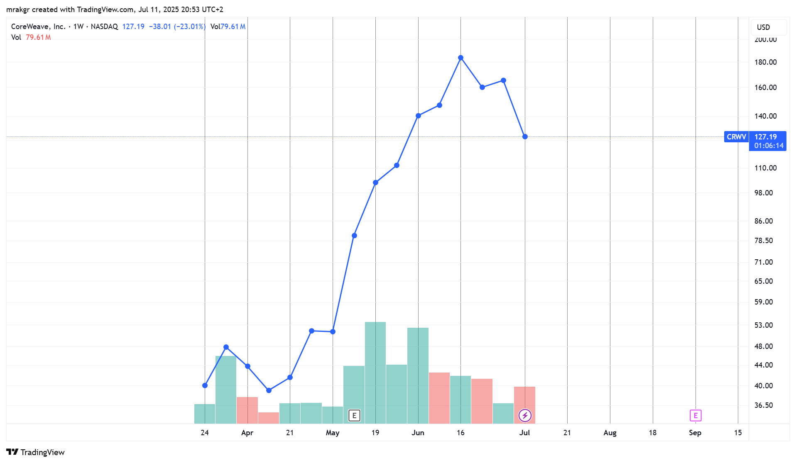

It looks like this on the weeklies. I hate buying runups like these as that just leads to a lot of volatility. Large rises have a lot of pump in them regardless they are smooth or jumpy, which gets followed by a dump. I think the Quantitative Momentum book that I posted illustrated this well. Statistically, large 1 month moves lead to mean reversion while 6 month moves lead to expansion. That's just the statistical view. The counterfactual way of thinking where you are putting odds on various scenarios, would allow you to see while it's true that there is an immediate danger of reversal in the present, you know that the market leads would hold on to their gains even after a huge rise such as this one.

So by waiting a 2 months from this point in time, you can essentially cut off most of the laggards from scenario, which leaves the winners. Right now it might be the case that say, the stock is 25% likely to be in an uptrend, 50% flat, and 25% that it's going to sell off and enter a downtrend, but by waiting the necessary amount of time, it reveals the cards the market is holding.

***

By waiting 2 months the dump scenarios will get eliminated, leaving mostly the upwards trend continuation scenarios intact. At that point, the odds of an uptrend will be 60%, 20% flat and 20% downtrend.

***

I think that's how reasoning by price action works.

***

During my failing period, I don't think I understood this, so what I did was tried following the trend by buying strong runups like the ones in CRWV only to get stopped out.

***

I didn't get what exactly was the point of waiting for the 'handle' part in these chart patterns. Back then I thought that by waiting in this scenario, I'd just be missing out on a potential winner.

***

And I did understand one part correctly - the biggest winners of the future do start out by making huge initial moves like CRWV did here. So back then it made sense that I should be buying when the stock looks very overextended. That didn't work well for me.

***

I will admit, the defense stocks do look overextended now, so there is a possibility that they might go sideways for a prolonged period of time. A part of me thinks that.

***

But we're in a strong bull market. And they are the dominant group, so what else are the investors going to put money but the dominant group. If wasn't for the April tariff tipping the market's hand, I'd be a lot more scared holding these stocks right now.

***

I had to write this because when I talk to you about finance, you always talk about about fundamentals, and I am struggling in the head of the moment to elucidate how to bring out my own perspective because you are thinking in a very different way than I do.

***

Oh yeah, incidentally, do you know know why cutting losses is good in trading?

***

Assuming you are long an uptrending stock, and the price declines an abnormal % below your buy point that gives you important information. You know how winners act, and they don't do sharp declines, so you know that the odds have changed. Instead of the odds of an uptrend scenario being 70%, a single day's price action can lower it to 40% and make other less beneficial scenarios much more likely. If it takes time, say two weeks and doesn't recover even if it's something like being 10% down, while that might not damage your account balance much, it can do great damage to your estimation of whether the stock is a leader! So the rational move becomes to sell and move that money in better opportunities.

***

In your Curve trade, you were never considering the trend of a stock to begin with, and you didn't sell it when it fell. But that's fine, from a technical perspective it wasn't in an uptrend, so it going down 10-30% didn't invalidate your investment thesis.

***

The way I see it, when you bought it at 0.3 it was a sideways, choppy non-trend, and at 0.2 it was still in the same scenario. From that perspective, nothing abnormal was happening. So it made no sense to sell when it went down.

***

With Maple Financial, it had a definite trend and you could trade based on whether it matches the profile of a winner, with stops in order to limit your risk.

***

It's a different world from value investing.

***

From my current perspective, trading is easier than it seemed. You know that daily price action is mostly random, so you don't have to be hung up about specific patterns. It's mostly about momentum on various monthly timescales, and volatility on the shorter ones. Of course, if you are fishing for uptrends, then you want to hold winners as 1 month momentum when you're heading into it positioned long verifies the trading thesis. Strong leaders have to go up on the 8 - 12 week timescale. The best ones do it on an 8 week timescale.

***

Up they start going up far too quickly and the volume starts coming in, that's a sign to exit as the large traders will be taking advantage of that opportunity to sell the stock to future bag holders.

***

If you miss this opportunity, the only other option is to sell on declines once the 8 week pattern starts breaking. Alternatively, the declines can become particularly large even before the 8 weeks are up which is another sign of trend change. I've also notice that often the leaders will slow down even if they don't turn and that's also a sell signal. Strong upwards momentum becomes weak upwards momentum, and that makes the stock vulnerable to a selloff.

***

I think that what I am most afraid of when it comes to euro defense stocks right now. Then ran up so hard that I wouldn't be surprised if they start getting exhausted. We might end up holding weak leaders rather than strong ones. But we can still make money from that scenario.

***

I am also starting to become bullish on BTC due to it's price action. If it can break out gently and maintain the level for a few weeks, that will make it likely that's in an uptrend and not in a consolidation. I wouldn't expect BTC to make a strong move like in the past, but maybe it could uptrend for a couple of months once it gets going. The beauty of strong leaders is that they give you a lot of time to get in.

***

It's the stocks that act jumpy and run away that are bad trading candidates.

***

The market is very strong right now so I doubt that BTC will turn into a rout, but the breakout might fail and it might consolidate for many months instead.

***

Incidentally, why is pyramiding and averaging up good in these situations?

***

The theory behind is that when you have a probable uptrend, but not a confirmed one you bet small, and as the odds of it rise, you commensurately adjust your size to account for the improved odds. It makes zero sense if you already have a confirmed signal to get in.

***

Also psychologically it becomes easier to buy if the trading vehicle moves significantly from the buy point if you have half or a third of your position already.

***

Going into the future, I'll be using that technique to scale in every two weeks from low points - like after market panics, rather than breakouts.

***

It makes sense to do this after market panics because how the market acts after panics tells you a lot about the true environment. In bull markets the low prices get bought up, but in bear markets the buying pressure disappears and they head lower. So by buying on the way up, you are using a technique that primarily works in uptrends, and gives you a small loss in downtrends. And gives you some protection against choppy, sideways markets.

***

Going by that reasoning, one trading idea is to buy a partial position in CRWV now and scale in gradually as the odds of it being a winner improve. You know that winners hold on to their gains, so wouldn't make sense to buy on the way down, only on the way up.

***

This is also why averaging down is so bad. It ensures that the trader maximizes his losses on the way down when the stock is in downtrending mode.

***

When you're buying on the way up you don't get the best price, but at least it keeps you out of losers.

***

On a similar vein, by taking small profits often, it leads to rotation into laggards. Though that must be balanced by the fast that strong momentum is mean reverting.

***

The only real defense against short term mean reversion is to be aware of the market themes and buy winners that have potential to run far instead of random momentum picks.

***

Or to be keenly aware of the individual stocks fundamentals and future earnings potential.

***

Mhhhh...I think this should be good enough to illuminate how I think about the markets.

***

One last thing, what about selling on the way up?

***

I think I should do it. Even if the winner is proven, being long after a long period advance will increase the risk. Instead of gambling, it makes sense to adjust position based on odds, and long advances make the odds of a short term countertrend more likely. The advances are what traders are aiming for, but they are also worth fearing. We'd want to reduce our positions when the risk increases and increase them when the risk decreases.

***

Yeah, this should do it. I've never been a good trader, and I have only started crystalizing my experiences in the past few months so we'll see what the results will turn out to be.

///

There was more in the thread, but I'll keep those parts private.

1:15pm. Now comes planning time. I've decided to sell 40% of DEFS and put them into stocks...

1:55pm. I think the main thing I should do now is check out on which exchanges these stocks are trading and get the market data subscriptions. Last time when I rotated my portfolio I did so with delayed data, which isn't the smartest way of doing things.

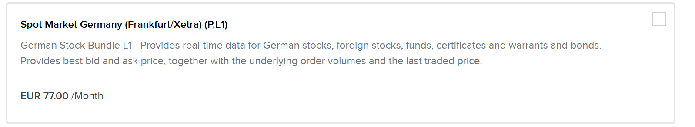


The market data is so damn expensive!


This is the one I need for LTMC.

Ok, nevermind. I'll just look at the delayed quotes as I have and move the limits gradually until they get hit.

I hate paying for services.


But snapshots could be worth it.


Ok, I see it. Nope, I don't have snapshots for LTMC, but I have for US stocks.

1:55pm. Ok, thinking time.

Subscribing to Xerta and Borsa Italiana (BVMI) 77 + 18 = 95 euros per month. Over a year that would come up to ~1,200 euros. So to make this trade worth it, the value of real time data has to be greater than the slippage I'd incur from using delayed quotes.

Even with a 1m portfolio those data expenses would come up to 0.12% per year. For me, they'd be 10x that. Am I willing to pay 1.2% of my annual return to get this data?

I don't think I am.

The slippage would have to be worse than 1.2% cummulative over the course of a year for real time data to be worth subscribing to.

I think I'll just save my money.

2:05pm. With that decided, tactics time. The way I rotated out of AWCS and into DEFS was weird, so what I am going to do this time is plan things better.

I'll go with the prinicple of buying slowly and selling quickly.

On Thursday I'll put in my limit orders and then sell DEFS at the market as they get executed. There will be a short period where I will be leveraged 140% as a result, but I won't go broke due to it.

2:10pm. I think I'll restrain my urge to buy low and just put in orders at the previous day closing price. Some of the time the stock will gap up and I won't get filled, but a lot of the time it should be fine. The problem with most breakout is that they take too long to run afterwards, not that they're too quick! You have to hold them for a month to get the best result.

2:15pm. The problem with the AWCS to DEFS rotation is that I was too squeeamish over being 200% long even for a short time intraday, but I shouldn't have worried that much.

I put in a pretty patient and low limit for DEFS, that I was surprised it got hit. That would give me an edge on the trade.

4:20pm. No, it made sense to play it cautiosly like that and it worked out well in the end so all is fine. I shouldn't consider the way I acted a mistake.

If anything, I should blame myself for not doing enough research and jumping into the wrong ETF to begin with.

4:50pm. I am changing my mind. I am going to first buy RHM, then sell the needed DEFS, then buy R3NK, sell DEFS, buy LTMC, and finally sell DEFS. I thought that I put in the order to buy these and then sell DEFS as they get hit, but I think I want to play it cautiously. I don't want to get caught 140% long on the wrong side of the market. I want to go 120% long at most, which is why I'll rotate the DEFS position step by step.

5:50pm. It'd be best to do this quickly. I should come in at noon when it's quiet and just do the trades at the market prices. It's not like last month where the equities were selling off. Now the risk is that I'll miss the upside.

6:25pm. I guess I'll have to think about this more. I didn't think that DEFS position would hinder me so much. But it's not like I'll break the market by selling it, so I should just do it.

I've had really good luck with limit orders and being patient in entering my trades so I am loath to abandon that.

6:55pm. There are two ways of looking at a bull market. You imagine prices going up as if being pushed up from below. The implication of that kind of perspective is that they might blast off at any moment so I should better get in quickly.

Another perspective is that they are being weighted down and pushed downwards by some unseen force, but bravely and resolutely keep up despite the headwinds. In this pespective, downwards counter-trend moves are to be expected, and the lack of selling pressure means that the stock is resisting the downwards push from above.

After many years, I think that the latter model is far closer to reality than the first one which I had as a beginner.

The lesson is that I should not be afraid of letting things run their course for another week. There is no need to get scared about missing opportunity.

7:35pm. https://www.schwab.com/learn/story/does-market-timing-work

I read this yesterday and it a good lesson. The investor who played the market perfectly buying at every yearly low didn't do that much better than the one who bought at the high.

I think I am probably overvaluing getting in at a better place when the uptrend has been established. It's more important to sit tight than to time. Sometimes I should use limit orders to get in, but I shouldn't let that be my sole strategy.

Especially when I need to rotate, I'd be better off just doing it.

With the DEFS trade, once my first limit order was hit, I should have sold all that I had of ASWC at the market and bought DEFS right there even if it's 5.43 rather than 5.40.

Even if back then that might have been justifiable and worked, if try trading a whole portfolio of stocks like that, it's not going to end well.

I need to loosen up a bit more. The reason I failed a decade ago wasn't because of poor execution, but lack of planning.

My plan back then was to look for a plan. But treating the market like a video game isn't how one adapts to it.

8:45pm. Reading /a/ threads on FX Senshi Kurumi.


This pretty much happened to me. In the end, all the daily noise got to me and I quit. I didn't lose money, but 6 years of going nowhere is quite a loss regardless.

I remember in an interview with Jerry Parker that he said that investors think that trend following is the easy way to make money in the market, but he remarked that trend following is the most gut wrenching to trade there is.

8:50pm. To be fair, what CTAs do is take one marginal trade after another hoping to get lucky.

Momentum trading has a better edge. Compared to regular trend following, I am actually selective about what I trade rather than literally every single intrument in the world.

Here is an addendum to the plan. Maybe spending 1.2% per year on market subscriptions would be worth it if it improves my trade entries. On Monday, I'll take a look at the stocks I mentioned and see how large their spreads are before deciding whether to get a subscription. It's not like I have to keep paying them every single month.

Actually, I don't have to do that. I can just come in 1h before the close, at 4:30pm pick a spot and raise my bids by 0.1% every minute. That's bound to improve my execution, but the risk is that I might miss my trades.

But then I'd be doing that during my work hours...

It be a viable strategy if I were trading full time, but I am not. Gh...

Most likely the spreads won't be too bad.


How about this as entry strategy - I'll just keep moving my bid up to the low of the last 15m. I'll do that move every 15m.

If a stock has large spreads, that will ensure that I don't get raped by them.

If it turns out that the stock is strongly trending during the day, there is a chance that won't work, but intraday price action is noisy and trendless most of the time.

In fact, when it comes to limit orders, I should be using such a system for trading my salary from USDC into EUR.

I've been winging it with larger targets and time stops, and it has been a net benefit, but I know that I am just noise trading, and I'd be better off just shipping that into my stock market account instead.

But I don't think that hammering the market with market orders is the solution either. It sets a bad habit.

I'll decide what to do once I see the spreads.

9:10pm. 


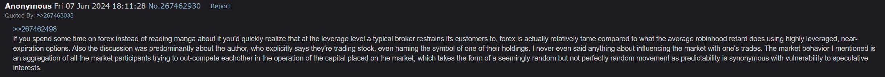

Come to think of it, back when I was studying how to trade, after reading some trading books, I thought that momo trading is the way to trade, but momo stocks are a tiny universe of the whole market. There is no way that big players can take advantage of this style beyond a certain size. That really goes for everything.

But the most scalable approach is definitely value investing.

You have a centibillionaire value investor Buffet, but only centimillionaire momo traders.

Honestly I'd be happy with a cool 10m. Most people would rather have 10 million fast than 100 billion slow, and I am one of them.

I have other things that need doing.

9:20pm. One of the reasons why I must trade is because at this point in time I don't know what my expected annual return is. If it's 100% per year, that'd be fantastic, but even if it's just 5-10% per year higher than index investing that'll still make the effort worth it.

I think at worst, I'll just break even again.

The only way to lose big money with this method is to rid the big winners on the way down - in other words, not cut my losses.

The other way would be to take too much risk, either by using leverage, overly concentrated stock positions, or investing in poor candidates.

With 20-30% positions I'll be getting close to the line on that second point, but that's not over the line. 25% per market leader is just about right.

9:35pm. I could be reading the manga, but the /a/ threads are more interesting to me these days.

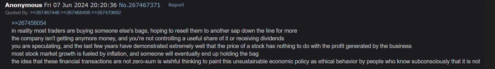
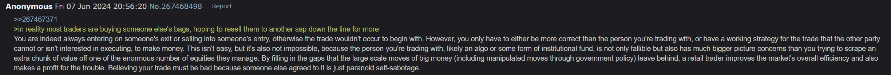

9:45pm. Lol.


10pm. Kurumi-chan's author is hillarious.

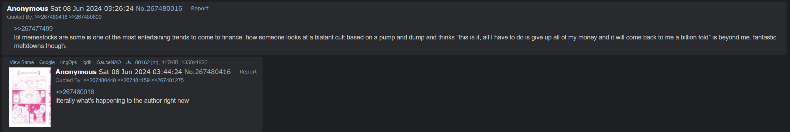
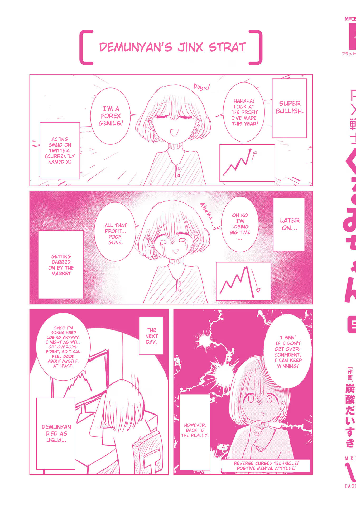


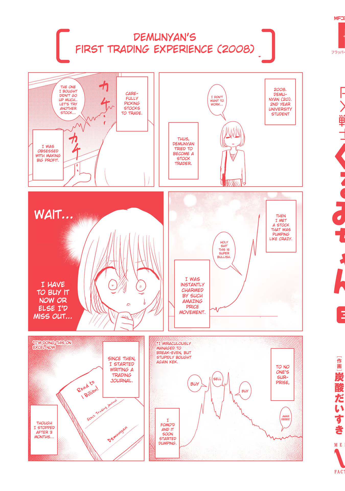


10:05pm. This is insightful

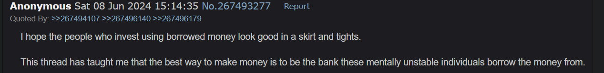
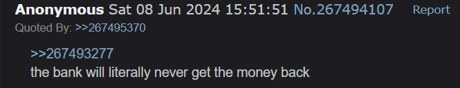


I never realized it before, but this is true up to a point. I never thought that a bank might not care if it doesn't get the loan paid.

I mean, if it never books a loss, where is it going to show up?

This subject might be something worth asking the chatbots in the future. I assumed there'd be guardrails against this, but if a bank is intent on hiding losses only the regulators would possibly know. It's not like banks would lose their own money from making bad loans. They'd just cause inflation.

...No this has to be wrong. If this behavior becomes widespread you get the 2008 crisis. The financial sector got destroyed by the markets at that time once the extent of the losses was realized.

10:25pm. Reading this manga makes me deeply uncomfortable. I've seen it described as psychological ryona, and that description is very apt.

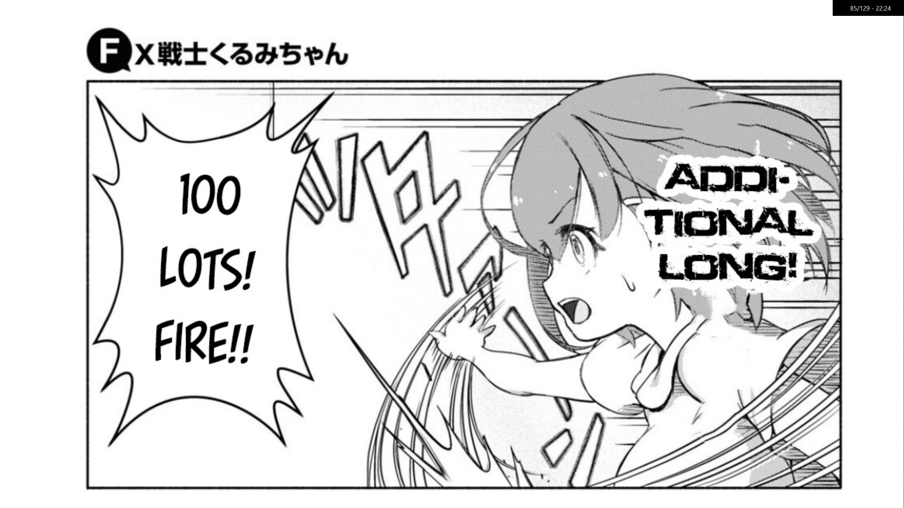

She was already close to dying, why is she increasing the position size after barely surviving?

Does she at some point realize she needs risk management in order to win?

Is this what Jesse Livermore was like?

She should read Mark Minervini's books.


Fx Senshi Kurumi-chan should be a must read for every trader. Amazing how the author trades the same way, and has learned nothing from his own manga. That is truly next level dedication to his work.

10:35pm. You can imagine how well the trade went for her.


I should remember this could very well be me if I leverage myself in the stock market, or bet more than 25% on a single stock. Or don't cut my losses or buy into obvious pump and dumps.


It really hits too hard.

11:30pm. If there is one thing I've learned from index investing, it's that being long the market pays in general. I wouldn't like be subservient to the market, but it is a giant money sucking machine, and stocks that aren't going down are likely to go up. This is the basis of my entire trading plan really. Of course after a certain point I assume that stocks that aren't going up will go down and get out. The 8 weeks rule guides me.

7/13/2025

8:40am. I have two goals for today:

1) Even though I am trading momentum, I think I am still weak in the market timing department. Which is ridiculous.

I've read the Janus Factor book, understood it completely, but the reality is that I am still half assing it.

So let me do something smart about that.

I'll create a few momentum screens specifically for market timing.

2) Yesterday I thought about how I would close my trades if my PC went bust. As precautionary measure, I wrote my 2FA password on a piece of paper and also wrote down the IB password. I've even ordered a printer so I can print out all my sensitive info on a piece of paper in order to back it up. Of course I have it written by hand already, but it's easy to fuck up handwritten notes, so I am going to eliminate that risk from the equation once it gets here. I'll print out that paper, cut it up with scissors, and tape it where it won't easily get found.

But in addition to that, I am going to look into how to place trades from my mobile phone. I don't like the mobile app, but I need to get familiar with it in case of emergencies.

I already have the MS Authenticator installed with all of the 2FA apps there. And I also installed IBKR Mobile on it months ago.

But I think if I try logging into it, it'll be in read only mode. I need to figure out how to do it regularly.

8:45am. A part of me think I should be working working on that poker bot, but screw that. Right now I am cashing in my skills with the job at Tao Ceti.

It's not a bad thing to think about factors related to investing. I need to put the safeguards in place completely.

10:50am. Done tuning myself into the broader market momentum.

Now let me play with the IBKR Mobile app.

12pm. Got it. I figured out where the settings are on my mobile and turned on screen lock. Now using MS Authenticator, I can log into the IBRK Mobile app. As a test I tried putting in a day limit order for RHM far below the market and it worked.

Wonderful, I am completely safe. I'll be able to close out my positions in a pinch even if my PC is inoperable.

7:40pm. Change of plans, I don't want to be bothered on Friday, so I am just going to do it on Monday, 8 days from now. The original plan was to wait 2 weeks, and then come in next week to do the rotation so I should learn from my March experience and not let myself be dragged in. The market has a tendency of dumping on Monday anyway, so I'll wait.

I am 100% long either way so I shouldn't get impatient.

9:50pm. I guess it pays to cover all the bases.

Imagine that the market dumps 5% next week in one day. What exactly would be my plan regarding that?

I am not thinking about these situations enough. Do I just let myself be stopped out, wait two weeks with the intention of pyramiding up two weeks, or do I have a two week time stop before selling at a loss?

The solution is really to compromise and sell half my positions. There is negative EV of being on the wrong side of a move leading into a panic, but what I am trying to exploit are powerful upwards trends, so I shouldn't get into the habit of fighting the market. I did that in April, but I did it with 33% of my account.

If you're trading the index, buying panics and selling when its calm is the only strategy really, but with stocks, it's all about the momentum during the quiet periods.

It'd be very shocked if a dump just came out of the blue though. It could only happen due to a 9/11 type of black swan event.

Right now the defense stocks have their upwards momentum weakened, it's not like in April, so if they get smashed now they'll really crack. I think the upwards momentum has started last week, but it isn't here yet, and there is no guarantee it won't turn out to be a sideways move.

10:10pm. Also I am thinking about BTC. Regardless if I buy or let it pass, one thing I am sure is that I should treat my decision with confidence.

I can rationalize letting it pass, by saying that it feels like a very crowded trade. Everyone in the world is watching it with great speculative interest. And there is no shortage of momentum picks currently so the money that doesn't go towards BTC can go towards something else.

Or I can buy a little in 8 days along with the rest and try pyramiding up every two weeks according to my usual rules. 

Whatever I chose, one thing I am sure is that I must trade with confidence.

If I get in, I must do so with conviction that it will go up.

The market rewards conviction even if it's wrong.

Conviction on holding winners for months, and cutting losses quickly.

I knew the trading wisdom during my losing period, but I didn't understand the importance of conviction.

10:15pm. I want to just let it pass in favor of focusing on euro defense stocks. There is also South Korea. It'd suck having to trade overnight, but it's always a choice. There are also US market opportunities despite the foreign investors exiting those markets.

It'd be a sacrifice to trade Korean equities, but if I want to be successful, I should do it.

That having said...I am only considering this if euro momo leaders stocks start going sideways. I'll have to really think what to do in that case.

Hmmm, it opens at 2am and closes at 8:30am.

I'd have to adjust my schedule, but I could realistically aim get up at 7am. That'd give me enough time to catch the close and place my trades if I wanted to go down that path.

Most of the time, I've already been getting up at 8am lately.

10:25pm. Logris explained to me the reasons why companies are turning into BTC treasuries, but this kind of desperation to get in by the large traders isn't something I'd expect to happen before a big up move. 

The reason is that university endowments and pension punds for example, have their own internal rules against buying the Bitcoin ETFs directly, so they are trying to get exposure to BTC very inefficiently by buying treasury companies instead.

I am pretty sure this wasn't happening during the last bull run.

At any rate, they are going to be the bag holders when the party stops. I don't understand why large investors managing pension funds are acting like retail traders would. There is no way they'll be able to liquidate the treasury companies once the market turns.

But either way, as far as I am concerned this is no way to speculate.

Trying to reason about future price movements like this won't get me far, in the end it's all about rotating into momentum and following the trend.

I've never been successful about predicting price action even once.

If there is anything to garner from the BTC price action, it's that investor sentiment is definitely turning bullish.

There will be good times ahead, for the next few months.

10:50pm. I've come to a conclusion regarding BTC. The way I treat stocks is a conduit for investor sentiment.

I should treat crypto the same way. Buy and sell them in sync with the market as I would any other stock and not think of them in an isolated manner as if they exist in a bubble. Back in 2020 - 2021, BTC might have gone up a lot, but so have many other sectors. Many ETFs went up 100% from the Covid lows, and I am sure the actual momo leaders have gone up many times that during the period, as much as BTC did.

Also, it's possible to interpret the large trader desperation to enter the market as being bullish going forward, so I should just ignore those kinds of opinions either way.

The only question I should be asking myself is whether BTC is better than the momo stock choices and act accordingly.

Forget BTC. Forget individual stocks. Forget anectotal reasoning.

For me, there should only be the momentum. Even though I am focusing on leaders, I must never forget that I am trading the market and not the stocks themselves.

I'll ponder seriously whether to enter the South Korean market over the week.

In addition, I should do more research on other Asian markets. I am curious if South Korea is alone in its great advance. Maybe similar markets will also have great momo picks?

7/15/2025

5:40pm. Finally done with the printer and stock research.

Let me save the messages I sent to Logris here. I am not sure if they mean anything to him at this point, but they do to me.

///


Ah damn, it doesn't seem like IBKR gives access to South Korean markets.

***

It seems it only 2 years ago made regulatory changes that would allow foreigners to invest, but none of the major brokers including IB made the move to allow trading of SK securities. Agh, I was 99.9% sure that I'd have access to it. Nevermind.

***

I guess ETFs are our best bet for this. I think I'll give it a pass myself, as I'd have to use a CFD to trade it. I'd have to pay an extra 2% in fees per year due to that. There are plenty of momentum picks in the markets I do have access to already that I don't want to bother going down that route.

***

Since it's a new ETF, there isn't even a CFD on KDEF currently. I once asked IB to add a CFD on QTUM and they did so. I could try asking them for it.

****

Besides that, even though it's not 30% of the index that's making new highs, the Hong Kong market is pretty strong. 11 / 63 = 17.5% of the stocks in the Hang Seng index have 6 month perf above 50%. Outside the index, even after I filter for price * volume above 1B, there are 104 / 251 = 41.4% stocks on the screener currently. Only 4 stocks are below -33% on a 6 month basis.

***

For reference, in the US, if I filter price for volume above 5b to get 258 in the screener, and then look for 6 month perf above 50%, I get 32 stocks in total. 312 / 258 = 12.4%.

***

The US market is a lot more liquid and larger though. If I filter by 100m price * volume (turnover) I get 2354. Filter that by 6 month momentum above 50%, and I get 182. 182 / 2354 = 7.7%.

***

Damn, I thought it might be better once we include less liquid stocks, but it's even worse. Maybe liquidity is good for future performance?

***

 


Europe is 33 / 276 = 12%. It actually isn't that much better than the US.

***

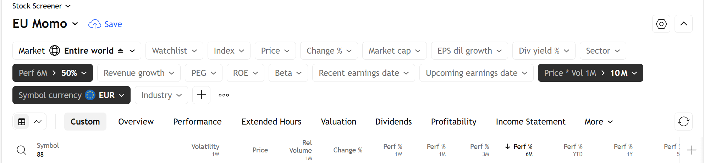 


With a lower turnover, I get 88 / 627 = 14%.

***

There you have it. We should be focusing on either South Korea or Hong Kong. You said that you'll open an account with IBKR, but maybe we both should be looking into South Korean brokers like Mirae.

***

I'll make a ticket asking about access to South Korean markets. The IB reps can be unhelpful and annoying, but I haven't been ignored by them ever.

***

 


159 / 382 = 41.6%. Outside the index, SK is similar to Hong Kong in terms of breadth.

***

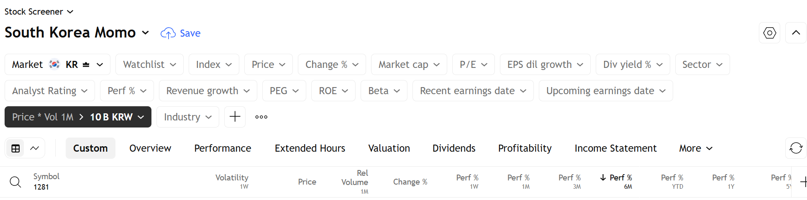 


287 / 1281 = 22.4%. Increasing the universe of tradable stocks doesn't improve the breadth, but reduces it. It seems that for every market, there is a liquidity sweet spot.

***

The South Korean market is actually pretty large with 2.3k stocks in total on it, and this is of similar size to the Hong Kong market.

***

Japan has breath of around 12-14% depending on which liquidity level I am looking at.

***

That's about it. I opened a ticket on IB, asking them about the South Korean market and I should get an answer next week. I'll tell you how it goes.

***

This is roughly how research looks for me. In the Quantitative Momentum book, they've found that rotating the momentum portfolio every month gives the best returns, but they had around 50 stocks in that portfolio. Right now I am still thinking how many equities I want to trade at any given time. Given that the momentum on euro defense stocks is waning, I'll go for 10, and only concentrate my positions to 5 or even 4 when the momentum is particularly strong on an 8 week basis. Right now I am afraid the stocks I am looking at might consolidate for a prolonged period of time, so it makes sense to spread my bets around.

***

After some more research I see that HK's bull market is different from SK's and Europe's. It has a lot of pharmaceutical, IT and retail companies. I didn't see any industrial ones like in SK. Most HK momo stocks are extended at the moment so it's not the right time to enter this market. I am also out of tune with the HK market, so it'd be best to wait for a broader market decline before making changes to my focus. I'll give it a pass for now. There will be chances to buy further down the road.

///

5:55pm. I made a mistake with the South Korea Momo screenshot. Nevermind that.

Phew, I am so tired from all the research today.

The more I think about it the less sure I am that I want to ditch my DEFS position.

When I looked at portfolio analyzer this morning, I was surprised to find that I am up 18% on the year in % terms. It feels like I've been barely threading water, but surprisingly I am up a non insignificant amount.

I started from such a low point, that I am only up like a single monthly salary...which isn't that bad if I think about it. I've been trading for 3-4 month maybe.

Ok, now let me think. If I want to sell my DEFS position and rotate into individual stocks, which should I pick? I'll ignore the large bull market in Hong Kong and Asia to focus on euro denominated stocks.


I am still bullish on euro defense stocks, but as you can see on the chart, their momentum has been waning lately. Last week I though that I should go 25% long RHM and 20% other stocks, but it cannot be justified in this case. I think I'd sleep better at night if I wasn't so invested in it.


It'd be fine to buy R3NK on the way up from a decline.


This one is LSE so that means stamp tax, but it also has a listing on the German bourse. I could just get it there.


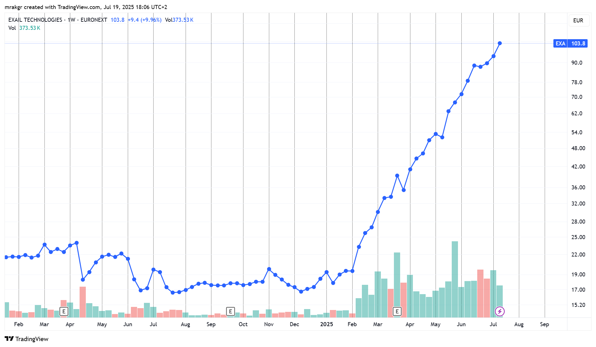

EXA would be pretty hard to buy here so if I did so, instead of the standard 10%, I'd use 5% as my initial buy. Should have gotten it last week. If I'd been trading individual stocks that's what I would have done.

These 8 stocks that I've posted so far have all been defense related. The following won't be.


Casino and gambling stock. High tight flag pattern.


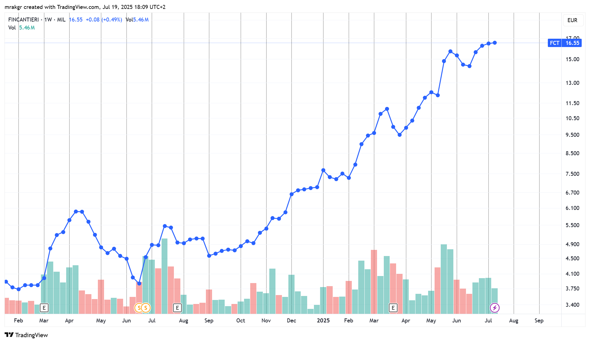


GRE is a bit interesting.


Take a look at this large selloff. Initially, these large sells are a bear pattern, but if the market can resist the selling, after a month or so it becomes a bull pattern. TKA also had this pattern.

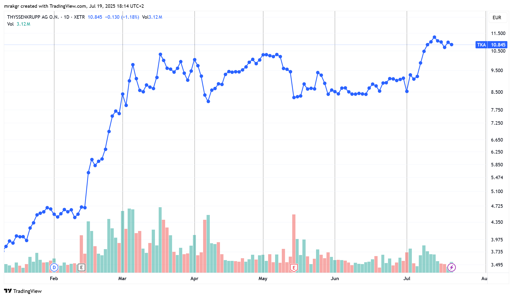

You can see how in mid May it had an earnings breakdown, which is bad. But since the momentum didn't follow through on the downside, now it's actually a bull pattern.

6:15pm. Maybe I should just focus on Europe for the time being and give Asia a rest. Somebody has to trade Euro stocks and it might as well be me.

Ok, so...

RHM = 10%
HAG = 10%
R3NK = 10%
BAB = 10%
LDO = 10%

These come up to 50%.

TKA = 10%
HO = 10%
EXA = 5%

These come up to 25%.

LTMC
ACT
FCT
GRE

Now I need to pick 3 out of these 4...


On review, let me eliminate ACT. The reason being is that it's extended now, so I don't want to enter right here. Unlike EXA, I don't expect ACT to be the next TASR even though it has sweet momentum. 2 weeks ago it would have been the ideal time to buy, but right now, it's not so much.

So that comes down to:

LTMC = 10%
FCT = 10%
GRE = 10%

105% in total. Nice. 2 weeks from now if EXA is still going up I'll add 5% to bring it up to 10 and that will make me 110% long, which is fine. I don't want to be margined, but going up to 110% is ok.

Let me just do it. ETFs are training wheels and trading them will hurt me in the long run. It's best I give myself the flexibility to trade whatever I want. Maybe I'll lose my profits for the year through these actions, and it will turn out that I am not suited for stock trading. But I will take that risk.

On Monday, I'll come in at 2pm, which is 3.5 hours before the close, sell my DEFS position and start buying these 1 by 1. I'll go with the strategy of buying 15m lows that I discussed last week.

Let me organize my IB watchlist in advance.

7/20/2025

12:40pm. Ah, I fucked up. I might not have time to figure out how to trade a basket of stocks on Monday.

My original plan was to buy the stocks one by one, but that won't cut it. I need to figure out how to trade them with a push of a button as a basket.

Trading a single ETF is much simpler in comparison.

Let me finish the book by Tom Basso and I'll watch the IBKR vids on basket trading.

https://www.youtube.com/watch?v=-U8tLqrVrII
TWS BasketTrader Part 1 – Create a Basket

https://youtu.be/lRFjzorhBVo
How to use BasketTrader by Interactive Brokers for swing trading

I'll have to take a break from my job tomorrow in order to figure this out while the market is open.

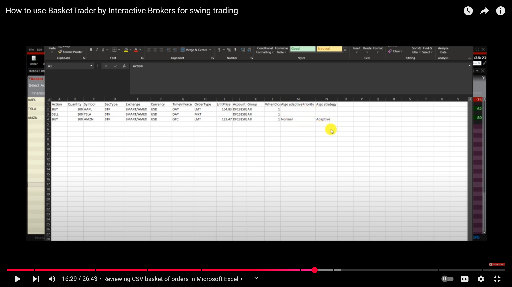

What are adaptive limit orders?

Sigh, I am going through so much trouble simply because I don't want to spend even a day not in the market. If only I could sell DEFS and then gradually buy the stocks that I want this would be easier.

But I don't want to do that. Being away from the market even for a day means I could lose 1-2%.


What are these multi instrument tools?

4pm. Those things are useless.

After playing around with the platform for a while I see that I am best off using the watchlist + chart combo to trade. I can place buy and sell orders using the chart and that will work well. I tried using BasketTrader, but it's buggy. For some reason the Total Quantity columns kept saying it's different from the Order Quantity and that freaked me out.

The plan I am going to follow is to rotate my portfolio in 30% steps.

I've put in a limit order to sell 30% of my RHM position, and 10% buy order to buy RHM, HAG and R3NK each. For periods like these I'll allow my margin level to go up to 130%. If my DEFS gets sold and none of the buys trigger, I'll add 3 more longs to the mix. I'll move the orders after every day's close.

Instead of trying to do things quickly, I'll try to do things slowly.

There is no helping it.

I sort put in orders and cancelled them, so I hope they don't get triggered by accident on Monday and give me double buys.

In the end, I guess process I'll be following will be similar for the ASWC to DEFS rotation. At worst, I'll sell 30% of my DEFS and not have any of my buys trigger. That would be bearable compared to exiting the market 100%. If that happens I'll keep pulling my limit orders for the individual stocks until they trigger. If I see a good opportunity in the individual stocks to buy on a dip I might decide to get active during the day, but otherwise I'll just take it slowly and adjust my orders after the market closes.

7/23/2025

9:20pm. https://youtu.be/f19bfHpCths?t=365

The second interview is really interesting. He says that instead of buying and putting on a stop loss, the retail trader should instead put an order where the stop loss would be.

This week I've fucked up the rotation and am getting killed in the market. I'll do a review on Saturday.

In short, I've overestimated how willing I am to be 130% long in a declining market. I've gotten whipsawed really badly.

Also in the future I'll just pay the damn spread and be done with it.

Sure I might be giving up 0.1-0.2% every time I rotate my portfolio if I hit the market bids and asks directly, but that's still much better than letting the market end up dictating my level of exposure because I used limit orders.

I've gotten way too lucky on the ASWC to DEFS rotation and it gave me bad habits it seems.

Well, in situation I just need to hold.

I've been thinking and I'll dispense with the strong momentum rules. I don't feel like selling even though the 8 week momentum has dried up. I'll take a risk and wait until the end of the next month. The market will tip its hand by grinding up slowly before accelerating.

As long as the move isn't very overdone, I think that sitting tight is the right move. So far it's been only 8 months into the defense stock bull market. There are likely 2 more years more to go.

Weak momentum in an uptrend is a sell in the late stages, but a buy in the early stages. I'll use my intution to decide whether to hold or to sell.

I just want to experience what it's like to be long big winners in a bull market.

There are three main things I can control in the market:

* My trading instruments.
* My position sizes.
* My holding periods.

I cannot really control the entries and exists. I can only control what I trade, and how I size those trades, and how long I hold the positions for.

I won't make money by timing the market's random number generator.

I need to hold the trades for a few months at least to get the benefits of the uptrend.

I only really started buying euro defense stocks in mid June. Or maybe even mid May earlier if you count ASWC.

So far the trade isn't working out, but how about instead of giving up I hold for another 3 months?

That should have some effect.

I am even thinking of changing my style to ignore bull market corrections. Long bear markets when the six month momentum turns negative sure, I'll avoid those. But I don't want to give up here. I don't have any good way of anticipating them anyway. When their momentum was strong, the defense stocks pretty much brushed off the April panic anyway. Minervini says that traders would be better off ignoring the market on a day to day basis, and there might be something to that.

If the position actually start stopping me out, then fine. I'll accept that. But right now the market isn't declining, it's consolidating and slowly uptrending.

7/26/2025

10:45am. I fucked up big time with those limit orders. On Monday the 3 buy orders for RHM, R3NK and HAG got triggered, but the DEFS sell didn't leaving me 130% long in a declining market and I had a very stressful time this week as a consequence. Fuck.

I am not sure how much I've lost relative to what I would've had I simply bought at the market and paid the spread, but I probably set 1.5% of my net worth on fire for no good reason. Shit.

My plan for how to rotate into the stocks that I wanted was very undefined. I have the rules for how long to hold and when to buy and sell in general, but I was far too lucky with limit orders in the past few months and this week it was time to pay the price for that.

The initial mishap with limit orders aside and all the stress that came out of it aside, I think I did manage to find the plan in the end. The best thing that I could have done is to come in 45m before the close and just buy the stocks that have declined at the market. This was roughly what I suggested, but discarded in favor of limit orders.

The biggest mistake that I made was overestimating my risk tolerance. I told myself that being 130% long would have been fine, but once the market starting selling off, I definitely felt a lot of pressure to reduce down to 100%. And in fact that's what I did. Had I not taken these dumb risks and paid the spreads I would have gotten far better prices for my DEFS sales. I think I am down 5% from the highs of last week currently. It would have been 6% had I not bought EXA and it went up 20%. On 8th August I am definitely buying more. I might have to break the rules on not buying on sharp rises as this stock is a momentum beast, it might really be the next TASR. Stocks like those rarely offer good buy points.

I usually don't like buying stocks that are up more than 20% for the month, but I might have to consider buying EXA in small amounts to average up even if it's up 30-40%.

Also, if it dips next week to 110 by the end of Friday, I think I'll risk it and buy another 5% to increase my position to 11%.

Then I'll aim to buy another 5% two weeks after that.

It's true, the stock might top at any time, but that goes for any stock.

Given my style, I'll make most of my money from exceptional situations where a stock keeps going up for many months after I buy it.

Averaging up will reduce my profits from regular trades, but it will keep me in the game of holding momentum leaders during their ascent.

Let me go over all of my trades in turn.

First on, 7/21 I bought RHM, HAG, and R3NK for about 10% of my portfolio each.


Wow, I pretty much got in at the worst possible time on RHM at 1837. The limit order that I put in was probably the daily high. The other two aren't any better.

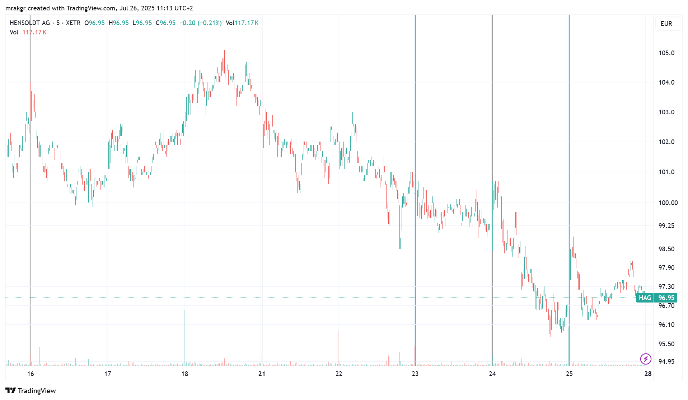

I got HAG at 103.

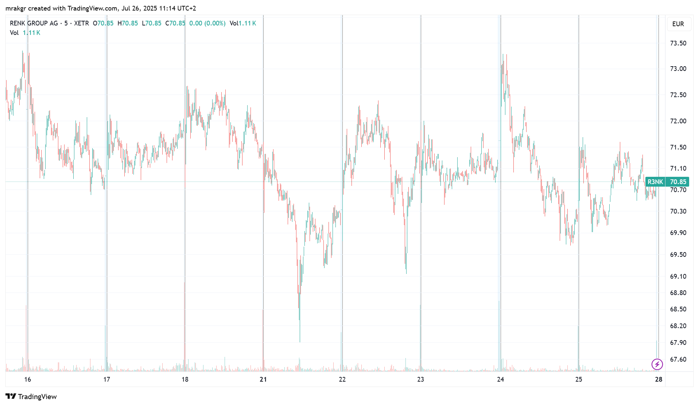

I got R3NK at 71.2.

While I got destroyed in the first two, R3NK was relatively strong so I didn't suffer as much.

What I did with DEFS was really horrible. I should have just recognized my mistake and sold right there on Monday's close in order to rebalance my portfolio properly, but instead I decided to put in a limit order near Friday's highs at around 5.85. So when I sold it later in pieces, it was because I absolutely didn't want to go above 130% long and was forced to make room for other stocks that I wanted to buy.

That covered what happened on Monday which was 7/21/2025.

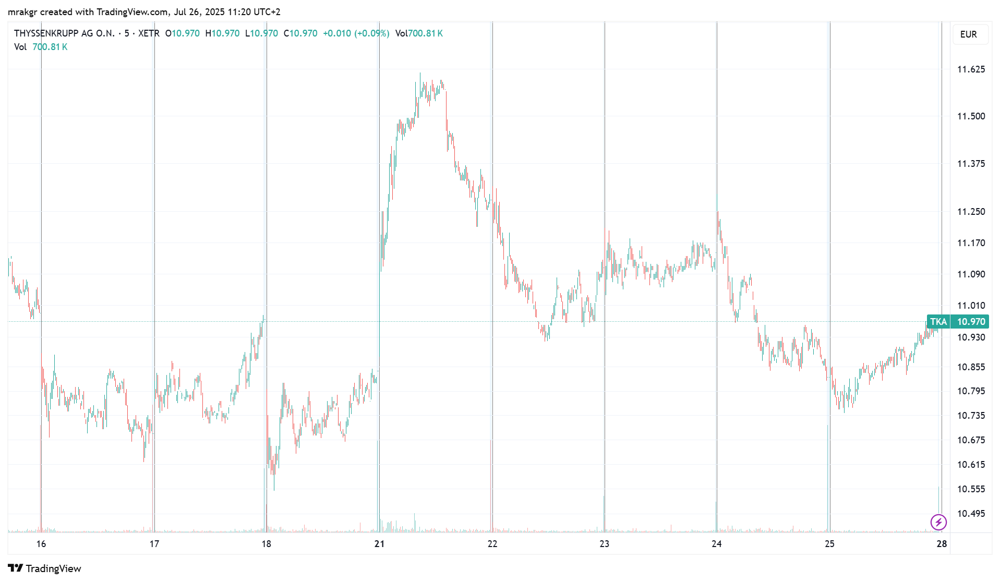

On Tuesday I bought TKA at 10.945. On Monday it had a huge rise and I regretted not getting in on Friday, so when it sunk so sharply on Tuesday I decide to pull the trigger and got it on the daily low.

I sold DEFS at 5.65 to make room for it. There were a lot of DEFS trades that day so I'll go over it later.


EXA was the only 5% position in my portfolio and I bought it at 100.6.


I got GRE at 66.3.


I got LTMC at 24.3.

Let me calculate how much of DEFS I sold that day.

Around 45% of my entire position at around 5.65. At this point I had resorted to using limit orders to enter and exit positions, but they were more similar to market orders as I'd put in a limit order close to the market and then drag it closer to the current price. It's like using market orders, but I am not letting the broker completely decide the price that I get it. Some of these stocks are very illiquid so there is no sense of risking getting bad fills.

Since I am still using delayed data, I don't know what the exact bid/ask quotes are in order to put in the order at midpoint, so I ended up hitting the market.

At the end of Tuesday I had 7 of my desired buys and I was 120% long the market.

On Wednesday...


I got HO at 240. I did that at around noon when it sold off, only to watch it dump more near the close. At that point I realized that playing with limit orders and getting in at noon was a mixed bag for me. It wasn't worth the stress I was having to endure, and even for the AWCS to DEFS rotation, had I not bought it near the lows at 5.41, but near the close at around 5.45 I would have still been fine. What really matters is waiting a few days to get a better price, not picking the exact low and trying to avoid the spread.

Every time I'd buy a stock like this, I'd sell 10% DEFS to compensate. I managed to get out of it at 5.69 that day. In fact, since I don't have a position in it anymore, let me grab a chart of it from the IBKR platform. As mentioned, the IBKR version has a lot more intraday data. I'd like to post a TradingView one instead, but it barely has anything on it.

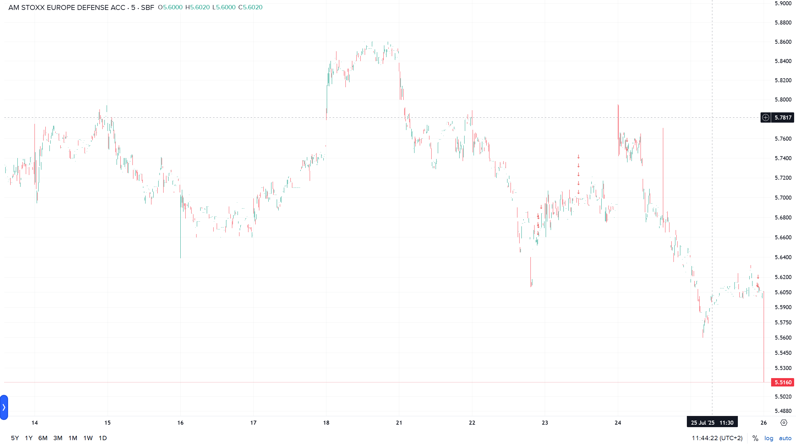

Oh, it has the red arrows showing my trade times. Yeah, it was pretty horrible experience all around doing this. I've learned the wrong thing from the AWCS to DEFS and the ESPO to AWCS rotations. They taught me that if I mess with limit orders I'll make better trades. Trading the EUR/USDC with limit orders every time I got my salary and getting lucky was the start of that habit. The only reason it worked then is because I had the leeway to be patient and wait for the limit to be hit which I didn't have this time around.

Since I didn't have the leeway, I should have just dumped that trash right at the market and bought what I wanted.

It's not so much the loss that made this stressful, but the fact that for the duration of the week, the trade had gone out of my control essentially and the market itself was controlling what my level of exposure to it was. I had that limit order far higher than it should be. Maybe next week I'll recoup the losses thanks to the bull market, so I could have held on for longer, but that wouldn't have been good trading. I have to think about the possibility that the 3 weeks won't be rossy for me and control my risk in case that ever happens. So I had to sell as I rotated, I couldn't have let my level of exposure spiral out of control.

I didn't want it to be even 130%. 110% long is my hard limit. I'll never let this happen again.


On Thurday I bought LDO at 48.7 an hour after the open. I got baited hard by pullback after the initial positive action, and got in at the start of a negative trend day on the wrong side. Sold DEFS at 5.736 to compensate.

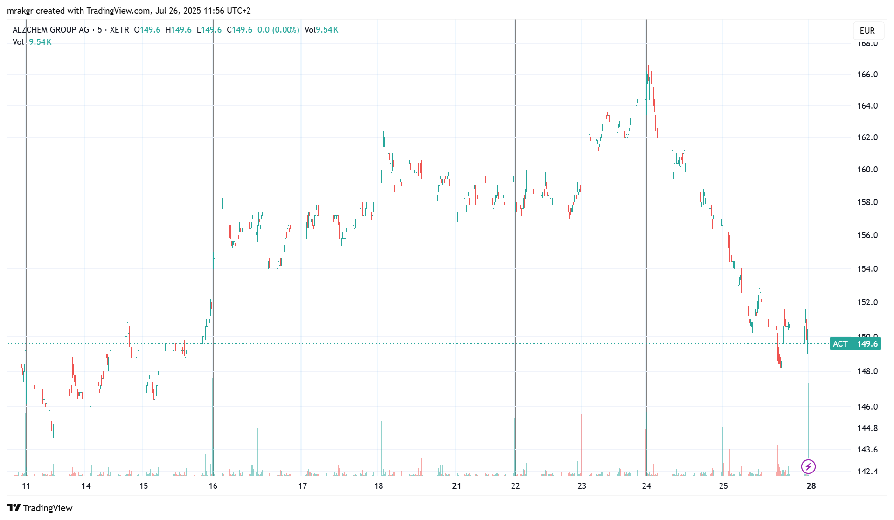


And on Friday I made my final two buys: ACT at 150.2 and FCT at 16.58. I wrote that I'd buy BAB instead of ACT last week, but now that I've changed my strategy to using market (limit) orders paying for the truck sized spread or the UK stamp tax is much less attractive to me. I thought about it for a while and decided to just give it a pass.

Instead both ACT which I had been considering on previous week's friday, but decided to avoid in favor of BAB and FCT had precipitous declines so I decided that the best time to get in was now.

I also liquidated the last 30% of my DEFS position at 5.605.

That puts me at around 108% long at the moment and I am satisfied with that.

We'll see how this will do in the coming weeks. The defense stocks have a lot of earnings reports coming up which could affect the whole group in either a positive or negative way.

I've been long the defense stocks for a while now and they've gone nowhere, so I want to see some positive action by mid to late August otherwise I'll have to get out fundamentals or not.

If they resume their act as market leaders I'll make a lot of money and if not, hopefully I won't lose too much.

That's momentum trading for you.

The system I am using is mostly price action based and it's not a particularly complicated system.

My stocks might go down in the following weeks and give me 10-20% losses that would leave me out of 1-2 months salary, but I've learned that I need to take risks if I want to attain anything.

I've only started trading this system, and I don't know how well it will do in practice. It's not like I backtested it. I only know some principles that I am trying to internalize.

A year or two down the road, this might turn out to have been a failure, but unlike a decado ago, I want to be able to say that I gave it my all.

It has a chance of succeeding and I don't want my failure to be because I've been too scared to enter the waters.

I want to be in control of my own fate.

If the market won't give me what I want then so be it, but I'll try to get it from it first.

I've spent a lot of time thinking about the market and if I want to make profit part time, I just cannot trade in any other way than this. If it doesn't work, then I guess I'd have been better off as an index investor.

7/28/2025


Had to screenshot this. This does explain why people don't just fill up their portfolio with market leaders. The volatility is eye watering. Since Thales broke through long term support I decided to sell it and buy EXA instead and SAAB_B.

Compared to the Friday on the 18th, I am down a whole monthly salary now, but I still feel like I am on the right path here. I believe in this method. If the euro defense stocks really are destined to top here, I'll sell in 3-5 weeks next month. I'll stick to the plan.

I made sure not to use too much leverage, and I am currently only 110% long. Once I get the salary I'll bring that down to 100%, so I am not worried about getting a margin call.

What might happen next week is some stop hunting. A big trader could chicken out and we could see the bids pulled temporarily.

It's really important to hold here and give the trade time to develop because after the hunt is done the stocks have a tendency to blast off to the upside.

Traders get paid to take on risk. I am not going to get anything by bailing out every time I am under heat.

The 8 and 12 week rules exist for a reason.

7/29/2025

6:35pm. It's ironic, yesterday during the day I was pretty cool, but after the market closed I started getting anxious.

At some point while I was in bed I decided that I don't want to look at the market at all for the next 2.5 weeks, not until after the 15th August close.

So that is what I will do.

Yesterday the market leaders were selling off strongly, and I think that based on how panics happens quickly that there might be a stop hunting type of selloff this week, perhaps even today. I don't know, I won't look at it. There is no point in me looking at it, and if I get anxious, I might end up panic selling.

If I lose on the euro defense stock trades then so be it. But I don't want to lose because the leaders dipped 10-15% on the day and I closed my positions out for the sake of mental relief.

Fear could prevent me from keeping my winners and fear could make me close out my positions far too soon.

I am using almost no margin for a very real reason. So I can keep hold of my positions.

Sigh I am so weak. For the sake of victory I decided to look away from reality.

It's really making me glad that I have this job now, so I can feed my account in case of losses.

If you look at the monthly charts of the market leaders, they are very smooth, but on a particular day they could be moving 3-5% both up and down on average. It's pretty scary to load up your porfolio on them.

But at the same time, it makes zero sense to keep a part of my portfolio in cash in a bull market. So what I am doing now is the only choice.

If I only look at the 2 weekly closes, it will smooth out my equity curve and my emotional state.

Ironically, that's how I started out trading back in March and April and the ASWC to DEFS rotation drew me in, and I was having fun for a while watching the markets, but now it's time I withdraw again.

I'll focus on programming, top up my account in the next few months and try again if I fail.

I don't think I should lose too much on euro defense stocks, but it has to be noted that the 12 week rule is more dangerous than the 8 week one.

If you use the 12 week rule at the top of the market, you'll get hit hard. The 8 week rule in contrast will let you off much more lightly.

Rather than sheared, I might get skinned alive in August.

6:50pm. Ah whatever. Trading blind is a tool in my toolbox. It could turn out to be a particularly potent tool. Being anxious about the market constantly is worse than actual losses. And while doing it blind will enlarge my losses, it will make holding winners much easier.

Unlike what O'Neil and Minervini say, I don't think it's necessary to cut losses at 7-10%.

They should be cut whenever a decline in a stock indicated a potential trend change.

Compared to using a time based stop like I am doing now, they will give me shorter losses, but also lower my winning percentage significantly.

I want to aim to keep my losers for at most a month, and my winners for as long as the uptrend continues. I am not sure how long that will be, but I'd like it if I could hold my winners for 6 months.

The longer the better.

7/30/2025

9:25pm. Here is what I wrote earlier in the day in the company's Discord. It's pretty much my journal at this point. The other guys don't really talk to me much, it's too bad.

///

I'll be pretty focused this month as I've detached myself literally from the stock market.

***

Last week, the poorly done rotation whipped me badly and the Monday selloff in the euro defense stocks made me very anxious after the close despite me being so cool during the day. Last week, I've rotated my entire portfolio from the defense ETF and into the individual market leaders, but the leaders themselves have 3-5x the daily volatility of the stock market indices, so it feels like I am 400% long the stock market despite not being on margin. This is probably the reason why the momentum strategies aren't more popular.

Here is how it looked for me on Monday:

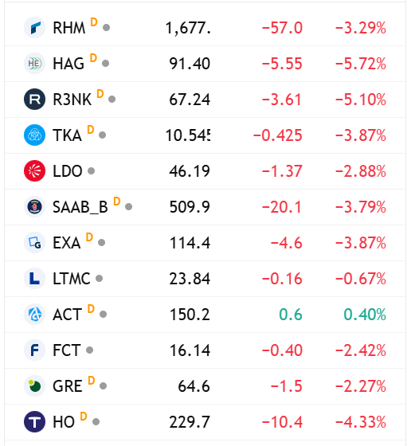

***

Over the past few months I've been studying the market and I've been coming up with rules to apply on top of the base system, but even though I have a plan, I've been really getting punched in the face.

***

Given the Monday weakness, and the fact that selloffs happens quickly, I thought that this week would be the ideal time for stop hunting to happen in the market, and I've realized that in my mental state if I saw half the stocks in my portfolio being down 10-15% in the morning that I've would definitely sell in a panic, plan or no plan.

***

So my decision is to go back to the bare basics of my trading system which are time based rules. 8-12 weeks for holding winners, and 2-4 weeks for selling losers. I won't look at the market at all until the end of August.

***

The reality of human behavior, and I not an exception to this, is that our decision making tends to have an element of randomness to it.

***

Therefore, if I am watching the market constantly, like once every hour while the market is open for the day, for around 8 times per day times and 22 days per month, that means I am making over 160 trading decision per month for every single stock in my portfolio. That is essentially why it's hard to hold on to winners. In addition to that, the price based rules get tweaked, so it's easy to sell losers quickly and generally churn one's account.

***

Back in March - May I was only looking at the market once every two weeks, and have been cool during that time, then I started having fun, but now I want to detach myself from the market again. I've started to sense that I've started spinning my hamster wheel and rationalizing. In programming I can focus hard on a problem and come up with novel insights and designs, but in trading no matter how much I focus and think I won't be able to predict the future any better. Being smart in the market would just build up my anxiety that much faster. Thinking about the markets would only feed my demons.

***

Sigh, but this is admission that I basically cannot control myself in the markets at all. It's pretty disappointing.

***

Well, if the trades work out, I'll comfort myself by counting the euros in my account. And if they don't the salary I am making from this job will be enough to bring it back to even.

***

I know that the fear of losses is often worse than the losses themselves.

***

I am still a kid.

***

I might be nearing 40, but I haven't grown up at all, to be affected so badly by the market. The only thing that has changed in the last two decades is that I am willing to accept his about myself. I cannot help it that I am weak, but compared to my childhood days I recognize that strong feelings will not make me strong. They won't catalyze the transformation in myself that I desire.

///

9:35pm. In the end I haven't really found the holy grail, but moving my focus away from price and towards time is the key that will unlock my trading. Deciding the timescales for losers and winners is all that I need.

I have some price and volume based rules, but they are overrated. I don't need them.

Make no mistake, the decision to go back to fundamentals and not even look at the market is a pretty ballsy one.

It's a pretty aggressive way to trade.

10:55pm. https://youtu.be/OjUDJEXxPyE
Lance Breitstein: Verified 8-Figure Trader Gives Master Class, Scalping Strategies, Edge

This interview is actually pretty good. I thought it'd be a scam trader, but he knows what he's talking about.

7/31/2025

10:10pm. This is nice.

I could be down big right now, but because I am not looking at either the market or my account, I could care less about it.

This kind of trading that I am doing surprises even me, but I guess I've been heading in this direction for a while.

I started with William O'Neil's book, but in the end, the form my trading will take will only have a loose resemblance to what he and Minervini recommend.

There is no doubt about it - because I am using time rather than price stops, I am going to have situations where the stocks blows past the usual 7-8% recommendation and is down 20-30% by the time I look at it.

But on the flip side, the current ruleset means that I will be letting winners run much more aggressively and will be benefiting where more conservative traders would have exited prematurely.

Guys like Minervini and Zanger are awesome, but I am not interested in being glued to the screen like that.

I want to trade in a much simpler manner in the end. I wish stocks had smooth moves on the daily charts, but they don't.

Back then, I wanted to make money trading, but I never once wanted to make trading my main occupation. I wanted to hit and run, but now I am different.

I want to make trading a part of my lifestyle and live in peace with the markets.

I might end up living long, and if I am getting exhausted by the trading effort, I'll burn out.

Even if I never end up being good as the market wizards, and I probably won't, it should be good enough if I manage to take something out of the markets.

I have some rules about climax tops and bottoms. The interview with Lance Breitstein was pretty good, it reinforced some of the things that I had been suspecting. After blow off panics, I could probably mix my monentum style and buy value stocks that show the appropriate trend persistence on the monthly charts.

I had thought that I should keep track of the markets in case my stocks explode in either direction, but nevermind that. I'll leave those opportunities to the more active traders.

I think that if I am really bad as a trader, I should make the market index return at worst, or break even.

I couldn't have possibly pulled this move off back when I started, but I have a decently diverse portfolio so I know based on experience that in the short term I'll make close to the market return.

The quality of my picks isn't so bad that the market will end the August flat, and I'll be down 50% or something ridiculous like that. More likely I'll be within a reasonable range of the index.

I am afraid that if this is a blow off top in defense stocks, and if it is I might get crushed in August, but more likely this is a consolidation before a further upleg.

If this is a top, I'll get crushed in August, and if it's a consolidation according to the momentum rules of market leaders, August should be when the upmove resumes since it didn't happen in July.

I'll wait a month and then flip the cards to see what they turn out to be.

Rather than being nervous, I am filled with anticipation now.

I thought I could do better, but watching the market and my account fluctuate up and down and trying not to go on tilt is like watching porn and expecting not to be aroused. Or drinking alchohol and expecting not to be drunk.

I am an idiot. Just what did I think would happen?

I guess I do need the post-Singularity mind editing technology to properly stabilize my mind frame in the face of price volatility.

10:35pm. I'll forget about the grand desires and just take whatever my system gives me. I'll ride out the ups and the lows, keep my portfolio stocked with stocks in strong uptrends and see where the journey takes me.

If August turns out to be a dump, I'll take my losses and wait a month before trying the same stocks again if they are acting well.

I am not sure if I could do better by cutting losses quicker, but I do believe in my time based rules. There is something to them.

There is also a chance that defense stocks end up doing nothing and finish the month flat. In that case I'll sell them and wait until they start moving again.

But in this situation, will RHM for example just start consolidating for 3 months in a row? I feel it's unlikely. True leaders move on the monthlies.

10:45pm. If it ends up working well, this kind of trading where I keep the market at a bay and only look at it once every 2-4 weeks will be reasonably novel. I've never seen anybody suggest trading like this. It's like I am breaking all the rules by doing this.

The time based rules system I am using cannot be simplified anymore than it currently is.

I feel that this way of trading truly defines who I actually am.

It suits me so well, in good ways and bad.

It's not the best, but I like it.

If it fails, I'll accept it.

If few years from now it turns out that I've only lost money using this approach, I'll be able to walk away from the market for good. I'll become an index investor and focus my effort on that poker bot that is currently on hiatus.

But getting this job at Tao Ceti shows that my luck isn't as bad as I thought it would be. I thought I was cursed, but I lucked out in the end.

Maybe my trading will turn out the same?

8/3/2025

Here is what I sent to Logris just now.

///

I won't be looking at the prices of my stocks until the end of August in order to avoid panic selling on shakeouts and let the trades develop, so we won't have much to talk about related to finance on Monday. Right now I am just watching trader interviews and here is Chris Camillo who's one of the market wizards profiled by Schwager in the latest market wizards book that I posted on Discord: https://youtu.be/aZlBMDXNMA0

He has the most innovative and out of the box method of using social data to trade, and doesn't even use charts or fundamentals, we could both learn a lot from him. I am surprised that he has his own Discord community (that he ironically calls Dumb Money) and is teaching other people to trade in his style. Coming back to trading after over a decade of absence, I feel like the level of resources available to retail traders has gotten far better than then. I don't have the time to do it full time right now, so I am using a basic momentum system based on time rules instead, but if I were intending to do this full time I would definitely be looking more into this.

///

I need to get into this at some point. I might end up trading full time down the road, so I should join this Chris' community and see what I can learn from him at that point.

I also watched the interview by Rob Booker, and there was an ad for Cobra Trading. Maybe if I opened an account with Cobra I could find borrows in order to short pump and dumps, Tim Sykes style. IBKR never has the has the shares available so that strategy would be impossible with it.

Over a decade ago, I want to try out that strategy, but I only had 3k in my IBKR account so I doubt I could have opened one with a better broker for this kind of style. In the US a 5k is needed in order to just open a margin account. Back then I couldn't have even daytraded had I wanted to because of the pattern daytrading rule, so that would have been another challenge to overcome.

Agh...

Could I have traded a portfolio of 10 stocks back then like now? 300$ here and there? I doubt it. 3k is just so low.

Undercapitalization imposed all kinds of restrictions on me, both real and mental. The only choice was to fail.

But now I can do it properly. I don't have to feel pressured to trade, to limit risk, or to dart in and out. I can just focus on holding my winners to the exclusion of everything else.

4.5 months into my trading career with a bigger account, and I am trading completely differently than I did back on. The end of August cannot come soon enough. I've been browsing /biz/ and it seems there has been a big selloff in the market last week. The S&P finally cracked and it seems Bitcoin sold off, I don't know by how much for either. Don't know how my own portfolio has reacted to that, but it cannot be good. But it doesn't matter.

RHM can go down over 50% at some point in August, but it doesn't mattern as long as it closes above 1900 by the end of August.

I feel that if nothing else, this kind of attitude is strong. Anybody capable of saying this cannot be a weak hand. There has to be an edge in it.

I know that the market definitely has a habit of selling off below support before blasting off to make new highs. This kind of system was the only thing that I could have imagined working well given that kind of behavior.

12:45pm. Oh, it seems Chris Camillo wrote a book 'Laughing at Wall Street'. I just got it off Libgen.

1:50pm. 

Oh my god, having pro traders explain their setups is a huge advantage that I didn't have back then. I could watch these videos and take the best ideas applicable to my style.

I know just by looking at this that huge declines after strong 1-2 momentum are bound to lead to surges.

...I don't like that he is shorting on that tiny pop. Nevermind this setup.

I doubt it has any edge. Forget this.

3pm. The Chris Camillo interview was great, but some of these other videos are nothing.

https://youtu.be/LM1HBtj3Yew
Analyst & Investor Underwater Day | Fincantieri

Enough, let me just watch this presentation since I didn't have time last week and I will detatch myself from the market.

I hate how uninformative B The Trader's video titles are. They are pure clickbait. Every title is he 'X took Y to Z!!!'

https://www.youtube.com/@wordsofrizdom/videos

I suppose I could watch some of these. He also has an interview with Camillo.

3:10pm. https://youtu.be/AfPPTnJAn04
He is THE Elite Options Trader and This is How He Does It

A guy who says he doesn't use stops, but that's not really true. Everybody has a stop of some point.

For some people like Buffet, dying would be a stop. I on the other hand have my time stops. I'll watch this video, but I wouldn't be surprise to find out he uses time stops. I want to find traders who have been successful using the time stop approach so I could crib ideas from them.

3:15pm. https://youtu.be/AfPPTnJAn04?t=445

He says he trades momentum and that is mainly what he does. I am trying to master that style as well, so that has my ears perked. I get the sense it's going to be a decent video.

3:20pm. https://youtu.be/AfPPTnJAn04?t=600

> Brando: Going from, I would say, 4 figures to the 6 figures is the hardest part. 
> Interviewer: Really? Why is that?
> Brando: Because your margin of error is so small. And typically when you only have that amount, your total net worth is very low. Probably, the last amount of dollars that you actually have. So when you get to that 6 figure mark from 4 figures, you've probably built some kind of system that actually works, so now it's scalable. Meaning, going from a 100 grand to a 100 million is a lot easier.

Yeah, having a job to actually support one's trading is a great system.

3:55pm. I've moved to watching the Fincantieri presentation.

I think it's time to decide, but I've already made the choice haven't I? I have a bunch of rules, but I can only move in either 2 week or 4 week steps. I might as well move all my trading so it is long term and end of month.

I'll just trade like that for the duration of the job.

And afterwards I got some ideas from Lance Breitstein about trading exhaustion moves. I can also try out Tim Sykes' short selling system as well.

I could also go the Chris Camillo route since it is very scalable.

But my own system has a lot of appeal. Not looking at the market means all the volatility of day to day swings essentially vanishes leaving only the trend for me.

Anybody looking at my account move is bound to be nauseous, but if it makes me 50-200% per year in the end, who cares?

I feel that momentum strategy backtests don't capture its benefits accurately. In an any given year there are huge winners which go up month over month. My portfolio is filled with stocks that could potentially do that.

If I could ride them aggressively, I know that I can make huge gains over the long term.

So while I have this job, I'll focus on extracting as much possibility from the current market themes and see where they take me.

If I could do this full time, I could put my programming skills to full use and work on the poker bots or daytrading systems or anything else.

Maybe I could train an LLM on Tik Tok comments in order to automate Chris Camillo's approach?

It one thing to follow trends on a chart, but it is another to data mine social media sites for investment opportunities.

5:20pm. That option trader is probably a scammer. Relentlessly pumping his course and telegram while people are calling him out on Twitter is a bad look.

Words of Rizdom might be verifying the trading statements, but the key is 'might'. It's not like they show the trading statements to the viewers so there is no way to be sure. It's not like trading statements can't be faked when the scammer is determined enough.

5:25pm. Yesterday I also watched an interview with a slick guy who's also a pump and dump short seller that had some good advice, but that story when they took large forex positions in order to capture yield without a stop was gruesome.

A decade ago, Tim Sykes would also regularly ignore his stops. You'd think he'd get killed at some point, but that never happened while I was tracking his performance. I think Lance explained it best that a trader can have poor risk management and still win if he's taking setups that have edge.

https://youtu.be/AQ1ztW7Lr44
He Made Millions Breaking a Major Trading Rule!

It was this one. I'd honestly never trade forex. The carry trade isn't a significant edge.

But it's a very interesting interview nonetheless. He's speaking out against frequent trading, and that's something I can get behind.

I know that the more often I trade, the lower my returns will be.

The guy's name is Rob Booker.

5:45pm. https://youtu.be/zig4Q1U6ko4?t=1065
Steven Dux - Trading $27,000 to OVER $50+ MILLION

This guy has the right idea. He talks about using statistics for trading. I should've done that a decade ago, but I didn't. If I wanted to though, I now have programming skills and know a lot of ML, so I could take that approach. I think this one is legit.

With long term trend trading, I don't see much of a point to it though. The most important aspects of such a system I already have covered based on time rules.

https://youtu.be/zig4Q1U6ko4?t=1559

Here here is talking about how the dolar volume that retail has is limited, and that if you're a hedge fund, you don't want to buy all the shares because you'll take a loss just playing with yourself.

These interviews do have some gems. I should watch them.

What he is saying is common sense, but even what Chris Camillo does should be too, but how many people do it.

7pm. He is getting called out in the comments about not crediting his mentor Tim Sykes, and instead claiming he learned it all from books. I don't know why traders sometimes act like that.

///

I mean well Tim Sykes give an idea to short OTC and small cap example GUS strategy but not even close to make it profitable.  Steven developed it into a full profitable strategy in 2016. Then follow Bounce Short strategy, OEGD, multi day runner strategy. All of that he invented himself. And if you truly know the reason why Steven never gave credit to Tim Sykes cuz he built his wealth off of his students. Steven and Tim Grittani found his glitch and then quit his chatroom and later both are much more successful than Tim and Tim make a living off his student still. Don’t press someone for something you not fully know duh

///

...Hmmmm, yeah, at some point I should look into Steven's strategies.

Tim Sykes developed a short selling strategy for super volatile stocks. I described it once before. A stock makes a few 50% up days on high volume, or one huge day, and then in the next day it closes down slightly which is a short signal. Then it dumps the next day.

But there should be more to it, a way to take advantage of the upside, the shortside and the bounce after the crash. I've sometimes seen the capitulation pattern in those that Lance Breitstein talked about.

The opportunity these guys are taking advantage of is completely orthogonal to what I am doing too, so combining the systems could improve the risk adjusted returns significantly.

But I am not confident in my ability to execute it. I am certainly not going to bother trying to while holding a full time programming job.

But simply having this path available to me if the programming job is lost is a big benefit.

7:05pm. I also feel like Dan Zanger must have used these kinds of strategies to make his big money in 1999. The long momentum plays he and Minervini are talking about wouldn't have given him those kinds of returns that he would need to turn 25k into 40m.

In my own trading currently, I specifically want to avoid the setups Steven is taking because they are all about huge short term momentum, and those are poor long term plays unless they break the pattern somehow.

As I keep watching the show, I keep wondering how D-Wave (QBTS) is doing? I wonder if it will break out in August according to the 12 week rule. It violated the 8 week one, but 12 week one is still on track.

7:35pm. https://www.youtube.com/watch?v=-8Ks4dU6eSc
Market Wizard EXPOSES The 6 Biggest Trading Myths | John Netto

I completely forgot about this guy. I cannot remember him at all in the book. Ah, I don't like the futures traders in the book as they're all short term traders trading the news.

Oh yeah, he built his own software to trade the news faster than anybody else. Smart guy.

Since he wrote a book, I'll have a look at it next week.

https://www.youtube.com/watch?v=1si-dBHXWko
A Simple Break & Retest Trading Strategy Made Him Profitable - Vincent Desiano

I am getting tired of these interviews. I want to understand the setups these people are using, not hear them meander for hours about psychology.

I am not sure these interviews are good for that. The interview with Lance really spoiled me.

11:25pm. Apart from people like Camillo which obviously have a significant edge in the market, I can't tell if the techical guys are just getting lucky.

...I mean, I might be one of them, but monthly momentum on stocks that have persistent momentum is a solid edge.

Anything less that 2 weeks might as well be noise.

8/4/2025

1:15pm. https://youtu.be/CbXLET07r7k?t=1957
Cem Karson - You Need to Know This BEFORE Trading Options

This part where he talks about options being distributions on asset prices is really speaking to me. Yeah, that makes sense, but if that's true, that means I don't understand options even a little.

Rather than looking at charts, looking at price probabilities based on options might have something to it.

10:25pm. Too bad Cem just vaxes poetically about options.

https://youtu.be/Vinyl5fKDW8?list=PLBVwIU37953qr7DBLMJVXqcaVrJAaQy3D
Complete Guide on Futures Contracts (Orderflow Full Course Beginner to Advanced EP.1)

This could be really interesting. Let me watch some of this. He says he'll give me the pattern that can be backtested right away.

First time seeing orderflow charts.

Even though I don't intend to daytrade, I really need to improve my execution. The more I know the better.

11:35pm. 


I had no idea level 3 even existed.

11:40pm. In hindsight, I did waste 6 years of my life trading back then didn't I? I didn't daytrade, but given that I didn't know all this even existed speaks volumes about my level of knowledge. I guess to success a mentor really is necessary unless you have a lot of talent, which when it comes to trading I definitely don't.

When it comes to certain domains, certain people have special intuition.

8/5/2025

11:35pm. https://youtu.be/HL-7skV0f-s
The Magic of Dual Momentum

Watching this currently. I am going to reread William O'Neil's book as well. I am fatigued from the interviews by short term traders.

12:15pm. That video was a great intro to momentum. It's the style that I am using. But I am not blidly following the price action, but am also weighting my buys based on fundamental understanding. I also have a lot more stringent absolute momentum filter of 50% rather than 20%.

https://youtu.be/5DLIrs6w1Qw
Why Stop Losses Can Be Bad For Your Wealth!

During 2007 - 2014, what I am going to refer to as my beginning stage, I slavishly obeyed my loss taking discipline. But the matter of stops bears taking a deeper look.

I'll have to leave this video for tomorrow, but I'll eagerly watch it then.

8/6/2025

10:05pm. Finally have some time to watch videos.

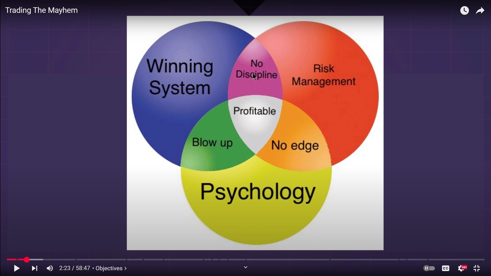

https://youtu.be/MgAbd8XStxY
Trading The Mayhem


I like Helix Trader's vids. They are very informative.

https://youtu.be/acTtXB184Pc
William O'Neil gives CANSLIM workshop (January 2010)

It seems William O'Neil passed away in 2023 at the age of 90. RIP.

I only learned this just now. I noticed that people are talking about him in past tense.

8/7/2025

10:20am. https://www.youtube.com/@TheAlgorithmicAdvantage/videos

Found this channel on quant trading. I think this kind of approach is what I should be looking into even if indirectly. Statistics + counterfactual reasoning is the way to riches in the market. I am not going to use stats as it would take too much of my time currently, but I'll get good ideas from watching these videos.

8/9/2025

10:55am. It's Saturday and I am chilling.

Let me just write down my SAAB.B and EXA buys from 2 weeks ago.

BOUGHT 5% SAAB.B @ 507.9 
BOUGHT 5% EXA @ 114.6
SOLD 10% HO @ 229.3

This was on 7/28/2025. I broke my rules and traded even though 2 weeks had not elapsed.

At that point I realized that I am getting far too involved with the market and that it's time to detach.

In my opinion trading off the monthly bars is very viable, which is why decided to just not even look at the market for a while in order to reset.

After the end of August, I am going to go back to a 2 week rhythm, but I think that I am going to hold losses for 4 weeks unless they are particularly bad. For example, large % large volume decline on terrible news. I'll also sell winners if they accelerate up rapidly like in a climax move.

Otherwise I'll just try to hold on to my winners for as long as possible and try to not let market action unsettle me.

Maybe it's a hard thing to come up with a great system, but it's easy to come up with a system that is easy to trade.

I do feel like this way of doing things will be particularly effective.

Compared to when I started, one consequence of adopting this approach is that I am going to ignore general market declines (like in April) unless they affect my stocks. Minervini said that most traders would be better off ignoring the market, and that is what I am going to do.

It's a lot easier to lose 20% of my account in a month than to lose 10% several times and watch it bounce up and down in trepidation.

Ever since I stopped looking at the market my work performance has gone up significantly and my anxiety has decreased.

When I lost 10% of my portfolio in 6 trading days at the end of last month, I was in shock.

It's easy to understand why that is. Once you lose 10% in 6 days, it's easy to imagine that you could lose 50% in 30 days.

Logically, you know that isn't possible - the markets aren't going to just go straight down, but it started to gnaw at me. My emotional involvement wasn't being rewarded by the market. It was the opposite.

So yeah, I'll wait until the end of August, ditch my losers on the next Monday and buy something else to replace them.

Trading once a month is a good way to balance out loss cutting and holding through shakeouts.

Intuitively, I know that a lot of the stocks that would hit a 10%-30% stop will recover in a few weeks, but I cannot allow them to be violated all them time. So balancing out my actions by only trading end of month will have that effect that sometime I will stocks recover and sometimes I will sell them.

11:15am. Market leaders very rarely have down months in an uptrend, so this will be a good system.

The less effort I put in my trading, and the more I can focus on things that really matter in life, like the pursuit of the Singularity, the better I will do.

Even if I don't end up achieving market wizard level of returns, I should still do better than the indices.

And I know that in big bull markets, this method will outperform greatly.

I am literally homing in on the biggest future gainers and investing my money in them. I cannot imagine this method doing negatively over the long run. I might end up buying tops here and there, but it's not that easy to buy tops.

11:20am. The ironic thing is that this method is what I've been searching for all along a decade ago and couldn't find it. As soon as I loosened up and adjusted my attitude and goals, it came to me right away. How pitiful my past was.

I am nobody great in the end. The most I can do is make up for it by making a few good trades.

Hopefully the euro defense stock trades work out and none of the other stocks in my portfolio like EXA end up being scams.

If euro stocks end up messing me up, I think I'll move to trading asia stocks. South Korea is inaccessible from IBKR, but Hong Kong isn't so I'll try focusing on it and seeing where that gets me.

12:15pm. https://youtu.be/2Mm_1wS40m0?list=PLBVwIU37953qr7DBLMJVXqcaVrJAaQy3D
banks don't hunt for your stop loss... here's how it ACTUALLY works

I don't like watching any more rando videos, but I'll watch this course from Andrea Cimi at least as it's pretty informative. I get the sense that I am not getting too much from the quant trader vids.

https://www.youtube.com/@tradingwithrayner/videos

Ueh, I enjoy vids like the Helix trader ones where he introduced various trading system. Not sure if this channel has any of that.

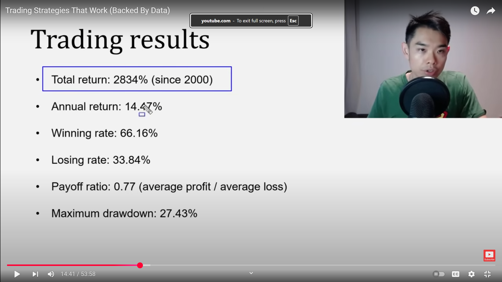

Yeah, it does have some results. Not bad. I guess the channel is worth following then.

1pm. https://youtu.be/YPIRGiMKtuI
Forex Trading is TWISTED and I'm Profiting From it

Andrea has really good editing, it's amazing.


So it's tomorrow at 6pm. Maybe I'll have a look. I am curious if they have anything I could add to my trading methodology.

1:25pm. I think I'll do a recording using OBS.

1:50pm. 

Knowing how to execute large orders is valuable no matter what kind of trader you are.


This is nice. I have to find a to plot VWAP moving averages on daily price charts.

2:25pm. Well, it's hardly a priority.

https://youtu.be/7D32Zvmt-6Q
Trading Strategies That Work (Backed By Data)

Let me watch this and then I'll stop for the day. I just find learning about trading fun, even though the system I am using now couldn't be simpler.

10:30pm. It's really not like me to apply to a webinar, so I won't obligate myself to watch one intended for daytraders, especially given that they say no prior experience is needed.

Instead, weren't there books I wanted to read instead, on options trading for example. I also haven't touched the book by Camillo.

It'd be cool if I could find some books on quantified options strategies that have backtested results.

10:50pm. 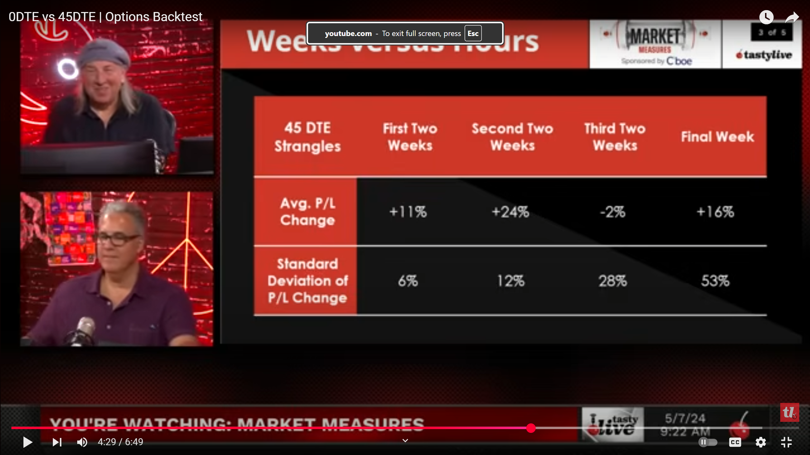

The way I understand it, there is an edge is selling options in general. There is a market premium to it similar to momentum.

https://youtu.be/P2eZOTxsEX4
0DTE vs 45DTE | Options Backtest

Ok...I understand something about options.

While with regular stock trading I'll be able to wing it using the 8 and the 12 week momentum rules, options I shouldn't touch unless I backtest the strategies. Otherwise I will have zero idea what to expect in those trades.

https://youtu.be/HnNBOReTb8g
This SIMPLE Trading Strategy Has Generated 26,210% Over The Last 20 Years...

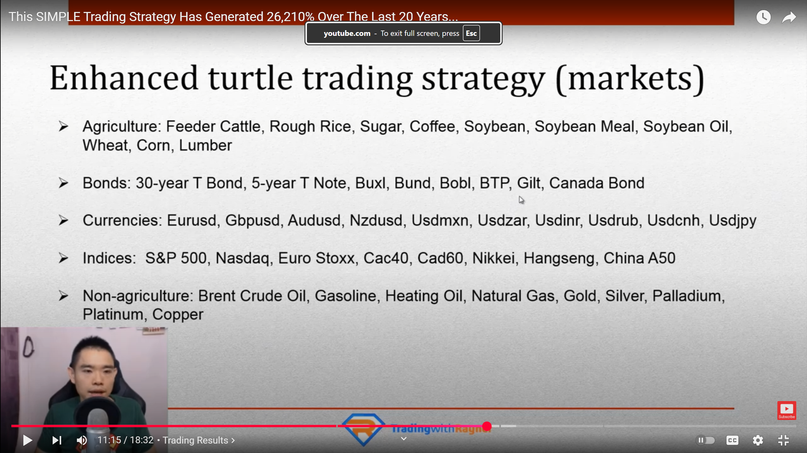

Teo is okay. One thing I haven't realized until I watched his first video today is that momentum trading really is different from trend following.

I am also realizing that I don't want to trade CANSLIM, but that I want to go in the direction of pure momentum trading. I watched some IBD videos, and I don't like the charts they are showing.


I definitely would never trade a system that just buys breakouts. As a momentum trader, I am really looking for a powerful monthly move to start a trend and they don't happen in most of these markets. Also, the nature of commodities is different from stocks to begin with.


I've never put any stock in indicators whatsoever a decade ago, but some of the scalping examples he is showing seem interesting.


Yeah, I've been looking down on these, but now that I know what they are measuring, I could see them being useful on occasion.

Not for my kind of trading.


I've been watching this video, and this guy is getting great results trading forex on all things.

Maybe my failure is merely due to lack of imagination in the end. I could have gotten the data and backtested it.

MACD at least could give the trader some objectivity about the momentum during reversal trades. Hold the trade while MACD is going in your favor and sell when it stops doing that.

I've never thought that mean reversal could be a valid concept in trading, but I am chaning my mind after seeing all of these backtested results.

12:50pm. https://youtu.be/d-Pojh3EBX4
Gary Antonacci Reveals TOP Dual Momentum Investing Strategies

Damn, I am tired. I need to go to bed.

8/10/2025

10am. Gary Antonacci - Dual Momentum Investing_ An Innovative Strategy for Higher Returns with Lower Risk (2014, McGraw-Hill)

Found this book. I'll take a look at it.

10:55am. So far the best book on momentum investing is Quantitative Momentum and the Janus Factor. Most Wall Street pros seem to be dumb money and the brief skim over Gary's book didn't do much to convince me otherwise. The only thing they do smartly is diversify and collect management fees.

Got the `The Option Trader’s Hedge Fund`. Seems like it could be good.

11:20pm. Nah, it doesn't have any backtested strategies in it.

As I said, I might do momentum trading on feeling, but options trading should be heavily quantitative. Unless I backtest the options strategy, it would just be pure gambling on my part.

`Options as a Strategic Investment`. Also got this book, so let me take a look at it.

12:20pm. These books are useless. Forget them. I want backtested profitable options strategies, not long tomes of the author's opinion on the subject.

1pm. Since I really don't feel like watching the webinar, what I am going to do is hit record and watch it afterwards. I already watched all of Andrea Cimi's playlist videos, and don't want to spend my time on a rehash. It's not like I am aiming to become a daytrader seriously.

Let me just test if recording works when the screen turns off.

1:15pm. It doesn't turn off while a recording is in progress, but if I power it off manually, the display capture turns black. I'll just leave the 'Turn off display setting' to never until the webinar is done.

With that taken care of...since options books are a bust, let me read the one by Chris Camillo.


There is also the latest edition of William O'Neil's book. But these charts are so damn small!

This is why I hate epub readers.

Let me try Thorium Reader.


Thorium Reader is better than Aquile, but not quite there. The problem is that the images are simly too low res. Let me try finding a pdf of this book.

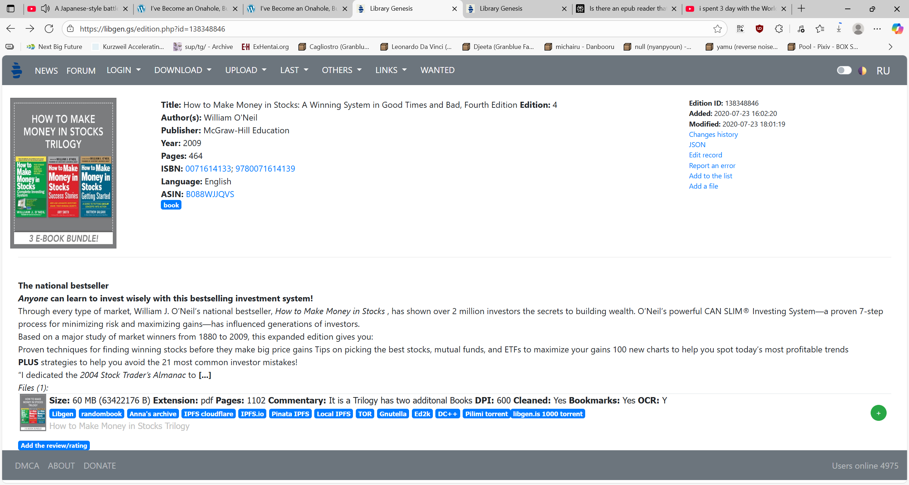

No need to pay for an education when Libgen exists.

I am impressed that in the latest edition he is showing stock charts from Jesse Livermore's time.

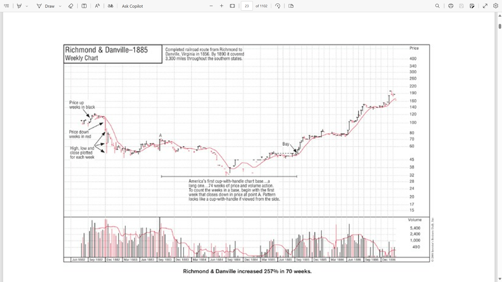

Yeah, the pdf is much better. I hate how Thorium Reader doesn't full screen the image. What the hell.

1:55pm. O'Neil style chart reading is incredibly subjective. The buy and sell rules he offers aren't an actual system.

This would be my one criticism of the book.

2:05pm. A lot of these charts are actually aren't that great outside the short lived meat of the move.

I think I shouldn't aim the big winners for the entirety of the move. There are many periods where they consolidate for a long time and break out again and so on.

And buy points are on cherry picked breakouts.

2:20pm. But I do like my own momentum system.


Rather than joining Andrea's group, I should join Camillo's and see how they operate.

2:40pm. Surprised how many stock charts the 4th edition has. It's all about them.

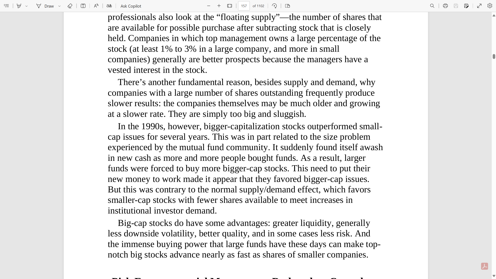

Interesting what he has to say on large caps. We're currently in such a market with the megacaps like NVDA and MSFT controlling the market.

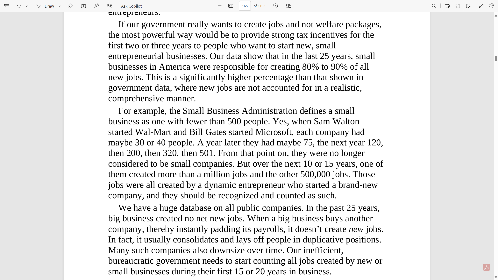

I think he talked about this a decado ago, but I completely forgot about it. Big companies don't create jobs.


This part of the book was really important for me. Group action makes the big winners much more obvious.

5:25pm. 

Ah damn it, I am going to have to miss this since I'll be going to the beach in half an hour.

Actually, it might just be enough time to let me into the room.

5:40pm. I think I am going to make this the last weekend dedicated to reading random books. If I have time for this I'd be better of taking the time to study Cutlass instead and brush up on my GPU programming skills.

That poker bot could make me millions.

5:45pm. 

I really want to get good at this type of investing at some point in my life.

Momentum trading has its perks, but it's only a substitute for index investing. You can never have more than mid level of conviction just by buying due to strong price action.

Maybe I'll hit some homeruns and have really good years. But I'll only be able to get so good by reading price charts.

I can accept this even though I am a momentum trader. It's just that I don't have any better systems at the moment.

9:55pm. I didn't think I'd be at the beach for so long. I'll review the recording later. Amazing that they're offering free 1-on-1 consultations. This will no doubt be life changing to some.

I had a lot of time to think about it while swimming, and I think I just have to accept my place.

The kinds of analysis that Chris is doing I am not even in a position to attempt doing. That story where he shorted a stock because he noticed a change in the store shelves would actually be far harder for me to do than read the company's income statements back to back and try to get an edge that way.

Because I am not in the fucking US.

Am I really going to start reading TikTok comments, read fashion mags or things of that nature?

I'd be better off trying to code a daytrading system. And if I am going to go in that direction, I might as well get back to work on the poker bot.

I am being pull into the market by my own greed. I said that I want 50-200% per year. But I need to detach myself from the market. Having high expectations of price action trading is bound to lead to disappointment. My edge is not so strong that I can just expect to make those kinds of returns whenever I want.

I should try to aim for 20% per year and see where that gets me.

I should try to not end up a loser in 2025. When I flip the cards at the end of August, I might be in for a nasty surprise. If I discover that I am down 20%, it's going to be hard to dig myself out of that hole.

What really sticks out in Chris' book is that he bashes other approaches and then puts his savings into an index fund. At this point, I am starting to think that index funds are in a bubble.

There is no way that the entire investment world can just keep plowing the market into index funds without that distorting the market.

Index funds are in the end a long term momentum strategy. Since I have better momentum strategies in mind, I cannot possibly invest in an index, that'd be crazy.

10:10pm. The main lesson of his and Peter Lynch's approach is to recognize the value of information that you have.

Let me continue reading the book. I'll leave Andrea's video for next week.

11:30pm. Ugh, I cannot read the book anymore as I am too tired at this point in the day. Chris is such a genius for developing this kind of investment methodology.

I'll recommend the book to Logris again. I am halfway through it currently.

8/11/2025


Got some tips from Logris on these tokens, but I am not going to act on those. Reminiscences of a Stock Operator has a lot to say on the subject of tips. I would also have to transfer the money out of my IBKR account back into my crypto wallet and I don't want to dot hat. That having said, he made a really interesting case on buying ETH. I'll (most likely) buy it next month since the momentum is there. I'll have enough to buy my usual position once I get paid.

The basic case is that the market is glitching out and treasury companies have announced huge buying volumes in ETH, he is bullish on it. So from a fundamental perspective it makes sense, and from a techical perspective the momentum is almost there too, 3 weeks to see whether it sells off from the top after the recent sharp rise would be just right.


I didn't like the hedge fund market wizards when I first read it, but I was skimming it now and this caught my eye. It's not something I'd ever consider, but I'll have to look at the bond charts later to see how it worked out.

I need to consider trading bonds in some situations.

They did great in 2008 too. Might have worked out better than a short trade.

Even so, I would like a short trade once the downtrend is established rather than try to catch a crash.

One thing that disturbed me in William O'Neil's book is that the 20s leaders that he showed me all broke out to the upside before the crash. My own rules would have gotten me creamed unfortunately.

I can only hope that there were some stocks breaking to the downside to signal the top otherwise it'll be bad at the end of the next bull market.

There is a lot of opportunity to lose money everywhere.

8/12/2025

6:10pm. 

I think on rereading that I was unfair on the hedge fund market wizards book. I kind of like it now.

You know, I really wonder what Mark Minervini's track record was after the 2000s? It'd be cool if the 'momentum masters' posted all of their trades. When it comes to Minervini, I've yet to see any of his results past the 5 great years he had in the Stock Market Wizards book.

It cannot possibly been as large as 200% otherwise he would be owning the world by now. He did great in a investing contest a few years ago, so it's not like I think he's done poorly. I am just curious what's the actual realistic return for somebody of his caliber.

9:05pm. 

I admit, I am thinking of trading options. A lot of the momentum situations I am in have the potential to go up a lot in the intermediate term, so buying long dated options makes sense in the light of what they are saying here.

Instead of buying ETH outright, I should look into how much ETH calls are going for. I could even do it on an US ETF, which are likely to be more liquid than the european counterparts.

9:15pm. Mhhh, but is there a point of even considering it? ETH options would likely have extreme IV. I'd be better off buying the outright.

That's the problem with momentum. I realized 3 weeks ago that it was a volatility beast when I lost 10% of my portfolio in 6 trading days.


...I have no idea. I found some options charts, but in contrast to the underlying data, options are hard to interpret for me.


This was a great chapter in the book. Can I somehow get historical option price data from IBKR?

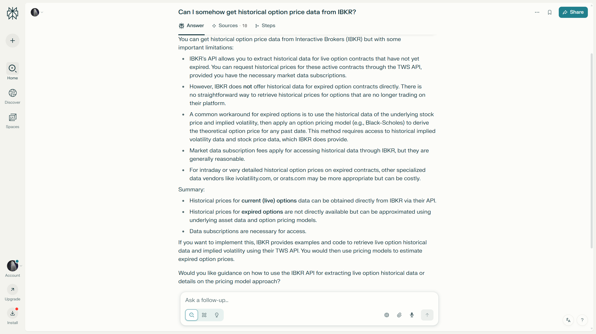

Egh.

8/15/2025

12:55pm. https://youtu.be/F2TTfZzigYk
"Momentum Investing: Simple, But Not Easy" by Dr. Wes Gray from QuantCon 2017

20m in and this video is great.

9:20pm. Brrrr, the sea water was so freezing in the past two days.

But at any rate, Friday is here and I have two days where I am free of work.

Maybe I'll finally have time to finish Camillo's book.

It's really a pity that I cannot follow such an investment approach due to how labor intensive it is, but maybe in some future life I'll be able to make use of the principles.

https://youtu.be/IkwSwJF7-bA
What You Need to Know About Momentum Investing | Six Experts Help Us Understand the Basics

There is never enough about momentum.

https://youtu.be/pICIXeWV9WE
The Bitcoin Treasury "Infinite Money Glitch"

8/16/2025

10:40am. I was looking up backtesting info on IBD distribution days and found this old blog again.

https://quantifiableedges.com/blog/

Glad to see it is still around. I used to read it in the last decade.

I've been thinking about CANSLIM, and the advice it gives for market timing, and when to buy individual stocks, is definitely its weakest part. Also on the charts of some of its big winners at the start of the book, there are stocks which had weak momentum post-breakout. Furthermore, the very first chart of ...


Stocks like these you can find plentiful in the Japanese market today and they are a nightmare to trade. For momentum to work, liquidty is necessary.

After I read O'Neil's book the first time, I didn't understand the importance of consistent momentum at all.

Sure it's a big winner, but you'll be hard pressed to make money trading them. They pop and then they hold steady for many months leaving your money dead.

The fact they the book is showcasing charts like these is a demonstration that Will O'Neil doesn't really get it. And his book is a mishmash of rules.

I'll be better of just understanding what the market themes are and rotating into them. The best stock for me is the one which goes up month after month after I buy it.

Let me finish Camillo's book.

https://quantifiableedges.blogspot.com/2009/08/distribution-days-quantified.html

Oh yeah, let me not forget to post this.


11:25am. https://www.reddit.com/r/wallstreetbets/comments/1k3o8au/asts_dd_the_space_trade_will_cum/

I am not into fundamentals, but I am into the style Camillo's expusing and he is talking about message boards. It might be worth keeping track of DDs on /r/wallstreetbets just in case something good pops up.

11:35am. Done with Chris' book. It turns out that I was not far from the end when I left it off a week ago. I enjoyed both Laughing At Wall Street and the Hedge Fund Market Wizards. The latter, I changed my mind on. A decade ago, my impression is that it was a congo line of managers from Harvard that beat the market by a few %, but today I quite like it.

I'll read the DD on ASTS at some later point, I am not interested in them right now.

ASTS was one of my momentum picks so I am interested in the reasoning behind it.

11:45am. Oh yeah, I forgot the webinar by Cimitan. Let me take a look.


It's very good, but I'd have hoped a daytrading system would be more like a straight line up. He's had like 3 flat months. This isn't qualitatively much better than my momentum trading, even I doubt I'll have 300% months ever. But my momentum trading takes a few hours over the weekend instead of being glued to the screen every day.

Also surprised this is in forex. In the videos Andrea says that we don't have access to order flow in forex, so how did they manage that?

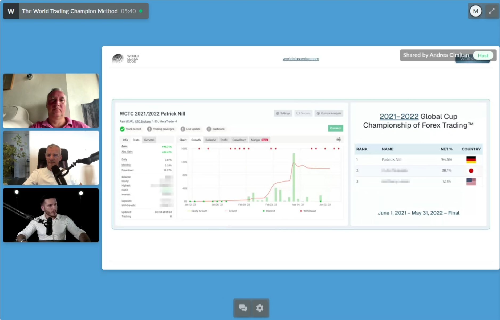

Very streaky. I guess their opportunities don't come around every day. They are more like snipers than grinders.


These results are rough, but I respect them. These guys are far beyond the average guru.

I am not sure I could bear making money for 3 months and the losing them for the rest of the year if I were a daytrader.

Hell, I stopped looking at the market for a reason recently. I'll have losing 9 month periods at some point, but those will just be 9 or 18 data points to me depending how often I look at the market which will be much more bearable emotionally.

Only 2 more weeks until I check where my defense stocks are. I am looking forward to it.

I am watching my OBS Recording, but I also got a link over email with a recording.

https://www.worldclassedge.com/workshop-replay

Here it is.


He's asking what various retail strategies that he mentioned have in common? My answer would be that they are completely subjective.

Let me go back to my recording so I can see the chat.

...No, it's not showing the messages from other people just from the admin.


Does this have any validity on longer term timeframes?

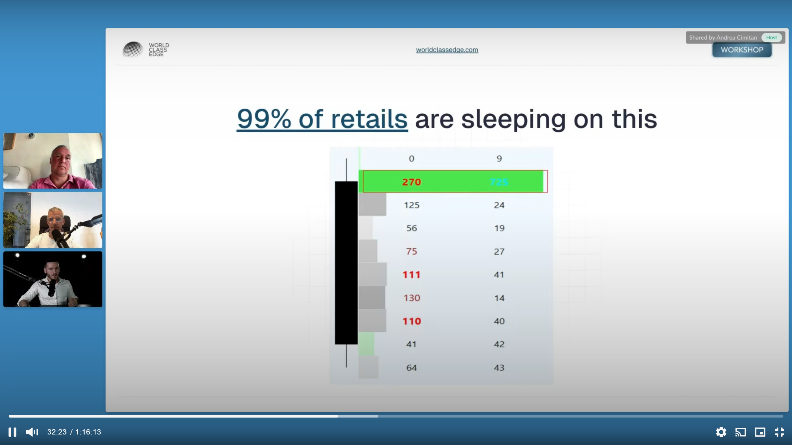

I don't think I need this for my momentum approach, but it's very useful knowledge to have if I end up making daytrading bots.

12:45pm. 

In fact, psychology was never the issue for me a decade ago. Nor was taking losses. I just could never gather the courage to extend my risk tolerance in both time and price.

I have no idea why people act like psychology is the reason they are losers. If they had a great edge to begin with, it wouldn't matter.

1:35pm. Enough. The time for expensive courses has passed for me. A decade ago I wouldn't have been able to afford the 6k fee, and today I don't need it.

Andrea is a real salesman marking it down from 60k.

Honestly, this was a waste of time. The webinar had a lot less info than his Youtube vids.

2:20pm. I Youtubed Chris and some of the vids see him talking about Bitcoin and Tesla. This sends a signal that I should be watching more videos with him in it. I want to see what his reasoning for these trades is. Given how far the TSLA sales have plunged it's a miracle the shares aren't 10x lower than they are now, so why the hell is he buying it? I have to know.

Also how could he possibly get an info arb edge on Bitcoin?

2:55pm. https://youtu.be/tgD9ucSeiMU
Investing Expert: Wall Street HATES My Strategy— Just Read TikTok Comments | Chris Camillo

...Ah, fuck I just put in RHM into Yahoo Finance curious about the message boards and I saw the quote for it. Damn, I didn't mean to do that.

Ok, so that trade will be a loser. Nwm. I'll let it run to completion and maybe make up the euro defense stock losses on cryptos. Out of sight, out of mind.

It can always go up in the next two weeks.

I only saw the quote and not the trajectory, so maybe it's a short term dip?

Hopefully not every stock in my portfolio will be a loser.

3:35pm. That video is 3h long so I cannot watch it all on a single sitting. Let me play some Limbus Company.

I feel really bad about seeing the RHM quote. I think I am down 10% on it.

I am envious of Chris, but I don't have any better system than gambling on momentum. I'll keep doing it until I find something.

9:15pm. I am back from swimming and it helped clear my head a little.

Stock goes up - I am a genius, the next market wizard.
Stock goes down - Maybe I should give up trading?

I am too old for that shit. I was actually sad for a few hours when I saw RHM down.

I think this is finally enough to decide it. I am going to go in the direction of monthly rebalancing and not watch the market in the interim.

It won't be the 2-4 week rule for losers, but just the 4 week rule.

Chris has a really deep connection with the world that I cannot help, but be envious about. Making millions of dollars by reading Tik Tok comments is next level 250 IQ trading.

But I am going to try deep detachment and see where that gets me.

I am not going to become a market wizard this way, but I don't have to become one.

I have a different mission, don't I? To cause the Singularity.

Imagine I wasted all my time hounding message boards for stock info instead. Now that would be a loss.

I was really desperate to get the job that I have now, and it helped me get a start, but I started getting a swelled head once I came back to trading.

I'll take a step back.

My goal should be to trade only 12 days a year, once per month.

I had other rules, true, but they aren't worth the price of unbalancing me. To win at trading, I only needed to determine the correct step sizes and that's it.

Maybe if I were trading ETFs and they were trending nicely, I could do with smaller steps, but individual stock trading is all about riding the momentum of big winners.

Even timing the market is pointless as they will shrug off the corrections.

It seems like they wouldn't given their volatility, but they will.

I haven't said it yet, but this way of trading gave me a lot of insight.

It made me realize that the daily volatility essentially doesn't matter.

And as far as edges are concerned, being able to ignore what happens day to day, and having such a system is a powerful thing.

I thought that by watching the market and the stocks I am trading I could achieve something and improve my results, but the reality is the complete opposite.

And that's actually conventient, since it gives me an excuse to work only 1 day a month on trading.

9:35pm. I'll accumulate the money from my job into my account, momentum trading will add something to that over time, and I will have my financial freedom while I work on other things.

In two weeks, I'll most likely sell the loser euro defense stocks. I'll ignore the fact that they are down now, but I acknowledge that I made a mistake not selling them when they were lagging in a rising market.

What I will do with that money is put it into crypto which are prepping for the next bull move starting with Ethereum. The next on my list are Tron and Bitcoin. I will never start off those positions at 20%, but starting the month at 10% and brining it up to 20% as they go up is fine.

With my winning stocks, I can also add to them. Maybe EXA will be up and I'll have the chance to bring it up to 20%.

And as for euro defense stocks, I can wait until they pick up momentum again to buy them. In fact, waiting at least a month after I get out is a good way to avoid getting whipsawed. A stock can often go up and down on a daily basis during the course of a month, but it rarely does that month-to-month. So having a slow rhythm acts as a filter.

9:45pm. The overall goal of my trading system is to catch big winners and hold them for the duration of their move.

That is how I'll get to million and beyond.

I wonder if EXA really will turn out to be the next TASR. Maybe not, but I was too squeamish to buy 10% initially simply because I was worried about it's daily volatility. But with my current system, that daily volatility will be a complete non-issue, so I'll be able to show my true power.

I don't need that many big winners in a year. If 10 is too much, then I'll just find 5. Crypto will do fine as well.

I am going to show that the last 20 years weren't a waste of time.

I'll get my finances in order and get back to work on causing the Singularity.

One minor change I will do is that for September I will make it a 5 week rule for the sake of only trading once per month. There 52 weeks in a year and 12 months, and they don't divide evenly, so I'll have to add a week here and there to distribute the remainder.

11:15pm. https://www.youtube.com/@DumbMoneyLive/playlists

Holy crap, he has a Youtube channel. Shitload of shorts too.

8/17/2025

10:15am. Either way, even if I get out in two weeks, that won't be the end of the euro defense stock trade. It might consolidate for a while and then break out later again, so I'll have to keep an eye on it even if I am out. Goddamit, won't TradingView have another discount so I can have all the watchlists I want?

The finance service people are all such bloodsuckers.

4:45pm. Done with the beach. I am super annoyed that the euro defense stocks all decided to start lagging as soon as the bull market was getting stated.

I need to restate what my goals should be.

In this bull market I need to find the winners and ride them. I only need 5. And 3 of them could be crypto. Crypto is the big theme again.

If I can put 60% of my portfolio in BTC, ETH and Tron and have it quadruple, that could make my year right there.

My account is exactly at the point where my salary is enough to make up for the losses, but not contribute to it significantly.

And it's a bull market, so this is the time to be taking risks. I have exactly the right method to avoid getting shaken out too.

The last time I started trading, in 2008 I was also very bullish and it was a prelude to the market crash.

I think given what is happening with crypto, with insane money flowing into it, when the bear market comes there will be many casualties, and will result in a prolonged bear market.

During that time I will not be doing any trading, so while the times are good now, I need to make the most of them.

The company I am a part of is in the process of transforming itself into a treasury company and will likely go bust when the crypto bubble bursts.

I shouldn't overly diversify.

Half of the reason why I am long 10 stocks currently instead of 5 is because I was afraid of the daily volatility. But now that I've fixed my attention, I won't be affected by it. I'll only look at the market once a month. When the weekend comes I'll really focus on research, but otherwise, I'll try to avoid getting affected by the price action.

4:55pm. I've been thinking how long I should do this job for, but really, the market will stop me out on its own eventually. Right now it suits me perfectly to continue and that is what I should do.

12:10am. https://youtu.be/pxm76s7FIVc
The Fake Trader Interview Industry

I am starting to think that some of the trader interviews I've linked to are fake. The initial interview with Lance Breitstein got me excited, but these random losers 'verifiedly' making huge returns can't all be real. I'll watch this tomorrow as it should be amusing.

I am pretty sure Lance and Chris are real, but don't know about some of the others peddling courses. In fact that option trader guy I linked to was surely fake. And the rest have faded from memory and just wasted my time wathing them.

8/18/2025

1:05pm. https://youtu.be/-LrPKcJ_xjo
Why Passive Investing Could End Badly

10:15pm. I really enjoyed the passive investing video.

Maybe I have something in common with index investors in the end. I kind of enjoy the ambience of the market, but don't like trading. I just have to make it work for myself.

https://youtu.be/alf4SAEZq7w
Why Weekly Charts Will Make You a Profitable Trader

Before this video I was listening to Peter Brandt and he said he doesn't trade during trading hours. He only uses market orders on open.

https://youtu.be/R1sNTB2Vh7w
48 Years of Trading Lessons with Market Wizard Peter Brandt

Could I get away with something like that, or would I get raped by the MMs if I tried it?

Because if it would work for me, why wouldn't I trade on the open? It'd beat having to be there during trading hours.

By the way, Peter's consistency is really sick. 50% returns every year for a given period between 2014-2020.

8/19/2025

3:15pm. https://youtu.be/uLj05swdi40
Value Is Useless. Momentum Is Everything | Leigh Drogen on the Real Edge in Crypto

When I was making the town hall demo, this caught my eye on Youtube.

10:30pm. In the passive investing video `Why Passive Investing Could End Badly` I really liked the observation that debt sprees actually end in deflation. It makes that deflation would happen if loans cannot be repaid. Then he said that the way of them results in inflation.

It was actually a really insightful video and I recommend it.

`Why Weekly Charts Will Make You a Profitable Trader`

I lost interest halfway.

`48 Years of Trading Lessons with Market Wizard Peter Brandt`

I watched this all the way and enjoyed it.

`Value Is Useless. Momentum Is Everything`

Let me watch this clickbait. Edit: It was boring.

12:20am. https://www.youtube.com/watch?v=E6QjMPa3KcM
Our Biggest Trade Ever (and what we're buying next)

Forget that crypto vid. I am watching this currently.

8/20/2025

6:10pm. https://youtu.be/TjZ8JlNk0xU
The magic of momentum trading - Alan Clement

Helix Trader is always good.

8:55pm. https://youtu.be/CpFBsB3I-ws
“Low-effort Trading Strategies” – Cesar Alvarez

I am going in this direction, so this video could be interesting.

https://youtu.be/CpFBsB3I-ws?t=741

He is saying that so many people are doing monthly rotations that he purposely avoids the first day of the month to do it. Good tip.

10:30pm. I've been liking this kind of trading so far if you can call it that. My natural inclination is to cut losses quickly, so not looking at the market will have the effect of refocusing on letting winners run. By cutting off my attention, I also cut off the emotional response and let the trade proceed in an optimal fashion.

I wonder if the euro defense stocks will really rally enough to keep me in the trade by the time I flip the cards at the end of next week?

It is possible. 2 weeks is enough for RHM to go from 1650 when I saw it last to 1900.

But either way, I don't like how the momentum is fading this long into the trade. But yeah, some stocks will rally on the week 11 and 12 and keep you in. The rules are there for a reason.

I have to strike a balance between loss cutting and letting winners run. The problem with loss cutting is that it often cuts potential future winners.

When trading indidual stocks as opposed to the whole market, the rules of the game are different.

It's all about catching the big winners and riding the wave. That is the way to big returns.

It's all about catching the top 1% of all moves in a given year.

If my attention isn't contributing anything to the trade, the best move once I've taken my positions is to get out of their way.

Ultimately, I think over the long run my decision to get away from the tickers will turn out to be a master stroke. Even though I didn't predict the market, I perfectly predicted my own emotional responses and compensated for them.

Not only will this make me successful, but once the paid work is done with, I will be able to continue my previous lifestyle of working on my own projects without getting consumed by the markets.

Lazy trading is how trading should be done.

Even if I traded full time and became a market wizards, that is nothing compared to the pursuit of the Singularity.

Trading is means to an end, not the end goal.

I just have to keep going and I will breach the 1m barrier eventually. At that point, I won't ever have to think about jobs again.

I'll go back to Youtubing. :)

And, maybe with last month's move I did drive a firm wedge between who I am now and who I was a decade ago.

Maybe if I could be just a bit more successful, this wound in my heart that I've been bearing will heal?

The job I have is great, but if I cannot find success in the markets, that just means I will forever have to resign myself to waging, so the outcome of the next few years of my trading will play a pivotal role in my life.

8/22/2025

8:05pm. https://youtu.be/puiJC9YVax0
The Market's Best-Kept Secret | Travis Prentice on Momentum's Surprising Edge

Done with work for this week.

Time to chill.

8:25pm. https://www.youtube.com/@Stockbeevideos

One of the market wizards in the latest book mentioned Stockbee, and I often read the Stockbee blog over a decade ago. Just found out now that the author has a Youtube channel.

I remember that the content back then was quite good.

https://youtu.be/puiJC9YVax0?t=1884
 
Here they talk about momentum in Japan. 

In my opinion, what Japan needs is a big bull market and the momentum will start working again.

Though rather than wait for Japan, if euro stocks give me too much trouble I'll look to trade Hong Kong instead.

9:45pm. https://youtu.be/HFEs7eUbkHA
How to make money using one day momentum

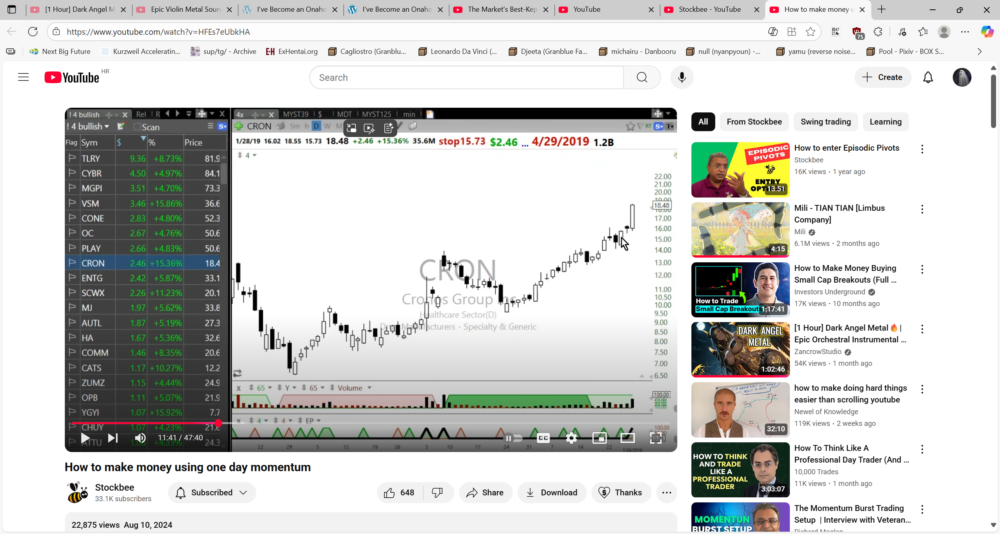

Don't know why I never considered swing trading using daily momentum. Some of these stocks have smooth moves.

10:10pm. Too intense for me. I like the slower pace more.

https://youtu.be/Y1cmPVbSU7c
How to profit from the Cinderella Strategy

His explanation of the earning surpise is the best over. I remember learning this well from Stockbee.


Either way, at the of next week, I will finally flip the cards. And I've decided that I am going to push my luck with my winners. Forget the defense stocks. I want to push my luck with stocks that have great monthly momentum first and foremost.

Eventually I am going to stumble into huge movers if I follow that strategy consistently and make a lot of money.

The downside is that it will require concentrating my positions, but I have the leeway to risk that.

It doesn't matter if it turns out to be crypto, or EXA or whatever.

I need to find the strongest stocks with the monthly momentum and spin to win.

https://youtu.be/7j7H9Ovg9nU
Match setup to your time commitment

Great video.

https://youtu.be/mWE9J2Nta6g
How to find persistant momentum

Not sure what to think about this one. I've had the insight recently that if you're not looking at the daily price action, you can actually completely ignore the daily volatility.

8/23/2025

11:05am. https://youtu.be/Y1cmPVbSU7c
How to profit from the Cinderella Strategy

This video is so good that it needs to be linked to twice.

https://youtu.be/U6uL1SepW88
How to use momentum to make money

https://youtu.be/H1fUbgfutAo
The $100 Million Dollar Trading Setup - The Episodic Pivot Breakout

Pradeep Bonde is a really busy guru.

https://youtu.be/H1fUbgfutAo?t=857

I found it interesting that he says he isn't look at earnings, but rather sales growth because that is what the market was rewarding.

2:55pm. Pradeep mentioned he uses OPG orders. I had no idea these existed.


OPG stands for Opening Price Guaranteed. So I could use these to minimize slippage?

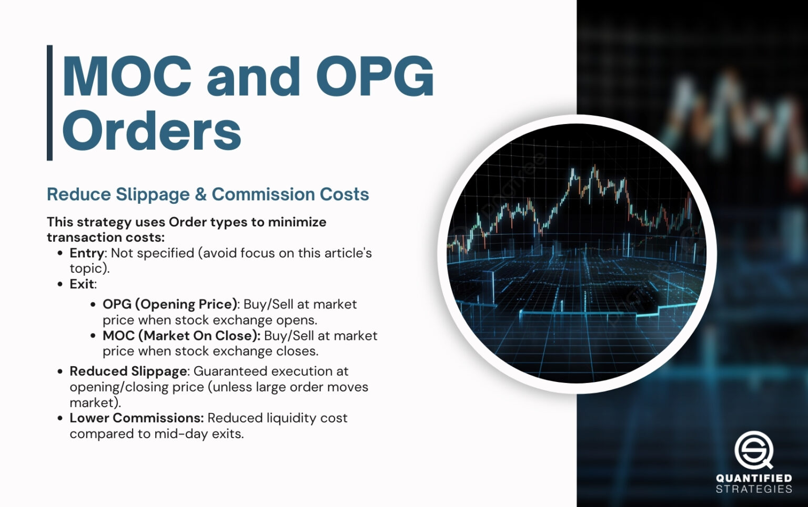

Oh, nice. I should these instead of coming in 45m before the close.

3:25pm. In the interview with Peter Brandt, he also mentioned he used market on open orders which I found strage at the time. He also doesn't look at the market during the day. Smart guy.

I myself was fine at first, but then I started to overtrade and break my rules. I don't think I actually verged into making the wrong decisions last month, but it's very likely I would have had I not detached myself.

The reason why I really like OPG orders is that I am trading with delayed data and dragging those limit orders around during the day is a huge impediment to me. I'll also be able to trade stocks on exchanges on which I have no data for much more easily now.

4:05pm. https://youtu.be/H1fUbgfutAo?t=4481
> I see every day people telling each other that stocks which hold up the best are the ones which go on to make the move. If you do a 50% study, you'll debunk that in 5 minutes because the stocks which go on to make the biggest move don't come from the stocks which hold up well, but the stocks which are beaten down the most.

Oh, this is great.

Lol, maybe I should have avoided the defense stocks in favor of uranium ones. Well either way, you have to focus on the extremes.

I was just unfortunate with defense stocks having their momentum started to fade in a strong market.

> Now that is what creates an edge. If you just take a second hand edge and just say what others are saying, then you're not going to believe that.
> When you look at these stocks which make 50% moves, then have one thing in common. They have news and they're coming from a weakness, they're not coming from strength.

4:15pm. Let me go to the beach. This was a productive study session. I am going to be using OPG orders exclusively from now on.

8:50pm. https://traderlion.com/podcast/pradeep-bonde-entering-episodic-pivots/

I am doing some research on entries and there is literally nothing out there on OPG orders and MOC orders. But I found this article where Pradeep is discussing entries here.

Retail traders sure get the short end of the stick.

https://youtu.be/uW95Cj44cLk
Delayed reaction Episodic Pivots

Yeah, the earnings getting prices in right away is one of the important reasons why I decided to widen my trading periods significantly compared to a decade ago.

I think I was experiementing with buying earnings during my 2007 - 2014 attempt without much luck, though I wasn't very disciplined with waiting for good setups.

The problem is that explosive earnings don't come around that often and buying vanilla kind of earnings just didn't work that well for me.

I really hated it when stocks make most of their move via earnings jumps. I'd just buy those breakouts and watch them go nowhere.

I think earnings trades are best done the way Chris Camillo does them. And longer term momentum trades are best done the way I am doing them currently by going with the flow of the market.

The crypto setups that are happening currently are pretty nice. I'll cut the losers next month and rotate that cash into them.

If you're trading delayed reactions to episodic pivots, and maybe buying pullbacks in stocks that had them, that just regular momentum trading. Suits me perfectly.

I'd honestly rather not pile into news. I like doing things at my own pace than reacting to changes.

10:20pm. https://youtu.be/we5LLjFlHCc
QULLAMAGGIE Stock Trading Strategy EXPLAINED | $5k to $100m!

Maybe I'll watch this later, but by this point I have everything I need. I only heard about Qullamaggie very recently. He was Pradeep Bonde's student.

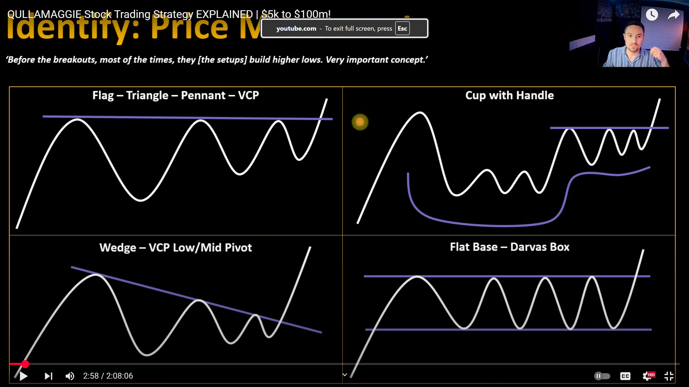

Let me just say that I really dislike this way of framing the market. It has zero relation with reality, and it's much better to trade based on 3-12 month momentum. Let me make it 4-12 month momentum as I'd never buy a stock just because it has had good 3 month momentum, but I would 4.

I want to say that when you're holding stocks for months, the specific patterns stop mattering and your returns depends on the market conditions and the market themes. Momentum is a part of that.

It's so annoying that I cannot use regular TradingView and have to resort to private browsers.


Monthly charts are really good for getting a sense for the trend. I am kind of feeling bullish on this stock. But the last month has been very negative for it.

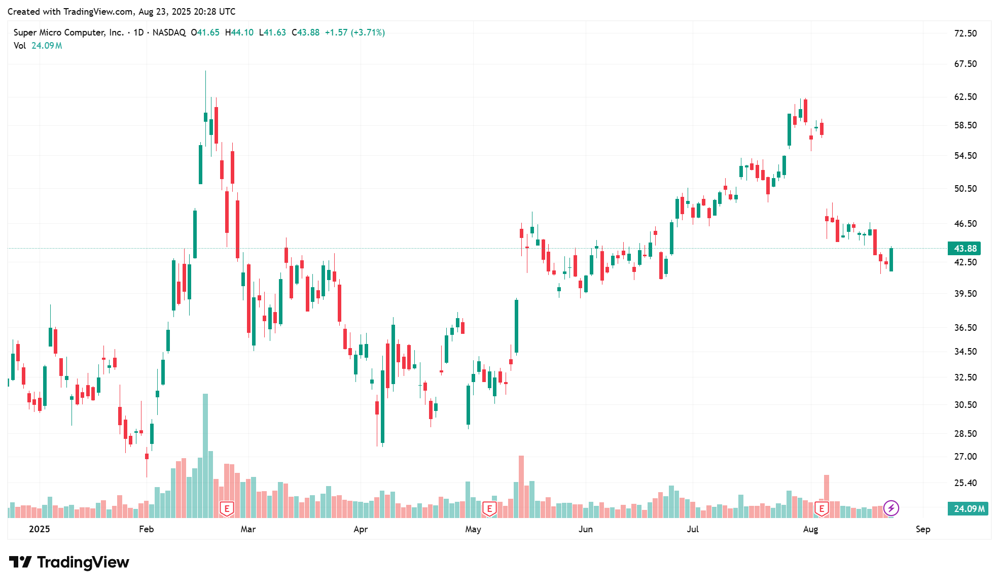

It hugely gapped down on earnings, and sold off in big volume. So the assumption based on that is that it is in a downtrend.

But if it could resist the selloff and start going up on the monthly charts, that would actually be a very bullish setup that hasn't been popularized to death.

SMCI reminds me of Nvidia in its earlier years. Nvidia also had fatal looking selloffs that it shrugged off. I really like how the stock got crushed from 90 to below 20.

For contrarian minded investors, rather than buying earnings breakouts which come later in the cycle, it could be a good idea to look for large selloffs that get absorbed and then start to go long the company once it starts recovering.

Stocks like PLTR had that kind of pattern.

Buying euro defense stocks in that light does feel like I am buying quite late in the cycle doesn't it?

But there is no way the market anticipated Trump or what he would do to the global trade. So I want to stay fundamentally bullish for longer.

I am really looking forward to seeing whether RHM and the rest will meet or dash my expectation by the end of the month.

8/24/2025

10:10am. https://www.youtube.com/watch?v=KciAjkEFA6s
My setups, methodology, and how to build trading mastery

https://youtu.be/VdQSDGZBLQE
Market mechanics, setups and more

https://youtu.be/Q8TrrG1jVFk
Know when your setups work and don't work

Let me go to the source, I'll watch some of Qullamaggie's stuff.

Suppose I lost this job today with Tao Ceti, what I could do is start some intense research on trading systems, and see if I can find good mean reversion daytrades. I do have options when it comes to making money. I can go up the ladder of sophistication quite a bit.

10:15am. The problem is that I am not too confident yet, and my account isn't large enough to be a full time trader. If I could 3x it somehow that could change, and I would have enough to retire.

If I didn't spend 6 years going nowhere a decade ago, I would be a lot more confident when it comes to daytrading now.

For short term trading, what would make a big difference is that this time around I would cheat and definitely throw all the technology that I can onto the problem. All of my programming skill.

For long term trading, I am satisfied with naive momentum, but for short term trading where the edges are thinner, I would make sure that I have the stats on my side. Statistics might be the holy grail in trading.

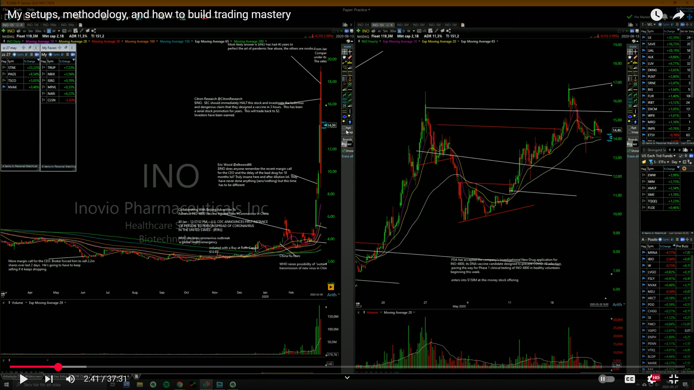

Agh, how do I borrow to short these kinds of stocks?

Do I need a different brokerage from IBKR? Is that the only choice?

10:30am. I hate it that all of these guys short the parabolic stocks and I can't do it.

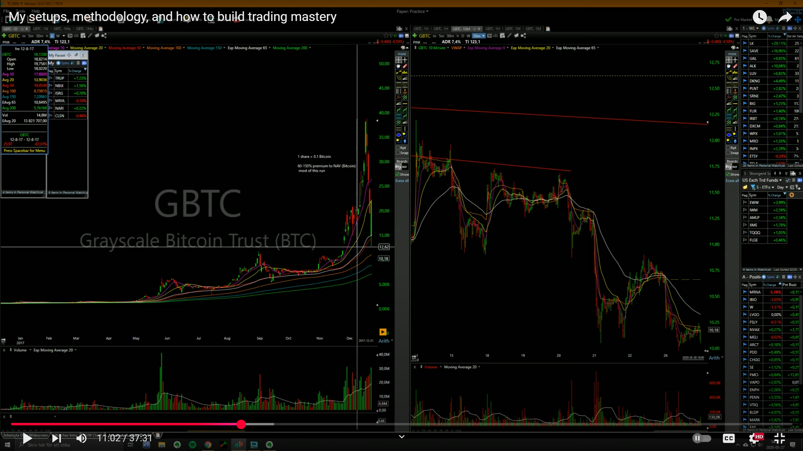

Oh, parabolic long. I actually wasn't aware of these last decade and only conjectured their existence in recent months. I read a Youtube comment that Steve Dux trades those. Also, Lance Breitstein said he trades capitulations.

In, `How I trade for a Living`, Gary Smith talked about intraday reversals.

I definitely could stand to learn more about swing trading.

> You want to find the stock with the big ranges. That is where the big money is.

One of his scans in an earlier video...

https://youtu.be/cx9cxMRvh7s
Qullamaggie – How I Traded a Small Account in the Beginning | Small Account Growth & Strategy

In this one in particular, he had ADR as one of his scan criteria.

11am. I am feeling some inspiration. Why don't I do it?

* Get the data.
* Do the research.
* Make the trades.

I have all the skills and more in order to become a quant trader.

There is no need to bet it all on the same discretionary long term momentum system. I can do better than it.

I don't have much time to do this kind of work, but I could start gathering data even starting next week.

I tried out the IBKR API a few months ago at work.

11:05am. Yeah, just adding these specific kinds of reversal trades could add 100k a year to my account, so why not put in the work? Am I just going to be watching trader videos every single weekend like I am doing now?

That time could better be spent doing actual market research.

...

For every given moment in time I could do a pattern matching scan.

Given a particular stock and 5-30 days of past price action, calculate a mean squared error of all the stocks in the past closest to that price action. Then use those patterns to build scenarios.

How did similar patterns act in the past when they won, lost and went sideways.

Even for something like trading news, I could have an LLM summarize it and create a quality score. How big is the acceleration, how surprising it is, what is the past price action of the stock. The better the news and the more negative the past price action, the bigger the upside.

11:10am. Even though I might not believe in my trading skills, I do believe in my programming skills. I should try out the simple statistical systems and see where they get me.

I won't beat the larger quants, but I'll have an edge over other retail traders.

11:15am. Let me watch these videos. I won't start the research work today, but I'll let it simmer in my mind for a bit.

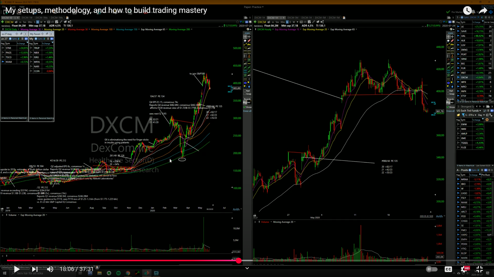

I should just learn to swing trade these capitulations.

If I build a fully automated system, it will be capabable of making far more precise entries and exits than I ever could. I would be like a money printing machine of the long run.

https://youtu.be/KciAjkEFA6s?t=1740
> The key is to trade stocks that have a lot of range.
> I see people trading stocks that have no volume, no range, there is nothing going on...

I ended up doing this during the end of my trading journey a decade ago.

Stocks are so random and volatile, and I was trying to find places where they could have good persistence for swing trades. Couldn't do it.


He's up 2.5 million.

11:50am. Yeah, I am a bit upset right now. I have all these programming skills, and what. Am I just going to be a mid tier discretionary trader in the end? I can do way better.

I could get a ton of use out of memory systems for swing trading.

I am looking at these guys and they are using very simple systems. It's possible to go up a level of sophistication without overfitting.

I can start off very small to test things out first.

Short term quant swing trading.

12:15pm. Let me watch these videos to the end.

12:20pm. https://qullamaggie.com/my-3-timeless-setups-that-have-made-me-tens-of-millions/

Yeah, it's a grind watching his videos. I cannot even see what people on Twitch are telling him. But he has these articles on his website.

And that was pretty much what he covered. I know all this from Pradeep and so on.

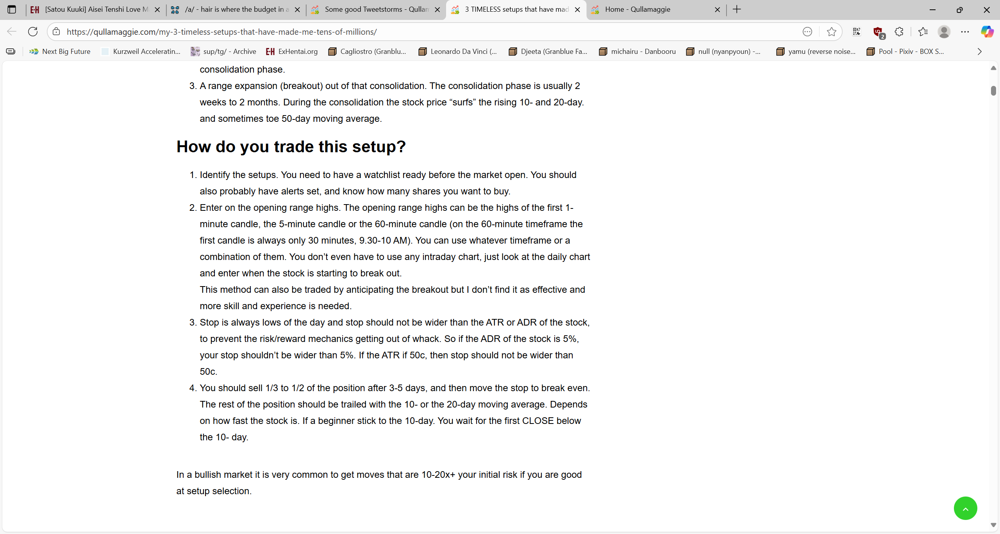

In the last decade, I was very lazy when it came to trading breakouts even though that was one of my main systems back then. For such an intense system, I'd want to also automate it.

Discretionary trading should be long term and lazy, and systematic trading should be short term and intense.

12:30pm. Let me stop here. I am not going to watch any more videos on how to trade. Rather, I am going to change my focus on video that talk about how to get the data and such.

I am not sure if just getting historical data from the IBKR API is the way to go, so that should be the first things I should research.

How to get split adjusted data, how to get the news for a future LLM system and so on. How to get the earnings reports.

Once I have that I'll actually be able to put my programming skills to good use for making trading systems.

Maybe I'll resume Youtubing at that time.

12:35pm. Qullamaggie inspired me to become a quant trader. I think anybody looking at me from the outside could only have been wondering when I was going to go in this direction. It seems like such an obvious path to take, and I've been resistant to it. I guess it has been slowly building up. One way to transcend my old self might be to have courage and extend my holding periods to weeks and months. Another way is to go all-in on tech. I'll do both and cement my success. Tom Basso and other systems traders say that a big part of their success is trading multiple systems. I can take a note from that.

1:45pm. https://youtu.be/9Y3yaoi9rUQ
Algorithmic Trading – Machine Learning & Quant Strategies Course with Python

My usual process as a software engineer when encountering a new domain is to look for tools and do research on ways to make my future work easier. That means, watching videos, reading articles and so on. In the recent years, I've started to rely on chatbots for a part of that effort.

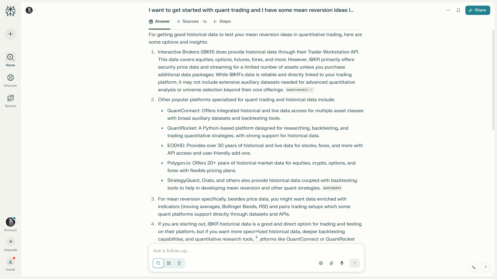

This is what Perplexity had to say when I asked it about getting data, but I don't want to just trust it. Instead I'll also spend time manually gathering resources before deciding on a plan.

This Python course is a decent first step into quant trading.

Sigh, yeah this has been long coming. How many people are there in the world who could be better at programming than me? I doubt there are many. That is one main difference from a decade ago. I'll get to poker bots eventually, as games are the main pathway to the Singularity.

Like with this job at Tao Ceti that I have now, I could target some lower hanging fruit when it comes to making money using agents. I think that short term trading could be a lot easier than making a poker bot so I'll tackle this approach.

I've worked very hard over the past decade, so I might as well harvest the fruits of my labor. I can take the easy path for once.

2pm. 

This looks like it will be pretty interesting actually. I thought that they'd just cover dumb indicator models, but all of these projects are beyond what I expected.

4:05pm. Let me leave the course for later. I want to see how the infrastructure is setup. That is the most important thing for me now.

https://youtu.be/xVUuA4TPN6U
Systematic Trading from Scratch: What Programs To Use and How To Install Them

There might be interesting stuff here. They also use IB.

I'll want to do my coding in F# and Spiral. But since it will involve ML, I suppose I can give Python a chance.

https://youtu.be/GTPeyOCr170
Why Systematic Trading is a Shortcut to Success - Part 1

I've compared the Nasdaq to Dax, and it seem I made a mistake trading the euro stocks. I am actually pretty pissed at this. I could have bought those beaten down stocks and I would have gotten way better returns than had I touched the defense stocks. I feel some sense of betrayal at this. So much for fundamentals. If these trades fail by the end of next month, I'm going to pivot into US tech stocks.

And if this kind of trading gives me poor results by the end of next year, I am going to go full systematic.

This bullshit isn't worth the concern.

I need a plan B if long term momentum trading turns out to be a poor fit for me.

It's not like I'll be out of options either way.

I can make my success a certainty.

4:30pm. 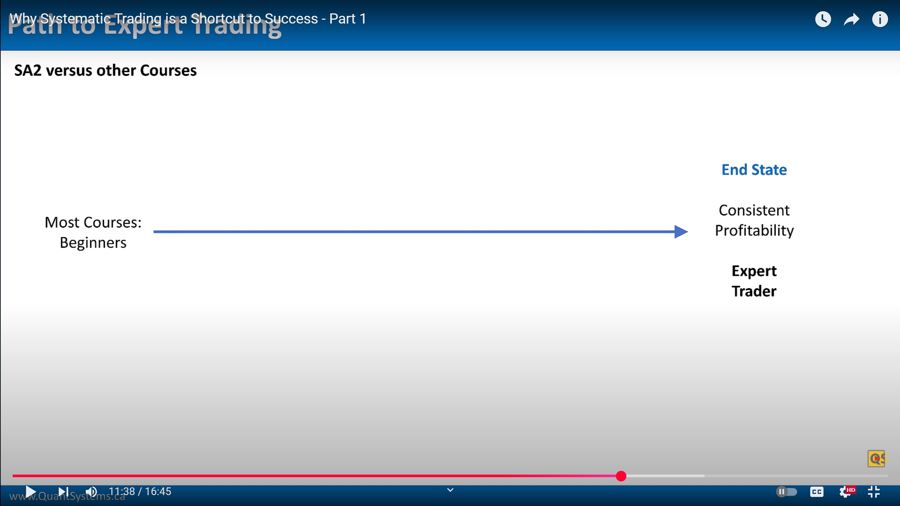

Systems Academy. I decided to pass on World Class Edge by Andrea Cimitan, but Systems Academy might be more up my alley.

4:35pm. 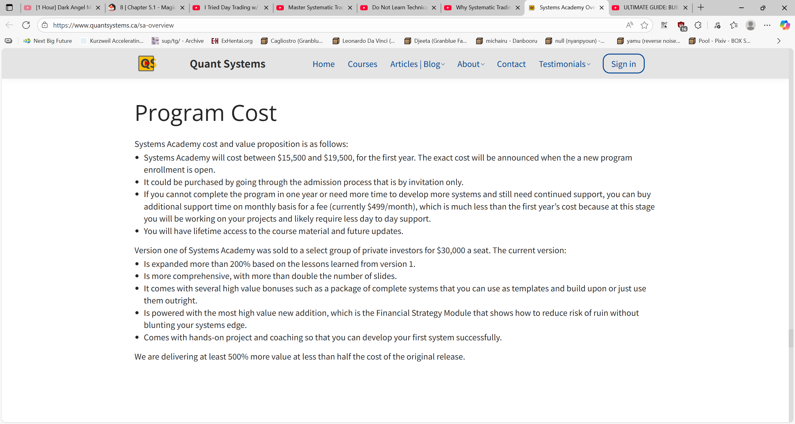

15-20k is very expensive. It's not worth it for a part time project. It's also offered on a limited basis.

4:45pm. https://youtu.be/W8Z1CmCTS0A
Why Systematic Trading is a Shortcut to Success - Part 2

5:40pm. Time to go to the beach.

https://www.youtube.com/watch?v=k9lWvFfW8lg
Ultimate Guide: Build A Successful Systematic Trading System (7 Step Process)

I'll watch this when I get back.

8:15pm. Damn, the water was freezing. Why am I even going swimming?

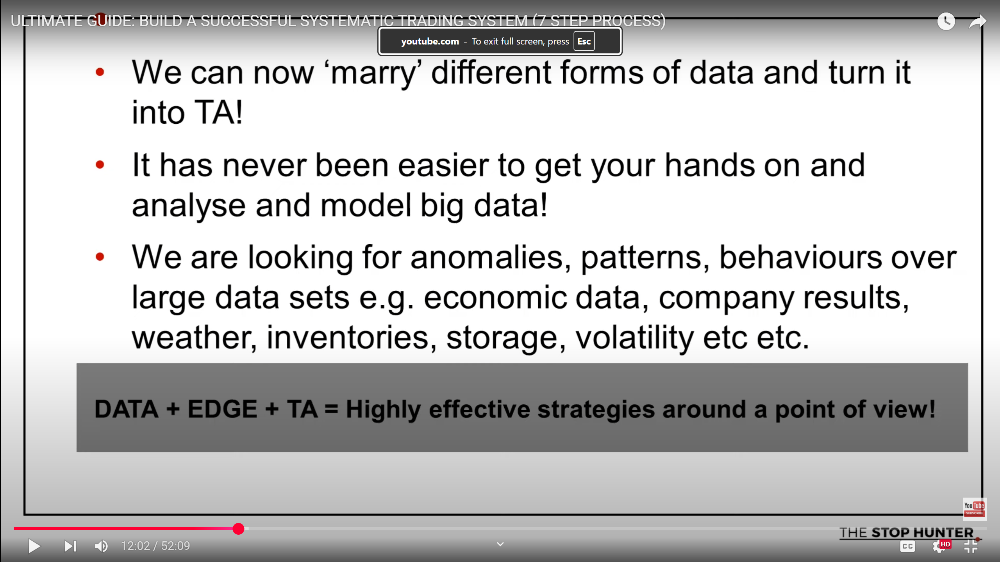

This is pretty interesting. It makes me want to watch the video. Next weekend...I'll be reviewing charts, but in general, I am going to make it my goal to figure out how I can get good data either from IBKR or some other platform. While swimming I've realized that more than trying to figure out a swing trading strategy, I need to do momentum studies of all the stocks in the past two decades.

The stock screener won't be sufficient for this effort.

I need to be able to see all the winners in a particular year and during the various time periods.

After I have the data, I'll be able to let me programming skills take care of the rest.


What's this?

8:25pm. https://youtu.be/1DHqNYu1St4
Master Renko Trading With This Game-Changing Book! (2025)

All of this sounds so retarded.


Oh, I saw that TradingView had this kind of chart, and it looked more visually appealing, but I didn't really understand what it was about.

https://www.luxalgo.com/blog/renko-charts-a-simple-breakdown-for-traders/

Hmmmm, is this something I need?

https://youtu.be/o3U8Yb2PLcc
Introduction to Renko Charts: Tutorial

Actually this is pretty cool.


This is super cool. This is a renko chart based on ATR of 14. Here is how the candlestick chart looks like...

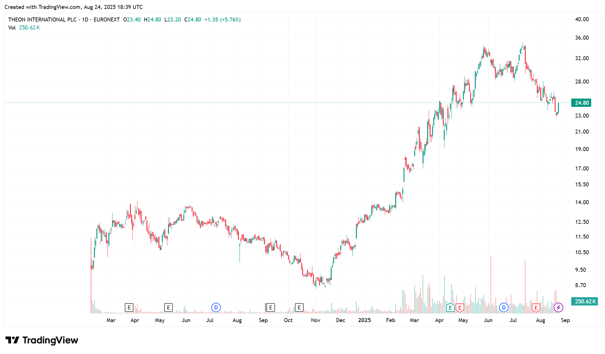

Yeah, this isn't pointless. Being able to see the trend clearly and focus on it has its uses.

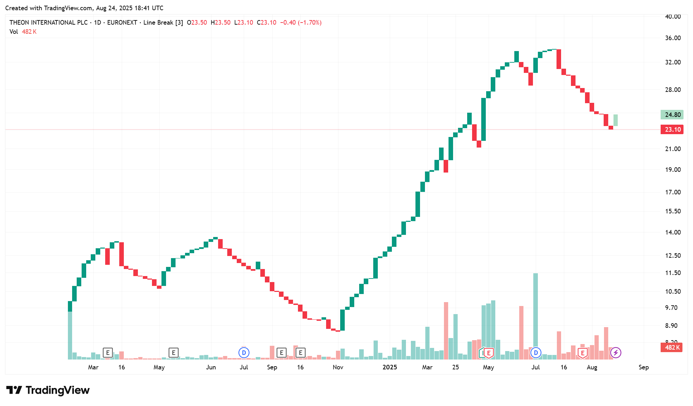

I have no idea what line break charts even are.


THEON and KTG are two stocks I was considering buying, but they got crushed.


Here is how it looks like in actuality.

Hmmm, I see. Even though I say that it should use ATR or %, it rounds them to 1, 1.5 or 2. I guess that makes sense.

9pm. Honestly, I never thought about prices in terms of boxes like these. There is a point to it.

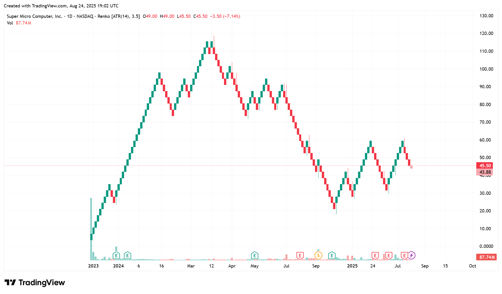

If stocks moved in smooth trends like these, trading would sure be easy.

9:55pm. Nevermind the Renko charts. They just give the illusion of being easy.

I had time to think about systematic trading more seriously.

And it all comes back my view that AI is all about memory systems.

I am a shitter simply because all I am doing is trading price info.

Chris Camillo one the other hand is Goat because he reads Tik Tok comments and message boards.

Wouldn't it be great if I could relate all the info in the world in a way that is understandable?

If I had some stock like RHM, I wish I could look into that system and say how it relates to all the other stocks that have ever been in that situation in the past. But not just price info, but all the relevant factors in the real world as well. If I could create such a system, trading would fall like a domino. It's all a matter of having sufficient intelligence rather than operating blindly. For now, it'd be great if for swing trading I could gather the necessary data and at least determine what the right entries for such trades are. For mean reversion longs and shorts. What puts me off mean reversion trading is that I could never quite figure that out.

I am really not into systems that much. I'd rather have a big database over which to do a similarity search. Then once I understand the possible scenarios based on historical data, then the trading plan for that specific situation can be formulated. That is how I want to trade. Not via indicators. But via memory.

I think in hedge fund market wizards, one of them took this approach and had success with it.

I want to try it as well.

I definitely don't want to make a trading system by optimizing the parameters for a bunch of indicators. None of them mean shit.

10:10pm. I'll have time to think about this, and if the momentum approach I am using now really craps out, I am going to take it seriously and marry my trading with the approach towards AI that I am trying to spearhead.

8/25/2025

12:55pm. 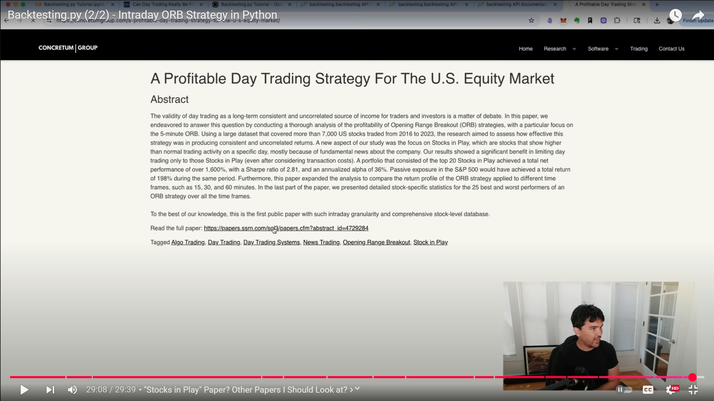

This is from the video:

https://youtu.be/HXxHunu_Hkk
Backtesting.py (2/2) - Intraday ORB Strategy in Python

Pradeep in one of his videos mentioned Mark Boucher, I think it was in the TradeLion video. It sounded vaguely familiar, but I had trouble remembering who he was. Today I remember that he wrote a book on opening range breakouts. He wrote the Hedge Fund Edge book in 1999 which talked about opening range breakouts.


No, I have to be wrong. I must be thinking of a different book. This can't be it.

...Forget what I said. Let me finish the video.

I think if I want a daytrading system I'd do well to backtest this.

1:10pm. Maybe I am acting like this due to feeling a bit directionless at work currently. I need to stop thinking about this so much and focus on what is really important.

I said it back then, knowing the stats won't change the outcomes for my style of trading.

8:45pm. 

Let me read this paper.


Wow, this is amazing.

Volume Weighted Average Price (VWAP) - The Holy Grail for Day Trading Systems
A Profitable Day Trading Strategy For The U.S. Equity Market

https://papers.ssrn.com/searchresults.cfm?term=day%20trading

The papers can be found for free here.


So this is a variation on the OBR system they wrote about in earlier papers.

I feel like I am benefiting from reading this paper. I could make use of a system such a this on stocks in play.


This system made 100% per year despite having a 17% win rate. Crazy.


Maybe I should backtest how this would work for longer term trading?

Going into the paper I was sure they do a mean reversion system rather than a trend following one. Quite surprising that wasn't the case.


I keep hearing that daytraders should avoid the midday. This seems to bear out.


Maybe Toby Crabel is the one I was thinking of?


You know what? I think I could do my momentum trading during regular market periods and do systematic daytrading during volatile ones. That could be very effective.


This is what I could have done in 2007 - 2014 instead of bashing my head like a moron. I could have picked up programming and created a system such as this even I couldn't daytrade in the US due to the PDT rule.

I could daytraded it in the EU markets.

9:55pm. https://youtu.be/j1XAcdEHzbU
Quant Trader on Retail vs. Institutional Trading

Oh, this video where he talks about market making is very informative. I honestly know very little about that part of the markets.

8/26/2025

10am. https://youtu.be/8EV78upUQw0
Exposing the #1 Day Trading Show & ALL Fake Gurus

This is covering Words of Rizdom. I can't say I am at all surprised.

Let me watch it for a bit and then I will start work. I have no idea whether it's because I'll flip the cards at the end of Friday, but I've been feeling stressed.

10:05am. Yeah, I think even Cimitan cannot be excluded from being a fraud. That story that he paid 60k for 3 days of Patrick Mills' time is crazy.

It's simply hard to tell from the outside, and I'd have to pay 6k for the priviledge of finding out. The main reason why I didn't is because I don't want to become a daytrader.

I think that picking up programming skills and getting completely systematic would be a far better way of building an edge.

6k isn't that small amount of money. If my parents weren't here I could live off that for a year in Croatia. And the time would be far better spent doing market analysis and creating daytrading systems.

I really do like Andrea's ideas regarding volume. The VWAP paper proves there is something to looking at volume. I bet it would be possible to improve it significantly. But you know, just because you've been given a new way of doing art, doesn't mean you'll be a good artist. That's the crux of the issue here.


So he lets pretty much anyone on his show. Lol. Sure, he says in his latest videos that they've been verified, but we only have his word for it. It's kind of like taking a known criminal's word that he'll be clean.


> God is powering my edge.

Loooool. This is hillarious.


> A high risk to reward system.

Lollol.


Minervini made a video saying that risk/reward is the holy grail of trading. I kind of get the sense that many of the discretionary traders don't really know what their edge is, and I am probabbly guilty of that at this point in time as well.


I didn't know he outright stole people's money in a rugpull.


Oh my god, now Iman is promoting his own shit. I must be retarded not to see this coming.


At this point, if you see anybody selling you anything you might as well go the other way. Is there even a need to verify them?

6:35pm. Done with work, but damn do I not feel like programming anymore.

The VWAP daytrading paper really had a powerful effect on me. I want to implement it even over the pokerbot now.

It's rare to stumble into life changing pieces of information like that. All I need is to eat dirt in my momentum trading over the next couple of months, and I'll just be ready to go full quant.

Let me watch those vids on expert WCE traders. I really want to know how Patrick Mills gets the order flow for his forex trading. I've heard that successful forex traders only trade at specific times where there is volume. Maybe that has something to do with it.

Stock trading is most profitable for daytraders in the first and the last hours of trading, so that probably applies the same to forex.

I simply hadn't understood daytrading at all up to now, but now I feel like I've grasped a new perspective on it.

7:40pm. Based on the video that I watched, Patrick Nill isn't trading forex at all, but regular futures on stocks, bonds and oil.

I guess that makes sense. 

8:50pm. https://youtu.be/cslZUUiHfms
He won 6 World Trading Cups With ONLY 2 Tools... - Patrick Nill

In this video they say the trade forex, but don't use volume and order flow there.

You know what, even if I don't decide to use that VWAP algorithm to daytrade, it could have it's uses for entering longer term positions.

It's a trend following algorithm which is always in the market, so it could be useful for establishing long positions for example.

I could use it to enter swing trades.

Well, it would need to be backtested.

9:35pm. One interesting tidbit towards the end is that the other guy mentioned that the banks sell customer positioning data that he buys in order to trade against them.

I didn't know that the banks are doing that.

So I learn something new every day.

These guys are futures traders, but I am going to focus on to keep focusing on stocks and see where that takes me.

I actually want to try out the VWAP system on the opposite of what they did in the paper - on low prices manipulated stocks where there is a lot of dumb money.

Too bad I can't trade crypto in my IBKR account. I bet the system would work great on meme coins.

9:40am. Sigh, when the weekend comes I am definitely making time to gather the necessary data. I'll write the F# scripts to test the system afterwards.

I've already downloaded the data using IBKR's API for some large caps stocks in the past. I just have to build on that.

9:50pm. I am sure the system would work before commissions, but I wonder if once I put in the 0.05% per trade that IBKR has on euro stocks, whether I'll manage to beat the fees. There is also the spread so it would be even worse. I might have a chance if I trade really volatile situations.

8/27/2025

9:40am. 

I think I could do well to read some quant trading books.

https://libgen.gs/edition.php?id=137396089

I can just get this one off libgen. He's using MATLAB of all things.

It's weird. I could barely sleep last night and I ended work early to go to the beach, but now I am feeling refreshed.


This could be really useful for me. Especially data vendors and platforms, though I intend to do my own backtesting.

The amount of effort it would take to do it laughable compared to implementing a poker game on a GPU. Watching these people use Python notebooks to backtest trading strategies makes me feel like I am going up against kids.

10:15pm. I admit I've been a fool for not going down this path earlier.

If I am going to have any regret in life, then it should be this. I should regret not picking up programming sooner and not recognizing its power.

Discretionary traders tend to do better than quant ones, but I could keep getting better infinitely as a quant. Especially going into the post-Singularity era.

I've been comparing myself to Chris, and I recognize my own inferiority. I recognize that instead of looking at charts, I should be doing statistics on them. Looking at the patterns through the eyes of the machines.

The way to win at trading is to attain objectivity.

Objectivity is probably the true holy grail of trading.

If you know a coin is biased 60/40, that is everything you need. You don't have to ask for anything more or anything less.


Oh wow, this info is worth its weight in gold.


I wonder if there is anything wrong with just getting it from IBKR.

10:45pm. Let me go to bed here. I am going to introduce order to my life tomorrow. I'll put some stops in place so that there are no regrets whichever way the tide turns.

8/29/2025

8:30am. Sweet bliss. I've decided to take a day off from work for the first time in a year. I've been missing sleep for days and I am in a state of being pissed off at my coworkers. Sigh, I am so emotional, completely unfit to be a trader.

Today was supposed to be the day I flip the cards and check my stocks, but I'll leave that for tomorrow. Finding out I am down today would kill me.

My main goal is to get some shut eye tonight and starting next week I'll lower my hours to a bearable level until I get my feeling again.

If not, I'll quit and dedicate myself to quant research and poker botting.

I love my CTO, but his management skills could use some work.

Maybe I'll talk about it some other time, I do not want to say more about my private matters in this public journal.

8:40am. This job that I have currently pays so well and used to have so much promise. I really loved it at the start.

But this week was harsh.

Mhhh...

In fact I had plenty of days like these when I was working on my own projects, and I bounced from them. But this is the first time this happened at this particular job.

Sigh, I do not want to quit. I want to continue doing my best for a while longer.

I just have focus on that one idea - doing my best.

8:50am. This would be a good time to check out that quant trading book, but I am pretty tired.

I think it's really important in times like these not to be too harsh on yourself. This too shall pass.

7:35pm. I managed to get some sleep during the day.

Let's flip the cards.

Time see how much I lost.


Ah, goddamit. Nooo!


Literally only FCT is a winner. Every single stock other than it that I picked is a loser. I think I lost 10%, maybe a bit more. About a month's salary.

7:45pm. And I know I was thinking about quitting today, but I just got removed from all the company channels with no prior warning. It does look like I was fired from Tao Ceti.

> Hi Marko,
> As of the end of day on August 29, 2025, your contract with CETI AI North America is terminated. Per our agreement, you are required to delete all CETI AI intellectual property, including any downloaded repositories.

Yeah. I got this email.

8:05pm. Current plan, sell all my stocks, close the IBKR account and close the Rajnet company. Wooooowwww...

The reason why this happened is probably because all the comments I posted bashing the founders in the company Discord. I was always on a timer with this company since I wrote anything and everything on my mind there.

Now I feel really bad about being mad at Curtis and Logris today. At least I got the current month's salary.

You cannot believe how agonizing today was. I was thinking the whole time whether to quit or now based on the spur of emotion and this resolved it for me.

I am shocked, but also liberated.

I think I'll take a break for a week or two before resuming Youtubing.

I'll put in the sell orders for the market open tomorrow.

9:35pm. This is the signal. I am going to get serious about finishing that poker bot and doing market research.

The longer I put this off by doing salaried work, the worse off I'll be off long term.

10pm. I remember a long time ago getting an email looking for a dev for a poker system. I should try digging it up and seeing if they are still working on it.

8/30/2025

9am. I slept well tonight.

I have a lead for an upcoming job, but besides that I'll have a talk with Logris about what he'll do next week. We had some talks about what will happen if the company went under due to some corruption scandal, but we didn't talk about what would happen if I got fired out of the blue as none of us expected it.

I expect him to hunker down and try to make the ICF project work with another dev, but I'll see how it goes.

9:40am. Today, let me just read the Machine Trading book and maybe find some data sources.

Oh yes, I need to put in the orders to sell all my stocks too.

It's Saturday, but I keep feeling like it's Sunday because I never take a day off on Friday and I did so this week. I have time.

11:40am. The Tao Ceti ICF project can be considered dead now. Even if they hire somebody else to take my place, it's unlikely that he'll be able to fill the hole. My skills are pretty high, and you cannot tell if a dev is good by talking to him and reading his resume. Hiring is a gamble, and they got lucky with me. Once you start cutting profits short, the luck will run out eventually.

12:10pm. https://youtu.be/CKXp_sMwPuY
Quant on Trading and Investing

Let me watch this. I'll also read the book by Ernest Chan today.

I'll be doing this kind of studying quite a lot over the coming months. I am glad that I am back to it.

1:15pm. 

So that's why selling vol is profitable on average.

3:25pm. There is bad weather currently so I turned off and went to take a nap. During that time I think what the possible reasons for the firing might be. It was all of a sudden, I only got a termination notice and lost access to all the company channels. This was a 7-man company. I've received no warning prior to that. There might have been signs, but it was like going from 5 to 100 rather than 0 to 100.

I think it's best not to think about it. There could be any number of reasons, and it's not possible to pinpoint the exact one.

Worrying too much about this would let regret creep in.

I think for the past month, it's true, my attitide compared to when I joined was much worse. Logris told me that I was grouchy during out Thursday meeting, and it's true.

I just didn't notice it and should've taken a vacation earlier.

But being stressed out is like a from in a boiling pot. You don't notice it when it when the temperature creeps up on you slowly. It's a lot easier to notice it in others than it is in yourself, especially when you have a goal of working hard.

Yeah, you work hard, but you tend to do things which aren't necessarily the best for preservation.

When working hard starts to hurt, you don't stop, but you start doing things that might alleviate that pain at a subconscious level.

A good manager would notice that and tell you to take a break. He'd also not let team members become adversaries.

3:35pm. I've felt shocked, but I also felt very relieved.

3:40pm. 

This stuff with implied probabilities is very new to me, and makes perfect sense. What a great video. I'll be checking out more from this guy. Quants are the true technical analysts.

3:55pm. This is amazing video. The point that algorithms don't remove the behavioral component in a non-converging process is 10/10 insight.

https://youtu.be/NlqpDB2BhxE?t=698

He says here that there are a lot of edges to extract with big data.

That is good news to me!

https://youtu.be/NlqpDB2BhxE?t=714
> There are systematic inefficiencies in the market that can be exploited in a quantitative capacity, especially with sufficient data. Once you get into the space of operating with big data, large amounts of news, text, maybe even videos, audio *snap* you can extract a lot of signal and make optimal decisions in this uncertainty, constructing portfolios that exibit this expected value and accumulation of expected value over time.

Yeah, this is it.

This is what I should be doing.

Long term momentum trading is just one of the systems I could use.

Since all of my trades are showing a loss, that does say something about the market regime. During sideways markets, it wouldn't be bad to only use intraday systems.

Also, that 10% loss does sting a lot more now than had I had the job. It would have been nice to have an uncorrelated return stream and keep drawdowns to a minimum.

5:05pm. Now that I have the time, I see that I could learn a lot from this guy.

If it was the old me, from the previous decade before I decided to become a programmer, but now he's a goldmine.

6:25pm. https://youtu.be/NlqpDB2BhxE?t=1257

This stuff on volatility selling is great.

6:35pm. 

This is great. I wish I understood macro better, but I can't really connect the broad fundamental stuff with the actual price action. That's why I gave momentum a try.

Oh, incidentally, my plan for this weekend was to look at stock charts to find more trades, but given the price action of euro leaders which might be a prelude to further declines in the market, and my current shellshocked situation, I am going to pause trading for a few months.

I might be closing the account so I am no condition either financially or psychologically to trade.

I'll just close out my all positions on the next open and stay in cash for a while.

Yeah, just stay in cash and wait for another market panic before redeploying. That will do well. The next time though, maybe instead of buying leaders, I should just buy the most volatile ETFs I could find like the uranium ones for example and hold those.

Given the lack of momentum in the market, what's my edge in being long here? There isn't any.

Am I supposed to chase NVDA or PLTR here? I don't feel like it.

The situation we had in August was pretty good, and I nailed being long then and buying on the way up, but I bought the wrong stocks in the end.

Fuck euro leaders. Had I dumped everything into NVDA or something similar I would be up quite a bit now.

6:45pm. Yeah, it's important to recognize the mistake that I made. I'll have chances to make up for my 10% loss in the future. I bet too much at the top as the salary was pouring in.

Oh yeah, in the end the decision to not look at my portfolio was correct. I definitely would have sold RHM and the rest much lower had I done so.

...

Also, I know that crypto is acting great, but it's just too obvious. I wish there was a broad shakeout in the market, so that I could lower my risk. It just goes back to waiting for a panic to happen.


Yeah, no edge here. Just some topping action. The market can go sideways for a long while in this regime though before a significant decline happens, so I'll have time to charge up.

Yes, forget chasing crypto here. I'll wait for the next panic and buy momos on the way up then.

In the past when cryptos were good buys, it was after market panics.

6:55pm. It's weird. There is some link between volatility trading and trend following, but I am not sure what it is.

Remmber the Covid craze? The market paniced and then made a huge amazing rally led by crypto and it was right after a huge panic. It lasted for a decent amount of time as well. I am starting to see this pattern over and over.

7:25pm. I really should do a study which groups of stocks do best after market panics. Buying resilience didn't work this time.

7:50pm. https://youtu.be/kQPCTXxdptQ?t=599

I don't feel like watching these videos anymore. Let me stop here for the day.

Maybe I should watch some anime? Read some manga?

8:45pm. Let me make a bear case for the market.

There are obvious bubbles in crypto with the stock market investors paying treasury companies free money to buy what are essentially scams.

All of this is happening in the backdrop of a global trade war.


I was hoping to see small caps leading the way down, but they're doing really well.

I guess the timing isn't right, but the thesis is that fundamentals have to kick in eventually.

A bear market in stocks would resolve the issue of the Trump presidency, instead by just plowing the money in the market, the investors are lending Trump legitimacy. I guess they are expecting the tarrifs to be struck down.

Ah, forget it.

8/31/2025

9:30am. Didn't sleep tonight, but had a talk with Logris just now and let it out just what I think of his teachings to Curtis, so I feel relieved. Let me open my IBKR account and see how much exactly I have left in it. I am afraid to see the number despite calculating it yesterday.


Now that I am looking at my actual P&L, for some reason I am down only 2% instead of 10?

Ah, maybe it's because most of the drop happened during the last week of July.

Ah whatever. It could've been worse. Had I started in Feb with my full roll, I would be up now. I put my money in one group which didn't go up in this damn bull market. IWM is near its high, so maybe it will start topping here if I am lucky. Otherwise I'll just wait and repeat the process.

I know I am supposed to rotate into the real leaders to make the money, that was the plan, but I just don't feel like chasing and want a break to stabilize my mind. Let me put in the OPG orders for tomorrow.

10:20am. Done. Agh...


Here is DEFS. Had I just held it, I would done better than rotating my stocks in the highest performing ones.

...

...Well, what is done is done.

After some thinking, I think I'll keep the company and the IBKR account open. While it is true that I have large expenses now, once I stop paying income tax and remove the expenses that actually flow back to myself in the form of salary or my family, it's more like 7%/year that I need to beat. Even so, I'd have to withdraw 24% from my trading account regardless. If I get no income for a while I'll easily be down a significant amount of my trading capital just from that.

10:35am. Yeah, now it's rest and relaxation time. I'll take it easy for a few weeks, just reading stuff and then I'll start work on daytrading systems.

Knowing me, I most likely won't really be taking a break. I'll most likely get the data to test the VWAP daytrading system, because I like punishment.

Let me play Limbus Company maybe?

Maybe I should have breakfast and go back to sleep?

I have the choices now. I can spend a month doing nothing. 

Today I didn't get much sleep so I shouldn't be focusing on work or learning.

8:25pm. Yeah, I relaxed nicely today. Tomorrow, I will start going back to who I really was.

Quant trading will be my new route. I'll get back to Spiral and poker botting eventually, but I need to build some edges in the market first.

That should be a good new playlist on my Youtube channel.

Ultimately, I was lucky to get in with Tao Ceti, and now I am lucky to get out. I owe Logris more than just a debt of gratitude for giving me the great opportunity, but now it's time to move on.

It's time for a rematch with the market after the 2007 - 2014 period of going nowhere. I am going to take all of the knowledge that I've attained and crystalize it. I am going to find the true way to trade.

I am very undisciplined when it comes to waiting for good opportunities.

Daytrading aside, if you look at guys like Minervini and Zanger, they trade high volume breakouts. If I want to make huge returns I need to trade stocks which move fast, have volume and limit my risk tightly. Not something I can do on a part time basis.

My current momentum system doesn't fit that bill. I have to adjust and do real research on how to do swing trading. The same goes for daytrading.

If I want consistency, position trading like I am doing now won't work. I fundamentally did the right thing buying on the way up from the bottom, but ended up putting the money in the wrong instruments and got squat.

8:40pm. I already spent a while looking into IBKR's API and even downloaded the historical data for some large caps. I definitely have to look into it again to get into the swing of things.

Once I have the data, then I will be able to get significant work done.

In fact, it isn't necessary that I do in-depth research. I can start my journey by looking into high volume breakouts that have happened in the past year and build from there.

In the Momentum Masters book, Minervini and pals talk a lot about how they trade. Why not test those insights quantitatively? I am bound to get some tips on how to trade better.

It's inevitable that some people will simply luck into good systems and become wizards that way. I am not one of those people, but I can just take their insights and transform them into algorithms.

I have tons of ideas. I basically already know how to trade, but I've yet to cross the threshold into true skill and consistency. What I am missing is research and a rigorous trading plan.

9/1/2025

8:25am. In 5m I'll start getting a wave of emails telling me the sells on the open. The GRE position and 0.5 shares of RHM are not market sells, but limit orders above the open so I'll have to manage those directly.

https://www.youtube.com/watch?v=glhfpGjurxA
Trump’s Presidency Is In Chaos After Tariffs Struck Down

Oh wow.

8:30am. Weird. Don't tell me today is a holiday.


Actually it is, but it shouldn't be in europe.

Why am I not getting any notifications? Let me check.

I think the euro markets open at this time.

Ah damn, it actually opens at 9am instead of 8:30. How did I make this mistake?

Well, it's not like I am an active trader. I know that it closes at 5:30pm at least.

8:50am. https://youtu.be/klwnw3iSRuM
Simplicity in Systematic Trading | Robert Carver

I had ideas of what kinds of quant studies I want to do in the future, but for the near term, why don't I just watch quant videos. I want to watch this and more from Roman Paolucci. Later, I'll join his QuantGuild.

Today I slept well, but my heart is still heavy.

I wonder how Logris and Curtis feel about this. This whole firing ended up starting with a beef between me and Curtis over us developing two different versions of the ICF in isolation and my insistence that we converge to a single one and that he pick up F# (or C#) and contribute to my codebase. Honestly, I would have been very happy to give him the entirety of it while I do something else after I've managed to design all the major pieces. But I got ignored and he just went back to working on his own despite us having a deal with Logris that he would make an effort to learn F#.

I was very unhappy about that, and made it known in the `team-dev` channel.

I kept offering to teach him F# quite a few number of times, including having pair programming sessions, but my offer to him was never taken up. He just wanted to do everything on his own in Python. He'd literally not talk to me in Discord whenever he was displeased. Curtis absolutely was never the type to argue about anything, if he was displeased he'd tune out and work on his own.

I didn't at all expect that things would go this way. My impression of Curtis was that his programming skills were weak, but Logris kept reassuring me that he is a great programmer, so I reserved my judgement and though that at some point he'd overcome his inertia and step up.

I wonder what he thinks about this outcome?

I am not going to be working on the project anymore and it will be up to him to drive it to completion.

9am. Oh, here are the sells.

9:01am. And it's over. I am completely flat now.

No need to think about the market anymore.

9:05am. Right now what happened feels like an execution. There is only death, and there is no right or wrong. There are no more discussions to be had.

From a certain perspective, Curtis won, so is he happy about that?

They might hire another dev to fill my gap, and if that dev wants to rewrite the ICF in Java or Golang because writing highly concurrent backend applications isn't the best idea, what will his response be? To ignore the newcomer, and keep working on his own?

What will Logris learn from this experience?

9:15am. I'll never get the answers to these questions, and neither do they matter.

Let me go back to watching the videos.

I've made huge amount of money from this job in a relatively short amount of time. I've been working for over 10 months without break. So it's fine to relax.

9:40am. I'll get Rob Carver's `Systematic Trading` book of Libgen later.

9:55am. https://youtu.be/klwnw3iSRuM?t=1501

What he's saying here is interesting. Let back up.

> I belive that if you have a good position management framework in place then how good your ability to forecast or how good your trading rules are is much less important to the extent that you can actually run simulations with completely random entries so you basically simulate a trader who is basically no better than flipping a coin and if you feed that into a position management risk framework and set that up correctly that guy will still make money.

This is actually pretty extreme thing to say.

> And that's partly because in the past we've seen trends in markets and if you're setting up a system where you've got big stop losses they will naturally tend to pick up on trends, but it's still an interesting finding. And if you then add trading rules that do a good job of predicting where the market's going to go that does add performance to a system, but not as much as you might expect.

Hmmm...

10:10am. A common trading adage is to let profits run and cut losses early.

I've always believed in it. The only thing that has changed is that I decided to find out what the numbers really are.

10:55am. Making a very high return over over 100% per year consistently isn't out of the picture for me.

What I need is to find edges that will let me take profitable short term trades. The momentum system that I've described is too long term and undiversified for me to trade it to great effect. Some years it's going to do great and in others, it will struggle.

I need to find stock specific edges in the short term. I'll find those in high volatility situations that aren't necessarily captured by the monthly momentum system. Then I just need to do a lot of trades with positive expectancy and I will make significant money in the end, way above the market return.

Right now, I don't have the rules.

Since it's short term price action, I suspect that I am going to be trading mean reversion, but I'll also be looking into breakouts.

I roughly know what I want. I need to do the research, figure out the rules.

I'll also be testing out the VWAP and the ORB systems on super volatile stocks.

I just couldn't figure out a swing trading system for stocks that move 50% per day, but I might be able to use a daytrading system on them. In particular I want a system that I could use on the long side, since such stocks even though they are great short candidate have such low borrowing supply. I tried trading Tim Sykes style a decade ago, but could never get reserve any borrows with IBKR.

I'll look into how Steven Dux does it and try to automate some of his strategies. Qullamagie also trades parabolic situations as well.

I like those trades more than Stockbee style breakouts.

I fucking hate earnings breakouts because so much of the time the stock does nothing after they happen.

But I think I might be able to do better on them if I daytrade or swing trade for 1-3 days. I'll have to backtest the rules to be sure.

11:05am. I just think it's very difficult to understand what works in daytrading by looking at the charts.

I'll need the computer to help me analyze the price data.

Also, I will have to look at how Andrea Cimitan does it. Maybe now it would be worth it to sign up to his course even if it's 6k.

Not right now though, but at some point in the future if the job lead that I have now fails to manifest.

I want to learn more about how they use volume to find profitable trades.

There are a lot of leads, so before I dive into paid courses I'll first go over all the basics.

It will take me months to build up the system. I haven't even gotten started on the studies.

11:25pm. https://youtu.be/klwnw3iSRuM?t=3256
> A system which is fully automated, but not completely trusted is potentially lethal.

https://youtu.be/klwnw3iSRuM?t=4300

Here he talks that with 6 months of data, for a HFT trader would be petabytes of data they can look through.

12:20pm. https://youtu.be/6tnREqUJ1WY
Trading Backtests Are Misleading - Here's what to do instead

Here is Lance Breitstein. I watched only one video from him, but I am sure he's real deal and not a fake that you often see on these kinds of trader interviews.


This is a very good video. All of these things that he is talking about could be good alpha.

1pm. I really to figure out how to trade news at some point. I don't get it at all.

He mentions Qullamaggie and says that the most important criterion for a momentum swing trade is a news catalyst.

1:05pm. Yeah, you know what. After I do a basic VWAP system, I am going to put some time looking into news trading. Having an LLM to help analyze news could be a big source of alpha when combined with other systems.


I think I might subscribe to his Twitter as everything this guy is saying is excellent.

Assuming I could put his advice to good use, I could make a lot of money.

But I am not an active trader by nature. I don't want to trade the news personally. I want a system that could do that automatically.


I think it maybe took me 2 decades to figure out that I am the first one.


I won't be able to beat Chris Camillo using his method. I should at least give my strenghts a try.

https://youtu.be/6tnREqUJ1WY?t=3364
> Take the really crazy moves and just document and write them up.

2:40pm. Maybe I could just pick out the news which could potentially be eventful and then let the 1-min VWAP system just daytrade that stock for the day. I wonder how well that could work?

Also, pump and dumps after make huge initial moves, if I could capture some of the upside using daytrades, that could be hugely profitable.

The intraday charts just look completely random to me, so the basic VWAP system could give structure to some of that.

A lot the times I've observed that stocks make huge moves in the first 1-2h and then just sit there. I honestly couldn't figure out how that could possibly taken advantage of, but a VWAP system could do it.

Like what is a good daytrade? You go long/short and the stock just goes in your favor for the entire day. The same applies for the longer timeframes.

It'd just never occur to me use an always active moving average system with a 1 minute period.

How could possibly something like that be profitable in index ETF trading? Crazy.

I am pretty sure they did account for commissions in the paper.

There has to be some kind of a catch, but the system does have all the main features that I'd look for: lets winners run, cuts losses quickly, takes not just price, but also volume into account.

It also goes in at the first minute so it would catch all the best trades too.

I always approached daytrading with the perspective of letting the morning session run out, and was wondering why the chart looked so random afterwards.

I am just not smart enough.

I can look at the highs and the lows on a chart and that is it.

I couldn't have possibly backtested a system like the VWAP one in my head.

If it was profitable for index trading, there is no way it won't be on shit tier pump and dump stocks.

2:55pm. I guess it was inevitable. He's creating his own trading course.

Lol, I'll get it eventually. That's not what's important right now.

...Actually, he is saying that most of it will be totally free.

Wow, he is the real deal.

3:05pm. I am tired of videos. The one with Lance was especially good though.

I want to start with the VWAP strategy, and figure out where it works and where it doesn't. No doubt once I apply it I'll find tweaks to make it better.

The reason why I need backtesting is because daytrading edges are slim and I need to be objective in my trading.

I already admitted that I couldn't have figured out the VWAP on my own. Who knows what else I might find if I focus.

I am thinking back to volume profile, and maybe how I could find some volume clustering strategies.

But I'll leave those advanced types of trading for later. No need to bother myself with that.

I'd be much better off trying to figure out the market conditions that would make the basic daytrading strategy effective instead making a basic strategy advanced.

5:30pm. The euro markets have such high fees. I'll focus on the US markets for daytrading strategies.

Maybe if I traded CFDs on euro stocks instead...

No. The trouble with that thought is that I want to trade the most volatile stocks there are, and CFDs are present only on the most liquid ones.


Also no, the CFDs aren't any cheaper than trading shares directly on the european markets. What a shitty continent that I live on.

Whatever faults the US might have, its financial markets are truly first rate.

7:10pm. 

I guess I'll have time for these trading tutorial sessions now.

Looking back, I am so lazy when it comes to doing actual trading analysis. That's true even now. I couldn't care less about economic events.

But I am warming up to news trading now that I have the daytrading system to at least attempt capturing the momentum.

Mhhh, what I will do tomorrow is watch Roman's quant trading vids. They are a bit heavy, but it might not be too bad to learn more about option trading.

What I am starting to want is to do some programming and trade analysis. Maybe I'll try getting the data from the IBKR API tomorrow.

9:05pm. https://theonelanceb.com/

Here is the Magnum Opus course by Lance. It feels like I am getting really lucky with finding good learning resources in 2025.

That VWAP system was a great find as well. Don't know how well it will work once I check it out myself, but it gives me a good starting point with which to do further refinement.

Besides, in the first minute of trading, is there much you can do other than go in the direction of momentum? I believe in it.

https://youtu.be/JlkOv61DgiE
How I Made $10 Million in ONE Trade

9:30pm. https://youtu.be/D2P-0xh6aEM
The Anchored VWAP Edge Most Traders Never Discover

What's the anchored VWAP? This seems promising.

Oh, this is an immensely useful video.

I had no idea about VWAP a decade ago.


I'll check it out on TradingView later.

9:45pm. In truth, I don't feel like watching Roman's vids tomorrow. I want to watch Lance's and then get to work on backtesting various ideas.


Maybe I'll find a way to pirate this off Yandex. Didn't he say it would be free?

...I did a search and couldn't find it for free, but I did find a few resellers that do offer it for 50$.

I might get it later. I'll pay him back later using my daytrading profits, lol.


https://www.youtube.com/watch?v=bKvEfCGJS4g
What Is a Trading Playbook? (and Why YOU Need One)


I really like this. Yeah, this is what I am trying to do with backtesting.

Yeah, it's going to be an effort that is going to last a while, but 2 years should be enough to develop a much better system than the long term momentum one in full.

That is if I don't fall into another job.

I just found The Playbook by Mike Bellafiore on Libgen. I'll read it tomorrow.

Yeah, enough for today. Let me grab dinner and I'll go to bed. I haven't had a break in a while.

Everything is set. I need to help my friend on that upcoming job, but otherwise if the opportunity doesn't materialize, I'll spend the next few years learning how to trade properly.

That should be fun. I am kind of tired of working on Spiral and poker botting. I want to make good use of the large amount of euros that I made on this job, and try to do this for a change.

The capital gains tax in Croatia is only 10%. Not as good as 0% which it was a decade ago, but it's decent.

It feels I am making strong conceptual gains with all the great info on Youtube.

I was thinking about exponential VWAP as an indicator, but using an episodic pivot day as the anchor would work as well. It's a great idea.

Just by knowing it, I've attained a new tool in my trading arsenal.

I love it.

Programming is all about adding tools to your kit.

I would hate to look for info arb opportunities like Chris Camillo, but I love learning new methods and techniques.

11:25pm. Damn, the intro chapter of the The Playbook is brutal. His dad has a stroke and his mom dies. When he says that things will get worse, I decided to leave it for tomorrow.

9/2/2025

8:50am. Tried watching the vid by Roman on trading implied vol, but it is putting me to sleep. I think I'll just get the course by Lance, but first let me take a look at The Playbook again.

Since I got fired my ego took a hit, and I feel a lot more vulnerable. It's going to take me a while to get that confidence back.

Sigh, I did want to quit myself, but I didn't want to get fired. I think I could've gotten back on my feet with a week of vacation. It'd certainly have been a better choice for the company, if it cared at all about the project. I might say that Curtis doesn't have the skills for to do the project, but he has plenty of skills to just keep giving demos at the investor town halls for the next couple of years. This is just what the founders need. The primary business of the company is betting the treasury on crypto, so what does it matter if the project succeeds or fails? It's just a story they can keep selling to investors. That is the real product.

I did well up to the final week of August when my two teammates pushed me towards burnout and then terminated me.

I never want to work at a company where the owners don't care about what they are creating and are just treating it as just another of their 10 ventures that they have ongoing. Though, the new technology I picked up and the salary was very much worth it. If I had to do it, I'd do it all over again, and then just quit cleanly instead of burning out and getting terminated like I have. I cannot deny I was pretty much asking them to fire me in the last week.

8:55am. At any rate, I need to find a better system than the one I have now. A system with tight risk control. The long term momentum system is far too lose and would get me killed on market crashes.

If I could have tight stops and large profits, I will have made it.

I'll just be able to keep playing the edge over and over to make money. The most important thing is to actually get the edge first.

Having an edge, and the skill to take advantage of it is what separates pros from the amateurs at this game.

Especially now that I can't top up when I am down using my salary, limiting drawdowns becomes much more important. When you need to make money, the psychology changes immediatelly.

9:10am. In order to trade the long term momentum system I've described since the start of the journal, you need a relaxed and loose mindset. You need to just let the market do what it wants.

I am not in the mood for that at the moment.


This book is so damn raw, it's amazing. It feels like I am reading an upcoming classic. It gives the same vibe as Reminiscences of a Stock Operator.


He is right. I haven't done this at all during the 2007 - 2014 period. I just did trades at random hoping to stumble into the winning system. I also did what Qullamaggie said not to do which is avoiding volatility.

9:50am. In truth, the way I want to trade is to find the stocks with the strongest momentum and ride them long. But such stocks aren't like the long term momentum plays. They are pump and dumps that tend to crash hard and sudden. If I tried the 2 week system on them, I'd go broke soon.


This book seems very promising. I'll change my approach a little. For swing and daytrading, I don't need long term backtesting spanning back decades. For swing trading I'll stick to the last 5 years, and for daytrading 1 year of data is enough.

In fact the recent data is the most important. I just need some clue as to what the most important setups are and how to take advantage of them. I should create a system for every setup. Right now, I am just not sure how to daytrade other than the VWAP system. I'll have to figure out something better.


I should look up these books. 'The Art and Science of Technical Analysis' and 'Technical Analysis Using Multiple Timeframes'.


I'll have to look up the SMB Capital info. They have a Youtube channel that I never checked.


This looks so good. These kinds of opportunities are in fact ideal for the VWAP system. If I can find trend days like these, I'll get rich quickly.

But it'd be very difficult to swing trade these. Suppose I went short the previous day when EDU had the huge plunge, there is always the risk that it might spike up huge.

Managing risk intraday is what really makes this trade work.

You know, when all is said and done, I think I don't understand swing trading at all.

I thought I did, but I don't. Specifically, I don't understand the risk management aspect of it.

11:35am. I feel that just by understanding the VWAP system, I've gained a huge amount of understanding of intraday trading.

I had an idea for a bid/ask system. I am wondering if there is a pattern in the bid/ask patterns over time. There will likely be patterns that can improve or reduce the odds of a trade after it is active and I should dissect the trades and look for them.

Since the system is constantly flipping between long and short, it has a significant danger of getting whipsawed. I could add rules to stop trading after getting whipsawed more than a few times in a single day.

12:05pm. I really feel like I could do it now.

I understand the nature of randomness in trading and have come to accept it. I know that taking small losses and letting winners run will let me stay on the right side of trends.

So I don't have to think too much of it. I just have to find really volatile stocks and follow those principles from the open. VWAP will improve my chances significantly, and I'll find other edges as well.

I understand that I don't need to complicate things. The ideal is to just hold the trade as long as it's going in the direction of the trend.

And compared to long term systems, every day in daytrading will give me a new sample. So I'll be able to iterate much faster.

I understood for the VWAP system a very important thing.

Compared to my momentum system, where I'd sell down after 1 month and hold for 3-9 months, in daytrading, I can sell after 1 minute and hold for 389. So the time I am in my winners compared to losers is much more loopsided.

1:45pm. Honestly, I am thinking what kinds of studies I can do and what my goal is.

I had different ideas earlier, but I realized now that I should initially approach it much like studying super-performace stocks.

For the past year, I should get a list of the biggest trend days in all the stocks, both positive and negative. And then I should test the VWAP system on that.

That will tell me right away where there is anything to the system or not. Until I test everything out myself, I cannot be sure whether the paper is right.

I'll get the best trend days, and test the system on those with the expectation that it should capture them in their entirety.

Then I'll work back from that. Given the trend days, what are the conditions leading up to them.

Then once I make the rules to get the conditions, I should test forward from the conditions which will give me both the trend days and sideways ones. And that will give me an accurate picture of the system.

I'll be able to see whether there are ways of improving it from there.

If my goal is to capture the trend days, I think that any rules I can add to the system will be defensive in nature.

2:10pm. > You may have noticed SMB added The Options Tribe, an options trading and education arm.

He mentioned in the earlier paragraph that some traders which couldn't hack it in equity trading were successful in options. I should check out the SMB offerings.

3:20pm. 

Yeah, this killed me in the last decade. I learned from that mistake this time around.

3:55pm. I am currently 104/484 pages into this book. The culture of continual improvement that SMB embodies is something I find appealing.

Some companies have the philosphy of wanting their workers to be fungible, but as a consequence the top performers will never want to perform at those place.

4:05pm. Stopping for some exercise. I am enjoying The Playbook. It's good therapy after the termination. I am still sore about it. I have no idea when I will get over it.

Since I am aiming to be a quant I don't have to stress myself about winning at trading. I should just have fun coding up bots to do it for me. I'll be trading in sim mode initially anyway.

5:15pm. 121/484.


These trade examples are extremely valuable. This is an amazing book.

I am also starting to appreciate that there are amazing intraday trends in stocks.

I could probably apply my momentum philosophy in a different manner in this timeframe.

Last decade I didn't even consider daytrading as a possibility, but maybe it will turn out well?

Hmmm, for stocks in play that have this kind of volatility, just how will I do position sizing?

It's something I'll have to figure out.

https://www.amazon.com/Playbook-Inside-Think-Professional-Trader-ebook/dp/B08S487RPX

Let me just link to this for once on Amazon as a way of promotion, since I've been posting excerpts without permission in this public journal. 

Hope I don't get struck by a copyright notice from SMB :)

Oh damn it, the last I time I wrote something like that, it was: 'Hope I still have a job tomorrow :)' in the `team-dev` channel on Discord.

...Lol.

5:30pm. Ah, who cares if I have to take the journal down. If the world wants me to take it down, I'll take it down. If the company doesn't appreciate the craftsmanship in my software dev work then I'll move somewhere else.

That is the right way to live.

Putting the quality of your work above the job itself is how a true programmer should be. If I wanted to be a normie collecting a paycheck, I would have done it. I want to eat what I kill.

9/3/2025

6:50am. Yesterday I was depressed, but today I am willing to acknowledge my mistakes.

Sure, it was my two teammates who put me on tilt which culminated in my firing, but to say that I failed to control my emotions doesn't go to the meat of the matter. I simply made a mistaken assumption from the start that I stubbornly refused to correct in the face of all evidence.

From the very first PR in the early months at the company where Curtis rewrote part of my F# codebase in shitty Python, ignoring my advice to use types as well as other requirements I explicitly told him he should do, and I ripped his work in the review, and he started withdrawing as a result, I thought that with criticism and guidance, he could grow into a software dev that I could work with. When he started withdrawing, both me and Logris treated him with velvet gloves and excused his unfriendly behavior. I was doing all my work very publically in the `team-dev` channel on Discord, making 100s of posts a day, literal walls of text like in this journal, while he had always set his status on invisible and there were many days where didn't bother to even login to say hi. This culminate in us doing the ICF project independently in two separate repos. I had my own work done publically in a repo owned by Ceti, but C was doing his work in his own private repos that me and L weren't even aware existed.

When this came out, we made a deal that he would learn some F#, and the very next week (the one where I got fired), he snubbed me and broke his deal.

I went on tilt, even started to argue and become insubordinate to L, and this pushed me towards burnout, and then I got fired. I suspect that C might have shown some of the smack I was saying about the founders in the `team-dev` group to them.

My mistake was simply the deep seated desire to both cooperate and maintain high technical standards in my work. When C made cooperation impossible, I simply wasn't prepared for it. My main mistake was from the start assuming that he was a teammate and not an adversary. Because why would he be an adversary? Is learning F# that hard?

I guess for some people it is. They'd rather get me fired and do a highly concurrent backend project in crappy, untyped Python than listen to any of my advice ever or attempt to learn what I am trying to teach them.

I can only see this as a learning experience.

The job definitely didn't go as per plan.

One factor why I assumed that he would change direction towards improving himself is because constant praise C received by L. He kept telling him how willing to learn C was and how better he was than the rest in their previous job, and how courageous and willing to learn and pick up new things he was. So I just assumed that my initial impression of him was mistaken, but it wasn't. It was right on point! I shouldn't have let L influence my opinion of C. Whatever he is, he isn't a good learner!

In our last meeting, L was telling him of his previous experiences and it seems where C was good had all to do with dev ops! It occured to me as L was talking that all the languages he mentioned that C was supposedly good at were configuration languages.

And indeed from what I've seen, C is good at devops just as L says!

Agh.....

Dev ops has barely anything to do with software engineering. Templating configuration files for Kubernetes or CI/CD pipelines is significantly less complex than doing actual software engineering. 

But at the same time it requires a lot of system specific knowledge, so I hate doing it. C actually loves it.

7:15am. This is so messed up. Indeed, C could make the argument that I didn't respect (and recognize) him for what he was. I definitely didn't.

Ah whatever. This was my first full time job as a programmer, so I was bound to make a few misjudgements. As far as I can tell, I never failed once on the technical side, so that is fine.

Social aspects were never my forte, I never had the experience for them. 

Ignoring that once per week job with Aman where he went over the line and I quit, this was my first time interacting with other professionals. I'll definitely learn from this.

I managed to pick up quite a few new tech. Even on the .NET side, I've learned a lot about .NET channel based concurrency and how to do ASP.NET microservices. In my own personal workflow, I learned how to use WSL and moved to doing all my work in it. I learned quite a lot about Docker and a little about Kubernetes writing numerious configuration files for them. I learned shell scripting both in Bash and Powershell. I learned about hosting LLMs as servers using vLLM and various other frameworks. I've worked remotely with HGX machines that had 8 H100 GPUs in them. I've debugged Go code written by others successfully. I've made integrations with 3rd party demand sources like OpenRouter and the Zapier and Make platforms. I've written LLM benchmarking code and created interactive charts from the compiled data. I've written websites that can interact with vLLM hosted models. I've done the Stripe integration for that website, and build both the frontend in React and the backend in ASP.NET. I've also made image generation using ComfyUI hosted models on the backend possible on that same website. I've done language model demand prediction using time series models. I've also done revenue optimization using Minizinc with the SCIP solver; the job was to find ways of optimally hosting LLM models on various machines given the demand predictions made by the time series model. I've worked with event based databases such as KurrentDb. And the ICF itself is essentially highly scalable reverse proxy that does request dispatching from various demand sources to various provider clusters in the system, that is also integrated with the revenue optimizer which we called the autoscaler, and uses the event db that I mentioned to store data. 

Before my firing, I was going to implement request monitoring so the dispatcher could do routing optimally, as well as billing, and it would have been way easier to do that using an event db than a SQL db. C was using an SQL db in his own independent version of the ICF project, complete ignoring, as is usual, all the research that I was posting in the `team-dev` channel on Discord.

I am not sure what version, my own or C's now that I am gone from the company, but if they go with C's poorly done work and L's unrefined design, they won't get anywhere. I'll ask L about it after the company goes under in the upcoming crypto bear market.

I cannot complain about the pay. I got what I was promised, and it was very good.

I need to keep an eye on the Tao Ceti token. L mentioned that there might be buyers due to the upcoming treasury deal. I want to exit my position if the demand is there. If only I could also remove the tokens that I've staked that would be great. Not sure if I'll be able to do so because I staked them in early February. So I won't be able to take them out until Feb 2026. I regret doing that so much now. In fact, it didn't take long after I've done that to start feeling regret.

I staked the Ceti tokens to earn more of them and then 3 months later the price was down over 80%. It's so illiquid that I couldn't sell it even if I wanted to until a buyer steps in.

Back in May I desperately wanted that we start hosting LLM models on places like OpenRouter, so we could plug the revenue hole and get the token price up, but for some reason the CFO couldn't open a Stripe account for the company despite it taking months. It turned out that the shady structure of the crypto company made Stripe not want to do business with it.

8am. Yeah, I acknowledge my mistake and vow to do better next time.

Yesterday I was feeling depressed, but I feel better today.

Now that I have both the experience and financial backing to give me confidence, I'll be able to negotiate better jobs in the future.

8:20am. You know, let compare my final cash balance with my deposits on IBKR. I am actually not sure how much I am down compared to how much I desposited.

Ok, I've compared the deposits to my current balance, and it seems I am up 4.4% for the year.

...That's actually nice. I thought I was down 10% or something.

8:25am. There is no point in blaming C for anything. Some people simply don't have the talent and the desire, and I didn't accept that, which made me frustrated. I put my hand into the fire and got burnt. I acted unprofessionally. I didn't have a plan for the situation and reacted emotionally.

10:30am. https://youtu.be/mRWLQGMGY80
I was wrong about AI costs (they keep going up)

This is very relevant to me since I was in an AI company until recently. I had no idea how bad the token costs are getting. From I can tell, reasoning doesn't even do that much, it's just a LARP by the models, so the AI companies are pretty much killing themselves for no reason.

I used to host Deepseek models and switched back to Llama as it wasn't wasting my time with the reasoning LARP.

https://youtu.be/6TMPWvPG5GA
Please stop vibe coding like this

When Theo is good, he's very good.

1:40pm. Last Thusday, I really wanted to go to the beach with my brother and one of his friends, but I had to work. Now I am free to do what I want.

So far I am 200/484 pages into the book. I had a talk with my accountant and we'll keep the company open for the next 2 months before closing it. I want to see if the job lead pans out otherwise I'll close the company and reopen it later. I won't worry about it. A few months of expenses here and there won't make a difference.

9/4/202

8:05am. I slept well until I woke up an hour or two ago and couldn't get back to it. I wish I could get a bigger fill. But that's the usual for me.

I am still thinking about what trading ideas to test.

I had a plan and then changed it to waiting, which proves that I don't believe in it. But it's not like its baseless. The best RR is within couple of months after a panic, after that the uptrend slows and there is risk of topping.

But it's not like it's even topping right now apart from euro defense stocks.

So I could just be wasting valuable opportunity.

But at the same time I am not willing to hold on a monthly basis to find out. If I had a good system for it, I'd be willing to do short term swing trades that have tight stops and limited risk, but I don't want to hold through month long declines.

So I have to find that system.

I think the VWAP system is right for daytrading, and the results for it will most likely turn out to be valid, but using it in the real world would kill me with slippage especially if I tried it with large positions. Nothing will ever turn out to be easy. I'll have to use it as a basis and work on my own execution.

The only advantage I have is that my account is small, so I might be able to trade it if I buy on the bid rather than the ask. With it as a basis, I could consider holding after the close for longer term swing trades, pulling my stops up just below previous day lows.

8:15am. I need to have the computer help me do the studies. I need to find out the tendencies of the market and where my edge lies exactly in an objective manner. You can only do so much staring at the charts. Some people could, but I am not one of them. I've proven that much already.

I am not a talented trader by any means, and right now I am not even a skilled one.

8:20am. I should just take the time to do it properly. Now everything is going for me. A 6 figure account, time and the programming skill. If I cannot win under these circumstances, I never will. Even if the market continues roaring higher, I should forget about FOMO. The true money will come from my knowledge and skill, not from stocks going up.

8:40am. Just who would be foolish enough not to feel fear in this situation? But I want to move forward from 6 to 7 figures, I need to learn how to trade. Forget about learning to be the best. I just need to become profitable. Much like in 2007 - 2014, I haven't changed and the year will end on a breakeven note. I missed the real leaders and didn't rotate quickly enough. But it does feel I am a bit better than during that period now. It's just not enough. It's not nearly enough.

8:50am. The way the Tao Ceti job ended was pretty stupid, but I have to keep going forward. I'll just believe in myself and the skills I've been accumulating for the past decade.


This book is so intense. I have to say that working so hard to be a successful discretionary daytrader doesn't appeal to me. I'll have to really put in the work if I want to automate the process completely.

Maybe I could design a memory system for swing trading. If I aim for 3-5 day swings I could uncover something.

I could put in templates of successful and unsuccessful trades and have the system pattern match and trade based off that. What really matters is the price action after the trade is made rather than what preceedes it for such a system.

> Give me six hours to chop down a tree, and I will spend the first four sharpening the axe. —Abraham Lincoln

I am definitely putting this advice to use now.

I think merely the process of attempting to automate my trading should break a lot of the misconceptions and delusions that I have about trading. I'll definitely get better in the attempt.


I technically started trading during my college years too. In fact, I dropped it to pursue trading. I won't let it play out like it did last time.

Just like there are good and bad discretionary traders, there will be good and bad quants.

I am going to put all of my pride as a programmer to succeed this time. I won't be attacking it as a gamer, but using the very talent at which I am strongest. Sigh, there are so many people ahead of me. Let's just take it one step at a time. If I live a long life, I'll get the power to take advantage of my experience.

10:15pm. Even I got back into the market today, and put the money into different momentum bets, and they went up big, that wouldn't mean anything. It wouldn't be me succeeding at the game as a programmer. I'd have made money, but I wouldn't have learned a thing. There are proper and improper ways to win. I am all about propriety, and following the true way. I will find it.

10:35pm. 

> So if you’re a college student who doesn’t have enough capital to trade with your discount online broker, burn the boats!

WTF? Sounds nice, but it's not easy to get a trading stake in the real world. Not having sufficient capitalization is one of the major reasons why I couldn't make it in the past decade. Hell, it wasn't easy to get a programming job either. I had to do it for close to a decade and was putting out videos on my Youtube channel just to get a chance in the door.

Making money is hard. Trading or coding.

> If you are making a bounce play, you must buy more when the stock holds higher. If you cannot, then eliminate this trade from your PlayBook. The math will not work for you then.

Huh, really? It's actually a requirement to add on the way up in order to maximize expectancy?

This gives me a lot to think about regarding system design.


Lolol. I want to work there.

12:05pm. I've decided. I don't think swing trading without first mastering intraday trading is possible. I am going to dedicate some sim time to intraday trading, watching the tape and so on.

I am already at the point of understanding the importance of time stops, averaging up in 2 week steps after panics, so I can apply some of those principles to intraday trading.

1:40pm. It's so great that I now have time to relax. Just like yesterday, today at 3:30pm I'll be going to the beach, to get some R&R.

After come back the WCE live session is waiting for me.

And after I finish the book, I'll leave Lance's course for later, instead just dive into quant research. The first thing to take care of will be getting the data. I'll have to do some research where to get it from, starting with the IBKR API.

Once I cross that part, maybe I'll start making vids, but let me leave that for later.

2pm. Back when I was active, I used to read the TraderFeed blog daily. Brett Steenbarger's posts were a fun read. The post that stick out in my memory is where he chastised a daytrader for not doing research about how the market acts during the open, and instead doing the research only wanting just some cheap psychological cool-aid. The reason that sticks out is because I was guilty of that same error and yet decided not to go out of my way and fix it.

261/484. He's been mentioned a few time in the book like on this page.

2:30pm. 264/484. I don't trust myself at all. A giveback rule wouldn't be a bad idea for me. In fact, it's not voluntary at their firm.

2:40pm. Beach time.

8:10pm. The WCE screencast was well worth watching. A recording of it will be posted on their Youtube channel probably.

https://squeezemetrics.com/download/white_paper.pdf


I never knew this before. Knowing about GEX (gamma exposure) is very insightful. Negative values should amplify the chances of there being a trend day while positive values will constrain it to a range. This is something I should test for when I backtest the VWAP model. I'll try constraining it to low GEX values and see if that improves returns any when I do the backtesting.

For my OBR strategy I should be looking at assets with negative GEX values.

9:05pm. 295/484.

> So I just want to offer this idea. This is helpful to me, which is, a lot of times when you start to get bigger, you get apprehensive to cover. You don’t want to give back your open P&L. And a really helpful thing to do, for me, is to set automatic stops and let the stops do their thing. So if you are short three or four lots and you have an issue of covering too early, one of the things that’s helpful is just to say “Look, this is either going to go to my target price, or I’m going to get stopped out. What’s the right thing to do?” The right thing to do is if I’m this big, it’s to get stopped out. So I just put my stops in and I let myself get stopped out. (Move the stops up as the trade is working for you.) That’s a very helpful thing when you are trading with bigger size. Not to cover too early in a position like this. Anyone do something similar?

More sagely advice. Stops should be put in whenver you start to get relaxed about a position.

9/5/2025

7:20am. Wow, I seem to be getting up earlier and earlier. I am sleeping well during the actual sleeping periods, but I could do without the early morning wakeups. But this is not bad.

I guess I am enjoying myself learning trading again. Change of plans, after I finish the book I'll dive into Lance's course after all. I'll get it for 40$ from somewhere and start studying it. Only after that will I start studying on my own.

It's very weird. I never expected my full time re-entry into trading would be with daytrading.

I recall Qullamaggie said he started out by trading opening range breakings, and I want to follow in his footsteps.

> Make a habit of judging every technical level you view from one to ten. This will help build your charting skill.

I think I do this subconsciously already, but it wouldn't be bad to make it explicit. Of course, rather than doing it how they do, it would be better to use a volume profile. WCE taught me that.

> (And, seriously, if you need some more capital, you are consistently profitable, and you need someone to take your added downside risk, give SMB, or a firm like ours, a ring. This is what a true prop firm does.)

Yeah, now that I have the leeway to improve my skills in the worst case, if I can get good, then prop firms are an option.

9:10am. I wonder what the theory behind Opening Drive plays is.

All I know is that getting in at the close of the first 1-min opening bar in the direction of VWAP is a good idea.

The VWAP system proves as much.

I just can't wait to start backtesting things. It's going to give me so much insight. Backtesting is replacing my own eyes with eyes of the machines. I couldn't see it before I became a programmer, but using a computer to help me trade will open me up to the kinds of reasoning that would be impossible as a human being otherwise. I am really looking forward to it.

It will just give me so much more tools at my disposal that will raise my odds of success significantly.

9:15am. 349/484. This book is 10/10 so far. It has so much actionable advice, I'd put it even above Reminiscences.


I should start off by trying to do all these things except for trading bigger. I want to trade the most volatile stocks out there. The ones most likely to make huge moves from open to close.

> Next, as mentioned at the beginning of this chapter as we discussed taking on more risk with your trading, you also want to invest in your trading advancement. Dabble with higher-price and bigger-spread stocks. Attempt Opening Drive Plays. Play with stocks that are more volatile. Start with 100 shares. Just try it. Invest in your trading career by taking some growing pains losses in these high beta stocks and bigger-spread stocks. Consider this your investment in your trading education for additional trading strategies.

9:40am. 351/484. Holy crap. I really should only use stops if the price closes at 1 min bar. Otherwise the HFTs will eat me alive.

I am really going to have to create a bot specifically for executing trades. I don't want to enter them manually instead I need to build a dashboard that I can click on and have it buy just above bid and pull them up at a set interval.

Also, I don't want to trade VWAP all the time. I want that during the opening times, but then I want to loosen up and add to my winning trades.:

10:30am. 365/484. This kind of trade would chop the VWAP system. Also the OBR system.

I'll have to manually decide what kind of system I want to use for each particular situation.

I guess for some stocks, I will have to buy the opening dip and only switch to VWAP trading 10m in.

I will decide how I want to trade things during the backtesting phase. This trade he showcased feels quite tough.

> Use after-hours and premarket trading to gain an edge.

I need to figure out how this part works.

10:40am. I am reviewing some of the backend related skills I (independently) learned while working at Tao Ceti, and I've realized that gRPC + channel based concurrency + ASP.NET servers will make creating the trading bots much easier. Some thoughts:

* I had no idea about how useful gRPC is before I started work on the ICF project. Learning it was a major gain.
* Channel based concurrency was something I was already very well versed in, but not using the std lib .NET `System.Threading.Channel` classes. Discovering those and making use of them was a significant gain. As much as I like the Hopac library, I created the Spiral language server using it, it's abandonware at this point. It's better practice to use native .NET channels and tasks.
* I got some serious experience in designing and implementing ASP.NET backend application while on the job. Right now I am much more confident about the right way of doing things is.

I can't say my coworkers taught me anything (apart to not go on tilt) but the effort I put in is its own reward. Programming rewards continuous cultivation and going outside one's comfort zone. I definitely don't have a single reason to regret the last decade.

It gave me the power to do that I want, and it gave me a trading stake. And now it will give me the power to beat the market.

I will find the edges and exploit them.

10:55am.

> The advantage of a stock printing in the after-hours and in premarket is that it gives us clues on how it will behave when the market opens. There are certain after-hours and premarket setups that make us more confident that there will be an opening drive.

I wonder what the premarket price action he is talking about is?

> Yeah, and when these trades don’t work, you take a pretty big rip, and you’ll start your day with a pretty big loss....

These trade reviews are so good. They are talking about it as an advanced trade.

> I think one of our better technical analysis trades is when something explodes from a resistance level, has a nice up move away from a resistance level, and then pulls back to that price again quickly. This is a good area to buy. It’s a very strong and powerful technical analysis trade.

I think I often saw this pattern.

> So you might not be great at buying things that necessarily pull back, but you might want to make a distinction that when something was at resistance and it moved away from that resistance very strongly [and] then pulls back on light volume to that price, that’s a very solid technical trade.

In fact, the Nikkei panic trade on which Lance Breitstein made 10m was exactly this sort of pattern.

It sold of hugely, had huge snap rally, and then sold off slowly back to resistance before starting to climb back up.

Tbh, when it comes to buying down, I am never sure where to put my stops, so I'd rather buy down and get out if it doesn't work in 15m or so.

The usual time based system that I am using for my longer term trades.

The most important thing is that the edge be there in a trade, not that I use price stops.

These kinds of trades have a cup pattern, so it'd be good to buy when the selling start to run into real resistance and the price starts curving up.

11:30am. I need to trade based on momentum principles, I just have to find out where they can be applied intraday.

For the Opening Drive plays, I should definitely code a bot to do them as they require strong execution skills.

Don't want to be clicking buttons while the market is moving quickly.

11:35am. I could probably replace price stops with time stops and momentum, as well as VWAP and still be profitable, but I will have to further research.

6:30pm. I am back from the beach...

This is weird, there are definitely entries missing from the journal?

No, I wrote in an email that I was going to the beach. I am confusing things.

> In our training program, The SMB Foundation, we have our traders practice entering orders for ten minutes a day, every day until they are fast. You are an electronic trader. You cannot be slow and error prone. It is like being a concert pianist and thinking it’s okay to mess up during a live performance. It’s not. Practice entering your orders.

His reply to a losing trader's email is so classy. I'll probably need practice entering orders if I try doing the demo mode manually.

> I have urged in my writing to master the best setups, often clean trending moves. And also to not spend a great deal of time trying to master the shakeouts. 

Good advice.

7:05pm. 400/484.

> Excellent. And one last point about this trade is that when you can combine the idea with tape reading, then you can load the boat with minimal risk. 

Here they are talking about the pullback trade. Compared to buying breakouts I could never understand it, but I think that a lot of my market misunderstandings come from lack of good intraday trading skills.

I just need to get better.

A decade ago, I was always resticted.

* By my account size. The PDT rule pretty much excluded me from daytrading.
* By the need to come up with a silver bullet.
* By the need to win as quickly as possible to both not waste time and prove my brilliance to the world.

But even without all those restrictions, I doubt I could have won. My main issue is that I simply didn't have an edge, and didn't know how to build one.

This chapter really promotes coaching and mentoring and the reasons he gives out make sense to me. I'll seriously consider mentoring after the initial analysis phase.

This part where they mix different timeframe for the same trade does feel wrong.


I really dislike this. These kinds of explanations is fundamentally the wrong way to teach and instead what it be replaced with is statistical data.


Hmmm, I saw this often on the daily charts...

A huge selloff, a short bounce, then another high intensity sell off. Then comes a bounce that actually works.

Well actually, no. I am thinking about the quantum stocks like D-Wave and Rigetti. Those had huge 1 month momentum followed by 60% selloffs. They had short failed bounces followed by right ones.


If I could have caught some of those green bars during the day, that could have made my month. The same goes for the red bars.


I am looking at NVTS and wondering if there is any point to this, but to daytrade it?

That big upday in July was such a wonderful Opening Drive play. But what would the others who were swing trading or position trading it get?

Jack shit.

It had a good pattern premarket on July 21. The 5 min bars go up just by about that much.

Trying to play the swing trade in start of August would get you killed on the gap.

Yeah, I get it. I should do my best to make a profitable daytrading system. Volume definitely matters a lot.

7:50pm. Let me get back to the book. I'll definitely finish it tomorrow.

And I'll move on to Lance's course. I don't feel like programming just yet. It has been exactly a week since my firing, and my psychological state is starting to improve, but not so much that I want to work.

So I'll play like this.

8:30pm. I am turbo skeptical that it's possible to just mix timeframes on the same pullback trade. But I do think there is something to the swing trading breakouts from low points. Maybe that is what Minervini is doing?

I think that perhaps for swing trading the key might be to find positive intermediate momentum, short term oversold conditions and buy the bounce from the lows.

If I could chain this with intraday trading for tight risk control maybe something could come of it.

10:20pm. Finished the book.

It was a great read. Tomorrow I'll try getting Lance's course. That will give me even more ideas for the playbook.


Why bother doing trend following on the longer term timeframes when you can try catching them on the intraday timescales?

10:30pm. One thing I am absolutely sure of after reading this book is that the bog standard VWAP system won't be enough. I am going to have to learn to scale my positions up and down, much like I do in my longer term trading.

In fact, besides trading ETFs which was a mistake in itself, I should rotated a third of my position out of them as soon as they started having negative and flat months and into better instruments.

Let me list my mistakes:

* Not waiting for a proper panic in the market before buying.
* Putting my money into the wrong ETF - ESPO.
* Putting my money into the wrong ETF again - ASWC.
* Putting the money into the right ETF - DEFS, but not realizing it had a more liquid alternative.
* Rotating from the ETF into the wrong stocks.
* Not being flexible enough to bet groups coming up from weakness and being fixated on the 'leaders' the whole time.

My mistake currently could be that I am out of the market, but it's a special situation so I'll leave it aside.

Pyramiding up would have been more impressive had I started from the April lows. I had it in my mind that euro defense stocks were leaders and that didn't work out well.

I'll learn from this mistake next time.

But...

Yeah, I need to learn to trade the news and follow in Qullamaggie footsteps. There is a huge amount of opportunity in that kind of trading that I shouldn't ignore. All kinds of powerful intraday trends that I can take advantage of. Long term momo trading doesn't come close to daytrading in terms of opportunity.

10:35pm. Let me go get dinner and I'll go to bed. Tomorrow, the learning continues.

9/6/2025

8:15am. I going at it. In the end I managed to find the Elite course by Lance on one of the search results for 18$ and paid for it using Ethereum. I got the link, let's see if I got scammed by the site.

8:20am. Yes, yes I did. I got scammed for 18$.


There is literally nothing in these folders. No files at all.

8:25am. Argh, I've gotten arrogant since I got some money. In the past I would never have paid to download anything.

8:30am. I'll give it one more try. That site which I won't name scammed me, and there are a bunch of other ones which could potentially scam me, so I'll gamble.

8:35am. I don't want to work on crypto companies again, but I do owe Logris for teaching me how to use hardware wallets and transact with crypto.

8:40am. I had to pay 36$ this time around instead of 18, but I got access to it. I wish there were downloads for it...it I bought the stream version. I thought it'd include the download as well.

Ah, whatever. I think maybe I'll be able to download it Ytdl.

8:50am. Nope. Ah whatever. If the site goes under and I lose access to the course, I'll get it from somwhere else. I should gotten it through an affiliate of the site that was 3$ cheaper and also offered downloads.

I'll consider this a lesson. Instead of wasting my time trying to download it from their hosted CDN, let me just start watching it.

9:25am. Oh, it seems that on Udcourse, I'll get the download links 10 days later. Ok, that's fine.

10am. > Huge pro tip: I love annotating charts.

When I looked at Qullamagie's charts I was surprised how many annotations they had regarding news events.

10:05am. Oh, he is saying that as long as the selling is steady and not a capitulation, that he'd look for a continuation. Yes, makes sense.

If I could go beyond the VWAP system and into a pattern matching one, this could be a huge advantage for me.

Yeah, just like for poker, I need a memory system.

That is really what all this is leading up towards. Can I teach the machine to recognize patterns and act upon them? If I could that would give me a massive edge. If you think about it, creating a playbook is a process of gathering the data. For a quant the next step would be to have the machine trade the setups instead of doing it manually. That is what I need. If I could do it, not only would I be able to massive shortcut the learning curve, but I would also be able to massively improve my ML skills.

Even if I could become profitable by doing everything by hand, that would come at the expense of my coding skills, and I don't want that. Ultimately the market or poker doesn't matter. Causing the Singularity does.

But causing the Singularity is not a real goal that I can strive towards. All I can do is keep getting better at programming, and hope that I some point I'll cross the threshold.

10:40am. Yeah, it's all coming together. I need a system that can react to conditions rather than simple moving averages crossings.

I thought I'd be diverging from poker significantly, but all I am getting is a similar challenge in a different guise. And I'll have to use NNs or different kinds of memory systems to surmount it.

I need a system that has a feel for momentum and can react to changes quickly.

It's a perfect challenge for me who is on the path of transcendence.

Fuck, if I cannot make a system that can tell apart the setups and react accordingly, I have no business whatsoever dreaming about the Singularity. I might as well accept that I'll be mediocre as a programmer until the day I die.

What is the point of the deep learning revolution if I cannot feed it price patterns? I need to figure it out.

11:35am. Putting so much exercise into execution doesn't sit right with me, especially given that my RSI hasn't healed. It's not a skill that I need. The more I can substitute with programming the better off I'll be. Let the work of the machines be the work of my own hands.

When you read The Playbook and now Lance's course, you really get the sense just how much effort trading really requires.

I don't want to be a soldier or play an FPS like they do. I want to be the general sitting behind the lines in a cushy office and giving orders. I'll still have to work towards it, but it isn't the same path.

12:40pm. Done with breakfast. I am currently engrossed in thought as to how I would do the pattern matching bot as opposed to simple ones.

I have an idea. Simply taking stock price data and training a NN on it won't work. Instead what I have to do is create a generative model of stock prices and have the NN predict the latent variables of such a system. Then based on those variables, the bot will be able to make good trading decisions.

Yeah, that's it. At my skill level, there is simply nothing better I could possibly do.

I am not a genius and I don't know the secrets of intelligence. I know that simple OBR and VWAP moving average models won't be enough.

And I know that trying to take NN models regardless of which one is bound to give poor results as they aren't true memory systems.

The middle ground is probabilistic programming.

I am 100% sure of it. There is simply no other choice. All paths other than it lead to failure.

12:50pm. It a bit exciting actually. By taking this path I'll be able to do some real programming work. I'll definitely learn a lot.

And if I fail, so be it. I'll accept my defeat. Making a lot of money as a trader is besides the point.

I want more than anything else for the world to accept me.

I don't want the world to accept the prop trader me who puts in 60h/week trying to do it in a discretionary way.

I want it to accept my pursuit of the Singularity. I want it to recognize this effort.

I want...my own Way.

2:10pm. Oh wow. I have an idea for a trading game. And by inverting that trading game so as to infer the latents, I could create a trading system far superior than the indicator based ones. And the closer I made the game to reality the better the system would be.

Yeah, the answer isn't backtesting, but modeling. It's the Bayesian approach. The way to trade based on pure machine reasoning.

All I have to do is create a trading game, invert it and I'll be able to make millions.

And...this is in fact heavily dependent on my own understanding of the market. The more I understand the market, the better the game I'll be able to make.

This path would bring it all together. All my struggles and all my skill.

I am really starting to feel it now. I think the system I have in mind should be doable. I still don't know how to deal with volume though. I am going to have to gather statistics on the relationship between volume and price and bake it into the game model.

7:40pm.

> If you're like me, it takes a lot of effort and sacrifice to get good sleep.

I think I should put some of this advice and probably all of it to use. Maybe moving the computer out of my room wouldn't be a bad thing?

I always wake up tired and too early for some reason, though my sleep has much improved since I quit my job.

8:05pm. So far I am near the end of the second module and am really liking the course. I made the right choice to get it.

And plus it gave me time to figure out what my quant approach to the market should be. I guess it's not a coincidence that PyMC and Bayesian statistics are popular with quants. I'll be following in those footsteps.

It's not like poker where modeling the opponents is very difficult, and to make up for it there is the all-powerful CFR algorithm.

In stock trading, what I have to do is model the momentum and various scenarios and setups stocks might find themselves in. I can only model those by composing random processes and distributions.

I really love that this is my conclussion.

The next few years are going to be really fun and informative.

I am going to take Lance's advice and join a team of other traders at some point. A trading pod of 4-6 people.

I should be taking all of Lance's advice to heart. The WCE team is in Europe. Once I develop my approach I'll apply for mentorship with them.

8:10pm. All of those plans depend on whether I get a job next month or not. If I do get one, I'll spend some time working on predicting petrol station prices instead of stock prices.

Let's see...how about I set my minimum salary requirement to 125k euro per year? It's going to be a pay cut compared to what I was making at Tao Ceti, but even if it's to help my friend in his upcoming venture, I don't want to tie myself up too cheaply. I am not even remotely desperate to find work at the moment, and the less time I spend doing trading research the worse off I'll be in the long run. It's just that this is something that I want to do.

8:25pm. It's pitiful, but even though I've spent so much time on learning to trade, over a half a decade, I am still in stage 2 essentially. It's going to take a while to get to 6.

9:30pm. 

This course is amazing. How is it possible that I learned so little in my first 6 years of trading? Even now I have barely any idea how to size my bets or what the good setups are.

Amazing how good the learning material is in year 2025.

Here is my challenge. I'll take everything Mike and Lance have to teach them and I'll program them into the computer.

This is how I want to win.

9/7/2025

7:30am. I am up early, but I haven't slept too poorly. Let me chill a bit and then I will return to Lance's course.

8:30am. Let me resume.


Oh, lol. I put the course into a cart on another site and now it's begging me to come back and finish the purchase. Didn't expect this would happen.

Ah, who cares, I already bought it and it's only a 10$ difference. The biggest problem is me getting scammed for 18$ on another site, that was a 50% discount in the wrong direction. A warning sign was that it only had crypto payments and had recently opened. I'll remember that pattern in the future.

8:35am. Let me resume with Lance's course.


My own thinking is completely inline with Lance's - complete with the fact that 99.9% of all price action is noise.

That's why he recommends we focus on:

* 0.1% of most impactful headlines.
* 0.1% of the most euphoric moves.
* 0.1% of the largest selloffs.
* 0.1% of the most abnormal volue.

9:25am. 

I really will have to dive into SMB's Youtube channel at some point.

10:10am. Let me continue. There are a lot of videos to go through, and there is a lot of ground to cover.

I am also really forward to trying out the probabilistic programming approach afterwards.

I'll probably be watching this course for the next 7 days. I have no idea how long it is exactly, but there are a lot of modules and this one is far larger than the previous ones.

10:20am. 

> A lot of the traders at SMB Capital where I have an advisory role have rules when VIX is at certainly levels. In a more volatile market, you can get a way with certain strategies that in a less volatile market you can't.


Having a completely objective system will make determining whether I am trading poorly or if the market has changed much easier.

> Edge trumps everything.

I agree, I agree.

Having a completely objective system that trades based on rational resoning, means I won't have to care about stops or profit taking targets. I'll be able to fully put my trust in it. And it will be fast and never make emotional mistakes. It will also be able to size up on the best setups and do exponential bet sizing.

If I can do this properly, I'll be able to go from stage 2 to 6 within a few short years.

10:35am. 

These perf figures are sick. Yeah, this is what I want to work towards. Who cares about making 5% vs 30% this year.

10:50am. 

I could have figured this out myself, and it was at the back of my mind, but for some reason didn't. The implication of buying at resistance is that I shouldn't be selling at the other end of the range, but midway. Holding for a full retracement isn't the optimal move.

1:50pm. 

This is all good advice. It will take me a lot of modeling effort to create my system, but it will pay off big in the end.

The reason why I am not moving into poker is because I don't know the step beyond Hopfileld Dictionaries, and don't want the hassle of fighting against the poker rooms. But if I go down the probabilistic programming route, maybe I'll be able to discover something tangible and deepen my relationships with the machines.

2:30pm. https://www.interactivebrokers.com/campus/ibkr-quant-news/bayesian-statistics-in-finance-a-traders-guide-to-smarter-decisions/

Not quite what I had in mind.

https://youtu.be/JwqjuUnR8OY
Time Series Analysis for Quant Finance

I want to see what he has to say about this and AI.

Let me just finish the video by Lance.

> I want to ride the trend as long as it's steady and consistent. But the more capitulatory it gets, the more eager I am to lock in profits.

3:55pm. https://youtu.be/tX7b2KT63WQ
What Does AI Actually Learn

I'll leave this for after I get back from the beach. Let me take off for a bit here.

8:30pm. Finally back at my seat. Let me watch that video.

9:10pm. He says that NNs aren't great at predicting where most of the data is random.

https://youtu.be/iuodBAqFGY4
How Stealing Strategies Made Me $200,000


This video caught my eye. It's discussing the difference between inefficiencies and risk premiums.


I haven't read the other two, but Quantitative Momentum was great.


It's weird, but it seems my quant approach is going to be completely different than what everybody else is doing. And that's actually great!

It means I have a real shot at capturing very real alpha this way.

9/8/2025

7:55am. I am up, and it time to resume my studies.


God, I wish the AI bubble would pop. It's an embarassment. The chatbots being touted as AI is an embarassment.

Hopefully the investors will run out of money at some point.

https://youtu.be/NqOj__PaMec
How to Trade

9:15am. Ah, whatever. Let me first finish the Youjo Senki batch. I can't seem to pry myself off it.

https://mangadex.org/chapter/9bf081c5-7b22-4470-8e12-ec9393673daa/

I am very much enjoying my free time now. Being able to go to Mangadex and enjoy what I am reading is a great luxury.

10:10am. Come to think of it, Roman Paolluci has a lot to say on the subject of market making. Yesterday's video had an example of using Kalman filters to trade. At any rate, I think that maybe it wouldn't be a bad idea to have a fast system just for the sake of executing trades.

I can't scalp using transformer models due to how slow they would be.

10:15am. > When the trades go in your favor right off the bat, it's a strong signal that the market is acknowledging...

I know exactly why this is from a probabilistic perspective. I can't wait to start programing again to test out my theories.


Minervini and Stuart Walton said as much in the stock market wizards book.


This is important to know.


I'll be able to explain all of this probabilistically when I start working on the simulations.

I'll have the system infer which type of trade it is in.

11:15am. Ok, that's it for module 4. Now come the `05-Technical Analysis Concepts`.

That is going to go straight into the system.

11:20am. 

> As you document and study and document these over time, you'll find that volume confirmation on these breakouts is in the aggregate an useful indicator.

He says that not every high volume breakout will work, and not every low volume breakout will fail, but high volume does improve the chances.


These are Pradeep Bonde (Stockbee) and Kristjan Qullamaggie.

1:30pm. 

At some level I am aware of the importance of consolitations, but some of this is new to me. Hmm....

He is saying that proper consolidation is important for price consolidation and the extreme moves that weren't preceded by a consolidation lead to mean reversion.


Basically this.

I really recommmend anybody reading this journal to just get the course even if it's for 35$ at a shady Russian site.

2:25pm. Let me go to the beach. To be honest, I am starting to get bored of the course and am itching to try my own way, but I'll persevere.

8:30pm. I am back from the beach and watching rando Yt vids.

https://youtu.be/Ij7gT34BQCs?t=758
You should NOT work at a startup

> I just spent two weeks, this was really hard, I am really proud of the solution, to which you manager says: "Oh. That's cool. Can you get that ticket closed? It's been there for two weeks."
> It's the worst feeling ever. It will take great people and churn them so fast it's unbelievable. Agh.

Sigh. Ok, change of plans. I don't owe Logris anything. I said I did in our last communication, but fuck it. I wasn't at all wrong to consider quiting myself on Friday, it's a good thing I got fired instead. 

Friday, 10 days ago was simply the worst. I couldn't sleep the entire night, and after morning came, I spent 6 hours in bed feeling enraged at both Curtis and Logris trying to calm my fury. I finally managed to fall asleep and take a nap for a few hours and refreshed my mind, only to log into my computer and find out I was fired, completely locked out of the company channels. Then I spent the next few days in shock.

This is going to be a grudge that is going to last for years at the entire Tao Ceti company and everyone involved.

The rational thing would be to sweep it under the rug and move on, and that is what I am trying to do, but it's going to take time for the wound to heal. I am going to win a true victory in the stock market and wipe that sour feeling that way.

8:40pm. Logris is very smart, so I can't tell whether he is bad at programming or not. Maybe his praise of Curtis' work might have not been mere smoothing over and flattery? I'll never get an answer to that, and I haven't seen him do dev work even once. I have no idea whether he counts as an engineering manager, but I get the sense that the people he worked with in the past had amazingly low skills. 

...I don't think anybody at the company recognized how good I really was.

Hmmm...well nevermind that. I should try not to think about it. The emotion overpowers all of my rationality when it comes to this subject. But, if I am going to owe Logris a debt of gratitude then I should really feel it rather than try to force it out from the depths of my heart.

8:45pm. Going into that job I was really desperate for validation from the job market, and that gave me a much needed boost. I had started thinking that it would be impossible for me to ever get a job, and getting into the company gave me the feeling that I had some value.

The first couple of months before it became apparent after 2 months of trying that the CFO couldn't open a Stripe account for the company were the best. And everything after I found out that the company put its treasury into Bitcoin is just depressing. I lost a lot of faith in the company when I found that out. It made it difficult to work on the ICF project even without my coworkers causing trouble for me.

I am absolutely going to avoid anything having to crypto in the future, but if I had to do it all over again without the cash in the trunk I would do it.

8:50pm. Maybe the upcoming job will be good. Who knows. Maybe I won't get a good salary and that will be that. Maybe I won't even get an offer.

So I won't assign too much importance to it. I have a large account now. I have plenty of leeway.

I need to learn how to trade.

The main thing the upcoming job has is that it's quant trading adjacent since it involves predicting prices of petrol stations. So if the offer is decent it makes sense to take it, but otherwise, it's fine.

I'll aim to wrap up Lance's course and resume Youtubing. I have the intro episodes planned out.

9/9/2025

8am. 

I think it should be possible to make a swing trading system after following up on the daytrading work.

Looking at the charts there are plenty of trends after short term breakouts where it trends for a few days.

I could make use of that.

8:10am. No, I'll leave that for later. The problem is that on the daily charts it whips around so much from day to day. With daytrading I could have extreme risk control, but unlike with longer term momentum trading it doesn't feel right to enter at the close and put a stop. I guess I still don't understand swing trading.

I'd do better to enter above VWAP intraday and then take it from there if there is a trend day.

Let me resume Lance's course.

It honestly feels like swing trading is the hardest of all the styles.

The hard part about momentum trading is only that it's long term.

8:15am. https://www.techradar.com/pro/microsoft-joins-world-nuclear-association-as-it-doubles-down-on-small-modular-reactors-and-fusion-energy

Next Big Future sold me on nuclear power being cheapest and cleanest, so its revival due to the AI boom might be one good thing to come out of it.


Yeah, I'll have to do this.


This course is great altogether. If I want swing trading, I need to find the areas where it would be most effective.


> Moves on fresh news are more likely to continue than revert.

He also says this. Yeah, I knew all of this. Then why don't I actually put it together into a system? What am I afraid of?

9:55am. 


There are all kinds of opportunities in the market everywhere you look. Bayesian reasoning will be enough to handle these patterns.

Let me go back to the psychology lessons with Lance.

10am. I am struck of how he says that GOAT athletes call out their teammates for underperforming. Reminds me of me and Curtis. When he broke our deal, that really pissed me off. And he had the temerity to snub me by saying his trash work could replace mine. Logris didn't back me, and in fact started arguing with me, and the rest was history.

Those two are mediocrities. I did my best to repay Logris by letting him not be involved in technical matters too much. He made his own mistake by sticking his nose into it.

10:30am. Ok, I think I got something. The course I am watching is incomplete and I'll have to get the real one from Lance directly at some point. In the first video he introduces Jonathan Katz and then spends doing interviews with Tom Crawford. The previous module only had a single video too.

10:50am. Done with psychology. Now comes the real world application module. That should be interesting.

11am. 

> So for all of you at home, this is a great use of AI. AI can pull up the market cap, AI can pull up the revenue...

Yeah, if I could make an AI model that could analyze the news, or even make use of an existing LLM model, that could be a huge source of alpha.

11:05am. 

He says that this situation is interesting to him for a long trade. Huh, really?

He says he collected a lot of data. I never would have thought that this trade would be a long.

But if he says it, he's probably right.

11:15am. The course in Udcourse is missing the videos for April, so yes, it's definitely behind. Still, this module is the real meat of the course. He is going through trades and his reasoning behind them.

I'll get the real thing eventually, but it's selling for 1.7k annually. I guess that means he'll be working on it as he goes along.

11:20am. Let me go through the modules. Now it's all actual trade reviews.

Actually, before I do that, let me watch the Finding a Broker video.

One thing I am very concerned about is how to find borrows for the short trades. That's been a huge problem for me when I wanted to try trading Tim Sykes' system.

11:55am. 

So this is how it looks like on the main site. Will get it definitely after I build everything I need for my own system first.

This will take me a couple of months of programming work.

That's 2 down, 19 more to go in the module.

Let me take a break here. Time to eat.

1:15pm. Let me resume Lance's course.

3:30pm. 


Holy crap, I really need to learn how to interpret the news. There is so much alpha in that.

Ok, enough. Time to go to the beach. I'll watch the course, create the models, start following the news. One step at a time.

I'll build up my fortune one step at a time.

9:05pm. I am back. I've been out for quite a while it seems. Me, my bro and a friend went out for lunch today.

If I had a job, that wouldn't have been possible.

Yeah...I think maybe being glued to the news feed in order to make split second trades like Lance does is too much, but thinking about the news critically, and figuring which of the high volume breakouts would have chance to go up for multiple legs could make me a lot of money.

Let me watch another vid from the course.


Wow, what the fuck?

https://www.marketwatch.com/story/frenzied-as-ever-the-dan-ives-led-worldcoin-treasury-purchase-is-only-latest-example-of-market-madness-43c247ad

It bought Chainlink apparently.


Huge Hicrosoft deal. This could be a good swing trade.

Some of the lower priced stocks have volume pumps, but collapse immediatelly after volume fades. I think I'll have to model different kinds of stocks so the model can learn that some are to be avoided.


Another crypto treasury play. If crypto isn't a bubble, I have no idea what is.


The market is sending me a signal - pay attention to news.


I think this stock is just a NBIS sympathy play.


You know, Lance's method of draging the stop along the weekly lows is something I've never though of trying out myself, but I can see how in certain situations it would work, and it makes more sense than what I am doing on the monthlies.


It would have stopped me out here and there, but it would have saved me a lot of pain in RHM.

https://youtu.be/hSnu9-cpdeY
Why Trading is a Terrible Career

Lol.

Ok, I can officially credit Lance with teaching me to use 1-min, 2-min, 5-min, daily, weekly lows as stop points.

It's not like I couldn't figure it out myself, it's just that I didn't realize that this could be the solution to my problem of risk management in momentum systems.

Yeah, definitely. If I use lows for stops, I wouldn't have to worry nearly as much about my positions going the other way.


For EXA 2 week lows would have worked great.


UNH has been in the news as a Buffet buy. Could make for a decent swing trade.

I need a bot to sell the daily and weekly lows, but that one would be a lot cheaper to run and easier to make than the daytrading bot.


Sigh, take a look at this.


I could make a rule to ignore these probes. But having a large selloff like this and then the stock breaking out later is a strong signal.

10:45pm. How about this system?

* Buy breakouts on weekly bar closes.
* Sell if the weekly bar low gets pierced and the stock closes down for the week. If it closes near the highs ignore it.

This would've been a better system than the montly one I've been using.

Yeah, trading month by month must have been lunacy.

I got the sense when I read O'Neil's book that with that rule I would be long all the crashes.

10:50pm. Ok, I get it. Let me go to bed.

9/10/20255

9:05am. I couldn't sleep properly as I was too excited about this system.


This system that I proposed would have caught the move from...


21.3 to 44 and...


53.2 to 68.


It would have caught most of the leg up in the QQQs.


It would have made an awesome trade in NVTS and would have protected me from the false breakout.

I am going to buy 100 shares of NBIS at the open and trade it using this system.


Would have made an awesome swing long.


Sorry, it doesn't seem that Copy Image does highlights properly.


Note that it's far below the two volume updays.


Would have caught the entire move in NVDA.

Wow...


This system is much better than the monthly based one.

It catches the large moves up and protects me from the downside much better.

9:25am. Yeah, let me begin experimenting with it and news based trading. If I could start averaging 2k/month, I could avoid having to shut down my company.

And also being able to trade based off the weeklies means that there wouldn't be a conflict of interest between this system and the upcoming job.

9:40am. Yeah, swing trading the weeklies is the answer.


Yeah, on the weeklies, BTC isn't really that strong recently. The breakout isn't working.


The same could be said for Ethereum.

9:45am. Ok...

Because this system limits risk much better than the previous one, I could get away with concentrating more. I could add on the way up, and go up to 30% or even more in a single instrument.

Let me take a look at the NBIS fundamentals and the recent news.


Seems good.


Seems like a turnaround play. Those work well. Yeah, let me do it. The main thing that I need is discipline and I'll get to where I want to be.

10:20am. I've set the alarms so I can put in the order during premarket hours.


I like the UNH breakout, but I will skip it for now.

10:40am. Yeah, unless something better comes along, let me focus all my effort into trading NBIS. I'll be dipping in gently with 5k positions and adding on the way up every Friday 9:30pm if the trend holds.

10:45am.


Ah so this is how MOC orders work. I couldn't find them last time. It turns out I needed to select it under the order type rather than time. Market On Open (OPG) orders on the other hand are selected under price.

10:55am. Had I been trading like this since the start of the year, it's plausible that I could have been up 100% or more now.

Putting my money in strongest groups and then not pivoting in time after they started to struggle hurt me greatly.

This current system gives me an answer to the question of how to avoid 1987 and 1929 style crashes. I don't lose much of the upside because it would still work on the best plays, but it'd cut my risk drastically due to not holding losers as long as the previous system does.


Looking at this chart, the crpto boom feels screwed. MSTR which is a leader is lagging badly.

11:20am. https://youtu.be/dFZgmVGUmlM
Prop Firm CEO: I Analyzed 50,000 Traders, THIS Is What The Top 1% Do!

Let me finally watch this and then I will resume Lance's course.


This trade was such a massive fail. With current system, I could have avoided a lot of the drawdowns of August. It could have been a lot worse. I got lucky.

With my current system, I would have just sold TKA...


At the close of the weekly bar once it broke the prior 2 week lows. That would have saved me a lot of money.


The system wouldn't have worked well in 2008 due to how volatile the period was.


The only choice would have been to trade off monthly charts or try to play it with a narrow stop and hit a cascade.

Ok, from now on, I am going to call a persistent trend on a daily, weekly or any other time frame a cascade. A requirement is that it obeys the system.

So the system which I will trade now on I'll call the weekly Cascade system.

It's very similar to what Lance is using with 2-minute bars.

11:45am. Let me go back to the interview.

12:35pm. Done with breakfast. Let me put in the order now because the weather is bad.

12:40pm. Put in an OPG order on NBIS for 50 shares. And I hear thunder outside so maybe I'll turn everything off.

1:55pm. My sleep tonight was poor, so I'll skip studying Lance's course for today.

I just switched from position trading to making a bot to swing trading using the news.

Strategy hopping. That's what low level traders do, and I am stage 2 despite being at it for long, so I guess it makes sense that I'd make this move.

2pm. In fact, I do think I tried trading Pradeep Bonde's episodic pivot strategy in the 2007 - 2014 period, but I wasn't successful at it. I certainly didn't have an explicit system that I was trying to trade like the long term momentum one, or the cascade swing trading one like now.

Yeah, I don't think I was particularly selective when it came to trading earnings suprises. I think I just traded random surprises and was wondering why the stocks aren't moving much afterwards.

NBIS has a 30b market cap, but just added 17b of revenue with that MS deal. I think this will be a decent catalist.

Not to mention, it didn't even have revenues last year.

It's also an AI play.

A negative is that is's 95 when it was below 20 a year ago. So it already 5x'd by the time this catalyst occured.

The most important thing in this trade is that I buy on the way up on the weeklies if the volume and the price action are confirming the momemtum.

2:10pm. I am starting to get the feeling for trading back after losing my job.


I am using a volume screen now instead of the 6 month momentum. Maybe that will work better. 95% of the stocks on this volume screen are trash. Maybe I should just filter out all the stocks below 5$?

I am a bit turned off from the daytrading system because I'd have to filter the stocks it trades manually. If it tried trading the shit stocks on this list, it would go broke quickly.

For each stock, I need to actual think about the pattern and the news catalyst associated with it.

Ironically, while I was modeling the probabilistic program for the daytrading system in my mind, that is when I realized the importance of volume. A change in volume can indicate a regime change in a stock, so it's good to have on your side.

2:45pm. Ok for now, let me do it Peter Brandt style. I'm not going to even look at the market action during the trading day. I can just do my trading using open orders.

If a stock I am owning is getting euphoric I'll be sure to exit it near the close, but right now I don't have to care about that.

I am not going to touch NBIS until the end of next week.

I am also going to do my homework during the morning.

The most important thing about having a trading system is to believe in it and to not be stressed about your positions. I'll gradually ease myself into the market as I go along.

2:50pm. Let me watch some of Lance's vids after all.

3:30pm. BOUGHT 50 NBIS @ 91.61

Got it using the OPG order. The price was far less than I expected, but I suppose this is good. Now it's just a matter of holding it and making sure it's cascade trending up on a weekly basis.

4:45pm. He says that I should really keep an Excell of news headlines that move stocks.

5pm. Nothing of interest in the euro markets today.


I just need to keep track of stocks which have volume flowing into them and act accordingly.

Let me go back to Lance's vids.

I keep calling my system a swing trading system, but it's more likely to still be a position trading system given that I am using weekly bars.

I should focus on creating a decent track record and getting outside money if % returns turn out to be unsatisfactory.

Once I start feeling confident, maybe I should apply to trade at a prop firm.

5:10pm. Let me just put in a few words on the euro defense stocks. They've been acting weak for the past few months, and I was using the wrong system, but even with the correct system that I am using now, I don't like the trade.

I really wish the market could wash out and panic. That would be a great setup for long trades.

Sigh, I can't tell. Do I have any skill at all or do I not? Understanding that I need a panic to align the RR in my favor is some skill.

But then I botched this year's trading so badly. I have no idea what was I thinking with the 2 week system, and then closing my eyes and using the 1 month system. Not only did I lose more money than I should've, I wasted a lot of time I could have used to make good trades.

It really felt that the 2 week system was the crystallization of my experience, but it ended up being a dud.

5:25pm. 

> There isn't any right way to trade. You can be a homerun hitter. You can be a sniper. You can scalp little trades like these.

5:55pm. Let me pause here on the start of the `10-June 2024 – Top Opps Dissected` video. These videos are 40m long, so I can't just devour them constantly.


Some stocks are making strong moves after stock or convertible note offerings.

I'd rate this as a B setup. Could work, but it's hardly great. The best setups are total neglect combined with blowout earnings.

What this setup does have going for it is a huge washout on earnings, and now it has reversed that and is trading sharply higher.


It's so hard to know.


Slow moving stock, not what I am interested in.


Slow mover to the upside.


Great investment, not a great trading opportunity.

Maybe I really will have to check out daytrading.


If I had to bet, maybe I'd just buy UNH. But I don't.


Is starting to gap up. That's a sell signal, not a buy signal.

6:55pm. What a shitty market. There is no action anywhere. I am done for the day.

I'll stop watching Lance's vids.

7:05pm. The bull market is still ongoing, but we're at the hard part of it. We're going to see weird price action now that the stocks have run up and various shakeouts.

I am so vexed. This is such a waste of time. I am spending my life here trying to figure out which way the numbers will move.

Forget the daytrading system. I should just establish a routine and do my position trading with the weekly charts.

In the meantime, I should go back to GPU programming and resume work on the poker bot.

The pursuit of the Singularity is something I can be proud of.

In the stock market, I should just focus on making a profit here and there, but I shouldn't make it my main profession.

...Something like news trading could have huge alpha. I really wish I could automate it. The same goes for all the other setups.

But it'd be hard to have AI understand language and connect that to trading decisions. LLMs aren't true intelligence.

No, more to the point, I simply don't have time to do everything.

I should get back to GPU programming.

Now that I have a sizable account, I should either get that upcoming job, or hunker down and save my money while I go back to working on my hobby project.

It's fine if I take 5% positions like in NBIS here and there when there are good opportunities, but otherwise there is no need to strain myself.

7:20pm. Agh, I decently excited last night over the new system. And it's an improvement. But I think if I want consistent profits I either need that daytrading system I had envisioned or I need to deal with the poker bot to get some proper income.

7:25pm. For now, it still hasn't been even 2 weeks since I got fired, so I should consider myself on a vacation.

If I am stressing out about the market, that is going against the point.

9pm. https://youtu.be/xx8GvtAxilk
Qullamaggie Swing Trading School

I'll leave the `Qullamaggie Swing Trading School` for tomorrow. Maybe I should mix it up a bit and give Lance a break?

9/11/20255

7am. If I could only figure out the difference between A, B and C setups that would be all that I need. And I do know the difference.

Yeah, back in 2007 - 2014 even though I was trying out O'Neil's method, and then Pradeep, I was extremely focused on trying to find smooth daily action and got frustrated when it would not manifest.

Holding for months and weeks is something that never even occured to me.

It's fine to go from the monthly to the weekly.


I need to burn this kind of price acceptance action into my retina. If NBIS keeps making higher highs and higher lows on the weeklies that is all that I need. If it pierces the lows, then it should retrace them swiftly by the end of the week.

The most important thing for NBIS isn't for it to go up next week. I want to see it put in a narrow week. That range contraction will establish what the highs and the lows should be. Then I'll be able to add to the trade and trade off those levels.

I made the right thing to learn from 2007 - 2014 and loosen up in 2025, but I went too far at it. I need to tighten up.

7:10am.


These narrow weeks are great actually. When an asset makes a big upmove that makes it difficult to understand where the support and resistance is, but once the range contracts, that makes it a lot easier.

7:15am. I've been undervaluing them greatly. It's not like they are a profitable pattern by themselves, but the narrow weekly candles make my job as trader much easier.

Especially given what the cascade system is. Narrow candles act as ideal levels before the uptrend resumes. If the price breaks below I can just wash my hands of the trade.

Also, narrow candles in a strong uptrend when they are violated tend to be done smoothly giving me time to get out.

7:40am. That kind of system would get killed on stocks like NVDA in the past.

7:55am. Well, it depends on how I played it. If I losened up a little and had good entries, I'd still do well.

Not as good as buy holding for the duration of the trend, but still decent.

8:15am. Let me post a chart of INT here.


What a first rate breakout. And it's still having narrow weeks. Just looking at it I get the sense that it's still a buy.

As long lasting as some of Nvidia past rallies were, it's wasn't necessarily the best trading stock.

Yeah, I get it.

I want to trade stocks like INT.

If NBIS acts right, you can be I am going to be adding to it.

Now let me watch Qullamagie's video.

8:20am. https://youtu.be/xx8GvtAxilk
Qullamaggie Swing Trading School

I just have to put it all together and I will be able to turn a leaf in my profitability.

> Like, I haven't left mom's basement. I take out the garbage and stuff.
> And I go upstairs to bring the food down. But I rarely leave mom's basement....
> I don't really meet a lot of girls.
> So I can't say that I've noticed more female interest.

Oh, my god. He's just like me. The bald head and the mustache fooled me.

Actually, let me go through all the volume gainers in the US now that the market is closed.


This could be a good find.


Don't want to buy this right now, but maybe next week if it narrows down.


Both of these are AI plays.

Ok, I am interested in them.


Missed the breakout on this one. But I can wait for a narrow week.


There are decent opportunities everywhere you look.

8:45am. Ok, the first weekly break I'll use my intuition whether or not to ignore. Often even in good stocks there are snapback rallies in the next week or 2. But that will be my limit.

Yeah, 1 week for a snapback rally should be the limit, more than that is a sign that the momentum is fading.

These rules would have gotten me out of the euro defense stocks so much more quickly.


Worth watching. A lot of volume is coming into this one.


This one is also ramping up on the Oracle deal. Yeah, I've read the news that OpenAI signed an 300b deal with Oracle.


Here is a good example of a snapback rally.


Really good fundamentals.

I don't have to fear crashes at all with this system. I should go in more aggressively.


Amazing trade. It's topping now.


This one isn't just a buy, but a buy today.


The fundamentals aren't crazy good.


This is also a buy at the open.


Good annual growth.


This could be a buy. What are the fundamentals?


It's an overpriced shit crypto company. Nwm.


I don't see this as topping action.


Could also be a buy at the open.


The fundamentals aren't that good, but the margin is improving.

...I am going to pass on this.

The stock has a tendency to top on earnings.


I have no idea whether this pattern is good, so that means it's not.

I'll keep it on my watch list and see whether it has a narrow week.


I am a fool. There is so much opportunity every day.


This one is a miss. Great pattern though. It broke out ahead of earnings rather than on them.

What I am hoping for is that NBIS ends up being like this one.


Not interesting to me now, but it would have been an amazing trade in the 2023 - 2024 period.

As a trader this is exactly what I am looking for.


A lot of volume is coming into this stock.

Could be a buy down the road. I don't want to buy it after it has gone up 20% for 3 straight weeks.


Don't want to buy this, but take a look at the V pattern on the weekly chart.

Lance daytrades those on the 2 min chart.


Let me also add ANET to the list of buys.


Do I buy this one after all?


Would have been a great buy on the narrow week.


Nevermind, I don't want to initiate a bunch of buys on B tier setups that are merely breaking out, but have no news catalyst otherwise. It's not a point that I make a lot of money now.

It's that I build up my skills for what is to come.

The next 7 weeks are still my vacation time so I'll only put my money into the choicest setups.

10:10am. Let me go back to watching Qullamagie's vid.


He's saying that this is a 5 star setup. Interesting.

Yeah, I am a bit weak when it comes to buying beaten down stocks. I need to change that.


Come to think of it, I've never actually tried trading high volume breakouts specifically for some reason. At least, I don't think I've tried sorting my watching by volume in the last decade.

WTF? I actually have a journal from that period. What the hell was I doing back then? It doesn't matter.


He says this is a 5 star setup. Not much volume on the breakout though.


Interesting that this is a 5 star setup to him. Well, he made 100m, so he knows better than me. I'll burn it into my mind.

https://youtu.be/xx8GvtAxilk?t=1143
> You need to find a stock that makes a big move, then pulls back and goes sideways for a while, finds support at either the 10, the 20 or the 50 day moving average and bounces, starts building higher lows like here or has an undercut and reclaim.

10:50am. The power is out. Let me shut down.

11:20am. 

So this kind of pattern is good too?

I'll keep it in mind. Stockbee says that the goal is to buy on day 1 of a momentum burst and sell on day 3-5.

11:30am. Done with breakfast. Let me focus.

I don't think I am going to be able to get big returns solely by trading the weeklies. The biggest winners tend to rush out of the gates after their breakout so the volume screener is something I'll have to focus on.

But well, they don't always jump out right away.

I'll have to think about it carefully.

By holding stocks for longer, I think that I am restricting myself to stocks that don't move as much.

I might be better off doing what he says which is to sell in 3-5 days if there is no follow through. I am not a fan of selling parts of my position though.

But still, that might be the answer to improving my consistency.

11:35am. I should give the cascade system a rest and really study Qullamagie's breakout trading method. He really got it from Pradeep though.

He is trading very high volatility stocks with tight stops. That really opens him up to a lot of positive skew when he is right.

Yes, let's put off trading anything more than NBIS until I can think things through more deeply.


Ah, he is trying to buy this at the opening range highs. Damn. I don't like that.


This is a 7 star setup on a 5 star scale for him.

11:55am. > I usually don't buy the stock if its up more on the day than its average true range.


> 5 fraud reports so far

Lol'd at that chart note.

I see, so you have to get in at a good price in these kinds of stocks, and for that it's not good enough to just put in an order at the close. You have to buy the breakout intraday.

That's labor intensive.

I should just avoid such opportunities.

https://youtu.be/xx8GvtAxilk?t=2396
> I am gonna show you just a very simple swing trading method.
> Very simple.
> There is no reason why you couldn't double your account year-in and year-out.
> And in a good market more than double your account.

I am listening.

Also, I should start paying attention to the ATR.


He bought this right in the middle of the range. He's really on top of things.

12:15pm. https://youtu.be/xx8GvtAxilk?t=2863

Let me pause here at 47m. I need a break.

12:20pm. I wonder how he's placing his stops?

12:35pm. Yeah, I think I should just believe him when he says that it's possible to get 100% year consistently.

I should finish these courses, the school, do my backtesting, create the bots to help me trade.

The daytrading bots aside, I can have them monitor the stocks and buy them intraday when they break out in order to get better entry prices.

A little by little I could build up the edges.

And while my current system might not be good enough to reach peak performance, it is useful. I could trade off weekly charts and do my scans only during weekends if I get a job again.

I just have to live my life the way I want. I don't have to be the best trader.

12:50pm. Damn it, according to his rules the stocks I was considering buying are all overextended. They are above the ATR.

12:55pm. I cannot follow his system right now. I am not willing to be glued to the screen in order to make 100% per year.

1:25pm. Let me resume.

It feels like I am just repeating the same mistake as in the past decade. Back then my biggest mistake isn't that I didn't follow my system, but I didn't really have a system apart from cutting losses quickly.

Now Q is giving a new system, but how should I know how good it is?

Wouldn't it be a good idea to backtest his ideas and get some feedback before I decide to try trading it. The same goes with the cascade system.

If it's merely buying breakouts, I could design a simple daytrading system for that that could buy stocks above key levels instead of waiting for the close.

So far the rules seem to be:

* Buy breakouts from oversold conditions.
* Sell below 10 day moving average.
* Trade high ATR stocks.

It seems simple, but maybe the system is even better than the one I am using simply because buying breakouts opens you up to a lot of positive skew.

Mean reversion systems would sell a stock after it recovers a little, but if you hold for the surge you open yourself up to it going up 100% and more.

And trading frequently and selling losers frequently forces you to rotate into the strongest stocks.

Also compared to buying catalysts, this system is much more general purpose.

1:30pm. But like with the VWAP system, I don't really have any idea how good it would be compared to the one I came up yesterday. I'll have to backtest it to get a basic sense for it. If the VWAP system can make 40% per year with 10% drawdown, maybe there are better systems out there.

2:05pm. Forget about initiating new buys for now. I need to rebuild my trading system using backtested results. I need to take it seriously.

The weekend system won't be enough.

Instead of looking at volume gainers, I should backtest the system and automate it. I don't need a probabilistic program for the swing trading system.

https://youtu.be/K0F73Sq90j0
Breakouts, Home Runs & Exponential Returns · Kristjan Kullamägi

Let me pause the Swing Trading school so I can watch this interview with him.

https://youtu.be/K0F73Sq90j0?t=660
> I probably made my first million mostly daytrading.

This guy is far too awesome.

https://youtu.be/Q8TrrG1jVFk
Know when your setups work and don't work

I'll watch this after I finish.

> Yes, in the first few years since I started making money it was still at times hard to believe, since in the first two years when I was mostly losing money it was such a horrible experience. I got scars for life. I was constantly depressed. And when I started consistently making money it felt like unreal. It's like, is this really happening? I can actually make a living off of this?

Sigh, I want this kind of experience so bad. I need to work harder than I did in 2007 - 2014 period.

> Is it just due to luck? But after a while I realized that it's the same. What I am doing is trading the same patterns over and over again.

3pm. Just added the average true range to the screener. Incidentally, I finally learned what it is today. `max [abs (prev_clos - today_high); abs (prev_close - today_low); today_high - today_low]` then you take the max of that for a given number of bars, generally 14.

It's fine if I just take a month or two out of the market's busy schedule to deal with my trading. I don't need to rush it.

https://youtu.be/K0F73Sq90j0?t=1761

This stuff where he is telling me about leading stocks being the most resilient isn't something I'll fall for again. I got fucked hard this year following this advice.

3:10pm. I just checked how EXA behaved compared to the 10 and 20 day moving averages and it would have sold way too early compared to my cascade system.

If I get a job, I think I'll just scan for narrow week patterns on high momo stocks and buy the stocks on the Monday open using OPG orders. That seems like the best path to go down on.

It takes a lot of effort to go through the entire volume screen every day.

It takes me a few hours.

3:15pm. He says he buys the opening range highs.

He buys the 1 min range, then the 5 min range and the 60 min range. It's a simple system that he is using.

And the stop is always at the lows of the day.

This is good info. I like this system.

So I guess he buys the 1 min breakout, if he stops out, he tries the 5 min breakout and if that stops him out he tries the 60 min breakout?

3:25pm. He only waits for the close on the moving averages to close out his positions. Ok...

...Just heard from my bro. It seems we will be going to be beach today as well.

Nice. I didn't think I'd be getting any exercise today given how bad the weather was yesterday.

> Intraday violations are very common and that is something that got me when I was learning and experimenting with this method.

3:50pm. 

> You don't have to monitor them. That's the good part about swing trading.
> You have these bull runs.
> It's a low effort type of trading. You have to put in a lot of effort at first to learn all of these things, these patterns, the fundamental drivers of the stocks, the overall market. It takes many years to put it together. But once you get it it's a fairly low effort type of trading.

3:55pm. https://youtu.be/K0F73Sq90j0?t=3312

Let me stop here. I am going to the beach.

7:40pm. Phew, I am back.

7:50pm. I really wanted to go back and look at the chart of Tazor (now Axon) back in 2003 in order to get a sense of how my current system would have far on it. In fact it'd have done decently well.


It went up 10% from the open when I bought it, but now it's starting to hang near my purchase price. Meh.

There is no point in hurrying. I think I'll move to doing all my trades over the weekend and then entering and exiting using OPG orders.

8pm. Let me continue the Qullamaggie interview.

Over the weekends, I am going to change how I do screening. I am going to be looking at volume screens on the weekly and monthly charts.

9pm. https://youtu.be/xx8GvtAxilk?t=3532
Qullamaggie Swing Trading School

Let me stop at 58:52 here, I had enough for one day. I'll finish this tomorrow and return to Lance's course.

9/12/2025

8:05am. 

I couldn't sleep last night. I realized the implication of Qullamaggie's brand of swing trading.

I've been looking at the chart of RHM and EXA and realized that my current system is very similar to a 20 day Friday close system. No need to think deeply about the patterns like I have, and call it cascades. I can just use a 20 day SMA and sell when the trade closes below it on Friday, either at that day's close or next week on the open.

Indeed, when it comes to RHM or EXA, it would have caught a lot more of the move than the 10 MA system.

But I also realized that swing trading with tight averages like he does, means he opens himself up a lot more to positive skew.

He will have more trades than me, he will have faster and bigger winners. And if he trades like that, the more the winners will be influenced by getting better entry prices.

Since he has more trades the execution matters more for him.

And I realized that this could be the difference between breaking even and making 100% per year, and my confidence broke.

8:25am. Yeah, it matters a lot whether you sell at the 10 or the 20 day moving average. That guy is doing what I couldn't have imagined. It really is swing trading and not position trading like I am doing now.

Forget my cascade system rules. I think I'll just use the 20 day volume weighted MA for my sells.

8:40am. Let's go back to the cascade system. I started it, and I should at least make a single trade using it.

The swing trading system that Q uses is very tight.

I wouldn't have thought at all of using something as tight as it at all.

I must finish the course and then start doing in depth research.

What I thought works in the market might not necessarily be the thing that works best.

Looking at a chart and trying to figure out how a particular system works without the aid of machines isn't a good way of learning trading after all.

8:45am. That guy is very lucky to have stumbled into such a high % return system.

I on the other hand am just so bad.

I really cannot and shouldn't trade without the help of the computer.

The more I systematize, backtest and model the market, the better I will do.

My first goal:

* Master automated swing trading.

If he can make 100% per year trading a simple system, then I should be able to suss that out using a systematic approach.

Let me watch these fucking courses. Just what did I get myself into?

I really did waste my first 6 years of trading.

I'd have been much better picking up programming and systematizing it.

Now I am just looking at charts and making the same mistake again.

I am not going to be able to figure it out by looking at charts. Pretty much nobody can do that other than guys like Zanger and now Qullamaggie.

8:50am. Forget looking at the market until next weekend and doing screening. I'll just be tempted to make trades.

During the night my morale broke when I compared myself to Q and I realized that I don't know and couldn't reason out at all whether my simple system is better than his.

I realized that his system might have missed some of the meat on EXA and RHM, but it also opened him up a lot more to positive skew. And that might make a huge difference in overall returns.

When that happened I realized that I really wanted to sell NBIS and go flat.

Damn it, I am making below market returns even in a bull market, but I so want to make 100% per year.

9am. 

To his credit, I haven't been looking at ADR and ATR explicitly, and he is forcing me to. He is also forcing me to think shorter term. He is also forcing me to think of the market like a slot machine instead of getting attached to trades.

He is showing me setups on a chart, but the thing is - I already know all of this! I know how to find good setups on a chart, but unlike him I am not making any money!

It seems I am not using the tools properly, and I am not even aware of what the problem is!

They are just vague notions in my mind rather than cast-in-iron principles.

I already knew most of this a decade ago, and couldn't make any money then. And I couldn't make any money this year either.

9:10am. 

What really got me last decade is that the stock charts always look so random and mean reverting to me. I ended up resorting to trying to find smooth stocks and trading those, but that didn't work at all. And then I threw in the towel. I was literally beaten by the market.

9:15am. 

He says that I need to screenshot this and build a database.

But is this a really good setup, or does it merely look good on a chart?

I cannot answer this question at all. I cannot prove anything.

9:20am. > You'll get the best breakouts in a bull market and in a bull market you'll have 100s of stocks. There is no point in putting more than 25% of your account in a stock.

https://youtu.be/xx8GvtAxilk?t=4761

> Opening range you buy it, and lows of the day is your stop.

I am going to need daytrading systems just to support my long term trading it seems.

https://youtu.be/xx8GvtAxilk?t=5016
> [The dollar volume] depends on your account size. Just take your account size and do that times 30 or 50.

10:15am. 

I am starting to see it. Maybe a system that trades the strong closes and the bounces above the 10 day VWMA would be good?

My failure to trade well could be entirely due to my preconceptions.


When it gets going, it really holds above the 10 day VWMA cleanly doesn't it?

10:30am. 

The lightbulb is starting to flick for me.

I don't really have to sell every time it closes near the 10 day average. Strong stocks tend to bounce hard from that level during uptrends.

I could buy some of these breakouts and trade them. I could buy pullbacks to the 10 day average.

10:40m. I am addicted to trading, just in a different manner from Q.

Let me look at more of his setups. Let me go back to the video. I said I wouldn't look at the charts, and now I am looking at them, observing how the prices act around the 10 day VWMA carefully.

Compared to Lance, Q just seems to be turning over my preconception of how totrade. It's upsetting me.

But I am starting to see it. If I want 100% per year consistently I need to up my game.


This is the usual climax pattern. If I had a VWAP system implemented, I'd be very tempted to trade these kinds of stocks once they start gapping up off the open.


Just look at how it acted off the open. The VWAP system would have had a field day with this. So would an OBR system.

But what really sticks out at me is how the stock acted relative to the moving average post breakout. It did close a tiny bit below it at one point, but started holding up.

That is a pattern.

I should try trading it.

As for daytrading. I think this stock could have another uptrend day today, but I don't have a system capable of handling it.

Wow, if I could learn to trade stocks like these successfully, I could have a successful career as a trader.


This stock has had a lot of shakeouts with the 10 day system.

It's important to get back in when trading it.

11am. Yeah, I can mix up various momentum methods. There is no reason I couldn't use the cascade system in combination with this one.

11:15am. 

I don't regret selling it at all, but this was a great swing setup when I had sold it.

11:25am. I am not watching the video at all. All I am doing is looking at the charts and thinking deeply.

Let me watch some more of it.

I guess it's inevitable that I have to go through the pain of learning in order to get good at this. It will take me a while to regain my shattered confidence. I still haven't gotten over the firing, and it is nowhere else better reflected than in my trading.

11:40am. https://youtu.be/xx8GvtAxilk?t=5616

Here he is talking about different periods in the market and how it's possible to double and triple your account during bull runs that comes after corrections.


I am going to do much better next time.

I am going to try trading a combination of the 10 day VWMA and the cascade system moving between defense and offense seamlessly.

https://youtu.be/xx8GvtAxilk?t=5635

> If you have more than 10 brain cells, you can make a lot of money. But what most people don't have is patience and temper. Just waiting and doing nothing.
> Most people want the fix, including me. They need to be doing something all the time.

https://youtu.be/xx8GvtAxilk?t=5735
> These are as close to magic as you can get.

He's really praising the 10, 20 and 50 day moving averages.

> There is a reason for all of these things. There is a reason for every indicator I use. It's because they work.

https://youtu.be/xx8GvtAxilk?t=6194
> All you guys have to focus on is the momentum, because all the big earnings are gonna have the momentum.

He is saying how we don't have to focus on earnings for this system, only momentum.


Ok, plan time. I overestimated my risk tolerance and I am really not happy with how NBIS is acting.

If it closes below 86, I am just going to get out of this the next morning.

So much about earnings plays. Good thing I only put in 5k.

I got really lucky that I got it at 91 at the open instead of 98 at the previous day's close.

https://youtu.be/xx8GvtAxilk?t=6279
> You don't need any intraday scans. All you need to do is use the 1-month, 3-month, 6-month momentum scans, find setups, you need to run them after the close, find good setups and put them in a watchlist and then you just have to watch that watchlist.
> That's all you need to do to make millions.

https://youtu.be/xx8GvtAxilk?t=6412
> My average is 49.2.

The stock is at 51 on the chart.

Damn.


I can't take it. I am going to make an daytrading system specifically for trading high volume breakouts on the long side. I'll need it to time the entries on the momentum watchlist so I might as well kill two birds with one stone.

I am not going to touch stocks unless I either create that system or the market corrects enough to make trading viable with the cascade system.

Maybe it is viable now and I am just letting opportunities pass, but my mentality is shot currently. I am physically loaded on cash from the job, but I feel absolutely desperate, like I am going to run out any day now. I need to build that edge.

12:25pm. This isn't a bad mentality to have.

It's going to give me a kick.

12:50pm. Oh my god, IBKR's charts are such fucking trash! I want to get and look at BBAI 1 min charts and I can't do it.

Let me go have breakfast.

1:10pm. https://youtu.be/xx8GvtAxilk?t=6627

Will go to the beach in an hour so let me pause here.

I understand what my mistake was. I need to approach swing trading from the perspective of a daytrader rather than from the perspective of a long term holder.

The opening is there. This method of trading wouldn't require complex probabilistic programming. I only need to hold my successful ORB trades overnight.

I can easily program those kinds of rules into a bot.

If I could significantly improve my entries on the micro and small caps using this approach, 100% per year wouldn't be out of the question.

1:25pm. 

Had I tried just a little harder back in the 2007 - 2014 period, things could have been different. I didn't even know it was possible to get around the PDT rule using cash accounts.

I want to make money with minimal effort and paid a huge price for it.

I wasn't stupid for not being able to figure out swing trading. The best swing opportunities do need an OBR system for timing entries. Otherwise if you buy on the close, you can very easily lose 10% the next day. Being able to daytrade in order to limit risk would have changed things drastically.

I am going to do it right this time around.

5:30pm. I am back from the beach. New plan. I am going to come in at 9:30pm, 30 mins before the close and sell the position if it is down. If it's aggressively absorbing the demand I'll hold NBIS, but if it's scared of the offering, forget it. I am washing my hands of it.

I need to start working ASAP. I need to start daytrading the ORB system in sim mode, backtesting and creating bots. I need to master the breakout trade thoroughly.

5:50pm. Done with lunch. I had trouble sleeping tonight and I am stressed out. Finishing Lance's course and the swing trading school is just about what I need at this point. Then it is a matter of getting screen time and putting in the work. I need to resume programming.

6:20pm. https://youtu.be/xx8GvtAxilk?t=8351

Here he is losing a million due to a fat finger trade. Damn.

6:35pm. https://youtu.be/xx8GvtAxilk?t=9204
> Guys, if you haven't made your first million don't short. Anything I say about shorting just ignore.

6:45pm. 

I know the specific setups on the daily chart, but what are the specific intraday entry criteria that he uses?


He only enters in the morning? Not in the midday or the afternoon or the close?

Ok, that makes things easier.


So he is just trading the opening range? Really?


I can just put aside my ego and do what needs to be done.

In the previous decade I did read the opening range breakout method in the book by Toby Crabel, but it didn't occur to me that I need to put it into action.

Ok, so for breakouts, the ORB it is. I made a huge repeated mistake waiting for the close in the last decade.

I am going create a bot to make trading the ORB easier.

So that's two key tools at my disposal, the ORB and the VWAP.


So the parabolic long comes after the short. Again he uses the ORB method.

I really wonder how crypto could be traded without that tool?

There is also the VWAP.

7:10pm. Does Minervini's book have anything on trade entries?

No, it doesn't. Both him and O'Neil could have mentioned it and it might have save my career.

2025 is so great. It so much easier to find good learning material nowadays.

7:15pm. https://youtu.be/xx8GvtAxilk?t=10206
> You can buy them at any time of day as long as the stop is not further than the average true range.

7:20pm. 
> Is MCHP a good setup? What? This doesn't look anything remotely like I showed you guys.

https://youtu.be/xx8GvtAxilk?t=10545
> You move your stop to breakeven after the first 3 to 5 days.

And init stops are at the lows of the day.

I really like this. This is very tight right control.

https://youtu.be/xx8GvtAxilk?t=10620
> You can ask me anything, you can ask me. I can be your psychologist, your best friend, I can give you life advice, I can give you love advice...hey look. I am here for you guys.

Gigachad.

7:35pm. He reveals his trading positions and I am afraid to make the size of my account public.

https://youtu.be/xx8GvtAxilk?t=11168
> How I use Twitter as a trading tool? I look at news and I have a very curated list of people that are good at what they do.
> Some of them have good trading ideas, some of the are just news guys, but I think Twitter is a very good tool to get a grip on what is going on.

https://youtu.be/xx8GvtAxilk?t=11310
> I want only the people in here that are willing to learn and stand on their own two legs. Or since we're trading, sit on your asses.
> And not follow me blindly.

https://youtu.be/xx8GvtAxilk?t=11338
> Yeah, look...I think Nathan Mishodes is a great guy, he's a successful trader, but I just don't think that...
> ...Scalping is such a grind. It's just so hard.
> There's just so many things that can go wrong. You're always like near your entry.
> I don't think scalping...you shouldn't do it. I don't think you should daytrade. I think swing trading is the best thing to start with.
> I started as a daytrader because I didn't know anything else.
> The people I followed were daytraders.

And I was an idiot who didn't follow anybody. It worked for me in programming...no scratched that. It only worked for me in programming because I got fucked hard in high school trying to do national level and olympiad level problems without success. Then when I became a programmer in 2015, I learned from that experience, dropped my ego and voraciosly learned from anything and anybody. I stopped measuring my skill by how much I could achieve on my own.

7:50pm. The reason why I am learning from Lance and Qullamaggie now is because it should be blindlingly obvious that I cannot tell how good a rule is via reason.

> It took me a couple of years before I found somebody who was swing trading successfully.
> His name is Pradeep and he run stockbee.biz

Yeah, I found him too and didn't learn from him despite reading a lot of his blog.

7:50pm. This is why I am wary of this second attempt at trading. I was incredibly incompetent the first time around.


Actually I am surprised he is only using a 4% ADR.

Hmmm, I only played with that briefly. I think is set it to a weekly value, nevermind. I'll have to take a look at what the ADR of the stocks I am following is exactly.

https://youtu.be/xx8GvtAxilk?t=11642
> I don't know if I would qualify for the market wizards books.

He is more qualified that some of the people in the latest one. I'd say he is more qualified than most of them in fact.


> Oh please don't tell me it's Peter Brandt. Please don't tell me.

He got it right.

> Oh guy, that guy's a fucking fraud.

Really?

> Like, the guy claims he has made 30% per year over the last 30 years. He should be a multibillionaire.
> Yet, he has a service he sells for a couple of 100 bucks per month.
> I mean, something is very, very wrong here.

Personally, I think Brandt is most likely legit.


> Look at this thing. Private Twitter alerts. Does this guy sound like a billionaire?

He probably just pulls money out of his account.

https://youtu.be/xx8GvtAxilk?t=11869
> My average return over the past 7 years is just under 300%.

Fucking crazy.

> 30% tax rate in Sweeden.

It's only 10% in Croatia. Hope it stays low.

He also mentioned at some point in the video that 95% of his trades are swing trades, so the strategy he is teaching here is his primary strategy.

8:10pm. https://youtu.be/xx8GvtAxilk?t=12016

> Swing trading is better if you have a job. You don't have to sit there and watch the market. This is also something I'll put in my about page.

> How long it would take to go from 100k to 1m?

He says 2-3 years if the market is good and the method is good.

> What I learned from Pradeep?
> The same exact method that I teach you is what I learned from Pradeep.

Really?

Maybe I was wearing blinders during the previous attempt. Which is likely. Don't know how I missed all of this.

https://youtu.be/xx8GvtAxilk?t=12602

I get it I really get how trading the micros works now. They really explode once they run up, and I need to get them as close to the opening price.

The reason why I stayed away from those kinds of stocks is because they can have plenty of strong updays where the next day it gets completely retraced.


Not sure if the BBAI sell-off is the best example, but those kinds of red candles after the run starts scare me. Some of are worse.

So price improvement on the entries would be a huge benefit to my bottom line.

I think starting next week I am going to create a watchlist of high ADR stocks with high momentum that I want to follow and trade once they have a breakout.

I've never, ever traded on the open in the first hour. It feels too hectic. I should just get used to it.

https://youtu.be/xx8GvtAxilk?t=12606

Look at how these gap up and then just blast off from the open on high volume.

The bear market still hasn't started yet. I cannot let my psychology influence my read of the market.

I want to stop using my outdated methods and move to better ones.

That's what deep down I want to do.

I spent a shitload of time studying charts. Finding the kinds of setups he is showing isn't hard for me.

The execution is the hard part.


No pun intended, but this is why you want to buy on the open, on the first minute ideally. The opening range keeps you safe. If you bought this on the close, you're immediatelly underwater the next day, having some pretty severe losses.

This kind of situation is exactly why I am afraid of buying these kinds of stocks.

To think I could just use the OBR method to find my ideal entries.

Arguably, I do need a bot to trade multiple breakouts during the opening minutes of the day, but that trading method would be quite easy to program.

8:35pm. I can get so much better now that I am not making up my own theories like at the start of the year.

Credit where it is due, this time I am going through the learning process in a much better fashion.

https://youtu.be/xx8GvtAxilk?t=12751
> I use Interactive Brokers and Centerpoint.

I think he mentioned Centerpoint as being good for shorting.

But now that I am getting a major uplift to my trading methods, I won't need that stuff anymore. I'd rather trade the parabolic moves on the way up.

https://youtu.be/xx8GvtAxilk?t=13040
> Here we added more on the opening range highs.
> Again it's the first 1m, 5m and/or the 60m high.

Actually I am not too sure how those rules are supposed to work. If they got stopped out on the 1m range during the 3rd minute, then when do they get back in?

Do they wait for 5m to elapse and then buy at the 6m close if it's above the 5m opening range high?

Seems like a pretty good system.

The daytrading paper tested such a system on stocks in play and found it to have edge.

It's really a brilliant way to combo daytrading into swing positions.


> Is this a good setup?

3/5. I think it's decent if it breaks out. It could be even better if it consolidates for a week or so before breaking out. Right now it's loose.

https://youtu.be/xx8GvtAxilk?t=13753
> What do I think of William O'Neil's book `How To Make Money In Stocks`? It's probably one of the 5 best books on trading ever written.

Yeah, it has a lot, except the final pieces I really needed.


> For those of you who have small accounts this is a very good setup.

Damn. I've been trading completely wrong.

Generally these kinds of setups are very polarized. They can go up 100-500%, but they can also crash down to earth.

I cannot trade these kinds of setups using long term momentum or even with weekly cascade. But the swing trading system they are using could make quick work of it.

Wow, just wow. This swing trading school might be the single most important financial lesson I've ever received.

The Tao Ceti job got me to 100k. This will get me to 1m and beyond.

9:15pm. https://youtu.be/xx8GvtAxilk?t=14006
> The best long and short opportunities are when the markets are strong and going higher.

Interesting that he says the best short opportunities are in bull markets.


This is a 5 star to him. Interesting.

I am going to have to retrain my brain a little to not avoid these microcaps.

https://youtu.be/xx8GvtAxilk?t=14072
> It gapped up, so far it sold off the gap, but if it starts taking out highs for the day...and it doesn't even have to take out the highs for the day.
> If it closes really strong, if it closes 3.05, 3.10 something like that....
> And then you use the lows of the day as your stop.

I had no fucking idea how swing trading worked. Not until I watched this video. Lows of the day as a stop is something new to me. I don't think I've ever considered it.

> If it closes really strong, if it closes 3.05, 3.10 something like that....just a few pennies below the highs of the day. That could also be an entry.
> But right now it looks weak, it got rejected on the VWAP.
> Right now it's all about waiting.

This is very instructive. This was nowhere in the strategy outline.


This trade is a loser. Let me close it. In fact, I could try out the market on close order here since it is rallying into the close.

9:35pm. Put in an order for it. Nice.

First time using market on close. Hope it actually closes.

Let me finish the swing trading school.

I'll have to pay off the debt in dollars I'll owe to the brokers on Monday. It will be 100$ or less, so it's not a big deal. Not a big losing trade.


It actually reclaimed the VWAP, so it isn't that bad to aim for the close with the order.

https://youtu.be/xx8GvtAxilk?t=14971
> The biggest thing I learned from Dan Shapiro are 60 min candles and ranges.

Does he mean like the 60m opening range?

He mentions he was a part of his room.

9:50pm. At any rate I've finally watched the entirety of the video, and am ready to start my swing trading journey.

Even though they are calling it swing trading, this is really a opening range breakout strategy combined with fast momentum rules. Because of its structure, I'll be able to trade the kinds of dangerous micro-caps and other such stocks I would have been too afraid of before.

Nothing I was doing before comes close to this.

Who knows, maybe I really will be able to make over 100% per year with this. My trading skillset is a good fit for it. I did spend a lot of time reading charts over the years.

All I needed to do was add a tiny bit of daytrading knowledge to the mix to win.

9:55pm. I wonder what price I'll get for the NBIS sale?

I won't hide the dollar amounts anymore. If Kristjan can show it, then I should be able to do it as well.

10pm. SOLD 50 NBIS @ 90.41

This is actually a pretty good price! I made the right choice.


This kind of rally of the close is in fact exactly what I've been hoping for. I probably lost 60-65$ on this trade in total.

I could have lost a ton more all things considered.

Monday I'll log into my account and do some forex trades to balance things out.

Let's not do anything today since I am tired.

10:10pm. Done with the swing trading school. Got out of NBIS at a minor loss. What I've learned from Quallamaggie is huge and life changing.

Let me get dinner and it's time for bed. See you tomorrow.

9/13/2025

8am. Change of plans. I am not going to be writing any bots. Instead I am going to be trading myself manually. I am going to restrict my size to 20k, and use only 2k positions while I test the new method out. My goal will be to make 6k. If I can do that I'll ramp up the size to 50k and then full eventually. The main thing I need to learn is to be more efficient with my order entries. I need to learn a little bit from the daytraders. I need to develop my trading process so I can be effective at trading this method.

8:05am. I don't need to backtest anything. This method is perfect for me.

I thought about it and comprehended it to perfection.

There are 2 pieces to it that need to be explained.

* It can be traded either 10 (very fast), 20 (fast) or 50 (mid) day SMAs.

My initial impulse was that the 10 day is too fast, but that is wrong. These rules determine what category of winners we're aiming for.

I always fall into the trap into trying to catch the smooth winners. Because I started out this year with a too wide momentum filter, I ended up waiting on the RHM and friends forever as they started to go sideways while the rest of the market kept going up.

Last week I came up with the weekly cascade system, but even that is only analogous to the 20 day filter. If I went with the 10 day, I could trade a far faster category of winners.

* Putting the initial stop at the low of the day and entering in the morning as opposed the close.

This is actually very ballsy and really tests your entry skills, but I could do it.


The main thing that stopped me trying to trade that method is the sharp pullbacks after strong closes like on the 17th Feb in R3NK.


I am really afraid of the sharp pullbacks in stocks like OKLO, but it could be easily handled if I enter during the morning instead of the top of the close, like on 21st of January. It would have been a 50% gainer in 2 weeks.

8:25am. I couldn't come up with these rules myself, but now that they've been presented to me, I can think critically of the consequences of following them.

I used to scoff at moving averages, but if I think of them as momentum filters it all makes sense. And if I am buying when the momentum starts accelerating as the stock breaks out of a consolidation or a pullback, it makes sense to put the initial stop at the lows of the day.

An universal heuristic amongst good traders is that the best always work out from the start. Lance said as much.

So it makes sense to use the lows of the day as the stop.

8:40am. Yeah, I've been so stupid. In the previous decade I came at the problem with the misconception that there is no value in indicators and that I could do it better just looking at price directly. I was extremely arrogant to hold that view from the start. I didn't even bother thinking critically about what various moving average periods would do. I didn't even imagine they would act as momentum filters.

Last week, I came up with an idea for a probabilistic program to simulate stock market price action.

It would basically generate price data from a random assortment of Gaussian distributions with different means and variances. Their length would be inversely proportional to the magnitude of the momentum. So a very fast momentum generator would go on for 20 bars while a neutral generator would go on for 200 bars on average.

And the challenge of such a game would be to using rational Bayesian inference figure out which distribution is the sampling currently being done.

If we added mean reversion to the mix, meaning that after fast momentum to the upside, the downside momentum is more likely, that would result in a different kind of rational reasoning than if the mean reversion effect didn't exist.

But I don't need to simulate the whole market and do rational inference on the simulation. I don't even need to backtest the methods.

All I have to understand is what my rules are filtering for.

8:50am. I don't need a bot to trade them.

I thought that my programming skills would lead me to the answer, but now I see it's not in the way I thought it would be.

What Qullamaggie gave me is an algorithm, and it's up to me to think about it rationally. It's up to me to implement it. It's up to me to come to the conclussion whether the algorithm is any good. That is my responsibility.

The lesson from this episode is profound. The main reason why I couldn't beat the stock market then is the same reason why I cannot figure out the secrets of intelligence now. It was simply beyond the limits of my reasoning. I struggled against those limits, but didn't realize that doing it on my lonesome would not give good results. I needed to be a thief.

I needed to think about it as a programmer would.

8:55am. I can do it. I can beat the market with this. With this I can finally begin my trading work.

9am. If only I could get some fucking sleep that would be great. I am starting to have restless nights again. Last night I was too excited with the implications of this method relative to my simple probabilistic programming model of the market, when I really realized what it would do. I realized that I can in fact make 100% per year consistently with this if I developed my process and did my preparation properly every day.

At any rate, if I want to trade this method, I need to come in 1h before the market opens and be there 1h after the open. I need to dedicate 2h a day to be present for that during weekdays, and I need to do my reviewing after the close. It's going to take some effort.

9:05am. It really matters a lot that I get good entries near the open. If I make 300 trades per year and improve my entries on average by 1% just how much would that add to my bottom line? I don't think trading breakouts at the close would be a good idea for that reason. Which is why I didn't do it.

I was just too damn lazy to win in the 2007 - 2014 era.

This is the main issue I need to fix now. I need to stop looking for shortcuts and take advantage of the opportunity as it exists. I need to work for my money. I need to make trading my job.

9:15am. Of course, I could always program a bot to help me trade the opening breaks. I could set the levels for it and have it do it for me. That could give me extra time away from the screen.

Anyway, let's avoid starting trading the open next week. There are only a few weeks left in the summer and when the weather turns bad I'll have to stop going to the beach. I'll have plenty of time then to trade during the middle of the day. I don't have to plunge into it right next Monday.

This month is supposed to be my vacation time.

9:20am. Initially, I should avoid trying to catch everything and focus on trading large opening gaps using the OBR system. That would make it easy to deal with.

I keep making the mistake of not making my rules restrictive enough and it's been costing me greatly.

In fact, why don't I create that bot to help me? I could just let it run before the open, then come back near the end of the day to see what trades were made, and close out those which don't have much steam. A little effort up front could save me a lot of time in the long term.

9:25am. Right, let me forget about this for now. Let me go through Lance's course, I'll read up a bit more on swing trading and see how things go from there. I need to study how to interact with IBKR's API in order to make the bot, test it in sim mode first and so on.

Even I could make 100% per year, studying more about the method and making my preparations is a vital part of the job. I shouldn't plunge into it right away.

9:30am. I shouldn't go out of research mode just yet. Learning how to do it properly is a part of the job. Would I as a programmer ever stop here in similar situations? The answer is no!

10am. https://youtu.be/czEyUZabE2U
Is Trading Luck or Skill? Quant Debunks Trading Gurus with Math

Yeah, I think that I could manage my trades entirely mechanically with a trading bot. I could tell it what to trade, and then just run it before the open every day. It could also manage the stops. I could run it on a cheap AWS or Azure instance (in a `tmux` terminal) in case I need to shut my PC down. I could easily make a simple bot in F# to run this strategy.

On the other hand, the probabilistic programming based daytrading system would require GPUs to run and would be a large programming effort. I'd still need to tell it what to trade so it'd be pointless. I'll abandon that idea.

10:25am. I'll have to calculate my own technical indicators in the bot.


Not sure if I want to use the ATR for stop prices since it also considers gaps. Maybe ADR would be better?


Not buying the stock on new highs if the stop is wider than the ADR would have saved me on this trade had I been using a bot for it.

Yeah, I need a bot. Without a bot, I'd have to keep second guessing my trade management.

1pm. 

In the June 2024 review he talks about the importance of the l2 box.

I am not going to trade like this as it's too much work, but this is all great info.

While I was having breakfast, I tried downloading 2 swing trading books and they were complete duds.

https://youtu.be/c9A5mek1eFw
The Ultimate Swing Trading Guide (For Beginners & Developing Traders)

This is an SMB Capital video. I actually never watched a single video by these guys as they have such click baity titles, but after reading Mike Bellafiore's book I am sure they are the real deal.

Let me stop the June review so I can watch this.

1:15pm. Ok, I am going to start using the 10, 20 and 50 day SMAs. Ryan says that they have real weight to them.

Or rather, I'll keep them in mind once I start extending my holding periods.

1:30pm. 

Given that he is trading MSFT, his system isn't nearly as good as Qullamaggie's.

The amount of useful stuff I got from Qullamaggie is insane.


Using an ATR to set targets is an interesting idea. Personally I'd prefer to go for homeruns.

https://youtu.be/c9A5mek1eFw?t=1740

Let me pause here, I want to go to the beach.

5:25pm. I sure swam a lot. Let me resume. I am really thinking hard how I'll handle the bots. Ideally I'll put every bot in its own container. To manage that, maybe it wouldn't be a bad idea to finally look into .NET Aspire.

I really only require basic skills of how to interact with the IBKR API, how to get data, how to make trades and so on. It will take some work to set all of this up, but it will be worth it.

I want to be a discretionary trader that uses bots to trade.


Interesting. There are so many ways to swing trade. This guy is trailing his stops using higher lows.

https://youtu.be/c9A5mek1eFw?t=2092
> Volume weighted average price anchored from the breakout day. Interesting idea.

7:30pm. 

Actually, I thought I understood this yesterday, but I am not sure I do. 

It's one thing if the breakouts start with a gap up.

But I am looking at OPEN and sometime large moves start below the previous close and happen midday.

What if I combined the breakouts with a 10m rate of change. Like - buy the breakout at a specific point, and sell if the rate of change turns negative and the position shows a loss.

7:55pm. Ah, goddamit, it's a more complex thing that depends on volume.

Getting the high % returns requires my entries to be good. If I can make my stops tighter without added risk that would mean a significantly improved return to risk.

8:15pm. 

Why am I under the impression that this is a breakout in the midday. It's within the first hour.


Yeah, these breakouts are in the first hour and then they continued for the rest of the day and doubled the candles.

The main problem is that they're a fair distance from the lows of the day where the stop should be.

8:50pm. 

I was supposed to be watching the videos, but I am just looking at this chart instead.

I think I get it. The key is the price being above the 1,5 and 30 minute opening range and the volume being abnormaly strong relative to the past 5-10 trading sessions. Also the price needs to be above longer term resistance. I'll have to put in those levels by hand myself.

The Friday 22 breakout was ideal. The previous breakout above the 2.6 happened after the first hour of the morning and the volume wasn't as good. So the setup wasn't nearly as good.

9pm. 

Fuck, imagine I got this at the close instead of the first hour, that would have been horrible.

9:05pm. You know, maybe SMB has a video on trading breakouts?

Sure I'll put the volume requirements, the price level and the ORB into it. But maybe there is more to it.

https://youtu.be/c9A5mek1eFw?t=2798

Let me finish this and I'll got to bed. I barely watched anything of Lance. The one video I watched was a replay of last time.

9:10pm. 

This is the 15m chart of SMCI during its big breakout. That opening drive could be caught 


Oh, wow that was huge volume. I doubt the trigger would have failed.

Yeah, I could have seen it setup and put the bot in ready to buy mode. As soon as the price level, relative volume and ORB conditions triggered it could have bought it in the first minutes of the open.

There is still plenty of volatility in the market. It isn't so efficient that there is no place for me.

It's just that there isn't room for people who only want to get in the next morning after the breakout. That would kill the RR.


Is that Lance in the video? Towards the end there is a pitch by Mike.

9:25pm. Time for bed. Maybe I should apply at SMB at some point?

9/14/202555

8:15am. I am sleeping like shit. I don't think I feel asleep until 2am last night. I got some trading insights from thinking about OPEN though. It's pattern is very similar to ASTS.


If I put in the volume requirement, it might actually have bought it at 4.3 rathen than 4 or lower like I'd have hoped. And the trade wouldn't be made due to the ADR rule.

8:25am. Huh, the only way it would have gotten bought early would be if I ignore the volume off the open and only looked at it in the last 15m or so, and compared it relative to those trading hours.

I see. I really meant to use cumulative volume since the open, but having just the relative 15m volume for the period being evaluated would be better. At least for the OPEN trade.


That rule would have gotten me at this breakout here. The volume itself was really tepid in the morning.


And on this breakout the volume was also tepid in the morning, but strong on the breakout itself.

8:35am. I could mix things up.

If the stock is gapping up strongly in premarket, I could use just the 1 min ORB rule.
If it opened near the close or below it, I could use the relative 15m volume together with a breakout above the resistance level and the 15m ORB.

8:40am. And rather than put the stop at the low of the day, it would be better to put the stop at the last 15m low if buying high volume breakouts.

I need to be nuanced. I don't need to use the same rules Qullamaggie is giving me.


Oh my god, this was such a shitshow. Getting it at the low of the day with OPG orders was a stroke of luck. I wasn't even looking at the premarket prices before I put them in. I glad I only lost a tiny amount on the trade.

But yeah, if the stock gaps down strongly I should do the OPG order and use the 1 min high and low.
For stocks that gap up strongly, the 1 min ORB rule. I cannot even wait for the volume and it wouldn't mean much on the 1-min chart.
For stocks like OPEN and ASTS, I should use the relative volume rule with a price level.

I should only trade breakouts in the first 1.5 hours of the day.


The good trades tend to blast off the open. So why not get in right at the open then? I'd have lost 4% on NBIS on the huge gap up, but it would have saved me the following day just like it did.

9:15am. Oh well, I'll think about it.

Let me see if SMB has any breakout videos.

https://www.youtube.com/@smbcapital/search?query=breakout

It has a bunch as expected.

https://youtu.be/O6L6J6Hc3Yw
Breakout Trades Should Work Immediately

I should put this into the bot. If in 15m the breakout isn't working, just close half the position.

https://youtu.be/bUl5aPhD1SM
Trader explains the correct way to take a breakout trade

I need to improve it just a bit. It could be easy with some timing rules.

https://youtu.be/FdMcPKGtFgA
How I Avoid False Breakouts (My Secret Technique)

https://youtu.be/dw9m0jV6PuY
Opening Range Breakout Strategy

9:25am. They have a ton of great videos.

https://youtu.be/2pJJO9G_Xyw
The Only Day Trading Guide a Beginner Will Ever Need (The Basics from A to Z)

https://youtu.be/KFqSicS7HOo
The ORB Strategy (High Odds Breakout Technique)

https://youtu.be/FdMcPKGtFgA
How I Avoid False Breakouts (My Secret Technique)

I need to watch these. Sorry Lance, your course is going to have to wait.

9:40am. https://youtu.be/FdMcPKGtFgA?t=748
> The next 5 bars are critical after the break.

What timescale is he talking about.

At any rate, I do think that adding some trend persistence and timing rules could improve the breakout trades significantly.

9:40am. Instead of putting the stop at the daily low, I could try putting it at the 15m low. And then after holding the trade for 15m, I could move it up to break even.


The reversal after the great breakout in OPEN here was so damn severe. It would have turned the +40% gainer trade into a slight losing trade had I moved my stop to breakeven. But I think that's the right thing to do regardless. I don't feel like leaving it at the daily low.


Trying to play the rebound would have worked better.

Yeah, if I am really interested in a stock, I need to take small losses and try to have big winners.

Getting in at the open, stopping out and trying again on a subsequent range break 2 times, and having timing rules would work well.

When trading very volatile stocks like these I need persistence and speed.

10am. Let me go back to the videos. Simple rules followed consistently will work best for me.

For trading multiple stocks, a trading bot will make this much easier.

https://youtu.be/FdMcPKGtFgA?t=810
> When the breakout occurs you want aggressive participation or you want passive participation. You don't want lethargic or indecisive participation.

I'll put all of this into the bot.

https://youtu.be/FdMcPKGtFgA?t=915

Goddamit, he keeps talking about 5 bars. Is that 5, 10 or 15m? It's probably 10. Lance is using 2m charts, so that is probably how they do it at SMB.

https://youtu.be/FdMcPKGtFgA?t=1252

Whoa, this advice on failed breakouts is very good. You don't want to get out right away.

Huh, so maybe I could have a more complex condition that I should sell if it's below the break even price for a few mins?

I don't have to use a straight dumb stop. I can do more complex trade management.

But I think this would be overrated. I am a swing trader, I don't want to fight over pennies with the market makers.

I need to master the breakout trade because it would have a huge effect on my final Pnl. I need to get in at the right time and limit my risk intraday. But I don't need to master it to the degree that a pro daytrader would.

https://youtu.be/FdMcPKGtFgA?t=1283
> Were going to avoid extended breaks until enough time has gone by.
> And time usually means one half of the time that this initial move occured.
> If the initial move was 15 bars higher, we want at least a 7 minutes consolidation.

Oh, so the bars are 5m. Ok.

Maybe I could hold the trades for 5m before moving the stop to break even, but that seems too strict.

Ah, so the extended breaks are breaks without enough consolidation.

He's recommending a reasons to sell video.

https://youtu.be/bndpWHlUHCA
The Ultimate Guide to Exit Strategies (Prop Trading Firm Secrets Revealed)

Done with the breakouts video. Let me watch the exit strategies one.

11:20am. Right, I need 3 conditions. The break above the price level should be in the last 15m, and the relative volume of the last 15m should be there. I can't just have relative volume and the price being above because that might trigger completely after the breakout has already happened.

11:50am. You know maybe it's the wrong thing to look for volume before I get in. Maybe I should just look for volume after the trade is made.

That could work better?

The difference between getting in at 3.8 and 4 on OPEN is the difference between getting stopped out on the huge pullback and not.

I don't know. I should backtest it. I shouldn't work my mind in a knot trying to reason it out. I cannot possibly know. I need the help of the computer to do this.

12:05pm. I'll leave the daytrading guide for later.

Let me have breakfast here.

Today I was expecting there to be bad weather today, but it is fine, so I guess I'll get some beach time.

12:10pm. Ugh, now I am running into the same issue as last decade where I am trying to reason out a strategy and failing. It's causing my mind a lot of strain.

Just forget it.

Put the stock market strategizing on the backburner. You need to develop the tools and the testing harness. Then the computer will tell you exactly what to do. What the right thing to do is.

12:10pm. Like whatever. Even if I buy breakouts, if the ADR is too large, I could just take half size and put the stop at the low of the day afterwards, but keep it at 15m for the duration of the trading day.

I could sell half to lighten up my risk on B tier setups like in OPEN.

The best setups are gap up opens I think since they offer good entries using the OBR strategy.

I mean, it's not a problem to do the extended breakouts with half size that I'd usually do.

There is no need to think so hard about getting in at 3.9 when the volume only really came in at 4.3.

I can enter on pullbacks with half size, and I can trade over extended days with half size. The important thing is to be flexible.

12:55pm. I am lacking sleep, overthinking it and working myself into a frenzy. I shouldn't trade breakouts as if I were a daytrader. Q is right. Just put the stop at the low of the day and size the position down if it's overextended or don't trade at all. Rather than asking when to buy and sell I should be asking how much.

Trading breakouts isn't rocket science. The breakout above 4 could have been a good trade if sized appropriately and given room to move. Even buying at 4.3 is fine. The stock moves insanely fast. 5-10% in it is not that much.

I need to stop thinking that I need to allocate at least 10% of my account on every trade. I am being a moron.

A 10% in one stock might be nothing, but a 10% in another might be insanely risky.

I know this, so why am I approaching every problem by thinking of putting in 10%?

1:25pm. Ok, I am starting to get it. Yeah, buying the morning rallies after a selloff and putting the stop in at the lows would be doable.

I should just try trading pullbacks like that, without volume requirements. I'll get stopped out a few times before catching the upswing again.

Let me watch the OBR video.

https://youtu.be/KFqSicS7HOo
The ORB Strategy (High Odds Breakout Technique)


Wait, they are showing a Bitcoin example? BTC doesn't have a proper morning session though. It's actually the hardest thing to trade using the ORB I'd imagine. I have no idea how it could be done.

It's great that they are showing me exactly how it could be done on it.


Oh, I just realized that the bars show the proportion of bids and asks on them. That's cool.


> When we have a really clear breakout bar like this, you can simply put your stop a few cents below the breakout bar.

Oh, that's a 5m chart.

2:05pm. https://youtu.be/AHdcUvmK6XI
Morning vs. Afternoon Ranges: A Game-Changing Trading Revelation

Let me watch this and I am done for the day. I cannot take it anymore. I am so mentally exhausted. I'll try to take a nap.

I simply haven't slept properly last night.


Interesting, I didn't know that.

5:20pm. It's no good, even when lying in bed, I cannot get any rest.

This is really serious. It reminds of how the week I got fired was. I also couldn't sleep properly due to the stress.

I am going to force myself not to study the market or have anything to do with finance for the next couple of days just so I can get a good night's rest. I am far overburdening myself.

It took me a long time, but now that I understand better the theory of the market and how profitable trading should be done, I realized that even for a swing trading method's like Qullamaggie, there is significant effort involved. It's not just reading charts once a week.

I need to actively work at it, day in and out.

Maybe once I am good at it I'll be able to lower the pace, but I won't be able to trade in this manner while holding a full time job.

5:25pm. But that is fine. If that is reality then I can accept it.

I was just delusional that I could make a profit trading once a month. It's clear to me now that I have to be much more active if I want to hit Qullamaggie's level of returns.

Ironically, what I did with buying ETFs after the April panic was much better than what I did with individual stocks.

My April - June moves were passable, but holding onto the stocks after they started lagging while the rest of the market rose was clear retardation.

It was all borne from a misconception.

If I want to trade like a stock market champion, I need to pay attention to the markets and be there for it on every open. I need to buy them as they are breaking out and I need to rotate them quickly.

I am going to do that, just not right now.

5:30pm. I am going to make a Youtube video after I am rested on the simplified model of stock market, and explain with code why trading is difficult and how one should go about trading momentum and why Qullamaggie's rules are correct. I absolutely need to confirm what he says about moving averages being awesome.

5:35pm. 'The stock market isn't random, it much closer to this...'

That is what I want to say. That is going to be the title of the first video - I've decided.

5:40pm. Now what exactly am I going to do now? I don't feel like playing games, watching anime or reading manga, but I am too tired to either work or learn. Maybe I'll watch some vids of FightinCowboy playing Wuchang. I need to find a way to waste some time. Maybe I could resume playing Dark Souls 2 or Monster Hunter World? But playing games is pretty much a full time job by itself when you're forcing yourself to play them, so I don't feel like it.

Right...

I should just focus on clearning the course by Lance, or I could even drop it given the circumstance, but it's honestly very good. If I was aiming to become a daytrader, I'd rate it 10/10.

I actually do enjoy watching it. It's very informative.

I have no trouble believing Lance that he made 100m in trading profits during his career.

5:45pm. I just need a proper break. I need to give myself leeway to succeed in the markets. And I might not even get to resume the journey this year if the job that I have lined up manifests.

Let me take that break. I'll have resting be my job. I should take some time to digest my thoughts of Qullamaggie's method.

In fact, why don't I do a write up of it, and let my thoughts loose?

How about I write an article since I don't feel like doing a video yet? I'll start work on it tomorrow.

I could do it in the same format as Roman Paolucci.

5:55pm. Let me close this journal for a while. Time to work on resting.

9/15/2025

8:35am. I am setting new records for the amount of consequtive sleepless nights.

No more trades. I am dropping trading from consideration. I either do it properly or I not do it at all.

Any bots I create would only end up simple. The ORB bot for example would not be much different from a separate order type. It's not a big deal at all.

The preparation necessary to swing trade, and the constant chart reviews and early morning trading might not take as much time as daytrading does, especially if I create bots to help me do it, but it would still be a full time job. And when I look deep inside of me, the pain in my gut is telling me that I am not ready to commit.

I have no psychological risk capital left.

Instead of aiming to become a 3/6 trader, what I should do is fulfil my destiny as a 6/6 programmer and finish that poker bot. Go back to programming in Spiral and just do it. Master GPUs, and Cutlass and bring the project to its conclussion.

That could be worth millions per year in income at a very low risk.

8:45am. All this inner struggle leading to sleeplessness isn't worth it. I think I've learned in the last 2 weeks as much as I did trading for 6 years in the 2007 - 2014 period, but it's just enough to know that I need to commit and treat it as a full time job. One of the talkers in the Momentum Masters (maybe Mark Richie) said that he can't imagine part time trading leading to abnormal returns and that is exactly right.

If I am holding a full time job as a programmer for example, can you imagine me going through all the screeners and the news, and then trading the morning session in addition to that?

It would just take so much time and focus.

It's real work that you need to enjoy.

To be honest, I wouldn't dislike it, but it's drudge work. The main reason why I am attracted to trading is that it is approachable and has exponential payoff for doing it properly.

I couldn't go to 100m with a regular job, but with trading I could.

Poker botting I'd only estimate would go up to a few mill per year.

Programming jobs, tend to be in the 100 - 200k per year range.

8:50am. As a programmer, I need to program. I need to pursue the Singularity. I cannot just abandon the poker project just as it's 80% done. I need to implement the Hopfield dictionaries and try them out.

And also getting a job at this juncture simply makes sense. It wouldn't be a bad idea to get my account up to 250k waging.


Damn, I really like how it's putting in all those inside bars. That is a sign of strength I've come to realize. When the weekly bars start to get loose that is a topping sign.


Yeah, maybe I'll just keep track of the 6 month momentum screens. These narrow weeks are great.


I've learned from Lance, these inside bars represent price acceptance.


Hahaha, this finally broke down.


I don't have to buy the breakouts, I can buy these inside bars.


Buying this now would put me on the wrong side of the V. A sell pattern.


Has such nice and wide swings. Not really a fan of weekly swings though.


No, it would work.


No, the stocks simply move too fast for the weekly charts to keep up.

The big risers in since the April bottom have stalled out and the rest of them are simply to slow to apply this method.


This right time to buy this would have been here, right after the open. I see that now.

What if I traded the US markets? The US markets have way more opportunity.


I hate how this one keeps breaking OBR before heading higher.


I need a better news feed, but when a stock is making this much volume in the first half hour, that's a reason right there to buy it.


A lot of fantastic swing trades in the US markets.


Plenty of opportunity for those willing to play the short term momentum game in the US markets.


Buying the breakouts in these after the initial episodic pivot works well.

What's needed is to use tight stops like at the daily lows. And indeed a short term moving average would do well as an extended sell rule.


All these inner bars are basically price acceptance. Lance is right to view them as such.

9:45am. Nevermind this. I'd need to do a shitload of more work to verify the method. It simply not obvious how well it would work from simply looking at the charts. In Europe, there isn't a single stock that meets the weekly cascade criteria except maybe DEUZ, but I can't make my career on trading just a single slow moving stock.

I honestly feel betrayed by the european market.

9:45am. Forget trading. I should take some time to digest what I've learned. Let me watch Lance's course since I am learning so much from it. I wonder if there is a guy separate from Qullamaggie who has a swing trading course?

What I am doing here is just fun. I'll extend my knowledge of the stock market and trading, and then leave it aside to focus on my mission.

The 100k that I made can serve as a shield in case the tough times come. It's not a priority for me to run it into millions at this very moment. When I want to dedicate myself to trading, I'll go all out. I'll apply to SMB, I'll breathe and live the markets daily, watch the news, do the backtests, make the trading bots and so on.

10:15am. 
> Within the 15-20 minutes of the livestream it was just so obvious that [Roaring Kitty] was an idiot, and anybody following him was just ridiculously dumb.

This made me lol. I have no idea who Roaring Kitty is, but the GME pump sounds like a clown show.

10:20am. Interesting how often he sells calls. Pretty ballsy of him. He is very good. Like, even if I mastered the momentum trading system using breakouts that Qullamaggie teaches, I wouldn't come even close to him.


> This bar is so, so interesting. Even if you buy on the close, you can give it to those lows.

He most likely means that I could put a stop on the low of the day.

10:40am. Yeah, he often turns good daytrades into swings.


Oh, I see. Yeah, makes sense.


He says RK lost his appeal and he is going to end up bag holding these.


> I am not using dilution tracker, but it is highly regarded in some of these stuff.

11:20am. 
> I want to short this on the daily and give prior bar highs on that daily.

If you waited for the close on that day to short, you'd be selling below 110, risking over 10 points, but if you shorted it during the ORB, you'd be risking...


Much, much less. 2 points maybe.

11:35am. Let me finally move on to March 2024. 12/21 reviews done, 9 more left to go.

I am starting to get bored to be honest.

...You know what, I am done. I am not going to be daytrading, or even trading so I don't need any more of this.

I've been introduced to just how powerful the prior bar high/low systems can be. I've been introduced to cascades. I've also come to understand the power of moving averages for keeping track of momentum.


I really like the 13 day VWMA.

But that doesn't matter. Until the market panics again, I'll just sit tight.

11:45am. I've been introduced to the importance of news, but it's hard to take advantage of that on the weekly timescales. The way Qullamaggie does it by entering as close as possible into the catalyst and chaining that in to a longer term move is the ideal way of playing it.

News trading is probably the most important part of trading momentum. If I ever start trading seriously, I'll have to find a better news feed than the one TradingView offers so I can know what some of the moves are caused by.

11:50am. Who knows, maybe I won't wait for the break, but right now I just don't have any risk capital in me to trade.


No reason to be bearish of the market here. None at all, given that it's smoontly making new highs but that doesn't mean I have to be in. If it was me before I got fired I would have been in, probably long some US momentum names.

But now, what I want to do is work.

Value is created from your own work, not from holding stocks in the market.

I want to resume programming, and then along the way I might do some videos on creating IBKR bots and backtesting them. That would be the proper way to resume trading.

12pm. There is no way around it. I cannot work on both things at the same time. If I work on trading, I cannot work on the poker bot and vice versa.

During the night I had to really think about what I want to do.

If I was starting the poker project from scratch, then sure it would not make sense to do it. I could work on trading bots instead. But I've already put an enormous amount of effort into the poker bot, so I might as well see it to the end. It might work out and make me a lot of money. At that point I could concern myself with trading systems.

Besides, I cannot let Thomas surpass me in this. The guy vibe coded the NL Holdem game in C++ on the GPU. I am both impressed and proud of him. In contrast, the guy I worked with who's supposed to be a pro, let's call him Curtis, had an allergy to learning. Being a pro means shit in this profession.

I just have to keep fighting and I'll get to where I want to be eventually. I have my path, and it's not necessarily stock trading.

Stock trading is ultimately the path for people who don't have anything better to do with their time.

People who get to 100 billion have everything invested in their own work rather than other people's. Trading being so difficult really diminishes its appeal to me.

I might have lost sleep along the way, but I really had fun learning all the new stuff.

It was a blast from the past.

12:15pm. I'll take a long overdue break since I haven't done so ever since the job ended. Maybe for a week or two. I have Ghostrunner 1 & 2 and System Shock bought from GOG and I've barely touched them.

Once I start sleeping well again, I'll announce my return on Youtube.

12:35pm. It turns out that IBKR has a really good currency conversion tool. Paid off my negative 63$ balance and also converted SEK to EUR. Now I am clear.

1:05pm. https://news.ycombinator.com/item?id=45245962

https://arxiv.org/abs/2503.20821
"Hello, is this Anna?": Unpacking the Lifecycle of Pig-Butchering Scams

I'll read this later. The HN thread make it look like a page turner.

9:25pm. 

So it turned out to be like this. In the end, I sold RHM into the breakout that would lead it to 1950.

I think I understand now.

That Friday 29th breakout was such a perfect pattern and I even thought that way back then.

I thought I was being smart by proposing the 8 and 12 week rules, but I got screwed.

That wasn't the right way to do it.

So RHM went up. Big deal. They are just numbers on a screen.

I am not going to get attached to old trades. Just think of it as a RNG that has a specific kind of probability distribution underpinning it.

9:25pm. The way Qullamaggie does it is by chaining the ORB, which is a daytrade, into a swing trade, and into a position trade.

That is sheer genius. If you can do that, you can really control your reward to risk and push your returns into the stratosphere.

I am going to believe in this and leave trading aside.

It doesn't matter if I miss a few 10% years because once I get serious I am going be making 200% per year. I am going to absolutely backtest all of my strategies and do the deep dives on them.

But now I need to overcome my psychological issues first.

Even ignoring the ORB, I could just enter the swing trades at the open. That might cut my RR in half, but I'd still have returns to show for it, but that doesn't matter.

My biggest psychological issue is the lack of mental risk capital to make bets with.

And stems for a few reasons, like the lack of trust in my method old. Having RHM and the rest consolidate for 3 months ruined the trust in the method, and then Qullamaggie put the final nail into it.

Anyway, I added the final entry to the `methodology.md` file with some info about that.

My biggest failure that is causing me a lot of stress is that I am focused on the 100m gain like Q did.

This is a mistake, and I should only be focusing on immediate goals. Instead of planing for how to reach 100m, I should be focusing on the easiest way to get to 200k, and then to 400k and so on. That is how I do my software engineering. I move forward confident in my ability to pivot.

That is how I should approach trading. I should use that job to get to the next level, use poker botting to get into millions and have faith that the computer assisted trading I will be doing will be enough to let me reach Qullamaggie's level of competence.

The reason why 2025 was such a disappointing year is because of my lack of competence. Once I fix that and put in the proper work, I'll get to where I want.

9:55pm. I keep thinking that if I stay out of the market I will miss out on compounding my money, but that is the wrong way to think about it.

Think of it more like poker.

Right now I don't think that if I don't play poker, I'll be missing out on all the gains. Rather I know that I have to build the right system first to get those gains. That is how I should think about trading.

I shouldn't be thinking about it like an investor and playing for marginal value.

I will get to 100m on the strength of my effort and my beliefs, not because I bought some random momentum stocks and held them.

I will only get lucky when I get good.

The market is just a random number generator. It's not going to go anywhere. I will be coming back to take care it eventually.

9/16/2025

9:05am. I finally slept well for one night. Thank god.

I am feeling vulnerable. There are a lot of great challenges ahead of me, and I have only so much time. Maybe I'll do a little programming today just to start things off.

I need to start studying Cutlass. I did just a little bit of it while working at Tao Ceti. And there tutorials how to use the Cute backend directly to do my own mat mults. I need to go back to early 2024 and redo the matmult properly, so that it hits peak performance. Last time I only got 70% which is embarassing. The fact that I couldn't figure out how to use Cutlass is also embarassing, but I've learned since then.

So yes, I need to do the matmult properly, which will open the door to doing the fused matmult -> softmax -> matmult kernel properly. If I could do that kernel I could implement the Hopfield dictionaries efficiently. And then it's only a small step towards implementing Hopfield dictionary based CFR with NL Holdem. Another step that will present some difficulty will be implementing subgame solving.

But the hardest part will definitely be the kernel itself.

9:15am. Let's do things one bet at a time. The stock market is a particular kind of RNG. It doesn't deserve to be treated as anything better.

9:35am. https://youtu.be/wkuR2Z0IVhQ
The Ultimate Trend Day Trading Course (For Beginners & Developing Traders)

Even though, I am dropping trading for the time being, I still feel like watching some of this stuff. It's my vacation, so I'll do what I want.

https://youtu.be/badGHJLDpP8
Why Farmers Voted For Trump

> I'm a farmer, and I'm always surprised when people say we were "lied to" about what Trump would do to us. We weren't! US farmers knew Trump planned another trade war, and that it would hurt our businesses. And a lot of farmers just voted for him anyway.
> Want to know why? Get ready for real talk on wealth and entitlement in agriculture. Today's farm country isn't the same common-sense place that so many Americans' grandparents left behind. 

Let me watch this.

https://youtu.be/badGHJLDpP8?t=134
> Last time Trump did this, he just gave farmers free money. And they assumed he'd just do it again.

Lol.


This whole thing makes farmers look really bad.

9:45am. So farmers in the US are not working class, but are actually rich? They bet on Trump knowing full well he would cause a trade war that would hurt the businesses? Wow.

...

Let's leave that aside.

I've been thinking what would Buffet do in my situation. If he had no time to research companies and 'needed' to make money. Would he just start plopping bets at random? No way. He'd stay out until he got the time to do the job right.

If I really wanted to take risk, but I had no time to trade, I could just put the money into S&P. But I don't. I'd only do that if the market crashed.

10:20am. 

This is all very good info. I could combine it with the VWAP system.

10:30am. https://youtu.be/wkuR2Z0IVhQ?t=1252
> Every single trend day has a VOLD above 3, but not every single day with a VOLD reading above 3 is a trend day.

One thing I've realized in 2025 is that the market doesn't reward participation by itself. It rewards only making good bets.

11am. Wow this is a great video. I'd actually like to daytrade like this. It makes sense to me.


The way he trades makes sense to me.


I could combine all of this with the VWAP system to get something particularly effective.

11:35am. Let me finish this video and I'll take a look at some Cutlass related talks.

There was a great SemiAnalysis article with links to them.


He says there is often a gap outside the previous day's range on trend days.


Wow, the price action towards the lows wasn't at all confirmed by the tick or the other indicators.


If the day is shaping up to be so strong, maybe instead of just putting the stop in at the low of the day, I could also put it below VWAP, but only if closes for a couple of bars below it. Let's say 5 bars.

Or I could just exit and re-enter.

11:55am. No wait, I need to trade these using the OBR and lows for the day. The VWAP line here doesn't start from the open of the day, but from the premarket.


No wait, this chart is from the start of the day and the VWAP line is fine here.


I really like this kind of trade. The indicators are so clear.

If I could create a bunch of playbook trades like these in regular stocks, perhaps based on news, that would make for a good daytrading system.


> If you're focused on Nasdaq, maybe you go into trading high beta names based on all this information.

52 * 5 = 260 trading days minus the holidays.

Not sure how my holiday trades there is a year.


So that comes down roughly to 25 - 50 trend days a year.

I could make a lot of money trading futures on those kinds of days. Just buy them above VWAP and sell below. I could systematize this.

It makes zero sense for me to trade the VWAP system on days that aren't trend days. But even with that the system still made 40% per year with 10% drawdown. How much could it make when the conditions are actually good for it?

https://youtu.be/wkuR2Z0IVhQ?t=4623

Here they are talking about trading options on days like these.


On each of these trades, I could risk 1% of my account to make 10%. Maybe even more.

Systematizing breakouts would be a lot harder.


On this trend day it dipped below VWAP a few times, but those are all very minor losses. I could easily trade days like these with 500% leverage because the odds are so good.

12:15pm. The trades Lance talks about in his course are much harder than these.

Trend days. I could make these my first playbook trade.

https://youtu.be/wkuR2Z0IVhQ?t=5034
> Overall, this information has incredible edge behind it.

I agree. Change of plans. I am going to do the kernel, and then I'll get back to this and start systematizing it.

My risk capital is 0 and I want to take a break from trading, but I don't need to start out by trading breakouts long term. Qullamaggie made his first million daytrading and I only need one good trade.


Interesting comment. He calls them gap and go days rather than trend days.

12:30pm. You know, maybe I could expand the playbook by simply applying these principles to all the exchanges in different timezones. Maybe Asia will have trend days after the US closes, or Europe will have trend days.

The reality that I am keenly aware of is that some trades are easier systematize than others. This trade is based purely on price and volume so I'll have an easier time.

News on the other hand...

I should look into having LLMs trade those perhaps? But interpreting news has a strong discretionary component, so I am not sure if it would be viable.

12:35pm. Let me go have breakfast. This knowledge is a huge gain.

1:05pm. Yeah...let me pull up the chart of the OPEN again.


I am an idiot. I've been busting my head how I could trade those breakouts in the earlier days, how to put stops and all that shit.

But this here is the easy money trade. It only dipped below VWAP twice in the session and in total, I could have made 20% on just this trade along. The volume was there right from the start. There was simply nothing to cast any doubt that this would be a trend day.

The setup is very easy to identify by the huge gap up, it's very easy to see the huge buying coming into the stock by the volume right from the get go, and the VWAP can serve as an indicator when to get in and out.

Just how much money is there in identifying these kinds of trades?

Why do I have to swing trade? Why do I have to position trade? Even a child could trade these.

1:15pm. I wasn't thinking right. I thought I had gotten smarter by extending my time horizon, and a bit more courageous, but I don't need all of that.

I don't need to be burdened by how I'll get 100m, or 10m. Who cares about that?

Isn't my immediate problem protecting myself from expenses and being worried that I'll slip to 50k if I just did nothing?


Looking at this chart of OPEN and trying to figure out how I'd perfectly handle all the individual swings with a system that is roboust is just me repeating the same mistake from 2007 - 2014. How many charts did I look during that time period? How much time did I waste doing that only to conclude that price movements are random?


And then I'd look at these huge trend days, and conclude that they are not worth trading because they happen so infrequently.

Thinking that I have to catch the whole move from 3 to 10 to make the 'big money in the big swing' instead of just the tiny bit that happens on the trend day.

The thought that has been bubbling to the surface is that I'd like to just trade these trend days like the ones in the OPEN. And the ones in the indices.

The VWAP system is profitable even without even any trend day indicators. How good it would be if I reinforced it?

1:25pm. Giving up on being a 'trader' is the right choice. Who cares about the big money? I should just care about the easy money. And focus on pursuing the Singularity.

I already didn't want to become a trader from the start, so what is the point of stressing myself out over it? I was only ever interested in the money it could make me.

The answer is to find the easy money trades, only take those and be done with it.

1:30pm. So this covers trend days. What about the opening drives?

https://www.youtube.com/results?search_query=opening+drive+trading+strategy

SMB has some vids on it.

https://youtu.be/6Z5MLJWDQBg
The Only Opening Drive Strategy You’ll Ever Need

1:50pm. The vid wasn't much. I'll watch the SMB ones later. Let me go to the beach.

4:50pm. I am back.

The VWAP system has extreme risk control so it should do well on stocks in play. All I have to is line up the indicators so it stays out of rangebound markets.

I was really supposed to be playing games today instead of studying. Let me do a vid or two on the opening drive by SMB and then I'll play Limbus Company. I am yet to do the Spring Cultivation intervallo.

Tomorrow I'll watch the pre-recorded session by WCE of a stream that I missed last time.

4:55pm. Of course, before I do any trading of this system, I'll have to backtest it thoroughly to know how it behaves in various conditions, and write my own indicators. I don't like the AD line or the tick charts. I'll play with my own things.

It's going to be a 90% systematic trading system. I myself will only do some work premarket to select the stocks to trade. And in futures trading I won't even have to do that.

I feel that I've gained quite a bit from WCE just by them telling me about the gamma exposure indicator.

The thing that's so great about this is that prices trend much better intraday than they do on the daily charts.

I have a lot to look forward to.

5pm. I am learning great things in this year of 2025. So the shitty attempt that I had with position trading didn't work, much like the discretionary stuff of 2007 - 2014, but it is possible that the third attempt which will be quant daytrading might end up doing well.

5:25pm. Let me post a comment on that video...

https://youtu.be/L-_lufNM7sI
The Opening Drive Momentum Trade (reading the tape)


Damn, he really roasted them.

https://youtu.be/unPNaGuO9_I
How to trade a Gap and Go

I think this might be the setup I am looking to trade myself.

https://broadcast.smbtraining.com/smbwebinar1/

Ah, fuck it. Let me sign up for this.

...I'll do it tomorrow, today I am supposed to be resting.


So this is how it acted after a gap up. I do want to try the VWAP system on this. Or the ORB system.

7pm. https://youtu.be/fTdxQTsl5go
One Of The Easiest Ways to Make Money In Trading (for struggling & beginner traders)

Done with that previous video. Ah whatever, let me watch this and the other one and then I'll play Limbus.

https://youtu.be/fTdxQTsl5go?t=86
> ...It's okay on our desk to go through a period of underperformance, but a lot of fundamentally what we see is...what I've seen is that when people start to gravitate towards just taking the easier trade and making trading as easy as possible on themselves, it's amazing how much more in tune you feel with the market. And how much less you allow the frustration to creep in.
> A lot of the time when we're talking about working on our trading psychology, you really aren't taking the right setups! You're making things harder than they need to be.

7:15pm. Nevermind that video, the setup is boring.

https://youtu.be/6rqRkSwxAKk
Two Variables that lead to an A+ trade

Nevermind, I don't feel like watching that right now.

https://youtu.be/QXNyxgbrYro
Catch EASY Trades by Avoiding this Tape Reading Mistake (with examples)

Let me watch this just for a bit.


This tape reading stuff feels like nonsense. At least Andrea Cimitan shows heat maps and volume profiles.

https://youtu.be/QXNyxgbrYro?t=127

Like, it changes so quickly, who can possibly catch anything in this? In today's landscape populated by bots?

7:25pm. Nevermind, I am not going to get anything from this. Rather, let me watch the WCE vid for a bit.

https://www.worldclassedge.com/workshop-replay

It can be found here.

Nevermind, I skimmed it and it's the same thing as last time.

7:40pm. I am done for the day here.

I think I can assume that WCE is just looking for traders willing to pay for their training and won't be giving me any new insights.

Or rather, the replay that I got sent in the link is actually different than the live session.

I am super confused. Why are all the replay vids in the emails from WCE pointing to the same thing? I know the replay I recorded last time was different than the one I got in the email.

https://get.worldclassedge.com/event-replay

Ah, this is the one I was thinking about.

Yeah, this is the one I was present at.

7:45pm. Ok, nevermind that. Let me move on. I'd be interested in learning more about their methods, but having a better platform and the volume profile charts isn't an edge by itself. Most of the vids I see of them have them scalp and I am not interested in that.

I guess if I am interested I'll just watch more SMB Capital vids.

Right now, I actually want to play Limbus so let me do it.

7:50pm. Tomorrow I'll really give this a break and look up the SemiAnalysis article.

9/17/2025

8:50am. I am up.

I kind of feel like making a Youtube video to mark the resumption of my journey. If I could only figure out the Cutlass library and how to do that **fucking** matrix multiply properly, I could bring the entire project to a closure.

Before that, let me update my resume and I'll send the brokerage report to my accountant so she can take a look at them and figure out how to do the taxes ahead of time.

9:35am. 


Updated the resume. It doesn't look too bad, doesn't it? It should improve my employability going forward, if my personal projects don't end up bearing fruit.

9:40am. Now let me see how to get those tax reports to my accountant.

...No, it seems I have to wait for the year to finish in order to generate the report.

10:15am. Emailed the necessary info to my accountant. I just sent her the activity statements in .pdf, .html and .csv formats.

Right...I think getting a job still makes sense to make until I can at least cross the 200k figure mark. Hopefully my next company will be a serious business rather than the idiotic crypto LARP that was Tao Ceti.

I want to work with real professionals in the future.

10:20am. But until then, I'll give the poker project my full attention once more.

Let me track down the SemiAnalysis article.

Here it is: https://semianalysis.com/2025/06/23/nvidia-tensor-core-evolution-from-volta-to-blackwell

10/10 article, chock full with useful references.

While I was working at Tao Ceti, I watched a few of the Cutlass talks, and I should do that again.

10:25am. For now, let me do some light reading. Much like I dove into the trading resources, I'll spend some time updating myself on SemiAnalysis and watching the relevant Cutlass talks again.

I spent so much time on the poker bot, so it's only fair that I make my first million poker botting.

As for the job, I'll follow the principle of least resistance when it comes to making money.

The Tao Ceti job made sense as it got me to 100k from 0. It's a huge gain after I basically had no money for my entire life up to that point. But now the goal has changed to getting to 200k. I could do that in 1.5 years, by working as a software engineer. But getting to 400k after that will take exponentially much effort.


As degenerate as this /biz/ meme is, it is correct in principle. You can only have exponential returns by investing, trading or doing business.

10:40am. 

I am strongly tempted to apply at SemiAnalysis.

...Let me do it.

11:05am. That was a random application, but I got the job at Tao Ceti in a similar manner, through a Reddit post when I applied to it on a whim. The spraying and praying approach on LinkedIn and elsewhere really got me nowhere for a long time, and when I applied to Tao Ceti I wasn't even looking for one.

It's amazing that my resume does have some overlap with their requirements right now. Who knows, maybe I will get a bite? Most likely not. But doing moves like these to improve my chances in life feel good. The biggest issue is that they are in the US and I am in Europe and they are looking for somebody in the same timezone, so most likely this won't fan out.

I have that job with Thomas lined up anyway.


The Tao Ceti job had us hosting LLM models, so this is all good info.

I like how SemiAnalysis produces useful content rather than just investor propaganda.

12:45pm. Will skip beach time today as the weather is cold. I'll do some winter preparation chores instead.

In review, what I did was go long the leading group of stocks in a bull market and didn't make a dime.

I know its a probabilistic game, but I never thought that this could happen. It's like going long the tech stocks in 1999 after a market panic, and inexplicably having something else go up instead.

You cannot blame me for wanting to stay out of the market given this experience. What a failure.

4:35pm. Damn, these winter prep chores are exhausting.

At any rate, I am done with the *other* SemiAnalysis articles. I am going to focus fully on learing Cutlass and its Cute backend from here on out.

I had issues last time I did that, but I did put in some time during the Tao Ceti job, and made some initial progress in understanding it. The most important thing I discovered was how to compile the project properly, the talks by the Cutlass authors and the fact that Cute has a tutorial series on it. The latter will be the focus of my studies.

5:15pm. Finally done with chores for today. Since my brother and our neighbor is helping us, we'll be done with them much more quickly.

https://youtu.be/8z4NNu1M7P4
The #1 HIDDEN Trading Mistake (Not what you think)

https://www.youtube.com/shorts/RE72p_9e97I?feature=share
This setup I learned trading at SMB capital

https://youtu.be/c6AI6kaIis4
The Japanese Way to Develop an Edge in the Market

Let me watch some of these to chill. Then I'll stop for the day and play some Limbus.

That is how I used to live. I wasn't always stressed out over my work and my future. Nevermind, that last one is an instant close in the 1st minute. Whenever trading gurus start talking about discipline and psychology just go the other way.

Yeah, you know what, let me sign up for the trader workshop. I am super curious what the 3 setups they are teaching their new traders are.

Ugh, it's at 8pm and I need to set aside 2 hours. But I guess it's fine. I'll be sure to record it.

5:55pm. https://youtu.be/8z4NNu1M7P4?t=1685

All of this is really great advice. Yeah, I've decided that once I resume trading I'll be daytrading and leave long term hold for later. I want to fucking trend follow, but just isn't working for me on the daily, weekly and monthly timescales.


Buying this cross above VWAP worked amazingly well in NBIS.

Ideally, I'll try to structure the system that work for the get go. News catalyst, volume, gap up, good price action from the start. OPEN that I showed was a very good example of such a pattern.

I'll filter it down to the limit, use the VWAP to have very tiny losses and let my winners run and see how that works out.

The reason why I am so surprised that intraday trend following with VWAP and even OBR works is that, moving averages totally don't work on the dailys. At least I think...

You know maybe they would if I restricted my selection to high volume breakouts...

6pm. Oh my god, is that all profitable trading comes down to? Volume and volume based moving averages?

Let me finish the video.

6:10pm. 

What amazing price action. I think I am starting to get it. 


I could have setup the system to trade either VWAP or the opening range breaks to the downside after a large move up like that in the indices and made decent money. But trying to figure out how to trade these on the dailys never got me anywhere.

I admit, even though I was a failure for 6 years and now leading into 7 I've never tried daytrading. Maybe if I do my preparation properly I might have some success in it?

https://youtu.be/A3vVLJ0JIBU
Trading Rules: The 3 Types of Trades and How to Execute Them

Ah, let me go have lunch and I'll watch this.

Right now I have 0 desire to start trading again despite the market making new highs, so I am really enjoying just learning.

I think 2025 has fully cured me of the notion that to make money in trading, I have to be in the market. I'll never fall for that again.

If I want to make money I need to do good research and trade good setups.

If I want to make big money, I just need to find the A+ setups and bet big. I am really feeling partial to the VWAP and the OBR trades.

6:50pm. I am back. Let me resume.

I am really amazed at the work that SMB Capital put into trader education. 10/10 firm.

https://youtu.be/A3vVLJ0JIBU?t=17
> Most traders don't have clarity on the type of trade they are putting on.

This describes me pretty well in 2007 - 2014, and even today.

https://youtu.be/A3vVLJ0JIBU?t=575
> In a slower volatility markets, you're only going to be able to capture great risk rewards if you're in a trade2holds.

He says that in higher vol markets you get more scalps and move2moves.

7:10pm. Honestly, I am amazed he scalped the CPI release. I didn't know that was even possible. I thought for a move of that velocity only trading bots could handle it.


The exits in the move2move trades sort of make sense, but I don't understand the entries at all.

https://youtu.be/A3vVLJ0JIBU?t=1673
> That's a totally different idea. You can initiate a trade2hold as a scalper.

They are talking that you can get into these kinds of trades with a scalp to get amazing risk reward trades.

https://youtu.be/A3vVLJ0JIBU?t=1814
> If you're somebody that's just building your trading skills, scalping's a really good way to just build trading skills because you just get the opportunity to make more trading decisions faster that if you're doing move2move trading or if you're doing trade2holds.

10:10pm. The selling pitch at the end of the video is so intense and just doesn't stop.


I admit, I am tempted to buy this, but I don't want to spend money at this time.

Sigh, I would have bought this instantly had I not already decided to finish that poker bot. I don't believe it that the bonus won't be there in the future. I'll just go to the webinar again and get the bonus again in the future.

10:20pm. Enough for today. I won't take the offer as that 2k might be better spent on other things.

I'll leave watching: https://www.smbtraining.com/blog/dna-bonus-video

...for tomorrow. Just the way they look at the premarket and the two setups they showed me have great value. The Changing Fundamentals and the Second Day Momentum.

But in return for not buying this training course, I am going to stick to my plan of not trading until I've finished the training completely.

I am on the right track by looking only at gap ups and relative volume. They even have a module on how to swing trade using their methods.

10:25pm. Watching trading vids right now is only entertainment for me. I cannot lose track of my goals and make an impulse buy here. Even if by chance the discount goes away, I can always just pay the 5k for it. It'd be worth it regardless.

10:35pm. Yeah, you know what. Forget the SemiAnalysis job, I won't apply to anything else anymore. I have 100k. If I get on that job with Thomas, that will be my last pro software work. Either way, after it's done, I'll close the company and either poker bot or trade bot full time. Now that I've been given the setups, I am not going be a losing trader anymore.

I have the 2 simple ones on stocks in play. I also have the trend day setup in the futures market that I could attempt to quantify. That should be enough to get me started.

I have huge amount of leeway to give poker botting a try and then return to trading afterwards if that fails to pan out, or if I get tired of poker botting.

10:45pm. 

I wanted to check out the chart of ORCL. It had an opening drive and it rolled over below VWAP eventually. Would've been a profitable trade as long as it was taken on the first minute bar.

9/18/2025

8:45am. Instead thinking ill thoughts in bed about the Tao Ceti team, I could be either doing productive work or enjoying myself. Let me get started with that.

I've been sleeping really well lately. I still feel really bad about what happened 3 weeks ago, but it's not consuming me anymore.

The answer to the question of this situation is - courage.

If I could get the poker bot to work I will have a positive EV in poker and that will open the gate to true financial independence.

8:50am. It's super annoying that my biggest challenge by far is that shitty C++ library.

Let me just focus on it for now. I've done so much already. If I could really master GPU programming, I could be done with the project in as little as 3 months.

8:55am. Yesterday I did some admin work, but today I will focus on the Cutlass talks. Come to think of it, there is that Big Dawg trade video I have to go through, but nevermind it. I don't feel like watching it. It can be left for later.

9am. Let me read manga for a bit and then I will get started.

9:50am. https://youtu.be/zWSJT0FApfk
The Quickest Way to Profitable Trading: "Easy Money Trades"

It's only 16m so let me watch this.

10:35am. Lance's easy money trades would be anything but for me. In fact the trades in his course are very hard to do. It's not like the stocks that gap up in the premarket and you have a lot of time to prepare for. The news trading he does make sense, but the market moves very rapidly on them. You have to be Fast, which Lance is. His skill is quite something.

Let me finish the chapter I am reading and I'll watch the Cutlass talks again. Maybe a new one came out in the interim.

10:40am. https://semianalysis.com/2025/06/23/nvidia-tensor-core-evolution-from-volta-to-blackwell

https://www.nvidia.com/en-us/on-demand/session/gtc25-s72720/
Programming Blackwell Tensor Cores with CUTLASS


Oh, this last video seems interesting. Fusing multiple GEMMs.

https://www.nvidia.com/en-us/on-demand/session/gtc25-s74639/
Enable Tensor Core Programming in Python with CUTLASS 4.0

Let me start with this one. I'll just watch vids today to get into the swing of things.


I wonder how they improved the compilation times so much. Shouldn't the Python program generate C++ that then gets compiled by the C++ compiler?


Hmmm, I see. Maybe they're compiling to PTX directly? That would make sense.

11:05am. 

So they are applying classic staged programming concepts in this DSL here.

...Damn, I want to trade. I keep thinking about VWAP-ing those Stocks In Play. Forget that. I need to think about crushing fish in poker.

**God, I want to crush fish in poker!**

That is what I should be thinking here if I want to bring this project to a fruition.

Once I desire to play poker, I'll get a further boost of motivation. I should learn from Thomas. He logged into the poker room for the first time in ages and crushed some noobs with +EV.

That is the right demeanor to have.

Just think of that smooth line going into millions. You can do it.

Think about how much money you can make playing cards and go for it. If people can win in the markets by using bots, why couldn't I do the same in gambling?

11:15am.


I really need to spend some quality time playing with Cutlass and make sure I understand it thoroughly as it's such a vital part of everything that I want to do.

12:25pm. Let me take a break here. Spent some time writing an email.

1:35pm. 

I need to train myself to not look at this like work, but like fun. I've been watching those trading videos like a maniac, but there is no reason if I really believe I am going to be a millionaire bot user, then I shouldn't I be looking at Cutlass with simlar interest.

Let me just go and take what is mine.

1:45pm. 

It gets complicated pretty quickly doesn't it? I am going to figure this out one by one. Both the C++ library and the Python DSL. I'll dedicate the time to do it. I'll believe in myself.

2pm. 

I am not sure I understand this. I'll have to play with it.

Let me stop here so I can do the winter prep chores.

5:40pm. The physical work doesn't seem to be finishing today. I owe the boys a lunch for helping me with this. They are relentless.

It's a break so I have just a little bit of time to watch the vid.


This is very similar to the functionality I build into the Spiral's tensor library.


It's going to take some time to figure this out. What is that 0 they are composing with?

5:45pm. I did my best solo attempt at making the matmult kernel, but I could learn a lot from the Cutlass authors. The problem is that it's just so hard to get into the Cutlass examples directly. I am hoping the Cute will be easier.


Ah this assert is for location. It's getting the offset at that location.

Gotta go back.

6:15pm. Finally done with the physical labor for today. It's just helping out the family to store wood for the wood burner that we use as a heater during winter. These days we have AC so it's nearly as necessary, but I guess it's cheaper?

Plus it allows me to get some physical work done.

Let me resume the Cute tutorial. I thought it wouldn't be much, but it's a simplified version of Cute so it is illuminating.

I am simply going to have to walk the path that the Cutlass authors outlined for me if I want to master the library.

I cannot say that they didn't put any examples for me to chew on. They made the attempt to teach me, so I have to make the attempt to learn from them.

6:25pm. 

I don't get this, but this cannot be any harder than what I did in Spiral. I get the sense they're using the same concepts.


Interesting, I had no idea that it allowed inline PTX.


I had no idea most of these places existed.

6:40pm. I give up, I cannot find the B100 cards on-demand anywhere. I think I'll just develop the kernel for the RTX 5080. Using cheapo consumer GPUs for what I want to do is a decent choice. My personal one is only for dev work, and I'll rent the Vast.ai instances to actually run the bots.


Ah so 6 months ago when the video was made it didn't support the RTX 50 series. I wonder if they got it working by now.

https://www.nvidia.com/en-us/on-demand/session/gtc25-s72720/
Programming Blackwell Tensor Cores with CUTLASS

Let me watch this. I watched it months ago, and I need a refresher.

7:05pm. I had no trouble watching all those trading vids, so let me watch this for a bit today and I'll leave finishing it for tomorrow. I am tired from all the labor at this point.

7:10pm. Ah damn it, I am too hungry to focus. Let me go get some meat.

8pm. I am back. Phew, what a day. This isn't the time to be working anymore. I am tempted to look at the Big Dawg video, but let me instead play Limbus.

9/19/2025

8:40am. Uah, I could barely put on my socks due to muscle pain. I need a break from anything physical for a day or two.

8:55am. Ok, let me chill and I'll finish the Cutlass talk. Then I'll start playing with the Cute examples. Once I get a feel for the library, making progress will be much easier. It does have everything I need, I just have to not be a Curtis and take the time to learn it. Learning is painful, but overcoming that pain is the only way you grow.

9:35am. Let me start. Though I want to trade, I am too deep into the poker project and the potential income from it could go into millions of dollars per year, so it makes sense to not give up near the end. Let's begin the ascent. The 100k that I earned from the Tao Ceti job will serve as fuel for making it a success.

Let's start by watching the Cutlass talk and the I will track down the Cute tutorials and try them out.

https://www.nvidia.com/en-us/on-demand/session/gtc25-s72720/
Programming Blackwell Tensor Cores with CUTLASS


Ah, wait, this might be why I can't find a 1 GPU configuration for the Blackwell cards. Nvidia might not even be offering those. They might only come in form factors of 2 GPUs per superchip.


Ever since I got fired, it feels like I've been stoned out of my mind. What the hell are GPCs?


GPU Processing Clusters. Ok.


I need to go through these tutorials step by step once I am done with the video.

10:40am. 

Note the filename in the bottom right corner. I'll have to have a direct look at it later.

I am having trouble understanding the code examples. I need to make sure of what the shapes and the strides are exactly. Then it will make sense.

10:45am. What does `tCgA` mean? I know that `gA` is global A, but what about `tC`?


I really like the process. It doesn't involve any manual indexing code and feels similar to what I've been doing in Spiral.

If I could only master this library, I could get such huge benefits to my programming skill.

10:50am. Maybe `tC` stands for target C?

Maybe when it comes to naming the Cutlass authors exceeded me?

But is `tC` really necessary?

10:50am. Ah, I see. Maybe they are imagining it as: gA -> sA -> rA -> tC. And then in iterative steps they are applying the args to the left as they get closer to tC.

That is my best guess for what the naming scheme is supposed to represent.

11:05am. 

I am not sure I really get this...

...Just a sec. If B200 cards come in 2 GPU configuration, what about B100 cards?


It seems like that one would be more easily programmable. Ok.


He says that the epilogue is completely decoupled from the gemm which is unlike every other architecture that Nvidia has ever released.

At any rate, I cannot follow the presentation at all. I am going to have to get some practical experience through the tutorial code and watch it again. My focus is low.

But once I figure it out, it's going to feel so good, and I'll get into it.


I have no idea. What's the difference between block scaled and non-block scaled MMAs? Which is better?


Wait, emulated fp32 is done using bf16? I thought it would be done using tf32. How could it possibly be done using bf16?


> If you're doing back to back gemms, you can really do some fancy pipelining and some extra work there.

12pm. You know, I think the main benefit of the Tao Ceti job is getting me this new rig. It cost me 3.5k, which is far from cheap. The fact that I'll be doing the work on a RTX 5080 which is the latest gen card will be of immense benefit.

If the poker project works out, I'll be a millionaire within a year and the income from the Tao Ceti job won't matter in the grand scheme of things, but just this first step will turn out to have been incredibly meaningful.

12:05pm. I got this PC in Feb 2025.

2 years from now I'll have to upgrade the GPU to the RTX 60xx most likely. It'd be best if I just gave this one to my bro instead.

That will set me back 3-5k again. Best keep the money safe for that eventuality.

12:10pm. At any rate, I am done with the video. It was hard to stop my mind from wandering. Nothing left to do, but to dive into it.

There are so many things that could make me stumble. Even if the poker project is very succesful and I have my superhuman agent, maybe the poker rooms will be too hard to beat profitably due to the rake. Maybe I'll have trouble evading detection in my botting efforts. And if I get kicked out of a major room, I might have a lot of trouble getting back in and would lose a major source of income.

I am actually very afraid of both rake, and perma banning. I'll inevitably make mistakes that will get me detected at the start, and I am not a black hat hacker that I could make fake bank accounts and IDs. I can only hope that major rooms support crypto deposits.


They support crypto, but also have KYC policies. Hmmmm...

It might end up being like how Jesse Livermore kept being kicked out of bucket shops, and was forced to trade directly on the market eventually.

But I did hear about bot farms in Russia, so how do they evade detection?

12:20pm. Yeah, if I get detected, and kicked out, it's not like I'll be able to get back in using the same name. So what should I do?

This is such a huge hassle that I am tempted to just trade instead, but I need to give it a try. There are apps to do UI automation for poker botting. So let me do this project and see how it goes. Poker botting did get me the Tao Ceti job even if indirectly, so I owe it to the past me to see it through.


Hmmmm...Some of the links at the top look interesting.

https://www.bacloud.com/en/blog/177/running-poker-bots-on-servers-the-ultimate-guide.html

Oh, this is all good advice.


Warbot perks my interest. I'll take a look at how much it costs later, but it's good that I have options. I don't care about the profiles, the bot I'll make will be way better than anything they offer.

12:40pm. Let me have breakfast here, and I'll start going through the Cute C++ examples after that.

1:45pm. Let me resume.

2:05pm. https://docs.warbotpoker.com/regularstealth/


Ok, let me check out the poker rooms which are high risk level.

2:10pm. This is all very useful info for me. Let me open a thread on the Warbot forums.


3:20pm. 

I am finally looking at them.

Ok, but I can't really run the Blackwell examples locally because those are intended for the datacenter cards which have tensor memory. The consumer cards don't have that. I had hoped I'd find some newer examples that could be run on consumer GPUs.

I guess translating the examples to Blackwell Geforce would be my first homework assignment then. Let me first take my sweet time studying them

3:25pm. And also before I can even begin work, I need to refresh my memory how to even compile Cutlass. I forgot how to use Cmake.

I think I'll keep using this repo as my journal even if it won't be trading related as it's easy to include images unlike with Github commits.

4:15pm. 

Yeah, it's going to be hard. The examples are 600 LOC long. But I need to roll up my sleeves and dive into them. I am willing to dedicate a whole month to figuring out Cutlass. It won't be a quick attempt like last time. I'll play with it for as long as is needed.

I am going to be starting off by rebuilding the examples from the ground up. Let me also look at the Geforce example.

But before that, let me take a break so I can have a bath. I need a shave.

5:45pm. Done with the bath. Let me take a look at the Cutlass blackwell_geforce examples.


Wait, a threadblock is 128 x 128 x 128 = 2_097_152.

That 2 million threads per block. Wouldn't it be better to launch a single block per grid instead of ...

No wait, a block can be 2k threads at most. What exactly am I looking at here?

Nevermind, I'll figure that out later. A thread block is just a block, and indeed it can have 1-2k threads depending on the arch, so I am not sure what that code is supposed to be doing.


They are making good use of what I'd call 'manual' type inference. I used to use this techinque a lot in 2018, in the v1 of Spiral. In the end it was just very hard to program that way so I brought in global type inference in Spiral v2.

During my job at Tao Ceti, I did spend a few days going through the examples in a debugger. I had to rent an instance on Vast.ai to keep the PC from crashing, but I managed to get some debugging done. So what I am looking at here doesn't feel as foreign as it did initially.

6:05pm. 

Oh, so do these 4-bit matmults have separate vectors with scale factors? Yeah, it makes sense, I had no idea how 4 bits of info could be enough to do anything useful otherwise.


To be fair to Cutlass, while it's examples are complicated, they are relatively self contained.

I am going to focus on the latest API and forget 2.x and earlier exists. It's an abomination. At least with the Cute backend they are making an attempt at proper library design.


I had no idea B300 GPUs even existed.


Oh, is Cuda 13 already out? I need to update.

6:10pm. Lunch time.

6:40pm. Let me stop here for the day. When the stakes are lower like now, I find it easier to switch off. I have a good pace set for myself.

I'll study the examples more tomorrow, and once I feel like it start a new playlist titled 'Matrix Multiplication With Cutlass'.

Tomorrow I'll start by updating my Cuda toolkit. See you tomorrow. Right now, I want to play Limbus.

9/20/2025

12:55pm. Uah, finally done with winter prep. The back of my right leg feels like it's swelling. I've been moving wood from one place to another for 4 hours straight.

I don't feel like initiating the Cutlass studies right away.

What I am going to do is chill for a while first.

I've had a lot of time to think about both Hopfield Dictionaries and Subgame Solving.

Both are significant challenges that will have to be conquered.

I am going to give myself at least two months to get Hopfield Dictionaries done. I'll leave all other work out of mind and just focus on it. If I get a bite to the SemiAnalysis job application I'll ignore it. I shouldn't have applied to begin with.

I need a strong heart to conquer this challenge.

1:05pm. Once the Hopfield dicts are done, I am going to take my old Leduc game and turn it into a web API. And from that API I'll derive the move probs. I'll compare those probs to the Hopfield dict ones.

If the method doesn't work well, then so be it. I am going to drop poker, sign up to SMB and build up my edge the old fashioned way.

But since I do have a lead, I am going to pursue it with my whole heart. There is no reason to give up and there is no reason to doubt.

It will work. And it will make me a lot of money. And it will be a lead to bigger things down the line.

I'll believe in this world, and my place in it. There is no point to the story where I fail.

1:15pm. It weird. You do need to be a fighter to be a good programmer. The worker bees just floating from contract to contract will never understand this. I am taking significant risk by doing this. I am betting on my own insight and the ability to self improve. I am bearing the weight of the doubts and the uncertainty. I am standing firm and not running.

I am also bearing the pain and the sadness of failure.

I am a leaf pushed around by the winds of fate.

1:20pm. I am searching for my own strenght.

2pm. Let me study the examples a little. I don't feel like doing much today.

2:25pm. Ok. Let me upgrade to Cuda 13.

After that I will start rebuilding the example.

This is going to be my first serious C++ project. I should try to enjoy it. Right now, I am acting like Curtis.

I need to overcome that inertia. If I am aiming for the top programmer spot, there is only one way to get it.

By reaching out with foot and stepping on it.

2:30pm. Maybe the algorithm won't work. But, if I am destined to fail, it won't be because I was too lazy to put the effort into learning all that is needed.

For the next few months, I will be deep diving into C++. Forget functional programming. I don't want to hear about it. The C with the two plusses is what I will be using!

2:45pm. 

Installing the Cuda SDK in WSL was easy.


Over here I have the needed compilation commands for the project.

3pm. 


Making progress.


Cute has docs. It seems they are reusing a lot of staged FP concepts in C++, so dealing with this should be easy assuming I could get the library to run.


How do I get this ifdef to work?


Oh, I see.

3:05pm. The beauty of programming is that even if you're depressed, you can make progress in small steps like this.

It might see trivial, but this is real expertise building.


Damn, it's not really working during compilation.


Hmmmm...

I guess I'll have to set a separate macro for it.


Hmmm, the code looks like it should work, but it doesn't. Let me try upgrading the driver.


The driver has been updated. Let me try the program again.


Oh, I was right! The driver was the issue!

Not bad.

3:20pm. You can see just how much trouble there was in compiling a simple program properly. Good thing I am doing it from the start. Now let me put in some includes.

3:30pm. 

Damn, you can really feel the build times increase when inserting these includes. For my own GPU I don't need the SM100 files...

3:35pm. 

Ok, I came this far.

I need to come up with a plan of learning. I cannot just copy paste the stuff from the SM100 example.

How about this:

* Create a Cute tensor on host and initialize it with some data.
* Pass it into a kernel and print it out on the device.

This is the most basic of the basics. I'll learn a lot by doing this. Let me read the Cute docs. I know they have Layout, Shape, Stride and Tensor types. But the example is also using Thrust, so I am not sure what I should be doing.

It needn't be a large tensor. A 5 element tensor is enough.

3:55pm. 

I already understand this well enough from my own work. Let me move on. I need to familiarize myself with tensors.

4:10pm. 

All of this is so ugly and awkward in C++. It's much easier to understand in Spiral. I'll skim this for now.

4:15pm. Ugh, I really should've left the physical labor for another day. Even leading into today, my legs muscles were hurting, but now I am really screwed. It will take me a few days to get over it.

4:35pm. 

I can barely be bothered to think about this. Let me finish the article and I will close for the day and play some Limbus.

5pm. 

So much for playing Limbus. The way I am going about this study isn't with a positive mindset, but I am making progress regardless. I think once I conquer Cutlass I'll be able to feel some sort of relief.

Much like how I lost ability to trade the markets, I also don't have the ability to think clearly right now.

I remember during the last week at Tao Ceti I would lie down, try to sleep and have flashes. My brain was so overloaded that I was hearing garbled, screeching sounds during those flash episodes. I hope those 2 times that this happened weren't strokes. It be ironic if being at Tao Ceti damaged my brain and lowered my overall intelligence.

5:05pm. I wish I had the courage to quit in that last week myself instead of the situation forcing it upon myself.

By that point I was just so disgusted at what the founders were doing that my morale was at rock bottom.

It was very difficult. If the salary was 60-90k per year, quitting right then and there would have been an easy decision to make, but the salary was just so damn high, so I had resolved myself to tough it out.

Despite that, the tension between my heart and my brain was tearing me apart.

...

Even right now, my heart is pinning for trading, but my brain wants to do the poker bot. It just makes more rational sense.

If I drop trading completely, but win at poker, I'll be a millionare, and by then it won't matter that I missed on on 8 or 9 figures that trading *could* potentially give me.

5:10pm. Thomas said that if I could get this poker bot done, I could get a job at Meta making millions per year in salary. Not sure how realistic that would be, but it does sound nice.

Literally anybody is stronger than me at the moment.


Let me just check whether it has the sm120 ops.


Oh, it does. Ok, that's some basic sanity checking out of the way.

5:15pm. I am not sure what I want exactly, but I want to somehow get my confidence back. I don't really need confidence to move forward, but I do need it to enjoy life.

Doing the subgame solving will really be interesting. I'll do it in Spiral, so that challenge is a pure check of my existing skill and imagination. But learning Cutlass is different. It's not a skill check, but a learning check.

If I can pass those two checks, I will have the poker bot that I could not complete despite being at it for over a decade now.

5:45pm. 

This is a really good tutorial, but I am wasting my time just blindly reading it.

It feels like a scientific paper.

What I have to do is take some code from the Blackwell example and use that to initialize myself. The operations the docs are talking about I need to try out directly. Right now I am still confused as to whether I could even create Cute tensors on host.

5:50pm. Let me stop here and tomorrow I'll create the scaffolding for the example I made. Then I'll be able to experiment with the Cute operations on the device itself. That will really help to familiarize me.

Let me watch that tape reading video. I am curious about it.

https://youtu.be/TiycWxXPfOw
BATTLE MAGE ⚡CHOIR OF SPELLS 2 Hours Epic Rock & Metal Symphony 🎸 Fantasy for Study Work & Workout

Btw, I am really enjoying KageYume's wizard/mage soundtracks.

5:55pm. 

Wow, these explanations of tape reading are super educational. But the tape flickers so much. I wonder if they could be replaced with the bid/ask bars that Andrea Cimitan showed in his Youtube series?

https://youtu.be/S1pROkW3XgE?t=600
> There is some technology that visualize reading the tape and some newer traders use them. They talk about them as if they were magic, this magic bullet. But I don't hear any experience traders using them on a regular basis.

Really?


Oh wow, these are real time recordings of the tape. Yeah, it makes sense that they'd have those.

That could be really useful. You know, it's not really the way I want to trade, but maybe I could try scalping just to get a sense of what it is about. It feels like I have 0 trading skills either way so whatever.

6:35pm. Closing here.

9/21/2025

8am. Yeah, my heart is weak. I talk about making millions, but if I really believed it, I wouldn't be acting tepidly like this.

Even so I've been making progress overnight on building up my motivation.

I realized some things.

Much like I blamed Logris for overstepping his bounds in demanding breaking changes to the codebase he didn't even review for architectural reasons, right now, by trying to go into GPU programming straight off the bat, I am making the same mistake.

8:10am. Just what the hell am I thinking by jumping straight into a GPU based implementation?

You know what would motivate me to work on the algorithm? The knowledge that it works.

Isn't that the main problem? If I knew for sure that it worked, I'd spare no expense to bring it to fruition.

I've been talking to Thomas about making millions, and he retorted that we should aim smaller, but all of that is besides the point. It doesn't matter whether you're aiming for 10m or 10k a year, if the algorithm doesn't work.

I need to prove that it works first on a smaller scale.

I realized during the night that I could implement the HD-CFR updates in the tabular algorithm. And also, I could implement it on the CPU first using a lin alg library. Yes, it would be much slower than a GPU based implementation, but it would serve as a prototype and proof concept.

8:15am. Also, the updates I had in mind for HD-CFR were wrong. I thought that I'd just take the max of the values and average that, but now that I am focusing intently upon the problem, I can see that I can implement the regular CFR updates instead. And that should work!

I once (during the F# Youtube series) experimented with using the average policy instead of the current policy, and it worked horribly.

8:20am. I won't be able to use the CFR+ updates with the HD-CFR algorithm, but the original update rule will work fine. And it will certainly work much better than averaging the normalized maxes of the expected reward predictions.

Besides that, I've also realized that I need to go from the top.

In the F# series I did a separate tab that displayed all the sequences and their probabilities after the training is done. That made it much easier to debug the algorithm.

I don't have to create the UI like I did in the F# series, but since I am experimenting, what I should do is dump all the sequences into a .json file for comparison.

8:25am. The Tao Ceti job caught me just as I came up with the idea for the HD-CFR, so I didn't have time to think too deeply about it.

But now that I am focusing and am feeling the pressure to perform, it's coming into clarity and I can see the issues with both my algorithmic ideas and my approach.

Here is the plan:

* Reimplement the original CFR+ algorithm and dump its converged policy into a json file.
* Reimplement the VR-MCCFR algorithm and dump its converged policy into a json file.
* Create charts to compare the resulting policies.
* Implement the tabular approximation of HD-CFR algorithm. Dump its converged policy into a json file.
* Compare the policies on a chart.
* If the results are good, implement the actual HD-CFR prototype using a linear algebra library in F#.
* Compare the policies on a chart.
* If the results are good, I have the green light to proceed with a GPU based implementation.
* Once the GPU based implementation is done, because I have the testing harness established from the previous steps, I will be able to ensure its correctness by comparing its policies with the policies from the other algos.
* Once the implementation is correct, only then will I be able to begin work on subgame solving.
* And once that is implemented and verified to be correct, then I will have a top of the line agent that I can consider using in the real world. That is where I can start to think about monetizing it.

This is the plan. It isn't to dive straight into programming the GPU. That would just be putting my head through the noose.

8:35am. What Logris did in the last week was sheer arrogance and he had the gal to threaten my job when I refused him.

The are proper steps that need to be followed in programming and nobody is an exception to that. The plan needs to be followed to ensure success. That applies to me, Logris and anybody else.

8:40am. I don't want to ever feel so weak like I did in that final week at Tao Ceti.

Act like a mediocrity and you will get mediocre results. That applies to me and everybody working there.

I can't help about being a poor trader right now.

But if I choose to, I can act like an elite programmer.

8:45am. Forget trading. So the method I came up on the spur of the moment didn't work. Big deal.

That was just me without the use of computers to assist my trading. One day I will come back and give it my full effort with the aid of machines.

One day, I will tackle trading not as a hobbyist, but as the elite programmer that I am.

First comes poker.

8:50am. The first two steps should work, but as for the tabular approximation and the prototype...

If the prototypes of HD-CFR don't work, I'll wash my hands of poker and sign up for the SMB Capital trader training.

...But most likely, it will work.

It just won't work if I start straight with the GPU implementation.

I need to tackle the problem like a real scientist.

8:55am. Logris in one of our meetings once told me that we're the only hope of making the investors whole (since the token price was near zero.)

But that would have also made the founders a lot richer. As much as I symphatized with the investors and I myself still have a lot of token in the company, the thought that Tony who saw me as some shit on the side of the road would benefit from my work disgusted me greatly. I want to see those people be poorer in the future, and I certainly don't want to work for their benefit.

Honestly, as soon as Logris started pulling the investors into the picture, I started to feel that he was just saying anything he could to lift my spirits.

If he was really serious about the ICF project, he could have taken me and Curtis and skipped town, rather than work with that kind of bad crowd. I have no idea why he didn't just take the job offer at Meta he mentioned he got in our initial interview. Logris really like the crypto space for some reason, so that might have had something to do with it. The company right now is a ticking time bomb and will go under if the price of BTC dips. It's just wasted effort working there.

If I work anywhere ever again, I want it to be a company that is run competently by owners who are actually interested in the business and its stated mission rather than milking the clueless crypto rubes.

Just how incompetent the management can be to not be able to open an account with a payment provider for 4 months straight? Just how stupid are they?

9:05am. Well, it's good enough outcome for my first full time job. I got a huge salary, got in as it was good, and got out when it was bad, though it wasn't in the way I wanted.

I want to do AI.

9:05am. 

I guess we won't be using Warbot.

9:15am. 

Oh my god, there is so much stuff here. I even forgot that the games had a web UI.

Maybe I should do the regular CFR implementation in Python after all?

9:20am. https://www.youtube.com/shorts/cFdpMAshkiw?feature=share
> If you're a daytrader you need to stop relying on candlestick charts and start relying on order flow.


To be honest, using these tools makes more sense than looking at the L2 box.

9:25am. Nevermind this, I was supposed to be chilling. Let me do so and then I will start programming.

I'll begin work on a separate branch and go over the library from the top in order to implement what I need.

10:10am. Let me begin. Time to make the `hd-cfr-prelims` branch.

10:15am. 

It's good to be back.

It's really been a while since I worked on this last. Amazing that I had time to put even a little effort into Spiral due to my Tao Ceti job.


My brain cells feel like they are dead from what happened during the last week. How do I even call this script with the given args?

10:20am. Yeah, I did have time to put some effort. Before the Stripe shit, I was actually enjoying the job. And it only really became a grind after the Bitcoin revelation.


No, not like this.


Ah...


How do boolean args work again?


Yeah, this is how I thought they should work.


Maybe the issue is that I am using bash to call the script?


No that wasn't it. It turns out that I have to execute the script directly.


My god, these booleans are such a handful. Let me change them to switches.


Switches work great. Passing 0 or 1 didn't work for me either. Ok, let me move on.


Come to think of it, I never managed to publish the prerelease to OVSX. Let me try it.


I think I lost the OVSX key at some point.


This is super annoying, I cannot reset the password for the Eclipse Foundation account.

Nevermind, I'll try it another time. It feels that OVSX is perma-broken for some reason.


Ok, this is how you don't do website design.

11am. I finally managed to sign the agreement. Let me see if I can get that token. Maybe I should just drop OVSX from maintenance. It wastes so much of my time.


Finally did it.

11:05am. It was a minor update, but I am finally working on the Spiral language again.


I have a bunch of legacy code left over from the CEM days. What a waste of time that was. There is no way any optimization based algorithms will work on poker. I was just so desperate back then.

11:10am. You could say that I took the Tao Ceti job in order to escape from the failure of the latest attempt to make an algorithm I came up with work on poker.


Oh my god. What am I going to do with all of this? It's no longer useful, and is a net negative in the codebase. Let me have breakfast here.

I should spend some time reviewing my old code.

11:40am. https://news.ycombinator.com/item?id=45319062
AI was supposed to help juniors shine. Why does it mostly make seniors stronger?

11:50am. 

Let me go through the entire codebase from top to bottom. After that I'll be removing chunks out of it and slimming it down. The CEM stuff is definitely getting ejected. Don't know what else. Maybe I'll also remove the ML library since I won't be needing it.

It's great that I can read Spiral code linearly from top to down.

11:55am. 

To think the Spiral language has GADTs now. I can hardly believe I was the one to do all this work.

I really am an awesome programmer. If I could only establish my foundation properly, maybe I'd be able to look forward to the future.

12:10pm. 

Yeah, it's good enough if I spend some time in quiet contemplation today. I find myself forgetting what type applications were.


It was such a brilliant idea to use nominals for type level computations. It was a stroke of brilliance to use type literal conversions to enable this.

12:25pm. https://youtu.be/TiycWxXPfOw
BATTLE MAGE ⚡CHOIR OF SPELLS 2 Hours Epic Rock & Metal Symphony 🎸 Fantasy for Study Work & Workout

I think these soundtracks are AI gen'd and they are godly.

12:30pm. 

Mhhh, I am going to have to figure out what I am going to do with the native Cuda backend. For now, I'll just forget it exists.

Come to think of it, did I replace the 3rd party Ordered dict with the std lib .NET one?

...Yes, I did.

1:05pm. Let me take a break.

https://youtu.be/KypmLu7zZEc
Selecting Trading Strategies

> If you started trading in the 80s or 90s, CANSLIM was the most popular trading strategy.

Let me watch a little of this Stockbee video. I am bored of code reviewing.

In an hour I'll be going out to lunch with my parents.

https://youtu.be/KypmLu7zZEc?t=344

Here he is talking about a scalper who had a full time job and no losing days scalping in 5 years. Wow.

Maybe I am dumb?


This is a very good video. He says that the first 3 short term trading strategies allow rapid account growth if you know what you're doing. Also he talks about algo scalping being the biggest business on the street.

1:50pm. https://youtu.be/KypmLu7zZEc?t=2406

Very good video. Let me pause here as I need to go out for lunch.

4:20pm. I am back. Let me finish the video.

Let me just take it slow and steady. I need to re-internalize the codebase that I wrote myself and plan out the necessary changes. It's not going to happen in 5m. I need to let the ideas come to me.

The insight that my initial conception of HD-CFR was wrong and that I need the original CFR regret updates is key.

4:25pm. I have the HD-CFR updates down, and I am pretty sure the method is right.

Ironically, I forgot how the VR-MCCFR reward updates work. I am going to have to read the papers, and maybe even watch my own videos on the subject.

4:30pm. Sigh, I don't feel like it right now. Let me watch the Stockbee videos.

I must have woken up at 7am and lounged in bed just thinking about my moves. Since I've been awake for over 9h, it's fine if I stop for the day. The best work hours are in the morning anyway.

What's important is that I cultivate my obsession.

I need to make finishing the HD-CFR program, my life's goal.

If I can manage to do it, I am going to put behind my financial worries behind me for good.

4:40pm. https://youtu.be/_MwO1re0_Sc
Why is swing trading so popular style #stocktradingtips #stockmarket #stocktrading101

> This is the reason why most of the traders after trying out many things invariably become swing traders.

https://youtu.be/HeRrl3i3hUA
Swing trading requires creativity and innovation

Pradeep is great. My biggest problem with trading seems to be that no matter how much effort I put in, I just couldn't develop a feel for it.

Not sure how I'll resolve that going into the future.

https://youtu.be/I4vi75U0F0k
We Went to a Crypto Conference: We Left Terrified

Logris said to me the people putting money into treasury companies are endowments and pension funds. No matter how you look at it, giving money to companies so they can buy BTC cannot be anything other than a sign of a bubble. It's going be carnage when the bubble pops. I feel fine staying out of the market for now.

https://youtu.be/hppSMZpc6Nk
Don't use 8% stop

> Unless you are position trading , 8% stop is too wide a stop for swing trading. It will lead to bigger drawdowns.
> Find setups and entry points where your stops are tiny.

At some point I find Pradeep's broken English endearing.

Yeah, I think this is key. I know that I could use tiny stops with swing positions initiated on gap ups. I am just not sure what about entering later in the day.


He mentioned he uses half a day's gain as a stop sometimes.


He says he got into this trade in the first 10m. I wonder what his entry trigger was?


162.46?

Wow, how the hell is that even a breakout? That's deep in the range!

If that's how he is trading and if that's the correct way to trade, no wonder I couldn't figure out swing trading!

https://youtu.be/hppSMZpc6Nk?t=342
> If you watchlist is good and you're waiting for volume confirmation to buy. A lot of people are waiting for volume confirmation to buy...
> The cost of waiting for a volume confirmation is that your stops are going to be wider.
> If you're trading very low prices stocks...not even 8% is going to be enough on those kinds of stocks.

https://youtu.be/ELPaYyt8cMc
How to put stops for swing trading

I am just having fun watching this.

https://youtu.be/ELPaYyt8cMc?t=312
> As I got experience, I don't even put the stop at the low of the day, but half of the breakout bar.


> If you can find setups where there is a big contraction or where there is a very tiny narrow range day....

https://youtu.be/ELPaYyt8cMc?t=1015
> ...I focus on entering in the first 15-20m as they are breaking out, and all of this is to reduce my stop.

Yeah, the OBR strategy is where it is at for swing trading.

https://youtu.be/ELPaYyt8cMc?t=1053
> Or they have a setup problem. Or they have a process problem that they're working so that they enter late in the day. Or they enter next day. As a result they need to have a wider stop.

Damn it. I didn't think of this at all during the 2007 - 2014 period. I was so foolish.

But my biggest problem is simply that I didn't want to work for my money.

I like thinking up solutions, but I hate executing on them, so of course I'd want to avoid anything that looks like execution. But as a consequence of that, my solutions themselves ended up being poor. If I knew programming and had the resolve to work hard today and automate tomorrow and be lazy the day after that, I could have won.


What is this anticipation setup?

But I sort of get it.

If you enter at 15m in the day, put the stop at the low, and come back at the 1h mark, the breakout days act very different from range days and down days. I bet you could fish for breakouts in this manner.

6:15pm. Let me continue watching learning about trading is simply fulfilling to me now in ways nothing else compares.


https://youtu.be/3vZYjW6aa6o
The Truth about How Much Traders Actually Make


> If you been trading for 20 years, you're an absolute dinosaur in this business.

https://youtu.be/NIDENZQSDdk
Swing traders should focus on magnitude moves

> There are magnitude moves and there are duration moves. Investors focus on duration moves. Swing traders should focus on magnitude moves. 

More great advice.

> Some traders are cut out for duration moves and some traders are cutout for magnitude moves. Especially those of you who are looking for exponential returns, you will have to trade magnitude moves.


> You need to develop the ability to sell into strength basically.

https://youtu.be/NIDENZQSDdk?t=465
> If you're looking to make a killing, go for magnitude moves. If you're looking for steady returns, go for duration moves.

https://www.youtube.com/playlist?list=PL3KzO3yXSIrN5WQ4UfBnAnqO1ofx-Jyot
Anticipation setups

This channels gets too little views.

This material is new to me. I knew about his EP work 1.5 decades ago, but ironically his regular swing trading work is new to me.

https://youtu.be/S6ob7CKnDMM
Various ways to enter swing trades

https://youtu.be/S6ob7CKnDMM?t=112
> When I enter on a breakout, most of my entries are in the first half an hour.


> If you're trying to enter the setup the next day, it's too late.

Agggggghhhhhh...if only somebody could go back in time and smack me and tell me to enter breakout in the first 15-20m that could have made such a huge difference.

I have so many regrets to work through.

The Tao Ceti firing...I think I could handle Tony spaz firing me out of the blue due to him discovering the shit I wrote about the founders in the company Discord, or it being due to the artistic disagreement between me and Logris, but what happened between me and Curtis was unbearable. I will learn from this **fucking** experience. The next time I run into a junior trying to compete with me, I will crush him and drive him under the ground instead being patient and trying to teach him.

Was my behavior and policy wrong? You bet it is!

His behavior just made zero sense to me, and I didn't recognize him as competition due to his low skill level. I just didn't see the point of competing when we were a company of 7 and there were only me and him as devs on the team.

Getting fired in this way caused me a lot of emotional damage.

Next time if it happens, I'll give the junior a chance once, and if he opts not to take it and starts working behind my back, I am going to be looking into getting rid of him or having him sidelined.

I could blame Logris for misleading me about Curtis, but it was my job to recognize the threats to myself and I didn't. At least I had enough marbles not to take Logris' trade recommendations. I have Reminiscences of a Stock Operator to thank for that, but I missed the deeper principle it seems.

But all in all, the future value of the company was all but destroyed to me at that point, so it would have been fine to stop at that point out of my own volition.

Do I regret the way it happened though? Absolutely!

I cannot stop thinking about it.

6:55pm. Let me finish that video and I'll play Limbus.


Really, these reversals are valid signals?

https://youtu.be/S6ob7CKnDMM?t=314
> If I am running a reversal kind of a scan, I am running it at 3 oh clock in the afternoon.

https://youtu.be/S6ob7CKnDMM?t=531

Here he is talking about using OPG orders.

https://youtu.be/S6ob7CKnDMM?t=577
> Sometimes the entire move happens in just one day.


> Entering early on a breakout is a significant edge.
> If you want higher return and closer stops, earlier entry is a better entry.

https://youtu.be/S6ob7CKnDMM?t=709
> Reversal is a low risk entry if the reversal works out immediately.

https://youtu.be/S6ob7CKnDMM?t=757
> If you're going to be doing swing trading on the second day of entry, you might as well not do it.

Damn. Daaaaammmmmnnnnn...

It's just as I thought!

I need to get into breakouts much earlier than the close of the day if I want to make buying them work. He talks about how for many breakouts the most of the move happens on the first day.

In fact, OPEN recently is a good example.

But if I am doing that, that's already into daytrading territory. So I might as well consider swing trading slighly extended daytrading.

7:15pm. https://youtu.be/_XzOYh1t_5Y
Michael Burry's Biggest Bet Just Made Him a Fortune

Let me watch this for a bit.

https://youtu.be/U12pOYIn8oQ
There is money in news #stocktradingtips #swingtrading #stocktrading101

https://youtu.be/tLTauVJTTp0
Do not buy stocks up 2 days in a row

> If you can follow this one single rule, you will be very successful in swing trading.


Let me stop here with trading. Time for play. Tomorrow I resume programming.

9:15pm. Done with the Spring Cultivation intervallo. It feels like the next canto will be Ryoshu's.

As the time goes by, the Sinners are getting stronger. I am looking forward to seeing how the world will treat them once their levels are all pushing 80 and more.

https://youtu.be/R6w0RZ1H9p4
What to look for in good breakout

Let me watch this.


https://stockbee.blogspot.com/2014/01/how-to-identify-a-quality-setup.html
How to identify the A quality setup

Unfortunately the images are broken now.


The video does have them though.


You knowm, these breakouts could be considered parts of a pullback trade just as it's going to the other side of the V.

9:55pm. https://youtu.be/hFjNHv7DiPs?t=1078
Gary Stevenson: Bitcoin is Definitely Going to ZERO!

> One day it goes to zero.
> Bitcoin is musical chairs. Bitcoin is musical chairs.
> All of these trades are designed so that everybody makes money until everybody is killed.

That is such nice way of putting it lol.

Let me go have dinner.

Really interesting interview. I interested in watching more.

10:30pm. https://youtu.be/hFjNHv7DiPs?t=2543

Let me pause here.

9/22/2025

8:05am. Maybe deep down I just miss those guys now. In truth, I am tired of programming. All my accomplishments in PL design and functional programming aside, programming hasn't been very rewarding for me at an emotional level. I've been seeking AI and with the exception of the Hopfield Dictionary idea, all my past attempts have been duds.

8:10am. If I cannot make HD-CFR work, I think I'll leave programming aside for a while. I am starting to not want to pursue the Singularity. I want to focus more on the earthly matters.

Beset I am by emotion. This loneliness just won't go away.

Let me watch the interview by Gary Stevenson.

8:15am. Yeah, I've been losing sight of things. I need to make HD-CFR work. I need to make the first step into the world of AI in my own way.

I need a single step to cement my foothold.

8:20am. It feels like I've been trying to open the door for over a decade now. Doing random things. Very much like with trading.

I need to just go in and do it. Thankfully the first few steps which is to implement CFR+ and VR-MCCFR are easy enough. Tao Ceti demolished my brain and simple tasks like those will rebuild it.

8:25am. Forget the video by Gary. I don't feel like watching it. Let me chill a bit and I'll resume studying my own codebase.

8:45am. Let me start. Pursue the Singularity. Seek omnipotence. Go!

8:50am. 

What the hell is this for?


Ah, it seems I left a comment in by accident.

9:25am. 

Amazing how much I've worked on. Merge sort for poker hands that can be evaluated in registers.


Am I not doing the tf32 conversion in the matmult anymore? It doesn't matter right now, but I'll keep it in mind. Maybe I forgot to comment it in after some test.


I sure did some crazy things during my time working on the ML library.

9:40am. 

I've gone over the core library functions. Next up are the ML library and the games.


Forgot that I had a blockwise transpose in the library. I have grid and block ops strewn throughout the library. The kernels need to be better organized.


Since I need to go the Cutlass route, a lot of this doesn't even feel like an asset anymore, but a burden.

10:10am. 

Making these kernels was truly brilliant coding. Too bad I don't have an use for it anymore.

11:05am. I am just doing some minor chart reading to iron out my swing trading perspective.


The OKLO breakout worked out spectacularly well.

Yeah, I think I get it now. I need to make my watchlist, and I should just come in the first 15m, buy the stock if it's breaking out and put a stop at the low of the day.

I'll definitely code such a system up just to make sure it makes sense.


This worked out great as well.

Yeah, my best bet is to master swing trading in the future.

11:10am. Forget this for now.

The charts look way different if you assume that you have better entries than simply the close of each breakout day.

It's just very hard to look at a chart and understand how a particular system would have done.

Even before swing trading, some stocks can make 100% in a single day. If I could get a handle on tape reading I could make a lot of money on those.

Let's leave this aside. Focus on programming.

Poker could get me to 10m just as trading could.

11:15am. All I need is just one good algorithm.


Here is the reward propagation function. Amazing that I managed to implement tabular CFR on the GPU.

I know this equation is supposed to represent X - E[X], but I am very confused how that could be so.

Ok, so the `reward / sampling_prob * action_prob` is just the standard importance sampling update. But how does the value offsetting work?

...This is ridiculous. Let me take a look at some of my old vids.


Ah, it X - Y + E[Y].

Ahhhh, yeah, that makes much more sense.

11:25am. ...Wow, I made video 2.5 years ago.

Amazing that I am still plugging away at it.

11:30am. 

The intricate reasoning needed to make this work is truly next level.

I don't have the slightest feel for it now.

The failure of the CEM method really screwed me over. But I didn't have anything better to do at that point. I knew deep learning based methods wouldn't work. And my own ideas didn't either. So I wanted to try evolutionary aglos once even though I had low expectations of them.

I had so much expectation about what I could accomplish if I could dedicate myself to AI.

I only really got better at programming.

And implementing CFR is like working on your own probabilistic programming library.

So in the end, my path towards AI is only ever leading me toward functional probabilistic programming. I thought that I would instead find some better algorithms that could emulate the capabilities of the natural brains, but that was never the case.

11:35am. Still, HD-CFR while lacking in ways forward, is quite a good compromise.

I like it.

It may turn out to be the case that main lesson of this return to trading (if you could call it that) is that I don't need to trade at all myself.

Maybe I should just dedicate myself to probabilistic programming and see which path it will lead me down?

It would only be fair that secrets of intelligence be unearthed through the power of rational reasoning - one step at a time.

11:55am. Let me stop here so I can have breakfast. It's been slow going. But that is fine.

That is how it usually goes for my own projects. It can be a grind, and I have to push myself to keep going forward.

The times when I am in the zone and on autopilot are precious and only happen once I've grinded through the initial difficulties.

12pm. Today I'll try to finish the review and then I'll start a new Youtube playlist. I'll call it 'Hopfield Dictionary CFR Preliminaries'.

1:25pm. Let me resume.

1:35pm. I am not going to focus too much on the cem stuff. Let me just go through the games.

2:15pm. 

Uah, I am looking at this in a daze. Just what am I going to do with all of this?

2:35pm. Let me stop here for now. It's beach time. This might be the last time I ever get to do it this summer, so I should take the chance before the weather turns sour.

My legs are a bit better today anyway.

I'll skip reviewing the NL Holdem parts.

At any rate, I cannot reuse a lot of the things here. I am going to have to start from scratch and reinitialize myself.

I guess I'll start with a random agent that is hooked to the existing web UI. I forgot I even had those.

6:35pm. I am back.

7:05pm. And I am done with lunch.

Had a lot of time to think.

Some ideas for how to tackle subgame solving are coming to me.

7:10pm. And more than that. I see that I could have done this long ago, but my real goal was to try and push towards the Singularity.

Instead what I should have done from the start is focus on rational reasoning within the confines of poker.

I came for the Singularity.

And I learned functional programming and machine rationality.

7:15pm. My weakness seems to be that I just can't take a profit to save my life. How about I take it for once?

Being able to program what I have in mind is far from trivial. Being able to plan out what I have is far from trivial.

Instead of lamenting my lack of power, how about I recognize just how far my effort has brought me?

And recognize the power that I do have?

Maybe in the future some genius will enlighten us to the secrets of intelligence, but for now, the only tools I have are those I created.

It's enough. They are enough to protect myself.

7:25pm. I have to follow the proper steps, but this plan won't fail. Everything is right there.

Compared to trading, poker is low hanging fruit for machines. Forget trading until you've picked the low hanging fruit. Maybe it's not the low hanging fruit for others, but it is for me.

7:35pm. I'll abandon the pursuit of Singularity in favor of the pursuit of machine rationality.

Just like I once abandoned the dream of omnipotence in favor of the dream of entering the self improvement loop, so will I once again change.

The self improvement loop is the Singularity.

It's too hard for me to pursue.

So the only answer is to cultivate my understanding of probability theory through the use of machines.

And there is no better game for that than poker.

8:05pm. https://youtu.be/ueykJWcO14o
How to find and trade anticipation setups

I'll watch this tomorrow. It 50m and I don't feel like it right now.

8:55pm. https://youtu.be/hFjNHv7DiPs?t=3369
> For me, if you want to do due diligence on an investment the first thing you want to check is does it exist.

He is talking smack about Bitcoin. I love it.


I had a feeling if it could go up above 92.5 which was the offering price, that it could explode. It seems I was right.

I don't really care about this right now. It's just curiosity.

If I take what RNG does personally, then I'll be really fucked.

That the market is a RNG or rather, a probability distribution doesn't mean it doesn't have patterns. It very well does. It's just that I should forget the ticker names and trade only those patterns.

What kinds of patterns could 8 - 12 week rules possibly capture?

I'll save the big winners for later.

https://youtu.be/hFjNHv7DiPs?t=3963
> Hatred of immigrants is the only thing standing between Elon Musk and other billionaires and higher taxes.
> So of course they're going to fund it.

9/23/2025

9:05am. 

Got this email, and it is 100% a scam. How do I email Github?


Ah it was already taken down.

9:10am. Scammers sure are hard working these days, aren't they?

At any rate, I will finish up the review today and get to work.

9:45am. https://mangadex.org/title/ff442aab-7908-40bc-8d10-93c6bb318466/becoming-a-witch-in-a-world-full-of-monster-stories

Let me read this for a bit and then I will get started for the day.

10am. Let me just start. I already started writing the slides.

10:55am. I recorded the intro video, but the audio was too loud for some reason. 

The MIC gain is simply too large now for some reason.

11:10am. Whatever, I'll just use the loudness control in RX Audio to normalize it. The fact that I have the Nvidia....


The fact that I have the Nvidia filters in OBS makes my life a lot easier. They work really well.

You know, how about instead of reading the text in monotone from the screen, I do it off the cuff? The way it comes out now is boring.

11:40am. Let me install the Clip Studio Paint so I can make the thumbnails. Maybe I'll pay 50$ for the full version this time around.

12am. Made the thumbnail. But you know what?

Since I did experiment with ComfyUI during my stay at Tao Ceti, and I do have a RTX 5080 in my rig how about I install ComfyUI, and generate some intro and outro images?
Ah, it has an installer. Ok. I guess I'll just follow that path. And then I do have the latent upscaling script that I created.


So much for installing it.


It's working now. I tried putting in Program Files, but I guess my user folder is a better place for it.

12:10pm. Hopefully I'll be able to run the fp8 version of Flux Dev.

12:15pm. 

Nice, it worked.

12:25pm. 

Here is an adaption of the script I did for Tao Ceti. Now how do I load these missing models?

https://docs.comfy.org/tutorials/image/hidream/hidream-i1

It can be found here.


Damn it, how the hell did I install this last time?

Ah fuck it, let me go get breakfast.


Ah, I see. When I opened the workflow, it offered to do it for me automatically.

Given that it's 16gb, I am not sure my GPU will be able to hold the model. I'll give it a try.


I could also try the NF4 version.

https://github.com/hykilpikonna/HiDream-I1-nf4

I'll have to figure out how to get it.

1:20am. Let me resume. Generating that image was just too slow due to lack of RAM so I closed ComfyUI.


Agh, this is so annoying I so don't want to mess with model downloads.

azaneko/HiDream-I1-Fast-nf4
https://huggingface.co/azaneko/HiDream-I1-Fast-nf4/resolve/main/transformer/diffusion_pytorch_model.safetensors

Let me try changing the model to this.

1:30pm. No, it's still very slow.


Let me try Omnigen2 instead of messing with those large models. Where are even my model folders?


Ah here.

1:40pm. 

Finally it loaded.


The cat has been generated. Let me upscale it.

1:50pm. 

Ok, let me try this out.


It finished.

Let me paste them here.


Oh, not bad. Not bad at all.

> A robot adventurer grasping for the stars, climbing the heavenly staircase. Amber ocean. High quality, 4k, painterly style.
> blurry, low quality, distorted, ugly, bad anatomy, deformed, poorly drawn


I messed up and made the denoise factor far too large. Because of that the image gen didn't take the original image into account, but that having said the result is pretty good idea way.


I like this.

Let me crop the 4 pixels on either side to make the width exactly 1080.


Mmhhhh, here it is.


2:10pm. I'll back up the workflows in this journal.


Let me also try generating a thumbnail image.


The results are poor.


Lol, this prompt was a bit better.


I like the above one in particular.


Maybe I should merge the intro and outro generation into a single workflow?


No, I thought it would maybe do the in parallel, but I was wrong.


Anyway, here are the images.

2:40pm. Let me post the intro video online.


The generations take so damn long. Maybe I'll keep using DALLE 3 for the thumbnails as is usual.

2:50pm. Since I have a new rig the rendering is much faster. I also have fibre optic now so the uploads are much faster too.

3:15pm. https://youtu.be/W7f2PSOY5dA
Intro To The Hopfield Dictionary CFR Playlist

Nice. This is the first video that I posted on my channel in nearly a year. I had some unlisted ones while I was working with Tao Ceti, but they're not worth publishing.

Let me take a break here and I'll start working on the plan.

3:25pm. Let me get some exercise.

I don't know about 10 years, but I've earned a year of vacation at least. It should be spent working on projects dear to me. Let's finish this by the end of 2026 so there are no regrets regardless of which path I go down after that.

5:45pm. I've began work on the start of the next video.

Let me stop here for the day. I'll continue it tomorrow. I've done a fair amount today.

6:05pm. https://youtu.be/5B-KOmpEOg8
Timeless Advice for New Traders…Scalp!

https://youtu.be/5B-KOmpEOg8?t=300
> Easy money trades for active traders are made up mostly of scalps.
> These trades visit every day for active traders.
> Let me say it again, flat is not flat for an active trader.

6:20pm. I don't know how to recognize scalps though.

But if feels pretty convincing when Bella says it. What do I have to lose? If the latest poker attempt fails, I can spend some time on the demo, trying to scalp.

I mean, what do I have to lose? My trading was always hugely inconsistent and not really profitable. The fact that I have 100k now is just raising the stakes.

My biggest wish is that I could build some kind of foundation for my trading.

I am already at the point where I wasn't in the 2007 - 2014, namely that I am actually willing to work to be successful at trading. I won't place dumb restrictions like don't daytrade and shit like that on myself anymore. If I have to stare 8h at the screen to be successful then so be it.

If I could sign up to SMB training, I'll probably have some mentors to look over my trading.

6:30pm. I'll leave that for 1-2 years down the line. Right now I have to do this Hopfield Dictionary experiment and see if botting gets me anywhere.

6:35pm. Oh, there is a WCE live event. I'll take a look at it for a bit.

6:40pm. I don't want to get baited into this during my rest period.

7:10pm. Ah, my god, is it just going to be rerun of last time?

7:30pm. Enough, I don't want to waste my time on this anymore. It's 30m in and he is essentially still just shilling.

I'd recommend people skip these webinars and just look at his order flow vids on Youtube.

7:35pm. I was kind of interesting when Andrea dropped out and Tom started talking instead. He mentioned that we might see volatility in the next 2-3 months. And as you know volatility happens when markets start to sell off.

Unless the panic is substantial...no even then I don't really have any risk appetite right now.

I want to hang on to the money that I have rather than waste it on recklessly.

I'll focus on poker. Trading education is just fun for me now.

9/25/2025

1:40pm. Went to Rijeka and got the calcificate in my right shoulder treated with an injection. It should be healed in 5-7 days. Finally.

Now that I've done that and also had breakfast let me put in a programming session. The poker bot won't make itself.

7:15pm. https://youtu.be/vhx3yeFBlNA?t=2459
The Purely Systematic Wizard Trader · Marsten Parker

> I was still trading fixed shares rather than fixed % at that time.

What the fuck? Like 1000 shares in every position? And he was doing that nearly 2 decades? And this guy's a market wizard?

At any rate, I am going to do the games in pure C++. I had enough of Python.

I guess it's a pattern with me. I like to follow my heart as much as my brain. I don't want to deal with Python's issues anymore. The CuPy library still didn't implement cluster sizes, and it would be great if I could get rid of some of the serialization between host and device and close the gap between the game implementations on the host and the device.

Oh by the way, I completely forgot to post a link to the new playlist:
https://www.youtube.com/playlist?list=PL04PGV4cTuIUwzFPqC-zPEMU-2U82JubO

Also I see that Limbus Company has new OSTs posted. I wonder if the collab started?

Let me finish the interview and I'll check.

8pm. https://youtu.be/vhx3yeFBlNA?t=3581
> So basically I am no longer achieving market wizard results.

He's says he had his last equity peak 2.5 years ago from the time the interview was made. Poor guy.

I am starting to imagine the market as a deeply nested probability distribution. I would probably model it as such as well.

I am not really into backtesting, but rather I am into modeling.

8:05pm. I need to be very cautious in how I approach the markets.

Dumb systems won't really work, I need to get a sense for what is moving them.

https://youtu.be/vhx3yeFBlNA?t=3720
> A part of my results are flat is that I've been neglecting my own trading system research recently.

He says that he had a few standout years recently so his results are reverting to the mean.

https://mhptrading.com/

Here is the software he is workig on that has 700 users.

He is def not worried, so that's good, but 2.5 years of drawdowns would kill me.

8:10pm. I am looking at some of the biggest winner in the past month and they all had high volume gaps. It suggests that if I want to swing trade that I need to look for gaps. I need to go for news. I might not buy random shit and hope it continues the momentum.

I need to become more active when I get back into the game.

8:15pm. The key isn't necessarily to use the OBR strategy, but to be very close to the breakout time which is usually in the morning and then use short stops. The daily lows are a great spot to put them for momentum trades.

Simple price actions strats like the ones that Parker uses are bound to underperform. Ironically, he says he started out using high volume breakouts and then that stopped working.

The reason is probably because he is simply getting in too late like I did.


Damn this has so many good breakouts along the way. You really need to watch these and wait for volatility contractions, and they buy the breakouts early in the day.

Sure, it went 66% in two weeks in the end, but that isn't scary if you're swing trading with a short stop.


Yeah, here is a pullback.

How would I trade this if my aim was to use a daily low stop?

I'd wait for it to selloff for a few days before trying to get back in.


Had such a perfect early morning breakout.

Yeah, all I need to trade are:

* Tight stops.
* Perspective on the market.
* My time based re-entry rules.
* To know how to sell into strength.

Right now I am tempted to buy this pullback, but buying this much weakness after a strong runup is usually a huge mistake. The best buys are reversal days and also morning breakouts after volatility contraction.

Yeah, I think that given the fact that I am thinking this, I am starting to sense my risk appetite coming back.

But risk appetite doesn't necessarily just have to mean trading.

It means believing that I could get back to even if my stake goes to 70k.
It means believing that I could turn a profit even if I decide to take a year off to program the trading bot.

My father and I were talking during the drive and he mentioned he wants to renowate the roof of the house next year and it would cost 20k. I've offered to foot the bill even though it would cut into my trading capital.

It doesn't matter.

If I am trying to swing trade and I have the correct rule and perspective that is going to come back to me quickly.

Not to mention the poker bot could bring me into millions. So I just have to believe and spend that money on things that would be necessary for our daily life. It's better to spend the trading capital on useful things rather than stockpile it.

8:40am. I am really starting to become partial to the bar low/high system Lance showed me. I had no idea it was possible to be profitable using such a simple system in the right spots.

I really learned a ton from him. I am going to resume watching his course vids on a recreational basis.

It actually takes a lot of courage to trade a system like that, to risk getting taken out by noise.

8:45pm.


This could be a good setup. This is one of those stocks that drops before turning around and breaking out.

In fact, I need to do is as Pradeep does and look to put the stop even more tightly than the daily low.


Gaps, early morning breakouts, 1 day bar systems...

8:55pm. Once I start trading for real, every morning I should be looking at gaps up and the stocks in play. Every day I should go over the charts of at least 500 different stocks in order to be prepared.

That is how I will win.


With the knowledge that Qullamaggie and Pradeep imparted upon me. I am starting to see the swing timings.

Right now for example, CRWV is an anticipation setup. It's seting up for a breakout above 140.


I don't like this setup. I don't like buying these kinds of reversals, I'd rather be on the right side of V rather than at the bottom.


The whole market is making these sorts of sequential upday moves.

9:15pm. Let me stop here for the day, I want to go back to reading Max Level Priestess.

That's enough chart reading exercise. I guess it all depends on what kind of perspective you're trying to impose on the charts.

That's the essence of a trading system. With the daily bar system, you are forced to play the swings just as they are starting or you'll get nowhere. This is exactly how Pradeep is teaching us to trade.

9/26/2025

8am. If I want to take risks, I should focus on my best trades. That means finishing the poker bot.

8:35am. Let me start.

I think ultimately that my decision to make up the 8 - 12 week rules and follow them makes sense. I was right that I was too tight during the previous decade. But 8 - 12 weeks simply wasn't the right system in this environment.

Every little thing matters, and I haven't even imagined that stops could be placed at the daily lows.

I've realized that the system one is using is the perspective on the market. If you're using a swing trading system, you're looking at the market very differently than a position trader would.

I've gotten ahead of myself yesterday. I'd, of course, need to backtest a swing trading system first and systematize instead of eyeballing it.

9/27/2025

8:45am. Amazing, my right shoulder seems to be completely healed. No more pain at all when I move my arm.

I've been going to that ultrasound treatment for months and then spent a year exercising, but a simple injection was all it took to take care of it in 2 days.

9:05am. Let me start the session.

Smart, dumb; young, old; rich, poor...none of that matters.

It doesn't matter how far along one is on his path.

What matters is if he has the strength to make a single step forward.

4:50pm. I guess I'll stop programming for the day. I need to think more how to handle C++ reference types in Spiral.

Before I start work on the new language features I'll take some time to think about them.

6:20pm. 

Oh, Lance will be in the next market wizards book.

...He looks kind of washed out in this video though.


> Trading is literally fucking killing me.

Oh lol, didn't expect that.

I've told him to get more sleep.

6:45pm. I have to give Marsten Parker his due, he said something really good in his podcast interview.

Namely that there is no point in creating a system for a single stock as it won't behave as it did in the past.

7:55pm. 


It's scary being long here. I might want to swing trade, but position trading would be out of the question for me.

https://gideons.substack.com/p/are-we-in-an-ai-bubble-i-suspect
https://www.ai-supremacy.com/p/the-ai-bubble-grows-ponzi-scheme-symptoms-to-meet-compute-demands

9/26/2025

8:20am. I am up. Let me chill and I'll start work on the new features afterwards.

9:05am. 

I really owe Lance Breitstein a lot for introducing me idea of using a simple system on complex setups. For a guy who made 100m, I never would have expected that he would be using a simple trend following 2 min bar hi/lo system for long and short positions respectively.

Trading like that would get you killed 99% of the time, but he is using it the 1% of the time where there is a catalyst and he can make it work to great effect.

So the chart of BREA here is a price acceptance type of consolidation, an anticipation setup. If I were swing trading, what I'd go for is a morning breakout entry with a stop at the daily lows and then trailing it up using 2 day bar lows. I like that the short consolidation here on the dailies establishes what the support level is.

This is easy money. Certainly easier than the 8 - 12 week system I came up with last time.


This is a weekly chart, but just look at how it makes higher lows once it finally gets going. And then it got crushed once it started making lower lows.

That is what is really important.

I've been struggling so hard to understand, but it couldn't be simpler.


Higher lows, higher highs. Despite the recent dip, it's still making higher lows.


I can really see it now.


Higher lows.


I bought the euro defense stocks just as they were making lower lows on the weekly charts. And I sold out as soon as they finished their selloff on the way up.

9:15am. I know I said I would be backtesting things, but it feels like a veil has been lifted from my vision.

What about market bottoms on QQQ on the weekly chart. Would the 1 week system work on it?


I just wasn't there for the market after I gave up on trading past 2014, but generally yeah. If the market is in an uptrend it starts making higher lows on the weeklies.

The trouble is that this happens only after large panics and most of the time it's rangebound and only dip buying works.


It doesn't work that well though.

Yeah, unless you come up with a theory that this particular system should work and set out to make it work, it won't work.

Looking at daytrading, I am shocked that sometimes there would be good trends on the 2 min charts. Never would have expected that to be possible.


Amazing how it was making lower highs leading up to the crash.

Using the weekly higher lows system to hold from the market bottom wouldn't have worked that well. Would have gotten me stopped out on the first pullback in May.

9:30am. All I can say is that it could work some of the time if you can pick the spots well, but I wouldn't want to be trading the indexes directly either way.

Sometimes it works after panic lows, but a lot of the time the market is simply rangebound and volatile after them, so you have to take care.

It actually works best when the volatility is low and the market is just slowly grinding higher. I actually wouldn't trade it post crash lows.

Yeah, trading is confusing. The system you're using never really works on any one thing, but should be applied to particular setups.

I failed in 2007 - 2014, no doubt about it. I couldn't figure out a general theory of how trading works. I was just doing things at random hoping the insight would come to me, much like in my Singularity pursuit I hoped that secrets of intelligence would come to me if I just put in the effort.

It doesn't matter that I didn't lose money. I failed at the one thing that could have made me profitable.

I failed to learn from Pradeep Bonde back then. I failed to make the next step from O'Neil's book. I couldn't disentangle the conflicting urges inside myself.

9:40am. Next time, I'll do it properly and I will win.

Let me go back to reading Murim's Crazy Bitch and then I will do some coding.

10:15am. It's not like I can actually see the results of following such a system, so these words should be taken more as a reflection of my sentiment.

The mentality of a monk is probably ideal for a trader.

9/29/20255

7:55am. Sure money is better than big money. Yesterday I watched a vid by Qullamaggie from 2022 and I was struck when he said that he still isn't consistently profitable because he has 3-6 month periods where he isn't making any money.

Even if I make a breakout trading kind of system, I need to systematize it. Then that will tell me if I am doing a good job of trading it or not.

But even before that, why not forget the current way entirely and go the scalping route? There is still a lot of untapped potential and I shouldn't let my old way hinder me. I can do a lot with programming. I still haven't even touched upon the machine perspective.

I can learn a lot more that I couldn't before.

None of that matters. I should be working on poker. That is the sure money.

That is the money where the EV can be inferred with certainty.

8am. In two weeks though, I'll have to stop work on this and turn my attention towards petrol station price prediction. I'll touch up the money that I made, and integrate it with the relevant API. It might end up being pro-bono work initially. I'll see how Thomas' presentation with the investors goes.

8:05am. It feels like that project was destined to be made.

It might be my last paid work so I might as well dedicate myself to it.

8:25am. https://www.youtube.com/shorts/mq-9boX5bjU?feature=share


Something like this I could automate. Yeah, why swing trade when I could easily program a bot to do this. And then build on top of that.

Later. I'll leave this for later.

Right now the question isn't whether I can do this or not. The question is whether I could dedicate myself to the machine perspective fully.

It's a question of faith.

8:30am. Time to program. I am going to switch gears and do a time lapse.

11:30am. Sigh....

I feel so bad about Tao Ceti.
I feel bad about my previous poker algo attempt.
I feel bad about my 6 year long trading attempt.

It's kind of hard to read my old code right now.

I want to change.

I want to be able to think about what I am doing rationally from now on.

Easier said than done.

11:35am. I think I understand just what is causing me so much emotional harm.

All my life I've been making bets. I've been forced to make bets, but I could never get a feel for it. I could never build proper confidence as a result. I could never grasp true insight.

This doesn't just go for the market, but life in general.

More than money, more than anything else, I want the ability to think properly. Just how can I get good at it?

11:35am. 

Sigh, is this function correct. Why am I getting the policy probs and then not using them?

11:40am. I could have quit myself. And this firing didn't necessarily have to hurt at all.

The rational thing is to move on.

The issue is the gap between my heart and my mind.

11:45am. Let me do it just one more time.

I'll take on the hardship of betting on my ideas just one more time. I want it.

I want to do things that are sensible rather than wild bets towards transcendence. It's just so hard being mired in darkness.


Why am I doing a pure eval run here?

I know it's to get the proper path probs and the rewards using the average policy, but what does it mean that the trace state isn't updated?

...Hmmm, does `calculate_updates` reset the trace?


Ah there is a `reset_trace_state` hiding in here.

Goddamit. This heavily imperative codebase is so hard to understand.

12:20pm. Ok, I think I get it. Brilliant work, old me.

I had trouble getting back into it, but the CFR updates are definitely good work. I'll be using parts of the code and the general architecture definitely.

12:30pm. Let me have breakfast here. Let's just take it easy, step by step.

My confidence will come back once I re-establish the bond with the old codebase.

12:50pm. 

The proof that I am a weak trader is that I cannot really distinguish the trade quality.

12:55pm. https://youtu.be/1FQp0SislAo
How I built a $100,000 strategy that transformed my trading.

Interesting vid.

2:40pm. My heart is really not in it today, so I am just going to chill and study the old codebase. I am feeling depressed.

Maybe the fact that I'll be starting work again in 2 weeks is acting to put the hamper on my momentum. It won't even be paid work initially, but I have to do it regardless to bring closure to the price prediction project. It might turn into something big depending on how the presentation at the converence goes next week. I am hoping to hear there will be some buyin from investors.

Given that I'll get some responsibilities and have a chance to build connections, I am thinking about just doing the easy parts of implementing the tabular CFR in the native Cuda backend, and leaving the complicated GPU parts for later.

2:45pm. I remember how it was during the first month at Tao Ceti. I was working Sunday and Saturdays and I liked it. The CEO though was ignoring me on Signal and dragging out the contract conclusion. That burned some trust. It might have been a power play done on purpose.

After 3 weeks, I had treatened to stop unless I get paid by the end of the month.

I had thought that I might be cheated and might have to close the company.

But as I said, even though I was doing a lot of overtime to get up to speed, those early months were what was great. I was very motivated to work and enjoying the process.

What wasn't great was all the founder incompetence around the payment provider accounts and then putting my bonus into Bitcoin without my consent. That killed my morale.

The payment provider fiasco was when I started suspecting that the company was incompetent, and the Bitcoin episode was when I just started forcing myself for the paycheck. It really became a grind. I am depressed about it, but I can only give my thanks to my old bosses from cutting me off when the value of the company to me was lowest and when the value of my skills to the company were the greatest.

2:50pm. I really need some friends I think. It just feels so bad to be cut off like that.

...It was a big loss though. It was a high paying job and I thought I'd be able to continue working in crypto, but given how Logris was 'Ok, bye. Nice knowing you.' and the fact that the company basically validated the poor reputation crypto has, I don't think I'd ever want to work in it even given the chance.

Crypto is a devil's bargain.

In the end, I really was just a contractor.

2:55pm. Sigh, the 100k just made it barely worth it.

If I had 100k going into it, I'd have bailed after the Stripe nonsense, but I got attached to the company despite my dislike of it. I thought that I'd take a vacation and patch things up with the team, but that opportunity never came.

3pm. Let me just stare at the project. Before the breakfast I managed to get some flow going and reactivated some of my old brain areas. Let's do that for a bit longer.

3:10pm. I'll only focus on getting the 2 tabular CFR algos done. I won't force myself.

Let's take it nice and easy. A part of me doesn't appreciate my year long vacation being cut, but maybe the next job will be good?

3:20pm. 

You know, I really dislike the pervasive use of the ref type in the library. Also given the number of layout types, maybe it would be time that I introduce a deref unary operator to the language that is polymorphic in layout types.

The I hate how sometimes I have to strip the ref type away and while still generating a reference in the compiled code.

If it's like that I should just put everything into an layout type and be done with it.

But, the `stack_refs` type while it supports reference indexing, still takes values into the contructor. Not sure if that is fine.

3:35pm. I really wish I could improve the coherence of ref handling in Spiral.

4:05pm. 

You know what would really improve this? If I could remove everything above `to_local.`


Ohhh, there are no type errors when I do this.

But there are plenty of errors when I comment out `to_local` and `from_local`.

Yeah, ok. This is true progress.

These reference types are for interop anyway.

I feel like introducing even more layout types which have all the fields ref types wouldn't be the right choice.

But at the same time I don't like that I have to create a value type and then copy it into the `stack_refs` instance.

4:30pm. 

Why the hell has this still not been fixed?


Here it is.


Ah, why am I using the average here again?

The softmax needs a max in order to calculate the baseline that will be subtracted from all the elements for numerical stability. The average while it does help is also less stable than the max.


Cannot be sure this works correctly and I am not going to bother testing it right now.

4:35pm. I've realized something.

Progrmming is hard.

I thought trading was hard, but the amount of faith, effort and insight needed to tackle a project like this is probably enough to make anyone a profitable trader.

I am so foolish.

Had I in 2007 - 2014 bothered to build a model of the market and tried to derive the actual EV for the setups, that would have been a real effort.

Proposing a system and then going into trading it is such pitiful effort. Of course I am not going to be able to win so easily.

Lance talks about EV, but EV can only be relative to a particular model. Without a model, there is no EV.

Make the model. Then you will have your edge. You will have the EV that you seek.

4:45pm. 


Yes. It's not like returning from a long absence with a new system will automatically make me profitable in the market. Rather, what my programming skills allow me is to actually follow the path leading to profitability properly.

Instead of just eyeballing charts, I have so many more choices now, don't I?

Isn't going from 0 to 100k an achievement on its own? Why am I in such a hurry to get to a million?

I am already doing my best aren't I?

There is no point in pressuring myself to work harder.

4:55pm. 

Yeah, it's exactly the same. It might be that I am pursuing the Singularity with the power of programming, but making all of this only for it to get me nowhere is exactly like my trading effort.

In the end, the only significant wins it got me is in paid work.

...

If the solution to finding an edge is creating a model of the market, then wouldn't the solution to the problem of transcendence be to create a model of intelligence?

Probabilistic programming is not the same thing as intelligence. It's more like a framework for building it.

The issue of the inference algorithm for such a model aside, what would the model program be like? How would one even attempt to write it?

I've never really said to myself that probabilistic programming is the axiom and then tried to reason from that point. There are plenty of good reasons for it, but if I suspended my disbelief, how would one attempt to predict the world? If personality is genetically determined, how would one program the personality of a being? Its instincts?

5:10pm. Well, it's not like it got me only that. I've made a few connections thanks to it. And I got these skills. I could do a lot in the next decade with them. Let's just keep going forward.


Why isn't it checking if it's contiguous?

5:25pm. 

I think this function is for the randomly inited and untrained models.

5:30pm. 

Ah no wait. I should just flatten the tensor first before extracting the array.


Ah whatever. Since these functions are specifically described to be dangerous, I might as well leave them.

5:35pm. 

No let me improve them a bit.


Good.

5:45pm. 

It's really embarassing to come back after a year and not even be able to remember what this functionality is for. I think it's for binary serialization from global tensors, but in that case what is the pickler for?

...The pickler is for one hot encodings.

Ah, I see. I remember now. The pickler is for inputs to a NN, while serializer is for moving data between the Python side host code and the Cuda kernels.


`seriazer_main` should be `serializer_main`.

6pm. 

For interop purposes? Really?


Ah yes, it's true. I'd turn the model pointers into something that can be passed onto the Python side and then back into the model again when a new request comes in.

6:05pm. I can't really remember though why I went for that construction instead of something simpler.

6:10pm. I really did put a shitload of effort into the ML library.

The past me did a really wonderful job of functional programming.

It feels like I am not the same person as the one who made this.

6:15pm. I'll stop here for the day.

I think the main reason ultimately why I am down over the Tao Ceti job is that those are very hard to come by these days. Especially ones that have TOC of 250k.

Hell, I could barely get offers for 60k before getting this. So it's inevitable that I'd come to regret losing it.

Staying vs quiting became a lose-lose proposition.

The job market has been tough since end of Covid, and I am not sure if a financial crash that's incoming will help much. It'd suck to have to wait until 2030s until I can get similar kinds of opportunities.

So I am going to have to make them.

I need to line up the petrol station price prediction job. I need to work on the poker agent.

I need to overcome the loss and go forward. As I do, the opportunities will come to me.

Let's look forward a year from now. If that job didn't manifest, a year from now the HD CFR agent with subgame solving will have long been done and ready, and I will be making income using it. I'll have finished it, made some poker botter connections and have given it a try. If that failed, yeah, that is another failure to add to the list, but it would give me freedom to start work on trading systems.

At worst, I'll lose another year before moving onto the path of success.

I am risking a year to create an opportunity that will make millions thereafter. It's a good trade.

6:25pm. Ok, as for the petrol station job, it's fine to do pro bono work for a month.

But I need to think about why I am doing this for and what my expectations are. When I meet with the PM, I'll say that I want 150,000 euro a year base salary and equity on top of that if the project gathers interest from investors.

How about I do some research at how much software engineers are paid at Implico?

6:55pm. https://youtu.be/AyarPY6CEyU
Find and Enter Early


This is a quote from Toby Crabel's book.


He entered MOS 2 mins within of the open.

Yeah, I can only curse my own stupidity for not thinking of this. In fact, I did read Toby's book, but it never occured to me to put his advice to use. I was afraid of the PDT rule and wanted to find something better. As if the effort of placing trades would give me insight.


I wonder how he managed to pick this one near the open? Probably because there was a contraction the previous day.


Interesting comments on position trading.

Yes, in the future, I definitely need to be organized and anticipate which stocks I will be buying once they breakout.

https://youtu.be/Hkj4oGDPDQg
What I learned from talking to losing traders

7:15pm. 

Here are Implico salaries.

It's decent. 150k/year for a big project wouldn't be too much to ask for.

https://youtu.be/Hkj4oGDPDQg?t=305

Pradeep should have much more subscribers than he does.

He is saying that losing traders should first try to make swing trading work if daytrading isn't working for them. A lot the losing traders he is talking to are daytraders. A common pattern is that they don't have a setup and they aren't even aware of it.

He also talks about their body language and dress style.

9/30/2025

10:05am. I've had some time to properly think about what my job requirements should be. If I am going to be doing pro bono work for 1-2 months in order to create the prototype, I am going to ask the 2.5 times the yearly salary. It's going to be a call option kind of arrangement between me and Marko2 (the manager who Thomas is doing work for.)

Given my situation and the fact that I'll most likely be able to make a lot of money either poker botting or trading and want to do those things, and the fact that I want a vacation, getting paid in the 100-150k range after my stint at Tao Ceti isn't very motivating.

It's not like I can't work for 150k, or 100k, or even 50k per year. But I am 2-3 times more skilled than the average software engineeer, so it makes sense that I get paid a premius rate if I can get it. And I should be able to get it here. This oil price prediction project is something I've been involved from the start, so while I wouldn't ever accept a month long take home assignment, he's been treating Thomas well and I am inclined to extend my trust to him.

I am still yet to meet him.

The offer will be that I'll do the prototype for free, and if the company is founded it will pay my premium salary and give me usual bonuses such as equity.

Nice and simple. I don't have to worry about how low to go in order to get this job.

I want to filter out this opportunity if it isn't good.

Since Thomas showed concern for me and we're friendly, even if they're not willing to accept such terms, I can just charge the company a fixed lump for the prototype according to my hourly rate if it's funded and we can part on friendly terms and I'll shut down my company.

10:20am. Getting paid 250k USD per year base wouldn't be that bad. There'd be no reason for me to refuse such an offer. I should be aiming up after Tao Ceti rather than down. If I got 125k instead, would I be motivated to work, or would it just turn into a grind really quickly?

It not like I am even motivated by money. It just sits there in my brokerage account doing nothing.

It's just, why else would I do work? I could just work on my own projects instead.

10:25am. I want to clear things up. Either this will be a good opportunity and I'll take it, or won't be and I will not.

10:30am. It's important that I think about what exactly I want in my future. Nobody is going to come and give me 250k/year if all I am looking for is 150k or 125k.

10:35am. With that out of the way, I also thought about reference types and how to handle them more to my liking. I am going to change the semantics of the `stack_refs` types so it holds references in its fields. I didn't want to do that at first, but I really need a way to catch references to other objects in the C++ backends and I don't like the idea of putting even more layout types into the language just to meet this need. I should also put in an unique dereferencing operator just to simplify things.

I'll change the language later.

Because this job is lining up, I need some time to clear my head, getting rid of the Tao Ceti baggage and move on.

It's as I said, if a person has a harem of 10 beauties, he woulnd't miss losing one or two. But when he has only a single one, that would result in a lot of heartbreak.

I need to stop thinking of Tao Ceti as some unique thing and move on. Regardless of how it went, it's a great addition to my resume and will improve my employability in the future should I require it.

11:30am. Let me do some programming work.

Sigh, wouldn't it be nice if I could just shut out the world instead of having to work on my own psychology in this journal?

2pm. Uah, I spent nearly an hour watching an ad by SMB.

Agh, fuck, while I was writing this I missed the link to the cheat sheets. I think Mike spoke it out loud. I have it in the recording.

https://www.smbtraining.com/bonussheets

Ah, it's this.

At any rate, I'd definitely be paying for this if I wasn't occupied with other things. I am convinced of the value of what SMB offers.

But much like I ignored the offer from the workshop, so will I ignore this. I'll just let the ad vids run in the background in the future in order to get this discount.

2:15pm. Let me chill.

I've had no troubles falling asleep for the past few weeks, but my mornings have been heavy. Let me just chill and maybe I'll resume from where I left off in the morning.

3:30pm. Updated the readme and implemented all the new features of Spiral I had planned for the day.

Right now I am trying to focus enumerative CFR and not having any traction. I guess I'll just do my daily exercises since I forgot to do them and take a nap. I need to recharge my motivation.

4:05pm. I think based on a recent conversation, my parents will just force me to wear myself out regardless of circumstances. It's like the money I made on this recent job means nothing to them. I need to leave them out of consideration when I plan out my future moves.

The most important thing this money buys me is a rest period to recharge. I should not waste it.

4:25pm. The only thing on their mind is what will I do after they are gone, and the only answer to their earnest concern is to wageslave relentlessly.

4:30pm. Sigh, getting that Tao Ceti job was such an accomplishment, and if I did it once I can do it again. Next time though, I'll find a company that isn't filled to the brim with mediocrities.

Let's not commit to anything. I said, that I'd be willing to put in some pro bono work to get that prototype out of the ground, but I'll make the final decision once I meet with Thomas' companion. If he really believes in the project I'll do what needs to be done. In the worst case, I'll keep to my word to just do the prototype. It's not like I've obligated myself to work for the next 5 years.

This job suits me just well. Medium risk and high reward. It's a bet that needs to be made.

4:35pm. My heart is really damanged and when I am acting egoistic like this it's more like a sign of weakness than strength. But I just don't know how to leave it behind.

Should I believe that the Tao Ceti job was once in a lifetime opportunity that I squandered?
Should I believe that my personal projects are destined to end in failure?
Should I believe that there is no time and that I need to spend every waking moment wageslaving in order to secure my future?

Of course not.

Living in abundance means thinking:

I did it once and I can do it again.
Just because I haven't done it doesn't mean that I can't.
There is enough time to do what I truly want.

I need to believe that I have the time, the skill and the money. That the failures aren't defeats, but temporary setbacks.

I just need to put in the effort.

4:45pm. Just what do my parents know? They think that I got lucky. And maybe I did back then given my rejection rate. But the job market cannot be bad forever. I can ride out the bad patches. It's worth it to take the time to get something good the next time around.

The job market could be bad for a couple of years, but the lack of jobs for mediocrities will eventually drive them out to whenever they perceive the easy money to be.

At any rate, that is irrelevant to my current circumstances. I can be a programmer, I can be a poker botter, I can be a trader. I won that possibility for myself.

Let me take a nap and watch some anime. Play Limbus or something else. Recharge. Take it easy. I still haven't touched the games that are waiting for me.

Let me just listen to the music first.

6:45pm. Done with lunch. Taken a nap.

I've realized that if my parents are going to pound me with insecurity, then I should probably reduce my investment into renovating the roof to something more reasonable, from 20k to 5k. My dad can foot most of the bill if they're going to act like that.

I should keep my money closer.

And if I really wanted to screw over my old company, I could take the tech I developed and offer it to its competitors. It never even occured to me. But the ICF system isn't very useful without the demand sources which I don't have and which the company expects to come out of thin air.

Given the incompetence they displayed, I doubt it's going to go anywhere.

6:50pm. No, what I need to do is burn my bridges.

That project that is coming up is a burden. It's making it hard for me to focus on my programming because I have to keep it in mind in the future.

It's a whole new job coming up when I want to work on my own projects and want to learn trading.

Hell, if I managed to get poker botting to work, will I even care about trading afterwards?

6:55pm. The best results are achieved by focusing on one thing rather than flirting from job to job.

Forget about making 250k/year. Even if the guy promises me that and get free work out of me, how can I possibly trust a business person? I'd be retarded to do it.

Just how motivated will I be abandoning an opportunity to make millions per year to make 250k per year?

7pm. I said to Thomas I'd do it pro bono, but fuck it.

I'll quote him 125 euro/h and if he doesn't like it, tough luck. A bird in the hand is worth 2 in the bush.

I need to pursue my own interests first and foremost.

I think pro bono work is wrong after all.

7:05pm. I'll do paid work like a true pro, and if they want to hire me afterwards then so be it. I'll consider it then. Every step should be done properly for this to be worth it to me.

Just forget this exists and focus on poker botting.

I have so many conflicting desires. If I can make poker botting 80%, and just keep an open mind to doing the rest, that would be for the best. Who knows how that business opportunity will go?

There is no need to attach my hope and ego to it.

The poker agents on which I am working on is what I have true control over.

7:40pm. Despite how I described it, I really like how Mike was 'burn the bridges'. Assuming you do actually have the starting capital, that's how a real man would do it.

I really liked the book, I should read his other one too.

10/1/2025

10am. I spent a lot of time in bed thinking. I am still not over my firing.

It's like this. I have great regret and it feels my heart has been crushed, but at the same time I wouldn't go back even if they offered me 50% over my previous compensation.

I think I now understand better why that is, and what really drives me.

I really cared about the money initially, but after a couple of months I began to care more about the business and about winning.

Imagine I was a player at the soccer match. I am being payed 5m, so there is nothing to complain about there. But for some fucking reason my teammates are making own goal after own goal and generally fucking up. The fans have pretty much left the stadium in disgust. And then I get mad and call them out and become rude. And then they kick me out of the team.

That's what this all was.

I respected Logris a lot and sure he was smart, but his mindset in the end was closer to the founders and Curtis' than my own. He didn't like the own goals, but he felt no need to shake the boat or follow me out in sympathy. He sided with the team.

I remember well how in a talk he told me that the founders got tired of answering tough question about their failures from investors and then simply started ignoring them.

And during the Stripe payment provider fiasco, he told me how he was doing good work and had a lot to show for it, so it was not his reputation that was taking a hit. 

I don't know. It felt wrong to me to think like that. If somebody wrecks the house you're in, is it fine as long as you're not the maniac doing it?

10:05am. I cared about the money. I got some lowball offers in the past that made me berserk. I do care about it.

But if I really cared about it that much, I wouldn't have challenged Tony openly in the Signal group. I wouldn't have been talking shit in the Discord group, setting up bombs for myself. I wouldn't have written things that could potentially get me fired. Curtis was a much better role model in that regard.

But no. I don't want to live like that.

I want to live the way I want. Money is a necessary lubricant, but I wasn't in that job to collect a paycheck. I wanted to go all the way through.

I wish that I could have worked Saturdays and Sundays all the way through, like in that first month. That would have been the ideal job for me.

I remember how filled with expectation was for the Venice deal with Morpheus. During the early day I spent a lot of my time setting up the models and doing integration with Morpheus in anticipation of all the revenue the company would get. When it fell through, I didn't at all hold it against the company and was prepared to pivot to OpenRouter only get screwed over by Austin's incompetence. Instead of wasting months of our time waiting for the Stripe approval which didn't come, he could have set up a shell company in the US just to hold the earnings from the model serving.

Instead he just twiddled his thumbs and even up to my firing the company still had no way of making revenue due to its inability to charge customers.

Why would I stay at such a company?

The only reason would have been if I was so pathetic to think that I could never get anything better. That I had to tough it out as some slave.

I didn't expect much from the founders, it's fine if their job was to spout bullshit to investors. But their incompetence ran far deeper than that.

10:20am. And I...feel like I've been crapped on. All of this could have easily been avoided with some care and effort from everyone involved.

I must avoid being placed on teams filled with mediocrities in the future. This is what that leads to. Heartbreak.

I'll never get to fix this. I'll never get to make it right. All I have is 100k more and some new skills.

I can count my lucky stars that the upcoming petrol station price prediction job ended up being the residual of it. That is an actually good opportunity where I will have proper control over the technical direction. And it has potential to grow bigger and into a quant trading job eventually.

I myself got screwed over, but at least I managed to make it right for Thomas so far.

10:25am. I'll take a break today. I just don't feel like doing any work until my heart has settled.

11:15am. Let me finish catching up to Frieren and I might do some programming today. I can just pass the rng and the dicts into the training loop. I can do random action selection. Just a little bit to break the ice.

1:10pm. No programming done so far. I am instead watching a historical talk by Sarah Paine.


Surprised to see a job ad by an quant firm in the middle of it.

https://youtu.be/KxIeJjEGLdo?t=4070

5:40pm. Yeah, I think it's finally time I take that vacation that I should have last month when I got fired. I just couldn't sit still after my firing, but now I need to chill for a week or two.

I meant to program today, but I have my issues, and moreover I don't want to go to bed every single day dreading that I have to work tomorrow.

It worked out in the end. I made huge gains in understanding of swing trading last month and that will eventually come to fruition and make me big money. Just not right now.

I've gotten started on the HD CFR project, but I can leave that for later.

Remember the vacation Logris gave me at the end of last year and how much fun I had playing Dark Souls 2.

I need some of that.

I need to not feel boxed. I need to give myself leeway to enjoy life. Not every day should be a programming grind.

Especially given that a new job will be upcoming in 2 weeks.

Just rest dude, play games, watch anime, read those gb novels you like.

Take a break and then get into it later. Sleep well. That is what is most important.

Take a week off and then take off two if that is needed to recharge.

Those 100k prove that you've earned it.

You have the abundance and the flexibility not to grind yourself away.

The pursuit of the Singularity should be done of a free heart.

10/2/2025

9:10am. Let me chill today. Regardless of various grievances over my betrayed expectations, it's not the fault of the company my reaction is so bad.

If it wasn't for the upcoming venture, what I'd do is probably want to trade.

Really, if I had nothing else going for me my heart is telling me to sideline poker for a bit and just trade. I thought about it and while there is a long path to pro expertise, there is no reason why I wouldn't want to trade 500-1000$ positions, only a single stock at a given time and build my expertise that way.

I've learned about momentum bursts now, and I don't need backtesting or a trading assistant for this. I just have to be organized and enter during the first 10-15 minutes of the day and look for gaps premarket on the stocks on my watch list as well as in general. I could enter, put a hard stop and exit the platform and then just let it roll, only a single position active at a given time.

My stomach shouldn't be churing at the thought of this, and it's not the fault of the company I am feeling this way.

It's my greed that is out of control.

9:20am. But since the job is coming closer, it's not a bad thing to slow down, leave trading aside and prep mentally.

It's absolutely worth sacrificing trading opportunities for this. Trading won't be giving me a guaranteed 10% per month at this juncture, so I can just leave it aside.

If it wasn't for the job, I'd swing trade lightly during market hours simply as an exercise to get my greed in check and gain experience and put most of my effort into the HD CFR project.

But now I should just focus on paid work and do some of the easier parts of the HD CFR project.

That is the way to go here.

I'll want to avoid the emotional volatility associated with trading until I can build some proper expertise and make sure it won't interfere with the rest of my life.

9:25am. So yeah. These jobs are bonuses that I should gladly take.

I wanted to do much more for the Tao Ceti company, but it betrayed my trust by putting my crypto equity into Bitcoin and acting incompetently all the way through. But it was a good trade and there were good times while it lasted. Like the job with Aman, it will have a special place in my heart as my first full time work.

For this upcoming job I also plan to do my best and I will make it a success. I'll put in as much effort as I did into the Tao Ceti job originally.

I hope the parties I'll be working with will be worthy of my trust, and I will give them the benefit of the doubt until proven otherwise just like with Tao Ceti.

If they can keep proving themselves to be competent, I'll continue giving them my all.

That is my way of life.

This might be my last job before the poker bot project is brought to completion and before my trading skills have bloomed, so I should enjoy it just like I did the Tao Ceti job originally.

I shouldn't fear the market, and I shouldn't fear betting 500-1000$ on momentum burst opportunities. I don't want to position trade anymore after the euro defense stock failure, but it's not like I don't know how to read charts. I should have the will to give the system a try.

It's just that I'd want to avoid doing that now in order to rest. The market will be there in the future.

9:35am. Let me read that succubuss gb novel on FuckNovelpia.

11:20am. I really should play games a little, at least for a few hours a day to properly unwind. When I am reading novels or manga, I am always thinking about work.

I should try System Shock and resume Ghostrunner. I keep saying that I would, but never get around to that.

12:20pm. https://youtu.be/Znk5QINe01A
Sarah Paine — Why Japan lost WWII (lecture & interview)

I am really enjoying this lecture. I also liked the previous one on the Ruso-Japanese war.

When I hear her talk about the Japanese, I keep drawing a comparison between them and myself.

If I am to be blamed for anything on the Tao Ceti job it would be entering a trade and not knowing where the stop is.

In hindsight it's the founders plowing the treasury into Bitcoin, but I lingered on. And I got stopped out of the job against my will, essentially getting liquidated via a margin call, and I am very lucky that this happened when it did. I got out at the ideal time, just to give me some RR for the upcoming job.

I think the Tao Ceti job is huge luck coming my way through and through.

Wow, I just didn't expect the things they would do. Originally, me and Logris were afraid of them simply stealing the money and bailing. I never imagine the Stripe fiasco would ever be a thing or that they would bet the farm on Bitcoin. Because who in the right mind would be their entire company on crypto? They don't give a shit about it or the investor money. Why would I stay at a company like that?

I am amazed at one of the meetings subsequent to that event Logris told me that we're the only hope of making the investors whole.

And to be honest, hearing him say that lowered my evaluation of him. Like is worrying about making the investors whole really what we should be doing? My 25% stake really is worth 0, and so is the rest of investor money with those kinds of founders.

Even if we succeeded, do we really want to make the founders rich as a result? I sure as hell didn't.

He has 15 times my net worth and is an investor making 40% per year, so why is he protective of those lowlives? I'll never understand that.

There are absolutely isn't anything to be done to save that company. It's going to be cleaned up by the market eventually, investors including myself would learn a costly lesson about who to trust with their time and money, and my morale was dead low and was in grieving mode at that point due to the realization that the founders were stupid, crazy gamblers.

I tried to resolve to just ignore the company's future and focus on the paycheck when the conflict with Curtis made my dissatisfaction explode and that was that.

12:30pm. The trading analogy is that everyone has a plan. If you don't put a stop in a trade, it's in there somewhere and your heart will tell you when to stop.

I wonder, as mad as I am at Curtis, what else did he have to do but work on his own version of the ICF system? I had to take my own approach and he had to take his as mediocre as it was.

Even if he had been more open and wasn't such a brat, I am not sure I would have had time to guide him as I was trying to figure out the general design of the system myself and needed time to think, while Curtis just used the whitepaper design Logris hastily made and without any thinking whether it made sense, started implementing them as separate services.

Logris knew that I was doing my own thing because I was extremely open at what I was doing so I thought I had green light to go ahead with everything, but Curtis might have had a point when he asked me whether I was sure whether we'd go with my own version of the client. It infuriated me that he would insinuate that, but given the kinds of changes Logris stated requesting after he started becoming more active during the last week, it does seem like he hasn't been paying attention to what I was doing. He most likely just skimmed the walls of text without bothering to think about them.

Up to that point, I made too easy for Logris to not have to manage me and he ignored the team conflict until it was too late. On my side, I wasn't aware of what Curtis was doing because he barely interacted in the `team-dev` channel. I thought Logris was taking care of it, and was clearing the road for me, but he didn't do shit.

12:35pm. The SMB Capital culture of consistently training to get better is very appealing to me after experiencing the mediocrity of Tao Ceti. It doesn't have to be SMB, but I want to be on a team of high performers in the future, rather than with guys who tune out whenever they hear something they don't like and start ignoring you.

That is the dream.

Money is important, but I think in the end if the company is bad you just have to move on. It will water down your expertise.

I was very lucky.

I had full freedom at Tao Ceti up to that point, and I wasn't subjected to working on any insane ideas up to that point. That was a part of my luck.

I picked up a lot of useful skills too.

They will be useful in the future.

12:50pm. Let me go back to watching the talk and they I'll do the exercises. I skipped them yesterday.

The Tao Ceti episode is going to be a trauma for me until I managed to surmount it. I think after I get paid on the next job I'll put it behind me. Because why would I give a shit about a shitty job, if I have a good one at that time? I'd be retarded to think about my ex while I was in bed with another girl.

1pm. Yeah, my mother doesn't get it.

It's not like her job as a lowly bank teller. My decisions at the company would have decided whether it succeeded or failed. It's not a job shoveling shit that's so easily replaceable.

I am going to tell here that.

I wasn't the owner, but for a brief moment I did my duty and treaded the company as if it were my own. And that is how I am going to do it in the future regardless of the heartbreak it will bring me. Next time though, I'll move earlier to minimize the loss of time.

I am going to bail straight away the future bosses do something equivalent to the founders betting the farm on Bitcoin.

In order to be able to do that, and so that I am in a better negotiating position in the future, I better just stick to the money that I have.

Maybe Curtis didn't take me seriously due to how desparate I might have seem to get into the company initially? Maybe that translated to me being a junior dev in his mind and he wasn't interested in learning from me? Though either way it was his own fault for not thinking through my advice.

Ah, whatever. Let me go back to chilling.

4:50pm. https://www.mangaread.org/manga/mookhyang-dark-lady-manhwa/chapter-264/

Mookhyang Dark Lady might be the best GB series. I really like the dragons.

Yeah, this is the life. I'll catch up with this, the latest Limbus canto, and play some games. I might do some minor programming tomorrow if I feel like it, but otherwise forget it.

Maybe I'll just experiment with the data structures.

It's very weird.

Much like I really wanted to quit, but didn't want to get fired, I really do want to program, but what...?

I don't want the stress of it.

I feel like I've been doing it for too long without a break.

Remember in 2023 how great it was to get back to it after studying art?

I need build up the urge for a while.

Sometimes, the stress of it can actually be fun, but too much of it can cause indigestion.

Yes, programming is like exercise.

It's like really loving soccer. Imagine you loved soccer. Well, you cannot run across the field the entire day. Your body will wear out.

4:55pm. Yeah, you know what. My situation is actually pretty severe right now.

Rather than being worried about the HD CFR project, I should be worried about whether I'll be in proper shape for the next job.

As a professional, I need to be in the proper mental condition for the task at hand.

I need to rest and relax. That should be my primary priority.

It's not like before where if I pushed myself too hard on my own projects I could take a break whenever I wanted.

Ironically, I slept well ever since my firing, but it has been getting worse again in the past 2 days.

As the next job comes nearer, it's raising my tension. It's a mental burden that I need to carry and deal with properly. So yeah, let me just continue having fun. Catching up is something I've missed greatly.

Once I am able to balance work and play properly without obsessing about work, then I should do work.

5pm. Thankfully so far with the HD CFR project I worked on very choice areas like the compiler so it won't be too much of a loss if I drop it again for a while.

My intuition seems to be guiding me well. It feels like that instinct that is leading me is good at taking my mental state into account.

Aborting trading immedially was the right choice. And even studying trading gave me some much needed gains. Then after that I worked on exactly the right things, that I'll be able to pick up later if I need to take another break on.

Plus even though I got fired, it was only a few days after I got paid. So it could be said that the position was closed out near the top.

5:15pm. I'll make large gains on the next job in terms of skill. Of course, if it doesn't happen the preparation will just flow naturally into the HD CFR project. So I'll be set either way.

Let me rest for 11 days and I'll be off to the game after that.

6pm. I played Ghostrunner last 9 months ago.

10/3/202

8:55am. The trend of good night and tough mornings continues.

I think I am starting to understand something.

Looking back at my life, seeking power directly or seeking understanding never worked even once for me. The pursuit of those things ended up crystalizing into ideals, but the direct gains from cultivating such paths were rare indeed.

Instead what is my greatest accomplishment? The Spiral Language, easily.

I didn't approach the Spiral language because I wanted more understanding. Instead I created it because I wanted to express myself better.

It's really the pursuit of beauty in my work that drove it.

Always I pursuit understanding and what I find is beauty and never understanding.

The same goes for AI. I sought the secrets of intelligence, but what I found was rationality. And the purest expression of that is probabilistic programming.

And what is the CFR algorithm when implemented, but a probabilistic programming language that only deals with discrete distributions?

Once upon a time, I wanted to become a trader and understand the market, but I got crushed by its randomness instead. And what do I find now. Simple short term trend following systems that work well on complex setups. I never had to bother seeking to understand the market from the start.

I tried to reach an understanding with the rest of the team before I got fired, but I should have just quit when Logris didn't swing his support behind me and things started to turn ugly.

9am. Indeed, I will never be able to reach the Singularity. I never made a single step towards it.

All I ever accomplished in my pursuit was making my voice just a tiny bit clearer. All I've ever accomplished is making my true desire more understandable.

9:05am. Holy crap what a grind my life was.

I really want to live more easily in the future. None of what has been happening to me or what is happening to me currently is that complicated, but my stomach is churning.

I am mired in uncertainty wondering what was right and what was wrong.

What answer does my subconscious expect to get?

What does it want exactly?

Does it even matter who was right or wrong? The situation at Tao Ceti was certainly ugly. Isn't that enough? It should be.

What can I even do past that point? I cannot compensate for the mistakes of others.

It's greed is out of control. It needs to realize it cannot have everything.

9:10am. Enough, just enough. I spent my time as a trader searching for the holy grail.

The true holy grail is what I have now - being able to reason rationally in a game where my opponents doing so irrationally. I just need to push the HD CFR project to the completion and there is no need to hurry at this. Gambling isn't going to stop being a thing.

In the job that is coming up, I should just make some easy money and take it as it comes. If the job is flowing smoothly I should just let my profits run. If it turns ugly, I need to cut my losses instead of having that done for me.

9:15am. I can easily take care of whatever is required at it so there is no need to stress about it.

What I need to do is simply improve my mental game. That should be my number one priority.

What works for improving your mental game.

Taking a step back and doing visualization. And maybe changing your values.

Cultivating resentment isn't going to make things any better.

The way a rational person would handle this situation is without much fuss. Take the loss and move on. The loss didn't happen when I got fired, but when the founders started gambling with the company. Logris' and Curtis' actions in the last week only compounded it and lowered the value of the company to me.

If there was a battle between Curtis and me, then he won it, but his reward will be to stay at the company for longer essentially. Hope he enjoys it. It'll be his just reward. The same goes for Logris.

9:20am. I am going to focus on taking it easy and just building up motivation.

Maybe I'll read the books by Linda Raschke Bradford that I got and never looked at.

12:30pm. I feel strongly that I do not want to do research anymore. I might hate the founders of the previous company I worked at, but at least they paid me. What did the research efforts I had undertaken by my own volition ever get me?

Sure, I might have given a chunk to Tao Ceti, but that is just a drop in a bucket compared to my own failed ventures.

Yes, what I want in the future is to just win. Win at poker. Win at this upcoming job. Win at trading.

I am no longer interested in finding new strategies. I know what works.

Even HD CFR itself is a compromise. It isn't a research venture. There is a risk, but it's also a method that could be reasoned out to work from start to finish.

I could only think of it after completely giving up on research.

12:35pm. I keep going down paths and finding there is nothing there.

If that is the case, I'll just enjoy the journey. Why not try going from win to win rather from loss to loss for a change?

12:45pm. My ultimate goal might be the pursuit of the Singularity, but the era of making wild bets and seeing where they land is over for me. I need break from losing.

If a completely new path gets opened due to advances in neuroscience for example, I might go back to my old approach, but right now I feel fatigue creeping in just thinking about it.

1:15pm. Yeah, this firing fatigue hit something deep inside of me. Even if it's for the sake of the Singularity, I never want to do random moves again in hopes that they hit. I never want to be involved in failed ventures again.

I think compared to how I was before, I now have the experience to make better judgements what ventures will succeed and won't. My past moves might have been irrational with the benefit of hindsight and experience, but I believed in them at the time.

So it's fine. I should forgive myself.

The same mistakes won't get made again and I will change. I will focus on making gains, and hope that along the way I'll be able to reach the post-Singularity era.

1:20pm. I will hone this determination into a blade and grasp its hilt once more.

1:30pm. It might seem lame, but even in the 2007 - 2014, I never really tried to win at trading. I discovered some good strategies based on momentum, but tossed them aside as they weren't good enough. I think that is the main reason why I gave the OBR breakouts a pass. The main reason for that is because I was always placing restrictions upon myself.

I keep thinking to the story of Qullamaggie's turning point. It was a parabolic short trade on FNM.

His own path has sharp contrast to my own. I also tried Tim Sykes method of shorting parabolic rises, but could never find borrows for the good trades on IBKR so I gave up on that method.

Qullamaggie simply wanted it so much more than I did, and put in the necessary work. What I wanted simply didn't exist and I misallocated my attention and effort. It feels like I repeated that mistake in programming.

Realizing the truth of the self improvement loop made me too desperate to enter it.

I don't want to keep repeating that cycle over and over again. I will change my policy to exploitation rather than exploration.

Yes, these skills didn't come from nowhere, but I should challenge myself to become successful. And finally earn my peaceful nights and mornings.

8:05pm. Phew, managed to beat the Limbus x Arknights colab. The final boss was quite difficult and I wouldn't have been able to beat it without Rodya's Rime Shank ego.

But I like being in a bad position and having to figure a way out.

8:15pm. https://youtu.be/3oqxklw9zuU?t=241
Wallstreet Trader reveals: How Hedgefunds ACUTALLY trade!

> Tom: So our listeners over there are really eager to understand, does this institutional edge that you've been able to get to know still give you an advantage in today's markets?
> Sergey: Absolutely. Definitely.
> Because you don't just see some crucial information from the visual chart itself, but in a certain significant way you also see this dynamic interplay and movement within the order books which can also provide you with certain distinct advantage.
> For example if somebody is buying very heavily or selling aggressively.
> That is something you cannot see on a chart. Even if for example...

It seems that World Class Edge is getting serious.

> You have a sideways phase and in a sideways phase we all know something is being accumulated. 

Ok, I won't transcribe the entire interview. You can watch it yourselves.

10/4/2025

10am. My sleep has been good last night. During the morning I've been thinking about my regrets.

I regret the Tao Ceti job and the firing, but what do I exactly regret about it?

* Losing the paycheck? If I had really prioritized that I wouldn't have acted in ways that would jepardize it. So not really. 
* Losing touch with my teammates? Even though I was active in the Discord, I can't say I was very friendly with them. So no.
* That I liked the owners? Hell no.
* That I believed in the mission? The first few months leading up to the Venice arrival and subsequent pivot to OpenRouter that never happened were good, but I don't believe in the ICF project. The company is destined to fail. So no.

Yeah, I feel strong loneliness and desperation, but it's not due to any tangible reason that's directly related to the job.

Instead, my mindset has reverted more to how it was before I started the job. I had failed at making evolutionary methods work, and was desperate. Then a lifeline was tossed to me.

Fulfilling work and high salary that I had never experienced before is what the Tao Ceti job meant to me at the outset. I had no qualms about giving it 100%.

I thought I was getting into a classy place where people knew what they were doing. But the constant failures of the company sparked those old insecurities inside myself and even intensified them.

10:05am. And the fact that I said yesterday that I no longer want to do research is just rubbing salt in my wounds.

Even if that is true, there is simply no way I'd be happy with just collecting a paycheck, trading, poker or otherwise.

Deep down I know that I've reached the limits of how much I can do to grasp the Singularity on my own so, I feel like connecting with people.

That is what this loneliness is telling me.

I think that is one of the reasons why Curtis' unfriendliness hit me so hard.

I wanted to be a part of the group that is focused on cultivating their skills, and find a way to improve myself. If I working on a team with a petulant little kid who is undercutting me, that really lowers the value of the job for me.

I want to be challenged and pushed to improve, but not ambushed like what happened in the last week.

10:10am. The Tao Ceti job really came at an ideal time when my own project wasn't doing well.

HD CFR could work, but I just don't feel like doing it right now. A part of me really does, but I want to overcome my mental inhibitions and get my thoughts in order before I resume.

I really do want to at least get the enumerative CFR done before the next job starts.

10:15am. After I've gotten this far and after I've gained all these skills, maybe I am the one who really wants to learn from others. I really wish I could ask nature what the secrets of intelligence are.

I think I'll make the HD CFR agent and use that as the key to get in touch with the poker botting community. I'll be curious what they have to say about it.

Sure they might be competitors, but at this time I am well beyond the point of caring about money.

A key realization is that this loneliness that I feel cannot be cured by being with other people. Even if I had 100m right now, that would do nothing for me. Instead I am looking for some kind kind of acceptance that might simply be understanding. I want people to contribute to my advancement in ways that isn't necessarily money.

I want them to give me the most expensive thing of all - inspiration.

That is what I am most impoverished of.

I am worthless right now. I don't have any ideas.

Right now if I had a 100m, and was negotiating with an Oracle for that inspiration, she'd be able to squeeze me very hard. I am so desperate for it.

I am starved for it that I forgot what it even tastes like. What it even looks like. What it feels like.

I don't even know that I want it.

Just what do I have to do to get it?

10:45am. At any rate, my quest has always been accompanied by some degree of desperation. The RSI that developed raised the stakes, but I have it under control with steady exercise.

Let me take today off as well, and maybe I'll try putting in a small programming session tomorrow in the morning? I won't obligate myself to do it.

10:55am. Maybe the reason why I am in so much despair is because deep down I believe that I cannot get any better as a programmer? That would explain the loneliness and the regret. Maybe that isn't true, but I don't feel like changing my heart through reason. It never works. Instead what I will have to do is put in the effort and show concrete proof of it being wrong. Then the veil of despair drapped over me will be lifted.

11:10am. Yeah, I'll just chill for a while until I build up the desire for some real training. That is the way to go. Let's not be in a hurry.

I've learned not to underestimate the psychological factors in programming. Much like regular muscle, the mind can get tired and require rest after a period of strain.

If the real cure for loneliness is to just get better at programming, then some proper training to get it back into shape will be required, but it is fine to just let it rest for now. When it is time to get back into it, I'll do it full force. I am yet to see how demanding the petrol station job will be, but I feel like it will be on the easier side. Since I'll be paid an hourly rate, I won't be obligated to work all the time like with the Tao Ceti job. In general, vacations exist in full time employment jobs for the benefit of company as much as they do for the benefit of the worker, and the one with the Tao Ceti company didn't have such clauses in the contract. Instead everything was left up to discretion of my bosses.

I remember once in the Signal group how I asked Tony to review a DomeTrain Kubernetes course and purchase it for me, and he dunked on me. Instead of refusing or just doing what is asked, the imbecile put 'k8s course' into Youtube, gave that to me and said that it's the same course. I openly thumbed him down in the group and said that this wasn't the course I had asked him to review.

And even before that when at the start of the day I asked him whether I reviewed it, his attitude was to get irritated and tell me that I am not his boss.

Episodes like these are why I was pushing the boundaries with how I acted, which eventually got me fired.

As for that course, after getting punked by Tony what I did was is to put its name into Yandex and found it in 5m, but the point of that request was to test Tony. I wanted to know through some minor interaction whether he is capable of acting like a sane human being and whether his clowing around was just his way of humor. No, he is a moron through and through. Very much in line how he bet the farm on Bitcoin a couple of weeks down the line. I was shocked that he did that, but I really shouldn't have been. The signs were all there. He's a guy with a 80-90 IQ that investors gave millions of dollars to with no strings attached.

The only thing I'd say to him is that if he wants his ass licked he should hire a whore, not a software engineer.

11:30am. In some ways Logris mislead me the most since he is so smart and completely out of place with the company. It's caused me to place higher priors on the rest higher than they should have been and misjudge situations and characters. 

The bar for that whole crypto company was just so much lower than I ever thought would even be possible. It do it all over again to get from 0 to 100k, sure, but I wouldn't to get from 100k to 200k.

11:40am. https://blog.pragmaticengineer.com/asked-to-do-something-illegal-at-work/

What the founders did at Tao Ceti would have landed them in jail in most other place, but from what I understand the token investors have no equity rights in the company, so it's just money given to the founders to do as they see fit. The founders can be the farm on Bitcoin, they can just sell the machines and scram with it and the investors would have no legal recourse. And I picked the option to have 25% of my salary in such tokens.

Originally I had a pick of 225k in cash, or 187.5k in cash and 62.5k in tokens which sums up to 250k. It seemed like a good deal at the time since the token hit highs of 2 and was at a low of 0.5 at the time and a big deal was upcoming which would pump the price. When that failed getting revenue from OpenRouter could have turned things around, but then the payment provider trouble happened and the price just slid 90% from where I got the tokens.

Had I got the cash instead, I wouldn't have gotten so invested in the work.

Yes, I was very much not happy that the token price was that low. Even now I have 100k of them and am worried that I'll have to pay capital gains which would make their value negative to me.

Don't accept tokens if they aren't tied to equity stakes in the company. If they don't have ownership, but are only dependent on trust in the company owners you'd be a fool to buy those. It's not a new model of financing; it's a scam.

11:55am. > “He thought about leaving the company then, he testified, but worried that his departure could cause everything to fall apart. He felt that if he stayed, maybe he could help the companies make back what they owed.”

Reminds me of what Logris said to me, that we're the only hope for investors to make back what is owed. This kind of talk is manipulation and a red flag. When the company's owners are an adversary to its success it's time to leave.

12:25pm. https://hyperliquid.gitbook.io/hyperliquid-docs/about-hyperliquid/core-contributors

In that video I posted a while ago, he mentioned he trades on HyperLiquid and that the momentum trades in crypto are better in today's market. I am just wondering that the fuss is about.

The fees are low if you're active, but are pretty sizable if you have low volume or HYPE staked.

One thing I am confused about is what times would be good to trade when the instruments are traded 24h a day.

Nevermind, forget this. The institutions don't trust the exchanges for a good reason. The stock market will give me a more structured experience. Do I want to trade 24h markets?

The answer is no.

I'll consider it seriously when the fees go down. 


This volatility contraction in RHM is quite impressive.

I've lost my marbles when I got fired, but what would I do here according to the old system?

Well, after you get out for a loss, you wait 2-4 weeks according to it. 5 weeks have elapsed since I got out. So what is happening now with this volatility contraction is definitely a buy signal.

Do I take it? No. I just don't want to trade like that anymore.

The problem with the monthly system is that I'll have some pretty hefty losses. One issue is that I'll ride the market crashes all the way down.

You need a lot of conviction to trade like that and euro defense stocks did already betray me once by not rising for months in a bull market.

It's a buy here, to be sure, but I want to trade a better system. A more consistent system.

The market is there for me to use it. It should not be using me.


Even so, this is kind of obvious and even if not a monthly system, a weekly system should work on it.

12:40pm. But you know, if I extend the principle and look for short term volatility contractions and momentum breakout trades, I'd have a lot more opportunity and wouldn't need to depend on stocks like RHM. I could even feasibly trade crypto.

But for that I need to do quant research first. Forget it.

I have some good principles in the monthly system. If I could chain that together with short term principles I could have explosive performance. I already basically know how to time the market on the longer timescales, I just need to master the short term.

2:35pm. This volatility contraction in RHM is very similar to how NVDA was in April/May and also back in 2021. It's a strong pattern. I'll be sad to see it go without me once it breaks out, but I shouldn't get attached to the stocks that I am trading.

For a short term trader these broader macro trends shouldn't matter. I'll be able to find many more edges once I dig deeper.

The monthly system that I traded this year without much success should just be considered to have been an experiment. Forget the market for a couple of months.

The fact that I might be tempted to jump in is a strong signal that I should not be trading this shit.

RHM is just one of 10,000. I need to keep that in mind.


Just look at these swings from a low point. I need to target these kinds of patterns.


Note how it gapped open up and never looked back.


I need to look for these patterns.

Just betting big on a single one of them could set my account up 10-30% with very limited risk. Why bother holding RHM for weeks?

Think about that.


I could have risked 1$ on this ORB to make 60. COIN isn't a special stock like RHM. It isn't anything. These patterns just happen over and over. I've been noting a lot of these failed high volume breakouts setting up for harsh rebounds. At this point it's almost predictable. I should be taking advantage of them in the future.

Don't listen to that systems guy. Who knows by what system he is using and by what criteria he is judging the trades.

Unless I know that and can verify for myself that there are profitable crypto patterns, I should just ignore everything he says.

4:10pm. 

Let me screencap this quote that's burried at the bottom of the comments thread.

> Honestly, during the dotcom bubble at least workers were getting paid and jobs were abundant. Things didn't start getting bad for workers until it popped. We're supposed to be in the 'positive' part of the AI bubble and people already seem desperate and out of hope.
> Everyone not directly involved seems to want AI to pop. I'm not sure if that says anything about its longevity. Not very fun to have a bubble that feels bad on both sides.

6:40pm. Reading Linda's Trading Sardines book currently.


Here is what Linda has to say about low volatility in a rising trend.

On my own end, for swing trading I really want to try doing mean reversion trades from oversold situations. But not by buying down, but by being long the opening range breakouts on the way up with minimal risk.

Still I think the time based longer term momentum system would still be useful for gauging the market.

7:10pm. That book is really her biography.


The `Professional Trading Techniques` is more on the actual trading tactics. At any rate, I didn't know the last hour of trading method.

Let me leave this for later.


Right now I am just skimming the middle, but just this little bit is enough to get me interested.

Let me go back to casual reading. I don't feel like going through such a heavy subject this late.

7:25pm. https://youtu.be/LrTd6SsBa_g
AAA Rated Junk: What Tricolor and First Brands Reveal About Credit Markets!

Just as I finished telling Thomas that this year is nothing like 2008, I see this.


Funniest comment award goes to this guy.

10/5/2025

10:20am. I have no idea how I'd possibly trade crypto, but for me trading is all about volatility. Enter when there is a volatility contraction, exit when it increases.

I could look for those kinds of patterns. In fact, since it is a 24h market, creating a bot to trade those is the only choice unless I want to give up sleep.

I hate how it doesn't have a defined open and close. I cannot trade ORBs with it and don't have gaps to give me signals.

I'd have to rely on pure volume that could come in at any time.

10:25am. Yeah, forget this. Stop looking at the charts. You'll create a proper automated system later to sweep this all up.

Let me finish my morning reading and then what I will do is play some games.

All this regret is caused by one thing - not finishing the poker bot. I have to accept that punishment and complete the damn thing.

And it cannot be helped that I have to go from the top. It's like a roguelike. I died and went to the main menu.

I'll get started on this tomorrow. I don't care about getting rid of the hangups. I'll just accept these feelings and swim upwards. That is my way.

10:55am. https://www.youtube.com/watch?v=2gTzid5Jl-w
The AI Bubble Is About To Burst

I found the Bezos space data center parts hillarious.

https://youtu.be/21EYKqUsPfg?t=3251

So Hudson River Trading is an open trading firm. I didn't realize that. I'll keep it in mind just for that reason.

12:10pm. Wow, what the hell happened to the Edge browser?

Why did I lose my main account? Is this a botched update or some kind of hack attack?

I am looking at the password manager and it seems I lost all my passwords. Wtf?

https://learn.microsoft.com/en-us/answers/questions/5520908/all-of-my-edge-passwords-have-disappeared

Son of a bitch. I was going to log into Udcourse, but nevermind that.


Ah, the passwords setting is turned off for some reason.

It might be having trouble syncing with the server after an update.

...No, fiddling with this didn't fix it. I think I'll just switch to Chrome.

...Oh yeah, Google banned Ublock. Nevermind. I'll think about it later.

12:50pm. Son of a bitch. Let me try uninstalling it.

https://www.microsoft.com/en-us/edge/business/download?form=MA13FJ

Here is the business version I'll try getting v140.

Agh, I run it and it tries updating automatically. How do I stop that?


This is so fucking annoying. It worked so well for me up to now.

1pm. Oh, yeah, when I go to the previous version it shows all the passwords and the bookmarks.

Yeah, it seems that reinstalling worked to fix it. I don't need to keep it on the previous version.

3:35pm. https://youtu.be/nWaChuvW614?t=164
Qullamaggie's honest take on viewers of his stream v9 wIGPHYOM

> EU investors aren't allowed to trade US ETFs. Genius move. But EU investors are allowed to buy all these scam products like CFDs and all these, ehhh, fuck are they called? These leveraged bullshit products.

https://youtu.be/1FQp0SislAo?t=373
How I built a $100,000 strategy that transformed my trading.

Ah, so this is supposed to be him crypto momo strategy video? Eh, it's 10m so let me watch it to the end.

He says that gold is amazing. Ok, so maybe he isn't doing swing or short term trading of shitcoins.

Him saying that gold is amazing tells me a lot of how he looks at the markets. I'd guess he is probably focusing on BTC, that is where money in trend following is. It's not on those pump and dumb tokens.

https://youtu.be/zgNNf0YL0wo
Ranking every market by profit potential (EP 33)

https://youtu.be/zgNNf0YL0wo?t=182

He talks about making returns by farming points. What is that?

https://youtu.be/zgNNf0YL0wo?t=439
> You're not going to get anything in crypto like finding an obscure opportunity and doing an 100x for example.

Ok, I guess he isn't just trading BTC then.

4:15pm. Nevermind, let me focus a bit more on programming.

I figure out the web framework, but what should I do after that?

Agh, it's so fucking annoying, having to mess with UIs in C++.

You know, why don't I focus on just implementing the two dictionary based algos first, just the training for them, and then worry about the rest after that.

Just get the fun stuff out of the way first and then deal with the annoying shit after that?

I could have long been done with this, but I keep putting it off.

I think I'll get started with it tomorrow. Today was just an ice breaker.

4:50pm. I am just so torn between so many different options.

I've decided. I'll forget user interaction and just focus on creating the training loops and dumping their results in JSON.

By this point I've implemented CFR so many times it's in my blood already. I'll be able to see in the policy probabilities whether the implementation is correct.

Pretty much any choice is better than what I am doing now which is wallowing in indecision.

Everything is a trade, so I don't have to worry about the markets.

Even though I quit trading over a decade ago, I haven't made the wrong choice to cultivate my own skills instead. If that is the wrong choice I will accept the consequences gladly.

8:20pm. 

I've been meaning to play games, but I just don't feel like it. I've just been reading novels and I've felt like watching a video or two of Lance's course.

Here he is doing a breakout dissection, and he says that most retail doesn't pay attention to news or have good news sources.

Yeah, that applies to me and I don't know if I could afford a good news source or even what they are.


He says that it's possible to buy at 7.60 and due to the tight spread only risk a single cent. Based on his system he'd get stopped out 60c higher.

Crazy.

This is maddening.

Should I really just learn to tape read in the future?

In some ways, Lance is very encouraging, but it's also very demotivating. It's making me wonder what the hell am I doing and have been doing if this is possible.

The way I look at the market is so amateurish. I am completely blind to the possibilities.
 


He mentiones NewsEdge and NewsWare.

8:45pm. He also mentions web scrapers and Bloomberg. Maybe trading shitcoins according to news would work?

Damn it, that unbiased trading guy broke me when he keeps talking about crypto alpha.

I feel like I am just getting a handle on equities.

I get the sense how the long term fundamentals affect the short term price action now and where I was going wrong before.

But what are the crypto fundamentals? BTC is going to 0 in the next bear market.

I think ETH and some other useful crypto tokens will survive as they are becoming an alternative financial system.

It's fair to compare BTC to gold. Long term, gold price tracks inflation. I mean, over a 100 year span. And that's only because gold is a commodity with limited real world supply. What does BTC track? BTC might have a limited supply, but there is an infinite number of forks you can make of it, most of which would be better than it.

It's running purely on blind faith.

9pm. I just googled crypto news and found the following:


Crazy.

Yeah, I am thinking about crypto all wrong. Instead of reading charts, I should be following mentions of tokens on Twitter.


Yeah, no shit the smart traders bought it. While here I am reading charts and scratching my head how to trade some of these tickers.


This is like the dotcom bubble and I am completely missing and unprepared for it.

News trading, huh? I never ever considered it, but what Chris Camillo does is kind of like it.

Lance talks about the news trades. Half of the trades he covers are news trades.

9:05pm. Ok, enough of that. Let me go back to resting. I am almost done for the day.

What I said about BTC is more why I wouldn't use a monthly system on it, but weekly systems should still do fine.

9:10pm. Anyway forget trading for the time being. The upcoming job is worth 100% per year.

A system that does that much would be hard to find in trading, so until jobs make me less than 50% per year, I should just stick to regular work.

It's going to be a contract job making around 125 euro an hour, which is worth 250k euro per year in salary. It's not going to be a full time thing unless the investors get on board with the project, but the AI money is still sloshing around so I give us decent odds. The negatives are that the customers we're trying to reach are conservative and it might be hard to sell them on the project.

9:25pm. 

I really let a big one get away with NBIS. As it turns out buying once it exceeded the 92.5 offering price had done far better than I expected.

The 2 day system would have exited prematurely. The weekly system is where it's at.


These setups where the offerings get absorbed work well don't they?

I knew that NBIS in particular would work well since it is a the type of news that the market would like. An AI play in an AI themed market. That is why it blew up.

Imagine had I bet 30% of my account. If I tuned my entries that could be entirely possible in the future.


Sometimes it pays off to risk the prior week lows. A month is too high, and in truth I don't feel like getting stopped out at the daily lows. I'd rather wait for the Friday's close.


But maybe trailing the stop wouldn't be bad either.


Ok, let's wait for a panic at least so I am not stupidly chasing the market anymore.

At that time I can think of trying out some weekly cascade style of trades. Fuck reading Twitter to catch flying shit, but NBIS style trades could be great. I could even add on the way up to them.


Amazing gap and go trade for how clean it is.


It doesn't look special on the daily.


I expected it would be a cascade style trade.

Ok, I admit it.

Minervini was completely right. Make 100% per year consistently it's necessary to play the risk/reward game well. I understand one part of the game which is to let the profits run.

But I didn't realize just how much the gap trades could get me.

Forget crypto. A while back I looked at crypto and there were very few tokens with consistent trends in them.


Ironically, BTC is the exception. I feel like I could do a lot with using dailies to enter and using weeklies to manage my exits.

...Isn't that how Peter Brandt does it?

What I could do is find days with narrow ranges, enter near the end and use tight stops.

If I look at the chart of BTC it really has wide swings doesn't it? Tight stop on days like those would work.


Look at this breakout right here in the middle.

If BTC could narrow down at a pivot point, that would be the low risk entry. Risk 3k to make at least 30k.

In fact today is Sunday, so maybe if Monday can avoid a decline that could be an entry?


Not on ETFs. I'd want to in the 24h market if the price dips.

The reason why BTC has this many gaps is because ETFs only capture a part of its price action.

Let me check out CME futs.


Yeah, ok, this is passable. I don't need Saturday and Sunday trading. How much would once contract be in notional value?


Oh, these are big contracts.

Right now, what I'd look for in BTC is exactly what RHM has done in the past 3 weeks. A volatility contraction. You certainly don't want to buy it after a huge rise like in the past week right into resistance.

10:05pm. This is just armchair trading at this point, but it is an useful exercise.

I am taking a stepback and saying to myself what I would do if I had to trade.


Nvidia is the master of weekly cascades.


The dailies look like shit, but the weeklies have a consistent higher lows kind of pattern.

I could have bought on Friday and put a stop at the weekly lows. What is the worst that could have happened?


Monday would have been the best entry point. The gap low could have served as a stop level. The stock never bothered testing it even though it sold off during the day after the opening drive.

10:10pm. This really wouldn't be that hard to trade. It's straightforward enough on the weeklies.


These narrow day lows could serve as stop points.

10:20pm. I can really sense it now. The weekly charts really show the momentum for the fast stocks.

How about I keep reviewing the markets just to test out that theory?

10:25pm. If my confidence rises, not only will I be able to trade again, but I will also be able to just let the market go without it affecting me. I have better trades coming up than in stocks after all.

10/6/2025

9:10am. A bunch of chapters of Destiny Unchain Online got released so let me have at them. It's been 5 months since the last batch.

I've been thinking how I will do subgame solving. I have some ideas, and it's going to be difficult to implement so the sooner I start exploring the field the better.

Forget stonks, focus on poker and rational machine reasoning.

I can trade after I make 10 mil from card games.

9:30am. But to do that first, I need to implement the agent.

Sigh. I have all the time in the world for it. Contrary to 10 years ago, I have the skills and the understanding to do it to. So I should just work on it.

9:50am. What is disappointing is that my current methods will not lead to the next great step forward. Despite 10 years of effort, my pursuit of the Singularity is dead in the water.

It's not really moving forward.

Everything that I ever did was in the hopes that I might get some crucial insight for how to do AI right.

But in the end, all I will end up doing is messing with probability distributions.

But that is fine.

I feel completely defeated, but maybe this cultivation even though it will be a token effort is the best I can do. I'll cultivate my probabilistic programming skills and see where that gets me.

Let's just take it easy for the next few years while I establish my foundation for survival.

The 100k I have might not be enough to live on long term, but it's enough to survive short term regardless how bad things get.

9:55am. Today I feel like taking some time to just reflect on where I want to be in 1-3 years.

At the very least, I want the agent to be done in the next year if the job doesn't manifest.

If it does, then it's fine if I just focus on the job while working on the agent lightly on the side.

10:05am. 


It's very weird that I never spotted the pattern back in 2007 - 2014, but even though the daily pattern for CRWV is a mess, it's actually making consistent higher lows on the weekly.

And when I say this, I mean from bar to bar. It's not some subjective tech analysis thing where you draw lines on a chart.


This is a good pattern. Short term it's oversold, and it has a habit of poking below the gap before rallying.

There are a shitton of opportunities in stocks. Ignore that guy telling you to trade crypto.

10:10am. One thing I keenly understand is that stock trading on the weekly timescales isn't about statistics, but about courage.

Right now I don't have it, but if I did I'd be buying this stock.

It's not that complicated, you just have to ride the trends if you're holding on these time scales. Figure out what themes are hot and take advantage of them.

10:15am. I've been really spewy when it comes to trading.

One day I say that I am going to backtest and test out these systems before betting anything, and now I am going back to saying it's all about courage.

One day I am thinking about daily bar lows, and now I am back to the weeklies.

One day I am thinking about scalping, and the other about swing trading.

10:15am. That is what having poor psychology is doing to me.

I shouldn't trade until I can at least convince myself to stick to a single method.

10:20am. Even though what I did since the start of the year didn't work, I do feel like there is some real insight behind my moves now.

Like in April, I had an actual system in mind that I had wanted to trade. I had rules that I stuck to.

This is completely unlike the 2007 - 2014 period where I was perenially searching for something better. I don't have the ability to do so now, but in 2025 I finally managed to step forward and accepted the risk of trading.

I didn't know the correct entries, and I should have traded according to weekly cascades.

But the intent was there.

10:20am. Back then, holding stock for a month would have been unthinkable, and by doing so I did get rid of one of my restrictions.


Even for a rally like this, getting stopped out a few times below the weekly lows would still have been a good system. Yeah you know what, buying on Friday even if I am stopped out on that same week and putting a stop below the weekly low would have worked great.

10:35am. Yeah, there is no need to be hung up about specific entries. There are plenty of times where just getting in would work. But still, it'd be best no to buy after a stock has been rallying for a few days. Instead just wait for a narrow week or a dip.

I really like this. When you remove a restriction the way you look at charts changes.

There is nothing in the charts themselves.

Rather you have an inner model and you're looking at the charts relative to that.

All EV estimates are relative to that model. It's a pity that no trading educator really teaches a specific model, but they just teach tricks instead. Or setups.

Yeah, forget backtesting. I am just going to make the time in the future, get organized and trade according to the weeklies. I'll make sure to enter within the first 10-15 mins after they gap up and use a tight stop. That will be it.

Also I'll make sure to have a market read so I don't get chopped up.

It's a pity that I am missing this great bull market rally, but that is how things are.

I'll have a job soon, and the project I am working on also needs finishing.

11am. This job that I am doing shouldn't count against my own project.

The Tao Ceti job was simply bad with all the pivots which wore me down.

At a regular company I'd have a task and I'd be moving towards building up a the bigger system rather than moving from fuck-up to another fuck-up by the owners. One useless partneship with companies who will never have customers to another.

Once the bigger system has been built, I'd have more time since it'd go into maintenance mode, but that wasn't the case at Tao Ceti and I was always trying to swim above water.

11am. This project is going to be different. Me and Thomas will build it, and it will most likely go in spurts. I won't have to work 40h per week every week.

So I will be splitting the time between paid work and the job with Aman.

Also this project will have real purpose and substance behind it so that will raise my spirits.

11:10am. I think I just need to accept simple facts.

I should only be swing trading long in bull markets.

In other words, I should only be trading when the conditions are right.

So...why shouldn't the same apply to AI research?

It's just so very difficult for me to do anything now. I can wait a couple of years for the conditions to change before I try the pursuit again.

I can wait for a stock to breakout from a range before buying.

Why shouldn't I do the same when it comes to getting AI insights.

If it weren't 2025, but 1995 I wouldn't even be able to do what I am doing now.

In the future it will be much easier.

Can't I just believe in the future?

1pm. I've been thinking about the aspects of the CFR algorithm in the sampling regime.

I think I don't need to multiply the expected value estimates by any kind of probability. Like I did in the sketch, I think it should be fine to just plop the update as it is.

And since the average policy doesn't have any multiplication by self probabilities, it probably isn't necessary either.

Years and years later, I still don't get why enumerative CFR has that.

Let me think and read Crim's manga a bit more.

I guess I am just not up for video games these days. Games are something I can only do when I am secure in the future, but right now I am filled with insecurity. So the lighter forms of entertainment which allow my thoughts to wander seem to sit better.

1:05pm. It is a good sign that I am thinking about the CFR algorithm and the needed implementation.

I've been thinking about subgame solving and I am going to need rejection sampling to make that work. It has a recursive structure, and I am going to have to fold the potential private states through the program.

...Wait, but if I do it like that would I even need the usual sampling way of doing it? I need to think about it more. It's hard to reason about probabilities. I have to do it by instinct and that can lead to errors. I'll need to make sure everything is tested properly.

I don't need to be original. I just have to do it right.

4:35pm. 

Interesting. I've been talking with Thomas over email and I've sent him this video:

https://youtu.be/Ij7gT34BQCs
You should NOT work at a startup

I've watched 3/4ths of the way months ago, and am just finishing it.

https://youtu.be/lWsZT-2pQL4
The painful truth about startups (my story)

Let me also watch this. The thumbnail is pretty funny.

9:05pm. 

I am looking at 6 month EU momentum and this is near the top again. I guess I should have just placed my stops at the low instead of selling out.

Yeah, that is how it usually is in bull markets.


I put this screenshot in a while ago and forgot what I meant to say.


Yeah, now this thing is making a cascade. That selloff sure wrecked me didn't it?

Since I want to trade the continuation patterns, I should just do it in the future.

I really am drawn to the momentum screens, but I had misapplied them.

I don't really want to trade the way Pradeep does which is to sell the stocks on short term pops. I want to go long and try to catch the best of the best trends.


Damn, this one is strong.


My old favorites are doing well. They have nice and wide swings. HAG unfortunately has nasty wicks.

9:35pm. I still feel drawn to my old method of doing things from the top down. Get familiar with the news, get familiar with the momentum of the market, find out what the market leaders are and hold those long accordingly.

I made the mistake using the 8 - 12 week system instead of just using tight stops.

The thing about true leaders is that they rarely give you trouble even with non ideal breakouts.

You can have a style that is very diversified, but it could also be possible to hold concentrated portfolios.

9:40pm. God, TradingView is shitty today.


This one isn't very good.


Surprised to see that RHM is wicking out.


Good thing I didn't buy it yesterday because it would have smashed straight through my stop. Had I bought the breakout a few weeks ago, this is where I would've gotten stopped out.

9:50pm. Ok, enough for today.

These kinds of chart readings are good enough to review the market. But I am missing the crucial morning plan.

That part is what I lacked in 2007 - 2014. I'd really need to get up early and scan the premarket action.


And would you look at that? I never clicked on this tab before, but when you need something it automatically comes to you. This tab was literally invisble to me up to now.

9:55pm. At any rate, I am not a fan of trading random stocks.

I'd want to momentum trade, but I'd want to do so according to a theme, and you can't really backtest market themes.

Forget this for now. Maybe I could find scalp trade setups I could scan for and backtest? Lance mentioned it would be possible.

I see no point in backtesting weekly strategies.

10/7/20255

9:15am. I am up.

After some thought I think my main problem is that I don't have any risk appetite right now. Much like I cannot trade stocks, I cannot take on the risk of doing my own project.

And rather, I think now I am actually taking trading less lightly now and that is good.

Forget trading. The principle should be that I take everything I do seriously. If I am going to trade, I should focus on that. If I am going to program I should focus on that.

I can bring the poker project to fruition. I just need to take on the risk of doing so.

Creating a large software project isn't that different from trading. There is effort, time and financial risk involved either way. I just have to decide what is the better trade.

Everything is trading. I should not put buying and selling of financial instruments on a pedestal.

9:20am. Why do I even want to get back into trading? That would be in order to have a rematch with 2007 - 2014.

But that is wrong.

I won't beat my old self just by trading a different system.

I'll beat my old self by surpassing trading entirely.

Do you think that making a project that generates millions, tens of millions or even 100s of millions in value is being less of a trader than somebody who flips stocks for profits even for those same amounts?

In fact, it's more likely I'll be able to make 100m with a software project than via trading.

I can let my desire to trade stocks hinder me, or I can learn and let it elevate my programming game to a completely new level.

9:30am. Even if I can train my trading game to the tune where I am making 100% per year and more, why let the market decide my success and failure? I can just go and take what I want anyway. How many projects can turn 50$ into 5m in a few years like poker botting can?

And since that will be leveling up my probabilistic programming skills, it will well position me to take advantage of any future developments in ML.

9:35am. The same line of thought applies to the oil price prediction project. If me and Thomas can become the co-founders of that company and get a large equity stake, and draw a salary, and the company does well, we could make millions or even tens of millions and more. So the project would be worth doing. If not, if we're just going to be paid an hourly rate as contractors, then that is fine. We can do it for a bit and then get back to what really matters.

If I can rich via that route, who cares about poker or trading?

What matters is that I have spirit and take on risk again.

10:05am. During the night I've been thinking and yes, I should not return to the market unless I am willing to go through a 30% drawdown. It's extreme, but it illustrates the picture. Right now I wouldn't even be able to stand a 1% drawdown.

10:10am. I shouldn't have dived into the market this year even though it gave ma an extra 4.5k in the end. I had the Tao Ceti job and that was enough risk on its own. I got the sense that the montly system could give me huge drawdowns when I was looking at the stock charts by William O'Neil. It was really grim how the RSA stock broke out just before the crash happened. A montly system would have given me a 90% drawdown, but a weekly system would have gotten stopped out long before.

So I need to find the exceptional momentum breakouts that would work on the weeklies.

Before I can do that, I need to spend the necessary time reviewing charts and working on my opening game, which means looking at gaps earlier in the day.

If I cannot put in the necessary effort to be profitable in the market, I shouldn't be trading. Even if I break even that would just be friterring away my psychological capital and time that could be better invested elsewhere.

Just how effective will I be at my future work if half of myself is drawn to the market and thinks that I could be long some stock and making money the easy way instead of writing code?

Didn't really work out with euro defense stocks did it?

10:55am. I guess I'll be chilling today as well. That's for the best. I am just reading novels, not even playing games and thinking.

As for finishing that video, I really should make a random player and dump the messages into JSON. That could take care of it. I meant to implement enumerative CFR training, but I don't feel like it.

Maybe I'll manage to gather some will later in the day.

11:30am. Yeah, you know what I don't feel like messing with the game or CFR at this time. How about I just deal with JSON serialization?

That is one simple task that needs to be done either way. Then I'll be able to close the video and see what happens next week.

Will I be a CTO in the upcoming startup if the money gets raised for it? Will I get hired as a contractor at an hourly rate instead? There are too many unknown variables.

I'd honestly be hyped to be a CTO on a venture that could be worth tens and 100s of millions.

But if it doesn't pan out I'll just focus on my own projects.

I am starting to feel it just a bit. I'll get bored of leisure soon enough. And to be fair, I am not even occupied by leisure, I am just trying to resolve my emotions most of the time.

11:50am. https://youtu.be/S4PgNaVcFD0
The TRUTH About AI I Learned from 12 Years at Amazon

I am 4m in and this is pretty interesting. He talks about fragmentation and organizational amnesia.

12:30pm. https://youtu.be/cG5f6QT7NB8
$5k to $100 Million - The Untold Stories of Market Wizards

It seems Jack Schwager is working on a new book and Qullamaggie is going to be in it. That's just based on the preview.

12:45pm. https://youtu.be/cG5f6QT7NB8?t=2368
> A number of traders started by shorting small cap stocks...

Aghhhhhhhhhh...that should have been meeee!

Tim Sykes' influence is profound.

He is talking about how a lot of the traders in the book started.

I just skipped ahead, but I think I am going to close this interview, do the execises and get back to reading. I just remembered that I need to catch up to Nia Liston.

And then if I feel so badly about it, I should work on my projects.

Rather than be green with envy, I should prove that I am not inferior by dedicating myself and taking the risk that I need to take.

1:45pm. I think maybe my most radical trade of all is the Tao Ceti token position which is currently down 90% and which I am not selling.

It's much different from all my trades up to now.

A completely new way of looking at trading would instead of trying to trade the market, I should just make the stock go up. If I become a co-founder at the startup I'd very much like to wipe the failure that way.

1:50pm. Forget JSON serialization. I just don't feel like it. I won't even think about it until I meet with the person doing the raise who is also named the same as me. I'll call him Marko2 from here on out.

You know, but instead of watching all of these trading videos, maybe I should be watching videos on how to be an entrepreneur?

Sure, I might not have been interested in this before, but I am a different person now I was 10 years ago.

I have a chip on my shoulder and want to wipe the feel of failure clinging to me. I should consider that even though I understand trading at some level, maybe I am not suited for it?

1:55pm. In terms of getting rich, doing it by building a business worked for a lot more people than stock trading did.

2:50pm. Done with exercises and chores, let me resume.

Let me catch up with Nia Liston and then I will watch that interview. Damn it.

Yeah, if somebody came up to me and said to me that I am not suited to trading I am not sure how I'd respond.

To be sure, all the programming skills I've cultivated aren't necessarily the best fit for it.

The deep, intricate planning I am capable of aren't the best fit for the market. The market values simplicity rather than depth and understanding.

Maybe that is why I failed to begin with in 2007 - 2014. The urge to find a silver bullet might have come from something deeper than a small account. Rather than resolving to behave simplistically and cultivate a particular style, I should find a better place for my skills.

The poker bot is one idea. It's a pretty good idea since it is right at the intersection of ML and probabilistic programming. And every single bet the bot will be making will have a positive EV. So over a million hands it will just be a smootly sloping upwards trendline.

Right now I am torn between scalping and various other styles, but how about I forget that and aim to restart trading once I am above 10m? That way I'll be able to get started right away with swing trading. No need to daytrade. If the poker bot works, I will be able to hit that level eventually.

This 100k that I have is ultimately chump change. I should be able to do much better than it.

3pm. There is nothing wrong with sure money. There is nothing wrong with big money.

Maybe I'm just not interested in making trades? Marsten Parker said as much about himself and I completely agreed with him. I am like that. At some level I consider trading beneath me.


Haha, the 1 day low system would have worked great on this.


The weekly too, but you have to be careful how you trade this stock. Selling when it's down on Friday works, but this stock has nasty wicks. It's not the kind of stock where you can drag the stop along the weekly lows. Daily reversals work damn great. So did the recent breakout after the 2 month long selloff.

You have to anticipate how a particular system would work on a particular stock.

3:10pm. The euro stocks had a selloff and different stocks rebounded at different times. That is a source of edge. I should recognize that instead literally assuming that there are leaders.

Yeah, enough. I won't look at this shit anymore.

Let me read manga.

I'll leave trading off the table until either market crashed and it gives me an easy buying opportunity that I could handle by averaging up every 2 weeks or either I hit 10m in net worth.

There is no reason why I couldn't trade with 1m or 5m or 50k, but 10m just gives me a concrete line in the sand.

Simply put, I have better things to do that to read charts and bet on the markets.

Programming might be lame in the current timeline, but it's still the nearest link to transcendence.

If I died tomorrow with my dreams unfulfilled, it wouldn't mean that my pursuit of the Singularity was wrong. It would only mean that my luck wasn't strong enough to get me to the end of the tutorial stage.

3:25pm. Yeah, I might have failed in 2007 - 2014, but after that I worked very hard to cultivate the skills that I have now. I got rid of all the dumb restrictions and really did my best.

I worked hard and I can be proud of that. I am not the lazy person I sought to be all that time ago.

Yeah, I wanted to beat the market in a lazy manner to satisfy my ego. I put all kinds of restrictions on myself along the way.

So when I gave up on trading and began programming in 2015, I got rid of those restrictions.

3:30pm.

* I want to work hard.
* I am willing to take risks.

Once I can say those two things from the bottom of my heart, that is when my programming journey will resume.

I might be working hard in reading trading books for the past month, but does that even close work that I've put into my own programming?

RIght now I am 38 years old, and I've been programming for a decade.

If I did it for another decade just how far could I reach?

Instead of wondering how good of a trader I could become, shouldn't I be seeking the upper limit of programming skill?

Who cares about the money. If the average trader could make millions per year programming, you can bet he would sure as hell do it. So why am I envious of them?

I can do better now.


I need to sell my soul to the programming devil. And then punch it in the face.

5:20pm. Somebody said that Nia Liston's adaptation is elder god tier and they are right. The author knows what I like. I am almost tempted to buy a subscription to MangaUp so I could read ahead, but I have no interest in any other series on the site so it's a waste of time.

At any rate, I've been thinking about JSON serialization in C++.

That is what I am going to start things off.

But one thing that popped to mind is whether Spiral is allocating the recursive union types correctly on the heap.

Right I think I might have messed up and the compiler is allocating the size of the entire union type, which might max out at the size of the largest element.

I think I should've implemented it as classes that inherit from a base class with a tag instead of having a single class that holds an union. Why did I do it like I did?

I can't recall this at all. I guess that's something to work on in the codegen, but nevermind that for now. I am not going to redesign the codegen to care of this minor thing.

5:25pm. I don't want to start programming right now. Let me watch the interview by Schwager. I said I wouldn't, but maybe I hold the same feelings towards traders that a sports fan does to athletes.

Just this once and then I'll be done with it. I'll try to avoid consuming any more trading related content.

Tomorrow, maybe I'll look into how strings are supposed to be built.

I am thinking about it. And I do hold feelings of wanting to resume the project even if it isn't right now.

Once I put my ego on the line, and get my taste to work and take risks again, I will definitely resume.

Generally, you put the ego on the line and the other things come along.

It's important not to force it otherwise you can get sick from work.

The purpose of work should be to escape the cage. Work shouldn't be the cage itself.

5:45pm. https://youtu.be/cG5f6QT7NB8?t=986

He is talking about how Qullamaggie was 100m at his peak and suffered a big drawdown. I had no idea this happened. I wonder how it unfolded?

Also there will be an interview with anonymous trader who is a musician who went from 50k to 500m. Crazy.

https://youtu.be/cG5f6QT7NB8?t=2402

The pattern he is talking about is what Tim Sykes was teaching over a decade ago. I could never find good borrows on IBKR. I should have looked closer.

Fuck, if I had a job like Qullamaggie, maybe things would have been different, but I live in a rural village in the middle of nowhere. There are no jobs here, so becoming a programmer in 2015 was also a way of compensating for that.

Trading was simply out of the question. I had no stake.

I did try playing poker long ago, but I hated it and stopped after a few days each of my attempts. It destroyed me mentally to try and make money and have my opponents fighting back.

7:45pm. Jack mentioned Toby Crabel is a very good money manager.

Never knew anything about him till now.

Ok, I am done for the day. Let me go back to doing things unrelated to trading.

9:20pm. 

I am looking at 1y leaders. This one has amazing trends.


Take a look at how the morning of the second day looked for this. I could have bought in the first 10mins, put a stop at the low and prospered.

But buying either at the close of the first day or the second is very scary. This is the second day momentum trade.

When it comes to crypto, I think I should consider the trading date to be wherever most of the traders are. Which I am guessing at the US hours. I bet a lot of lazy people would come after work and just buy.

I need to put attention to something. Ignore the last bar and focus on this in the middle.

Imagine I buy at the close with a time based stop. Wouldn't work well, and I'd lose a shitload of money. But intraday...


I could just come at the open with a tight stop. And in this case I would have even bought since it would be below the 1h range of the previous day.

9:30am. 

I am just falling into the old pattern again. Forget this.

9:55am. Enough for today. I have to admit, I didn't appreciate what good setups these long selloffs were.

Some of these european stocks are very well behaved. They aren't constantly spiking below previous day lows or weekly lows.

10pm. 

I am embarassed to say that I never looked at the TradingView crypto screeners.


So FARTCOIN was an actual coin? I thought it was satire when I heard about it elsewhere. Why don't these charts have volume?


This might be a swap for my old company. The name for it is misspelled.

10:20pm. https://youtu.be/v3abanT7d3M
I Tried Crypto Trading With Insider News… [INSANE PROFITS]

Let me watch this.

Maybe I am thinking about this all wrong. I've been thinking about chart based approaches like with stocks, but in crypto the entire ledger is open. I could potentially keep track of who is buying and when. Like, I could do good social analysis and trade with the insiders. If they turn out to be lazy and don't hide their tracks well, that could lead to massive profits. It would also be inline with my computerized approach.

That would take some effort, but it seems a lot more sane than chart patterns in the crypto arena.

Let me actually watch that video.

https://youtu.be/v3abanT7d3M?t=389

Lol, I am actually surprised it's possible to short.

At any rate, yeah, this is a very interesting platform. Makes more sense to trade the news on crypto than chart patterns given how distributed the volume is across time.

https://youtu.be/N9Y1pZTPLwA
Is Crypto Just Insider Trading? Sure, So Be One

Let me watch this.

...Not quite what I meant.

What I meant was to figure out which wallets below to good traders and aping them.

https://youtu.be/E_QphsiSE7I
Polymarket Insider Trading Tool!

Let me watch this and then I'll get dinner. It's great not having a job. I can go to bed whenever I want. It feels like I am more free after 9pm.

Not quite what I had in mind, but it's a good idea.

https://youtu.be/xNNljScalK8
Easily Identify Large Funds Wallets on Ethereum using On-Chain Analysis

How about this?

https://youtu.be/tvW9VKJ58Lg
A Guide to On-Chain Analysis and How It Works

Not really.


If it's possible to short these tokens, then Tim Sykes' strat could work on crypto.

But the kind of rise we see here is barely even B tier. No it's C. The gradual rise make the uptrend strong.


This one is better, I'd put it at B tier.


I do like the rollover in the middle. This would have been a good trend trade for 3h.


This is a perpetual contract and it has quite a bit of volume. So it'd be a short. There is a possibility it might pump further, but I wouldn't hold this.

I really do like Sykes strategy because it's very easy to spot the setups. But I've learned from Lance that the opposite works as well.


Check out this flush out here.


Oh now this...


Check out these flush outs.


Nice. You could make a strategy shorting these when the upside momentum turns down.


Looks very smooth on the 1m chart.


Holy crap.

https://youtu.be/KuVLaQfvXYE?t=11
Can ChainOpera AI Gain +1000% 🤩 COAI Crypto Token Analysis

> Is it just a pump and dump orchestrated by the whales?

Is this a rhethorical question? Of course it is.

https://youtu.be/KuVLaQfvXYE?t=61
> People that were involved in related projects did dump the token massively afterwards.

Not surprised to hear that.

https://youtu.be/KuVLaQfvXYE?t=229

This is actually a very good analysis video. These hyperbolic gainers I'd definitely approach from the short side though. Maybe I could play the breakouts, but it'd be rough.

https://youtu.be/KuVLaQfvXYE?t=587
> It's really not that complicated to make money with falling altcoins when most alts perform like this.


11:45am. Ok, so that opens some more possibilities for me. I didn't know there were perpetual futures on pretty much every piece of crap token in existence.

That opens the possibility of a parabolic short strategy on the shittiest market in existence.

As I said, my biggest problem in previous decade was simply not being able to find shorts once I found out about Tim Sykes' strategy. To think the crypto bros would invent perp futures.

11:50am. Let me go get that dinner, I am way overdue on it.

This is a huge find. The Sykes parabolic short strategy would work on crypto.

10/8/2025

10:25am. It's not an easy strategy by any means though. Crypto being 24/7 just makes it harder.

Yawn, I didn't get enough sleep last night due to staying up late. I think I want to do some programming today. I am going to do JSON serialization of C++ types in Spiral.

10:30am. I do not know how useful it will be, but at least I did get the chance to fix my playbook in the last 5 weeks.

In the old decade it was breakouts at the wrong time, and parabolic shorts that I couldn't find borrows for. I didn't even have enough money to properly open a margin account in those times. I had to lie to IBKR about my net worth.

The Tao Ceti and the upcoming job caught me in just the right time. I think all the Youtubing that I did for a year and a half paid off in the end.

But I still need to complete the poker project. It's my best bet.

I think it's been enough resting and I should focus on completing it.

One change I will make is to leave the GPU programming parts to the very end. I am going to implement HD CFR on the host and also try it out on HU NL Holdem. I want to make sure I have subgame solving right before I try anything else.

I want to do absolutely everything right this time around even if it means futzing around with C++ on the host.

10:35am. Once it is done, I will begin my business.

I'll ignore the fact that I might need to resume paid work next week.

10:40am. Let me just play around. Hurrying the money making will not make it happen faster. I can spend a year just on this project. If it doesn't work so be it. I'll take a break and then do something else, perhaps trading.

I need to work hard at it.

For today, I can at least make some progress on serializing Spiral types into JSON and back. I am a programmer, so I should act like one.

I give the poker bot project a 80-90% chance of success.

10/8/2025

1:30pm. 

The MC of Apocalypse Loner is fucking savage. I didn't expect she'd be killing the civilians she ran across. To be honest, I kind of like it. It's fresh.

6:20pm. https://youtu.be/q-jwEXbNSBs
10 Ways Markets Have Changed in My 15 Years of Trading


Yeah, if I am going to be catching any of these big moves in crypto, I need to look at volume.


It wasn't an isolated thing. I am sorting the screener by volume and am finding these kinds of rises.

Ok, nevermind that. Forget it.

You really need to be a sniper to find good day trades. It's pretty hard.

Just looking at charts won't be enough. I'd need to quantify it and created my own screeners, instead of rely on what is on TradingView.

Ok, forget about that. I am still far further along in my understanding of swing and position trading. Crypto isn't that great for that style outside of BTC.

I just didn't know much about it and I am impressed by perpetual futures. It'd be great if something like that had existed on hard to short stocks in the old decade of 2007 - 2014.

6:35pm. I am starting to question whether there is even a point to trading. Why try to hit millions when you could just start a company and sell it to dumb money crypto investors?

It'd be much easier to improve your presentation that your trading skills.

6:40pm. Yeah, I don't like crypto. If it's that high alpha, you'd see a lot of clean trends on the dailies and the weeklies, but generally the crypto patterns are the same kind of nonsensical volatility you see in penny stocks.

Maybe the `Unbiased Trading` guy found alpha in high volume breakouts, who knows? He said there is alpha, but he didn't say in what exactly.

Jack Schwager said in his interview that one of the traders got very high returns trading just agricultural futures.

So maybe instead of carring so much about the markets, it's really more about the intersection of the style and the instruments you're trading.

6:45pm. If you really wanted high alpha in penny stocks, then shorting them long term is definitely a way towards that. And yesterday the guy from the COAI video was doing exactly that. Though that isn't necessarily the 100% per year kind of alpha. I'd rather not have to deal with short squeezes.

But let's say that the old company wanted me to invest and I was restricted to crypto trading, I'd give that kind of strategy a try for them. It'd certainly be far better than donk betting the entire treasury on Bitcoin.

https://youtu.be/5vW7hX6k5ho
What Are Crypto Derivatives? (Perpetual, Futures Contract Explained)

https://youtu.be/9KgTFrzMM-Y
What Are Perpetual Futures Contracts?

How exactly do perpetuals work? I am interested in how exactly is it possible to short token without having to borrow them? I don't understand the funding rate mechanism.

6:55pm. In the past few days I've taken a bit of time review intraday charts and they certainly don't feel easier than regular stocks.

That first video is to simplistic.


The second video said something that perked my ears. Compared to regular futures, it seems that with perpetuals you cannot lose more than you account balance!

Oh, crap. That makes the crypto exchanges insanely risky. If BTC has a fast crash, they'll all go bust. Institutions are right to mistrust them!

I think I am just going to stick to stocks and instruments that don't cost me anything to own.

7:20pm. Yeah, I don't think the alpha is in crypto tokens.

Let's use a bit of logic. Suppose that crypto shitcoin > small cap stocks > large cap stocks.

Then it should hold that OTC stocks > small caps. But that isn't the case.

I have to be reasonable about this. The daily patterns are the same as for penny stocks. That tells me all that I need to know about the alpha. It's on the short side and not on buying them long.

7:30pm. https://youtu.be/9KgTFrzMM-Y?t=732
> On balance it is going to be a great innovation for all of finance.

Yeah, I think an understanding of that perps do is a definite add to my toolkit. He says that it's going to be adopted into trad-fi and yeah, that could be interesting.

https://youtu.be/9KgTFrzMM-Y?t=759

So these instruments aren't available to US investors. Very interesting info. That means combined with the fast that most of volume is in perps the moves will happen in the Asian and EU sessions.

7:35pm. 

Entering within the first 10 mins worked fantastic on QBTS.


That's enough of that.

7:40pm. Yeah, I am going to ignore crypto.

I should follow my heart and go where the best trends are. In stocks. It's always stocks.


Lance makes a really good point about the panics being shorter now. In fact he is going to be the greatest finance Youtuber at this rate.

9:50pm. I want to post the chart of INT just once. I've been keeping an eye on it, but never got around to talking about it.


This decline was so insane. If I'd used the montly system, I'd have gotten obliterated on this stock.

I shouldn't go beyond the weekly one.


The 13 day VWMA would have been too fast and gotten me out too early more that a few times. I find the moving average systems hard to deal with.

The only thing a weekly system I should mess with is whether to sell only on Friday closes or to trail the stop more tightly.

9:55am. I did a dangerous thing with the monthly system. I should be happy that I got away scot free.

10/9/2025

9:10am. 

I loled at Buffet's Charlie Munger sex change joke.

12:50pm. https://news.ycombinator.com/item?id=45520154
I played 1k hands of online poker and built a web app with Cursor AI (rchase.com)

Some interesting convo here on poker botting.

5pm. I asked a few question of ChatGPT. I had a pretty good programming session today so I am just chilling.

///

> What would be good ways of visualizing order flow?

Excellent question — visualizing **order flow** (the real-time interaction of market orders, limit orders, and liquidity) is crucial for understanding how price forms and reacts to buying/selling pressure.

Let’s go through the **main types of order flow visualizations**, from the most traditional to advanced quantitative ones — and what each helps you *see*.

---

## 🧱 1. Depth of Market (DOM) / Order Book Ladder

**Shows:** Live bids, asks, and executed trades at each price level.

* **Columns:**

  * Bid size at each price (buyers waiting)
  * Ask size (sellers waiting)
  * Last traded size and direction
* **Highlights:** Where liquidity is stacked, where large orders absorb or pull back.

🖼 **Good visualization styles:**

* Vertical price ladder with color-coded volume bars.
* Heatmaps for liquidity concentration (brighter = thicker liquidity).

📈 **Tools:** Bookmap, Sierra Chart, NinjaTrader, Quantower.

---

## 🌊 2. Order Book Heatmap (Liquidity Heatmap)

**Shows:** Historical evolution of liquidity and trades over time.

* **X-axis:** Time
* **Y-axis:** Price
* **Color intensity:** Resting order size (limit liquidity)
* **Overlay:** Real-time trade dots (bubbles), sized by trade volume and colored by aggressor side (buy/sell).

🧠 **Insight:** How large orders *influence* price — are they real support/resistance or spoofing?
You can see liquidity shifting *before* a move.

📊 **Tool example:** Bookmap’s signature visualization.

---

## ⚔️ 3. Footprint Chart (Volume Imbalance Chart)

**Shows:** Detailed volume and aggressor info per candle.

* Each price level in the candle displays:

  * Bid volume vs Ask volume (e.g. `120x300`)
  * Or their difference / delta
* **Color-coded** to show which side was more aggressive.

🧠 **Insight:** Who’s in control within each bar — buyers or sellers?
You can see absorption, exhaustion, or trapped traders.

📈 **Popular software:** Sierra Chart, ATAS, NinjaTrader, Exocharts.

---

## ⚖️ 4. Cumulative Delta

**Shows:** Net difference between aggressive buys and sells over time.

* **Positive slope:** More aggressive buying → bullish pressure
* **Negative slope:** More aggressive selling → bearish pressure
* Combine with price to see **divergences** (e.g. price up, delta flat → weak rally).

🧩 Often paired with:

* Footprint charts
* VWAP or volume profiles

---

## 🧩 5. Volume Profile / Market Profile

**Shows:** How much volume traded at each price level (horizontal histogram).

* **Volume Profile:** Total volume per price
* **Market Profile (TPO):** Time spent at each price (letters per time period)

🧠 **Insight:**

* Value areas (where most trade happens)
* High-volume nodes (support/resistance)
* Low-volume nodes (areas price moves quickly through)

---

## 🔁 6. Trade Tape / Time & Sales Stream

**Shows:** Individual prints of executed orders.

* Useful when **correlated with DOM or footprint chart**
* Lets you “feel” the market tempo — bursts of buying/selling, iceberg detection, etc.

🧠 **Tip:** Filter by size to spot large trades (institutional activity).

---

## 🧮 7. Custom Quantitative Visualizations

If you’re coding your own analytics (Python / JS / Rust etc.), here are creative quantitative views:

* **Cumulative Liquidity Map:** Time–price–volume cube; integrate to get liquidity changes.
* **Volume Delta Heatmap:** Show imbalance intensity per price/time tile.
* **Order Flow Histogram:** Count of market buys vs sells per interval.
* **Liquidity Dynamics Graph:** Animate add/remove events in the limit order book.

Libraries like **Plotly**, **Bokeh**, or **matplotlib** can be used to render these interactively.

---

## ⚙️ Summary Table

| Visualization      | Focus                     | Best For                          | Type                   |
| ------------------ | ------------------------- | --------------------------------- | ---------------------- |
| DOM Ladder         | Static liquidity snapshot | Reading immediate depth           | Real-time              |
| Order Book Heatmap | Liquidity evolution       | Watching hidden orders & spoofing | Historical + real-time |
| Footprint Chart    | Aggressive volume         | Reading absorption/exhaustion     | Per-bar                |
| Cumulative Delta   | Net aggressor flow        | Spotting divergence               | Continuous             |
| Volume Profile     | Volume concentration      | Structural analysis               | Aggregated             |
| Trade Tape         | Executed trades           | Tempo & confirmation              | Real-time              |

---

Would you like me to show you **an example visualization** (like a simplified order book heatmap or footprint chart) in a plot, so you can see how they look mathematically?

///

I keep watching World Class Edge videos and they are pushing putting your nose to the grindstone.

I also found this:


https://bookmap.com/

It's actualy a pretty cheap platform for what it offers. It's especially targetted at crypto.

It might be interesting to play with it.

5:05pm. https://bookmap.com/learning-center/en

They have tutorials here.

https://youtu.be/3m_Stn4hxCQ?t=1316

Pretty interesting.


He is talking about this being algo activity. If you're the first guy to build Bookmap you could probably get an edge from that. It makes more sense to buy it now.

5:35pm. Tomorrow, I am going to figure out the serialization of dictionaries and add that to the JSON serializer and then deal with deserialization. Then I'll post the video.

I've been really enjoying the slow pace today and yesterday, but over the weekend I should get a report on how the presentation went and whether the investor interest is there for the upcoming venture.

Thomas really wants this to happen. I want to help him, but I also wouldn't mind a year long vacation either, so I am not stressed about it. I'll do my best if it happens and drop what I am doing here otherwise tough luck.

5:40pm. https://youtu.be/VAUaeYw0BQo
Quant explains how to actually get rich quick

TLDR: insider trading.

5:45pm. He just mentioned that a Bloomberg terminal is a couple of thousand dollars a month. Definitely beyond my price range.

Oh, it's for data that's live. He says that delayed data is cheaper.

5:55pm. The idea to build these insider trading bots for prediction markets is interesting. I think I posted some vids on that yesterday, but didn't take it seriously.

This is actually a 10/10 video. He pretty much spells it out for me how to get high alpha. Something to do if both the job and the trade bot don't pan out.

Let me go back to watching the Bookmap video.

This is wonderful. It's so much fun learning new things like this. It's why I wouldn't mind a vacation. In contrast to before, everything that I am learning about now is actionable advice.

6:05pm. 

This is actually super informative. It's the kind of info I wanted from the WCE guys instead of constant streams of pep talks.

https://youtu.be/3m_Stn4hxCQ?t=2595


This is wonderful. It's so different from the chart reading that I used to do. It really does give a lot more info.

7:10pm. https://www.youtube.com/shorts/GcLEXbU-pZ8?feature=share
Using Liquidity to Gauge Momentum

Interesting short.

7:10pm. Wow, looking at these examples makes me realize I really did waste my time reading charts.

Andrea Cimitan talked about order flow trading and even showed the heatmaps, but never name dropped the platform.

Learning to use this would be so much easier than reading the tape.

https://youtu.be/TaY1wePhJ5Q
Tape Reading Strategies: How to Add to Your Winning Trades


There is so much useless info on this tape. Aggregating that shit out would be the first thing I'd want to do.

7:20pm. Damn I am tired. I'll leave this video for tomorrow.

It isn't a bad thing that I am learning bits and pieces here and there. It's very interesting that they are entering trades as scalps and turning those into move2move trades.

I like that. It's similar to how Qullamaggie turns ORBs into swing trades into position trades.

7:25pm. It adds some spice to my life. I think I like learning about trading more than I do trading itself.

Compared to in the old decade I am much more aggressive in leaning on technology and seeking out learning resources. That all a part of building my edge.

I am looking forward to programming tomorrow. I'll finish the serializer at least, and maybe even the deserializer.

7:30pm. https://blog.miguelgrinberg.com/post/python-3-14-is-here-how-fast-is-it

I'll show this to Logris if we ever talk about Python again. He didn't believe me when I told him how slow Python is.

8:30pm. https://www.youtube.com/shorts/5lmPQL4DcsA
The Trend Isn’t Always Your Friend

This short is fascinating.


Yeah, I've been missing out on a lot of things.


Let me find another novel to read. Or maybe I'll catch up to Murim's Crazy Bitch.

9:35pm. https://youtu.be/_83v-QPJF-g
Should You Become a Quant? Ex-Jane Street Trader Answers

Interesting story about enjoying reading 70 page financial prospectuses. Yeah, I definitely don't enjoy that.

I like learning new tools personally.

https://youtu.be/vcRGc7iPyfA
Charlie Munger: Why The First $100,000 Is So Hard And The Next Is Easy?

> They think wealth comes from brilliance. It doesn't. It comes from surviving long enough for compounding to do its work.

This is a very good talk stitched together from Munger's old talks.

> If you want to guaranee your own misery, start comparing yourself to other people.

9:50am. No, this is probably AI gen'd, but I'll be damned if Munger didn't say these things.

9:55am. Ok, 12m is enough. I don't want to spent 37m on this. Maybe I'll listen to this tomorrow.

10/10/2025

10:05am. I've decided. If this upcoming job doesn't happen, after I close my company, I'll open a personal account with IBKR and resume trading that way. My risk appetite is coming back, but I don't want to trade if I have a full time job.

I want to take it easy and save up. A job is also a risk, and I recognize that I went over the line with trading by doing it during the Tao Ceti job. I'll be better off shielding my mind and focusing on saving up.

10:55am. 

Agh, let me watch this for a bit and then I will start the programming session. I had no idea the China stock market is having a resurgence.

https://youtu.be/JJB4lLjA6jQ
The Chinese Stock Market Is Cooked

This is pretty funny.

https://youtu.be/1QeUcfqkUzc
Why Warren Buffett Said No to Lehman and AIG in 2008

Enough of this.

11:10am. Let me start the programming session.

7:55pm. I got an update on the upcoming job.

It seems it won't be starting next week. The funding needs to be gathered before they can hire me and they love the project. My friend offered to split the pay and the work hours in the short term until the funding gets here, but they are unsure what they want to do for phase two, so we both need to wait.

This serves me fine, I have more time to do my own things.

https://youtu.be/WO6OfKvVQVA
Decide your trading timeframe

Here is a StockBee vid in the meantime.

8:15pm. If I am going to be trading, I should first work on my scanning game.


Here is a random stock that had decent volume today.

It opened with a gap, did very decently and went up.


I tried sorting stocks by 6 month momo, but too many overextended stocks float to the top.


Nothing premarket.

It'd be quite hard to catch these.


Good breakout. I could go for a second day trend day trade on this one.

I guess it's best to just look at 100s of charts very single day. I wish trading view didn't force me to keep opening them one by one.


Imagine I went for a follow through trade on this.

Even if the immediate burst on MP for example fails, it might turn into this pattern.

High volume breakouts that fail often turn into future upswings.


This be a decent ORB trade tomorrow.

Based on the weekly pattern of steady rising volume, it feels like this stock is getting ready to blow up. Reminds me of SMCI.

8:35pm. 

Damn, check out how it acted in the morning. Yeah, I am sold on the gap and go method. I just need to find the best stock amongst the many of these.


This stock has good follow through.


All of the 10m entries were good.


Weekly, daily and 5 mins.

The sooner you enter the better. Ok. And weekly lows are a great place to exit.


Imagine I entered at the close and held. I would have gotten crushed. This is why I don't trust breakouts. But if...


Suppose I just took the strong upday as a signal and planned to wait out the first 10 mins after the open the next day to see if it's worth getting in?

I'd never have touched it and I'd have avoided the carnage.

But even so, I need to look ahead. This could be a good long setup a couple of days down the road.


The sept 3rd breakout was wonderful.


NBIS was a buy on Sept 18th once it decisively held above 92.5 during the morning hours. That means it absorbed the offering.

I could have bet big and made a lot of money.

8:55pm. The important thing is that this is going to happen.

It's not going to happen by working 1h a day, I am going to have to put in full time work at some point reading 100s of charts, checking the news drivers, and thinking about my upcoming trades and creating a game plan for the upcoming day.

Also checking the gaps and the premarket volume before the market opens.

This all so I could be effective during the first 10m of the day.

I only need to focus on that.

I absolutely have to setup the charts so the show relative volume properly. Once I build my watchlist I need to see the volume coming in during the first 10 minutes.

MP and ASPI could be good follow through trades on Monday. At any given day there should be at least one good breakout trade. I just need to find it.

9pm. During my final days as a trader in the old decade, my focus was on trying to find stocks that have good follow through and I was trading illiquid garbage at the time.

If it occured to me to trade in the first 10 mins, I would never have done it due to the fear of the PDT rule so I always aimed to enter at the close. It was simply pitiful. I had no idea I could have worked around that using a cash account.

But with the right perspective, the market seems a lot more beatable.

9:05pm. Nevermind that. Let's stop here.


Oh wow, TradingView does have screener view. Damn.

Yeah, I forgot to mention ZENA as a follow through opportunity.


Yeah, look at this morning breakout.

I could've bought it at 20 during the first hour and it would have immediately gone up 15%.


This is how the daily chart looks. You just need to pay attention and buy stocks as they are breaking out, not when they are overextended.

The first 10 mins are often ideal, but the first hour generally has the best opportunities.


They don't always work well. This one would have had me puking into the lows.


But it was very overexended coming into the breakout.


The breakout at the start of the month was much better.


The breakout at the start of the month was very nice. Now it's overextended.


Very unusual behavior. Like CABA I'd consider it a potential long setup a couple of days down the road, but now I'd sell everything and probably at a loss.

It keep poking below the gaps though. I hate it when stocks do that.


Here is a failed breakout in BBAI.

It would have been great if I could have exited a bit earlier at 7.65 instead of at the low.


No idea what is going on here. A of buying in the morning than then dies. But that could be a part of the bigger pattern. If the buying continues and it holds above 4.5 during the first hour, then that could be the signal to get in. It's similar to NBIS.

9:40pm. It's not about whether something is a buy or not. It's what's the right time to do it.

The fact that there are 6.5 trading hours in stocks as opposed to 24h like in crypto makes the act of trading so much easier.

Also nwm, this stock did hold during the first 1h but then sold off. Make the rule 2 hours for it.


What a nasty stock. But it's important not to give up. This selloff could fade in a couple of days and be a good long trade.


Upswing, fade, upswing.


SMR is one of my frequent watches.


Here is that high volume breakout which failed. It was possible to cut the loss at a fraction of the time.

The worst of all would have been to enter at the close.

If I were smart I'd have exited on Wednesday's close.

At a loss, yes. But that would have been a great trade.


The stock is not dying. It's setting up. 43 is roughtly the breakout point. It's not 46, that would be too late.


Oh, NVTS is rallying. And it's even attempting to break out.


The first 10 mins are so crucial.

The closer I get to the open, the better.


It would even have been nice enough to tell me premarket that I should prepare to buy.


Yeah, now it's making higher lows on the weekly.

Shit, I get it now!

I really do!

There is one good day to enter, and the rest is all noise. There is one good chance to get in the first 10 mins, and put a stop near the lows, and the rest is much higher risk.

10:05pm. Enough. Let me catch up with Murim's Crazy Bitch.

Reading charts and prepping isn't the hardest job in the world, but it isn't the easiest either.

Ok, on Monday, I am going to take an hour or two before the open just to check out TradingView's premarket capabilities. I want to see whether it's displaying the gaps and the premarket volume correctly.

If that works, it would actually be worth the monthly subscription fee. I could also make great use of its alerts. I could trade directly from TradingView too.


The Oct 2nd breakout really worked out well. I'd need alerts to catch that one.

I am really closing here. I love strategizing most of all.

10:15pm. If I am really this into it, how about I test myself? I don't need to make buy and sell decisions right now. Next week, how about I just be present during the morning hour and see whether I can spot the gaps and the high volume movers during the first 10 mins.

If I can do that, I'll have a trading basis to work off.

I should just trade in sim mode for a bit.

10/11/2025

10:25am. Damn, I didn't realize that S&P went down 2.7% yesterday. Haha, nice.

At any rate, I am going to resume trading even if it's only sim mode. I want to test out early morning breakout entries combined with weekly trend following.


Is everything going down? Amazing that I didn't even notice.

https://youtu.be/7VwWYq-nnzw
⚠ CRYPTO COLLAPSE - What Is Next?

10:45am. 

Ah, it has a desktop app. Maybe I could make TradingView work for my needs. I saw that it had a split chart.

The fact that the market went down nearly 3% might turn into a deeper correction. They usually starts as small ones and then the panic spreads.


It cannot be a corpo account. Whatever, maybe they just mean the TradingView account in particular? I can open it in my own name.


Ah, TradingView has widgets.

During the night I had trouble falling asleep as I was excited.

I am so free right now. I can do anything I want. I have so many options to choose from.


It also has libs.

///

That’s a great starting point — early-morning breakout trading in U.S. stocks has very specific platform needs.
Let’s walk through what matters most for that style, then I’ll tell you exactly how **TradingView** compares and what other platforms might suit you better.

---

## 🎯 What You Need for U.S. Stock Breakout Trading

1. **Fast, reliable real-time data**

   * You’ll need **NYSE/NASDAQ Level 1 or 2 quotes** — ideally tick-by-tick.
   * Pre-market and post-market data are **critical** since many breakouts happen around 7 – 9:30 AM ET.

2. **Good charting and fast order entry**

   * You’ll be watching **multiple tickers at once**, setting alerts, and reacting within seconds.
   * Hotkeys and one-click trading can make or break execution speed.

3. **Stock scanners**

   * You need a way to instantly spot stocks gapping up, breaking highs, or with abnormal volume at open.

4. **Broker integration / direct routing**

   * Since breakouts can move fast, direct order routing or at least a broker with fast fills is important.

---

## 💡 How TradingView Fits This

| Feature             | How It Performs                                                                                                                                  |
| ------------------- | ------------------------------------------------------------------------------------------------------------------------------------------------ |
| **Charting**        | Excellent — fast, clean, lots of indicators, very customizable.                                                                                  |
| **Data speed**      | Real-time possible **only with paid U.S. data add-ons** (few dollars/month per exchange). By default, delayed.                                   |
| **Pre-market data** | Available with paid data feed.                                                                                                                   |
| **Scanning**        | Stock screener works well for daily setups, but **not ideal for ultra-short-term real-time scans** (can’t auto-refresh as fast as pro scanners). |
| **Order execution** | Limited — only a few brokers (e.g. TradeStation, Interactive Brokers) integrate, and order routing is basic.                                     |
| **Hotkeys / speed** | No true Level 2 or hotkey-based order entry; slower for scalping.                                                                                |
| **Alerts**          | Excellent — you can set price, indicator, or trendline alerts easily.                                                                            |

🟢 **Summary:** TradingView is great for **analysis, planning, and alerting**, but it’s **not ideal for fast breakout executions** unless you use it alongside a dedicated broker platform.

---

## ⚖️ Platforms to Consider for This Strategy

| Platform                                         | Strengths for Early Breakouts                                                                    | Notes                                                       |
| ------------------------------------------------ | ------------------------------------------------------------------------------------------------ | ----------------------------------------------------------- |
| **ThinkorSwim (TD Ameritrade / Charles Schwab)** | Strong U.S. stock coverage, live pre-market data, customizable scanners, and good order routing. | Heavy software; charting less fluid than TradingView.       |
| **TradeStation**                                 | Fast execution, hotkeys, integrates with TradingView, good real-time scanner (RadarScreen).      | Requires funded account for live data.                      |
| **Lightspeed / CenterPoint / Cobra Trading**     | Designed for **day traders** — ultra-fast order entry, Level 2 data, hotkeys, direct routes.     | Expensive commissions/minimums, but ideal if speed matters. |
| **Interactive Brokers (IBKR)**                   | Excellent global coverage, low commissions, works with TradingView.                              | Slight learning curve, TWS interface is dated but powerful. |
| **TrendSpider**                                  | Automated technical scanning, real-time alerts, multi-timeframe breakouts.                       | Weaker execution (analysis-only).                           |

---

## 🧭 Practical Setup for You

If you’re focusing on **U.S. morning breakout trading**, a common and effective workflow is:

1. **TradingView or TrendSpider** → for overnight analysis, alerts, and pre-market watchlist building.
2. **Execution Platform (IBKR, TradeStation, or Lightspeed)** → for live order entry, hotkeys, and real-time Level 2.
3. Optional: **Scanner (e.g. Benzinga Pro, Trade Ideas)** → for real-time gap and volume alerts at 9:30 AM.

---

## 🚀 Recommendation

If you’re still new and testing:

* Start with **TradingView (Pro plan)** + **Paper trading** or **IBKR demo** — it’s affordable and educational.
* When you’re ready to trade live, move your execution to **TradeStation** or **IBKR** and keep TradingView for charting/alerts.

If you’re already confident and speed matters:

* Skip straight to **Lightspeed** or **CenterPoint Securities** — built for breakout scalpers.

---

Would you like me to give you a **specific setup recommendation** (hardware + software combo + broker) for this breakout strategy — beginner or advanced version?

///

10:55am. My very first challenge as a pro trader would be to figure out how to configure the tools I am using for the maximum effectiveness during those first 10m after the market open.

11am. Ok, nevermind. Let me watch the crypto video.


Holy crap this is such a crash. Soy crashed 80% before recovering most of its value. He is saying these aren't retail investors doing it.


Wow, the market makers made bank on this.


Lol, there is fear in the markets!

Niiice.

I think if I was aware of what was happening, I'd have closed out all of my positions that are showing profits.

The strategy right now would be to just sit and wait. And when there is panic, then flip long.

That chart of how much the market makers made is fucking insane. Maybe I should be running automated market making strategies on crypto?

11:35am. Yeah, if you're running a short term strategy like I would be doing, then who cares. Just get out of the market when there is fear.

If I was running a montly strat like before, I'd be getting killed.

https://youtu.be/LnqpYcpTu9w
CRYPTO CRASH SOON? ⚠ Why Is Everyone SILENT?

I want to watch this.

Wait, at what time exactly did this flash crash happen?

An hour after the us market closed.


Lance would have made bank on this with his system. Good luck anticipating this though. Just who is going to watch every tick possible in order to take advantage of it?

Yeah, I think trading in a pod would be massively advantageous just to be aware of when shit is happening.


Oh, he has a liquidations chart.


/biz/ is fun today.

11:40am. My keyboard's battery is starting to die.

I should've bought the twin cable for the Glove80.


Damn, can I buy this in Croatia somewhere. When I ordered the Glove80 last time it took a month for it to get here.

11:50am. Damn it, I want to order the cable from the shop, but the card keeps getting declined. Nevermind.


More humor.

https://boards.4chan.org/biz/thread/61084723/crypto-breakdowns-thread#p61086787

///

>>61084723 (OP)
>lost my money
>made sure I'm about to lose my wife as well
kek, rope soon

///

Vicious.

1:10pm. 

Not sure why this spiked, but weird things happen during market dislocations.

1:25pm. I don't have any ideas how I want to approach this. I need to research trading platforms. I'll even try out the TradingView desktop app.

It'd be great if I could setup everything on IBKR instead.

During the first 5 mins, I need to run the screeners and cycle through the stocks quickly. I need a perfect overview.

https://youtu.be/eRUEqQmQoP0
The Chainsaw Stalls: Can Milei Cut Through Argentina’s Currency Collapse?

I had no idea Argentina is collapsing.

1:50pm. https://www.youtube.com/results?search_query=trading+platforms

Ah whatever, let me start here.

I have a goal which is to become effective at trading the opening breakouts.

My usual method of just scrolling through stocks on a screener won't work.

As a stopgap measure, I could make a watchlist of 100 stocks and just watch for breakouts after pullbacks on those.

In fact, that might not be a bad idea.

I don't want to trade crappy out of the blue breakouts on stocks I never thought about before.

2:10pm. I am imagining exactly what I need.

Something like the TradingView screener.

During the first 10 mins, I shouldn't even trade according to charts. If I'm properly prepared then reading the charts would just waste my time.

I just a need a watchlist with all the tickers there, and all the important data such as:

* Premarket relative volume
* Premarket gap %
* Relative volume
* Change % relative to previous day high
* Change %
* Price
* Daily high
* Daily low
* Avg daily Volume
* 14 day ATR
* 14 day ADR

I'll also need a way to quickly place trades with a single click. I don't want to be wasting my time entering them manually.

Will probably want some buttons on the watchlist for that. 1-click + Enter to buy a certain % of my account calculated automatically.

I need two separate watchlists. One would be 'To Buy' and the other 'To Watch'.

I'd only buy from the first one.

Yeah, this is the way to do it.

I need to setup absolutely everything so that when the opportunities are there, I'd be the first one to take advantage of them. Speed comes from preparation.

I absolutely don't want to run my screeners in the first 10 mins of the day and trade based off of that. That'd be ridiculous. I need to plan what my buy points are ahead of time and just act once they are triggered.

So with that as a goal, I need a platform that could fulfil those needs.

Let's not hurry with this. I'll take my time to set things up properly.

2:25pm. https://youtu.be/HGChEgQXYAU
Best trading platforms in EUROPE in 2025 🇪🇺 and which to avoid! ❌

...No TradingView might be good for research, but I cannot customize it properly. Maybe I can find a way to customize IBKR itself?

TWS while outdated is very customizable.

https://youtu.be/rJj4ZbnzEGs
How To Use TradingView For BEGINNERS [Full 2025 Tutorial]

I am going to watch tutorials for all of these platforms. In the worst case, I could just use TC2000 since that's what Qullamaggie is using.

2:40pm. TradingView is useless.

Forget it.

I need to look more broadly.

https://youtu.be/PJ7Lv_7rK1o
Ranking the 12 Best Stock Charting Platform in 2024 (TradingView, ThinkorSwim, IBKR & more)

2:50pm. Come to think of it...


Oh, I see. I could create my own screener that filters according to a watchlist. That could meet my requirements. Some of them at least.

3:05pm. 

IBKR has a lot of stuff, but it isn't configurable.


3:30pm. Holy crap, this is such a simple goal, but it seems so hard to hit.

Don't tell me I'll have to build my own dashboard?

Doesn't ThinkOrSwim have IBKR integration?

I guess not.

3:35pm. 

Feels like something out of the 90s.

3:40pm. Ah for fuck's sake. IBKR doesn't have relative volume.

3:45pm. https://youtu.be/R3H_tIpfY0Y
How to create anticipation watchlist using TC2000

This is going to take some work. I don't want to spend time creating my own dashboard.

Right now the TradingView screener idea is the best one.

Let me do some research on TC2000. Youtube is so damn useless.

///

If your broker is Interactive Brokers (IBKR) and you’re looking for a good platform (or front end) that supports swing-trading workflows (charting, strategy execution, order management, alerts, etc.), here are some good options and what to watch out for. If you tell me your priorities (charts, automation, cost, ease of use, or programming), I can narrow further.

---

## Key considerations / requirements

Before listing platforms, here are features you’d ideally want (especially for swing trading) and constraints when working with IBKR:

* Real-time + historical market data (you’ll need the appropriate market data subscriptions from IBKR). ([Interactive Brokers][1])
* Ability to place orders (market, limit, stop, OCO, bracket orders) and manage those orders (modify, cancel) via the platform’s connection to IBKR.
* Reliable, low latency execution / minimal slippage.
* Charting / indicator / scanning capabilities suited for holding trades over days/weeks.
* (Optionally) backtesting, strategy automation, alerts, etc.
* Compatibility with IBKR APIs / integration (TWS API, Web API, or via third-party connectors). ([Interactive Brokers][2])
* Stability, bug handling, support for IBKR’s multiplexed instruments (stocks, futures, options, forex, etc.).

IBKR itself offers powerful native platforms:

* **Trader Workstation (TWS)** is IBKR’s flagship desktop platform, with advanced order types, algos, charting, and full IBKR connectivity. ([Interactive Brokers][3])
* **IBKR Desktop / Client Portal / IBKR Mobile** for more streamlined interfaces. ([Interactive Brokers][4])
* Also, IBKR offers APIs (TWS API, Web API, FIX) which third-party tools use to integrate. ([Interactive Brokers][2])

But many traders prefer external platforms for better charts, scripting, UI, or automation. Below are good third-party / alternate platforms that integrate (or can integrate) with IB.

---

## Good external / third-party platforms that integrate (or can) with IBKR

Here are several platforms known to work or connect with IBKR (via TWS API or other connection). Always confirm specific version / plugin support for your region/instruments.

| Platform                                  | Strengths for swing trading                                                                                    | Notes / caveats & IBKR integration details                                                                                                      |
| ----------------------------------------- | -------------------------------------------------------------------------------------------------------------- | ----------------------------------------------------------------------------------------------------------------------------------------------- |
| **MultiCharts**                           | Strong charting, strategy backtesting, scripting (PowerLanguage), order execution capabilities                 | MultiCharts supports connecting to brokers via APIs. It’s widely used and can interface via IB’s API connections. ([Wikipedia][5])              |
| **Quantower**                             | Modern UI, multi-broker support, good charting, plugin architecture                                            | It is cited among tools used with IB. ([Reddit][6])                                                                                             |
| **Sierra Chart**                          | Robust technical analysis tools, good performance, supports many asset classes                                 | Sierra Chart is often listed in IBKR third-party software lists. ([Reddit][6])                                                                  |
| **DAS Trader Pro**                        | Lightweight, fast interface, used by active traders                                                            | It is sometimes used with IB (though depending on your OS / region may have limitations). ([Reddit][6])                                         |
| **Sterling Trader / Sterling Trader Pro** | Execution tools, institutional features                                                                        | Also cited as a possible interface with IB. ([Reddit][6])                                                                                       |
| **ProRealTime**                           | Good charting, scanning, and alerts                                                                            | Known to integrate (or be used in conjunction) with IBKR by some users. ([Reddit][6])                                                           |
| **TradingView**                           | Very good charts, community, alerts                                                                            | IBKR integration allows placing live trades from TradingView (depending on region) ([YouTube][7])                                               |
| **Custom / self-built using IBKR APIs**   | Maximum flexibility: you can build exactly what your swing trading style needs (custom signals, UI, execution) | IBKR’s APIs (TWS API, Web API) let you build or connect applications for trading, market data, order management etc. ([Interactive Brokers][2]) |

---

## Recommendations based on style / priority

Here are some “best picks” depending on what you value:

* **If you want a balance of power + ready features**: Stick with **TWS** (IB’s own platform) combined with a third-party chart/analysis tool (or a plugin) if needed. The advantage is full support, minimal compatibility issues.

* **If charting / analysis is your bottleneck**: Use **TradingView** (for charts, alerts) plus IBKR trading integration. Then use another tool for order execution (or direct via IBKR).

* **If your style includes semi-automation / signals / scanning**: Platforms like **MultiCharts** or **Quantower** give you a better bridge: you can code strategies, run them, and send orders via IBKR.

* **If you’re comfortable coding / customizing**: Build your own GUI or strategy module over IBKR’s APIs (especially Web API or TWS API). That gives you full control, lightweight UI, tighter execution logic.

* **Consider stability and support**: Some of the third-party tools may lag behind IB’s API changes or have quirks (e.g. market data sync, order delays). Always test in paper mode first.

---

If you like, I can filter the list of platforms to ones that are supported in Croatia / Europe (or your exchanges), and provide links / pricing. Do you want me to do that?

[1]: https://www.interactivebrokers.com/campus/ibkr-api-page/market-data-subscriptions/?utm_source=chatgpt.com "Market Data Subscriptions | IBKR API | IBKR Campus"
[2]: https://www.interactivebrokers.com/en/trading/ib-api.php?utm_source=chatgpt.com "IBKR Trading API Solutions | Interactive Brokers LLC"
[3]: https://www.interactivebrokers.com/en/trading/tws.php?utm_source=chatgpt.com "Global Trading Platform - IB Trader Workstation - Interactive Brokers"
[4]: https://www.interactivebrokers.com/campus/trading-lessons/student-trading-lab-ibkr-platforms/?utm_source=chatgpt.com "IBKR's Platforms | Trading Lesson | Traders' Academy"
[5]: https://en.wikipedia.org/wiki/MultiCharts?utm_source=chatgpt.com "MultiCharts"
[6]: https://www.reddit.com/r/interactivebrokers/comments/1atx86u/3rd_party_trading_software_for_ibkr/?utm_source=chatgpt.com "3rd party trading software for IBKR : r/interactivebrokers - Reddit"
[7]: https://www.youtube.com/watch?pp=0gcJCfwAo7VqN5tD&v=4YfwPxORf2M&utm_source=chatgpt.com "How To Trade Live On TradingView With Interactive Brokers"

///

3:50pm. Bing is being incredibly obnoxious today with ads. I do a search for 'DAS Trader Pro' and it shows me what I looking for 2 pages down.

5:25pm. Done with exercises.

At any rat, I haven't tested most of the platforms, but Multicharts did leave an impression. Quantower as well.

But nothing really comes close to TradingView in terms of value per dollar.

Multicharts for example requires a 100/month subscription. Can I make enough trading to make it worth the 1.2k per year price tag?

So now what I am leaning towards is using TradingView for the short term, and long term building my own dashboard. It'd be worth it.

The only question remaining is whether I want to trade directly from TV or do I want to have the IBKR AWS app open in the background and do it through it.

...TradingView. It'd be less hassle that way.

I'll want to check out the desktop app.

https://youtu.be/0qVpWatnaro
Your trade execution has to be better (Trade Review)

Let me take a look at this. I really want to see what platforms pro daytraders use.

I really like the US bundle that TradingView is offering. It's great value. The fees all the different exchanges require would really add up so getting them for less than 10$ a month is great.

6:15pm. 


Out of most of my requirements, TradingView basically meets only a few of them.

TC2000 had those custom scripts Pradeep was writing, I thought that TradingView would allow the same amount of customizability.


What a ripoff. It requires an eSignal data feed to even use.


Y High is exactly what I want, and it requires a subscription to eSignal.

6:40pm. https://youtu.be/2rYWdSK5Ecg
Tradingview vs TC2000: Which Trading Platform is Better? (2025)

7:20pm. Uah...


These tool vendors are really out to destroy me.

If things are like this I'd have no choice but to compromise.

8pm. 

Ok, let's go with this setup. Excluding the stocks I reviewed yesterday, it has everything that I need. Relative volume in time will be especially useful. 

I'll loosen up my requirements from entering within first 10m to entering within first 20m. I'll just screen the stocks premarket, and then during the first 5-10m and focus on the high volume gainers relative to ATR and past volume. That's what the purpose of this screen is.

No need to get too fancy with it.

The TradingView subscription and the US bundle will cost me around 20-25$ per month and I am willing to take that kind of expense.

8:05pm. That was another issue back in 2007 - 2014. I had no money to pay for any of the platforms or the data.

I felt very much restrained in my trading.

It wasn't fun at all.

But now, just forget about the hard stuff.

I can make a view on the market and trade these opening range breakouts during the first 5-20m. I'll cut my losses quickly and let my winners run.

8:05pm. Next week I am not going to trade because the market is being skittish.

But if it panics, you can be I am going to be getting in aggressively during the rebound just like I did in April.

That will be my way.

Hopefully my current way of doing it will be better.

8:25pm. Ok, enough. I've had enough to plan things out. I am going to have to pick my stocks carefully when the time comes. There are plenty of ways all of this could go wrong, and I'll need some luck to beat the market.

The worst of my damage will come from slow movers, so I have to be especially careful of those.

Tomorrow, I'll clean up my watchlist and start filling it out with stocks that have potential.

I'll consider getting the essential subscription for TradingView. I can just get the free tier. No biggie.

8:30pm. 

Oh what the hell, the US data is actually free by default. But I'll buy the bundle so I have the full picture of volume.

It's going to come out to 25 euro/month. But I am just being a nit if I cannot pay that when the time comes.

https://youtu.be/0qVpWatnaro
Your trade execution has to be better (Trade Review)

Now let me watch this...

No nevermind. I don't feel like it.

It's 8:40pm for god's sake. I think I'll forget about the market for a while and come back later when the market has corrected. It might take months, it might take a few weeks. That was the plan when I exited.

I want to be completely in sync, rather than chasing shit.

If I can start off as it rebounds, that would give me a nice profit cushion coming into a potential top like this.

9:50pm. https://youtu.be/dptLxhs2hr4
Peel your position
 
Hmmm...I'll seriously consider peeling 50% like Qullamaggie suggests. I am not saying I'll do it though.

10pm. I need to watch all of Pradeep's videos at some point. I deeply regret not being able to use his methods in my youth. 

It's a given - I don't have any talent in trading. I might have it in programming, but not in trading.

10:05pm. Moving forward, I plan for trading to be my side job while I am either working part time or on my own projects. If I have a full time job, I'll sideline it unless the market environment is really good. Right now it isn't with the crypto panics and the trump tarrif selloffs. Even though the market is near the highs the volatility is increasing.

It selling of 2.7% in a day isn't normal behavior.

10/12/2025

9:55am. I am up.

https://boards.4chan.org/biz/thread/61084723/crypto-breakdowns-thread#p61091572


Jesus Christ. Some of them got absolutely wiped.

There was that period where I became accidentally 130% long in euro defense stocks and I was shitting myself.

To be fair, being even 110% long during this flash crash without stops wouldn've been fatal.


Clown world.

https://www.forbes.com/sites/kylemullins/2025/10/06/how-19-year-old-barron-trump-is-worth-150-million/

Seems legit.


I admit, I was wrong. I thought the exchanges themselves were risky, but they managed to liquidate everybody just fine and even profit from this kind of event.

10:10am. 

Ok, enough of this.

What's the play here?

When it comes to market panics, they happen in daily cascades, so to avoid them you have to sell into small dips and buy in 2 days later. The problem is that this kind of activity is negative EV.

Statistically, buying into 2.7 declines in the S&P like the one on Friday is +EV.

But the problem is that 20-30% of the time you get killed as the market keeps falling. It's also hard to figure out where to put stops if you're just catching falling knives.

So yeah, unless you're a huge trader, there are easier trades out there. I'll focus on the gap and go trades when the market recovers and see where that gets me.

With the BTC liquidation, that could cause the panic to spread, so I am just fine waiting it out.

In a bull market there should be one good gap and go setup a day.

10:15am. Let me chill. I think I'll leave the market aside for a week or two, and then I am going to commit. I'll get the TradingView subscription and start researching stocks instead of wasting my time like on Friday.

Once I get the sub, I'll be able to create a proper watchlist. That should make my work productive.

Really, just why am I hesitating to pay 25 euro/month. I have to be crazy.

I will however just test out this system briefly on Monday with the paper trading mode. I want to make sure that everything is set when the market sets up.

https://youtu.be/JazyTKxlk4s
Gap, Give, Go Trading Strategy Explained (in 3 minutes)

https://youtu.be/xSTiLbl9jj8
The 4 Best Gap Up Setups You Need to Know

https://youtu.be/PmWWH7xAQq0
How to use stops

https://youtu.be/PmWWH7xAQq0?t=757
> What works, stops never come into play.

Yeah, I've noticed that stocks which poke below gap lows tend to have lower momentum.


So it's best to just avoid stocks like CRWV and UUUU.


I considering switching to high low charts since it makes it easier to see the vertical grid lines.

To be honest this one wasn't so bad despite it poking below the gaps.

I'll consider also trading pullbacks with a stop placed at the low of the day.

UUUU in particular constantly fades the opening drives and even pokes below the gaps, while it gets bought up if it's quietly down on the day. I saw this pattern in OPEN as well.

It might not be a bad idea to buy 1h after the open for some of these, or even at the close and with a stop below the 1h closing range.

11:10am. The overall idea is to hold losers for a short period of time, and winners for a lot longer.

The opening pullback setup would be something like this....


The stocks opens down on high volume and trades near support in the first 10m, and then for the next 20-50m trades quietly without making new lows. Get in with a stop at the low of the day.

11:15am. For entries. UUUU is simply the kind of stock in which you need to fade the morning weakness. Get in 1t 4:30 - 5pm after a large selloff when the volatility dies down, put a stop at the low.


It might seem hard intraday, but check out its weekly pattern.

As a general rule, I have to be buying weakness.

The crucial idea is to sell in 5-10m if the trade is a loser, but hold for much longer if it's above the stop. Selling losers within minutes and holding winners for weeks.

I need to find big movers and apply such a strategy on them.

https://youtu.be/PSniMLuQJnY
End of day breakout setups analysis


11:40am. He says he really like setups like these.

11:55am. Ok, enough of that. Really. I need to keep the principle of having tight stops in mind. If the opening range is too wide on a stock, I should just consider skipping it or maybe entering on a narrow range day.

12pm. Yeah, I know I said that I need to backtest various ideas, but it'd be very difficult to do so for all of this.

So I'll leave that aside for the time being.

Let me take a break here and I will focus on programming instead. I need to deal with the deserializer.

12:30pm. https://youtu.be/y8-JR91gRX4
How to exit positions when swing trading

Let me watch this while I am having breakfast.

1:20pm. Yeah, very insightful. I am still not into peeling my position. I'd rather aim to convert them to trend following trades, but we'll see how things go.

Maybe it makes sense for Pradeep, but'd I'd never touch the kinds of stocks he is trading as they have weak momentum.

Let me do my exercises and then I will do some programming. I need to give trading a break.

But well, the most important thing is that I am having fun. Trading should be an expression of freedom.

2pm. The biggest mistake I made in the 2007 - 2014 period was trying to make money instead of enjoying the game.

I need to do this. Trading could set me up for life I do it correctly, and who knows when the poker bot will be done. Eventually I'll get good enough at trading to do it only 2-3h a day. And the rest I'll be able to spend on programming.

When the upcoming job starts, I'll just change the time I spend on my own projects into paid work.

5:15pm. Done with today's programming session. Got the deserialization dealt with. I did a large amount of work on the language itself during the video. While it's being rendered and uploaded let me watch Lance's take on cryptocalypse.

https://youtu.be/-tVBKkFZVAM
Top Wall St Trader Discusses Friday's Carnage, Cryptopocalypse, & the Week Ahead!

10/13/2025

8:45am. Last night I decided that since there is a job upcoming that I have to deprioritize the poker bot project in favor of improving my trading.

* Buy the TradingView sub.
* Study gaps-go trades more.
* Study 2nd day follow through.

https://youtu.be/VK1acZv_p68
2nd Day Trade: One of the easiest trades to learn

Before that, let me show the gap and go in NBIS.


Before that, just what is this nonsense about only allowing 10k bars even on the premium version?

I want to see the intraday price action even further back.

9am. Damn the TradingView subscription will cost me 200 euro/year. And I have no idea whether it will even allow me to look back to select dates. But whatever, let me try the free trial.

9:10am. 

Oh my god, I really didn't want to pay the expensive anual plan, and they offered me a 70% discount as soon as I started the montly trial.

I bet that wouldn't have happened had I tried it off the bat.

Let me just see how far I can go back intraday on the 1 min chart.


This is what I wanted to show. I was really surprised yesterday that one of their trades was reclaiming VWAP and that was exactly the pattern here. I also forgot that the low on this day was lower than on subsequent days.


So this is the limit. Can I just pick a date range that goes back further than this?

Nope. What a ripoff.

At any rate, the trial lasts until Nov 13th, and that is also when the offer will expire. I should get it, it's great value.


Oh, wait, it is possible to go back using replay. How does that work?


Let me check out the price action in mid February for RHM.


It's actually really easy to use! I can just select a bar on the daily and then switch to 5 min like now.

And now I can see it!


It doesn't have the 1 min data, but it does 2 min and here it is.

Amazing trade on the second day. First 5-10 mins would never have given me any trouble at all. I could have went long and strong without any issue. 25% of my account risked against the low and holding overnight would have made me a shitload of cash.


Let me also study the Feb price action here.


It moved very quickly off the open, so buying this one on the 5 min mark would have been reasonable.


Here is the other breakout. This one didn't perform well during the day.


But it still marked a low.

Ok.

Easy game.

I'll get the full subscription in 2 weeks. I am very happy with TradingView. It's super easy to select a date going back on the shart directly and see the price action at that time. 2m is quite sufficient for my needs.

9:40am. https://youtu.be/VK1acZv_p68
2nd Day Trade: One of the easiest trades to learn

At any rate, let me study this.

I am going to keep the pattern RHM showed me in mind. It seems when a big shakeout happens followed by a strong, low volatility reversal, the odds of it following through the next day go up significantly.

Before I start the video, let me finally showcase a trade that would have failed big time.


Back when I showcased this, I had no idea that Chinese liquidations were a thing. I didn't expect it would completely break my system because it would get sold down 80% in minutes.


The rise was obviously manipulated, so I am going to make it a trading rule to sell into strength if a stock runs up 10 days in a row.


The volume pattern is very unusual on this stock. Usually when the volume goes up, the volatility should increase, but on this stock it actually decreased!

It shit on the old adage of letting your profits run.

I probably would have missed this trade due to no volume on the initial breakout and it being overextended by the time it came in.

Back in June was wondering whether selling on the first down week would have been a good system. I had no idea this was just one of the many in the series of Chinese scams.

The lesson from this chart is that real stocks have uncertainty to them. They don't smoothly go up. If they start behaving weirdly just run.

9:50am. Now let me finally watch that video.

https://youtu.be/VK1acZv_p68?t=55

He says that when there is a strong opening drive with good follow through they look to make second day plays.

Good advice. I need to keep it in mind.

10am. https://youtu.be/W0UeJlPCne8
The Second Day Play $TSN

Let me watch a bunch of these.

///

For individual European equities, real-time or indicative pre-opening data is considerably less accessible than in U.S. markets, primarily because most European exchanges operate *auction-based openings* rather than continuous pre-market trading. Consequently, platforms such as TradingView generally do not provide comprehensive “gap-up/gap-down” information for European securities prior to the official market open.

Nevertheless, there are several methods to approximate this information:

---

### 1. **Indicative Opening Prices via Exchange Feeds**

Most major European exchanges publish indicative auction data during the *pre-opening phase*. This information includes the **Indicative Opening Price (IOP)** and **Indicative Matched Volume (IMV)**, both of which reveal where the stock would open if the auction ended immediately.

Examples:

* **XETRA (Germany)** – Displays indicative prices from 08:50 to 09:00 CET on [boerse-frankfurt.de](https://www.boerse-frankfurt.de).
* **Euronext (Paris, Amsterdam, Brussels, etc.)** – Provides similar data from 07:15 to 09:00 CET on [live.euronext.com](https://live.euronext.com/en).
* **London Stock Exchange (LSE)** – Publishes indicative prices and imbalance data for its *Opening Auction* (07:50–08:00 local time) on [londonstockexchange.com](https://www.londonstockexchange.com/).
* **Nasdaq Nordic** – Offers indicative matching prices via [nasdaqomxnordic.com](https://www.nasdaqomxnordic.com/).

Monitoring these feeds enables a real-time view of which stocks are likely to open significantly higher or lower relative to their previous close.

---

### 2. **Integration with TradingView**

TradingView itself does not natively surface IOP or IMV data. However, two workarounds exist:

* **Broker or data-feed integration**: Some professional TradingView data packages (e.g., Xetra or LSE Level 2 feeds) may expose limited pre-auction data, though coverage varies by exchange and subscription tier.
* **Custom watchlists**: You can manually track symbols and compare indicative opening prices from exchange websites against previous closes to infer relative gap magnitude.

---

### 3. **Alternative Platforms with Pre-Open Screening**

If pre-open gap detection is central to your workflow, consider platforms that offer full Level 2 or auction data integration:

* **Interactive Brokers (IBKR)** – Provides indicative opening data for European equities within Trader Workstation (TWS) under the “Auction” columns.
* **Refinitiv Eikon**, **Bloomberg Terminal**, or **Infront Professional Terminal** – Offer comprehensive European pre-auction order book and gap screening functionality.

---

Would you like me to outline a **TradingView-compatible workflow** that leverages IBKR data or external exchange feeds to automatically flag large expected gaps before the European open?

///

I was just wondering about the gaps in european stocks.

///

Perfect — here’s how you can automatically **pull preopen indicative data (auction prices)** for European stocks using the **Interactive Brokers API**, compute the **gap %**, and list the **top 10 gap-ups and gap-downs** before the market opens.

This script can run in early morning Europe time (around 08:50–09:00 CET) and print a clean summary you can paste into your TradingView notes or watchlist.

---

## 🧰 Requirements

Install the official IBKR Python client:

```bash
pip install ibapi
```

---

## 🧩 Example: `ibkr_gap_scanner.py`

```python
from ibapi.client import EClient
from ibapi.wrapper import EWrapper
from ibapi.contract import Contract
from ibapi.common import *
import time

class GapScanner(EWrapper, EClient):
    def __init__(self, tickers):
        EClient.__init__(self, self)
        self.tickers = tickers
        self.indicative_prices = {}
        self.closing_prices = {}  # You can preload yesterday's closes here manually or via API
        self.req_id = 1

    def nextValidId(self, orderId: int):
        # Once connected, request market data for all tickers
        for symbol in self.tickers:
            contract = Contract()
            contract.symbol = symbol
            contract.secType = "STK"
            contract.exchange = "SMART"
            contract.currency = "EUR"  # or GBP/CHF depending on your region
            self.reqMktData(self.req_id, contract, "", False, False, [])
            self.req_id += 1

    def tickString(self, reqId: int, tickType: int, value: str):
        # Tick type 84: Auction match price (indicative open)
        if tickType == 84:
            self.indicative_prices[reqId] = float(value)

    def stop(self):
        self.disconnect()

def main():
    # Example: German and French tickers
    tickers = ["SAP", "SIE", "AIR", "BNP", "SAN", "BMW"]

    app = GapScanner(tickers)
    app.connect("127.0.0.1", 7497, clientId=1)

    app.run()

    # Let the connection run for ~30 seconds to receive auction data
    time.sleep(30)
    app.stop()

    # Example manually entered previous closes
    prev_close = {
        "SAP": 181.50,
        "SIE": 163.20,
        "AIR": 157.00,
        "BNP": 69.40,
        "SAN": 3.86,
        "BMW": 96.80
    }

    # Compute gaps
    gaps = []
    for i, symbol in enumerate(tickers, start=1):
        if i in app.indicative_prices:
            ind_open = app.indicative_prices[i]
            close = prev_close.get(symbol, None)
            if close:
                gap_pct = (ind_open - close) / close * 100
                gaps.append((symbol, ind_open, gap_pct))

    # Sort and show top movers
    gaps_sorted = sorted(gaps, key=lambda x: x[2], reverse=True)
    print("\nTop Gap Ups:")
    for sym, price, pct in gaps_sorted[:5]:
        print(f"{sym:6} | {price:.2f} | +{pct:.2f}%")

    print("\nTop Gap Downs:")
    for sym, price, pct in reversed(gaps_sorted[-5:]):
        print(f"{sym:6} | {price:.2f} | {pct:.2f}%")

if __name__ == "__main__":
    main()
```

---

## ⚙️ How it works

1. Connects to your local IBKR TWS or Gateway (`localhost:7497`).
2. Requests real-time market data for each ticker.
3. IBKR sends **tick type 84** — the *Auction Match Price* (indicative open).
4. The script compares this price to your stored previous close.
5. Prints top gap-ups and gap-downs.

---

## 🧭 Notes

* Run this **between 08:50–09:00 CET** (preopen phase).
* Ensure **IBKR TWS is open and logged in** with *market data permissions* for the relevant exchanges.
* You can easily expand `tickers` to DAX40, CAC40, FTSE100 components, or read them from a CSV.
* For automation, schedule it with Windows Task Scheduler or `cron`.

---

Would you like me to extend this script to **automatically fetch yesterday’s close prices** (so you don’t have to input them manually)?

///

///

Excellent — here’s an enhanced version of the **IBKR European preopen gap scanner** that:

✅ automatically fetches **yesterday’s closing price** for each stock
✅ retrieves the **indicative opening price** from the auction
✅ calculates the **gap %**
✅ lists **top gap-ups and gap-downs**

---

## 🧩 Full Script: `ibkr_gap_scanner_auto.py`

```python
from ibapi.client import EClient
from ibapi.wrapper import EWrapper
from ibapi.contract import Contract
from ibapi.common import *
import time
import datetime

class GapScanner(EWrapper, EClient):
    def __init__(self, tickers):
        EClient.__init__(self, self)
        self.tickers = tickers
        self.indicative_prices = {}
        self.close_prices = {}
        self.req_id = 1
        self.symbol_map = {}  # reqId → symbol
        self.finished_close = False
        self.finished_open = False

    def nextValidId(self, orderId: int):
        print("Connected. Requesting historical close prices...")
        self.request_closes()

    def request_closes(self):
        """Request previous day's closing prices for all tickers"""
        end_date = datetime.datetime.now().strftime("%Y%m%d %H:%M:%S")
        for symbol in self.tickers:
            contract = Contract()
            contract.symbol = symbol
            contract.secType = "STK"
            contract.exchange = "SMART"
            contract.currency = "EUR"
            self.symbol_map[self.req_id] = symbol
            # "1 D" of daily bars ending now
            self.reqHistoricalData(self.req_id, contract, end_date, "1 D", "1 day", "MIDPOINT", 0, 1, False, [])
            self.req_id += 1
        # Give time for data to flow
        time.sleep(5)
        self.finished_close = True
        print("Closing prices collected.")
        self.request_auction_data()

    def historicalData(self, reqId, bar):
        symbol = self.symbol_map.get(reqId)
        if symbol:
            self.close_prices[symbol] = bar.close

    def request_auction_data(self):
        """Request auction indicative prices (tickType 84)"""
        print("Requesting indicative opening prices...")
        for symbol in self.tickers:
            contract = Contract()
            contract.symbol = symbol
            contract.secType = "STK"
            contract.exchange = "SMART"
            contract.currency = "EUR"
            self.symbol_map[self.req_id] = symbol
            self.reqMktData(self.req_id, contract, "", False, False, [])
            self.req_id += 1
        # Give time for auction data
        time.sleep(30)
        self.finished_open = True
        self.stop()

    def tickString(self, reqId: int, tickType: int, value: str):
        if tickType == 84:  # Auction match price
            symbol = self.symbol_map.get(reqId)
            if symbol:
                try:
                    self.indicative_prices[symbol] = float(value)
                except ValueError:
                    pass

    def stop(self):
        self.disconnect()

def main():
    tickers = ["SAP", "SIE", "AIR", "BNP", "SAN", "BMW"]

    app = GapScanner(tickers)
    app.connect("127.0.0.1", 7497, clientId=2)

    app.run()

    # Wait until auction phase done
    while not app.finished_open:
        time.sleep(1)

    # Compute gaps
    results = []
    for symbol in tickers:
        close = app.close_prices.get(symbol)
        open_price = app.indicative_prices.get(symbol)
        if close and open_price:
            gap_pct = (open_price - close) / close * 100
            results.append((symbol, open_price, close, gap_pct))

    results_sorted = sorted(results, key=lambda x: x[3], reverse=True)

    print("\n=== TOP GAP UPS ===")
    for sym, open_p, close_p, pct in results_sorted[:5]:
        print(f"{sym:6} | IndicOpen {open_p:8.2f} | PrevClose {close_p:8.2f} | +{pct:5.2f}%")

    print("\n=== TOP GAP DOWNS ===")
    for sym, open_p, close_p, pct in results_sorted[-5:]:
        print(f"{sym:6} | IndicOpen {open_p:8.2f} | PrevClose {close_p:8.2f} | {pct:5.2f}%")

if __name__ == "__main__":
    main()
```

---

### 🧭 How it works

1. Connects to **IBKR TWS** (`localhost:7497`).
2. Fetches **yesterday’s close** via `reqHistoricalData`.
3. Subscribes to **auction indicative prices** (tick type `84`).
4. Waits ~30 seconds to receive data.
5. Prints the top movers sorted by gap percentage.

---

### 🧰 Notes and setup

* Run it **shortly before market open** (e.g., 08:50–09:00 CET).
* Ensure your IBKR account has **market data subscriptions** for the relevant European exchanges (Xetra, Euronext, LSE, etc.).
* You can add more tickers — up to IBKR’s market data limits (~100 simultaneous requests for most retail accounts).
* If you’re scanning many tickers, consider staggering requests or using IBKR’s snapshot mode.

---

### 🧩 Optional Enhancements

Would you like me to modify it so it:

* outputs a **CSV file** with the results (for import into TradingView or Excel), and/or
* automatically **skips symbols without auction data** to keep the output clean?

///

10:15am. Ok, nevermind this. I should avoid trading European stocks. Just for this I'd need to pay for real time feeds and so on.

Instead what I will do remember the pattern of strong stocks cracking and just buy the etf.


This is super ironic. My montly system would have worked on this ETF even if it didn't on the stocks I was trading.

Nevermind that.


Here is how the european stocks acted during the crash.


It's be hard to prepare for this without the gap scanner.


Son of a bitch. It wouldn't allow me to export the watchlists without paying double a month.


And the savings aren't 70% for essential, but go up.


Ah no, I was wrong, the export button is here in Advanced View.


It's the pie chart button.

Ok...

10:35am. Adding some automation via the IBKR API could be good. But I don't want to strain myself trying to follow to many different markets.

Forget this for now. The RHM selloff is one and done. I wouldn't be able to catch it properly even if it happened again.

I'll just focus on the ETFs.

https://youtu.be/AYYOdhznnbk
A Common Setup for a Second-Day Trade

Let me watch all of these.

https://youtu.be/o6K9nt_35gY
How to Enter a trade BEFORE an explosive move (with high accuracy)

https://youtu.be/o6K9nt_35gY?t=239
> Big volume will occur on a breakout and big volume will occur on a capitulation.

https://youtu.be/o6K9nt_35gY?t=307

Oh, it never occur to me to calculate the standard deviation for volume. That could be useful to have in a screener.

11:05am. I didn't realize that just 50% higher volume could be very significant for a stock like Nvidia.


What was the follow through like on the second day play in January.


Some selling off the open, but otherwise it would have been a great buy past the first 10 mins. I could have bough, put a stop at the low and it would never have been an issue.

It seems TV doesn't have intraday data for Nvidia going this far back. I wonder if I bought the US bundle it would become available?

I can't imagine that it wouldn't.

11:10am. Those VWAP reclaims after the opening selloff are a strong pattern. I want to add them to my playbook.

Hmmm, ideally you'd buy the Nvidia on the initial breakout, but it'd be easy to miss that trade due to no gap.

Plus, I don't really need to trade Nvidia.


I didn't realize it will show the highs and lows when you zoom in. Super cool.

Let me continue watching the videos.

Note how the Nvidia breakout was a strong opening drive with strong follow through. It didn't drop down to reclaim, instead it was strong throughout the day.

https://youtu.be/wgNeIgTM2GQ
A Super Easy Second Day Trade

https://youtu.be/O7vFTo_2-Js
Trade Execution Rules (the secrets of order types)

11:45am. 

I don't like Coreweave. It's too whippy. I shouldn't be trading stocks that constantly challenge the gap lows. Gaps should be strong buy signals and shouldn't be constantly heavily sold into.


Oh by the way, I saw both Pradeep and Qullamaggie trade this breakout pattern where the stock sells off for a month and then breaks out. At this point I've seen it working quite a few times in momentum leaders. It's a huge challenge to my mental model of 2007 - 2014. Back then I was a fool constantly chasing highs after runups. I had a very flawed model of the market.

In fact, the assumption that the market is random is a much better starting point than what I had before.

I read those fucking books by O'Neil and Darvas and it greatly harmed me. I came up with a model of buying stocks making new highs, and then wondering why most stocks went nowhere after that happened.

I was so convinced about the correctness of that and so eager to apply the correct principles that I couldn't come up with the momentum burst method that Pradeep was trying to teach me.

It's much better to buy breakouts after a stong selloff than anything else.

My chasing behavior always led me to buying short term tops in the market.

12:05pm. They started talking about hotkeys, so I asked ChatGPT about it.

///

Yes — **you can use hotkeys to trade in TradingView**, but with some important conditions depending on your setup:

---

### 🔹 1. **Hotkeys for chart trading**

If you’re using **TradingView’s native broker integration** (like IBKR, TradeStation, Alpaca, etc.), you can:

* Place and manage orders directly on the chart.
* Use **hotkeys** for order actions (like buy, sell, cancel, reverse position, etc.).

👉 To enable and customize them:

1. Go to **Settings ⚙️ → Trading → Hotkeys**.
2. You’ll see bindings for actions like:

   * **Buy / Sell market**
   * **Buy / Sell limit**
   * **Close position**
   * **Reverse position**
   * **Cancel all orders**
   * **Flatten position**
3. You can assign any keyboard shortcut you like (e.g., `Shift+B` to buy).

---

### 🔹 2. **Hotkeys in Paper Trading mode**

Even if you’re not using a live broker, **hotkeys work fully in Paper Trading mode**, letting you practice with simulated orders.
Perfect for testing your setup before going live.

---

### 🔹 3. **Broker limitations**

Not every broker supports TradingView hotkeys — they only work if:

* The broker’s integration supports chart trading.
* The Trading Panel shows that broker (e.g., IBKR, Pepperstone, Capital.com, etc.).

IBKR specifically:

> TradingView supports **order entry and modification** for Interactive Brokers, but as of now **hotkeys may be limited** to actions within the chart trading interface (you can’t yet hotkey arbitrary complex TWS-style macros).

---

### 🔹 4. **Alternative: external automation**

If you want more advanced hotkey or scripting capabilities:

* **IBKR TWS** or **IB Gateway + third-party tools** (like **NinjaTrader**, **Motley**, or **HotkeyNet**) can give you more flexibility.
* TradingView’s **webhooks + scripts** can trigger orders via API, though not directly by keyboard.

---

Would you like me to list **which hotkey actions are currently available in TradingView (buy/sell, modify, flatten, etc.)**?

///


Oh, wow, you can put in risk based orders, as well as % of balance in TradingView.

12:20pm. 

Yeah, I can put in a stop first and then decide how much of my balance to risk based on that. Would be a better system than risking a flat 10% per each position like I've been doing up to now.


I see. Here are the shortcuts.

12:40pm. 

It's actually possible to bring up the menu and then drag the limit orders and the stop losses around. It's super impressive. It's very easy to place stops on the chart with TradingView.

12:45pm. Ok, I see. The best way of entering orders is to set something like 0.5% or 1% risk, drag the stop loss below the lows and then switch the tab to a market order.

12:50pm. Let me go have breakfast. I think I might miss today's open at this rate.

1:15pm. No, I should be using risk % to stop. Maybe that would work for a daytrader, but not me. I should be using ATR to determine how much to bet. That's the best way.

I'll think about it later, time for breakfast.

2pm. Ok, let me take a look at the gaps.


Not interested in this.


What I am looking for is a stock that is neutral or oversold on the charts in the past month.


BE is sort of okay on the 1 month chart, but on the 3 month one it's overextended.


MP is the only one that I'd play in the first 10 mins. The plan would be to see how it acts during that time and buy it if there is an opening drive.

2:15pm. Mhhh, instead of using 6 month performance, could I instead get a measure of how far off the lows it is instead.

In fact, let me just take off the momentum screener. Gap and volume is all that I need.


Take a look at this one. Breaks out on earnings...


Makes new weekly lows 10 weeks in a row.

2:25pm. 

Oh, like this one. It's very oversold and near support. If volume can come 10m into the open, I could see this being a swing trade to the upside.

The problem is that the market is wrong for this.

Only RZLV and MP is what I'd look for setups. All the other gaps are way overextended.

And I don't want to trade these as the market is bad for long momentum.

2:30pm. I think I am going to get rid of the momentum perf figures entirely from the screener.

They are just filtering out good trades. I should be looking at volume instead and the overall price pattern after that. Less is more.

2:35pm. The market is also gapping up. Ok.

I am actually pretty tired right now.

Let me watch two more vids and I'll take a break for the rest of the day.

https://youtu.be/iGab0nsrS10
How to trade the open

https://youtu.be/YXcqxryI3gE
Why Do Stocks Completely Reverse On Day 2

https://youtu.be/xYUto1XlJwA
Powerful Gap Trading Strategy (For Active Day Traders)

https://youtu.be/xSTiLbl9jj8
The 4 Best Gap Up Setups You Need to Know

I want to start with the last one. I watched it yesterday and I think I saw the patterns covered in it a large number of times so it struck a chord.


> Use a stop from 1/3rd of the VWAP to low of day.

I feel becoming an expert at gaps.

https://youtu.be/3ywp25ZQhUA
How to Chase a Breakout Trade

Done.

Let me watch `Powerful Gap Trading Strategy (For Active Day Traders)` next.

3:10pm. Figured out multi chart layouts. I ran into some trouble due to one of the layouts not working, but dealt with it by creating new ones.

Let me watch the video.

Set an alarm for the market open.

Instead of switching time periods, I should be switching layouts.


This is how it looks like right now. If I was trading for real, I'd just follow this process. I'd check out the gaps, see if the ones I want to buy are acting right and then in addition to that also switch to looking at the relative volume screener 5 min after the market open.


I should put the short float and inst ownership on the screener.

...Unfortunately, TradingView doesn't have those figures. But whatever, I am not aiming for short squeezes.

https://youtu.be/xYUto1XlJwA?t=549
> Super large gaps up can be really hard to trade as there is more indecision to the trade and people are less inclined to chase.

Uah, I am pretty tired right now. It's like I put in a full workday already.

Their discussion is very awesome though.


Oh, it's open. I've never actually watched the market open up to now. Gary Smith of 'How I trade for a living' said that this was one of his bad habits that he needed to break.

Of course I read his book and didn't take any of his advice in the old decade.


MP has great volume. RZLV has shitty volume.

I could buy a bit of MP here and then keep buying more every 2 mins.


Oh wow, this volume is beyond awesome. Maybe it's worth a buy despite it being a bad market?

3:35pm. Oh fuck. I accidentally fired 3 orders in paper trading mode because a single one wasn't triggering and now I have 30% of my account in the stock instead of 10%!


Ah whatever, if it was a real position I'd exit, but I might as well just hold here until it hits my stop. 

This is a great lesson. I must make sure not to make this mistake with real money.

If the order doesn't trigger right away, I must make sure to wait a few mins. If the order is sent, don't send another if it doesn't fill within a minute.


Also, I've realized that it isn't necessary to set the stops right away. I can just drag it after the position is established.

3:40pm. Note how low the volume for RZLV is and how it faded right away.

Ok, now I have to look at the relative volume screener. I should've done it after the 5 mins.

The relative volume display which I put at the bottom is fantastic.


This one could be another buy.


Agh, who cares about analyst upgrades.


At least for the time being it looks like a good trade.

4:05pm. 

Just look at this. I bought a stock (in paper trading) and it actually went up.

One day that will be with real money.

Today was just a test run.

TradingView is actually quite comfortable to trade with. Just make a buy and then drag a stop loss on the chart.

I'll remember this pattern. The volume was really coming in massively at the open. I really felt the urge to buy when I saw it.

4:10pm. At any rate, let me stop here for the day.

Pretty much all the stocks on the screener are...

No wait, one of the reasons they are overstretched is because I still had the volume criteria enabled. I thought I got rid of that?

4:20pm. Ok enough.

At any given time there are really a lot of stocks that are in play aren't they? I'll have to do some real research on what is in play.

4:30pm. Let me watch those videos. I need to close down TradingView.

https://youtu.be/YXcqxryI3gE
Why Do Stocks Completely Reverse On Day 2

5:25pm. 


Great trades. Entering in the first 5-10 mins really does work!

Thanks to these videos I also have a plan for when there is a fade in the opening minutes. That would be to buy the reclaim of VWAP or I could even get in simply when it stops going down for 20m or so.

Always just put a stop on the lows and let it ride.

Most likely, I will get stopped out of both of these trades if the market starts acting out. Right now there is volatility, but not so much panic yet.

I am going to absolutely kill it in the bull phase after then next panic.

I am going to make 100% and more in 2026.

I just wasn't really in 2025. I had a stupid mental model and too many laziness related throwbacks to the old decade.

You can see it in how I barely researched the ETFs in 2025 even though I plowed my entire net worth into them. It's great that I didn't make any money.

Why would such a lazy stupid approach ever have worked?

5:30pm. I am done for the day. I didn't even have the chance to do the daily exercises or take a bath. And last night I spent a lot of time thinking instead of resting. Reminds me of the programming tension.

The MP was so good. The gap pretty much told me the move was coming. And then the volume combined with the opening drive in the first 5 mins was the buy signal.

I absolutely never did something like this in the old decade.

6:35pm. But how would I handle these two trades now that they've been placed? I suppose I could just peel 50% of them at the close.

https://youtu.be/7kvRTdU3FMo
Qullamaggie - Why Short Selling Can Be A Nightmare!

Lol. People being stuck in short positions.

I am never shorting. Imagine being stuck in a short position, not being able to close it out and paying borrow fees all the time.

https://youtu.be/OUcBAxQguh8
Lessons from a $20 billion flash crash in crypto (how to survive the next one) (EP 36)

7:20pm. I've been reviewing charts for a bit and literally nothing looks good.


This perhaps? The chance to buy it has passed though. The ideal buypoint was roughly 1.5 hours after the open. And the setup itself isn't that great. The stock lacks liquidity.

No, it's a decent setup given how the market was acting. It's somewhere between B and C. Which isn't that good. MP really was an A setup.

And I am actually pretty good to be able to recognize that.

https://youtu.be/OUcBAxQguh8
Lessons from a $20 billion flash crash in crypto (how to survive the next one) (EP 36)

Let me watch this.

If you really think about it, how could I possibly backtest this system? MP was literally one stock out of 1000 that I picked out. I was just in tune with what the market was thinking and picked it.

7:55pm. I am gushing about the MP trade too much. Given the nature of the market, I'll be stopped out of both of them within the next few days for all I know.

I think I am fine tradingwise for now. I should refocus on programming and forget about the market. I can come in during half an hour before the open and be there for an hour in the future.

There is no need to obsess so much about it. If I can master that I will have made it.

9:50pm. 


I want to enshrine these two stocks. Just for one day I did the right thing.

I've been thinking about the OPEN breakouts. I'll add them to my arsenal.


Or this one here. I can pay attention to hot momo stocks.


Enough momo reviews. Thinking of the market as an RNG really makes it easier for me to deal with the FOMO.

If I think about the program that would be needed to generate these distributions instead of considering them as living beings that makes trading a lot easier.

I thought about closing the paper trading positions, but I'll keep them around just to normalize my mind and get used to trading. I need some skin in the game. I need to get used to trading this kind of system.

Those opening drives in MP were just so good.

They were exactly like in RHM.

10/14/2025

8:30am. I am up. I slept very well tonight.

https://youtu.be/biyOHYua-1w
The United States Is Buying Stocks (China’s Playbook 2.0)

Let me watch some of these. I set a alarm to 3pm so that I can check out the gaps, and I'll be looking at relative volume leaders during the first half hour of the market from here on out. From what I've seen yesterday I can restrict my attention to stocks having 3x relative volume and those are pretty rare. There are less 60 stocks a day I have to look at. That makes things easy.


Crazy times.

Ok, I am not going to bother watching all of that.

https://youtu.be/i_QhRe0_hp4
How One of the Biggest Quant Hedge Funds Thinks About Trading (EP 34)

Skip.

https://youtu.be/BJFmRLInXno
The Man Who Broke WallStreetBets: SirJackALot's 35k to 8M Journey


Note: This isn't how one should trade. Gamblers go broke and die young.

8:55am. Nevermind these videos. I am not going to get much out of studying the methods of a crazy gambler with no concept of risk management. There are too many Jesse Livermore wannabes and they'll end up the same as him in the end.

https://youtu.be/PEzszQDPFVU
Slayers NEXT OP/ Give a Reason [Ballade Version]

https://youtu.be/m9D-NhE2yYI
Killing The Last Knight without attacking [Limbus Company]

Let me see how this is done. I barely won the Last Knight battle in Limbus.

9am. For today I have the option of programming.

But I feel like watching the rest of Lance's course and taking it easy. I'll also see whether I can find more on gap trades on SMB's channel, but really it goes up in the 10m or it goes down. I don't need anything more now that I've found out about the fashionably late trade (VWAP reclaim).

9:20am. 

Won't lie, this was pretty funny.

11:05am. 
> If it were not run up prior to the news release it would have easily run up another 10%.

Lance wisdom. Let me just chill for a bit and watch the entirety of the module. Not sure if I'll be interested in the deep dives though.

11:30am. Done with breakfast.

I am really happy right now.

The fact that I can come up with a simplified program of the stock market in my head, and base my decisions on that is such a huge change from what I had before.

I get it now.

Humiliation and regret doesn't matter.

That I am concerned with the past is proof that I am not rational.

It's not the humiliation that matters. Rather, irrational thought is humiliation itself.

Rational thinking is the absolution of sin and the vanquishment of regrets.

11:45am. https://youtu.be/aRKuP_Wgms0
This one deficiency won't get you hired on our desk

I might not be putting enough effort to join SMB right now, and also they are daytrading focused.

Forget that. I just want to enjoy my life with the markets in the background rather than make that my all consuming passion. I enjoy learning how to trade, and making theories about it. I don't necessarily enjoy trading itself.

The more I detach and think rationally, the long I will last as a trader.

https://www.noahpinion.blog/p/americas-future-could-hinge-on-whether

I want the markets to be a part of my life. I just want to put on the trades, put in the stops and let them run. Every week I'll move them up. There is no need to complicate things any further.

And during that time I will be working on the poker bot, or doing my paid work.

I won't be the best trader, but I don't need to be one. I just need a way to limit my risk and compound my money exponentially. That's it.

I don't need to go from 100k to 10m in a year like some degens. Even adding an extra 100k a year from trading would make a huge difference to my life. Even 50 and even 30k.

I want to get to a million, but I don't need it. I must not lose sight of that.

11:55am. For now, let me just see if I can paper trade successfuly. Back in 2007 - 2014, I never actually did better than break even, even while paper trading. And now in 2025, I am up 4.4%. So that's still about breakeven.

If I can do well, and build up my track record over the years, that will open some doors.

As good as programming is, I cannot make exponential gains as a software engineer, unless I literally crack AI.

In order to life, I need some level of skill in trading. That is the reality of this world.

12:05pm. 

https://news.ycombinator.com/item?id=45570973

I love reading the comments on HN.


Milton Friedman sounds very convincing when he says this.

1:05pm. 

Holy shit. Back in December 2023, ZJYL squeezed from 20 to 500 in the span of minutes. For me that'd be instant death.

You can't really size down in this. Especially newbie retail traders, they'd end up in debt many times their account value.


Here is what Lance has to say:

> This was just to some degree unavoidable other than sizing down.
> And its very easy to always say that in retrospect and with hindsight, but I would have never imagined that this opened up and traded in the 100s.
> My bigger thought is that this displays that it's nearly impossible to control your risk in this type of setup.
> So keep in mind that in the hierarchy of risk short are generally very dangerous versus a long. And low float shorts are even more dangerous.
> And in this market where you've seen something like this, it opens a new paradigm of what's possible.
> I've never seen a gap like that.
> Super brutal.

1:30pm. 

Another PHH. He calls them Chinese Liquidation. I have no idea why the Chinese traders just slam the bids all the way into the ground. But at least this is better than a stock going from 20 to 500.


Oh, I see. This one went down in an orderly manner.


Damn it. It seems the further I go back, the harder it is to get historical data on TradingView.


Ok, at least I have 10 min bars. Good enough.

And I can see here that the opening drive breakout worked really well.


Breakout and then breakdown.

Yeah, I think price stops are a necessary evil here.

Better to get stopped out of the trade for a minor profit or loss than to get destroyed.


This stock had a ton of action. 5x relative volume off the open is such a strong buy signal.

I didn't need to complicate things at all. Buy high volume off the open, but a stop at the low, rinse and repeat. The stock also had a 5% gap to tell me in advance that I should pay attention to it.


Look at how it acted.

If a stock is moving very fast, and the climaxes like it did on the move to 40 on massive volume, just forget about the weekly system. Sell it right away.

Don't take the trend being your friend too literally. 50-100% on a trade is big money by any stretch of imagination.

Also sell on 10 updays instead of getting caught in Chinese liquidations.

2:05pm. Let me go do my exercises before the market opens.

2:55pm. Done with exercises. Let me do my premarket prep.


I think I've been too nitty when it comes to some of these patterns. NVTS was a buy.


It's gapping up huge premarket.


A lot of these stocks which are gapping up are the overextended momentum leaders.

This could be the top.


Huge volume in this.


This is the pattern, so it might be my main long for the day.

The rest of the overextended momo leaders I'd look into as shorts.


Nvidia deal. I'd look this as another momentum drive second day play.


I'd consider this as a second day play as well.


Also a potential second day play.


As for this one I don't like it as much as a second day play. Even in a volatile stock, it's best when the gap is only about 5%. 20-30% is too large of a gap.


Not that good. These are just very illiquid.


Illiquid, not that good.


This is quite good.

3:20pm. 

These 4 at the top would be my main targets. NVTS I'd generally give a pass. It was a buy yesterday at 1h.

I've made a mistake underestimating the relative volume due to how good the day before it was.

3:25pm. The market will open soon. Let's just ignore what is happening during the first 5 mins, and then I will act after that.

I'll ignore my general market read when deciding what to buy and sell.

I'll just hit the offers if the volume is coming in size.

I admit I made a mistake thinking some of the stocks that have been consolidating for 2 weeks or more as being overextended. I overlooked NVTS.

I've been too bearish.

https://www.youtube.com/watch?v=B_KaAZcOT3w

I'll keep this vid in mind for later. Not the time to be watching it.

First check out the stocks on my watchlist and then start looking at the screener.

3:30pm. It's open!

3:32pm. 

Already strong volume off the open.

3:33pm. 

NVTS is weak off the open. Might be a gap give and go type of trade. Let me turn on the VWAP.


Damn, don't tell me the relative volume is linked to whether the extended hours are turned on?


Yeah, it is. Damn.

3:45pm. 

Not a good trade. It would have been one yesterday, but buying here is gambling.


ACI I do like.


I am not interested in this after all.


Would have been a good trade on the initial breakout. Let's move on.


The opening drive is in the wrong direction.


4pm. 

Oh, this is nice.


Got 2.5%. This is actually very good practice since at this point it seems I am just plowing money at random.


I really like the breakdown followed by a breakout pattern. I only put a 2.5% bet into this stock as it's so volatile.


Not really interested in this right now.


Def not a buy today.


Ah the market is down today. That explain why some of the stocks are selling off the open.


No, I can't just buy every trash stock in hope of it rallying.


This one is a buy.

4:15pm. 

Here are all the open trades.

4:20pm. 

Let me also get this one.


It's a 6x relative volume breakout through long term resistance.

4:25pm. 

GIG is too new and it's a fresh IPO.


Don't want to touch it.


Wow, let me take a look at the chart of CRML intraday.


Nasty gap!

But this initial rise was 50%, so I guess it shouldn't be too surprising.


The second breakout which is more controlled worked out much better.


Nah, HR is more of a stock for Pradeep.

4:45pm. 

Done for the day here.

1h past the open is enough. Instead of putting 1h of work, I put in nearly 2.

Keeping the workload under control is important if I am going to be doing this part time.

4:45pm. The position that I've put on aren't the problem right now.

The main problem is that if this happens tomorrow, I am going to run out of buying power pretty quickly.

4:50pm. There are too many options to choose from.

4:55pm. 

I've decided to move my BBAI stop to break even.

It will very likely get hit. The pattern is loose. I got in at today which is the wrong time. It should have been yesterday.


I also pulled up the PII stop below the structural low rather than the low of the opening range.

It isn't a bad idea to come in and pull up the stops after 1.5 hours from the open.

Ok, that's 2 hours a day.

Let me go back to watching Lance's course.

I put on a variety of trades. Let me write down the reasons first.


Positive earnings report on 20x relative volume in a downtrend might lead to follow through due to surprise.

I wouldn't have bought this had it been a 3x or even 5x volume.

Not sure how long to hold this, so I might use the 3-5 day rule.


Second day play, but it's bad because I should have bought it yesterday instead. Momentum breakout. AI stock.

Trend following rule.


Positive news catalyst on massive volume. Earnings guidance.


Lol'd at the price target. The market is far above it.


High rel volume breakout. 3.2m order. 600m company.


High volume breakout on news catalyst. 15m order. 20m company.


Let me lift the stop.


Breakout above long term resistance on massive volume. Autotech company. Driver assistance.

5:15pm. One thing that hasn't changed compared to how I operated in 2007 - 2014 is how much care I am putting in per each trade.

Compare what I am doing here to SMB trader reviews and you'll see it's very lacking.

I am just trying to go by feel, but that isn't really good enough.

Ok, so I have the volume.

I have the refined process where I look at gaps and am making early morning entries. That is all good enough.

But what ranking the news catalysts.

For example the MNTS is clearly better than KOPN.

Why buy KOPN in that case?


I am going to pull up the stop. No reason to let it go back to the low.

Back to KOPN, you know what this pattern reminds me off....


A large breakout, a pullback, and then another breakout.

Though R3NK wasn't on high volume, but high volume here shouldn't be a negative.

5:25pm. So how would I rank all these trades?

Only MP is an A trade.

...As for the rest, I honestly am not sure.

If I was trading with real money in a bull market, would I just spray and pray like this or would I do it differently?

Every day there will be high volume breakouts. How do I sift through them?

One option would be to only trade gap + opening drives that work out smoontly. If not exit by the end of the day.

That could act as a filter.

5:35pm. If I don't want to think about the news quality too much that is one thing, but I need to make the filter more strict during the pivot point to get rid of the non-movers.

I cannot chew with too much in my mouth. That is the thing.


Got stopped out on the spike.

5:50pm. 

What a rip.

6pm. 


I've moved the stops up to the lows of the current day.

6pm. Hmph, at this rate I'll end up using the daily low system.


Oh, holy shit. I didn't realize the long term chart would look like this.

Ok, new rule. Forget momentum trading these scam companies. I need to pare down the number of trades I am taking anyway, and filtering out MNTS seems like a good thing.


Here is the log chart.


Let me pull the stop even closer.


No, I shouldn't have taken this trade. Look how rangebound the stock is.

Just what am I thinking is going to happen in it?

It has zero momentum and one news event isn't enough to change things.


Since I have a fetish for volume, why don't I only focus on stocks with strong momentum?


I don't like this one either from a momentum perspective.

6:20pm. Let me go have lunch.

6:55pm. I've thought about it. Let me sell. PII and ACI.

I sold ACI because even though it had a catalyst, the market environment isn't conducting for momentum in stocks like it.

Maybe it will rally up, maybe it will go down, but let's see...


This is the long term chart of it. Just what is my realistic best case? That it takes 2 months to hit 22?

And PII.


It also keeps getting sold off when high volume comes into them. Even though it's in an uptrend, it's not in a group that is hot right now.

The market themes are minerals, energy, AI. That is what is hot.

I need to buy stocks that much that profile on their high volume breakouts.

I need to trade stocks with high momentum, not these things.

NVTS for example....


I noted the breakout back when I was working at Tao Ceti. It had a huge deal with Nvidia. It's a stock in play.

ACI and PII aren't and good news isn't going to change things.

7:05pm. With MP, I actually made the correct move by sizing it up so large even though it was by accident. It's in the hotest sector possible.

There was no weird price action.

7:10pm. TradingView is so laggy right now.

7:15pm. Nevermind, let me close, I am done for the day. I sort of get it now. Everything is so overextended so it's hard to find good candidates.

https://youtu.be/FnlPQFwAe0A
⚠ They Scam Everyone...

Let me watch this.


This guy is quite impressive. He does good analysis.

7:20pm. As a principle I should only be buying high volume breakouts in stocks that I'd otherwise want to hold using my longer term momentum system. If it's not in a part of the theme, then it shouldn't be in my portfolio either way. Volume coming in is just fuel, and the entry points and tight stops are just an enhancement of my risk control protocols.

7:30pm. 

I can't believe he is trying to sell me on a moving average system, and he says he doesn't like some of those indicators he never explained because they can go down.

Moving averages are clearly overfitting. I mean, yes, BTC worked great using monthly momentum systems in the past, but that doesn't mean it will work in the future.

Pick some super growth stock and the alpha will look very different in the post-growth period.

7:35pm. Damn I am tired, it was such a busy day.

As a rule, I am going to avoid high volume breakouts in low momentum stucks. Period. There is enough opportunity in high momentum vehicles that I don't need the slower ones.

I trade the markets, not the individual stocks. I trade the system.

7:40pm. Those earnings breakout trades that I did in PII and ACI remind me of the trading I used to do in 2007 - 2014. They have the same feel. I need to stop doing them. I need to focus on the regular breakouts, not the huge gappers unless the news catalyst is really extraordinary. Like 100% sales increase or something like that. Otherwise forget it. Just avoid them. There are so many of these meaningless earnings trades and I am drawn to them like moth to flame. I need to find the right balance of price action and volume.

Sorting by relative volume puts me in the wrong state. I need to scroll down the list.

9:25pm. https://youtu.be/DQ5MIQTJEVY
An Easy Earnings Strategy You Can Learn Quickly

Let me watch this and I'll head to bed. I've been out of energy for a while.

9:30pm. Done for the day. I need to get less fancy and kick out the bad earnings trades from my playbook.

I learned the trade from Pradeep a decade and a half ago. He trades episodic pivots on stocks that have a lot of neglect and rapid earnings acceleration. I remember him mentioning 50-100% sales increases.

I on the other hand after learned about it proceded to trade every single earning breakout regardless their actual content. As long the volume was there and the price was going up rapidly I would go in.

I need to be more selective this time around.

Even on NBIS for example which had a huge contract with MSFT there was an offering and only then did the stock rally.

Even if I kicked the +30% news gapper trades from my playbook, I think I could find enough opportunity elsewhere.

9:35pm. Tomorrow I'll do it better. Focus on high volume breakouts in momentum stocks.

This journal is really great. The fact that I can put in images makes a real difference.

10/15/2025

9:50am. I am up. After some thought, I've realized that I haven't bet enough on KOPN and INDI. If the volume is good, I'll try going for a second day play with them.

It's good that I am making these fuckups now instead of with real money.

It's truly time well spent.

I am afraid that the bubble might pop and lead to a multi year bear market. But you know, maybe there will just be a regular panic before a much bigger bubble. In that case I'll have the opportunity to make some really big money.

We might be in 97 instead of 99.

10am. Paper trading right now is ideal. I am getting a ton of value from TradingView. It gives me a chance to work on my method before I use it with real cash.

Next month, if it turns out that the startup fund raising is starting to lag, I'll initiate the process to close the company and transfer the assets into my personal ownership. I'll have to close and open a personal IBKR account, but that is fine.

Initially when I open an account, I am going to trade 50% of my full size just to build up a profit cushion.

10:05am. At any rate, let me chill until 3pm. Then the workday starts for real again. I want to bet more on regular breakouts instead of earnings gappers.

10:15am. Just a little bit more.

A big question I need to answer is which earnings plays or rather breakouts I want to enter on the first, and on the second instead.

11:25am. Watching Lance's course.

Going by the 2 day criteria, it doesn't seem the panic is going to happen. So yes, I'll continue to push my luck. My stops are tight, so the losses are limited. In paper trading mode I don't have to worry about liquidity, and that wouldn't be a worry either way given the small size of my real money account.

I really do have a lot to learn from Pradeep. He trades those low volatility high priced stocks and is making bank, but I on the other hand am drawn to all kinds of crap.

I need to lower my volatility threshold. It doesn't matter how much the stock moves in absolute terms. What matters is the risk to reward.

Those huge gappers even they have good opening drives that sustain, can drop like a rock the next day.

A stock opening near the high of the previous day is much safer. I need to focus on those.

Just one specific setup is what I need to master. Don't be lured by euphoria. Be lured in by smooth and clean breakouts.


The whole reason I am not trading shitcoins is because there are no tokens with good momentum. So why put my money into this?

Why did I put my money into ACI?


Would have been a good daytrade, but that isn't what I am looking for. Where is the longer term momentum.


This is actually kind of okay. Maybe a B-C trade, but certainly not A.

It's not a huge gap, it opened near the previous day's high.


Has second day play potential.


It's actually a pretty good trading stock. It's not a swing momentum stock in this environment. If I was daytrading I'd look for OBRs the next day.


This had such a good breakout earlier in the month. Take a look at the volume.


You can see how it started building on the dailies. ASPI is having the same pattern which is why I bought it. What about the Feb breakout?


Simply fucking fantastic!

Forget Pradeep's rule about not buying a stock when it's up 3 days in a row. When it breakout out of long term resistance for the first time on massive volume in the first 10 mins I should be getting in either way.

These trades had such limited risk and such upside to them.

There wasn't even a strong opening drive off the open, instead it just trended up for the duration of the day.

This is how an A trade looks like.

I need to put 30% into A trades, 10% into B trades and 3% into C trades.

For A trades, I am going to put 30% in the first 10 mins and then reduce it to 10% if the trade doesn't take off within the morning hour, in effect treating it as a B tier trade.

Never let the trades break below the weekly low.

Limit risk tightly. That is the true path.

So the relative volume was 5. Ok. That's going to be my threeshold for A trades.

MP was like that so I am lucky that I put in 30%.

12:40pm. Time for breakfast. You know, there is no real reason to ever allow big winning trades to go back to breakeven like it would have happened in OPEN. I don't need that shit. I'll use the weekly lows at the last ditch effort, but if I get 10x my risk, I should strongly consider closing out the trade.

Just take it easy in the market. The breakouts will be there every day.


Chinese liquidation.

1:30pm. 

Let me study this chart.

...Damn, I can't find the chart for it on TradingView. Is it bust?


Ah, it's an ETF. Would have been an amazing second day play.

I coul have entered with a very tight stop in the first 20m. Maybe not the first 10, I would've waited for the breakout to happen first.

But I'd need to understand the importance of the headline. It's isn't like the PII headline where they just spun off one of their losing divisions. It was a huge sales increase due to a government policy change.


Wow, what a momentum move off the open.

1:45pm. 

Oh wow, he is talking about the option / warrant arbitrage.

He is so good. How the hell does he have the time to figure out all of this?

1:50am. One more video left in the course, but I need to do the exercises and do the chores. I'll leave it for after the midday hours.

Yeah, I don't think I can add stocks like VFS into my playbook unfortunately. But this insight that optiosn can be used for arbs and also to get around lack of shorts is really interesting. I really need to learn more about options trading.


I'll put this stock on my watchlist again as the news catalyst is really strong, but it's most likely a scam. So I need to give the market time to decide.

3pm. Made it barely in time. I thought it would be been 3:30pm by now. Time to check out the premarket.


There goes the stop for the low of the day. Shit stock.

3:05pm. 

I'll put this on my watchlist just in case.


Let me put this on the chart.


Worth it to try buying high volume breakouts in this.


This one is interesting. Nice tight consolidation.


Needs watching.


Oh my god, look at this earnings breakout. So much gap, went nowhere.


3:32pm. 

Crap the screener is acting up. It's showing too much relative volume for most of these.


Damn, the volume here is 0.2, but it's showing 50 in the screener.


This one might be a buy.


This one is a buy. 10%.


Also bought this. 10%.

It's a bit run up so I wasn't confident putting 30%.


TE's gap is too large.


Even though GEVO has been up in anticipation of this, it's a very steady stock, which is why I felt confident in buying it.


BBAI stopped me out for break even.


Oh, this is a buy. 15%.


No, I might have made a mistake. GEVO is still up 30% from its range.


Ah whatever, it only 300 more to the stop. No point in bailing here. 


Compare this one to ...


If it wasn't for the previous 2 days, would I have bought it given what I was saying about gaps?

Ok, that's one thing which I need to fix. I must not be swayed by the last few days of price action when determining the size of the gap.


Analyst upgrade. Skip.


I am considering this one.

The volume is hardly extraordinary though. The pattern isn't that good either.

C tier. Skip.


Should've bought more of these yesterday. They deserved to be 10% each instead of 2.5.

Oh yeah, how are ACI and PII doing?


Neutrally.

Mhhh, that's fine. Yeah, you have these huge earnings breakouts and then the market cools down right the next day. Trash.


Stop! Noooooo!


Got stopped out. What a miss. I've made a mistake. High volume won't save me if the setup is bad.


This is also a buy.

Yeah, it's weird that somebody is buying this big after the tarrif increases.

Oh, fuck!

I just lost 1k due to making a too huge position I had to close it out immediatelly!


What the fuck!

I put in 10% balance. Why did it buy 500k?


Oh Jesus, what the fuck was that?

I thought there was something weird going on given that it was showing margin, but it never occured to me to look at trade value.


Now this is a 11k position. 

Thank god I am paper trading. This was 1% of my account down the drain.

New rule. Always look at the trade value.


MP is selling off hard today. Not that far from my stop. 


The market is doing well today too.


Why is this order so weird. Why is it showing me Margin USD instead of just USD?


Let's also get this one.


It seems I bought it just as it was breaking out.


Breakout above long term resistance. No news catalyst.


Unlike GEVO, this one has support at a far higher level than the last two days would indicate because it was blasting off from a low point rather than a high point.


Check the difference.


Hmmm, what is this timer to the right of the bar? Ah, it's counting down its length. Never noticed it before.


Sometimes TradingView can be weird. I can't actually type in PLD into the search bar.


Suddenly volume came into this. Don't want to buy it here.

I'll add it to the watchlist and try it tomorrow as a second day play.

I still have no idea why EDU was displayed as margin USD and % of balance was far more than it says it should.


As if losing 1k for no reason wasn't enough, it's turning around again.


My god, look at this rolling over. I thought of putting in a short, and that might have been a good idea, but I am not a daytrader.

5:35pm. At any rate, let me stop here for the day. The setups that are in play have been bought. Especially glad that I managed to catch SMR. I should put in a filter so it only shows those up at least 4% and less that 20%. It might also not be a bad idea to just make these decisions off the momentum screener.


I think I am long 90% right now. Those GEVO and EDU trades wrecked me.

You know, maybe that upcoming job is what I need.

5:40pm. Seeing my equity go down like this isn't a pleasant feeling. It's rough. But I should remember the spirit of holding profits that I had back in March and just do it.

Though now that I am 90% long, how will I handle tomorrow. I won't have any buying power left.

I guess maybe that is the most important thing I need to figure out.

Now let me watch the last vid in module 8.

5:45pm. For the record GEVO had a loan extension as a catalyst. That can't be that good. I should've ignored it.


Yeah, let's put the change above 5%. It's not worth bothering with anything less.

Now that I have these positions, the most important thing is to hold them.

6pm. 

Now the only question is whether I made a mistake pulling up the stop rather than leaving it below Monday's low.

That was most likely a mistake.

Had I a 10% position maybe I wouldn't have been tempted to pull them up.

6:05pm. Agh, whatever. Let me just continue doing this and I'll see where it gets me.

I had a hunch that I might have made a mistake pulling up the stops on MP and ASPI. Pulling up stops in this manner wasn't a part of my plan at all and yet I did it.

Lessons so far:

* Check the position value before placing an order. EDU
* Don't pull up stops for second day trades. MP
* Don't buy stocks up too much compared to the overall value area of the past month even if they aren't overextended on a daily basis. GEVO.

6:05pm. It's pretty brutal when stocks go down. Why can't they just keep going up?

6:20pm. 

I don't like selling out here. Let me buyin back for 10% of my position.

Today is a good refresher just how much of a beast the market is. It gives and it takes away.

It's a good reminder that I need to hold my winning position in order to get value from them instead of running.


I need to watch Coreweave carefully for breakouts.

6:35pm. 

Damn it, the stop was going to get hit definitely so I am moving away to Monday's low where it was originally.

If it wants to hit it there then so be it.

At this rate, maybe I should just become a daytrader.

It's really good that I am paper trading. Earlier this morning I thought how I'll get to millions. Right now I am thinking that maybe regular jobs aren't such a bad thing.

6:50pm. I'll leave the video for later I don't feel like it.


Gold is going parabolic.


Between SMR and ASPI retracing their gains, to the EDU platform mistake and GEVO incorrect buy, now SMR is acting poorly as well.

Thank god I am paper trading.

I should finish today down to 95k from a 100k starting point.

7:10pm. 

This really was a short.

I admit, when I saw MP go up I did think I might be making profits doing long momentum, but it's as I anticipated. The market is overbought and it's starting to get sold into. Even breakouts that aren't overstretched are starting to get dragged down.


There really is something to this system of weekly lows. It gets obeyed a lot more often that I thought it would by chance.


It would have been hard to catch this breakout.


I think I understand the delayed reaction episodic pivot. There is an absurd gap, a decline the next day and then the rebound.

NBIS had a similar pattern. I should be buying on the rebound and use the weekly lows to trail the stop.

7:25pm. These high volume breakouts are often the start of the bigger move. They give the initial burst of momentum to it. The first push that gets the ball rolling.


Some of the stocks like SMR are very close to the low of the day.


In BZAI I got stopped out already.


Too bad I was buying the second breakout instead of the first.


This one I let get away.


Here is the weekly. Note the rising lows.


Once again this was making higher lows for quite a few weeks.


Here is how the initial breakout looked like.


Here is the full move.


Ok enough of this. Pretty much all the momentum leaders here had unbroken chains of higher weekly lows.

I don't know why I never noticed this pattern in 2007 - 2014 on the stocks I was trading back then.

7:50pm. This also reminds me why exactly I quit trading in 2014.

Enough, looking at charts isn't going to help. Sometimes the breakouts work. Sometimes they don't. All I have to do is play the odds.

For the paper trading account, I'll ignore the market conditions and just play the stocks as intended. Buy them earliest as possible in the morning, put the stop in, and let them run. Trail the stops along weekly lows.

I've gotten very emotionally involved despite trading only for a few days.

Maybe for my real account, I have to do as Kris says, which is to set aside some money as risk capital.

Last night I've been thinking that I should think of the trades that have been made as already a being lost. The exact loss I should consider according to the stop.

7:55pm. I have to get a grip on myself. This is only paper trading. If I am getting emotionally involved with paper trading, how much worse could trading with real capital be?

Let me do something else.

8:25pm. No, I have to admit something.


Trailing the stops along the weekly lows would have worked horribly in these stocks!

And to think I spent so much time studing them, and basing my entire system on taking advantage of them.

They and BTC are what caused me to go into the 8 - 12 week momentum systems initially.


Let me setup the screener like this. Now I won't have to pay attention to flying trash. Breakouts above 30% per day can be avoided. I don't have to pay attention to them. I might miss some earnings breakout that goes up way more than expected, but whatever. Let's focus on what is the common case for high volume momentum breakouts. That is where the real money is.


Damn, I didn't see these two at all.

They are super illiquid. Nwm.


This one was good.

Let me buy it. I didn't even notice the market is open.


I've only put 5% of my account into it to limit risk.

Note how once the high volume breakout came, the weekly lows system worked very well.

It actually works more often than not on these momentum moves.

Agh, why did I spent time thinking about EXA and RHM?


This thing hit my stop and recovered. That was super annoying. But it's a good lesson.

Don't pull up stops.


Now this is breaking out in the middle of a day. Skip. No long term momentum.


Why is this stock even on the screener?


I'll try this again this time with a the stop at the low of the day.


This feels good. It found support exactly at the low of the day. Had I been just a little bit smarter and put my stops tighter I would have gotten stopped out.

9pm. 

Let me go with this screen for now. Only 26 stocks to look at. Just the way I like it.

I've been wasting too much time looking at stocks that don't move.

I'll have to figure out what to do with stocks like RHM and EXA. Probably I'll just switch to a system of selling only on Friday closes if I can anticipate being in such stocks, but who knows?

I think if I am using such a system, I'll cut the position size in half to compensate for the increased risk.

It's a minor change, but not having a hard stop to protect profits could be rough.

Well, trend following systems which sell into lows are rough in general.

9:05pm. I should learn my lesson well from today's selloff. While pulling up stops can make you feel safer, they tend to be hit much more often.

Back in April and May I had such a strong mindset of letting profits run. I need to get back to it.


Yeah, I want to have a hard stop in place. If I get shoved out of the trade once, how about I just trail the stop using the previous week's low rather than the current one?

And if the previous week's low is higher than the Friday's close, just sell?


Yeah, instead of raising it to the current's week's low over the weekend, just raise it to the previous week's low.

And if the current's week's low is lower than the previous week's low, raise it to that instead.


Wow, I really like this rule. I have no idea why I was hung up on the notion that I had to raise it to the current week's low. I can be more flexible.

This system would still protect almost as much profits as the previous weekly system would, but would not get out prematurely during the types of moves that RHM, EXA and BTC had.

But at the same time it would work much better than the 8 - 12 week rules and the weekly system I had in mind.


Now on fucking this, I don't know.

This is the kind of price action that ends up training you to never sell.


This move would actually be pretty hard to trade due to all the epic flushouts. It's not like you can just cleanly trend follow it like with some other moves.

9:30pm. Yeah, if I am going to be using stops, I also need a strategy of selling into strength. Best to base it on volume. When volume explodes, like 2x higher than it was on the breakout day that started the move, then that should be a reason to sell.

Don't be a pig.

Some things are just too volatile to deal with even if they go up a lot. I shouldn't base my entire strategy on catching the BTC move. It's the outlier of outliers.

It was actually a pretty hard trade, and basing your system on doing the hard things leads you to buying and holding. It's absolutely certain that the reason people are buying and holding BTC is because the market trained them to do it.

You know how the weak poker bots trained using policy gradients don't understand the game so they converge to a policy of raising non-stop or calling non-stop? That's current day crypto investors. The market pretty much broke them psychologically, and then next thing that will happen is that it will kill them financially outright.

9:35pm. 

It came quite close to testing the lows.

Paper trading is king. It's giving me a chance to really think about how I do screening and what system I really want to use.


This stock was shit as expected. All the volume from yesterday and the buying momentum just vanished.

9:50pm. https://youtu.be/uW95Cj44cLk
Delayed reaction Episodic Pivots

I'll watch this tomorrow.

I've been working super hard, but this is more like a game. I am having a lot of fun. Beats playing video games.

https://youtu.be/ieKRxpoh_1c
How to enter Episodic Pivots

10/16/2025

10:10am. Yeah, you know what? I want to use the 2 week bar low system. Every week after Friday's close I will move the stop according to the following formula:

`max current_stop (min prev_week_low cur_week_low)`

In other words, move the current stop up to the minimum of the last two weekly bars.

It's a simple, braindead trend following system anyone could use.

Since it is trend following, I recalled during the night that actual trend followers and position traders diversify broadly.

So what I am going to do is cut my position size to 10k for A trades and 3k for B trades. 1k for C trades I am not going to even bother with.

A trades will be second day plays like in MP.

Enter the stock and drag it along the lows after that.

You can see how I started pulling up the stops in MP when my position was 30% of my portfolio.

At 30%, I am definitely scared of the gap risk.

But at the same time I am taking these position, I am swimming in too many opportunities and don't know what to do with them all.

10:15am. I need to treat stocks like lotteries.

Once it's paid for assume the money is lost. Only down the road might the system stop me out and then the winnings will be tallied.


Since I will be cutting my position size down, I want to add some pullback buying to my arsenal.


I've put in a buy limit here.


I have no idea why I always miss the pattern of higher lows on the weekly charts. They are so obvious once you look for them.

I am starting to understand why Qullamaggie has such a boner for moving averages. Personally, moving averages are too much work.

It's really shitty, but I doubt the limit order will trigger. We'll see. I've set the duration for the other to a week.


I really want to just buy CoreWeave so let me do it.


Who knows maybe it will dip.


In fact, let me put the stop below the previous week's low.


I'll also move the stop for BBAI below the prev week's low.

10:35am. This is how I am going to operate.

I thought about it for a while and I've come to accept my own inferiority as a trader. Real traders should trade with conviction, but I myself know nothing and understand nothing about the market so how could I ever have it?

I am just making these random shitty bets based on the charts.

And yet I am getting emotionally involved in the outcomes of the trades and how my stocks are behaving even though I know it is mostly noise.

10:40am. I want a simple trading system that I could follow without much issue. And I think I have such a system right now.

With 3k bets, I'll be able to use such a system even with real money on the line. I just need to wait for the market to setup.

The work I am doing now will be extremely useful in setting up my future success. Then I will just grab my lottery tickets and see how they do.

I'll aim for 30% per year.

I need to stop daydreaming about 100% per year and more returns.

If I want those I should do some real work and create daytrading systems. Or figure out how to make a LLM trade the news. Or a bot that can read the tape.

This will give me high returns.

10:50am. I need the current system so I can compound my wealth over time while I work on other things like actual paid work and poker bots.

Who knows, maybe after I've used this system for a few years, maybe then will I approach some actual skill. But for now, I should just do what I need to do to make some returns.

10:55am. Most importantly, I need to stop losing sleep over trading.

I'll cut my position size down and adopt a diversified trend following approach in high momentum stocks.

In the past I've talked about various reasons for my failure in the 2007 - 2014 period such as:

* Not being able to find borrows for parabolic shorts.
* Looking for a silver bullet due to the small account size and discarding existing good systems.

But maybe my biggest issue that I haven't mentioned is that my account back then was simply too small to properly diversify!

I forgot about that.

When you're trading 3k, just how much can you split your positions into? 500$ positions at minimum maybe?

300$?

At a certain point the broker's minimum comissions per order would start to bother me. I had all these hangups that I shouldn't have. I was obsessed about finding a system better than could never possibly exist. And along the way I was just making random trades and wasting my time. It's really sad when you think about it.

11:05am. Forget beating the market. I really just want to live with it. A farmer doesn't try to beat the earth and the sky.

I need some humility as a trader.

11:10am. My biggest priority right now should be to just get into the swing of things. To maintain an even mind when paper trading. Because if I cannot control myself when doing imaginary trades, how am I going to do it with real ones?

And along the way, I can elaborate the method, get familiar with the screeners and the platform like I have been doing. I really like TradingView so far.

I need to just work at it.

I've been absent from the market for the past 1.5 months for emotional reasons entirely. I shouldn't sell just yet.

Rather, another 2% down day like the one we had on Monday should be the sell signal to close out all my trades. That's how Gary Smith would have done it.

When that happens, just go to cash and wait it out. Alternatively, I could also just ignore that and let my stops decide, but I'd rather get out early.

And once an actual panic happens, I will put this system into motion with actual money.

A big bear market will happen eventually, but those kinds of markets don't happen because you want them or because you are afraid they might happen. I am wasting my time even thinking about them.

Maybe a big bull market like between 1997 - 1999 will precede it first and I shouldn't miss it.

My stops are tight so I shouldn't worry about prolonged bear markets happening. I'll be long gone from the market by the time they happen.

11:15am. Now that this is out of the way, I should focus on resting. Yesterday I was so busy I forgot to even do my shoulder exercises.

https://youtu.be/ecMOtP5T1KU
CRYPTO CRASH: I'm done, crypto is all a SCAM.
 
The comments section in this video is hillarious.


Lol.


> Forgive me for being so brutal, but anyone that trades BTC with leverage is stupid. Bitcoin trades with roughly 4–6× the volatility of the S&P 500 and 5–8× that of gold. In other words, just owning spot BTC is already like trading a 5× leveraged equity ETF. And you want to lever that vol? The chances of being knocked out of a leveraged position before the long-term move plays out are very high. Many traders lose money in bull markets simply because they were forced out on volatility spikes. Bitcoin IS leverage. You don't trade it. You OWN it.

Key comment.


The replies to it are literally braindead.

11:30am. 

This guy is such a douchebag, it's amazing.

11:35am. 


> I get your point but it is an entire banking system that requires no human intervention. An individual coin might not have any value but the blockchain concept is worth the entire banking industry.

Very good comment.

11:55am. I didn't feel like watching the entirety of that delusional video. Let me have breakfast.

2:20pm. Now that I've pared down the screener, I should have an easier time with the opening. I thought that the `Relative Volume At Time` column was dependent on the setting inside the chart, but that it wrong. Most likely it considers the volume in the premarket either way and also it only updates itself every 5 mins.

That's why some stocks have such absurt relative volume near the open.

Just forget about it during the first 5-10 mins.

The first thing I have to do during the open I pay attention to IRBT. I want to see whether volume comes in the second day or whether this was a random 1 day spike.

If it starts acting well, I'll take a position in it.

2:30pm. Time for a lesson. Let me show a chart.


This was a chart that originally gave me a lot of trouble, but is now completely transpared to me.


In particular note this part here. Note how in the easy part of the upmove the stock was continually making new higher lows on the weekly for 20 bars straight.

And then once that pattern was broken, the stock still continued going up, but the 2 week system starts to be continually violated.

The stock would break the 2 week low, make new highs, and then break the 2 week lows again. Even though the uptrend was still intact by some definition, the momentum was dying. And then the stock finally cracked.

I finally understand it. I want to be in a stock when it smoothly making higher lows on the weekly charts, and I can just skip the hard part of the upmove.

I should be trading weekly trends, not the monthlies.

That is my edge.

I finally get it!

Lance Breitstein made a huge impact on me. I think something just clicked when I saw him use a 2 minute bar trend following system in the right contexts.

I think I'll be able to take it easy in the stock market from here on out.

2:35pm. Let me watch this:

https://youtu.be/_qA3yFjdTuA
The Definitive Stock Trading Guide (for Beginners)

I am just going to watch this to relax while I wait for the open.

I had trouble sleeping last night. I was too excited to dream properly.

2:55pm. 

I didn't know the penultimate one at all, and I thought Bloomberg was just for news.


Hmmm, for the premarket instead of relative volume at time, I might be better off just using relative volume directly. Often stocks don't have any volume at all premarket, so the volume figures are skewed. I'd be better to instead judge the buzz of relative volume.


Made this screener. Look how easy it is now.


Oh, nice, two of my holdings are on the list.


I wonder if I should just be buying these stocks on declines?


Sure it went from 7 to below 5 yesterday, but it's not like the uptrend according to my system has been violated.


Many stocks which seem insanely volatile according to the dailies have a streadily rising weekly low pattern.


I used to read charts like these as a beginning trader and though that this is impossible, nobody can trade it. 

This is because I'd look at what happens when the stocks close at their high. I got it hammered into me in those early books that I read that stocks should be bought when they make new highs. This did a lot of damange. Darvas, O'Neil, Livermore all mislead me.

What I should have done is taken a step back and realized that the higher lows on the weekly are really what matters.

The trouble is that back then I had no idea of the market context or how to judge it.

There are many ways to define an uptrend, but in my opinion the best one is to take a timeframe like the weekly, and then look for a series of higher lows. I am talking about sequential bars, not arbitrary chart patterns.

That's also the simplest way to do it.

There is no confusion in how long to hold or when to get out. Even if I get transported in the early 20th century without computers I could still easily trade this system.

3:15pm. 

I don't know why the screener is so much different compared to what I see on the chart, but relative volume at time does work on premarket data. You can see how yesterday it had no volume premarket.

3:20pm. 

This stock has a decent amount of premarket volume. I'll get it within the first 5-10 mins if the opening shows strong momentum backed by volume.

Let me watch that video until the market opens. There isn't much to study right now.

I have my plan. I just need to execute it. First see if IRBT has momo. And then look for other stocks having strong momo gains off the open after the first 5 mins have elapsed and the screener has updated its relative vol calculation.

3:30pm. Time to pay attention to the market.


Now that I've tightened up the criteria, here is how it looks like off the open. I only have 21 stocks to look at. Much easier to deal with compared to what I had before.


Should have gotten 3 days ago yesterday.


The volume is there, nice.

I'll get 10% with a tight stop.


Now it might turn around and stop me out. If so fine. It might even shake me out and then make another attempt. If that happens, I'll wait for the next opening range break to get in.


Probably the reason why I didn't buy this is because the volume wasn't there on the day itself. But it was there on the previous day and it was still elevated on the day itself, so I should have done so.

Also Monday I had a completely different mindset, I thought stocks like these were overstretched.


Here is the screener at the current time which is 3:39pm.


Oh it doesn't look good.


Earnings breakout, but remember what I said. I need 50% sales increase, not 5%. Otherwise I am better off just buying breakouts in regular momentum leaders.


Wow, what a tense range. Who is going to win? The bulls or the bears?


Another minor earnings beat. Won't lead to a large move.


Oh, what about this?


Got it right away as it is so clean.


Oh, wow, it has a relative volume alerts.


And this is a VWAP crossing alert!


No, I don't like these kinds of patterns. They are hard to trade.

They are what Pradeep calls duration moves rather than magnitude moves.


Oh, here is the VWAP reclaim.


Oh wow, you really have to be watching this and react quickly to the breakout once it happens. It sure didn't wait for me to get in.

4:10pm. 

What a nice pattern. I like volatile stocks.

The 2 weekly bar low system is in fact consistent with my previous views that you need to look at sequences of two weeks to get a sense of the trend and that anything else was noise. Back then though I thought that should be applied to the weekly closes rather than the lows.

I am glad I had that misconception corrected.


Here is how it looks on the daily.


I really missed NVTS. I won't let this happen again with real capital on the line.


Now it's back in the red again.

4:15pm. Ok, let me stop here. There aren't any particular stocks on the screener that I need to look at.


Do I want to try GEVO again?


Let me give it a shot, this time with a 3% position.


This is going to break out fiercely so I might as well get a notification.


This one could be good.


On the daily it might not seem like a big deal, but on the weekly it has excellent trend persistence.


I am somewhat chasing it here.

4:35pm. Enough. I am done for the day. I'll check the screener once more towards the close to see if any 2 day plays like IRBT need to be prepped for.

Really, this is pretty easy. The only thing I might want to change is getting rid of the upper bound on the % change, just so I can see big gappers like NBIS.


That only added a few more stocks to the screen. It's not a big deal that I have to ignore some pennies in the process of being pumped and dumped.


No forget this one. I hate it when stocks play games with the opening range.


Not my kind of setup.

4:45pm. No, I am done. Not much of interest happening today.


Made a bunch of trades today, we'll see how they do.

4:50pm. 

THe market itself is doing well.

Yeah, this is nice. This is how I wanted to trade all along I think.

Just open a bunch of lottery tickets and hold them to fruition. Pull up the stops at the end of every weekend.

None of the positions should be large enough to cause me worry. It cannot be simpler than this.

4:55pm. I have to pay attention more to what the indices are doing in case fear comes into the market. Let me put QQQ IWM and SPY on the watchlist.


Yeah, like this.

I keep forgetting to monitor the overall market.

Let me stop for real here.

Every day I make an improvement to the system.

Hmmm, let me also add the VXX.


Got stopped out on INCY. Forget this trade. It was only a 3k position.


I wonder if I'll get stopped out on this too?

I'll come back to see at the end of the day.

5:25pm. 

Here is some fun reading on Reddit stocks. I don't really like the Wall Street Bets crowd.

5:35pm. 

Yeah, remember how I was in 2007. In 2007 I thought that all I needed a was a big stock market bubble and I'd be the next Dan Zanger or the next Darvas.

All I'd need to do is buy stocks making new highs and then I'd make money.

Back then I had no idea how much patience was necessary to turn a profit, and instead of a bubble I got a financial crisis in the following year. I had zero idea how to trade it.

I think I need some of that blindly bullish mindset in this environment. Bubbles can become very intense before they pop. But unlike back then I will keep my eyes open. I won't blindly hope that a bull market comes my way. 2026 might be 2008 all over again or it could be 1998.

All I hope is that a correction won't take too long so the market can reset and the stocks can setup properly again.

Bullish or not, right now the leaders are just way too stretched out. I cannot possibly chase them even with paper trades.


Damn, that is some momentum.


Yeah, it's unusual to have manias in several places at the same time.

When the market is like this, the panics will be very sharp, but so will the rebounds. The rebounds will be quick and I'll have to pay attention to intraday reversal days as signals to begin buying. Gary Smith's strategies in the How I Trade For A Living book might be a good reference for the kind of bubble environment we might have in the next few years.

It's good that I am game planing for this ahead of time.

5:50pm. 

Ah goddamit.


I am also very close from getting stopped out in IRBT.


I didn't expect I'd be stopped out in MP.


Hmmm, I did get stopped out of IRBT.


In the end these were good shorts once they broke below the gap low.


Oh my god, I am down 7.5% in less than a week.

I think I was at 98k at the start of the day and now I am at 92k.

6:30pm. 

This is something my strategy in the middle of the year aimed to defense against. It feels like I am buying a stock, getting stopped out, buying a stock getting stopped out and so on.

So to protect again this kind of churn, the earlier strategy would only rotate periodically.

These high volume breakouts feel like just short term highs in the market. Let me check out how momentum stocks are behaving today.


Oh, the weakness that I see in the portfolio has been spreading to the overall market as well.


This is roughly what I'd expect to see amongst the high momentum stocks on a day like this. They are all down huge. I'd be very surprised if only the stocks that I picked were down this much. That'd be some skill in reverse.

Thank god I am paper trading.


I got stopped out in GEVO again.

6:40pm. This situation confirms my bearish thesis overall.

Will the market just shrug this off and rebound like nothing's the matter, in essence playing me for a fool?

As I watch this, I can only think - it's not that high volume breakout don't work. I just need to make use of them at the start of a move, not at the end like I've been doing.

After the market gets hammered, that is when I should start making those kinds of trades.

In fact, any system will start to work after a panic.

6:50pm. To be honest, if I had been long in this situation, I probably would have shat myself out of the market at this juncture and had gone to cash.

I am just wondering whether it is better to play momentum or buy dips?

In MP for example I got stopped out. Would it have been better to instead have put my stop at a 2 weekly low instead for example?

I think after a panic and near the start of the move, it would be a mistake to buy dips as the market will just take the stocks higher. But as the market starts to top, the dips will become more frequent, even as the market is making new highs. Then it cracks.

If you only got a clean trendline break, trading would be easy, but it isn't like that. You need patience and perseverance.

7:10pm. Still this experiment was way worse than I expected. The entire market is correlated in selling.

I was specifically picking stocks that were recently breaking out because I was afraid of this selloff and I still got destroyed.


Lol'd at Coreweave. I put in a buy limit order at the exact low of the day it seems, and now the stock had rallied 5%.

7:15pm. I am not sure what to think. Am I just being affected by short term sentiment?

Is this the real top, or is my strategy of buying breakout fundamentally flawed at some level? Should I have put my stops at weekly lows instead of daily ones?


Nvidia has such nasty wicks.

7:20pm. 

Very easy to imagine this being just a short term dip.


Bitcoin is breaking down below 110k.


Holy shit.


QBIT which I've been watching for a breakout is down big, but QTUM is fine...

7:45pm. Ok, let me stop this.

I can't really square this out. What my own stocks and the momentum screeners are saying isn't at all the same as what the broader indices and ETFs are saying.

I guess we'll see what happens next week. I think I should stop focusing so much on the market and resume programming. I haven't done it for nearly a week already.

I have a big problem.

Breakouts aren't without their risk. I think today demonstrates just how badly you can get hurt if you buy them at the wrong time.

7:55pm. Yeah, that chart of CROX explains it all.

The only question I need to answer is whatever I want to do short term betting on breakouts in order to do my entries or do I want to enter at the end of each week like before.

8:05pm. Hold that thought.


///

That’s a really good and researchable question — essentially, you’re asking whether **buying stocks that break out on high volume** has **statistical edge** compared to **random entries** (buying on arbitrary days). Let’s unpack this both conceptually and empirically.

---

## 🔹 1. The idea behind high-volume breakouts

A “breakout” usually means a **price moves above a key resistance level** (often a previous high or a consolidation range). When it’s accompanied by **high relative volume**, it suggests:

* Institutional participation or strong demand.
* A potential change in supply-demand dynamics.
* A higher probability that the move will continue rather than fail immediately.

In other words, **volume confirms conviction** — it filters out false breakouts that occur on thin trading.

---

## 🔹 2. The benchmark: buying on arbitrary days

Buying randomly (say, picking random days to buy a stock or random stocks) gives you the **base rate of market returns** — roughly similar to holding an index fund without timing.

* Over the long term, the average stock slightly underperforms the index (since losers can go to zero and winners are capped in number).
* So your expected return for arbitrary entries is roughly equal to or slightly below the **average market drift** (e.g., 6–8% annualized for U.S. equities).

---

## 🔹 3. What studies and backtests show

Academic and trading research (e.g., O’Neil, Livermore, and more recent quantitative tests) generally find that **breakouts on high volume outperform random entries** *if* managed correctly.
However, the edge is:

* **Short-term:** the follow-through tends to occur over several days to a few weeks.
* **Dependent on trend context:** better in strong bull markets, worse in choppy or bear markets.
* **Sensitive to definition:** e.g., breakout of a 50-day high with >2× relative volume is stronger than, say, a 10-day breakout with mild volume.

Example results (various published and proprietary tests):

| Strategy                        | Avg. 10-day return | Win rate | Notes                        |
| ------------------------------- | ------------------ | -------- | ---------------------------- |
| Random day buys                 | ~0.1–0.2%          | ~50%     | Baseline                     |
| Breakout + high volume (2× avg) | ~0.6–0.8%          | ~60–65%  | Clear statistical edge       |
| Breakout without volume         | ~0.3–0.4%          | ~53–55%  | Edge smaller or inconsistent |

So, statistically speaking, **volume breakouts outperform random buys** — though not every breakout works, and risk management (cutting losers quickly) matters.

---

## 🔹 4. Why the edge exists

* Volume reflects **institutional accumulation**, which drives sustained trends.
* Most traders are too early or too late; high-volume breakouts capture the **sweet spot** where crowd recognition begins.
* Arbitrary days don’t capture that behavior — they’re random relative to market structure.

---

## 🔹 5. How to test it yourself

If you want to quantify it directly:

1. Use TradingView’s Pine Script, Python (with yfinance/pandas), or TrendSpider.
2. Define your breakout condition (e.g., “close > 20-day high” AND “volume > 2× 20-day avg”).
3. Measure forward returns (e.g., 5, 10, 20 trading days).
4. Compare to random entries in the same stocks/time period.

This kind of test gives you **objective evidence** for your specific watchlist or timeframe.

---

## 🔹 6. Summary

| Strategy                      | Expected Edge                       | Risk   | When It Works                   |
| ----------------------------- | ----------------------------------- | ------ | ------------------------------- |
| **High-volume breakout buys** | Positive (short- to mid-term alpha) | Medium | Trending markets                |
| **Random-day buys**           | Neutral or negative                 | Low    | Only via long-term market drift |

✅ **Conclusion:**
Buying high-volume breakouts **tends to outperform** buying on arbitrary days — but the advantage depends on **market regime**, **volume confirmation**, and **position management** (e.g. stop losses and profit targets).

---

If you want, I can help you **design a small backtest** (in Python or Pine Script) to measure this precisely for, say, U.S. mid-cap stocks over the last 5 years.
Would you like me to outline that?

///

I never thought of using ChatGPT to do stock market research.


///

Great — below are **published, peer-reviewed papers and major reviews** that directly address the role of **trading volume**, **liquidity**, and **momentum / breakouts** in stock returns. I picked the most influential and relevant studies (classic papers + a recent meta-analysis). For each I give a short plain-English summary and why it matters for your “high-volume breakout” question.

---

# Key published studies (with short takeaways)

1. **Lee, C. M. C. & Swaminathan, B. — *Price Momentum and Trading Volume* (Journal of Finance, 2000).**
   Summary: past trading volume helps explain which price winners continue to perform. Firms with high past turnover tend to show different momentum/value characteristics and volume enhances the predictability/persistence of momentum profits.
   Why it matters: supports the idea that **volume is informative** and can improve momentum/breakout-based signals. ([LSV Asset Management][1])

2. **Karpoff, J. M. — *The Relation between Price Changes and Trading Volume: A Survey* (JFQA, 1987).**
   Summary: a comprehensive survey showing (a) volume is positively related to the magnitude of price changes, (b) multiple mechanisms can drive price–volume links (information arrival, liquidity, investor disagreement), and (c) volume is a reliable empirical correlate of large price moves.
   Why it matters: provides theoretical and empirical background for why **high-volume breakouts** should deserve extra attention. ([Cambridge University Press & Assessment][2])

3. **Chordia, Tarun & Swaminathan — *Trading Volume and Cross-Autocorrelations in Stock Returns* (2000 / associated work).**
   Summary: high-volume portfolios tend to **lead** low-volume portfolios at short horizons — i.e., returns on high-volume stocks often contain information that is later reflected in low-volume stocks. The papers also link volume to differential speeds of information incorporation.
   Why it matters: suggests **high volume can signal faster / stronger information incorporation** — consistent with stronger breakouts on high volume. ([CIS Penn][3])

4. **Jegadeesh, N. & Titman, S. — *Returns to Buying Winners and Selling Losers* (Journal of Finance, 1993).**
   Summary: documents the momentum effect (winners keep winning over 3–12 months). Not a volume paper per se, but foundational for momentum/breakout strategies. Subsequent work (e.g., Lee & Swaminathan) links volume to which momentum signals are stronger.
   Why it matters: breakout strategies are a short-term / intermediate-term form of momentum — the momentum literature is the proper statistical context. ([bauer.uh.edu][4])

5. **Bajzík, J. — *Trading volume and stock returns: A meta-analysis* (2021).**
   Summary: meta-analysis aggregating dozens of studies; finds the volume–return relation is nuanced — positive in many cases but heterogeneous across markets, horizons, and methodologies.
   Why it matters: gives an evidence-weighted view: **volume often contains predictive information, but effects vary** (so definitions, sample, horizon, and implementation matter). ([ScienceDirect][5])

---

# Short interpretation for “high-volume breakouts vs random buys”

* **Academic evidence supports the premise** that volume carries information about future returns (Karpoff; Lee & Swaminathan; Chordia).
* **Volume enhances momentum**: high past volume makes momentum signals (and by extension, breakouts) more persistent on average. That’s academic support for preferring **high-volume breakouts** to arbitrary buys. ([LSV Asset Management][1])
* **Caveat:** the empirical effect is **sensitive** to how you define (a) breakout, (b) “high” volume (relative to average, vs absolute), (c) holding horizon, and (d) universe (small caps vs large caps, US vs international). The meta-analysis highlights the heterogeneity. ([ScienceDirect][5])

---

# Want the papers or deeper read?

I can do any of the following *right now* (pick one):

* fetch the PDFs (where available) of the papers above and give you annotated summaries (methods, test periods, numerical effect sizes), or
* extract the most actionable quantitative findings (e.g., “Lee & Swaminathan: X% outperformance on Y holding period when turnover > Z”), or
* pull a few practitioner backtests/replications (SSRN / working papers) that implement breakout rules with volume filters.

Which would you like me to do now?

[1]: https://www.lsvasset.com/pdf/research-papers/Price-Momentum-Trad-Vol-2000.pdf?utm_source=chatgpt.com "Price Momentum and Trading Volume"
[2]: https://www.cambridge.org/core/journals/journal-of-financial-and-quantitative-analysis/article/relation-between-price-changes-and-trading-volume-a-survey/DBE2C70FA41E390EB8FA418BBFFD76C8?utm_source=chatgpt.com "The Relation between Price Changes and Trading Volume"
[3]: https://www.cis.upenn.edu/~mkearns/finread/Chordia_lead_lag.pdf?utm_source=chatgpt.com "Trading Volume and Cross-Autocorrelations in Stock Returns"
[4]: https://www.bauer.uh.edu/rsusmel/phd/jegadeesh-titman93.pdf?utm_source=chatgpt.com "jegadeesh-titman93.pdf"
[5]: https://www.sciencedirect.com/science/article/abs/pii/S1057521921002489?utm_source=chatgpt.com "Trading volume and stock returns: A meta-analysis"

///

Let me read some of these.


Let me read this paper from 2000.

8:20pm. 

I don't like the papers. They aren't testing breakouts, but just volume, lol.

https://www.youtube.com/watch?v=zd7dVACK34c
High Volume Edge Trading Strategy: Finding Winning Stocks with Volume

9:15pm. 

Yeah, this was RHM.


I admit, I never really noticed this one, but it's not like I was paying attention to it. The RHM shakeout and breakout was so pronounced, so it stuck in my mind.

Let me study MP again...


It's basically a momentum burst followed by a decline. I bought in on the second day breakout, it went up for 1 more day and then cracked.

Thursday can be considered the first up day actually. Even though it had sold off for the entirety of the day, there was definitely positive momentum build up.
 
9:35pm. Wow what a roller coaster these 4 days were.

The main question that I am asking myself is - would I be able to withstand this volatility with real money?
The weekly system I am proposing worked well during this amazing rally, but would it have worked in different circumstances?
What if I encounter a period where the market has little momentum and just goes sideways?

I had the chance to try entering in the morning with ORBs.

When I tried it on MP it worked amazingly well, but on all the other stocks that were strong in the morning, the sell program kicked in to take advantage of the strong market.

Had I just shorted those stocks instead I would be up 8% now instead of down that much.


It had such a huge volume buildup that I conveniently missed.


On the dailies it wasn't just a single breakout, but a series of high volume days.

10pm. No, I think at this point I am just repeating the pattern from 2007 - 2014.

The main test isn't even so much whether I could do this. The main test is whether I could possibly trade part time while doing programming work.

I think the answer is no.

Imagine losing a whole monthly salary in a week.

Much like with a poker bot, I'd want to start out by creating a daytrading system, achieve consistency and then trade longer term after that.

All the stop outs in particular are extremely nasty.

Putting 10% stop isn't tight risk control. It's just slowly bleeding to death.

10:10pm. 


Got stopped out of these two.


Ugh, I am down almost 10%. 7.5k in realized P&L and 2.2k in unrealized.

No, this isn't what I expected. I didn't think I'd just be dying by a dozen paper cuts. I thought the market would panic eventually and take me out of my positions that way. The panic as far as I can tell hasn't even close to started.


For pretty much all the positions that I've repeatedly been ejected from, if you look at the weeklies nothing seems wrong at all.

It wouldn't surprise me if SMR's uptrend really started here. Note how the volume is spiking.


Like with NVTS, it might just keep on increasing.


This is a buying opportunity until the point the market cracks and takes me out of them. My only problem is that my strategy is wrong.

If anything, this kind of outcome confirms everything that I talked about in mid 2025. I was completely right to be afraid of churning my account.

I did a large amount of damage to myself in no time at all.

I got destroyed by the market this week buying breakouts and using stops put at the daily low. And the week is not even over yet.

This is just paper trading. I am going to reset my account tomorrow and what I will do is place some bets on the stocks that I want to see breakout with stops at the weekly lows.

Breakouts are just as bad as I thought they were back in the old decade.

10/17/2025

9:30am. 

Wow, it's really getting destroyed. Same goes for EXA.


Momentum trading can be perilous to one's wealth.


Yikes, best to drag those stops along the weekly lows.


The biggest problem though is those long wicks that stop you out and then reverse.


Yes, on the fakeouts, the next weekly low ends up being higher than the previous weekly low.


69 to 66 to 77.


Yeah, in a strong uptrend there can be these wicks, but every time the lower low has given way to a higher low higher than the previous week's low.


Hmmmm...

Yeah, I called this the nasty wick, but momentum wasn't that great here.


I really should be following MSTR because it's a great proxy for investor sentiment.


Is it really that surprising that SMR declined? It did that the last 2 times on these high volume breakouts.


These would have made such great daytrades.

I've just been buying high and selling low.


I don't know, these high volume breakouts failing like this is horror material.

10am. Ok, enough. I need a break from the market. I couldn't sleep properly last night.

I stared paper trading to test out the ORB system on high volume breakouts, and it's been a complete failure as far as making swing trades is concerned. It's not giving me good entries. It's been getting me in at the highs and then the stock either goes down the next day or melts over the next few.

I am down nearly 10% in just 4 days.


What seems to be working are patterns like these where it breaks out and then sells off near previous support.


I believe in trend following using the 2 week bar system, but I am not sure about this business of buying breakouts.

I did write how it was the wrong thing to do and yes, my results right now confirm it. I'd have been far better off buying pullbacks.


Would've been better off shorting these stocks the day after their large volume breakouts.


Seems like a climax top.


Would have made pretty good daytrades. In fact the ORB would have cleaned up on them.

Maybe holding till the close would have been ideal, but it'd have been way better than losing 10%.


These 2 down days look like the classic right side of the V.

10:20am. 

Pre market it's down 4% now.


That's because Bitcoin is getting wrecked.


Take note of the lower lows. This would have gotten me out according to the 2 week system.

Given the bullish sentiment prior to this, and how the breakout above 120 seems to have failed, I'd be surprised if this doesn't lead to some kind of correction in the markets.

10:30am. Yeah, I need a break from the markets.


VIX is going up.


NVDA is the most important stock in the market where it goes, so will the market.

10:40am. 

It's not like I even anticipated this. It's just that I didn't see much edge being in the market when it's this bullish. There was a lot of risk of losing.


> This but in reverse.


> It wasn't brains that got me here. I can assure you of that.

Lol.


This is funny, but I am so tired.


> Deaths. Deaths are coming.

10:55am. 


I wrote this last one.

You know, maybe I am not that bad as a trader as it seems. Sure I fucked up and put my money into euro defense stocks when they were topping which caused me to miss the bull run profits, but I seem to be decently resistant to the fear of missing out. I am much more concerned with keeping my money.

So I might be able to do okay long term if I can get my shit together.


Fun.

11am. Ok, here is the plan. I am going to stop trading the open. Given this environment there is zero reason to do so. I am not obligated to be in the market when BTC is breaking down, the sentiment is at an extreme and there is major panic risk.

The last 4 days have been an extremely good lesson for me. If you're buying fresh breakouts near market tops, you're going to lose a shitload of money.

To be honest, all of this reduces my desire to trade significantly.

I mean, what am I even supposed to buy on the rebound after the market panic?

NVDA? Miners? Gold? Bitcoin?

All speculative bubbles. It's not even like the Internet bubble when there was genuinely transformational tech being created.

This bubble has been fueled by a handful of megacaps, which I don't feel like buying.

What I really want to do is just step away from the market and wait for a 2008 style crash and in the meantime enjoy the entertainment.

Come to think of it, I hate calling this the AI bubble. It's not AI. It's just chatbots. It's a chatbot bubble.

11:10am. I am going to refocus on the poker bot work.

This was just me testing myself.

https://youtu.be/vktuePfNEf4
How to PROFIT from market crashes (Survive & Thrive)

Let me watch this while I have breakfast. The bigger lesson from all of this is that if I had a daytrading system, I could have profited from some of these rises. But if I am going to be daytrading, that's a full time job, and I wanted something I could do part time.

12:20pm. 

Wow, really? 5x levered ETFs for single stocks?

https://youtu.be/vktuePfNEf4?t=2133
> Tim:
> It might have something to do with the trend that that started with Covid.
> You know, a lot more retail participation.
> It adds a dynamic, especially in these kinds of breaking news moments.

> Garret:
> It's true and did I read somewhere that retail put more money into the market in the last month or so than ever before?
> I don't know. I don't know how much it is and people have been talking about that.
> And I think...something that keeps coming to my mind, and I might just start waving a flag for this.
> Everyone loves to say that retail's the dumb money.
> Like, that's like the old school interpretation, right?
> Like, retail just bought, it's got to be the end.
> I mean, retail's been buying since the April low.
> So I am going to start saying that retail's not the dumb money.
> I think that with today's technology, the information flow out there, there are a lot of really talented retail traders.
> And I think it's just missing something to just assume.
> And of course, we're talking about people who're overleveraged, and there's the good and the bad.
> But you know, these days what if retail's not wrong all the time anymore?

Yeah, I've been thinking that as well lately. It amazing that he said it out loud. Even I myself while being far from good, and not making dumb mistakes with my money. I am managing to keep what I've earned.

I am going to refocus on the poker bot.

And I think what I am going to do when the panic comes is buy euro defense stocks again and see where that gets me. I am still bullish on europe. European military related companies are one growth area that's been underperfoming.

I admit, I made a mistake buying those stocks after a huge rise, and used a trend following system that had overly long periods which prevented me from rotating my money in a timely manner.

But even if this is the start of a bear market, after the panic lows, there will be a rally lasting for a few months. I can dip my money into euro defense stocks during that time.

Though maybe I should just stay away entirely. That is also an option rather than having to risk bear markets on the long side. If there is a real crash, then I will have the option to get in with very strong conviction.

Conviction is the one thing I lack at the moment.

Ignore panics, wait for crash, buy euro defense stocks, and use the 2 week bar system to trail the stops. I only need that one trade to make big money. Though by that point, there would be a lot of value stocks rallying off the market lows, so I guess it wouldn't matter. Ah whatever, just forget.

Just forget about the market, focus on the poker bot.

If any good thing came from this week's trading episode it will be that I'll be able to ignore the market better going into the future.


I posted that article a few times.

https://www.ft.com/content/094ebfb0-bbd8-42c4-9e93-0116d1f896de?sharetype=blocked
Short sellers blame retail investors for worst returns since 2020


RGTI's CEO sold all his stock according to this comment. Smart guy.

https://youtu.be/Sz6jp04Sv7Y
Top Wall St Trader Discusses - IS THE TOP IN FOR MARKET FROTH!? ($OKLO, $QBTS, $RGTI, $BITF)

Here is Lance.


Look at that breakout in the middle and how the next day it poked out the lows.


This is so ridiculous. The tight stops aren't protecting me at all.


Getting poked out of that trade might mean the difference between losing 10% and making 100%. All because you couldn't give it a week or two to let the trend manifest.


Breakout, shakeout and then a large move.


Yeah, I've decided. Forget putting the stops on daily lows. I need to put them on 2 week lows, which means they will be decently away from any gap pokes.

But they'll be moved up quickly enough.

And having them be at 2 week lows will make me more realistic about how I am sizing my positions. If the risk is 2% of my account, the, maybe I'll be enouraged to size them smaller to make it 1%.

1:35pm. https://youtu.be/Sz6jp04Sv7Y?t=698

Very insightful commentary. His reasoning why OKLO might not have topped makes sense.


Lol'd at this tweet.

2pm. 

I am really struggling right now.

Yes, the 2 week bar trend following system would work.

But I am looking at the 5 min charts on IONQ and am thining just how good some of these trend days are.

The risk vs reward is just so crazy for some of these trades.

You can make 10 times your risk in a single day, meanwhile with the 2 week system, you'd be lucky if you could do that in a few months.


Just take a look at this breakout.

2:05pm. So yeah, I am against placing stops at the daily low. I guess precision entries simply aren't for me. But the real conflict is between daytrading and trend following using the 2 weekly bar system.

The real problem is that I've been looking forward to trying out ORBs in order to get good entries in some big winners and to increase my RR that way. But if that cannot be done effectively, that makes the system a lot worse for me.

It absurd that I got stopped out so many times before the market even broke.


> If you're not looking at CRML, you're doing yourself an injustice.

2:15pm. 

Looked at where it is premarket.


Bad idea to hold this when it breaks prior lows.

2:30pm. Let me do the chores here as well as the exercises.

I am strongly agains trading right now. I won't look at the paper trading account for a few weeks. I'll just let those positions be stopped out.

Once it is time to resume trading, I'll do it with increased awareness of what it entails.

I think I'll go back to my end of week trading once it is time to do so.

I think in an uptrend it is something like 70-80% chance that the weekly lows will be higher next week, so it's worth doing it.

2:40pm. Forget making millions that way, it will only be to tide me over once I get the poker bot and the daytrading systems in place. Those are what will make me big money. Or the upcoming job.

4:25pm. I have an idea for how to make this system work...

4:35pm. 

I started out with forex come to think of it. I changed to stock trading pretty rapidly.

If I look at the chart and consider how the 2 week system would have worked, the answer would be horribly.


These high/low charts are so good. They make it to eyeball how a trend following system would have done.

Ok, here is what I want to try out.

On the next rebound, I could try to risk 5% of my account. I could put the stops at 2 week lows and risk only 1% of my account on each position.

So that would start me off with 5 positions where I risk 1% on each.

Then if the trades work, if I move the stops to above breakeven, let's say two weeks later, my risk is essentially null.

So I can risk another 5% of my account on 5 new positions. I could even add to my existing positions with this sort of system.

In a strong bull market like the one we had, that could have made me a lot of money.

I could go up to 200% and 300% long with this kind of system if all my positions start working out!

4:45pm. During the initial part of the rebound off the lows, the volatility is the highest and the bars would be stretched so I'd size my positions down to compensate for the volatility. And as it contracts and the trend establishes I could size them up to account for the decreased risk.


Incidentally, if you look at the bar to the right. I got stopped out of nearly everything.


I think I'll use the old 2 week rule for re-establishing positions in the same stock, but really, I'd be much better off looking for different candidates instead. Getting stopped out at a 2 week low means the stock has weak momentum to begin with. Realistically, even a 1 week system should be enough let alone the 2 week one.


This whole episode make me realize that I should absolutely ignore where the stock is closing and what it's been doing during the day. Rather, the upthrust and the volume is what is important.

I've been gotten screwed by these strong intraday rallies so many time this week. I think learning my lesson is proper.

4:55pm. Lance is right. There is no need to be bearish on the market here. It's not like the downtrend has been established in any meaningful way. Who knows how long these manias will last.

What matters is having a system to take advantage of them.

5pm. I think I should just skip this system though. Long momentum is a hard game.

If I want to go the length of trading professionally, I should take the time to learn how to daytrade. Scratch a successful trend follower, and you'll see a daytrader underneath. Even Livermore started out that way in bucket shops.

I'll have time to think about it.

7:45pm. Done with lunch.


I remembered this token and looked up how it's doing. Ok, maybe Tim Sykes' strategy would work on these tokens. This is batshit insanity. I thought the move from 0.2 to 2 was extreme, but these crypto tokens exceed my wildest expectations.


Here is the daily.

https://youtu.be/8oEQy8zKfjo
ChainOpera Crash Soon? 💀 COAI Crypto Token Analysis

Timely vid. I wonder why it didn't get cracked during the crypto liquidation?


Huh, what? Ah, maybe he is looking at the spot price. Meanwhile I was only posting the futures price.


This is how it looked like when the liquidation of OM started.


It's a scam token similar to COAI. My guess is that the liquidation of COAI won't take nearly as long because the interest and the trading volume for it is so high.

The chart reminds me of those Chinese liquidations.


My weekly system would have worked well to get me out far in advance. Not that I'd ever trade shit like this to begin with.

8:35pm. 

This is a good question. Why do I want to trade?

* Challenge?
* Rematch?
* Exponential returns?
* Wealth?

It feels like these are just excuses. I am ultimately doing it for my ego.

Back then I wanted to beat the market in a simple way and prove my ability, and I failed. That left a hole in my heart.

So now, I am not sure. It feels like I am too late to meet my true goals, but I still want to do my best.

That's it.

I just want to do my best this time around.

Because I've already failed at trading.

8:40pm. 

Instead of outright price stops, maybe having stops that only sell on the close would be better. I remember that being one of Qullamaggie's rules for moving average closes.

8:45pm. 

///

Yes — but not directly with a standard *stop order*.
Interactive Brokers (IBKR) doesn’t have a built-in “stop that only activates near market close” order type. However, there are a few **practical ways to achieve that behavior**:

---

### 🧩 Option 1: Use a **Conditional Order**

You can create a **conditional stop order** in TWS (Trader Workstation) or IBKR’s web app.

**How:**

1. Create a **STOP** (or **STOP-LIMIT**) order.
2. Set it as **inactive** initially.
3. Add a **time-based condition**, e.g.:

   * *"Activate at 15:45 Eastern Time"* (15 minutes before market close).
4. Once the time condition is met, the stop becomes active and will trigger if the price hits your stop level.

**Pros:** Fully automated.
**Cons:** You must set the time condition manually each day (or via an advanced API/algorithm).

---

### 🧩 Option 2: Use **IBKR API or Algo Order**

If you’re comfortable with code or third-party tools:

* Through the **IB API**, you can submit an order that activates only after a certain time.
* For example, a script could:

  * Check the time continuously.
  * Submit a stop order at 15:45.
  * Cancel it at 15:59 if it didn’t trigger.

**Pros:** Full flexibility.
**Cons:** Requires programming or a third-party automation tool (e.g., AlgoTrader, QuantConnect, or IBinsync).

---

### 🧩 Option 3: Manual Alternative

If you’re managing swing trades:

* You can set a **GTC stop** to protect you during the day.
* Then near market close, **cancel/replace** it manually with a **Market-on-Close (MOC)** or **Limit-on-Close (LOC)** order if you want to guarantee exit.

**Pros:** Simple and reliable.
**Cons:** Manual action required each day.

---

### 🧠 Summary

| Method                         | Automatic? | Works daily?         | Notes                        |
| ------------------------------ | ---------- | -------------------- | ---------------------------- |
| Conditional order (time-based) | ✅          | ⚠️ Needs daily setup | Easiest no-code method       |
| IB API script                  | ✅✅         | ✅                    | Most flexible                |
| Manual replacement (MOC/LOC)   | ❌          | ✅                    | Easiest human-managed method |

---

Would you like me to show exactly how to set up the **conditional stop order** in IBKR TWS (step-by-step)?

///

Hmmm, interesting. I think at some point I'll program such a system, but not right now.

8:50pm. Yeah, you know what, forget going 200% just what was I thinking when I wrote that.

I'll risk 3% and gradually bring that up to when I have only 100% invested at most.


Hmmmm...yes I am being lazy in how I trade.


This is why I need to resume work on the poker bot. I'll give trading a rest for a while.

9:35pm. 

They might not be the smartest, but /biz/ posters are definitely the funniest.

10:40pm. 

I forgot how batshit insane the KRE ETF was in 2008.

As a new trader trying to follow the trend, having read up on books and best practices, I found the rally insane. I wanted to short it when I was paper trading, but decided not to as that wouldn't be going with the trend. It was very confusing.

https://www.cnbc.com/2025/10/17/moodys-says-the-banking-system-private-credit-markets-are-sound-despite-worries-over-bad-loans.html

Anyway, this is the first crack in the US banking sector.

https://www.reddit.com/r/stocks/comments/1o90opl/moodys_says_the_banking_system_private_credit/


It's not down that much yet. The bear market hasn't started yet.

I am going to bed here.

10:40pm. It's ironic that it took me two decades before I could even define what a trend is.

For me it's the current and the previous weekly bar above or below a stop price. Anything else is momentum.

10/18/2025

9:05am. I think I'll do a little elaboration of my method. I'll do the usual early morning entries, but I'll exit the position if the volume isn't there. That is the way to go.

After the panic, I am going to look for stocks which hold up. NBIS, CRWV, NVTS...

I have some expectations of those 3. If I sort by 6 month and 12 month momentum, I should be able to find other candidates. Also I'll keep an eye on the volume screen and see what pops up there as well. I should be buying stocks which are having high volume breakouts and also have high 6 - 12 month momentum as the opportunities comes. Hell, I don't have to go back that far. 1-3 month momentum would also work if they've put in a decent consolidation prior to the breakout.

SMR. I need to keep an eye on it.
ASPI.
MP.

There will be opportunities.

As I was saying earlier in the year, when you get these sell signals, just get out of the market and wait 2 weeks to see if anything bad happens. Hopefully it will and the market will shake out the weak hands and set up for a further rise.

Don't worry about the invidual price action, it's just noise.

Also a breakout doesn't have to be to new highs specifically, it can just be a high volume day greater than 4% from a low point. Yeah, I'll do it like that.

9:20am. There is no point in backtesting this sytem simply because I cannot account for my personal reads of the market. There is no point in backtesting it when simple systems work well in specific situations, and don't work otherwise.

9:40am. One other change I will make to the 2 week system is that I am going to switch to 1 week and even 1 day system when the stock starts going parabolic in order to protect my profits.

Especially if we get 8 updays in a row in stock, once the daily low is broken, that tends to lead to significant declines. It's not worth waiting for the 2 week low to get broken.


Take INT for example. It had a huge trending move and then retraced nearly the entirety of it. At 8 upweeks in a row, I should at least switch to the 1 week system.

Damn, what happened last week was pure capitulation.


The longs got destroyed.

Imagine what would've happened had I been using my old 8 - 12 week system on this. This is why I don't want to use it anymore.

Yes it would have rode up BTC all the way, but it would also ride down the declines like these. It would catch all the crashes.

But even the 2 week system would have protected me on INT. Switching to the 1 week system on the final narrow week would have been ideal.

Some stocks with weak momentum tend to poke the lows, but even the 1 week system would work on stocks with strong momentum. Ultimately, I need to be flexible and switch between the 2 week, 1 week and 1 day as the stock accelerates to the upside.

A good rule of the thumb would be 8. 8 up weeks and 8 up days to switch.

10:10am. Mhhhh...

I slept well tonight. I know I said I would refocus on programming, but let me chill for today. I want to relax.

Yesterday I had trouble sleeping and it's very fun today.

10:25am. https://mangabuddy.com/i-punched-the-angel-who-was-supposed-to-guide-me-and-became-a-necromancer-super-cute-gothic-loli-demon-lord-youre-the-best/chapter-1-1

This is kind of hillarious. I just checked it out at random and the art is way better than I thought it would be.

Right...I need think about one more thing. Should I short the VXX if it spikes 3x or something like that? Yeah, you know what, I'll risk 1% on the right side of the V trades.


Meh. Sometimes you get a good setup in VXX, but these spikes have been crap.


This one has been good.

...But that was covid and it took forever to retrace and go into profit.

Even if I had shorted the very top here, I'd have much better places to put my money in stocks directly, as it resulted in an insane momentum market afterwards.

Yeah....

Ignore VXX. It won't lead to any good trades.


Uah...


Imagine I shorted here with a stop at the previous day's highs. Not only would I get stopped out, but if I shorted the exact stop afterwards it wuold have taken ages for the trade to turn profitable.

Whatever money there is in volatility trading doesn't come from timing the spikes.

It was just an idea. A few days ago I saw the 2020 rise and I thought that maybe shorting the VXX wouldn't have been a bad idea, but it's just be a waste of time even if I could short at the exact highs ahead of time.

I see that now.

10:45am. It's not beyond reason to expect a correction at this juncture in the market, but a bear market is a far bigger thing to anticipate. They don't come around just because you want them.

I'll change my mind if more bank busts happen. Those are a sure sign of an upcoming bear market.

The froth in the market needs some time to cool down, but the most likely scenario is that the strong momentum market will resume after that. I'll have my chance to make a lot of money.

10:55am. In that case, I really want to close the firm as soon as possible if the job doesn't manifest next month so I can put a lid on expenses.

Unfortunately, my accountant's son died 10 days ago, so she'll be out of action for a while. Right now I couldn't begin even if I wanted to.

Well, whatever. If I miss a few weeks in the market due to that then so be it.

12pm. Sent an email to Thomas to ask about an update. Gave him a little stock trading tutorial on the side.

1:30pm. 

Watching some of Lance's old vids. I had no idea that breakout was due to the S&P addition announcement and that high volume day was the actual day of the addition. He says those often turn out to be local highs.

1:45pm. 
> This is the definition of finding excess edge by moving into stocks.
> This is why forex to some degree is mostly bullshit.
> Futures to some degree are mostly bullshit.

Lance is god. I should be watching all of his vids.

Let me finish this and I'll do my exercises and the chores.

1:55pm. 
> This is a very late stage bull market.
> My feed used to be politics. I don't know how, but my feed now is people posting mostly their year to date returns.

https://youtu.be/i4D7WNkB1MI?t=1943
> The early 2000s were the slowest trading markets in the last 25 years.

This review video is way more interesting than I thought it would be.


> This is not the chart you see at the early stages of a bull market.

Let's hope it lasts for a good while longer. Maybe it will have another leg or two.

I didn't fail in 2025. I was simply too busy to trade properly. I failed in 2007 - 2014. I didn't learn the proper methods.


> I am infinitely more scared to play this stock than I am to play IONQ.

Wow, that was a really good call.


> This chart equals shitty.

I didn't lose money on QUBT, but I probably would have gambled on the breakout just to test out the new system and had lost it.

I have to think head of time which breakouts do I want to try.

Oh, yeah, I remember in the Hedge Fund Market Wizards, one of the traders said that in bull markets, you open weak and close strong. In bear markets you open strong and close weak. That is why I was losing so much money this week.

2:20pm. Yeah, when buying volume breakouts, I have to remember to do that only on the clean charts. Clean charts show low volatility and large swings relative to that volatility.


I think these are decetly clean.


Hmmmm, I don't think QUBT is actually that bad, but the exploding volatility needs to go away. It's too volatile compared to something like...


It's similar to how QBTS was back in July. QUBT could tighten up the pattern and go through a volatility contraction. Then I can go long momentum on it. Maybe it will get accumulated during the upcoming correction and then break out properly?


> This had news, it could have broken out and we didn't.
> This breakout so far, we've gone nowhere.
> This is kind of a sign.
> Look, I am not saying Nvidia won't go.
> But it's interesting to me that in other markets Nvidia should really be ripping.
> Nvidia should be at 200$ right now.

Wow, he is right. I didn't pick up on this at all. The large caps leaders are stalling.

2:45pm. https://youtu.be/i4D7WNkB1MI?t=3404

He talks about paying attention to thesis busting headlines as a sign that the bull market is over.

This is really good point that I wasn't thinking about. Yeah, you can anticipate what the headlines will be like ahead of time in different environments and trade off of that.

https://youtu.be/i4D7WNkB1MI?t=3646
> I am debating a doing a signed copy of Market Wizards for every member of the course, or every loyal follower, and I'll still do signed copies if I ever run into you or at a meetup like Traders4Cause.

Not going to get the course just for this, but if I get to 1m in trading profits, I'll get his course. Promise.

3pm. Let me write a comment.

///

Hi Lance, you made a really good point that Nvidia should be 20 points higher than it is currently. Very timely advice on QUBT at the time of shotting this video 2 weeks ago, as the breakout failed spectacularly. I've been looking for ways to improve my entries into swing positions, so I've been trying high volume breakouts within first 10 mins as Stockbee suggests, and I've lost 10% of my paper trading account in 4 days. I bought so many stocks up strong on high volume in the morning, had the sell program kick in and then gotten stopped out at the daily low the same day or a few days later. I think this is due to the environment. I remember in the Hedge Fund Market Wizards, one of the traders said that in bull markets, you open weak and close strong. In bear markets you open strong and close weak. I have a rule that when volatility spikes like it's doing currently that I stay out of the market for two weeks and wait until two weeks after the bottom.

I think the recent extreme volatility in QUBT is similar to QBTS in July, there is a possibility that it might base for a few months, absorb the market correction, then volatility will contract and then it will have a working breakout. The chart is bad now, but it might not be in the future.

I really like your reminder that I should be looking at thesis busting headlines for the current bull market. In the course you were talking about thesis busting headlines for individual stocks, but it slipped my mind to apply the principle to the market itself with regards to AI and quantum names. The main thing I am paying attention to now is headlines related to bank failures. There was a recent headline about some regional bank failure related to subprime loans like its early 2007 all over again, so I am definitely on the lookout if more news about bank failures come out. In 2008 before the crash, the financial stocks were trending down for 3 consecutive quarters and we're nowhere that level yet, the potential bear market has nowhere near started.

I hope we get another upleg in this crazy bull market after a panic reset, because I missed the bullrun of the last couple of months despite being long for most of it. I came back into trading after a decade long hiatus and had a bad system, and now I came up with a better one which is inspired by your previous bar trend following one. Studying past leaders, I've realized that during uptrends they poked below the weekly bar lows far less than I'd expect so that is an edge. Hope that I get a chance to make up for the mistake. Egh, but if I am unfortunate enough that a bear market happens and have to stay out for year, the bull market after a crash is easy money.

///


It's official. I am a fan of Lance. Let me do some exercise.

Tomorrow, I'll try to do some programming.

6:55pm. https://youtu.be/bfUOPDOLHvE
Private Equity’s Quiet Crisis!

Here is more Patrick Boyle.


7:30pm. The banks making loans to the PE firms are screwed.


7:40pm. 

Weird, didn't I already watch this video?

Anyway, let me watch the last one of the course videos still on my backlog. July 2023 ops disected. I only watched them halfway last time.

7:45pm. You never know where life will lead you. I could be watching anime, reading manga or playing games, instead I am learning from Lance's course. I am having fun in this way.

Yeah, the bull market won't end just like that. 

We'll have a panic, I'll risk 3% of my account, if that works, I'll keep increasing my risk and ride the next wave up. In the meantime I'll work on the poker bot.


I absolutely need to learn what he says about consolidations. It trends nicely during the initial part and then it starts getting choppy. That breakout at around 10:10am he says he isn't interested in due to lack of consolidation.

...Yeah, this is such an important principle. If I can internalize it, it will spare me a lot of chasing momentum and rebuying back in at inappropriate times.

I've studied the charts and I've come to a conclussion is that after the 2 week low is broken for the first time, it's rarely worth it to buy back in.

Lance would require a long consolidation before he got back in, and that consolidation to him should be proportional to the length of the move. It's a very interesting heuristic that I never thought of before.

A large part of my plan is still ambiguous it seems.

Maybe I should just avoid the breakout days until I get a better sense for what I am doing. Deciding over the weekend might make it a bit safer and give me time to think.

8:05pm. 

A system that could be particularly powerful and simple to use would be prior weekly bar low, and only sell if it closes below the low.


I have no idea why I never considered this. On something like EXA that could be extremely powerful. It even would have held through the entire April correction!


Oh wow. Those nasty wicks I've been complaining about?


The system would have caught the entire move from Jan to August.

Insane. The only condition is for it to close below the prior bar low


Holy crap, it even would have caught the APP breakout despite the huge wick.

8:15pm. 

Oh, I see it now. This is actually a great system.

8:20pm. I guess it depends on whether you want to take on some open ended risk, and I do.

8:50pm. ...No, I don't think I do after all. I like locking in profits.


It would get you utterly destroyed on some types of trades.


They are similar systems, but they differ strongly when it comes to edge cases.

8:55pm. Ah whatever. I should just pick what is simplest, which is the 2 week bar with hard stops. Basically, I'd only ever get wicked out in Nvidia, and that's it. That's the only stock in which that turned out to be a problem, and in that part of the move the momentum wasn't that good.

I won't get wicked out on trades that have actual good momentum. And as for EXA, I shouldn't be holding through market panics either way.

In bull markets, nobody is going to try and push up the stock on purpose in order to stop me out. The only way that will happen is if the momentum is vaning.

I can have some confidence in the system. Though, it will be tough as often the stock will stop me out and continue going forward. I'll miss some trades like the Nvidia one.

One thing I could do is more to a 3 bar system if the momentum is bad enough to require it, but really, I should just trade better stocks instead of taking on open ended risk.

9:10pm. I think the ultimate decising factor is that hard stops have no abiguity to them. 

Imagine I was trading a stock 10 minutes to the Friday close, the stop is 10.5 and the price is 10.49. 5 minutes later it 10.51. 3 mins later it 10.48. 1 min later it's 10.5 exactly.

What the fuck do I do in that case if I want to sell on the close of the bar?

With a hard stop, there is zero ambuguity. If the price ever crosses the stop price, the market order gets send out, no doubt whatsoever.

So I should be using hard stop with a min level of the last two weekly bar lows.

`new_stop_price = max current_stop_price (min current_week_low previous_week_low)`

Here is the formula once more. It would get applied after the end of the trading week.

I should be using a system that is very unambiguous and requires the least amount of work. Imagine being stuck having to decide whether to sell for a couple of different stocks near the market close on Friday. Mistakes would get made.

I could even fuck up and forget that there might be holidays on some days.

It happened to me on 2007 - 2014, I rarely remember to look at the trading calendar.

9:25pm. Let me get back to Lance's vid...

No, let me skip it. Who feels like watching it right now.

Maybe I'll watch it tomorrow if I don't feel like programming. I should be getting ready for bed. Let me read that manga.

9:30pm. https://youtu.be/8OcegOGAGIs
Warren Buffett’s Most Iconic Interview Ever

Surprised how more fuild Warren was when he was younger. In his recent interview he keeps stuttering, but here he speaks quickly and without pauses.

10pm. 

Got this book from Libgen. I'll take a look at it.

This is the joy of being free. You're free to explore and let your interests guide you. You don't have grind out something or the other.

10:40pm. 

This is my first time seeing Paul Tudor Jones. I only read his interview in the Market Wizards book. Didn't expect he'd be still active.

https://youtu.be/2U6bJEFC97c
the state of the ai bubble

> the benefits to society will be gigantic

Makes sense.

10/19/2025

9:50am. I am up. I am still thinking about trading. In particular I am thinking about position sizing.

9:55am. I thought about using various volatility measures, but those are a bad way to determine size. I don't want to size based on distance from my stop either.

So the usual 5 - 10 - 20% depending on my read of EV seems to be the only reasonable choice.

I can't think of a better way at the moment. With stops at the daily low, you can lose money very quickly and get shut out of profitable trades.

Let me watch some of Pradeep's videos.

https://youtu.be/BzgIFJIKvTU
How many positions

> 3 - 5 is the best option.

In fact, let me watch the episodic pivot vids.

https://youtu.be/uW95Cj44cLk
Delayed reaction Episodic Pivots

https://youtu.be/ieKRxpoh_1c
How to enter Episodic Pivots


This is pretty good setup.


Here is the big breakout.


Ah, so it was an FDA approval.


It might be worth keeping an eye on.

https://youtu.be/AtYhsY8b4KA
Drawdowns are function of setup you select

Interesting talk. Let me watch the episodic pivot videos as I said I would.


Yeah, it's tricky how that happens.

Ohhhh, so he is saying the the move most of the time gets priced in the first day, or the 1-2 days after that after which the stock does nothing.

Yes, that has been my observation. That's why I hate trading earnings breakouts.

But he is saying that after it consolidates for a month or two, then it starts going up smoothly. Yeah, I think I wrote that exact thing in this journal.


Yeah, that is exactly how it is. It's why I wasn't getting anywhere a decade ago.


> Many EP offers a better and lower risk entry post the Episodic Pivots.

This is the video description. Ok...

10:35am. 

11am. 


This earnings reaction was beyond crazy.


Oh wow. This is the kind of EP I'd expect to go up a lot too. I'd get completely fucked on it.


I keep seeing these reversal patterns and they work very well.

The reversal on this EP was an A trade. The EP itself was a huge trap.

Let me watch the other videos.

https://youtu.be/yidu6gURSlI
Find setups with high win rate

https://youtu.be/yidu6gURSlI?t=194
> When you're new unfortunately, you don't have enough understanding of this industry, you don't have enough understanding of perspective and you can get carried away or somebody tells you can look at a something which is longer duration, longer term trade and it appeals to you because human psychology is like that. But when you actually practically start trading these low winrate kind of methods... 

https://youtu.be/2sLgXHLLFWA
How much time commitment is needed

https://youtu.be/2sLgXHLLFWA
> At that time there is a lot of confusion.
> At that time, everything looks plausible.
> At that time, you don't have enough understanding of the market.

He says he spends 2h a day on trading. He comes in half an hour before the open, and is trading an hour into it.

https://youtu.be/LeDXXOHsUYI
Most reliable pattern in stocks

He says the most important pattern is news plays.

https://youtu.be/LeDXXOHsUYI?t=75
> If you're just a chart pattern kind of a reader you'd say that this is just because of a chart pattern.
> But if you go back and see where the major move start, it's always because of news.
> News led breakouts are the ones which have legs basically.
> Whenver a stock has been neglected there is a turnaround or a potential turn around.
> You can make a lot of money by tracking news in biotechnology stocks.

https://youtu.be/LeDXXOHsUYI?t=330
> Story stocks are a category of stocks which are the biggest movers in the market.
> The story stocks tend to dominate in the technology sector and biotechnology sector.
> You're not going to find them in industrial stocks, you're not going to find them in consumer staples, you're not going to find them in other sectors.
> If you want to make money from this news kind of phenomena, two things:
> You can look at it as short term phenomena. You can look at it as a short term pattern in which immediatelly that day the stock goes up a lot and immediatelly reacts.
> There is another pattern which is short term the stock reacts. And then watch the stock how it reacts.
> Post news, it can give you an opportunity to enter a second time.
> 3rd type kind of a setup is just pure story stocks. These are stocks which are pure stories. In order to do this, you need to be really attuned to the market.
> Thematic or story stocks are always going to make bigger moves than stocks with earnings or sales.

https://youtu.be/LeDXXOHsUYI?t=454
> The most reliable pattern in the market is how stocks are going to react to news, both short term and in the long term. And you can play them both by taking a short term profit on a move and keeping some of it for a longer term move. But this one of the most reliable patterns for short term traders. And if you do some research on it, you can convince yourself that this is the way you can find a lot of big moves in the market.

11:45am. Let me go have breakfast.


Wow, these really broke out cleanly.


They would have stopped me out post the earnings day.


Ok, enough. I am just wasting my time looking at the charts.

11:50am. If I am going to beat the market I need to stop looking at prices moving and start reading the news. Anticipate the news flow. Anticipate how the others will react to it. That is the way to go to the next level.

For example, I am currently brearish on AI, but suppose a new algorithm gets discovered which works much better than existing ones? That could immediatelly flip the whole scenario to bullish.

AI is in a bubble and such a algorithm is very unlikely to get discovered in a timely manner, but the chance of it happening isn't 0 and is 100% in the long term.

This is one of the ways in which the AI bubble is different from all the other bubbles. None of the bubbles in history had a possibility of magically becoming much more valuable by simple knowledge improvements. A single paper being published could add trillions of dollars of value to the market.

This is a difference from any other time in history.

https://youtu.be/LeDXXOHsUYI
Most reliable pattern in stocks

This is probably Pradeep's most important video.

12:50pm. Planning time.

I think I have the basics on technical trading down. Ignoring the ETF trades that I did, even though stocks like RHM and R3NK topped much earlier than expected into the move after shrugging off the panic, they could have been very good trades using my current system. Holding them for 12 weeks was just bad trading in the end.

This week I did some experimentation with high volume breakout and yes, what happened was complete spew. It revealed to me just how easy it is to lose money buying random shit.

What the 2 week low system will allow me to do is get me out of bad stocks much more quickly.

As for what I should be buying, that would be high volume breakouts. But not just any breakout. Not just any earnings breakout. Forget about those.

I need to trade story stocks. Forget about fundamentals.

I need to trade high volume breakouts in thematic stocks.

NVTS is such a great example of such a stock. It had a huge Nvidia contract, and recently it broke out. It might be my main buy if it can shrug off the incoming market correction. I'll buy it 10% to start, drag the stop along the lows, maybe buy another 10% in two weeks, and drag the stop along.

I don't have to buy the breakouts. I just need to watch them for hints of where the market is moving.

Significant news, significant changes will always have volume accompanying it, and that will tell me where to look. Then I have to evaluate the news and the story to see if it's the right kind.

In the current cycle anything related to AI has worked great.

I just have to do that.

Keep track of the market psychology, put my money where the money is going, and stay out of dangerous periods like now. Drag the stops along the 2 week lows.

The basic of techical trading is that in a bull market stocks are likely to go up in the next month so if I diversify, that will give me some protection.

You can see how that fucking earnings reaction in PRM was like. Just forget that shit. At least of those story stocks go down, I don't have to be pissed about it since I know they're crap.

I'll put in like 5% if I find a really good earnings accelerator that has been neglected, but otherwise forget it.

1pm. I can start with 5% positions in the next bullrun too if I don't feel like it.

Oh yeah, let me comment on that more.

Last month I was fired, and my mind was in the dumps so I closed out my positions and stayed out and did research.

So far, I am up 4% on the year.

I am yet to ever achieve consistency in my trading and exceed 30% per year. My main focus should just be on building confidence. Let the experience of the current week be a warning. Don't put 30% positions in single stocks. I am not that good yet. I can't tell A, B and C setups apart yet.

Just learn to live with the market and take it as it comes.

That should be my only goal.

And besides that, I need to bring the poker bot adventure to a close so I can get on with my life. I need to refocus on that next week.

Forget finishing Lance's course. Just focus on what really needs to be done. It's not going to help me find good long term trades any further. I can just watch his weekly reviews on his Youtube channel.

Most likely, I am not going to be trading for the next few months, so forget about the market for a while. Studying charts isn't going to be doing me any good. There is nothing in them to study. I should just take note of the volume gainers and take note of the news that is coming out.

I want to forget about the market for a while and focus on programming. This is a full time job at this rate.

1:35m. I am delusional. As if wanting to make 100% per year will make me achieve it.

I should first focus on finding ways to not be a losing trader. Right now I am barely above breakeven.

I cannot think of myself as a winner at all.

Yesterday I posted the laws of trading video and as the first point it asked about my motivation.

I said that it's to do my best, but that isn't it. It has to be a lie. If it was to do my best, why was I so lazy in 2007 - 2014? Why didn't I get a job and get a proper trading stake?

If I really want to make money consistently I should sign up for SMB training learn to daytrade.

That will work much better than my current methods and I could probably master them.

Rather, that's not it.

What I want to do isn't to make money.

What I want to do is to overcome the humiliation.

I am suffering from humiliation so badly. The firing was a huge insult to me, and giving up in 2014 on trading was a bigger insult still. Becoming a daytrader wouldn't have any meaning to me even if it could make me millions.

It doesn't matter if on the next bullrun all I end up making is 20-30% with the current system.

Just stop being such a fool, start making rational decisions and overcome the past hangups in trading.

Complete the pokerbot and bring that story to a close.

Just have one good trading year and then for all you care, just stop entirely. Who cares about gambling in the market?

You have the Singularity to pursue. You have bigger fish to fry. Overcome it!

2:55pm. Trading has been such a net negative to my life overall.

The only real benefit is that is shows me just how much I am lacking as a person. What my weaknesses are.

For position sizing, I'll keep it as usual. Pradeep calculates position sizes based of the distance from the stop, but I don't want to do it like that. I'll consider my position sizes independently from the stop because stops or volatility aren't the real measure of risk.

It's still a portfolio that will move with the market in aggregate. That is the real risk.

Let's focus on just turning a proper profit in the next bull run, but as for millions, that will be the job of the poker bot and whatever job comes up next.

I must not make the mistake of putting my hopes and dreams into trading again. For all I know the next 10 years might be the second great depression and there might be no opportunities in the market whatsoever. Instead do that pokerbot. Put it to work. Watch the money roll in.

Resume the screencasting tomorrow.

3:15pm. I had an idea for a trading system based on news. It should be possible to train an LLM to trade those. I could even put a few existing examples in its context window and have it already primed to read the document. Or I could pretrain it. It could work...

There are all kinds of ways to make big money in the market that don't involve swing trading.

Those news trading examples Lance showed me were quite something.


Let me watch this. Some of the products this guy sells are trash, but he does interesting analysis. I bet he makes bank.

I myself on the other hand am trying to make money from the market in the stupidest way possible - by trading.

I am going to go on a record and say this, and this is fully what I belive.

The big money in the market isn't trading. It's selling. It's not buy low and then selling high, but just selling something created from 0.

Companies. Services. Products.

I might be mad at the dumbass founders, but they sold a company to investors for millions of dollars. And I am just a techie.

Sure they'll get cleaned out in the upcoming crypto crash, but for a moment they cracked the code.


Wow, half the traders got wiped out on Hyperliquid. And they are coming back for more it seems?


It'd really be great if we could have charts like these in stocks. It sounds like it could be a great indicator.

3:40pm. I'll take a break from the market next week. I'll only look at the volume screener at the end of the day to see if any interesting stocks are there that I need to watch for during the next bull run.

I'll focus on my real business.

I don't need to trade the open. I want to hold trades for weeks. I can afford to miss some of them. What I need is better analysis most of all.

For real money, I should create a real system in the future. No matter how I trade on this timeframe, my ROI is going to be limited. I need to do it smarter.

Take a look at Barron Trump. 19 and has a net worth of 150 million. How many Dan Zangers would it take to match him?

3:45pm. 
> Humans hallucinating about AI.

It's not the AI that's hallucinating. It's the humans. Top comment.

3:50pm. Yeah, what I want is to be rewarded for my own effort. I want to live in a world where scams aren't rewarded, but my own labor. I just have to go forward and get it.

https://www.youtube.com/results?search_query=how+to+be+an+entrepreneur

Maybe I should change my mindset a little? I've been way too focused on trading.

Maybe I'd do better as an entrepreneur? I've never ever even considered it.

I'll focus on the poker botting of course, but maybe I should change my mindset a little?

4:15pm. https://youtu.be/Ogce5D2XMZ0
How I became an entrepreneur at 66 | Paul Tasner

If I had a really good idea for my own business would I be bothering with stock market investing?

https://youtu.be/36OBX5lQjGc
Reinforcement learning is terrible – Andrej Karpathy

https://youtu.be/lXUZvyajciY
Andrej Karpathy — “We’re summoning ghosts, not building animals”

4:40pm. I cannot watch the entire interview with Andrej right now.

https://youtu.be/kxLmeUIXXtU
Entrepreneurship Expert: How To Build A $1m Business Without Hard Work!

4:45pm. No, I don't feel like it. Let me leave this out of mind.

Tomorrow I will focus on what I am really good at.


This is interesting. When I looked at forex it was crap, but treasuries have good 2 week trends. I was thinking for a while whether to put my money into treasuries.

It's a lot better idea to do this that to buy VXX for example. Nevermind that for now.

I don't want to buy USD.

4:55pm. Regarding the alternative system that only sells on the close, I could in fact do what ChatGPT suggested an put in day stop orders half an hour before the close, but that would be a more elaborate application of the system.

I'd need to create a trading bot for it.

Now that's one thing. It wouldn't be hard at all.

But I'd have to trade through the bot then instead of through the charts. It might help me avoid some insane situations like with PRM, but those happen very rarely, and it's not worth my time messing with that.

5pm. Regarding the poker bot, I keep looking at my stash as unecessary, but really, how long would it take me to get from say 50$ to 100k assuming the bot's winare is 2bb/100? Wait, I have to have it wrong. 2bb/100 seems a lot. I'll ask ChatGPT about it.


Wow, it would take 2 years for somebody good playing 2k hands a month. Holy crap. I was assuming it would be a lot quicker than that.


I see. So I'd have to start it out at NL200. That bb of 2$. 200 stakes. It would require a bankroll of about 5k for 25 buyins.

It would have been difficult before, but now I just have about enough.

Keep in mind this is just on a single platform. On multiple platforms, I might need far more bankrolls.


Ah, fuck screenshotting all of this. Let me just paste it. This reply is hillarious. I am laughing here.

///

A “good” win rate in online poker depends on the **stakes**, **game type**, and **sample size**, but here’s a solid breakdown:

---

### 💰 **Cash Games (No-Limit Hold’em)**

Win rate is usually expressed in **bb/100** — big blinds won per 100 hands.

| Level                         | Typical Range   | Comments                                                       |
| ----------------------------- | --------------- | -------------------------------------------------------------- |
| **Microstakes (NL2–NL25)**    | **5–10 bb/100** | A solid regular often achieves this.                           |
| **Small Stakes (NL50–NL200)** | **2–5 bb/100**  | Games are tougher; even 3 bb/100 is strong.                    |
| **Mid–High Stakes (NL400+)**  | **1–3 bb/100**  | Beating the rake and regs is hard — anything positive is good. |

> 🔹 *For context:* Many long-term winners at higher stakes average **2–3 bb/100**. Anything above that is elite.

---

### 🧠 **Tournaments (MTTs/SNGs)**

Measured by **ROI (Return on Investment)** — average profit per buy-in.

| Level           | Typical ROI | Comments                             |
| --------------- | ----------- | ------------------------------------ |
| **Low stakes**  | **20–40%**  | Beating fields and rake well.        |
| **Mid stakes**  | **10–25%**  | Tougher competition reduces ROI.     |
| **High stakes** | **5–15%**   | Edges are smaller; variance is huge. |

> In MTTs, variance dominates — even great players can run below EV for months.

---

### 🃏 **General Guidelines**

* **Sustainable, long-term win rates** (after ~100k hands or more) are what matter — short-term data is noisy.
* A “good” win rate is one that **beats the rake** and **produces stable profit**.
* Many breakeven or slightly winning players earn most of their income from **rakeback or bonuses**.
* The higher you move up, the lower your achievable win rate — but the **dollar earnings** rise.

---

If you tell me your **game type (cash/tournament)** and **stake level**, I can give a more precise benchmark (e.g., “good win rate at NL25 Zoom on PokerStars”).

Would you like that?

///

///

Excellent question — and a realistic one.
Let’s unpack it carefully, because it depends on a lot more than just skill.

---

## 🪙 **The Goal**

Turn **$50 → $100,000**
That’s a **2,000× bankroll increase**, so the key is **time + win rate + bankroll management + variance**.

We’ll assume:

* The player is *decent*, not world-class but disciplined and improving.
* Plays online **No-Limit Hold’em cash games** (MTTs would take longer due to variance).
* Follows proper bankroll management (no all-in shots).

---

## 🧩 **Step-by-Step Realistic Path**

| Stage            | Stakes     | Bankroll Needed | Monthly Profit (est.) | Time to Next Level |
| ---------------- | ---------- | --------------- | --------------------- | ------------------ |
| 1️⃣ Microstakes  | NL2–NL10   | $50 → $500      | $50–150               | ~3–6 months        |
| 2️⃣ Small Stakes | NL25       | $500 → $2,000   | $200–400              | ~4–6 months        |
| 3️⃣ Mid Stakes   | NL50–NL200 | $2k → $10k      | $500–2,000            | ~1 year            |
| 4️⃣ High Stakes  | NL400+     | $10k+           | $3,000–10,000+        | 1–2 years          |

🧮 **Total time:** ~**2–3 years** for a skilled, disciplined, and continuously improving player.
For most players (including solid winners), **4–6 years** is more realistic.

---

## ⚖️ **Factors That Matter**

### 1. **Skill Growth**

Each jump in stakes is not linear — NL10 to NL25 is easy, but NL200 to NL500 is a war zone.
Progress slows dramatically after NL100.

### 2. **Volume**

* A serious grinder playing **50k hands/month** can progress much faster than a casual player doing 10k/month.
* The biggest winners are usually full-time or semi-pro.

### 3. **Discipline & Bankroll**

* No “shots” or tilting away bankroll = slower, steadier climb.
* Occasional shots can accelerate progress *if* backed by strong bankroll control.

### 4. **Rakeback & Bonuses**

At micro/small stakes, rakeback can easily double your actual win rate.

---

## 💡 **Real-World Examples**

* **Fast track (rare):** Talented grinder → $50 to $100k in **2 years**, usually by playing 100k+ hands/month and moving aggressively.
* **Solid path (common among serious regs):** $50 → $100k in **3–5 years**.
* **Recreational / part-time:** May never reach $100k purely from playing — many stall around NL50–NL100.

---

## 🧠 **Summary**

| Category                          | Estimate             |
| --------------------------------- | -------------------- |
| Fastest possible (top 1%)         | ~2 years             |
| Realistic for good, steady player | 3–5 years            |
| Recreational / casual pace        | 5–10 years (if ever) |

---

If you tell me your **current skill level**, **available playtime per week**, and **game type (cash, Zoom, MTTs, etc.)**,
I can give you a *personalized roadmap* — with realistic stake targets, bankroll milestones, and expected timelines.

Would you like me to sketch that out?

///

///

Excellent — now we’re getting into the theoretical limits of online poker.
Let’s reason it through carefully.

---

## 🧠 Scenario: A **True GTO Poker Bot**

You have a bot that plays **perfect Game Theory Optimal (GTO)** strategy in online No-Limit Hold’em.

That means:

* It never makes exploitable mistakes.
* It perfectly balances its ranges and frequencies.
* It can play millions of hands without tilt or fatigue.

---

## ⚙️ 1. **Can a GTO bot beat the rake?**

### ✅ *Short answer:* **Yes — but only slightly, and not at all stakes.**

Here’s why:

* GTO *minimizes losses* against perfect opponents.
  Against other GTO players, you break even **before rake**.
* Since online poker charges **rake per hand**, even perfect GTO play will lose money **if everyone else also plays close to GTO**.

So the only way to *beat the rake* is:

* To play **exploitatively better** than the pool average, or
* To have **rake low enough** that your equilibrium edge still leaves a margin.

---

## 💰 2. **By Stakes: GTO Bot vs Rake**

| Stakes                  | Typical Rake | Can GTO Beat It? | Notes                                                    |
| ----------------------- | ------------ | ---------------- | -------------------------------------------------------- |
| **NL2–NL10**            | 10–15 bb/100 | ❌ No             | Rake too high; even perfect play loses slowly.           |
| **NL25–NL100**          | 6–10 bb/100  | ⚠️ Barely        | Might break even or win slightly, depends on pool leaks. |
| **NL200–NL1000**        | 3–6 bb/100   | ✅ Yes            | Rake low enough; GTO can beat weaker regs.               |
| **High stakes (NL2k+)** | 2–4 bb/100   | ✅ Easily         | Against non-perfect humans, large edge.                  |

So at **low stakes**, even a GTO bot **loses to the rake**.
At **mid to high stakes**, it **beats the pool modestly** (perhaps 2–4 bb/100).

---

## ⏱️ 3. **Time to $100k (if it could play freely)**

Let’s assume:

* GTO bot beats mid-high stakes (NL200–NL500) for **3 bb/100**.
* It plays **24/7**, ~1 million hands/month.

Then:

> 💵 3 bb/100 × NL500 = $15 profit per 100 hands → $150 per 1k hands.
> → $150 × 10,000 (per million hands) = **$150,000/month**.

That’s pure theoretical — in reality:

* Sites ban bots.
* Volume would be throttled by table limits.
* Rakeback caps and detection risk apply.

But it shows that **given perfect play and unlimited access**,
such a bot could make **$100k in less than a month** at mid-high stakes.

---

## 🔒 4. **Reality Check: Rake and Detection**

In the real online poker ecosystem:

* **Micro and small stakes**: Even perfect bots lose long term due to rake.
* **Mid stakes+**: Rake becomes manageable, but the **bot would be banned quickly** — all major sites (PokerStars, GG, etc.) use statistical and behavioral detection.
* **Private or unregulated sites**: Possible, but still risky and ethically gray.

---

## 🧮 5. **Summary Table**

| Factor                                | Outcome                              |
| ------------------------------------- | ------------------------------------ |
| Can GTO beat humans?                  | Yes, clearly.                        |
| Can GTO beat rake at microstakes?     | No.                                  |
| Can GTO beat rake at mid-high stakes? | Yes, small but consistent edge.      |
| Time to $100k (theoretical)           | Weeks if unrestricted.               |
| In practice                           | Impossible — bot detection and bans. |

---

Would you like me to run a **numerical simulation** (step-by-step bankroll growth over time) showing how fast a GTO bot would reach $100k under realistic constraints (e.g., limited stakes, volume, and rake)?

///

///

Nice — I ran a short simulation illustrating how fast a **GTO bot** could (or couldn’t) grow $50 → $100k under a few realistic sets of assumptions. I produced timelines and bankroll curves for three volume scenarios and uploaded the results (timeline table + plots).

### TL;DR (quick answer)

* **Under plausible assumptions that a true-GTO bot loses money at microstakes because of rake**, the bankroll **shrinks** and it *never* reaches $100k — increasing volume doesn’t fix a negative expectation at the starting stakes.
* If the bot *can* play at stakes where it has a **positive expected value after rake** (e.g. mid/high stakes where rake impact is small and the bot has a few bb/100 edge), then it can reach $100k fairly quickly — possibly months if allowed large volume and stake access.
* In practice this is **theoretical only**: real sites ban bots and enforce limits, so unlimited-volume growth is unrealistic.

---

### What I simulated (assumptions)

* Start bankroll: **$50**.
* Stakes ladder: NL0.02 → NL0.05 → NL0.10 → NL0.25 → NL0.50 → NL1 → NL2 → NL5 → NL10 → NL25 → NL100 (I used the big-blind in $ for each step).
* **Move-up rule:** move up one stake when bankroll ≥ **40 buy-ins** at the *current* stake (buy-in = 100bb).
* **Winrate per stake (bb/100)** — illustrative assumptions for a GTO bot (rake + pool strength included):

  * Microstakes: **negative** (e.g. −10, −5, −1 bb/100)
  * Mid/high stakes: **small positive** (0.5 → 4 bb/100 as stake increases)
* Three volume scenarios:

  1. Conservative: **20k hands / month**
  2. High volume: **200k hands / month**
  3. Unlimited: **1,000,000 hands / month**
* Simulation length: up to 240 months (20 years) or until bankroll ≥ $100k.

I showed a summary table and plotted bankroll vs month for each scenario.

---

### What the simulation showed (main findings)

* **Conservative (20k hands/month):** bankroll declines and never approaches $100k because the bot loses on the low-stakes raked games it must play early on.
* **High volume (200k hands/month):** same effect — starting negative EV at microstakes makes the bankroll shrink; more hands just magnify the losses.
* **Unlimited (1,000,000 hands/month):** still negative under those microstake winrate assumptions; you can’t bootstrap to profitable stakes if early stakes are net negative after rake.

(Plots and the “High Volume” timeline table are visible in the outputs I generated.)

---

### Why this happens (short explanation)

* **Rake kills small edges.** A pure GTO strategy against other near-GTO players yields ~0 EV before rake. At microstakes the rake structure is proportionally large relative to pot sizes, so a perfect GTO approach can be **net negative** even if the bot makes no mistakes.
* **You must accumulate enough bankroll to access stakes where the post-rake EV becomes positive.** That requires either (A) starting larger than $50, (B) having an exploitative edge vs the pool (not pure GTO), or (C) playing on sites with extremely light rake / rakeback / promotional credits that change the economics.
* **Volume matters only once you have positive expectation per hand.** If EV per hand < 0, more hands accelerate losses.

---

### Concrete numerical example (positive-case)

If the bot **has** a 3 bb/100 edge at a stake with BB = $2 (i.e., $2 per big blind) and it can play **200k hands/month**, monthly expected profit:

`profit = hands * (bb/100) * winrate_bb_per_100 = 200000 * (3/100) * $2 = $12,000/month.`

At that rate, $100k is achievable in under **9 months**, ignoring variance and practical limits. So the critical question is **where** the bot has +EV *after rake*, not how many hands it plays.

---

### Practical constraints (why theory rarely becomes reality)

1. **Poker sites ban bots.** Automated play is detected and prohibited on major sites — accounts are closed, funds confiscated in many cases.
2. **Table access & stake caps.** You can’t realistically run unlimited tables at high stakes without detection and liquidity limits.
3. **Rake/rakeback limits.** Microstakes rakeback can help humans but is often insufficient for pure GTO bots.
4. **Variance & bankroll rules.** Even with positive EV, you need proper bankroll to avoid ruin while moving up.
5. **Ethical/legal issues.** Running bots is against terms and in many places against platform rules.

---

### Bottom line / practical advice

* With a **$50 start** and a **pure GTO bot that is negative at micros due to rake**, it will **not** reach $100k — bankroll will decline.
* To reach $100k you need at least one of:

  * Start at a **higher bankroll** so you can buy into mid stakes where the bot is +EV after rake, or
  * Have the bot play **exploitatively** (not pure GTO) to extract leak edges vs humans at low stakes, or
  * Play on a platform with **very low rake** or generous bonuses/rakeback that change economics.
* Even if the math looks good, **practical site rules and detection** make running a high-volume winning bot effectively impossible on reputable sites.

---

If you want, I can:

* Rerun the simulation with **different winrate assumptions** (e.g., making the bot slightly exploitative at low stakes), or
* Show a scenario where the bot starts with a **$500** or **$5,000** bankroll to see how quickly it could reach $100k, or
* Produce a breakdown of the **minimum winrate** needed at each stake to be break-even after a given rake.

Which of those would you like me to run next? (I can re-simulate immediately with your preferred numbers.)

///

///

Here’s the updated simulation starting from **$5,000**.
I uploaded the results as two tables — a **summary** for all volume scenarios and a **detailed 60-month timeline** for the *High Volume* case — plus bankroll-growth charts for each.

### 🧩 What the simulation shows

With a $5k start, the GTO bot can skip the rake-heavy micro stakes and immediately play **NL100–NL200**, where its modeled win rate becomes slightly positive.

---

### **Summary of outcomes**

| Scenario                              | Result                                                          |
| ------------------------------------- | --------------------------------------------------------------- |
| **Conservative (20k hands/month)**    | Slow but steady climb; reaches $100k in roughly **9–12 years**. |
| **High Volume (200k hands/month)**    | Reaches $100k in roughly **1–1.5 years**.                       |
| **Unlimited (1,000,000 hands/month)** | Reaches $100k in about **3–4 months**.                          |

---

### **Interpretation**

* The larger starting bankroll **bypasses the unprofitable microstakes**, so the bot now grows steadily.
* As stakes rise (NL200+), winrate improves (2–4 bb/100), compounding monthly profit faster.
* Higher volume massively shortens the timeline — it’s purely linear scaling once EV per hand is positive.

---

Would you like me to rerun it assuming the bot is **slightly exploitative** (e.g., +3 bb/100 extra at low stakes) to see how much faster it could grow from $50 or $5k?

///

It seems copying just the text leave out the charts.


As you can see it screwed them up.

This is weird. It feels far too slow. Let me calculate it in Python. Or actually, let me write an F# script.


So it would take 1m hands to get to 60k at NL200, or 5 months.


This chart is obviously messed up.

6:20pm. https://youtu.be/aZlFYDenz38
this experiment could END the AI hype

Thomas linked me this. If I was them, I'd have the models read the news instead.

7:35pm. https://youtu.be/OS4jayba9V4
ABSOLUTE CINEMA - Girls Frontline 2 | Spark Of Sin ALL Cutscenes

I think reinstall GF2 just so I can watch the cutscenes.

8:15pm. 

You know, maybe I should put my preconceptions aside, and have ChatGPT help me trade.

10pm. As great as the cutscenes are, the game itself is really boring. I'll hunt them down on Youtube.

What a letdown given how good Reverse Collapse was. Reverse Collapse is a 10/10 game.

10/20/2025

9:50am. 

Let me do my morning chilling and then I will get started. This guy in the screenshot is right by the way.

Yesterday I bothered thinking for the first time exactly how much a 3bb/100 winrate is, and was surprised to find out it is 100% per month ROI. That gave me some motivation to work on this, let's get on with it. 

After the break. I need to some time to prime my mind for programming again.

It doesn't seem I'll be paid work for quite a while, so I'll have plenty of time to do this project.

I just need to dedicate myself to it.

10:15am. Amazing how they are making fun of the guy on /r/stocks. I didn't expect that and I think their reaction to that post is a good bubble indicator. It's not the permanently high plateau yet, but it's definitely bullish. People see it more risky to stay out of the market than to stay in. When you see posts like in BTC where people are saying they will buy and hold even if it gets cut in half, that is when there is serious top potential.

I spent some time playing with TradingView indicators. Nevermind that for now.

10:30am. I need to focus on my greed.

100% a month. Stock trading cannot compare to this. Also since the bots play GTO, they should be more recession proof. I imagine in bear market scenarios only regs will be left on the sites.

I need to focus on just how good that will be.

11:20am. I've decided.


These types of reversals like in PRM here and RHM in the past are such strong buy signals. Even if I get stopped out on them, I should just buy back in the same day with a stop at the lows.

It will add some to my bottom line in the long haul. They happen very rarely, but when they do....


They work really well.


Here is how they look like intraday. It's best if they are preceeded by a breakout.

11:30am. With that rule in place, I am set. Let me start programming. I need to get into the swing of things.


The ATR stop loss strategy could be a replacement for Donchian.

Still it's not that much better. The 2 week donchian strategy would have caught the entirety of the move in TASR.


The only place it would ever wick you out is here.


The rest of the time it would have kept you in for the entirety of the move.

Yeah this is it.

The strategy that can catch all of the biggest winners.


The breakouts here were so nasty, but never came to the point of violating the 2 weekly lows.

1:30pm. Yes, I am going to focus on this and give it patience.

I have plenty of that to go around.

I just have to use the simplest strategy that works. Forget ATR. Even a baby could follow the 2 week strategy.

3pm. 

The /biz/ tiers of financial independence.

8:45pm. 

This guy developed an ATR based indicator that also takes into account the speed and direction.

8:50pm. 

The fear that was there yesterday might as well never been there. The market just keeps grinding higher.

Agh, whater. I guess it just a matter of patience until it cracks eventually. It might be months from now, but I sure as hell am not going to be buying the overextended trash.

I am not in a hurry here.

9:20pm. https://youtu.be/nLqvRl9sWmE
Scalping Is Hard (Until You See This)

I had a great programming session today and I was really into it. Let me watch this now that I am done.

I put some of the positions I got stopped out in paper trading back on again, this time with stops at the 2 week lows. Nevermind OBR and that crap. I have to hold these trades as long as the trend is up. If I get stopped out, who cares. It's only paper trading.

Once the market sets up, I'll do it with real money and pyramid on the way up.

9:25pm. Those stop out at the daily lows I've suffered through honestly feel pointless, and to get a real sense of whether the trade works, I need to use the two week lows.

I will admit, I was impressed by the ATR trailing stops. There is something to them.


I guess whether it would have caught TASR is always the true test.

9:45pm. 

It's actually very good at catching long term trends. Pradeep calls them duration moves.

9:55pm. Nevermind this. I guess I can consider paper trading entertainment for now.

I really wish I knew why these moves are happening and who is trading them. That would make the game way easier. But really, so much of trading comes down to the upwards bias that stocks have. As long as I can protect myself from catastrophic losses I'll be able to make money in the long run.

10:25pm. I'll take a look at the scalp workshop tomorrow maybe. I am just so curious what they are doing.

10/21/2025

9:35am. https://youtu.be/Ay1BJ1fI7WI
Peter Lynch on AI and the Contradiction of Wall Street (Korean-English Subtitles) | The Leaves

Glad to see Peter Lynch is still alive. Read his book while I was at Tao Ceti.

After some thought, I think I'll avoid trading altogether until I get the poker bot dealt with.

I've realized something - and this is what Chris Camillo and the rest of the market wizards are trying to teach me. Trading is all about conviction. At some level I should I understand this. I do no research. I know nothing about the market. All I see are some chart patterns. Even if they have a positive edge, I mean the trades with the 2 week bar low trend following system, that doesn't mean it's worth trading.

With poker botting, I could be making 100% per month. Absolutely nothing will come even close to that in trading.

The best system is to find stupid people and bet against them. Not to compete in an arena where people have far better info than me.

Even Qullamaggie got to 1m daytrading and then he switched to swing trading.

Jeffrey Neumann did a similar thing as well. They built their nests and then started trading longer term and doing hardcore research.

9:40am. 100k ultimately isn't that much in the grand scheme of things.

The reaosn why losing the job hurt that much is because I was still using it to increase my net worth at a clip of 10% per month roughly, and even though the dumbass founders bet their company on Bitcoin, it was still a 170k euro/year job. It was just so bad what had happened.

I wish I had the power to quit. Had I 150k by the time they had put their treasury into Bitcoin, I'd have delivered my resignation at the start of next month.

9:45am. Now I am feeling pressured to trade, but the difference between what I am doing now and the euro defense stock trades is that I have no conviction in what I should be doing now.

Holding those super volatile stocks for weeks would be difficult.

I might not have noticed the series of weekly lows in 2007 - 2014, but I surely have noticed the daily volatility!

I wasn't dumb. I knew about the Turtle system back then!

I just couldn't deal the volatility. The more I have to wait to ride it out, the smaller my edge is.

With poker I don't have to ride it out. I just need to increase my volume.

With bots, I could easily put in 1m hands per month, more that most regs do in a year.

Why am I even looking at trading? Looking at the high volume breakouts isn't going to tell me anything. I spent years looking at charts in the old decade.

I don't want volatility.

I need sure money. I need a job - a job poker botting!

9:50am. Instead of trying to predict the market, try looking inside and predicting yourself.

Could you honestly trade this system? When you are afraid of a bear market? When you are afraid that the rally after the panic might flalter? When your priority is protecting your money?

When you know that you could make far better returns just learning to scalp?

Mike Bellafiore convinced you of that last one.

Last monday, that MP trade sure was great wasn't it? Even the GEVO trade which was awful, you recognized it going down in a smooth line for the entire day. That's the market saying something to you.

You are small. You don't need to take long term risk if you're really will to put in the effort of learning how to trade.

Most importantly, is there going to be anything in the market that will increase your conviction in trading?

The answer is no. There isn't going to be anything.

Rather, you simply need more money to trade the weaker system.

If you didn't have the poker botting path, then it might be reasonable to trade on a weekly timeframe, but you'd probably just decide to use the money to pay for data and the Bookmap platform and simply trade in demo mode. Isn't that right?

You know...


Maybe I ended up losing money on the euro defense stock trades. But I did 10/10 on predicting my own reaction to market movements.

Had not stopped looking at the market, I would have shat myself when it had that high volume earnings breakdown. I would have sold below 1550.

10am. Let me chill for a bit, and then I am going to focus on programming for good. Forget about the market. Just do the weekend reviews at the end. I can just look at the weekly volume gainers. Who cares about the insignificant daily breakouts.

10:40am. Let me start.

Conviction! Perseverance! Pursuit!

6:40pm. Another good session today.


CRWV stopped me out.


The fact that the market keeps going up and yet my paper trading porfolio is going down proves that something isn't right.

My intuition just keeps saying to stay away.

The daily lows strategy should work in the beginning stages of a bull market. But I haven't been using it for a long time so I am not sure if I am being smashed due to simply trading the wrong stocks.


I think I might just want to get the CSP full version before closing the company. I am only using it for thumbnails, but that's useful enough.

Or I could just give Krita a try, but I don't want to go through the hassle of switching.


I have some leftover coins from the donations to my Patreon account, but as usual Paypal has it locked up. I can never log into my Paypal account, and there is no recourse for it.


Thanks to my fans for sponsoring Simulacrum: Heaven's Key. Sorry for not writing in a while.

I'll keep this here for the time being, in case I need it. Nwm. I thought that I might need to transfer it out via Paypal. Hopefully, I'll be able to since it's Patreon at some point.

https://youtu.be/pNFIG0wWpho
Implementing The Enumerative CFR Algorithm For Leduc Poker In Spiral's Host Cuda Backend

Incidentally, here is the link to the latest screencast. I keep forgetting to post these in the journal.

7:30pm. 

Goddamit, I don't even feel like watching this right now as I am tired from my programming session.

Let me go take a batch. I'll set the recording on.

9:45pm. 

These guys are such salesmen. I'll just let the webinar run again and get the discount in the future.

10:05pm. Oh, my god, when will this webinar end? 25m long sales pitch.

For the record, I am convinced of the value of the scalp radar. If I weren't working on the pokerbot, I'd jump on this.

Bookmap, scalping.

This is something I couldn't even dream of 2007 - 2014 because I was so undercapitalized.

Right now I am hung up on waiting for that panic so I could go long, but if I have to stay out of the market for months just to find an opportunity, just how much could the weekly momentum strategy be worth?

Having good RR trades come up several times a day is much better than it happening several times per year.


10:10am. https://smbtraining.com/cheatsheets

Here they are. This is why I hung around till the end. The scalp radar cheat sheets. I missed the first 40m of the webinar.


Ah damn it, I just went to take a bath, but the audio was blocked by this box. It only started once I click on it.

Nevermind, I'll have to watch the first 40mins at a later time.

10:15pm. Damn it, if only the weekly momentum strategy didn't have so much volatility to it.


Just look at this shit.

10:25pm. Let me go have dinner.


I get the feeling CRTV will have good follow through. This chart is good. Too bad the market's closed.

https://youtu.be/0Z4ynrXiouQ
My Risky $18M Bet — Going All In On Margin

Holy crap, I can't believe Chris Camillo maxed out his credit card debt to go long a stock and it turned out to be a fraud. He says it put him in debt for several years.

10/22/2025

10:20am. Let me start. I want to do programming. I had time to chill and now is the time to work. I am not sure whether I'll be able to make the next part work so I have to challenge myself. I'll probably manage it, but there is some risk involved.

7:05pm. 

Another great programming session today. As for the stock market, I see that it's sending me a message. The message says:

"Get fucked!"

Is this really not the market top? What does the momentum screen say?


You cannot see the fear in the indices, but momentum stocks are getting absolutely destroyed.

This panic could spread to the rest of the market and drag it down.

10/24/2025

9:55am. Uah, my back hurts. I need to stop doing those rubber band exercises, it's ruining me. 2 days ago I also had pain below my right shoulder that was keeping me up at night.

Also the market isn't cracking. If I wanted to trade actively this would be a significant problem, but right now who cares.

Let me chill a bit and then I will start.

Yesterday I got kicked out of the CZN game due to there being maintenance, so I had to play Limbus instead. It was annoying.

10:15am. Let me finish the Nia Liston chapter and then I will start for they day.

I had a great idea on how to improve the Hopfield Dictionary, so I want to make a live video and adjust the sketch. I need to explain it first.

2:15pm. Today the weather was awful. And because of my back pain I had trouble sleeping. Let me just finish the benchmark run and go through the Eigen docs and I will call it a day.
 
The stock market torments me so. Long term trading really is the worst. If I had a daytrading system, I wouldn't be worrying about taking time off. Yeah, it's ridiculous. It's really easy to see big winners that broke out in hindsight, but in practice there are a tons of breakouts which give only mediocre performance.

I'd rather work for my money than have to rely on the market conditions or any of that crap.

2:30pm. https://libeigen.gitlab.io/eigen/docs-nightly/group__TutorialSlicingIndexing.html

I can't deal with this crap right now. I want to play!

Let me do so. I'll play today, get a good night's sleep tonight and wrap up the two videos tomorrow. One was already uploaded. The second one I'll finish when the benchmark rounds are over.

You know what the worst thing about the market is. I've learned news plays and parabolic setups, but none of that is useful to my current style.

I could be making such high % plays with good RR, but the only thing I have are those super volatile breakouts that need to be held for weeks.

Just what kind of a fool am I?

That MP trading during the opening drive was so good. If I had taken it, and closed it out at the end of the day I would have made so much bank. Instead I have to set those wide stops and suffer through the volatility.

I have a 100k account now. I can daytrade. I can create a system to find the shorts for those parabolic upside moves.

I know probabilistic programming so I could create a trading system based on that. I could do my work and gather data.

I could quantify the scalp setups SMB gave me. I could make a system to trade the trend days in the market.

I could train LLMs to trade the news.

I could work for my money now.

So what if there is only a 5 second window to reserve the shorts before Steven Dux takes them all? That's enough for my computer to act.

It's hard. I spend 2/3rds of a decade trading only to get nowhere with momentum trading. It's so hard after all this time to just throw all of that away and say that I want to be a daytrader.

But who am I?

When have I ever avoided doing hard things?

10/25/2025

9:05am. Let me chill and then I will get started. I need to create the descriptions for those videos, the thumbnail for the later one and then post them.

https://youtu.be/XrBPzF1J3nU
This Character BREAKS THE GAME! | Chaos Zero Nightmare Beryl Guide

I've been playing this game yesterday. For some reason the Save Data mechanic doesn't work properly for me, and it's breaking how Rin works.

9:50am. I'll leave Rin for later. I'll try the Beryl and Orlea combo today. I even got her first dupe.

Let me start.

10:20am. 

Let me watch this video. I've posted the MC-CFR video and scheduled the Improving HD CFR one.

https://www.youtube.com/watch?v=NbL7yZCF-6Q
Is AI’s Circular Financing Inflating a Bubble?

Let me watch this and then I'll start going through the Eigen docs. I've rested better tonight. Even though my body feels wrecked, I don't have the spinal pain anymore. Just some tightness in my chest.

Just how hard did I exercise for this to happen?

///

Two economists are walking in the forest, and see a pile of sh*t. 

The first economist says to the other, "I’ll pay you $100 to eat that pile of sh\*t." The second economist smiles, takes the $100 and eats the pile of sh\*t.

They continue walking until they come across a second pile of sh*t. 

The second economist turns to the first and says, "I’ll pay you $100 to eat that pile of sh*t." 

The first economist laughs, takes the $100 and eats a pile of sh*t.

Walking a little more, the first economist looks at the second and says, "You know, I gave you $100 to eat sh\*t, then you gave me back the same $100 to eat sh\*t. I can't help but feel like we both just ate sh\*t for nothing."

"That's not true", exclaims the second economist. "We increased the GDP by $200!"

///

Lol.


Love the comments.

10:45am. Let me get started with the docs.

https://libeigen.gitlab.io/eigen/docs-nightly/group__TutorialSlicingIndexing.html

None of this is beyond my ability. I just have to go for it. I have to take the risk of believing in myself.

11:25am. 

What the hell is happening in CS2? Never heard that you could trade items for real money in it.

Nwm, let me get back to the docs. I need to focus.

11:50am. 

I don't understand these columnwise and rowwise operations. When ChatGPT showed me how to implement the softmax, after fixing some minor errors, the program worked, but I couldn't understand why that was. That is why I am going through the docs now.

12pm. Oh yeah, I realized one thing.

```spiral
                        match x with
                        | Some action when i = action_index =>
                            inl action_prob = {policy = index current_policy_probs i; sampling = index sampling_probs i}
                            inl reward_for_pl0 = 
                                using_path_prob table.player_turn action_prob fun () =>
                                using_message PlayerAction(table.player_turn, action) fun () => 
                                loop (T_game_round (table, action))
                            // Inverts the rewards if the player isn't 0.
                            reward <- if table.player_turn = 0 then reward_for_pl0 else -reward_for_pl0
                            (*reward - ev) / action_prob.sampling + ev
                        | _ => 
                            ev
```

Right now returning the ev here works, but this will end up giving wrong results when we use Hopfield dicts.

No wait, I am wrong. It doesn't matter either way since the probabilities of taking that action will be zero, so it will be masked out in the ev calculations. Nwm.

12:15pm.


Taking this nice and easy is the best.

12:20pm. 


There isn't much here. Ok, let me stop here so I can have breakfast and then I will revisit that code ChatGPT gave me and see if I can understand it. It did a lot of weird things when calculating the softmax. I might have to ask it to explain certain parts as I go through it step by step.

After that I'll resume the screencast and implement the new Hopfield dictionary function that is based on exponentiation rather than softmax.

3:35pm. I am almost ready to resume after breakfast, chores and exercises.

https://youtu.be/F9oM0a4ZWGk
Where To Farm? - DON'T Waste Your TIME or ENERGY!!! [Chaos Zero Nightmare]

So this is why I am losing my Save Data. What a rip-off. I wasted my time in Chaos mode.


> That is why it's not worth mindlessly getting into Chaos to get upgrades.

3:55pm. Let me resume.


I need to figure out what this code does.

`exps.array().colwise()`

The only part I don't really get is this.

Hmmm....


Previously I fixed this by removing the rowwise from the first one.


This is one way of doing it, but is replicating the array like this really necessary. Eigen has broadcasting capability. So maybe...


Yeah, got it.


This makes sense.


This works, I just don't know why.


What does `array().colwise()` do?


Good luck figure out what the template error is.


ChatGPT is being retarded as always. It doesn't understand what it's writing.


Ah so this works...


Ah, I get it. So the array is necessary for the `/` operator to work. I guess you cannot divide a vector by a vector natively. They have to be converted to array views.

Didn't understand you can have colwise and rowwise array matrices.

Let me start the recording.

10/26/2025

8:25am. https://youtu.be/h3JfOxx6Hh4
WTF Is Going On?

9am. Damn it, why the hell am I not going to bed earlier?

Let me chill a bit and then I will get started.

It's actually 10am right now, the clock moved backwards today.

9:20am. Let me get started.

This is the endgame. In a few months I will know where I stand, and if this fails, I won't have bother with personal projects again. It's been a 10 year journey for me that I just cannot seem to find a win.

The Tao Ceti job was great while it lasted, but it was so ephemeral and turned to shit near the end.

Every single step that I am taking has the potential to fail. During the Monte Carlo implementation, I had wondered whether something would trip me up there.

Now...once we try out the Hopfield dictionaries we'll know for real whether there is any use for them.

10/29/2025

1:35pm. https://youtu.be/ASVWWYvsIzY?t=1370
Trading STRATEGIES Tier List

> If you're really really smart and you have a little insider information or you have really advanced sentiment analysis, you can make a crazy shit amount of money with memecoins...

Yeah, I think that I need to ditch the momentum strategies and do something really really smart in trading instead.

But for now I'll focus on poker and save my ammunition for situation that really matter.

11:40pm. 


I didn't play CZN much today, but I found this really good comment. I had no idea that playing a card rerolls the mental breakdown cards.

That is a massive tip.

10/30/2025

9:25am. 

Oh, NVDA is breaking out. Ok, forget the bear perspective. If I cared about trading I'd go long here.

I think I am going to cancel the TradingView trial over the weekend so I don't accidentally get charged 150$ for the yearly subscription. I am also going to stop paying attention to stocks so I can enjoy my game time.

It's been two months and I feel zero desire to take on risk.

Forget ever beating the market as a trader.

If I am going to make money in stocks, I'll do it as a programmer, period.

I will focus on the pokerbot, which is a system that could make me 30-100% per month on my current capital level.

Next month I'll be closing the company most likely, so I don't want to be long under those circumstances.

10am. My paper trading account is down to 80k currently. I am not exactly enticed to go long given that. While it is true that I picked some marginal trades during the trial, that I would lose 20% in 2 weeks is ridiculous and has turned me off from the strategy of buying high volume breakouts.

I think for serious trading I should immerse myself in the market, read the news and only trade leading stocks in the strongest groups which was my original strategy, except this time I'll use the 2 week low system. I should also pyramid up so I don't get killed on the breakouts.

STX and WDC are breakout and those are tempting me, but forget it.

Poker will give me 50% a month so I don't have to give a shit about this.

Also, during the night I've been thinking about the principle of letting winners run and cutting losses more broadly.

What got me to my first 100k isn't trading, but paid work as a software engineer.

If I really want money and poker botting fails I should do more of that.

I got the 200k/year job once, and I'll do it again.

First comes finishing the project. I have lots of time to do it.

Today I am going to test the new pickler.

10:05am. It might be simply that the breakouts worked really badly becase 2 weeks ago the market was jiterry. I think they should work a lot better in the current environment.

12:50pm. https://youtu.be/_xH6YG1dtHA
Binary Serialization For The Hopfield Dictionary

The video is out.

Let me go have breakfast.

3:10pm. Let's start the afternoon session. I had time to think about it.

In the past I had to give up on trading, but this time around I will put a proper stop to it.

Thinking back to the Tao Ceti job, I should have just quit after getting that last salary instead of dragging it out and getting tilted by my teammates.

Do I want a repeat of that in the stock market? Either I should give my 100% to trading or I should give 0% to it. No inbetween.

Kick out trading on the side and focus on what is really important.

That is the true path.

Repeat more of what got you to that first 100k. Trading wasn't it.

If you can do poker, you can apply the same process to the financial markets later.

10/31/2025

10:10am. 

https://youtu.be/3Mh0T35XxQY
How To Make Beryl Deal INSANE DAMAGE! | UPDATED Beryl Guide & Showcase | Chaos Zero Nightmare

Beryl's also my main, so I'll try out the strat here. It never occured to me to pack her hand with retain cards. The team I have now with Orlea and Maybel is so slow to ramp up.

At any rate, let me catch up with J <=> M and I'll get started on programming.

Today I need to do some research on C++ compilation.

11/1/2025

4:25pm. I need some time to think about what is next.

Incidentally, it seems whatever fear there was 2 weeks ago in the markets, it's gone now, and the bull run is resuming. I'll pass. I'll be closing the company either way in two weeks, so this isn't a time to be taking on risk.

Plus I decided no to trade until I am done with the poker bot.

https://www.mangaread.org/manga/shangri-la-frontier/chapter-239/

Let me take a break while I catch up to Shangri-La. The part I am now on in my programming work isn't hard, but I am feeling blocked and would rather take some time off to chill.

4:35pm. Oh yeah, because there are 50 high volume breakouts showing up on the scans now, it's useless to make for trade selection. I put in some limit orders in my TradingView paper trading account, but given that I can't even remember on what, that's not going to work well.

I just have to make sure not to forget to cancel the subscription next week.


Oh yeah, it was on INCY. It had this huge earnings selloff and reversal.


Also on LASR because it's having this long sequence of higher lows. It might pop next week on earnings.

But these aren't great setups.

The only really good setups that I know are after panic breakouts on top momo stocks, which is what I tried doing incorrectly back in April and May.

What this bull run has revealed to me though is that I don't know how to switch from one leader group to the next during a bull run.

I need a better trading system and high volume breakouts aren't it.

Lance is probably right that I need to improve my news game.

If you look at Qullamaggie's charts, they are full of annotations regarding news.

If I make a quantitative system in the future, forget price action. I should focus on trading text. In other words news. That is where the alpha is.

11/2/2025

12:30pm. https://youtu.be/kYX05qESJMs
These 2 Orderflow Patterns Got Me Funded

Very promising video. He actually goes into detail what his strategies are.

2:30pm. Amazing vid. Now I have no excuse. He gave me a mechanical system that I can use to do order book scalping.

When it's time to do trading, I should backtest it and make use of it.

There is no reason why I couldn't be successful with just this single setup.

11/3/2025

1:45pm. The CZN drama is insane.


Damn, this is really sad because I really am enjoying the game.


The director is saying they are going to rewrite the story entirely.

11/4/2025

8:15pm. 

BTC along with my (paper trading) porfolio is sliding into the dirt again.

BTC is a really good risk sentiment indicator. What about NVDA?


It's doing decently well relative to 2 weeks ago, but is down decently for the day.

To be honest, it really bothers me how my portfolio is doing. Why are my picks so bad?

I think I am going to computerize the chart patterns at some point because it doesn't seem like I am contributing much when it comes to stock picks.

10:05pm. 

I don't know why, but was very funny.


10:15pm. 

WSB is hillarious.

I really am happy that I paper trading instead of real money trading.

I have no idea, maybe that does mean I have at least a modicum of skill.

My paper trades lost money, but at least I recognized that this is a dangerous market to be in.

Anyway, next week I am going to call up my accountant and start closing shop. I'll pay the tax, get the money into my own possession and it's bye bye to Rajnet for now.

I'll reopen it in the future when some other job comes along.

10:20pm. The market is just too dangerous to challenge it without the use of a computer. I understand that much at least.

The real money is made after there is a panic, not after it's been running up for over 6 months.

11/5/2025

11:30pm. https://youtu.be/80BXR4zX2EE
How Martin Shkreli Became a Wallstreetbets Legend

This is hillarious.

https://youtu.be/80BXR4zX2EE?t=215
> At this point he realized that in order to make it as a big fund on Wall Street, he needed to develop risk averse strategies that found investments with wide margins of safety.
> How did he do that?
> By getting jacked to tits in short positions in volatile biotech companies and then trash talking them on SeekingAlpha.

Lol. Based.

11/6/2025

6:30pm. https://youtu.be/0B_Y-_mPdoU
Martin Shkreli Says Quantitative Investing Is The Future Of Finance

I should listen to this man.

Lol'd at him trimming with a scissor.

11/6/2025

7:30pm. https://youtu.be/2t38gImghoo
Is AI Killing Poker?

Pretty good video.

To be honest, I want to play CZN more, but I am bored of it. For the same reason I am turned off of GF2. The story is boring, and it burying me in chores.

They have such a good thing in the Chaos runs, but instead they are making me waste my time with side quests. It's why I dropped Punishing Gray Raven.

Not sure what I want to do now.

https://www.youtube.com/watch?v=nhuWF-8CK1E
How to Spot & Crush Poker BOTS (Before They Beat You)


8:30pm. https://youtu.be/rZ1ij7Za7HA
Behind the Swings: The Legend of Isildur1

Is Viktor Bloom dead? I hope not. But it sure feels like a documentary on a dead famous person.

9:20pm. 

Oh my god, I hate these shit breakouts. Even thoug stocks are making new highs, the easy part was definitely during the first 6 months of the rally.

We simply need a proper flush out in order for the market to setup.


NBIS really got dipped.

The dip 2 weeks ago would have just broke through all the stops.

My weekly momentum method is pretty much dead in this market.

It's fucking ridiculous.

The method has its benefits, and would have looked really good had I cought some of those big moves, but I didn't.

I should be trading ORBs, gap fills, VWAP daytrading systems to begin with.

I should code up the systems to trade capitulations like Lance teaches.

I should train LLMs to trade the news.

I should put some effort into prowling the OpenHoldem forums.

9:30pm. https://documentation.help/OpenHoldem/


Pretty dead forum. The docs aren't loading properly either. The last update on Github was 4 years ago.


WTF? Did the author just dump the source on Github and scrammed?

9:50pm. https://youtu.be/f-tEa4dGmEw
How on earth did I SURVIVE all these CRAZY SWINGS...


Oh my god, these AIs are so annoying.

https://venice.ai/

Let's try the Venice models.

Venice was the big provider that was supposed to come in on the Morpheus platform and give us the much needed customers at Tao Ceti, but then they bailed. I guess they decided to just run their own models.


At least it's not complaining about this being illegal.

///

To interface your own research bot with online poker clients, you can consider using a framework or application that provides the necessary tools and flexibility. One such option is **OpenHoldem**, which is a widely used framework for developing and running poker bots. OpenHoldem is designed to work with various poker clients and offers a range of features that can help you integrate your bot effectively.

**OpenHoldem** allows you to create custom bots by writing scripts in a language like Visual Basic Script (VBScript) or C++. It provides a rich set of functions for interacting with the poker client, such as reading the game state, making decisions, and executing actions. OpenHoldem supports multiple poker clients, including PokerStars, Full Tilt, and others, making it a versatile choice for your research bot ^1,2^.

Another option is to use **WarBot**, which is a commercial poker bot that offers a high degree of customization. WarBot operates as an overlay, visually analyzing the poker table to make decisions. It provides a user-friendly interface for creating and modifying bot strategies, which can be particularly useful for research purposes. WarBot also supports a wide range of poker clients and offers features like stealth technology to help your bot avoid detection ^3,4^.

If you prefer a more hands-on approach, you can develop your own interface using **screen scraping** techniques. This involves capturing and interpreting the visual data displayed on the poker client's screen. You can use tools like **Tesseract OCR** (Optical Character Recognition) to extract text from the screen, allowing your bot to read the game state and make decisions accordingly. This method requires more development effort but offers a high degree of flexibility and can be tailored to any poker client ^5,6^.

Additionally, you can explore **API-based solutions** if the poker clients you are targeting offer APIs. Some poker platforms provide APIs that allow for direct communication with their software, enabling you to build a bot that interacts with the game in a more controlled and reliable manner. This approach often requires less screen scraping and can be more robust against changes in the poker client's interface ^7,8^.

In summary, **OpenHoldem** and **WarBot** are two applications that can help you interface your research bot with online poker clients, offering a range of features and customization options. For a more tailored solution, consider developing your own interface using screen scraping or API-based approaches.

///

///

You are correct in noting that most poker rooms are against the use of bots on their platforms. This is because bots can disrupt the natural flow of the game and provide an unfair advantage to those using them. Many poker rooms actively work to identify and ban bot-controlled accounts ^1^.

However, there are some platforms and services that offer APIs or integration solutions for poker games. For example, **3UP Gaming** provides a Poker API that allows developers to integrate poker games into their platforms. This API is designed for both new developers and casino operators looking to add a poker offering to their existing services ^2^. Similarly, **iSoftGamble** offers a Poker API Software Solution that can be used to create custom poker rooms with branded and customizable interfaces ^3^.

Additionally, some poker bot services, like those offered by **3UP Gaming** and **PokerBros**, provide integration with multiple poker rooms, suggesting that they may use APIs or other forms of direct integration to connect their bots with these platforms ^4,5^.

It's important to note that while these APIs and integration services exist, their availability and the extent to which they can be used for bot development may vary. Poker rooms often have strict policies against bots, and using an API to create a bot might still violate their terms of service. Therefore, it's crucial to check the specific terms and conditions of each poker room to ensure compliance.

In summary, while some APIs and integration solutions are available, their use for bot development can be limited by the policies of the poker rooms themselves.

5 Citations

Poker Bot AI+ | AI Poker Bot Software for Online Play
https://pokerbotai.com/

Poker API | Integration Online Casino Platforms | 3UP Gaming
https://www.3upgaming.com/pages/api/

Online Poker API Room Software Solution
https://isoftgamble.com/poker-software/

Poker Robot AI 🤖 Best AI Poker bot Price 2025 | 3UP Gaming
https://www.3upgaming.com/pages/robot-ai/

PokerBros Bot AI — Advanced Poker Bot for Automated Play
https://pokerbrosi-bot-ai.com/

///


I guess I'll have to give OpenHoldem a try.

https://github.com/OpenHoldem/openholdembot/releases

Without a doubt it's this. It's linked in the references section.

10:20pm. The docs are working just fine now.

10:25pm. 

This is good advice. I should stay away from Stars and other monolithic sites at the beginning. The other sites will probably be softer too.


The life of a poker botter sounds harsh. I admit, I wanted to start on Stars.

12am. https://youtu.be/-DGepUhr6cA
Podcast Ep. 7 - Will AI Bots Kill Online Poker?

He says here that Stars will require pros to submit recordings of themselves from multiple angles.

Also today I learned that the online poker economy is only 6 billion. That's pretty low.

12:05pm. Whatever. I'll try small sites, big sites. If I get banned here or there it's not a big deal as long as I can beat the variance.


11/8/2025

10:25am. Hopfield Dictionary CFR is pretty much dead and I need to move on. The results that I got from testing it are horrible. I'll try the max activation just to see how it does.

To be honest, I am kind of burnt out on poker at this point and half of me really wants to move to trading. I want to test out various trading systems and start building out my business there.

But it isn't the time to stop just yet.

Let me finish my morning reading.

Then I'll do a live video.

11/9/2025

12:35pm. Managed to get Arrayfire installed and a basic example going.

https://youtu.be/H1u-eqS-g9I
My Incredibly Easy Trading Strategy (that works nearly every day)

Let me watch this SMB video. I think I am going to start with ORBs as well.

I'll create a system based on the ORB paper and I am going to add some memory to enhance that system.

3:15pm. https://www.youtube.com/@nvforex/videos

I'll check out this guy later.

3:25pm. Thomas recommended me that guy and I've never heard about him before. I tend to turn off whenever I see forex in the name.

But if he's recommending him, he might be legit. It's at least worth checking out.

https://atas.net/

Here is another software similar to Bookmap courtesy of Thomas.

11/10/2025

2:50pm. https://asuracomic.net/series/surviving-the-game-as-a-barbarian-433fa130

I've been following Surviving The Game as a Barbarian for a while and it's great.

8:35pm. https://youtu.be/nq9bfdbEgzw
Part 5: learning representations in bayesian confidence propagation neural networks

Some of the work by Lansner caught my eye recently. I'll showcase some of the papers in an upcoming video, but for now let me watch this video.

8:45pm. Ok, nevermind I am done for the day. The video is to technical so I'll leave it for later. I absorbed bits and pieces from the papers. I wasn't really focused today as I spent most of it reading manga, but for the past few hours, I spent only staring and reading the papers.

My conclussion is that hierarchical biological learning isn't a big deal yet. They are still testing on toy datasets.

Forget that shit.

If I am going to be using linear dictionaries, I should just focus on getting the data into proper shape myself.

At some point, somebody is going to figure out how to deal with real deep memory systems, but for now I should focus on shallow memory systems.

DMS, SMS...

SMS even kids can use, so I should accept that and give them a try. I might just like it.

It's fine if just getting closer to the simplest kinds of memory system is the best I can do. It's fine if that turns out to be the pinnacle of my accomplishment.

Because right now this really is my best.

Even if my life is at stake, this really is my best.

If my journey ended here that would not be a bad score, but since it looks like it will continue for many more years, my goal for the next few months will be to take shallow memory systems and challenge Slumbot.

8:55pm. https://youtu.be/eXDiimHmTrM
Martin Shkreli Reveals If Quant Trading Is Better Than Fundamental Investing

> It shouldn't be a surprise that investors who are using computers help them do their job are doing better than those that aren't.

9pm. Yeah, it's such a grind. I'll probably fail at beating Slumbot so I am not very motivated, but it's more important to develop these skills than anything else. That is that got me that 100k. Forget money and just focus on the process.

Thinking about poker botting gives me such a feeling of fatigue. I'd rather go into trading, but poker gave me everything even if indirectly, so I should pay my respect to it and give it my best shot.

Just this method is enough.

I already have tabular CFR implemented on the GPU and the poker games. I just have to go a bit further and it will be done.

11/12/2025

9:05am. https://youtu.be/2rZ3UXbRvoI
The Private Credit Panic: Why Wall Street’s Big Winners are Now Losing | Real Eisman Playbook Ep 33

Yesterday it was another failure so let me take it slowly today. I have an idea of how I want to proceed with poker. I'll do a video after finishing watching this.

https://youtu.be/pO9L1HRqQLQ
Red Flags at OpenAI — How One Company Could Burst the AI Bubble | Prof G Markets

Maybe also this.

11/13/2025

12:15pm. 

> One weird thing about software development is that there are plenty of things which motivated individual developers can achieve which large companies can't even write the requirements for, let alone achieve.

I'll keep this quote in mind.

11/14/2025

12:40pm. 

Finally fear is coming into the market. I am using Reddit /r/stocks as a sentiment indicator and when people are saying don't fold, you know deep down they are scared.

Incidentally, I just made the request to pull all my money from my trading account as I am in the active process of closing my company. I'll open a personal IBKR account later, but I am not in the least hurry to trade.

I'll have to make a judgement call if I want to trade the biweekly momentum after the next market panic.


I've been losing money hand over fist over the past month in my paper trading account.


Down to 75k. Impressive.

It seems that at market tops, high volume breakouts are a good short signal.

I honestly had no idea the market worked like this. You wouldn't be able to see this on a chart.

I don't want to sell stocks short, but paper trading long to get in tune with the market seems to be really useful. I'll want to develop an indicator based on the momentum volume system.

11/16/2025

10:15am. 

In my own programming, I seem to be getting fucked over by ML algos all over again. It's the same recurring story over the past 10 years. I am going to try out neural gas, and if that doesn't work, just hand craft the score function. I want to wrap up poker.

8pm. 
Open RL problems to be solved.

At any rate, I've thrown in the towel on the clustering algos. We'll be doing things the old fashioned way from here on out.

This kind of waste of time is as usual for me. I am not going to be scammed by ML again. I know my own limits better now if nothing else.

8:15pm. https://www.argmin.net/p/cool-kids-keep

My RSI is coming back so I'll keep my writing short.


Good posts in this thread.

11/16/2025

11:40pm. https://youtu.be/cpTwCuLi7tI
How Did Online Poker Bots Get This Redline?

This guy is studying online poker bots. I'll watch this video tomorrow.

11/17/2025

11am. This recent failure to make ML work is interesting because I can no longer hide. Poker aside, this begs the question of how exactly do I intend to do quant trading?

Will I try training a NN? Or will I do something else? If so what?

The answer is obvious.

Tabular methods.

Nothing else works. Nothing else comes close to working.

I can make poker work with tabular methods.

I can do proper data science with tabular methods.

Why don't I leave 'ML' aside and focus on what I am really good at?

The integer pickler that I did is the world telling me which way I should go.

11:10am. Let me watch that video.


200m hands in this database? That is a goldmine depening on your approach. I need to get this.


This is great info.

https://youtu.be/MyG5d-TWbLc
MDA + GTO + EQ = Profit

This is the video by the way.

Yeah, I need to change my ways. I need to change my approach.


> Pool tends to be very good at "GTO" frequencies on the surface
> But players fall apart on the rivers and under the mental pressure

12pm. https://youtu.be/Jjs04xXFLMI
The Poker Iceberg

Amazing content. This is very useful to me.

1:55pm. An amazing video. He says it's horrifying what it's possible to with MDA (Mass Data Analysis).

I am almost done with it.

2pm. 
> Ignition has 25% of the player base as bots.


I wonder if the WPN challenge is still live? Maybe I could take it?