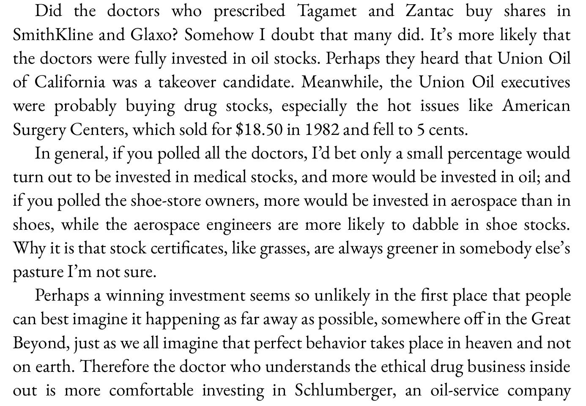
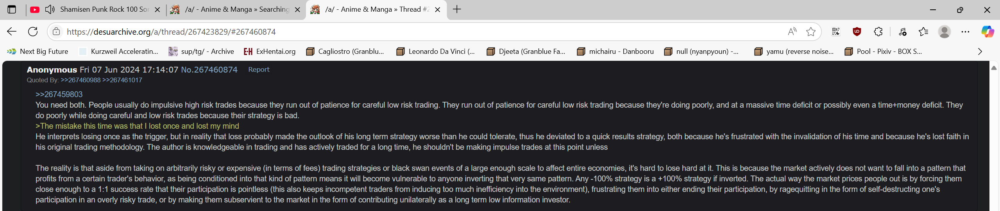

6/29/2025

10:10am. In order to help ensure discipline in my trading, I've decided according to my usual style to open a public trading journal.

Because of my work with Tao Ceti, I am too busy to spend monologuing in the Spiral language or the ML library repo, and I am probably being a nuisance posting stock market & trading related messages in the company's Discord channel. It's not a big deal since there are only 2 other guys there, but I doubt they are interested in this, so I should move that kind of posting in its proper place.

I've been considering various avenues to improve my trading.

One option would be to put some effort into actually understanding what I am trading, so I am considering learning finance and economics. There should be good courses on these subjects like on platforms like Coursera or Udacity. I should also start doing fundamental research. But I am skeptical of those approaches to getting better for reasons I will get into later.

Over the past week I've had many days when I've been stressed out due to the market specifically, and had trouble sleeping. Being tired the next day has been impacting my performance at work negatively. And it's not really pleasant to be awake a couple of nights in a row because my brain is simply refusing to switch off and get some rest, even though I was lying in bed.

I've started trading 3 months ago, and my holding periods are long so there haven't been many of them, so I'll be going over them later. But for now, let me start with the most important part of this repo which is describing my trading methodology. I'll do that in a separate file.

8:25pm. I'll do the analysis later as I am really tired from writing that [large document](/methodology.md). Hopefully this will allow me to reach catharsis. I just want to get this out so I can sleep well during the night.

I wish I could just tell my brain to take a break, but that isn't how it works for me.

7/1/2025

10:30pm. https://youtu.be/dfGuhlQ-CLQ?list=PLOPDD0ChIJDhbKz0bquZeNkECGKZxpRpK
Sheridan Titman On His Seminal Paper on Momentum Investing and What He Has Learned Since

Watching this video and he says some very interesting things like that momentum actually works better the more efficient the market is. It works best in the US, but in Japan or China it doesn't.

Will work on trade analysis during the weekend. Don't feel like it during my workdays.

So far the week did start out pretty challenging. I absolutely must hold this week and the next 3. As scary as the market is now, it's much more dangerous to sell out early than late.

7/2/2025

9:40am. I got up early today I started wondering about Japanese stocks and whether what Sheridan said was true.

So what I've been doing for the past hour is going over the stock charts of all the Japanese stocks sorted by 6 month momentum, and I cannot find even a single one worth trading.

The 8-week uptrend rule simply doesn't work, the momentum stocks just spike and then sit there for months. They also generally have huge and sudden declines, and have wild swings all over the place. There is no trend, they just pierce. So I think he is right.

I am sure that if I only had the Tokyo market to trade, I might as well retire.

I didn't realize at all how much my method is dependant on liquidity. It does seem to be the case that the more efficient the market is, the better it works. Japan needs a proper bull market to draw the money into it.

Given the lesson, I think the top down approach is even more important than I thought. There is a bull market is europe which will make my methods work well. Having the money come into the market is what is needed for liquidity, which should ameliorate the wild swings we see in Tokyo stocks.

7/4/2025

10:10pm. Finally the workdays are over. I'll do some trade analysis starting tomorrow.

https://youtu.be/robBbj7jZFo
Buying Winning Stocks Through Momentum Investing w/ Wes Gray (MI140)

Interesting interview. He says that companies with good price action have a fundamentally cheaper access to capital which improves their fundamentals.

https://youtu.be/robBbj7jZFo?t=1312
> The US is the greatest survivor bias experiment of all time.

https://youtu.be/robBbj7jZFo?t=1832
> The minute you try to impose quality or valuation, anything that smells like a value investor was involved, you're just going to ruin the momentum strategy.

This interview on momentum is by a value guy who mechanised it. It's pretty interesting.

https://youtu.be/robBbj7jZFo?t=2889
> It's a total value dog because it's just so cheap on cash flow basis and the expectations were so terrible, but those guys couldn't get out of their own way trying to raise capital to help them out. All of a sudden, they go on a short squeeze, price action goes bonkers and because they can raise capital for like negative cost to capital it seems...I don't know if that a concept...now they're like fundamentally in a better position as a business than they've ever been in the history of their lives! Just because of price action!

https://youtu.be/X9Yapfh9VlE
An In Depth Look at Momentum Investing and Trend Following with Jack Vogel

I'll leave this one for tomorrow.

7/5/2025

1:20pm. https://youtu.be/PT6lhOaBufk?t=1436
Here’s How To Trade The High-Octane IPO Boom | Investing With IBD

Didn't know that Stripe will IPO.

https://youtu.be/lpqmTse5TKI?t=2416
Why Minervini Calls Volatility A Rare Moment For This Market | Investing With IBD

I wonder what the Strategy 33 Model is doing. Right now I am just watching financial videos and looking at charts. I meant to continue the analysis from last week, but ended up doing what I want instead.

I'll finish this video and then resume.

3pm. Let me do some work on the analysis. Enough watching vids.

7/6/2025

10:45am. Reading Peter Lynch's One Up On Wall Street book.

I find this investment philosophy very interesting. Based on what he is saying I should have invested in Nvidia, though at that point I had no money to invest and had thrown in the towel.

Reading this makes me realize that I was wrong about not being connected to anything. I have my own narrow circle of competence due to my work as a software engineer.

9:25pm. https://www.youtube.com/watch?v=kJtCKz1o5H4
The Dark Side of Value Investing | Practical Lessons from Aswath Damodaran

7/7/2025

9:30am. https://youtu.be/inI0SC3Zj4A
Bitcoin on the Balance Sheet: Why Companies Are Turning to Crypto as a Treasury Strategy

This video is amazing. I wasn't aware what was driving the Bitcoin prices up lately.

7pm. https://cow.fi/
Token - Maple Financial

I'll go into what these two mean later. Logris showed me an example of amazing earnings acceleration that led the price rise in Maple Financial. He made a mistake of not betting big on this opportunity in my view.

7/8/2025

9:15pm. https://www.youtube.com/watch?v=7v6DQ4qyYIo
How to Build a Trend Following System | Interview with Tom Basso | Hedge Fund Manager

He is saying that buy and sell decisions aren't as important as beginners think they are.

Yeah, I think I need to loosen up.

I've been thinking about my trading going forward and if the current positive price action continues into the end of next week, I am going to buy RHM in order to increase my exposure to it. The ETF only has 10% in it, but I'd like if it were higher. Bringing it up to 20% by buying shares of it directly should do the trick.

I need to loosen up. I did a good job by trading my portfolio in pieces and I should continue that. Every two weeks I should be increasing or decreasing instead of standing still.

Doing this move would only change my long exposure from 101 to 110% and after I get paid from my job, the margin would get paid down to 100%.

I do want to start phasing out my ETF trading in favor of trading stocks directly. I am not going to be adding any more to my ETF positions.

Ironically, I think the way I've been trading ETFs now is how I'll trade when I am much bigger. But right now I am just throwing away alpha.

To be honest, the line between beta and alpha is blurred to me. Beta is alpha during bull markets.

10:45pm. https://youtu.be/jD4nynuWfEU
The Reality of Relative Strength Based Trading with Linda Raschke

There is so much out there on how to trade well these days. I'll watch this tomorrow.

7/10/2025

9:50pm. 

God, I wish I had Jeffrey Neumann's insight. He is to trading what Elon Musk is to entrepreneurship. I was never envious of other traders until I read his interview in the newest Market Wizards book.

They are both lucksacks, but unlike Elon whose past successes seem like a fluke now, Jeffrey has the intelligence to match his success.

I am reminded of Ed Seykota's quote that it's rare that nature provides the ability to meet a burning desire in a person.

10pm. I've decided. I think at the end of next week, I am going to sell down my DEFS position in order to make room for RHM.

I want to bring up my exposure in that stock up to 25% at least. Then in two weeks I am going to sell it to make room for something else, and that way I am going to wean myself off ETFs and into individual market leaders.

I told myself I wasn't going to do it, but deep down I know that I need to do this at some point and I might as well do it 'now'. By 'now' I mean, every two weeks. 

10:05pm. There are a lot of stocks going up right now, but if I want to be successful, I should avoid random individual momentum and trade themes.

There are 3 major ones and 1 minor (East Europe) in play currently.

1) Defense stocks.
2) AI.
3) Crypto.
4) East Europe - Croatia and Slovenia.

It's not just European defense stocks, for some reason South Korea is going crazy and there are a ton of momentum picks in that market.

AI is mostly Nvidia, but it has some stocks on its tails like CoreWeave. I think that 2-3 months down the road once it digest the rapid runup, I am probably going to be buying it.

Crypto is mostly Bitcoin. It seems like it's close to breaking out, but I want to give it 3 weeks in order to see how it acts around the breakout point.

In Croatia where I live there is a lot of inflation and the stock markets of Crotia and Slovenia have burst from 1.5 decade long consolidations. Reminds me of China and the emerging markets in the 00s. Back then it also made a huge move.

Too bad I didn't buy this instead of the euro ETFs or ASWC.

I need to pay more attention from here on out.

I just checked in IB, and I am restricted buying due to dumb European regulations. But maybe these regulations are doing me a favor. I really should be trading individual stocks instead of ETFs. ETFs are filled with laggards which will drag down my performance long term.

10:25pm. As an aside, here are some pullbacks that are good buying opportunities on my watchlist.

These are opportunities to buy momentum stocks at a better price point, but what makes them opportunities is that I stretched out my holding period to a minimum of two weeks.

I think the realization that I have to be operating at a 2 - 12 week timescales and move gradually in 2 week steps is the most important insight from my 6 years of failed trading and 11 years of absence. More than smart, I must be patient.

You can make a lot of money in stocks just by holding them for 1-3 months irrespective of patterns.

The market has a strong long bias and I simply didn't appreciate that at all. I simply didn't.

I need to sense the themes, and I need to rotate into the leaders. Then I have to hold and be on the looking for momentum pettering out on the 8 week scale in the leaders. If I can just watch the leaders, they will tell me when the market has topped.

If you're looking at the SPY, it's very hard to know what is happening, but when you see stocks that usually go up 30% per month stop doing that it's very much obvious.

I don't need a mechanical system like in the Janus factor book. I can tell what the themes are just by looking at the stocks themselves.

7/12/2025

12:50pm. Let me do some writing here. First, in a fit of inspiration yesterday I wrote a lot of posts to Logris, and I am going to paste some of them here.

Logris is a smart fundamental investor, and I am struggling to explain the principles behind my trading in a face to face talk so I wrote them down for him. And for me it's a good exercise to keep reinforcing them.

///

Finding KDEF got me curious about the South Korean market, and when I looked, I found there were a lot of great momentum picks in that market. It's amazing. I could imagine that after 3 decades of only tripling in price, it might be gearing up for another huge bull market. My view is that when a stock goes up 30% in a month it's no big deal, but it's an entirely different manner when the entire market does it. That has a lot of signal to it. It's not a certain thing that it will turn into a large bull market going forward, but it changes the odds.

***

There are also big bull markets in Slovenian and Crotian markets. For some reason the Expat Croatian ETF is underperforming the Crobex index greatly so I wouldn't recommend it.

On the ground in Croatia, there has been a lot of inflation, but I get the sense that the living standards are rising. People are complaining about the rising tourism prices, but the tourists are buying into them and the place is packed so that explains the bull market. In general, these markets are easy to handle using trend following systems.

***

I get the sense that I picked a really good time to get back into trading. The market really shrugged off the tariff negativity and is streaming higher, which is strong indication we're in a bull market. Even BTC is breaking out.

***

The UK market is the opposite of South Korea. All the momentum picks on the London market are absolute trash. The high fliers are mostly pump and dumps. The rest which I'd actually consider buying smoother ones have highly volatile low quality patterns. High quality patterns are like you'd see on RHM currently. High momentum, and also low volatility on the weeklies which will make it much easier to tell when the trend has shifted.

I've done a huge amount of chart reading in the past, and part of why I threw in the towel is because I haven't been able to discover anything that has a predictive quality in terms of future price direction. Despite doing it for years, I've had to conclude that the day to day price is mostly random. I'd buy a stock, try holding the winners and cutting losers, but it just ended up churning my account. I wasn't at all good at trend following. Ironically, all the price randomness made me go the wrong way and caused me to shorten my time horizons when I should've been expanding them.

But now that I've come back to trading and corrected my holding periods, I also have insight about price movements that I didn't before...

***

You cannot predict prices, but what is true that different market regimes exist: trending markets (either bull or bear) and sideways markets. What I am doing now is thinking of various different scenarios: are we in a bull market, bear or a trendless market and putting % odds on each. I am sharpening my intuition about the current market environment by studying how prices behave in each of such environments, which helps me narrow down the odds of various scenarios.

***

And because prices cannot be predicted, and it's only possible to interpret the characteristics of the current market, that means that the only real way to do market research is to actually take a position. My current theory is that by doing so the market will essentially tell me what the trend is. I understand now that it's actually necessary to be in the market to be able to tell what it's characteristics are. By taking a risk, I am essentially paying the market to do research for me.

***

The Maple Financial trade you've showed me is essentially trend following on fundamentals. You had sharply rising earnings, without knowing more, you know that it's likely that they will keep rising. You cannot be sure, but maybe you can say it's 70-80% likely? And prices follow earnings. So when eventually the earnings start stalling, you'll lower your odds of future price rises and that will make it more likely that you'll sell your position.

***

In the stock market, I know that prices follow earnings, but I don't have an army of analysts to study the various companies, so I have I have to draw my inferences in the opposite direction. If I see rising prices, I have to conjecture that good things are happening and vice versa.

***

To a degree, you can definitely tell which companies are good or not by their price action. In the extreme case, if you have a stock under 3$ a share, jumping 50% per day, you can tell that it's most likely a pump and dump and not a long term holding because most pumps and dumps act like that. And if a stock is not very volatile, that is has small daily changes, but has good persistence on the longer timescales - 2 weeks and up, then that tells you that it could be better than a random pick going forward.

***

That's the basics of it. The advanced part of trading is to be aware of things like groups movements, that the leaders top ahead of the market and drag down the sentiment when they inevitably start breaking. The Janus Factor book I posted goes into this in detail, but I don't think a mechanical system is necessary. You can generally see leading stocks expanding on the upside, toping ahead of the market and then breaking. The latter part causes investors in those become fearful. If you look at the charts of S&P the breaking points where the market becomes volatile seem random, but the panic starts from the leaders breaking and then spreads to the rest of the market.

***

I really love it when the market breaks sharply as it always results in great buying opportunities going forward. I've seen this over and over by now that it's become ingrained that panic leads to high returns in the future.

***

Regarding chart patterns, they don't work, but what I've realized recently that counterfactual thinking about the price action does. This has been trying to awaken in me for a long while.

***

To illustrate this, one stock which I am watching is CoreWeave.

It looks like this on the weeklies. I hate buying runups like these as that just leads to a lot of volatility. Large rises have a lot of pump in them regardless they are smooth or jumpy, which gets followed by a dump. I think the Quantitative Momentum book that I posted illustrated this well. Statistically, large 1 month moves lead to mean reversion while 6 month moves lead to expansion. That's just the statistical view. The counterfactual way of thinking where you are putting odds on various scenarios, would allow you to see while it's true that there is an immediate danger of reversal in the present, you know that the market leads would hold on to their gains even after a huge rise such as this one.

So by waiting a 2 months from this point in time, you can essentially cut off most of the laggards from scenario, which leaves the winners. Right now it might be the case that say, the stock is 25% likely to be in an uptrend, 50% flat, and 25% that it's going to sell off and enter a downtrend, but by waiting the necessary amount of time, it reveals the cards the market is holding.

***

By waiting 2 months the dump scenarios will get eliminated, leaving mostly the upwards trend continuation scenarios intact. At that point, the odds of an uptrend will be 60%, 20% flat and 20% downtrend.

***

I think that's how reasoning by price action works.

***

During my failing period, I don't think I understood this, so what I did was tried following the trend by buying strong runups like the ones in CRWV only to get stopped out.

***

I didn't get what exactly was the point of waiting for the 'handle' part in these chart patterns. Back then I thought that by waiting in this scenario, I'd just be missing out on a potential winner.

***

And I did understand one part correctly - the biggest winners of the future do start out by making huge initial moves like CRWV did here. So back then it made sense that I should be buying when the stock looks very overextended. That didn't work well for me.

***

I will admit, the defense stocks do look overextended now, so there is a possibility that they might go sideways for a prolonged period of time. A part of me thinks that.

***

But we're in a strong bull market. And they are the dominant group, so what else are the investors going to put money but the dominant group. If wasn't for the April tariff tipping the market's hand, I'd be a lot more scared holding these stocks right now.

***

I had to write this because when I talk to you about finance, you always talk about about fundamentals, and I am struggling in the head of the moment to elucidate how to bring out my own perspective because you are thinking in a very different way than I do.

***

Oh yeah, incidentally, do you know know why cutting losses is good in trading?

***

Assuming you are long an uptrending stock, and the price declines an abnormal % below your buy point that gives you important information. You know how winners act, and they don't do sharp declines, so you know that the odds have changed. Instead of the odds of an uptrend scenario being 70%, a single day's price action can lower it to 40% and make other less beneficial scenarios much more likely. If it takes time, say two weeks and doesn't recover even if it's something like being 10% down, while that might not damage your account balance much, it can do great damage to your estimation of whether the stock is a leader! So the rational move becomes to sell and move that money in better opportunities.

***

In your Curve trade, you were never considering the trend of a stock to begin with, and you didn't sell it when it fell. But that's fine, from a technical perspective it wasn't in an uptrend, so it going down 10-30% didn't invalidate your investment thesis.

***

The way I see it, when you bought it at 0.3 it was a sideways, choppy non-trend, and at 0.2 it was still in the same scenario. From that perspective, nothing abnormal was happening. So it made no sense to sell when it went down.

***

With Maple Financial, it had a definite trend and you could trade based on whether it matches the profile of a winner, with stops in order to limit your risk.

***

It's a different world from value investing.

***

From my current perspective, trading is easier than it seemed. You know that daily price action is mostly random, so you don't have to be hung up about specific patterns. It's mostly about momentum on various monthly timescales, and volatility on the shorter ones. Of course, if you are fishing for uptrends, then you want to hold winners as 1 month momentum when you're heading into it positioned long verifies the trading thesis. Strong leaders have to go up on the 8 - 12 week timescale. The best ones do it on an 8 week timescale.

***

Up they start going up far too quickly and the volume starts coming in, that's a sign to exit as the large traders will be taking advantage of that opportunity to sell the stock to future bag holders.

***

If you miss this opportunity, the only other option is to sell on declines once the 8 week pattern starts breaking. Alternatively, the declines can become particularly large even before the 8 weeks are up which is another sign of trend change. I've also notice that often the leaders will slow down even if they don't turn and that's also a sell signal. Strong upwards momentum becomes weak upwards momentum, and that makes the stock vulnerable to a selloff.

***

I think that what I am most afraid of when it comes to euro defense stocks right now. Then ran up so hard that I wouldn't be surprised if they start getting exhausted. We might end up holding weak leaders rather than strong ones. But we can still make money from that scenario.

***

I am also starting to become bullish on BTC due to it's price action. If it can break out gently and maintain the level for a few weeks, that will make it likely that's in an uptrend and not in a consolidation. I wouldn't expect BTC to make a strong move like in the past, but maybe it could uptrend for a couple of months once it gets going. The beauty of strong leaders is that they give you a lot of time to get in.

***

It's the stocks that act jumpy and run away that are bad trading candidates.

***

The market is very strong right now so I doubt that BTC will turn into a rout, but the breakout might fail and it might consolidate for many months instead.

***

Incidentally, why is pyramiding and averaging up good in these situations?

***

The theory behind is that when you have a probable uptrend, but not a confirmed one you bet small, and as the odds of it rise, you commensurately adjust your size to account for the improved odds. It makes zero sense if you already have a confirmed signal to get in.

***

Also psychologically it becomes easier to buy if the trading vehicle moves significantly from the buy point if you have half or a third of your position already.

***

Going into the future, I'll be using that technique to scale in every two weeks from low points - like after market panics, rather than breakouts.

***

It makes sense to do this after market panics because how the market acts after panics tells you a lot about the true environment. In bull markets the low prices get bought up, but in bear markets the buying pressure disappears and they head lower. So by buying on the way up, you are using a technique that primarily works in uptrends, and gives you a small loss in downtrends. And gives you some protection against choppy, sideways markets.

***

Going by that reasoning, one trading idea is to buy a partial position in CRWV now and scale in gradually as the odds of it being a winner improve. You know that winners hold on to their gains, so wouldn't make sense to buy on the way down, only on the way up.

***

This is also why averaging down is so bad. It ensures that the trader maximizes his losses on the way down when the stock is in downtrending mode.

***

When you're buying on the way up you don't get the best price, but at least it keeps you out of losers.

***

On a similar vein, by taking small profits often, it leads to rotation into laggards. Though that must be balanced by the fast that strong momentum is mean reverting.

***

The only real defense against short term mean reversion is to be aware of the market themes and buy winners that have potential to run far instead of random momentum picks.

***

Or to be keenly aware of the individual stocks fundamentals and future earnings potential.

***

Mhhhh...I think this should be good enough to illuminate how I think about the markets.

***

One last thing, what about selling on the way up?

***

I think I should do it. Even if the winner is proven, being long after a long period advance will increase the risk. Instead of gambling, it makes sense to adjust position based on odds, and long advances make the odds of a short term countertrend more likely. The advances are what traders are aiming for, but they are also worth fearing. We'd want to reduce our positions when the risk increases and increase them when the risk decreases.

***

Yeah, this should do it. I've never been a good trader, and I have only started crystalizing my experiences in the past few months so we'll see what the results will turn out to be.

///

There was more in the thread, but I'll keep those parts private.

1:15pm. Now comes planning time. I've decided to sell 40% of DEFS and put them into stocks...

1:55pm. I think the main thing I should do now is check out on which exchanges these stocks are trading and get the market data subscriptions. Last time when I rotated my portfolio I did so with delayed data, which isn't the smartest way of doing things.

The market data is so damn expensive!

This is the one I need for LTMC.

Ok, nevermind. I'll just look at the delayed quotes as I have and move the limits gradually until they get hit.

I hate paying for services.

But snapshots could be worth it.

Ok, I see it. Nope, I don't have snapshots for LTMC, but I have for US stocks.

1:55pm. Ok, thinking time.

Subscribing to Xerta and Borsa Italiana (BVMI) 77 + 18 = 95 euros per month. Over a year that would come up to ~1,200 euros. So to make this trade worth it, the value of real time data has to be greater than the slippage I'd incur from using delayed quotes.

Even with a 1m portfolio those data expenses would come up to 0.12% per year. For me, they'd be 10x that. Am I willing to pay 1.2% of my annual return to get this data?

I don't think I am.

The slippage would have to be worse than 1.2% cummulative over the course of a year for real time data to be worth subscribing to.

I think I'll just save my money.

2:05pm. With that decided, tactics time. The way I rotated out of AWCS and into DEFS was weird, so what I am going to do this time is plan things better.

I'll go with the prinicple of buying slowly and selling quickly.

On Thursday I'll put in my limit orders and then sell DEFS at the market as they get executed. There will be a short period where I will be leveraged 140% as a result, but I won't go broke due to it.

2:10pm. I think I'll restrain my urge to buy low and just put in orders at the previous day closing price. Some of the time the stock will gap up and I won't get filled, but a lot of the time it should be fine. The problem with most breakout is that they take too long to run afterwards, not that they're too quick! You have to hold them for a month to get the best result.

2:15pm. The problem with the AWCS to DEFS rotation is that I was too squeeamish over being 200% long even for a short time intraday, but I shouldn't have worried that much.

I put in a pretty patient and low limit for DEFS, that I was surprised it got hit. That would give me an edge on the trade.

4:20pm. No, it made sense to play it cautiosly like that and it worked out well in the end so all is fine. I shouldn't consider the way I acted a mistake.

If anything, I should blame myself for not doing enough research and jumping into the wrong ETF to begin with.

4:50pm. I am changing my mind. I am going to first buy RHM, then sell the needed DEFS, then buy R3NK, sell DEFS, buy LTMC, and finally sell DEFS. I thought that I put in the order to buy these and then sell DEFS as they get hit, but I think I want to play it cautiously. I don't want to get caught 140% long on the wrong side of the market. I want to go 120% long at most, which is why I'll rotate the DEFS position step by step.

5:50pm. It'd be best to do this quickly. I should come in at noon when it's quiet and just do the trades at the market prices. It's not like last month where the equities were selling off. Now the risk is that I'll miss the upside.

6:25pm. I guess I'll have to think about this more. I didn't think that DEFS position would hinder me so much. But it's not like I'll break the market by selling it, so I should just do it.

I've had really good luck with limit orders and being patient in entering my trades so I am loath to abandon that.

6:55pm. There are two ways of looking at a bull market. You imagine prices going up as if being pushed up from below. The implication of that kind of perspective is that they might blast off at any moment so I should better get in quickly.

Another perspective is that they are being weighted down and pushed downwards by some unseen force, but bravely and resolutely keep up despite the headwinds. In this pespective, downwards counter-trend moves are to be expected, and the lack of selling pressure means that the stock is resisting the downwards push from above.

After many years, I think that the latter model is far closer to reality than the first one which I had as a beginner.

The lesson is that I should not be afraid of letting things run their course for another week. There is no need to get scared about missing opportunity.

7:35pm. https://www.schwab.com/learn/story/does-market-timing-work

I read this yesterday and it a good lesson. The investor who played the market perfectly buying at every yearly low didn't do that much better than the one who bought at the high.

I think I am probably overvaluing getting in at a better place when the uptrend has been established. It's more important to sit tight than to time. Sometimes I should use limit orders to get in, but I shouldn't let that be my sole strategy.

Especially when I need to rotate, I'd be better off just doing it.

With the DEFS trade, once my first limit order was hit, I should have sold all that I had of ASWC at the market and bought DEFS right there even if it's 5.43 rather than 5.40.

Even if back then that might have been justifiable and worked, if try trading a whole portfolio of stocks like that, it's not going to end well.

I need to loosen up a bit more. The reason I failed a decade ago wasn't because of poor execution, but lack of planning.

My plan back then was to look for a plan. But treating the market like a video game isn't how one adapts to it.

8:45pm. Reading /a/ threads on FX Senshi Kurumi.

This pretty much happened to me. In the end, all the daily noise got to me and I quit. I didn't lose money, but 6 years of going nowhere is quite a loss regardless.

I remember in an interview with Jerry Parker that he said that investors think that trend following is the easy way to make money in the market, but he remarked that trend following is the most gut wrenching to trade there is.

8:50pm. To be fair, what CTAs do is take one marginal trade after another hoping to get lucky.

Momentum trading has a better edge. Compared to regular trend following, I am actually selective about what I trade rather than literally every single intrument in the world.

Here is an addendum to the plan. Maybe spending 1.2% per year on market subscriptions would be worth it if it improves my trade entries. On Monday, I'll take a look at the stocks I mentioned and see how large their spreads are before deciding whether to get a subscription. It's not like I have to keep paying them every single month.

Actually, I don't have to do that. I can just come in 1h before the close, at 4:30pm pick a spot and raise my bids by 0.1% every minute. That's bound to improve my execution, but the risk is that I might miss my trades.

But then I'd be doing that during my work hours...

It be a viable strategy if I were trading full time, but I am not. Gh...

Most likely the spreads won't be too bad.

How about this as entry strategy - I'll just keep moving my bid up to the low of the last 15m. I'll do that move every 15m.

If a stock has large spreads, that will ensure that I don't get raped by them.

If it turns out that the stock is strongly trending during the day, there is a chance that won't work, but intraday price action is noisy and trendless most of the time.

In fact, when it comes to limit orders, I should be using such a system for trading my salary from USDC into EUR.

I've been winging it with larger targets and time stops, and it has been a net benefit, but I know that I am just noise trading, and I'd be better off just shipping that into my stock market account instead.

But I don't think that hammering the market with market orders is the solution either. It sets a bad habit.

I'll decide what to do once I see the spreads.

9:10pm. 

Come to think of it, back when I was studying how to trade, after reading some trading books, I thought that momo trading is the way to trade, but momo stocks are a tiny universe of the whole market. There is no way that big players can take advantage of this style beyond a certain size. That really goes for everything.

But the most scalable approach is definitely value investing.

You have a centibillionaire value investor Buffet, but only centimillionaire momo traders.

Honestly I'd be happy with a cool 10m. Most people would rather have 10 million fast than 100 billion slow, and I am one of them.

I have other things that need doing.

9:20pm. One of the reasons why I must trade is because at this point in time I don't know what my expected annual return is. If it's 100% per year, that'd be fantastic, but even if it's just 5-10% per year higher than index investing that'll still make the effort worth it.

I think at worst, I'll just break even again.

The only way to lose big money with this method is to rid the big winners on the way down - in other words, not cut my losses.

The other way would be to take too much risk, either by using leverage, overly concentrated stock positions, or investing in poor candidates.

With 20-30% positions I'll be getting close to the line on that second point, but that's not over the line. 25% per market leader is just about right.

9:35pm. I could be reading the manga, but the /a/ threads are more interesting to me these days.

9:45pm. Lol.

10pm. Kurumi-chan's author is hillarious.

10:05pm. This is insightful

I never realized it before, but this is true up to a point. I never thought that a bank might not care if it doesn't get the loan paid.

I mean, if it never books a loss, where is it going to show up?

This subject might be something worth asking the chatbots in the future. I assumed there'd be guardrails against this, but if a bank is intent on hiding losses only the regulators would possibly know. It's not like banks would lose their own money from making bad loans. They'd just cause inflation.

...No this has to be wrong. If this behavior becomes widespread you get the 2008 crisis. The financial sector got destroyed by the markets at that time once the extent of the losses was realized.

10:25pm. Reading this manga makes me deeply uncomfortable. I've seen it described as psychological ryona, and that description is very apt.

She was already close to dying, why is she increasing the position size after barely surviving?

Does she at some point realize she needs risk management in order to win?

Is this what Jesse Livermore was like?

She should read Mark Minervini's books.

Fx Senshi Kurumi-chan should be a must read for every trader. Amazing how the author trades the same way, and has learned nothing from his own manga. That is truly next level dedication to his work.

10:35pm. You can imagine how well the trade went for her.

I should remember this could very well be me if I leverage myself in the stock market, or bet more than 25% on a single stock. Or don't cut my losses or buy into obvious pump and dumps.

It really hits too hard.

11:30pm. If there is one thing I've learned from index investing, it's that being long the market pays in general. I wouldn't like be subservient to the market, but it is a giant money sucking machine, and stocks that aren't going down are likely to go up. This is the basis of my entire trading plan really. Of course after a certain point I assume that stocks that aren't going up will go down and get out. The 8 weeks rule guides me.