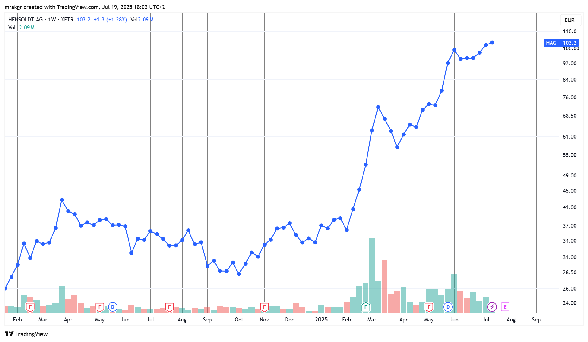

6/29/2025

10:10am. In order to help ensure discipline in my trading, I've decided according to my usual style to open a public trading journal.

Because of my work with Tao Ceti, I am too busy to spend monologuing in the Spiral language or the ML library repo, and I am probably being a nuisance posting stock market & trading related messages in the company's Discord channel. It's not a big deal since there are only 2 other guys there, but I doubt they are interested in this, so I should move that kind of posting in its proper place.

I've been considering various avenues to improve my trading.

One option would be to put some effort into actually understanding what I am trading, so I am considering learning finance and economics. There should be good courses on these subjects like on platforms like Coursera or Udacity. I should also start doing fundamental research. But I am skeptical of those approaches to getting better for reasons I will get into later.

Over the past week I've had many days when I've been stressed out due to the market specifically, and had trouble sleeping. Being tired the next day has been impacting my performance at work negatively. And it's not really pleasant to be awake a couple of nights in a row because my brain is simply refusing to switch off and get some rest, even though I was lying in bed.

I've started trading 3 months ago, and my holding periods are long so there haven't been many of them, so I'll be going over them later. But for now, let me start with the most important part of this repo which is describing my trading methodology. I'll do that in a separate file.

8:25pm. I'll do the analysis later as I am really tired from writing that [large document](/methodology.md). Hopefully this will allow me to reach catharsis. I just want to get this out so I can sleep well during the night.

I wish I could just tell my brain to take a break, but that isn't how it works for me.

7/1/2025

10:30pm. https://youtu.be/dfGuhlQ-CLQ?list=PLOPDD0ChIJDhbKz0bquZeNkECGKZxpRpK
Sheridan Titman On His Seminal Paper on Momentum Investing and What He Has Learned Since

Watching this video and he says some very interesting things like that momentum actually works better the more efficient the market is. It works best in the US, but in Japan or China it doesn't.

Will work on trade analysis during the weekend. Don't feel like it during my workdays.

So far the week did start out pretty challenging. I absolutely must hold this week and the next 3. As scary as the market is now, it's much more dangerous to sell out early than late.

7/2/2025

9:40am. I got up early today I started wondering about Japanese stocks and whether what Sheridan said was true.

So what I've been doing for the past hour is going over the stock charts of all the Japanese stocks sorted by 6 month momentum, and I cannot find even a single one worth trading.

The 8-week uptrend rule simply doesn't work, the momentum stocks just spike and then sit there for months. They also generally have huge and sudden declines, and have wild swings all over the place. There is no trend, they just pierce. So I think he is right.

I am sure that if I only had the Tokyo market to trade, I might as well retire.

I didn't realize at all how much my method is dependant on liquidity. It does seem to be the case that the more efficient the market is, the better it works. Japan needs a proper bull market to draw the money into it.

Given the lesson, I think the top down approach is even more important than I thought. There is a bull market is europe which will make my methods work well. Having the money come into the market is what is needed for liquidity, which should ameliorate the wild swings we see in Tokyo stocks.

7/4/2025

10:10pm. Finally the workdays are over. I'll do some trade analysis starting tomorrow.

https://youtu.be/robBbj7jZFo
Buying Winning Stocks Through Momentum Investing w/ Wes Gray (MI140)

Interesting interview. He says that companies with good price action have a fundamentally cheaper access to capital which improves their fundamentals.

https://youtu.be/robBbj7jZFo?t=1312
> The US is the greatest survivor bias experiment of all time.

https://youtu.be/robBbj7jZFo?t=1832
> The minute you try to impose quality or valuation, anything that smells like a value investor was involved, you're just going to ruin the momentum strategy.

This interview on momentum is by a value guy who mechanised it. It's pretty interesting.

https://youtu.be/robBbj7jZFo?t=2889
> It's a total value dog because it's just so cheap on cash flow basis and the expectations were so terrible, but those guys couldn't get out of their own way trying to raise capital to help them out. All of a sudden, they go on a short squeeze, price action goes bonkers and because they can raise capital for like negative cost to capital it seems...I don't know if that a concept...now they're like fundamentally in a better position as a business than they've ever been in the history of their lives! Just because of price action!

https://youtu.be/X9Yapfh9VlE
An In Depth Look at Momentum Investing and Trend Following with Jack Vogel

I'll leave this one for tomorrow.

7/5/2025

1:20pm. https://youtu.be/PT6lhOaBufk?t=1436
Here’s How To Trade The High-Octane IPO Boom | Investing With IBD

Didn't know that Stripe will IPO.

https://youtu.be/lpqmTse5TKI?t=2416
Why Minervini Calls Volatility A Rare Moment For This Market | Investing With IBD

I wonder what the Strategy 33 Model is doing. Right now I am just watching financial videos and looking at charts. I meant to continue the analysis from last week, but ended up doing what I want instead.

I'll finish this video and then resume.

3pm. Let me do some work on the analysis. Enough watching vids.

7/6/2025

10:45am. Reading Peter Lynch's One Up On Wall Street book.

I find this investment philosophy very interesting. Based on what he is saying I should have invested in Nvidia, though at that point I had no money to invest and had thrown in the towel.

Reading this makes me realize that I was wrong about not being connected to anything. I have my own narrow circle of competence due to my work as a software engineer.

9:25pm. https://www.youtube.com/watch?v=kJtCKz1o5H4
The Dark Side of Value Investing | Practical Lessons from Aswath Damodaran

7/7/2025

9:30am. https://youtu.be/inI0SC3Zj4A
Bitcoin on the Balance Sheet: Why Companies Are Turning to Crypto as a Treasury Strategy

This video is amazing. I wasn't aware what was driving the Bitcoin prices up lately.

7pm. https://cow.fi/
Token - Maple Financial

I'll go into what these two mean later. Logris showed me an example of amazing earnings acceleration that led the price rise in Maple Financial. He made a mistake of not betting big on this opportunity in my view.

7/8/2025

9:15pm. https://www.youtube.com/watch?v=7v6DQ4qyYIo
How to Build a Trend Following System | Interview with Tom Basso | Hedge Fund Manager

He is saying that buy and sell decisions aren't as important as beginners think they are.

Yeah, I think I need to loosen up.

I've been thinking about my trading going forward and if the current positive price action continues into the end of next week, I am going to buy RHM in order to increase my exposure to it. The ETF only has 10% in it, but I'd like if it were higher. Bringing it up to 20% by buying shares of it directly should do the trick.

I need to loosen up. I did a good job by trading my portfolio in pieces and I should continue that. Every two weeks I should be increasing or decreasing instead of standing still.

Doing this move would only change my long exposure from 101 to 110% and after I get paid from my job, the margin would get paid down to 100%.

I do want to start phasing out my ETF trading in favor of trading stocks directly. I am not going to be adding any more to my ETF positions.

Ironically, I think the way I've been trading ETFs now is how I'll trade when I am much bigger. But right now I am just throwing away alpha.

To be honest, the line between beta and alpha is blurred to me. Beta is alpha during bull markets.

10:45pm. https://youtu.be/jD4nynuWfEU
The Reality of Relative Strength Based Trading with Linda Raschke

There is so much out there on how to trade well these days. I'll watch this tomorrow.

7/10/2025

9:50pm. 

God, I wish I had Jeffrey Neumann's insight. He is to trading what Elon Musk is to entrepreneurship. I was never envious of other traders until I read his interview in the newest Market Wizards book.

They are both lucksacks, but unlike Elon whose past successes seem like a fluke now, Jeffrey has the intelligence to match his success.

I am reminded of Ed Seykota's quote that it's rare that nature provides the ability to meet a burning desire in a person.

10pm. I've decided. I think at the end of next week, I am going to sell down my DEFS position in order to make room for RHM.

I want to bring up my exposure in that stock up to 25% at least. Then in two weeks I am going to sell it to make room for something else, and that way I am going to wean myself off ETFs and into individual market leaders.

I told myself I wasn't going to do it, but deep down I know that I need to do this at some point and I might as well do it 'now'. By 'now' I mean, every two weeks. 

10:05pm. There are a lot of stocks going up right now, but if I want to be successful, I should avoid random individual momentum and trade themes.

There are 3 major ones and 1 minor (East Europe) in play currently.

1) Defense stocks.
2) AI.
3) Crypto.
4) East Europe - Croatia and Slovenia.

It's not just European defense stocks, for some reason South Korea is going crazy and there are a ton of momentum picks in that market.

AI is mostly Nvidia, but it has some stocks on its tails like CoreWeave. I think that 2-3 months down the road once it digest the rapid runup, I am probably going to be buying it.

Crypto is mostly Bitcoin. It seems like it's close to breaking out, but I want to give it 3 weeks in order to see how it acts around the breakout point.

In Croatia where I live there is a lot of inflation and the stock markets of Crotia and Slovenia have burst from 1.5 decade long consolidations. Reminds me of China and the emerging markets in the 00s. Back then it also made a huge move.

Too bad I didn't buy this instead of the euro ETFs or ASWC.

I need to pay more attention from here on out.

I just checked in IB, and I am restricted buying due to dumb European regulations. But maybe these regulations are doing me a favor. I really should be trading individual stocks instead of ETFs. ETFs are filled with laggards which will drag down my performance long term.

10:25pm. As an aside, here are some pullbacks that are good buying opportunities on my watchlist.

These are opportunities to buy momentum stocks at a better price point, but what makes them opportunities is that I stretched out my holding period to a minimum of two weeks.

I think the realization that I have to be operating at a 2 - 12 week timescales and move gradually in 2 week steps is the most important insight from my 6 years of failed trading and 11 years of absence. More than smart, I must be patient.

You can make a lot of money in stocks just by holding them for 1-3 months irrespective of patterns.

The market has a strong long bias and I simply didn't appreciate that at all. I simply didn't.

I need to sense the themes, and I need to rotate into the leaders. Then I have to hold and be on the looking for momentum pettering out on the 8 week scale in the leaders. If I can just watch the leaders, they will tell me when the market has topped.

If you're looking at the SPY, it's very hard to know what is happening, but when you see stocks that usually go up 30% per month stop doing that it's very much obvious.

I don't need a mechanical system like in the Janus factor book. I can tell what the themes are just by looking at the stocks themselves.

7/12/2025

12:50pm. Let me do some writing here. First, in a fit of inspiration yesterday I wrote a lot of posts to Logris, and I am going to paste some of them here.

Logris is a smart fundamental investor, and I am struggling to explain the principles behind my trading in a face to face talk so I wrote them down for him. And for me it's a good exercise to keep reinforcing them.

///

Finding KDEF got me curious about the South Korean market, and when I looked, I found there were a lot of great momentum picks in that market. It's amazing. I could imagine that after 3 decades of only tripling in price, it might be gearing up for another huge bull market. My view is that when a stock goes up 30% in a month it's no big deal, but it's an entirely different manner when the entire market does it. That has a lot of signal to it. It's not a certain thing that it will turn into a large bull market going forward, but it changes the odds.

***

There are also big bull markets in Slovenian and Crotian markets. For some reason the Expat Croatian ETF is underperforming the Crobex index greatly so I wouldn't recommend it.

On the ground in Croatia, there has been a lot of inflation, but I get the sense that the living standards are rising. People are complaining about the rising tourism prices, but the tourists are buying into them and the place is packed so that explains the bull market. In general, these markets are easy to handle using trend following systems.

***

I get the sense that I picked a really good time to get back into trading. The market really shrugged off the tariff negativity and is streaming higher, which is strong indication we're in a bull market. Even BTC is breaking out.

***

The UK market is the opposite of South Korea. All the momentum picks on the London market are absolute trash. The high fliers are mostly pump and dumps. The rest which I'd actually consider buying smoother ones have highly volatile low quality patterns. High quality patterns are like you'd see on RHM currently. High momentum, and also low volatility on the weeklies which will make it much easier to tell when the trend has shifted.

I've done a huge amount of chart reading in the past, and part of why I threw in the towel is because I haven't been able to discover anything that has a predictive quality in terms of future price direction. Despite doing it for years, I've had to conclude that the day to day price is mostly random. I'd buy a stock, try holding the winners and cutting losers, but it just ended up churning my account. I wasn't at all good at trend following. Ironically, all the price randomness made me go the wrong way and caused me to shorten my time horizons when I should've been expanding them.

But now that I've come back to trading and corrected my holding periods, I also have insight about price movements that I didn't before...

***

You cannot predict prices, but what is true that different market regimes exist: trending markets (either bull or bear) and sideways markets. What I am doing now is thinking of various different scenarios: are we in a bull market, bear or a trendless market and putting % odds on each. I am sharpening my intuition about the current market environment by studying how prices behave in each of such environments, which helps me narrow down the odds of various scenarios.

***

And because prices cannot be predicted, and it's only possible to interpret the characteristics of the current market, that means that the only real way to do market research is to actually take a position. My current theory is that by doing so the market will essentially tell me what the trend is. I understand now that it's actually necessary to be in the market to be able to tell what it's characteristics are. By taking a risk, I am essentially paying the market to do research for me.

***

The Maple Financial trade you've showed me is essentially trend following on fundamentals. You had sharply rising earnings, without knowing more, you know that it's likely that they will keep rising. You cannot be sure, but maybe you can say it's 70-80% likely? And prices follow earnings. So when eventually the earnings start stalling, you'll lower your odds of future price rises and that will make it more likely that you'll sell your position.

***

In the stock market, I know that prices follow earnings, but I don't have an army of analysts to study the various companies, so I have I have to draw my inferences in the opposite direction. If I see rising prices, I have to conjecture that good things are happening and vice versa.

***

To a degree, you can definitely tell which companies are good or not by their price action. In the extreme case, if you have a stock under 3$ a share, jumping 50% per day, you can tell that it's most likely a pump and dump and not a long term holding because most pumps and dumps act like that. And if a stock is not very volatile, that is has small daily changes, but has good persistence on the longer timescales - 2 weeks and up, then that tells you that it could be better than a random pick going forward.

***

That's the basics of it. The advanced part of trading is to be aware of things like groups movements, that the leaders top ahead of the market and drag down the sentiment when they inevitably start breaking. The Janus Factor book I posted goes into this in detail, but I don't think a mechanical system is necessary. You can generally see leading stocks expanding on the upside, toping ahead of the market and then breaking. The latter part causes investors in those become fearful. If you look at the charts of S&P the breaking points where the market becomes volatile seem random, but the panic starts from the leaders breaking and then spreads to the rest of the market.

***

I really love it when the market breaks sharply as it always results in great buying opportunities going forward. I've seen this over and over by now that it's become ingrained that panic leads to high returns in the future.

***

Regarding chart patterns, they don't work, but what I've realized recently that counterfactual thinking about the price action does. This has been trying to awaken in me for a long while.

***

To illustrate this, one stock which I am watching is CoreWeave.

It looks like this on the weeklies. I hate buying runups like these as that just leads to a lot of volatility. Large rises have a lot of pump in them regardless they are smooth or jumpy, which gets followed by a dump. I think the Quantitative Momentum book that I posted illustrated this well. Statistically, large 1 month moves lead to mean reversion while 6 month moves lead to expansion. That's just the statistical view. The counterfactual way of thinking where you are putting odds on various scenarios, would allow you to see while it's true that there is an immediate danger of reversal in the present, you know that the market leads would hold on to their gains even after a huge rise such as this one.

So by waiting a 2 months from this point in time, you can essentially cut off most of the laggards from scenario, which leaves the winners. Right now it might be the case that say, the stock is 25% likely to be in an uptrend, 50% flat, and 25% that it's going to sell off and enter a downtrend, but by waiting the necessary amount of time, it reveals the cards the market is holding.

***

By waiting 2 months the dump scenarios will get eliminated, leaving mostly the upwards trend continuation scenarios intact. At that point, the odds of an uptrend will be 60%, 20% flat and 20% downtrend.

***

I think that's how reasoning by price action works.

***

During my failing period, I don't think I understood this, so what I did was tried following the trend by buying strong runups like the ones in CRWV only to get stopped out.

***

I didn't get what exactly was the point of waiting for the 'handle' part in these chart patterns. Back then I thought that by waiting in this scenario, I'd just be missing out on a potential winner.

***

And I did understand one part correctly - the biggest winners of the future do start out by making huge initial moves like CRWV did here. So back then it made sense that I should be buying when the stock looks very overextended. That didn't work well for me.

***

I will admit, the defense stocks do look overextended now, so there is a possibility that they might go sideways for a prolonged period of time. A part of me thinks that.

***

But we're in a strong bull market. And they are the dominant group, so what else are the investors going to put money but the dominant group. If wasn't for the April tariff tipping the market's hand, I'd be a lot more scared holding these stocks right now.

***

I had to write this because when I talk to you about finance, you always talk about about fundamentals, and I am struggling in the head of the moment to elucidate how to bring out my own perspective because you are thinking in a very different way than I do.

***

Oh yeah, incidentally, do you know know why cutting losses is good in trading?

***

Assuming you are long an uptrending stock, and the price declines an abnormal % below your buy point that gives you important information. You know how winners act, and they don't do sharp declines, so you know that the odds have changed. Instead of the odds of an uptrend scenario being 70%, a single day's price action can lower it to 40% and make other less beneficial scenarios much more likely. If it takes time, say two weeks and doesn't recover even if it's something like being 10% down, while that might not damage your account balance much, it can do great damage to your estimation of whether the stock is a leader! So the rational move becomes to sell and move that money in better opportunities.

***

In your Curve trade, you were never considering the trend of a stock to begin with, and you didn't sell it when it fell. But that's fine, from a technical perspective it wasn't in an uptrend, so it going down 10-30% didn't invalidate your investment thesis.

***

The way I see it, when you bought it at 0.3 it was a sideways, choppy non-trend, and at 0.2 it was still in the same scenario. From that perspective, nothing abnormal was happening. So it made no sense to sell when it went down.

***

With Maple Financial, it had a definite trend and you could trade based on whether it matches the profile of a winner, with stops in order to limit your risk.

***

It's a different world from value investing.

***

From my current perspective, trading is easier than it seemed. You know that daily price action is mostly random, so you don't have to be hung up about specific patterns. It's mostly about momentum on various monthly timescales, and volatility on the shorter ones. Of course, if you are fishing for uptrends, then you want to hold winners as 1 month momentum when you're heading into it positioned long verifies the trading thesis. Strong leaders have to go up on the 8 - 12 week timescale. The best ones do it on an 8 week timescale.

***

Up they start going up far too quickly and the volume starts coming in, that's a sign to exit as the large traders will be taking advantage of that opportunity to sell the stock to future bag holders.

***

If you miss this opportunity, the only other option is to sell on declines once the 8 week pattern starts breaking. Alternatively, the declines can become particularly large even before the 8 weeks are up which is another sign of trend change. I've also notice that often the leaders will slow down even if they don't turn and that's also a sell signal. Strong upwards momentum becomes weak upwards momentum, and that makes the stock vulnerable to a selloff.

***

I think that what I am most afraid of when it comes to euro defense stocks right now. Then ran up so hard that I wouldn't be surprised if they start getting exhausted. We might end up holding weak leaders rather than strong ones. But we can still make money from that scenario.

***

I am also starting to become bullish on BTC due to it's price action. If it can break out gently and maintain the level for a few weeks, that will make it likely that's in an uptrend and not in a consolidation. I wouldn't expect BTC to make a strong move like in the past, but maybe it could uptrend for a couple of months once it gets going. The beauty of strong leaders is that they give you a lot of time to get in.

***

It's the stocks that act jumpy and run away that are bad trading candidates.

***

The market is very strong right now so I doubt that BTC will turn into a rout, but the breakout might fail and it might consolidate for many months instead.

***

Incidentally, why is pyramiding and averaging up good in these situations?

***

The theory behind is that when you have a probable uptrend, but not a confirmed one you bet small, and as the odds of it rise, you commensurately adjust your size to account for the improved odds. It makes zero sense if you already have a confirmed signal to get in.

***

Also psychologically it becomes easier to buy if the trading vehicle moves significantly from the buy point if you have half or a third of your position already.

***

Going into the future, I'll be using that technique to scale in every two weeks from low points - like after market panics, rather than breakouts.

***

It makes sense to do this after market panics because how the market acts after panics tells you a lot about the true environment. In bull markets the low prices get bought up, but in bear markets the buying pressure disappears and they head lower. So by buying on the way up, you are using a technique that primarily works in uptrends, and gives you a small loss in downtrends. And gives you some protection against choppy, sideways markets.

***

Going by that reasoning, one trading idea is to buy a partial position in CRWV now and scale in gradually as the odds of it being a winner improve. You know that winners hold on to their gains, so wouldn't make sense to buy on the way down, only on the way up.

***

This is also why averaging down is so bad. It ensures that the trader maximizes his losses on the way down when the stock is in downtrending mode.

***

When you're buying on the way up you don't get the best price, but at least it keeps you out of losers.

***

On a similar vein, by taking small profits often, it leads to rotation into laggards. Though that must be balanced by the fast that strong momentum is mean reverting.

***

The only real defense against short term mean reversion is to be aware of the market themes and buy winners that have potential to run far instead of random momentum picks.

***

Or to be keenly aware of the individual stocks fundamentals and future earnings potential.

***

Mhhhh...I think this should be good enough to illuminate how I think about the markets.

***

One last thing, what about selling on the way up?

***

I think I should do it. Even if the winner is proven, being long after a long period advance will increase the risk. Instead of gambling, it makes sense to adjust position based on odds, and long advances make the odds of a short term countertrend more likely. The advances are what traders are aiming for, but they are also worth fearing. We'd want to reduce our positions when the risk increases and increase them when the risk decreases.

***

Yeah, this should do it. I've never been a good trader, and I have only started crystalizing my experiences in the past few months so we'll see what the results will turn out to be.

///

There was more in the thread, but I'll keep those parts private.

1:15pm. Now comes planning time. I've decided to sell 40% of DEFS and put them into stocks...

1:55pm. I think the main thing I should do now is check out on which exchanges these stocks are trading and get the market data subscriptions. Last time when I rotated my portfolio I did so with delayed data, which isn't the smartest way of doing things.

The market data is so damn expensive!

This is the one I need for LTMC.

Ok, nevermind. I'll just look at the delayed quotes as I have and move the limits gradually until they get hit.

I hate paying for services.

But snapshots could be worth it.

Ok, I see it. Nope, I don't have snapshots for LTMC, but I have for US stocks.

1:55pm. Ok, thinking time.

Subscribing to Xerta and Borsa Italiana (BVMI) 77 + 18 = 95 euros per month. Over a year that would come up to ~1,200 euros. So to make this trade worth it, the value of real time data has to be greater than the slippage I'd incur from using delayed quotes.

Even with a 1m portfolio those data expenses would come up to 0.12% per year. For me, they'd be 10x that. Am I willing to pay 1.2% of my annual return to get this data?

I don't think I am.

The slippage would have to be worse than 1.2% cummulative over the course of a year for real time data to be worth subscribing to.

I think I'll just save my money.

2:05pm. With that decided, tactics time. The way I rotated out of AWCS and into DEFS was weird, so what I am going to do this time is plan things better.

I'll go with the prinicple of buying slowly and selling quickly.

On Thursday I'll put in my limit orders and then sell DEFS at the market as they get executed. There will be a short period where I will be leveraged 140% as a result, but I won't go broke due to it.

2:10pm. I think I'll restrain my urge to buy low and just put in orders at the previous day closing price. Some of the time the stock will gap up and I won't get filled, but a lot of the time it should be fine. The problem with most breakout is that they take too long to run afterwards, not that they're too quick! You have to hold them for a month to get the best result.

2:15pm. The problem with the AWCS to DEFS rotation is that I was too squeeamish over being 200% long even for a short time intraday, but I shouldn't have worried that much.

I put in a pretty patient and low limit for DEFS, that I was surprised it got hit. That would give me an edge on the trade.

4:20pm. No, it made sense to play it cautiosly like that and it worked out well in the end so all is fine. I shouldn't consider the way I acted a mistake.

If anything, I should blame myself for not doing enough research and jumping into the wrong ETF to begin with.

4:50pm. I am changing my mind. I am going to first buy RHM, then sell the needed DEFS, then buy R3NK, sell DEFS, buy LTMC, and finally sell DEFS. I thought that I put in the order to buy these and then sell DEFS as they get hit, but I think I want to play it cautiously. I don't want to get caught 140% long on the wrong side of the market. I want to go 120% long at most, which is why I'll rotate the DEFS position step by step.

5:50pm. It'd be best to do this quickly. I should come in at noon when it's quiet and just do the trades at the market prices. It's not like last month where the equities were selling off. Now the risk is that I'll miss the upside.

6:25pm. I guess I'll have to think about this more. I didn't think that DEFS position would hinder me so much. But it's not like I'll break the market by selling it, so I should just do it.

I've had really good luck with limit orders and being patient in entering my trades so I am loath to abandon that.

6:55pm. There are two ways of looking at a bull market. You imagine prices going up as if being pushed up from below. The implication of that kind of perspective is that they might blast off at any moment so I should better get in quickly.

Another perspective is that they are being weighted down and pushed downwards by some unseen force, but bravely and resolutely keep up despite the headwinds. In this pespective, downwards counter-trend moves are to be expected, and the lack of selling pressure means that the stock is resisting the downwards push from above.

After many years, I think that the latter model is far closer to reality than the first one which I had as a beginner.

The lesson is that I should not be afraid of letting things run their course for another week. There is no need to get scared about missing opportunity.

7:35pm. https://www.schwab.com/learn/story/does-market-timing-work

I read this yesterday and it a good lesson. The investor who played the market perfectly buying at every yearly low didn't do that much better than the one who bought at the high.

I think I am probably overvaluing getting in at a better place when the uptrend has been established. It's more important to sit tight than to time. Sometimes I should use limit orders to get in, but I shouldn't let that be my sole strategy.

Especially when I need to rotate, I'd be better off just doing it.

With the DEFS trade, once my first limit order was hit, I should have sold all that I had of ASWC at the market and bought DEFS right there even if it's 5.43 rather than 5.40.

Even if back then that might have been justifiable and worked, if try trading a whole portfolio of stocks like that, it's not going to end well.

I need to loosen up a bit more. The reason I failed a decade ago wasn't because of poor execution, but lack of planning.

My plan back then was to look for a plan. But treating the market like a video game isn't how one adapts to it.

8:45pm. Reading /a/ threads on FX Senshi Kurumi.

This pretty much happened to me. In the end, all the daily noise got to me and I quit. I didn't lose money, but 6 years of going nowhere is quite a loss regardless.

I remember in an interview with Jerry Parker that he said that investors think that trend following is the easy way to make money in the market, but he remarked that trend following is the most gut wrenching to trade there is.

8:50pm. To be fair, what CTAs do is take one marginal trade after another hoping to get lucky.

Momentum trading has a better edge. Compared to regular trend following, I am actually selective about what I trade rather than literally every single intrument in the world.

Here is an addendum to the plan. Maybe spending 1.2% per year on market subscriptions would be worth it if it improves my trade entries. On Monday, I'll take a look at the stocks I mentioned and see how large their spreads are before deciding whether to get a subscription. It's not like I have to keep paying them every single month.

Actually, I don't have to do that. I can just come in 1h before the close, at 4:30pm pick a spot and raise my bids by 0.1% every minute. That's bound to improve my execution, but the risk is that I might miss my trades.

But then I'd be doing that during my work hours...

It be a viable strategy if I were trading full time, but I am not. Gh...

Most likely the spreads won't be too bad.

How about this as entry strategy - I'll just keep moving my bid up to the low of the last 15m. I'll do that move every 15m.

If a stock has large spreads, that will ensure that I don't get raped by them.

If it turns out that the stock is strongly trending during the day, there is a chance that won't work, but intraday price action is noisy and trendless most of the time.

In fact, when it comes to limit orders, I should be using such a system for trading my salary from USDC into EUR.

I've been winging it with larger targets and time stops, and it has been a net benefit, but I know that I am just noise trading, and I'd be better off just shipping that into my stock market account instead.

But I don't think that hammering the market with market orders is the solution either. It sets a bad habit.

I'll decide what to do once I see the spreads.

9:10pm. 

Come to think of it, back when I was studying how to trade, after reading some trading books, I thought that momo trading is the way to trade, but momo stocks are a tiny universe of the whole market. There is no way that big players can take advantage of this style beyond a certain size. That really goes for everything.

But the most scalable approach is definitely value investing.

You have a centibillionaire value investor Buffet, but only centimillionaire momo traders.

Honestly I'd be happy with a cool 10m. Most people would rather have 10 million fast than 100 billion slow, and I am one of them.

I have other things that need doing.

9:20pm. One of the reasons why I must trade is because at this point in time I don't know what my expected annual return is. If it's 100% per year, that'd be fantastic, but even if it's just 5-10% per year higher than index investing that'll still make the effort worth it.

I think at worst, I'll just break even again.

The only way to lose big money with this method is to rid the big winners on the way down - in other words, not cut my losses.

The other way would be to take too much risk, either by using leverage, overly concentrated stock positions, or investing in poor candidates.

With 20-30% positions I'll be getting close to the line on that second point, but that's not over the line. 25% per market leader is just about right.

9:35pm. I could be reading the manga, but the /a/ threads are more interesting to me these days.

9:45pm. Lol.

10pm. Kurumi-chan's author is hillarious.

10:05pm. This is insightful

I never realized it before, but this is true up to a point. I never thought that a bank might not care if it doesn't get the loan paid.

I mean, if it never books a loss, where is it going to show up?

This subject might be something worth asking the chatbots in the future. I assumed there'd be guardrails against this, but if a bank is intent on hiding losses only the regulators would possibly know. It's not like banks would lose their own money from making bad loans. They'd just cause inflation.

...No this has to be wrong. If this behavior becomes widespread you get the 2008 crisis. The financial sector got destroyed by the markets at that time once the extent of the losses was realized.

10:25pm. Reading this manga makes me deeply uncomfortable. I've seen it described as psychological ryona, and that description is very apt.

She was already close to dying, why is she increasing the position size after barely surviving?

Does she at some point realize she needs risk management in order to win?

Is this what Jesse Livermore was like?

She should read Mark Minervini's books.

Fx Senshi Kurumi-chan should be a must read for every trader. Amazing how the author trades the same way, and has learned nothing from his own manga. That is truly next level dedication to his work.

10:35pm. You can imagine how well the trade went for her.

I should remember this could very well be me if I leverage myself in the stock market, or bet more than 25% on a single stock. Or don't cut my losses or buy into obvious pump and dumps.

It really hits too hard.

11:30pm. If there is one thing I've learned from index investing, it's that being long the market pays in general. I wouldn't like be subservient to the market, but it is a giant money sucking machine, and stocks that aren't going down are likely to go up. This is the basis of my entire trading plan really. Of course after a certain point I assume that stocks that aren't going up will go down and get out. The 8 weeks rule guides me.

7/13/2025

8:40am. I have two goals for today:

1) Even though I am trading momentum, I think I am still weak in the market timing department. Which is ridiculous.

I've read the Janus Factor book, understood it completely, but the reality is that I am still half assing it.

So let me do something smart about that.

I'll create a few momentum screens specifically for market timing.

2) Yesterday I thought about how I would close my trades if my PC went bust. As precautionary measure, I wrote my 2FA password on a piece of paper and also wrote down the IB password. I've even ordered a printer so I can print out all my sensitive info on a piece of paper in order to back it up. Of course I have it written by hand already, but it's easy to fuck up handwritten notes, so I am going to eliminate that risk from the equation once it gets here. I'll print out that paper, cut it up with scissors, and tape it where it won't easily get found.

But in addition to that, I am going to look into how to place trades from my mobile phone. I don't like the mobile app, but I need to get familiar with it in case of emergencies.

I already have the MS Authenticator installed with all of the 2FA apps there. And I also installed IBKR Mobile on it months ago.

But I think if I try logging into it, it'll be in read only mode. I need to figure out how to do it regularly.

8:45am. A part of me think I should be working working on that poker bot, but screw that. Right now I am cashing in my skills with the job at Tao Ceti.

It's not a bad thing to think about factors related to investing. I need to put the safeguards in place completely.

10:50am. Done tuning myself into the broader market momentum.

Now let me play with the IBKR Mobile app.

12pm. Got it. I figured out where the settings are on my mobile and turned on screen lock. Now using MS Authenticator, I can log into the IBRK Mobile app. As a test I tried putting in a day limit order for RHM far below the market and it worked.

Wonderful, I am completely safe. I'll be able to close out my positions in a pinch even if my PC is inoperable.

7:40pm. Change of plans, I don't want to be bothered on Friday, so I am just going to do it on Monday, 8 days from now. The original plan was to wait 2 weeks, and then come in next week to do the rotation so I should learn from my March experience and not let myself be dragged in. The market has a tendency of dumping on Monday anyway, so I'll wait.

I am 100% long either way so I shouldn't get impatient.

9:50pm. I guess it pays to cover all the bases.

Imagine that the market dumps 5% next week in one day. What exactly would be my plan regarding that?

I am not thinking about these situations enough. Do I just let myself be stopped out, wait two weeks with the intention of pyramiding up two weeks, or do I have a two week time stop before selling at a loss?

The solution is really to compromise and sell half my positions. There is negative EV of being on the wrong side of a move leading into a panic, but what I am trying to exploit are powerful upwards trends, so I shouldn't get into the habit of fighting the market. I did that in April, but I did it with 33% of my account.

If you're trading the index, buying panics and selling when its calm is the only strategy really, but with stocks, it's all about the momentum during the quiet periods.

It'd be very shocked if a dump just came out of the blue though. It could only happen due to a 9/11 type of black swan event.

Right now the defense stocks have their upwards momentum weakened, it's not like in April, so if they get smashed now they'll really crack. I think the upwards momentum has started last week, but it isn't here yet, and there is no guarantee it won't turn out to be a sideways move.

10:10pm. Also I am thinking about BTC. Regardless if I buy or let it pass, one thing I am sure is that I should treat my decision with confidence.

I can rationalize letting it pass, by saying that it feels like a very crowded trade. Everyone in the world is watching it with great speculative interest. And there is no shortage of momentum picks currently so the money that doesn't go towards BTC can go towards something else.

Or I can buy a little in 8 days along with the rest and try pyramiding up every two weeks according to my usual rules. 

Whatever I chose, one thing I am sure is that I must trade with confidence.

If I get in, I must do so with conviction that it will go up.

The market rewards conviction even if it's wrong.

Conviction on holding winners for months, and cutting losses quickly.

I knew the trading wisdom during my losing period, but I didn't understand the importance of conviction.

10:15pm. I want to just let it pass in favor of focusing on euro defense stocks. There is also South Korea. It'd suck having to trade overnight, but it's always a choice. There are also US market opportunities despite the foreign investors exiting those markets.

It'd be a sacrifice to trade Korean equities, but if I want to be successful, I should do it.

That having said...I am only considering this if euro momo leaders stocks start going sideways. I'll have to really think what to do in that case.

Hmmm, it opens at 2am and closes at 8:30am.

I'd have to adjust my schedule, but I could realistically aim get up at 7am. That'd give me enough time to catch the close and place my trades if I wanted to go down that path.

Most of the time, I've already been getting up at 8am lately.

10:25pm. Logris explained to me the reasons why companies are turning into BTC treasuries, but this kind of desperation to get in by the large traders isn't something I'd expect to happen before a big up move. 

The reason is that university endowments and pension punds for example, have their own internal rules against buying the Bitcoin ETFs directly, so they are trying to get exposure to BTC very inefficiently by buying treasury companies instead.

I am pretty sure this wasn't happening during the last bull run.

At any rate, they are going to be the bag holders when the party stops. I don't understand why large investors managing pension funds are acting like retail traders would. There is no way they'll be able to liquidate the treasury companies once the market turns.

But either way, as far as I am concerned this is no way to speculate.

Trying to reason about future price movements like this won't get me far, in the end it's all about rotating into momentum and following the trend.

I've never been successful about predicting price action even once.

If there is anything to garner from the BTC price action, it's that investor sentiment is definitely turning bullish.

There will be good times ahead, for the next few months.

10:50pm. I've come to a conclusion regarding BTC. The way I treat stocks is a conduit for investor sentiment.

I should treat crypto the same way. Buy and sell them in sync with the market as I would any other stock and not think of them in an isolated manner as if they exist in a bubble. Back in 2020 - 2021, BTC might have gone up a lot, but so have many other sectors. Many ETFs went up 100% from the Covid lows, and I am sure the actual momo leaders have gone up many times that during the period, as much as BTC did.

Also, it's possible to interpret the large trader desperation to enter the market as being bullish going forward, so I should just ignore those kinds of opinions either way.

The only question I should be asking myself is whether BTC is better than the momo stock choices and act accordingly.

Forget BTC. Forget individual stocks. Forget anectotal reasoning.

For me, there should only be the momentum. Even though I am focusing on leaders, I must never forget that I am trading the market and not the stocks themselves.

I'll ponder seriously whether to enter the South Korean market over the week.

In addition, I should do more research on other Asian markets. I am curious if South Korea is alone in its great advance. Maybe similar markets will also have great momo picks?

7/15/2025

5:40pm. Finally done with the printer and stock research.

Let me save the messages I sent to Logris here. I am not sure if they mean anything to him at this point, but they do to me.

///

Ah damn, it doesn't seem like IBKR gives access to South Korean markets.

***

It seems it only 2 years ago made regulatory changes that would allow foreigners to invest, but none of the major brokers including IB made the move to allow trading of SK securities. Agh, I was 99.9% sure that I'd have access to it. Nevermind.

***

I guess ETFs are our best bet for this. I think I'll give it a pass myself, as I'd have to use a CFD to trade it. I'd have to pay an extra 2% in fees per year due to that. There are plenty of momentum picks in the markets I do have access to already that I don't want to bother going down that route.

***

Since it's a new ETF, there isn't even a CFD on KDEF currently. I once asked IB to add a CFD on QTUM and they did so. I could try asking them for it.

****

Besides that, even though it's not 30% of the index that's making new highs, the Hong Kong market is pretty strong. 11 / 63 = 17.5% of the stocks in the Hang Seng index have 6 month perf above 50%. Outside the index, even after I filter for price * volume above 1B, there are 104 / 251 = 41.4% stocks on the screener currently. Only 4 stocks are below -33% on a 6 month basis.

***

For reference, in the US, if I filter price for volume above 5b to get 258 in the screener, and then look for 6 month perf above 50%, I get 32 stocks in total. 312 / 258 = 12.4%.

***

The US market is a lot more liquid and larger though. If I filter by 100m price * volume (turnover) I get 2354. Filter that by 6 month momentum above 50%, and I get 182. 182 / 2354 = 7.7%.

***

Damn, I thought it might be better once we include less liquid stocks, but it's even worse. Maybe liquidity is good for future performance?

***

 

Europe is 33 / 276 = 12%. It actually isn't that much better than the US.

***

 

With a lower turnover, I get 88 / 627 = 14%.

***

There you have it. We should be focusing on either South Korea or Hong Kong. You said that you'll open an account with IBKR, but maybe we both should be looking into South Korean brokers like Mirae.

***

I'll make a ticket asking about access to South Korean markets. The IB reps can be unhelpful and annoying, but I haven't been ignored by them ever.

***

 

159 / 382 = 41.6%. Outside the index, SK is similar to Hong Kong in terms of breadth.

***

 

287 / 1281 = 22.4%. Increasing the universe of tradable stocks doesn't improve the breadth, but reduces it. It seems that for every market, there is a liquidity sweet spot.

***

The South Korean market is actually pretty large with 2.3k stocks in total on it, and this is of similar size to the Hong Kong market.

***

Japan has breath of around 12-14% depending on which liquidity level I am looking at.

***

That's about it. I opened a ticket on IB, asking them about the South Korean market and I should get an answer next week. I'll tell you how it goes.

***

This is roughly how research looks for me. In the Quantitative Momentum book, they've found that rotating the momentum portfolio every month gives the best returns, but they had around 50 stocks in that portfolio. Right now I am still thinking how many equities I want to trade at any given time. Given that the momentum on euro defense stocks is waning, I'll go for 10, and only concentrate my positions to 5 or even 4 when the momentum is particularly strong on an 8 week basis. Right now I am afraid the stocks I am looking at might consolidate for a prolonged period of time, so it makes sense to spread my bets around.

***

After some more research I see that HK's bull market is different from SK's and Europe's. It has a lot of pharmaceutical, IT and retail companies. I didn't see any industrial ones like in SK. Most HK momo stocks are extended at the moment so it's not the right time to enter this market. I am also out of tune with the HK market, so it'd be best to wait for a broader market decline before making changes to my focus. I'll give it a pass for now. There will be chances to buy further down the road.

///

5:55pm. I made a mistake with the South Korea Momo screenshot. Nevermind that.

Phew, I am so tired from all the research today.

The more I think about it the less sure I am that I want to ditch my DEFS position.

When I looked at portfolio analyzer this morning, I was surprised to find that I am up 18% on the year in % terms. It feels like I've been barely threading water, but surprisingly I am up a non insignificant amount.

I started from such a low point, that I am only up like a single monthly salary...which isn't that bad if I think about it. I've been trading for 3-4 month maybe.

Ok, now let me think. If I want to sell my DEFS position and rotate into individual stocks, which should I pick? I'll ignore the large bull market in Hong Kong and Asia to focus on euro denominated stocks.

I am still bullish on euro defense stocks, but as you can see on the chart, their momentum has been waning lately. Last week I though that I should go 25% long RHM and 20% other stocks, but it cannot be justified in this case. I think I'd sleep better at night if I wasn't so invested in it.

It'd be fine to buy R3NK on the way up from a decline.

This one is LSE so that means stamp tax, but it also has a listing on the German bourse. I could just get it there.

EXA would be pretty hard to buy here so if I did so, instead of the standard 10%, I'd use 5% as my initial buy. Should have gotten it last week. If I'd been trading individual stocks that's what I would have done.

These 8 stocks that I've posted so far have all been defense related. The following won't be.

Casino and gambling stock. High tight flag pattern.

GRE is a bit interesting.

Take a look at this large selloff. Initially, these large sells are a bear pattern, but if the market can resist the selling, after a month or so it becomes a bull pattern. TKA also had this pattern.

You can see how in mid May it had an earnings breakdown, which is bad. But since the momentum didn't follow through on the downside, now it's actually a bull pattern.

6:15pm. Maybe I should just focus on Europe for the time being and give Asia a rest. Somebody has to trade Euro stocks and it might as well be me.

Ok, so...

RHM = 10%
HAG = 10%
R3NK = 10%
BAB = 10%
LDO = 10%

These come up to 50%.

TKA = 10%
HO = 10%
EXA = 5%

These come up to 25%.

LTMC
ACT
FCT
GRE

Now I need to pick 3 out of these 4...

On review, let me eliminate ACT. The reason being is that it's extended now, so I don't want to enter right here. Unlike EXA, I don't expect ACT to be the next TASR even though it has sweet momentum. 2 weeks ago it would have been the ideal time to buy, but right now, it's not so much.

So that comes down to:

LTMC = 10%
FCT = 10%
GRE = 10%

105% in total. Nice. 2 weeks from now if EXA is still going up I'll add 5% to bring it up to 10 and that will make me 110% long, which is fine. I don't want to be margined, but going up to 110% is ok.

Let me just do it. ETFs are training wheels and trading them will hurt me in the long run. It's best I give myself the flexibility to trade whatever I want. Maybe I'll lose my profits for the year through these actions, and it will turn out that I am not suited for stock trading. But I will take that risk.

On Monday, I'll come in at 2pm, which is 3.5 hours before the close, sell my DEFS position and start buying these 1 by 1. I'll go with the strategy of buying 15m lows that I discussed last week.

Let me organize my IB watchlist in advance.

7/20/2025

12:40pm. Ah, I fucked up. I might not have time to figure out how to trade a basket of stocks on Monday.

My original plan was to buy the stocks one by one, but that won't cut it. I need to figure out how to trade them with a push of a button as a basket.

Trading a single ETF is much simpler in comparison.

Let me finish the book by Tom Basso and I'll watch the IBKR vids on basket trading.

https://www.youtube.com/watch?v=-U8tLqrVrII
TWS BasketTrader Part 1 – Create a Basket

https://youtu.be/lRFjzorhBVo
How to use BasketTrader by Interactive Brokers for swing trading

I'll have to take a break from my job tomorrow in order to figure this out while the market is open.

What are adaptive limit orders?

Sigh, I am going through so much trouble simply because I don't want to spend even a day not in the market. If only I could sell DEFS and then gradually buy the stocks that I want this would be easier.

But I don't want to do that. Being away from the market even for a day means I could lose 1-2%.

What are these multi instrument tools?

4pm. Those things are useless.

After playing around with the platform for a while I see that I am best off using the watchlist + chart combo to trade. I can place buy and sell orders using the chart and that will work well. I tried using BasketTrader, but it's buggy. For some reason the Total Quantity columns kept saying it's different from the Order Quantity and that freaked me out.

The plan I am going to follow is to rotate my portfolio in 30% steps.

I've put in a limit order to sell 30% of my RHM position, and 10% buy order to buy RHM, HAG and R3NK each. For periods like these I'll allow my margin level to go up to 130%. If my DEFS gets sold and none of the buys trigger, I'll add 3 more longs to the mix. I'll move the orders after every day's close.

Instead of trying to do things quickly, I'll try to do things slowly.

There is no helping it.

I sort put in orders and cancelled them, so I hope they don't get triggered by accident on Monday and give me double buys.

In the end, I guess process I'll be following will be similar for the ASWC to DEFS rotation. At worst, I'll sell 30% of my DEFS and not have any of my buys trigger. That would be bearable compared to exiting the market 100%. If that happens I'll keep pulling my limit orders for the individual stocks until they trigger. If I see a good opportunity in the individual stocks to buy on a dip I might decide to get active during the day, but otherwise I'll just take it slowly and adjust my orders after the market closes.

7/23/2025

9:20pm. https://youtu.be/f19bfHpCths?t=365

The second interview is really interesting. He says that instead of buying and putting on a stop loss, the retail trader should instead put an order where the stop loss would be.

This week I've fucked up the rotation and am getting killed in the market. I'll do a review on Saturday.

In short, I've overestimated how willing I am to be 130% long in a declining market. I've gotten whipsawed really badly.

Also in the future I'll just pay the damn spread and be done with it.

Sure I might be giving up 0.1-0.2% every time I rotate my portfolio if I hit the market bids and asks directly, but that's still much better than letting the market end up dictating my level of exposure because I used limit orders.

I've gotten way too lucky on the ASWC to DEFS rotation and it gave me bad habits it seems.

Well, in situation I just need to hold.

I've been thinking and I'll dispense with the strong momentum rules. I don't feel like selling even though the 8 week momentum has dried up. I'll take a risk and wait until the end of the next month. The market will tip its hand by grinding up slowly before accelerating.

As long as the move isn't very overdone, I think that sitting tight is the right move. So far it's been only 8 months into the defense stock bull market. There are likely 2 more years more to go.

Weak momentum in an uptrend is a sell in the late stages, but a buy in the early stages. I'll use my intution to decide whether to hold or to sell.

I just want to experience what it's like to be long big winners in a bull market.

There are three main things I can control in the market:

* My trading instruments.
* My position sizes.
* My holding periods.

I cannot really control the entries and exists. I can only control what I trade, and how I size those trades, and how long I hold the positions for.

I won't make money by timing the market's random number generator.

I need to hold the trades for a few months at least to get the benefits of the uptrend.

I only really started buying euro defense stocks in mid June. Or maybe even mid May earlier if you count ASWC.

So far the trade isn't working out, but how about instead of giving up I hold for another 3 months?

That should have some effect.

I am even thinking of changing my style to ignore bull market corrections. Long bear markets when the six month momentum turns negative sure, I'll avoid those. But I don't want to give up here. I don't have any good way of anticipating them anyway. When their momentum was strong, the defense stocks pretty much brushed off the April panic anyway. Minervini says that traders would be better off ignoring the market on a day to day basis, and there might be something to that.

If the position actually start stopping me out, then fine. I'll accept that. But right now the market isn't declining, it's consolidating and slowly uptrending.

7/26/2025

10:45am. I fucked up big time with those limit orders. On Monday the 3 buy orders for RHM, R3NK and HAG got triggered, but the DEFS sell didn't leaving me 130% long in a declining market and I had a very stressful time this week as a consequence. Fuck.

I am not sure how much I've lost relative to what I would've had I simply bought at the market and paid the spread, but I probably set 1.5% of my net worth on fire for no good reason. Shit.

My plan for how to rotate into the stocks that I wanted was very undefined. I have the rules for how long to hold and when to buy and sell in general, but I was far too lucky with limit orders in the past few months and this week it was time to pay the price for that.

The initial mishap with limit orders aside and all the stress that came out of it aside, I think I did manage to find the plan in the end. The best thing that I could have done is to come in 45m before the close and just buy the stocks that have declined at the market. This was roughly what I suggested, but discarded in favor of limit orders.

The biggest mistake that I made was overestimating my risk tolerance. I told myself that being 130% long would have been fine, but once the market starting selling off, I definitely felt a lot of pressure to reduce down to 100%. And in fact that's what I did. Had I not taken these dumb risks and paid the spreads I would have gotten far better prices for my DEFS sales. I think I am down 5% from the highs of last week currently. It would have been 6% had I not bought EXA and it went up 20%. On 8th August I am definitely buying more. I might have to break the rules on not buying on sharp rises as this stock is a momentum beast, it might really be the next TASR. Stocks like those rarely offer good buy points.

I usually don't like buying stocks that are up more than 20% for the month, but I might have to consider buying EXA in small amounts to average up even if it's up 30-40%.

Also, if it dips next week to 110 by the end of Friday, I think I'll risk it and buy another 5% to increase my position to 11%.

Then I'll aim to buy another 5% two weeks after that.

It's true, the stock might top at any time, but that goes for any stock.

Given my style, I'll make most of my money from exceptional situations where a stock keeps going up for many months after I buy it.

Averaging up will reduce my profits from regular trades, but it will keep me in the game of holding momentum leaders during their ascent.

Let me go over all of my trades in turn.

First on, 7/21 I bought RHM, HAG, and R3NK for about 10% of my portfolio each.

Wow, I pretty much got in at the worst possible time on RHM at 1837. The limit order that I put in was probably the daily high. The other two aren't any better.

I got HAG at 103.

I got R3NK at 71.2.

While I got destroyed in the first two, R3NK was relatively strong so I didn't suffer as much.

What I did with DEFS was really horrible. I should have just recognized my mistake and sold right there on Monday's close in order to rebalance my portfolio properly, but instead I decided to put in a limit order near Friday's highs at around 5.85. So when I sold it later in pieces, it was because I absolutely didn't want to go above 130% long and was forced to make room for other stocks that I wanted to buy.

That covered what happened on Monday which was 7/21/2025.

On Tuesday I bought TKA at 10.945. On Monday it had a huge rise and I regretted not getting in on Friday, so when it sunk so sharply on Tuesday I decide to pull the trigger and got it on the daily low.

I sold DEFS at 5.65 to make room for it. There were a lot of DEFS trades that day so I'll go over it later.

EXA was the only 5% position in my portfolio and I bought it at 100.6.

I got GRE at 66.3.

I got LTMC at 24.3.

Let me calculate how much of DEFS I sold that day.

Around 45% of my entire position at around 5.65. At this point I had resorted to using limit orders to enter and exit positions, but they were more similar to market orders as I'd put in a limit order close to the market and then drag it closer to the current price. It's like using market orders, but I am not letting the broker completely decide the price that I get it. Some of these stocks are very illiquid so there is no sense of risking getting bad fills.

Since I am still using delayed data, I don't know what the exact bid/ask quotes are in order to put in the order at midpoint, so I ended up hitting the market.

At the end of Tuesday I had 7 of my desired buys and I was 120% long the market.

On Wednesday...

I got HO at 240. I did that at around noon when it sold off, only to watch it dump more near the close. At that point I realized that playing with limit orders and getting in at noon was a mixed bag for me. It wasn't worth the stress I was having to endure, and even for the AWCS to DEFS rotation, had I not bought it near the lows at 5.41, but near the close at around 5.45 I would have still been fine. What really matters is waiting a few days to get a better price, not picking the exact low and trying to avoid the spread.

Every time I'd buy a stock like this, I'd sell 10% DEFS to compensate. I managed to get out of it at 5.69 that day. In fact, since I don't have a position in it anymore, let me grab a chart of it from the IBKR platform. As mentioned, the IBKR version has a lot more intraday data. I'd like to post a TradingView one instead, but it barely has anything on it.

Oh, it has the red arrows showing my trade times. Yeah, it was pretty horrible experience all around doing this. I've learned the wrong thing from the AWCS to DEFS and the ESPO to AWCS rotations. They taught me that if I mess with limit orders I'll make better trades. Trading the EUR/USDC with limit orders every time I got my salary and getting lucky was the start of that habit. The only reason it worked then is because I had the leeway to be patient and wait for the limit to be hit which I didn't have this time around.

Since I didn't have the leeway, I should have just dumped that trash right at the market and bought what I wanted.

It's not so much the loss that made this stressful, but the fact that for the duration of the week, the trade had gone out of my control essentially and the market itself was controlling what my level of exposure to it was. I had that limit order far higher than it should be. Maybe next week I'll recoup the losses thanks to the bull market, so I could have held on for longer, but that wouldn't have been good trading. I have to think about the possibility that the 3 weeks won't be rossy for me and control my risk in case that ever happens. So I had to sell as I rotated, I couldn't have let my level of exposure spiral out of control.

I didn't want it to be even 130%. 110% long is my hard limit. I'll never let this happen again.

On Thurday I bought LDO at 48.7 an hour after the open. I got baited hard by pullback after the initial positive action, and got in at the start of a negative trend day on the wrong side. Sold DEFS at 5.736 to compensate.

And on Friday I made my final two buys: ACT at 150.2 and FCT at 16.58. I wrote that I'd buy BAB instead of ACT last week, but now that I've changed my strategy to using market (limit) orders paying for the truck sized spread or the UK stamp tax is much less attractive to me. I thought about it for a while and decided to just give it a pass.

Instead both ACT which I had been considering on previous week's friday, but decided to avoid in favor of BAB and FCT had precipitous declines so I decided that the best time to get in was now.

I also liquidated the last 30% of my DEFS position at 5.605.

That puts me at around 108% long at the moment and I am satisfied with that.

We'll see how this will do in the coming weeks. The defense stocks have a lot of earnings reports coming up which could affect the whole group in either a positive or negative way.

I've been long the defense stocks for a while now and they've gone nowhere, so I want to see some positive action by mid to late August otherwise I'll have to get out fundamentals or not.

If they resume their act as market leaders I'll make a lot of money and if not, hopefully I won't lose too much.

That's momentum trading for you.

The system I am using is mostly price action based and it's not a particularly complicated system.

My stocks might go down in the following weeks and give me 10-20% losses that would leave me out of 1-2 months salary, but I've learned that I need to take risks if I want to attain anything.

I've only started trading this system, and I don't know how well it will do in practice. It's not like I backtested it. I only know some principles that I am trying to internalize.

A year or two down the road, this might turn out to have been a failure, but unlike a decado ago, I want to be able to say that I gave it my all.

It has a chance of succeeding and I don't want my failure to be because I've been too scared to enter the waters.

I want to be in control of my own fate.

If the market won't give me what I want then so be it, but I'll try to get it from it first.

I've spent a lot of time thinking about the market and if I want to make profit part time, I just cannot trade in any other way than this. If it doesn't work, then I guess I'd have been better off as an index investor.

7/28/2025

Had to screenshot this. This does explain why people don't just fill up their portfolio with market leaders. The volatility is eye watering. Since Thales broke through long term support I decided to sell it and buy EXA instead and SAAB_B.

Compared to the Friday on the 18th, I am down a whole monthly salary now, but I still feel like I am on the right path here. I believe in this method. If the euro defense stocks really are destined to top here, I'll sell in 3-5 weeks next month. I'll stick to the plan.

I made sure not to use too much leverage, and I am currently only 110% long. Once I get the salary I'll bring that down to 100%, so I am not worried about getting a margin call.

What might happen next week is some stop hunting. A big trader could chicken out and we could see the bids pulled temporarily.

It's really important to hold here and give the trade time to develop because after the hunt is done the stocks have a tendency to blast off to the upside.

Traders get paid to take on risk. I am not going to get anything by bailing out every time I am under heat.

The 8 and 12 week rules exist for a reason.

7/29/2025

6:35pm. It's ironic, yesterday during the day I was pretty cool, but after the market closed I started getting anxious.

At some point while I was in bed I decided that I don't want to look at the market at all for the next 2.5 weeks, not until after the 15th August close.

So that is what I will do.

Yesterday the market leaders were selling off strongly, and I think that based on how panics happens quickly that there might be a stop hunting type of selloff this week, perhaps even today. I don't know, I won't look at it. There is no point in me looking at it, and if I get anxious, I might end up panic selling.

If I lose on the euro defense stock trades then so be it. But I don't want to lose because the leaders dipped 10-15% on the day and I closed my positions out for the sake of mental relief.

Fear could prevent me from keeping my winners and fear could make me close out my positions far too soon.

I am using almost no margin for a very real reason. So I can keep hold of my positions.

Sigh I am so weak. For the sake of victory I decided to look away from reality.

It's really making me glad that I have this job now, so I can feed my account in case of losses.

If you look at the monthly charts of the market leaders, they are very smooth, but on a particular day they could be moving 3-5% both up and down on average. It's pretty scary to load up your porfolio on them.

But at the same time, it makes zero sense to keep a part of my portfolio in cash in a bull market. So what I am doing now is the only choice.

If I only look at the 2 weekly closes, it will smooth out my equity curve and my emotional state.

Ironically, that's how I started out trading back in March and April and the ASWC to DEFS rotation drew me in, and I was having fun for a while watching the markets, but now it's time I withdraw again.

I'll focus on programming, top up my account in the next few months and try again if I fail.

I don't think I should lose too much on euro defense stocks, but it has to be noted that the 12 week rule is more dangerous than the 8 week one.

If you use the 12 week rule at the top of the market, you'll get hit hard. The 8 week rule in contrast will let you off much more lightly.

Rather than sheared, I might get skinned alive in August.

6:50pm. Ah whatever. Trading blind is a tool in my toolbox. It could turn out to be a particularly potent tool. Being anxious about the market constantly is worse than actual losses. And while doing it blind will enlarge my losses, it will make holding winners much easier.

Unlike what O'Neil and Minervini say, I don't think it's necessary to cut losses at 7-10%.

They should be cut whenever a decline in a stock indicated a potential trend change.

Compared to using a time based stop like I am doing now, they will give me shorter losses, but also lower my winning percentage significantly.

I want to aim to keep my losers for at most a month, and my winners for as long as the uptrend continues. I am not sure how long that will be, but I'd like it if I could hold my winners for 6 months.

The longer the better.

7/30/2025

9:25pm. Here is what I wrote earlier in the day in the company's Discord. It's pretty much my journal at this point. The other guys don't really talk to me much, it's too bad.

///

I'll be pretty focused this month as I've detached myself literally from the stock market.

***

Last week, the poorly done rotation whipped me badly and the Monday selloff in the euro defense stocks made me very anxious after the close despite me being so cool during the day. Last week, I've rotated my entire portfolio from the defense ETF and into the individual market leaders, but the leaders themselves have 3-5x the daily volatility of the stock market indices, so it feels like I am 400% long the stock market despite not being on margin. This is probably the reason why the momentum strategies aren't more popular.

Here is how it looked for me on Monday:

***

Over the past few months I've been studying the market and I've been coming up with rules to apply on top of the base system, but even though I have a plan, I've been really getting punched in the face.

***

Given the Monday weakness, and the fact that selloffs happens quickly, I thought that this week would be the ideal time for stop hunting to happen in the market, and I've realized that in my mental state if I saw half the stocks in my portfolio being down 10-15% in the morning that I've would definitely sell in a panic, plan or no plan.

***

So my decision is to go back to the bare basics of my trading system which are time based rules. 8-12 weeks for holding winners, and 2-4 weeks for selling losers. I won't look at the market at all until the end of August.

***

The reality of human behavior, and I not an exception to this, is that our decision making tends to have an element of randomness to it.

***

Therefore, if I am watching the market constantly, like once every hour while the market is open for the day, for around 8 times per day times and 22 days per month, that means I am making over 160 trading decision per month for every single stock in my portfolio. That is essentially why it's hard to hold on to winners. In addition to that, the price based rules get tweaked, so it's easy to sell losers quickly and generally churn one's account.

***

Back in March - May I was only looking at the market once every two weeks, and have been cool during that time, then I started having fun, but now I want to detach myself from the market again. I've started to sense that I've started spinning my hamster wheel and rationalizing. In programming I can focus hard on a problem and come up with novel insights and designs, but in trading no matter how much I focus and think I won't be able to predict the future any better. Being smart in the market would just build up my anxiety that much faster. Thinking about the markets would only feed my demons.

***

Sigh, but this is admission that I basically cannot control myself in the markets at all. It's pretty disappointing.

***

Well, if the trades work out, I'll comfort myself by counting the euros in my account. And if they don't the salary I am making from this job will be enough to bring it back to even.

***

I know that the fear of losses is often worse than the losses themselves.

***

I am still a kid.

***

I might be nearing 40, but I haven't grown up at all, to be affected so badly by the market. The only thing that has changed in the last two decades is that I am willing to accept his about myself. I cannot help it that I am weak, but compared to my childhood days I recognize that strong feelings will not make me strong. They won't catalyze the transformation in myself that I desire.

///

9:35pm. In the end I haven't really found the holy grail, but moving my focus away from price and towards time is the key that will unlock my trading. Deciding the timescales for losers and winners is all that I need.

I have some price and volume based rules, but they are overrated. I don't need them.

Make no mistake, the decision to go back to fundamentals and not even look at the market is a pretty ballsy one.

It's a pretty aggressive way to trade.

10:55pm. https://youtu.be/OjUDJEXxPyE
Lance Breitstein: Verified 8-Figure Trader Gives Master Class, Scalping Strategies, Edge

This interview is actually pretty good. I thought it'd be a scam trader, but he knows what he's talking about.

7/31/2025

10:10pm. This is nice.

I could be down big right now, but because I am not looking at either the market or my account, I could care less about it.

This kind of trading that I am doing surprises even me, but I guess I've been heading in this direction for a while.

I started with William O'Neil's book, but in the end, the form my trading will take will only have a loose resemblance to what he and Minervini recommend.

There is no doubt about it - because I am using time rather than price stops, I am going to have situations where the stocks blows past the usual 7-8% recommendation and is down 20-30% by the time I look at it.

But on the flip side, the current ruleset means that I will be letting winners run much more aggressively and will be benefiting where more conservative traders would have exited prematurely.

Guys like Minervini and Zanger are awesome, but I am not interested in being glued to the screen like that.

I want to trade in a much simpler manner in the end. I wish stocks had smooth moves on the daily charts, but they don't.

Back then, I wanted to make money trading, but I never once wanted to make trading my main occupation. I wanted to hit and run, but now I am different.

I want to make trading a part of my lifestyle and live in peace with the markets.

I might end up living long, and if I am getting exhausted by the trading effort, I'll burn out.

Even if I never end up being good as the market wizards, and I probably won't, it should be good enough if I manage to take something out of the markets.

I have some rules about climax tops and bottoms. The interview with Lance Breitstein was pretty good, it reinforced some of the things that I had been suspecting. After blow off panics, I could probably mix my monentum style and buy value stocks that show the appropriate trend persistence on the monthly charts.

I had thought that I should keep track of the markets in case my stocks explode in either direction, but nevermind that. I'll leave those opportunities to the more active traders.

I think that if I am really bad as a trader, I should make the market index return at worst, or break even.

I couldn't have possibly pulled this move off back when I started, but I have a decently diverse portfolio so I know based on experience that in the short term I'll make close to the market return.

The quality of my picks isn't so bad that the market will end the August flat, and I'll be down 50% or something ridiculous like that. More likely I'll be within a reasonable range of the index.

I am afraid that if this is a blow off top in defense stocks, and if it is I might get crushed in August, but more likely this is a consolidation before a further upleg.

If this is a top, I'll get crushed in August, and if it's a consolidation according to the momentum rules of market leaders, August should be when the upmove resumes since it didn't happen in July.

I'll wait a month and then flip the cards to see what they turn out to be.

Rather than being nervous, I am filled with anticipation now.

I thought I could do better, but watching the market and my account fluctuate up and down and trying not to go on tilt is like watching porn and expecting not to be aroused. Or drinking alchohol and expecting not to be drunk.

I am an idiot. Just what did I think would happen?

I guess I do need the post-Singularity mind editing technology to properly stabilize my mind frame in the face of price volatility.

10:35pm. I'll forget about the grand desires and just take whatever my system gives me. I'll ride out the ups and the lows, keep my portfolio stocked with stocks in strong uptrends and see where the journey takes me.

If August turns out to be a dump, I'll take my losses and wait a month before trying the same stocks again if they are acting well.

I am not sure if I could do better by cutting losses quicker, but I do believe in my time based rules. There is something to them.

There is also a chance that defense stocks end up doing nothing and finish the month flat. In that case I'll sell them and wait until they start moving again.

But in this situation, will RHM for example just start consolidating for 3 months in a row? I feel it's unlikely. True leaders move on the monthlies.

10:45pm. If it ends up working well, this kind of trading where I keep the market at a bay and only look at it once every 2-4 weeks will be reasonably novel. I've never seen anybody suggest trading like this. It's like I am breaking all the rules by doing this.

The time based rules system I am using cannot be simplified anymore than it currently is.

I feel that this way of trading truly defines who I actually am.

It suits me so well, in good ways and bad.

It's not the best, but I like it.

If it fails, I'll accept it.

If few years from now it turns out that I've only lost money using this approach, I'll be able to walk away from the market for good. I'll become an index investor and focus my effort on that poker bot that is currently on hiatus.

But getting this job at Tao Ceti shows that my luck isn't as bad as I thought it would be. I thought I was cursed, but I lucked out in the end.

Maybe my trading will turn out the same?

8/3/2025

Here is what I sent to Logris just now.

///

I won't be looking at the prices of my stocks until the end of August in order to avoid panic selling on shakeouts and let the trades develop, so we won't have much to talk about related to finance on Monday. Right now I am just watching trader interviews and here is Chris Camillo who's one of the market wizards profiled by Schwager in the latest market wizards book that I posted on Discord: https://youtu.be/aZlBMDXNMA0

He has the most innovative and out of the box method of using social data to trade, and doesn't even use charts or fundamentals, we could both learn a lot from him. I am surprised that he has his own Discord community (that he ironically calls Dumb Money) and is teaching other people to trade in his style. Coming back to trading after over a decade of absence, I feel like the level of resources available to retail traders has gotten far better than then. I don't have the time to do it full time right now, so I am using a basic momentum system based on time rules instead, but if I were intending to do this full time I would definitely be looking more into this.

///

I need to get into this at some point. I might end up trading full time down the road, so I should join this Chris' community and see what I can learn from him at that point.

I also watched the interview by Rob Booker, and there was an ad for Cobra Trading. Maybe if I opened an account with Cobra I could find borrows in order to short pump and dumps, Tim Sykes style. IBKR never has the has the shares available so that strategy would be impossible with it.

Over a decade ago, I want to try out that strategy, but I only had 3k in my IBKR account so I doubt I could have opened one with a better broker for this kind of style. In the US a 5k is needed in order to just open a margin account. Back then I couldn't have even daytraded had I wanted to because of the pattern daytrading rule, so that would have been another challenge to overcome.

Agh...

Could I have traded a portfolio of 10 stocks back then like now? 300$ here and there? I doubt it. 3k is just so low.

Undercapitalization imposed all kinds of restrictions on me, both real and mental. The only choice was to fail.

But now I can do it properly. I don't have to feel pressured to trade, to limit risk, or to dart in and out. I can just focus on holding my winners to the exclusion of everything else.

4.5 months into my trading career with a bigger account, and I am trading completely differently than I did back on. The end of August cannot come soon enough. I've been browsing /biz/ and it seems there has been a big selloff in the market last week. The S&P finally cracked and it seems Bitcoin sold off, I don't know by how much for either. Don't know how my own portfolio has reacted to that, but it cannot be good. But it doesn't matter.

RHM can go down over 50% at some point in August, but it doesn't mattern as long as it closes above 1900 by the end of August.

I feel that if nothing else, this kind of attitude is strong. Anybody capable of saying this cannot be a weak hand. There has to be an edge in it.

I know that the market definitely has a habit of selling off below support before blasting off to make new highs. This kind of system was the only thing that I could have imagined working well given that kind of behavior.

12:45pm. Oh, it seems Chris Camillo wrote a book 'Laughing at Wall Street'. I just got it off Libgen.

1:50pm. 

Oh my god, having pro traders explain their setups is a huge advantage that I didn't have back then. I could watch these videos and take the best ideas applicable to my style.

I know just by looking at this that huge declines after strong 1-2 momentum are bound to lead to surges.

...I don't like that he is shorting on that tiny pop. Nevermind this setup.

I doubt it has any edge. Forget this.

3pm. The Chris Camillo interview was great, but some of these other videos are nothing.

https://youtu.be/LM1HBtj3Yew
Analyst & Investor Underwater Day | Fincantieri

Enough, let me just watch this presentation since I didn't have time last week and I will detatch myself from the market.

I hate how uninformative B The Trader's video titles are. They are pure clickbait. Every title is he 'X took Y to Z!!!'

https://www.youtube.com/@wordsofrizdom/videos

I suppose I could watch some of these. He also has an interview with Camillo.

3:10pm. https://youtu.be/AfPPTnJAn04
He is THE Elite Options Trader and This is How He Does It

A guy who says he doesn't use stops, but that's not really true. Everybody has a stop of some point.

For some people like Buffet, dying would be a stop. I on the other hand have my time stops. I'll watch this video, but I wouldn't be surprise to find out he uses time stops. I want to find traders who have been successful using the time stop approach so I could crib ideas from them.

3:15pm. https://youtu.be/AfPPTnJAn04?t=445

He says he trades momentum and that is mainly what he does. I am trying to master that style as well, so that has my ears perked. I get the sense it's going to be a decent video.

3:20pm. https://youtu.be/AfPPTnJAn04?t=600

> Brando: Going from, I would say, 4 figures to the 6 figures is the hardest part. 
> Interviewer: Really? Why is that?
> Brando: Because your margin of error is so small. And typically when you only have that amount, your total net worth is very low. Probably, the last amount of dollars that you actually have. So when you get to that 6 figure mark from 4 figures, you've probably built some kind of system that actually works, so now it's scalable. Meaning, going from a 100 grand to a 100 million is a lot easier.

Yeah, having a job to actually support one's trading is a great system.

3:55pm. I've moved to watching the Fincantieri presentation.

I think it's time to decide, but I've already made the choice haven't I? I have a bunch of rules, but I can only move in either 2 week or 4 week steps. I might as well move all my trading so it is long term and end of month.

I'll just trade like that for the duration of the job.

And afterwards I got some ideas from Lance Breitstein about trading exhaustion moves. I can also try out Tim Sykes' short selling system as well.

I could also go the Chris Camillo route since it is very scalable.

But my own system has a lot of appeal. Not looking at the market means all the volatility of day to day swings essentially vanishes leaving only the trend for me.

Anybody looking at my account move is bound to be nauseous, but if it makes me 50-200% per year in the end, who cares?

I feel that momentum strategy backtests don't capture its benefits accurately. In an any given year there are huge winners which go up month over month. My portfolio is filled with stocks that could potentially do that.

If I could ride them aggressively, I know that I can make huge gains over the long term.

So while I have this job, I'll focus on extracting as much possibility from the current market themes and see where they take me.

If I could do this full time, I could put my programming skills to full use and work on the poker bots or daytrading systems or anything else.

Maybe I could train an LLM on Tik Tok comments in order to automate Chris Camillo's approach?

It one thing to follow trends on a chart, but it is another to data mine social media sites for investment opportunities.

5:20pm. That option trader is probably a scammer. Relentlessly pumping his course and telegram while people are calling him out on Twitter is a bad look.

Words of Rizdom might be verifying the trading statements, but the key is 'might'. It's not like they show the trading statements to the viewers so there is no way to be sure. It's not like trading statements can't be faked when the scammer is determined enough.

5:25pm. Yesterday I also watched an interview with a slick guy who's also a pump and dump short seller that had some good advice, but that story when they took large forex positions in order to capture yield without a stop was gruesome.

A decade ago, Tim Sykes would also regularly ignore his stops. You'd think he'd get killed at some point, but that never happened while I was tracking his performance. I think Lance explained it best that a trader can have poor risk management and still win if he's taking setups that have edge.

https://youtu.be/AQ1ztW7Lr44
He Made Millions Breaking a Major Trading Rule!

It was this one. I'd honestly never trade forex. The carry trade isn't a significant edge.

But it's a very interesting interview nonetheless. He's speaking out against frequent trading, and that's something I can get behind.

I know that the more often I trade, the lower my returns will be.

The guy's name is Rob Booker.

5:45pm. https://youtu.be/zig4Q1U6ko4?t=1065
Steven Dux - Trading $27,000 to OVER $50+ MILLION

This guy has the right idea. He talks about using statistics for trading. I should've done that a decade ago, but I didn't. If I wanted to though, I now have programming skills and know a lot of ML, so I could take that approach. I think this one is legit.

With long term trend trading, I don't see much of a point to it though. The most important aspects of such a system I already have covered based on time rules.

https://youtu.be/zig4Q1U6ko4?t=1559

Here here is talking about how the dolar volume that retail has is limited, and that if you're a hedge fund, you don't want to buy all the shares because you'll take a loss just playing with yourself.

These interviews do have some gems. I should watch them.

What he is saying is common sense, but even what Chris Camillo does should be too, but how many people do it.

7pm. He is getting called out in the comments about not crediting his mentor Tim Sykes, and instead claiming he learned it all from books. I don't know why traders sometimes act like that.

///

I mean well Tim Sykes give an idea to short OTC and small cap example GUS strategy but not even close to make it profitable.  Steven developed it into a full profitable strategy in 2016. Then follow Bounce Short strategy, OEGD, multi day runner strategy. All of that he invented himself. And if you truly know the reason why Steven never gave credit to Tim Sykes cuz he built his wealth off of his students. Steven and Tim Grittani found his glitch and then quit his chatroom and later both are much more successful than Tim and Tim make a living off his student still. Don’t press someone for something you not fully know duh

///

...Hmmmm, yeah, at some point I should look into Steven's strategies.

Tim Sykes developed a short selling strategy for super volatile stocks. I described it once before. A stock makes a few 50% up days on high volume, or one huge day, and then in the next day it closes down slightly which is a short signal. Then it dumps the next day.

But there should be more to it, a way to take advantage of the upside, the shortside and the bounce after the crash. I've sometimes seen the capitulation pattern in those that Lance Breitstein talked about.

The opportunity these guys are taking advantage of is completely orthogonal to what I am doing too, so combining the systems could improve the risk adjusted returns significantly.

But I am not confident in my ability to execute it. I am certainly not going to bother trying to while holding a full time programming job.

But simply having this path available to me if the programming job is lost is a big benefit.

7:05pm. I also feel like Dan Zanger must have used these kinds of strategies to make his big money in 1999. The long momentum plays he and Minervini are talking about wouldn't have given him those kinds of returns that he would need to turn 25k into 40m.

In my own trading currently, I specifically want to avoid the setups Steven is taking because they are all about huge short term momentum, and those are poor long term plays unless they break the pattern somehow.

As I keep watching the show, I keep wondering how D-Wave (QBTS) is doing? I wonder if it will break out in August according to the 12 week rule. It violated the 8 week one, but 12 week one is still on track.

7:35pm. https://www.youtube.com/watch?v=-8Ks4dU6eSc
Market Wizard EXPOSES The 6 Biggest Trading Myths | John Netto

I completely forgot about this guy. I cannot remember him at all in the book. Ah, I don't like the futures traders in the book as they're all short term traders trading the news.

Oh yeah, he built his own software to trade the news faster than anybody else. Smart guy.

Since he wrote a book, I'll have a look at it next week.

https://www.youtube.com/watch?v=1si-dBHXWko
A Simple Break & Retest Trading Strategy Made Him Profitable - Vincent Desiano

I am getting tired of these interviews. I want to understand the setups these people are using, not hear them meander for hours about psychology.

I am not sure these interviews are good for that. The interview with Lance really spoiled me.

11:25pm. Apart from people like Camillo which obviously have a significant edge in the market, I can't tell if the techical guys are just getting lucky.

...I mean, I might be one of them, but monthly momentum on stocks that have persistent momentum is a solid edge.

Anything less that 2 weeks might as well be noise.

8/4/2025

1:15pm. https://youtu.be/CbXLET07r7k?t=1957
Cem Karson - You Need to Know This BEFORE Trading Options

This part where he talks about options being distributions on asset prices is really speaking to me. Yeah, that makes sense, but if that's true, that means I don't understand options even a little.

Rather than looking at charts, looking at price probabilities based on options might have something to it.

10:25pm. Too bad Cem just vaxes poetically about options.

https://youtu.be/Vinyl5fKDW8?list=PLBVwIU37953qr7DBLMJVXqcaVrJAaQy3D
Complete Guide on Futures Contracts (Orderflow Full Course Beginner to Advanced EP.1)

This could be really interesting. Let me watch some of this. He says he'll give me the pattern that can be backtested right away.

First time seeing orderflow charts.

Even though I don't intend to daytrade, I really need to improve my execution. The more I know the better.

11:35pm. 

I had no idea level 3 even existed.

11:40pm. In hindsight, I did waste 6 years of my life trading back then didn't I? I didn't daytrade, but given that I didn't know all this even existed speaks volumes about my level of knowledge. I guess to success a mentor really is necessary unless you have a lot of talent, which when it comes to trading I definitely don't.

When it comes to certain domains, certain people have special intuition.

8/5/2025

11:35pm. https://youtu.be/HL-7skV0f-s
The Magic of Dual Momentum

Watching this currently. I am going to reread William O'Neil's book as well. I am fatigued from the interviews by short term traders.

12:15pm. That video was a great intro to momentum. It's the style that I am using. But I am not blidly following the price action, but am also weighting my buys based on fundamental understanding. I also have a lot more stringent absolute momentum filter of 50% rather than 20%.

https://youtu.be/5DLIrs6w1Qw
Why Stop Losses Can Be Bad For Your Wealth!

During 2007 - 2014, what I am going to refer to as my beginning stage, I slavishly obeyed my loss taking discipline. But the matter of stops bears taking a deeper look.

I'll have to leave this video for tomorrow, but I'll eagerly watch it then.

8/6/2025

10:05pm. Finally have some time to watch videos.

https://youtu.be/MgAbd8XStxY
Trading The Mayhem

I like Helix Trader's vids. They are very informative.

https://youtu.be/acTtXB184Pc
William O'Neil gives CANSLIM workshop (January 2010)

It seems William O'Neil passed away in 2023 at the age of 90. RIP.

I only learned this just now. I noticed that people are talking about him in past tense.

8/7/2025

10:20am. https://www.youtube.com/@TheAlgorithmicAdvantage/videos

Found this channel on quant trading. I think this kind of approach is what I should be looking into even if indirectly. Statistics + counterfactual reasoning is the way to riches in the market. I am not going to use stats as it would take too much of my time currently, but I'll get good ideas from watching these videos.

8/9/2025

10:55am. It's Saturday and I am chilling.

Let me just write down my SAAB.B and EXA buys from 2 weeks ago.

BOUGHT 5% SAAB.B @ 507.9 
BOUGHT 5% EXA @ 114.6
SOLD 10% HO @ 229.3

This was on 7/28/2025. I broke my rules and traded even though 2 weeks had not elapsed.

At that point I realized that I am getting far too involved with the market and that it's time to detach.

In my opinion trading off the monthly bars is very viable, which is why decided to just not even look at the market for a while in order to reset.

After the end of August, I am going to go back to a 2 week rhythm, but I think that I am going to hold losses for 4 weeks unless they are particularly bad. For example, large % large volume decline on terrible news. I'll also sell winners if they accelerate up rapidly like in a climax move.

Otherwise I'll just try to hold on to my winners for as long as possible and try to not let market action unsettle me.

Maybe it's a hard thing to come up with a great system, but it's easy to come up with a system that is easy to trade.

I do feel like this way of doing things will be particularly effective.

Compared to when I started, one consequence of adopting this approach is that I am going to ignore general market declines (like in April) unless they affect my stocks. Minervini said that most traders would be better off ignoring the market, and that is what I am going to do.

It's a lot easier to lose 20% of my account in a month than to lose 10% several times and watch it bounce up and down in trepidation.

Ever since I stopped looking at the market my work performance has gone up significantly and my anxiety has decreased.

When I lost 10% of my portfolio in 6 trading days at the end of last month, I was in shock.

It's easy to understand why that is. Once you lose 10% in 6 days, it's easy to imagine that you could lose 50% in 30 days.

Logically, you know that isn't possible - the markets aren't going to just go straight down, but it started to gnaw at me. My emotional involvement wasn't being rewarded by the market. It was the opposite.

So yeah, I'll wait until the end of August, ditch my losers on the next Monday and buy something else to replace them.

Trading once a month is a good way to balance out loss cutting and holding through shakeouts.

Intuitively, I know that a lot of the stocks that would hit a 10%-30% stop will recover in a few weeks, but I cannot allow them to be violated all them time. So balancing out my actions by only trading end of month will have that effect that sometime I will stocks recover and sometimes I will sell them.

11:15am. Market leaders very rarely have down months in an uptrend, so this will be a good system.

The less effort I put in my trading, and the more I can focus on things that really matter in life, like the pursuit of the Singularity, the better I will do.

Even if I don't end up achieving market wizard level of returns, I should still do better than the indices.

And I know that in big bull markets, this method will outperform greatly.

I am literally homing in on the biggest future gainers and investing my money in them. I cannot imagine this method doing negatively over the long run. I might end up buying tops here and there, but it's not that easy to buy tops.

11:20am. The ironic thing is that this method is what I've been searching for all along a decade ago and couldn't find it. As soon as I loosened up and adjusted my attitude and goals, it came to me right away. How pitiful my past was.

I am nobody great in the end. The most I can do is make up for it by making a few good trades.

Hopefully the euro defense stock trades work out and none of the other stocks in my portfolio like EXA end up being scams.

If euro stocks end up messing me up, I think I'll move to trading asia stocks. South Korea is inaccessible from IBKR, but Hong Kong isn't so I'll try focusing on it and seeing where that gets me.

12:15pm. https://youtu.be/2Mm_1wS40m0?list=PLBVwIU37953qr7DBLMJVXqcaVrJAaQy3D
banks don't hunt for your stop loss... here's how it ACTUALLY works

I don't like watching any more rando videos, but I'll watch this course from Andrea Cimi at least as it's pretty informative. I get the sense that I am not getting too much from the quant trader vids.

https://www.youtube.com/@tradingwithrayner/videos

Ueh, I enjoy vids like the Helix trader ones where he introduced various trading system. Not sure if this channel has any of that.

Yeah, it does have some results. Not bad. I guess the channel is worth following then.

1pm. https://youtu.be/YPIRGiMKtuI
Forex Trading is TWISTED and I'm Profiting From it

Andrea has really good editing, it's amazing.

So it's tomorrow at 6pm. Maybe I'll have a look. I am curious if they have anything I could add to my trading methodology.

1:25pm. I think I'll do a recording using OBS.

1:50pm. 

Knowing how to execute large orders is valuable no matter what kind of trader you are.

This is nice. I have to find a to plot VWAP moving averages on daily price charts.

2:25pm. Well, it's hardly a priority.

https://youtu.be/7D32Zvmt-6Q
Trading Strategies That Work (Backed By Data)

Let me watch this and then I'll stop for the day. I just find learning about trading fun, even though the system I am using now couldn't be simpler.

10:30pm. It's really not like me to apply to a webinar, so I won't obligate myself to watch one intended for daytraders, especially given that they say no prior experience is needed.

Instead, weren't there books I wanted to read instead, on options trading for example. I also haven't touched the book by Camillo.

It'd be cool if I could find some books on quantified options strategies that have backtested results.

10:50pm. 

The way I understand it, there is an edge is selling options in general. There is a market premium to it similar to momentum.

https://youtu.be/P2eZOTxsEX4
0DTE vs 45DTE | Options Backtest

Ok...I understand something about options.

While with regular stock trading I'll be able to wing it using the 8 and the 12 week momentum rules, options I shouldn't touch unless I backtest the strategies. Otherwise I will have zero idea what to expect in those trades.

https://youtu.be/HnNBOReTb8g
This SIMPLE Trading Strategy Has Generated 26,210% Over The Last 20 Years...

Teo is okay. One thing I haven't realized until I watched his first video today is that momentum trading really is different from trend following.

I am also realizing that I don't want to trade CANSLIM, but that I want to go in the direction of pure momentum trading. I watched some IBD videos, and I don't like the charts they are showing.

I definitely would never trade a system that just buys breakouts. As a momentum trader, I am really looking for a powerful monthly move to start a trend and they don't happen in most of these markets. Also, the nature of commodities is different from stocks to begin with.

I've never put any stock in indicators whatsoever a decade ago, but some of the scalping examples he is showing seem interesting.

Yeah, I've been looking down on these, but now that I know what they are measuring, I could see them being useful on occasion.

Not for my kind of trading.

I've been watching this video, and this guy is getting great results trading forex on all things.

Maybe my failure is merely due to lack of imagination in the end. I could have gotten the data and backtested it.

MACD at least could give the trader some objectivity about the momentum during reversal trades. Hold the trade while MACD is going in your favor and sell when it stops doing that.

I've never thought that mean reversal could be a valid concept in trading, but I am chaning my mind after seeing all of these backtested results.

12:50pm. https://youtu.be/d-Pojh3EBX4
Gary Antonacci Reveals TOP Dual Momentum Investing Strategies

Damn, I am tired. I need to go to bed.

8/10/2025

10am. Gary Antonacci - Dual Momentum Investing_ An Innovative Strategy for Higher Returns with Lower Risk (2014, McGraw-Hill)

Found this book. I'll take a look at it.

10:55am. So far the best book on momentum investing is Quantitative Momentum and the Janus Factor. Most Wall Street pros seem to be dumb money and the brief skim over Gary's book didn't do much to convince me otherwise. The only thing they do smartly is diversify and collect management fees.

Got the `The Option Trader’s Hedge Fund`. Seems like it could be good.

11:20pm. Nah, it doesn't have any backtested strategies in it.

As I said, I might do momentum trading on feeling, but options trading should be heavily quantitative. Unless I backtest the options strategy, it would just be pure gambling on my part.

`Options as a Strategic Investment`. Also got this book, so let me take a look at it.

12:20pm. These books are useless. Forget them. I want backtested profitable options strategies, not long tomes of the author's opinion on the subject.

1pm. Since I really don't feel like watching the webinar, what I am going to do is hit record and watch it afterwards. I already watched all of Andrea Cimi's playlist videos, and don't want to spend my time on a rehash. It's not like I am aiming to become a daytrader seriously.

Let me just test if recording works when the screen turns off.

1:15pm. It doesn't turn off while a recording is in progress, but if I power it off manually, the display capture turns black. I'll just leave the 'Turn off display setting' to never until the webinar is done.

With that taken care of...since options books are a bust, let me read the one by Chris Camillo.

There is also the latest edition of William O'Neil's book. But these charts are so damn small!

This is why I hate epub readers.

Let me try Thorium Reader.

Thorium Reader is better than Aquile, but not quite there. The problem is that the images are simly too low res. Let me try finding a pdf of this book.

No need to pay for an education when Libgen exists.

I am impressed that in the latest edition he is showing stock charts from Jesse Livermore's time.

Yeah, the pdf is much better. I hate how Thorium Reader doesn't full screen the image. What the hell.

1:55pm. O'Neil style chart reading is incredibly subjective. The buy and sell rules he offers aren't an actual system.

This would be my one criticism of the book.

2:05pm. A lot of these charts are actually aren't that great outside the short lived meat of the move.

I think I shouldn't aim the big winners for the entirety of the move. There are many periods where they consolidate for a long time and break out again and so on.

And buy points are on cherry picked breakouts.

2:20pm. But I do like my own momentum system.

Rather than joining Andrea's group, I should join Camillo's and see how they operate.

2:40pm. Surprised how many stock charts the 4th edition has. It's all about them.

Interesting what he has to say on large caps. We're currently in such a market with the megacaps like NVDA and MSFT controlling the market.

I think he talked about this a decado ago, but I completely forgot about it. Big companies don't create jobs.

This part of the book was really important for me. Group action makes the big winners much more obvious.

5:25pm. 

Ah damn it, I am going to have to miss this since I'll be going to the beach in half an hour.

Actually, it might just be enough time to let me into the room.

5:40pm. I think I am going to make this the last weekend dedicated to reading random books. If I have time for this I'd be better of taking the time to study Cutlass instead and brush up on my GPU programming skills.

That poker bot could make me millions.

5:45pm. 

I really want to get good at this type of investing at some point in my life.

Momentum trading has its perks, but it's only a substitute for index investing. You can never have more than mid level of conviction just by buying due to strong price action.

Maybe I'll hit some homeruns and have really good years. But I'll only be able to get so good by reading price charts.

I can accept this even though I am a momentum trader. It's just that I don't have any better systems at the moment.

9:55pm. I didn't think I'd be at the beach for so long. I'll review the recording later. Amazing that they're offering free 1-on-1 consultations. This will no doubt be life changing to some.

I had a lot of time to think about it while swimming, and I think I just have to accept my place.

The kinds of analysis that Chris is doing I am not even in a position to attempt doing. That story where he shorted a stock because he noticed a change in the store shelves would actually be far harder for me to do than read the company's income statements back to back and try to get an edge that way.

Because I am not in the fucking US.

Am I really going to start reading TikTok comments, read fashion mags or things of that nature?

I'd be better off trying to code a daytrading system. And if I am going to go in that direction, I might as well get back to work on the poker bot.

I am being pull into the market by my own greed. I said that I want 50-200% per year. But I need to detach myself from the market. Having high expectations of price action trading is bound to lead to disappointment. My edge is not so strong that I can just expect to make those kinds of returns whenever I want.

I should try to aim for 20% per year and see where that gets me.

I should try to not end up a loser in 2025. When I flip the cards at the end of August, I might be in for a nasty surprise. If I discover that I am down 20%, it's going to be hard to dig myself out of that hole.

What really sticks out in Chris' book is that he bashes other approaches and then puts his savings into an index fund. At this point, I am starting to think that index funds are in a bubble.

There is no way that the entire investment world can just keep plowing the market into index funds without that distorting the market.

Index funds are in the end a long term momentum strategy. Since I have better momentum strategies in mind, I cannot possibly invest in an index, that'd be crazy.

10:10pm. The main lesson of his and Peter Lynch's approach is to recognize the value of information that you have.

Let me continue reading the book. I'll leave Andrea's video for next week.

11:30pm. Ugh, I cannot read the book anymore as I am too tired at this point in the day. Chris is such a genius for developing this kind of investment methodology.

I'll recommend the book to Logris again. I am halfway through it currently.

8/11/2025

Got some tips from Logris on these tokens, but I am not going to act on those. Reminiscences of a Stock Operator has a lot to say on the subject of tips. I would also have to transfer the money out of my IBKR account back into my crypto wallet and I don't want to dot hat. That having said, he made a really interesting case on buying ETH. I'll (most likely) buy it next month since the momentum is there. I'll have enough to buy my usual position once I get paid.

The basic case is that the market is glitching out and treasury companies have announced huge buying volumes in ETH, he is bullish on it. So from a fundamental perspective it makes sense, and from a techical perspective the momentum is almost there too, 3 weeks to see whether it sells off from the top after the recent sharp rise would be just right.

I didn't like the hedge fund market wizards when I first read it, but I was skimming it now and this caught my eye. It's not something I'd ever consider, but I'll have to look at the bond charts later to see how it worked out.

I need to consider trading bonds in some situations.

They did great in 2008 too. Might have worked out better than a short trade.

Even so, I would like a short trade once the downtrend is established rather than try to catch a crash.

One thing that disturbed me in William O'Neil's book is that the 20s leaders that he showed me all broke out to the upside before the crash. My own rules would have gotten me creamed unfortunately.

I can only hope that there were some stocks breaking to the downside to signal the top otherwise it'll be bad at the end of the next bull market.

There is a lot of opportunity to lose money everywhere.

8/12/2025

6:10pm. 

I think on rereading that I was unfair on the hedge fund market wizards book. I kind of like it now.

You know, I really wonder what Mark Minervini's track record was after the 2000s? It'd be cool if the 'momentum masters' posted all of their trades. When it comes to Minervini, I've yet to see any of his results past the 5 great years he had in the Stock Market Wizards book.

It cannot possibly been as large as 200% otherwise he would be owning the world by now. He did great in a investing contest a few years ago, so it's not like I think he's done poorly. I am just curious what's the actual realistic return for somebody of his caliber.

9:05pm. 

I admit, I am thinking of trading options. A lot of the momentum situations I am in have the potential to go up a lot in the intermediate term, so buying long dated options makes sense in the light of what they are saying here.

Instead of buying ETH outright, I should look into how much ETH calls are going for. I could even do it on an US ETF, which are likely to be more liquid than the european counterparts.

9:15pm. Mhhh, but is there a point of even considering it? ETH options would likely have extreme IV. I'd be better off buying the outright.

That's the problem with momentum. I realized 3 weeks ago that it was a volatility beast when I lost 10% of my portfolio in 6 trading days.

...I have no idea. I found some options charts, but in contrast to the underlying data, options are hard to interpret for me.

This was a great chapter in the book. Can I somehow get historical option price data from IBKR?

Egh.

8/15/2025

12:55pm. https://youtu.be/F2TTfZzigYk
"Momentum Investing: Simple, But Not Easy" by Dr. Wes Gray from QuantCon 2017

20m in and this video is great.

9:20pm. Brrrr, the sea water was so freezing in the past two days.

But at any rate, Friday is here and I have two days where I am free of work.

Maybe I'll finally have time to finish Camillo's book.

It's really a pity that I cannot follow such an investment approach due to how labor intensive it is, but maybe in some future life I'll be able to make use of the principles.

https://youtu.be/IkwSwJF7-bA
What You Need to Know About Momentum Investing | Six Experts Help Us Understand the Basics

There is never enough about momentum.

https://youtu.be/pICIXeWV9WE
The Bitcoin Treasury "Infinite Money Glitch"

8/16/2025

10:40am. I was looking up backtesting info on IBD distribution days and found this old blog again.

https://quantifiableedges.com/blog/

Glad to see it is still around. I used to read it in the last decade.

I've been thinking about CANSLIM, and the advice it gives for market timing, and when to buy individual stocks, is definitely its weakest part. Also on the charts of some of its big winners at the start of the book, there are stocks which had weak momentum post-breakout. Furthermore, the very first chart of ...

Stocks like these you can find plentiful in the Japanese market today and they are a nightmare to trade. For momentum to work, liquidty is necessary.

After I read O'Neil's book the first time, I didn't understand the importance of consistent momentum at all.

Sure it's a big winner, but you'll be hard pressed to make money trading them. They pop and then they hold steady for many months leaving your money dead.

The fact they the book is showcasing charts like these is a demonstration that Will O'Neil doesn't really get it. And his book is a mishmash of rules.

I'll be better of just understanding what the market themes are and rotating into them. The best stock for me is the one which goes up month after month after I buy it.

Let me finish Camillo's book.

https://quantifiableedges.blogspot.com/2009/08/distribution-days-quantified.html

Oh yeah, let me not forget to post this.

11:25am. https://www.reddit.com/r/wallstreetbets/comments/1k3o8au/asts_dd_the_space_trade_will_cum/

I am not into fundamentals, but I am into the style Camillo's expusing and he is talking about message boards. It might be worth keeping track of DDs on /r/wallstreetbets just in case something good pops up.

11:35am. Done with Chris' book. It turns out that I was not far from the end when I left it off a week ago. I enjoyed both Laughing At Wall Street and the Hedge Fund Market Wizards. The latter, I changed my mind on. A decade ago, my impression is that it was a congo line of managers from Harvard that beat the market by a few %, but today I quite like it.

I'll read the DD on ASTS at some later point, I am not interested in them right now.

ASTS was one of my momentum picks so I am interested in the reasoning behind it.

11:45am. Oh yeah, I forgot the webinar by Cimitan. Let me take a look.

It's very good, but I'd have hoped a daytrading system would be more like a straight line up. He's had like 3 flat months. This isn't qualitatively much better than my momentum trading, even I doubt I'll have 300% months ever. But my momentum trading takes a few hours over the weekend instead of being glued to the screen every day.

Also surprised this is in forex. In the videos Andrea says that we don't have access to order flow in forex, so how did they manage that?

Very streaky. I guess their opportunities don't come around every day. They are more like snipers than grinders.

These results are rough, but I respect them. These guys are far beyond the average guru.

I am not sure I could bear making money for 3 months and the losing them for the rest of the year if I were a daytrader.

Hell, I stopped looking at the market for a reason recently. I'll have losing 9 month periods at some point, but those will just be 9 or 18 data points to me depending how often I look at the market which will be much more bearable emotionally.

Only 2 more weeks until I check where my defense stocks are. I am looking forward to it.

I am watching my OBS Recording, but I also got a link over email with a recording.

https://www.worldclassedge.com/workshop-replay

Here it is.

He's asking what various retail strategies that he mentioned have in common? My answer would be that they are completely subjective.

Let me go back to my recording so I can see the chat.

...No, it's not showing the messages from other people just from the admin.

Does this have any validity on longer term timeframes?

I don't think I need this for my momentum approach, but it's very useful knowledge to have if I end up making daytrading bots.

12:45pm. 

In fact, psychology was never the issue for me a decade ago. Nor was taking losses. I just could never gather the courage to extend my risk tolerance in both time and price.

I have no idea why people act like psychology is the reason they are losers. If they had a great edge to begin with, it wouldn't matter.

1:35pm. Enough. The time for expensive courses has passed for me. A decade ago I wouldn't have been able to afford the 6k fee, and today I don't need it.

Andrea is a real salesman marking it down from 60k.

Honestly, this was a waste of time. The webinar had a lot less info than his Youtube vids.

2:20pm. I Youtubed Chris and some of the vids see him talking about Bitcoin and Tesla. This sends a signal that I should be watching more videos with him in it. I want to see what his reasoning for these trades is. Given how far the TSLA sales have plunged it's a miracle the shares aren't 10x lower than they are now, so why the hell is he buying it? I have to know.

Also how could he possibly get an info arb edge on Bitcoin?

2:55pm. https://youtu.be/tgD9ucSeiMU
Investing Expert: Wall Street HATES My Strategy— Just Read TikTok Comments | Chris Camillo

...Ah, fuck I just put in RHM into Yahoo Finance curious about the message boards and I saw the quote for it. Damn, I didn't mean to do that.

Ok, so that trade will be a loser. Nwm. I'll let it run to completion and maybe make up the euro defense stock losses on cryptos. Out of sight, out of mind.

It can always go up in the next two weeks.

I only saw the quote and not the trajectory, so maybe it's a short term dip?

Hopefully not every stock in my portfolio will be a loser.

3:35pm. That video is 3h long so I cannot watch it all on a single sitting. Let me play some Limbus Company.

I feel really bad about seeing the RHM quote. I think I am down 10% on it.

I am envious of Chris, but I don't have any better system than gambling on momentum. I'll keep doing it until I find something.

9:15pm. I am back from swimming and it helped clear my head a little.

Stock goes up - I am a genius, the next market wizard.
Stock goes down - Maybe I should give up trading?

I am too old for that shit. I was actually sad for a few hours when I saw RHM down.

I think this is finally enough to decide it. I am going to go in the direction of monthly rebalancing and not watch the market in the interim.

It won't be the 2-4 week rule for losers, but just the 4 week rule.

Chris has a really deep connection with the world that I cannot help, but be envious about. Making millions of dollars by reading Tik Tok comments is next level 250 IQ trading.

But I am going to try deep detachment and see where that gets me.

I am not going to become a market wizard this way, but I don't have to become one.

I have a different mission, don't I? To cause the Singularity.

Imagine I wasted all my time hounding message boards for stock info instead. Now that would be a loss.

I was really desperate to get the job that I have now, and it helped me get a start, but I started getting a swelled head once I came back to trading.

I'll take a step back.

My goal should be to trade only 12 days a year, once per month.

I had other rules, true, but they aren't worth the price of unbalancing me. To win at trading, I only needed to determine the correct step sizes and that's it.

Maybe if I were trading ETFs and they were trending nicely, I could do with smaller steps, but individual stock trading is all about riding the momentum of big winners.

Even timing the market is pointless as they will shrug off the corrections.

It seems like they wouldn't given their volatility, but they will.

I haven't said it yet, but this way of trading gave me a lot of insight.

It made me realize that the daily volatility essentially doesn't matter.

And as far as edges are concerned, being able to ignore what happens day to day, and having such a system is a powerful thing.

I thought that by watching the market and the stocks I am trading I could achieve something and improve my results, but the reality is the complete opposite.

And that's actually conventient, since it gives me an excuse to work only 1 day a month on trading.

9:35pm. I'll accumulate the money from my job into my account, momentum trading will add something to that over time, and I will have my financial freedom while I work on other things.

In two weeks, I'll most likely sell the loser euro defense stocks. I'll ignore the fact that they are down now, but I acknowledge that I made a mistake not selling them when they were lagging in a rising market.

What I will do with that money is put it into crypto which are prepping for the next bull move starting with Ethereum. The next on my list are Tron and Bitcoin. I will never start off those positions at 20%, but starting the month at 10% and brining it up to 20% as they go up is fine.

With my winning stocks, I can also add to them. Maybe EXA will be up and I'll have the chance to bring it up to 20%.

And as for euro defense stocks, I can wait until they pick up momentum again to buy them. In fact, waiting at least a month after I get out is a good way to avoid getting whipsawed. A stock can often go up and down on a daily basis during the course of a month, but it rarely does that month-to-month. So having a slow rhythm acts as a filter.

9:45pm. The overall goal of my trading system is to catch big winners and hold them for the duration of their move.

That is how I'll get to million and beyond.

I wonder if EXA really will turn out to be the next TASR. Maybe not, but I was too squeamish to buy 10% initially simply because I was worried about it's daily volatility. But with my current system, that daily volatility will be a complete non-issue, so I'll be able to show my true power.

I don't need that many big winners in a year. If 10 is too much, then I'll just find 5. Crypto will do fine as well.

I am going to show that the last 20 years weren't a waste of time.

I'll get my finances in order and get back to work on causing the Singularity.

One minor change I will do is that for September I will make it a 5 week rule for the sake of only trading once per month. There 52 weeks in a year and 12 months, and they don't divide evenly, so I'll have to add a week here and there to distribute the remainder.

11:15pm. https://www.youtube.com/@DumbMoneyLive/playlists

Holy crap, he has a Youtube channel. Shitload of shorts too.

8/17/2025

10:15am. Either way, even if I get out in two weeks, that won't be the end of the euro defense stock trade. It might consolidate for a while and then break out later again, so I'll have to keep an eye on it even if I am out. Goddamit, won't TradingView have another discount so I can have all the watchlists I want?

The finance service people are all such bloodsuckers.

4:45pm. Done with the beach. I am super annoyed that the euro defense stocks all decided to start lagging as soon as the bull market was getting stated.

I need to restate what my goals should be.

In this bull market I need to find the winners and ride them. I only need 5. And 3 of them could be crypto. Crypto is the big theme again.

If I can put 60% of my portfolio in BTC, ETH and Tron and have it quadruple, that could make my year right there.

My account is exactly at the point where my salary is enough to make up for the losses, but not contribute to it significantly.

And it's a bull market, so this is the time to be taking risks. I have exactly the right method to avoid getting shaken out too.

The last time I started trading, in 2008 I was also very bullish and it was a prelude to the market crash.

I think given what is happening with crypto, with insane money flowing into it, when the bear market comes there will be many casualties, and will result in a prolonged bear market.

During that time I will not be doing any trading, so while the times are good now, I need to make the most of them.

The company I am a part of is in the process of transforming itself into a treasury company and will likely go bust when the crypto bubble bursts.

I shouldn't overly diversify.

Half of the reason why I am long 10 stocks currently instead of 5 is because I was afraid of the daily volatility. But now that I've fixed my attention, I won't be affected by it. I'll only look at the market once a month. When the weekend comes I'll really focus on research, but otherwise, I'll try to avoid getting affected by the price action.

4:55pm. I've been thinking how long I should do this job for, but really, the market will stop me out on its own eventually. Right now it suits me perfectly to continue and that is what I should do.

12:10am. https://youtu.be/pxm76s7FIVc
The Fake Trader Interview Industry

I am starting to think that some of the trader interviews I've linked to are fake. The initial interview with Lance Breitstein got me excited, but these random losers 'verifiedly' making huge returns can't all be real. I'll watch this tomorrow as it should be amusing.

I am pretty sure Lance and Chris are real, but don't know about some of the others peddling courses. In fact that option trader guy I linked to was surely fake. And the rest have faded from memory and just wasted my time wathing them.

8/18/2025

1:05pm. https://youtu.be/-LrPKcJ_xjo
Why Passive Investing Could End Badly

10:15pm. I really enjoyed the passive investing video.

Maybe I have something in common with index investors in the end. I kind of enjoy the ambience of the market, but don't like trading. I just have to make it work for myself.

https://youtu.be/alf4SAEZq7w
Why Weekly Charts Will Make You a Profitable Trader

Before this video I was listening to Peter Brandt and he said he doesn't trade during trading hours. He only uses market orders on open.

https://youtu.be/R1sNTB2Vh7w
48 Years of Trading Lessons with Market Wizard Peter Brandt

Could I get away with something like that, or would I get raped by the MMs if I tried it?

Because if it would work for me, why wouldn't I trade on the open? It'd beat having to be there during trading hours.

By the way, Peter's consistency is really sick. 50% returns every year for a given period between 2014-2020.

8/19/2025

3:15pm. https://youtu.be/uLj05swdi40
Value Is Useless. Momentum Is Everything | Leigh Drogen on the Real Edge in Crypto

When I was making the town hall demo, this caught my eye on Youtube.

10:30pm. In the passive investing video `Why Passive Investing Could End Badly` I really liked the observation that debt sprees actually end in deflation. It makes that deflation would happen if loans cannot be repaid. Then he said that the way of them results in inflation.

It was actually a really insightful video and I recommend it.

`Why Weekly Charts Will Make You a Profitable Trader`

I lost interest halfway.

`48 Years of Trading Lessons with Market Wizard Peter Brandt`

I watched this all the way and enjoyed it.

`Value Is Useless. Momentum Is Everything`

Let me watch this clickbait. Edit: It was boring.

12:20am. https://www.youtube.com/watch?v=E6QjMPa3KcM
Our Biggest Trade Ever (and what we're buying next)

Forget that crypto vid. I am watching this currently.

8/20/2025

6:10pm. https://youtu.be/TjZ8JlNk0xU
The magic of momentum trading - Alan Clement

Helix Trader is always good.

8:55pm. https://youtu.be/CpFBsB3I-ws
“Low-effort Trading Strategies” – Cesar Alvarez

I am going in this direction, so this video could be interesting.

https://youtu.be/CpFBsB3I-ws?t=741

He is saying that so many people are doing monthly rotations that he purposely avoids the first day of the month to do it. Good tip.

10:30pm. I've been liking this kind of trading so far if you can call it that. My natural inclination is to cut losses quickly, so not looking at the market will have the effect of refocusing on letting winners run. By cutting off my attention, I also cut off the emotional response and let the trade proceed in an optimal fashion.

I wonder if the euro defense stocks will really rally enough to keep me in the trade by the time I flip the cards at the end of next week?

It is possible. 2 weeks is enough for RHM to go from 1650 when I saw it last to 1900.

But either way, I don't like how the momentum is fading this long into the trade. But yeah, some stocks will rally on the week 11 and 12 and keep you in. The rules are there for a reason.

I have to strike a balance between loss cutting and letting winners run. The problem with loss cutting is that it often cuts potential future winners.

When trading indidual stocks as opposed to the whole market, the rules of the game are different.

It's all about catching the big winners and riding the wave. That is the way to big returns.

It's all about catching the top 1% of all moves in a given year.

If my attention isn't contributing anything to the trade, the best move once I've taken my positions is to get out of their way.

Ultimately, I think over the long run my decision to get away from the tickers will turn out to be a master stroke. Even though I didn't predict the market, I perfectly predicted my own emotional responses and compensated for them.

Not only will this make me successful, but once the paid work is done with, I will be able to continue my previous lifestyle of working on my own projects without getting consumed by the markets.

Lazy trading is how trading should be done.

Even if I traded full time and became a market wizards, that is nothing compared to the pursuit of the Singularity.

Trading is means to an end, not the end goal.

I just have to keep going and I will breach the 1m barrier eventually. At that point, I won't ever have to think about jobs again.

I'll go back to Youtubing. :)

And, maybe with last month's move I did drive a firm wedge between who I am now and who I was a decade ago.

Maybe if I could be just a bit more successful, this wound in my heart that I've been bearing will heal?

The job I have is great, but if I cannot find success in the markets, that just means I will forever have to resign myself to waging, so the outcome of the next few years of my trading will play a pivotal role in my life.