1/27/2026

10:50am. Let me resume yesterday's programming session. Here is to 2026.

4:45pm. I messed up. I didn't expect that increasing the sequence length by from 60 to 198 would increase the training time by more than a few hours.

Right it's barely past 50% and it has been training for 4h.

I'll have to find something else to do in the meantime.

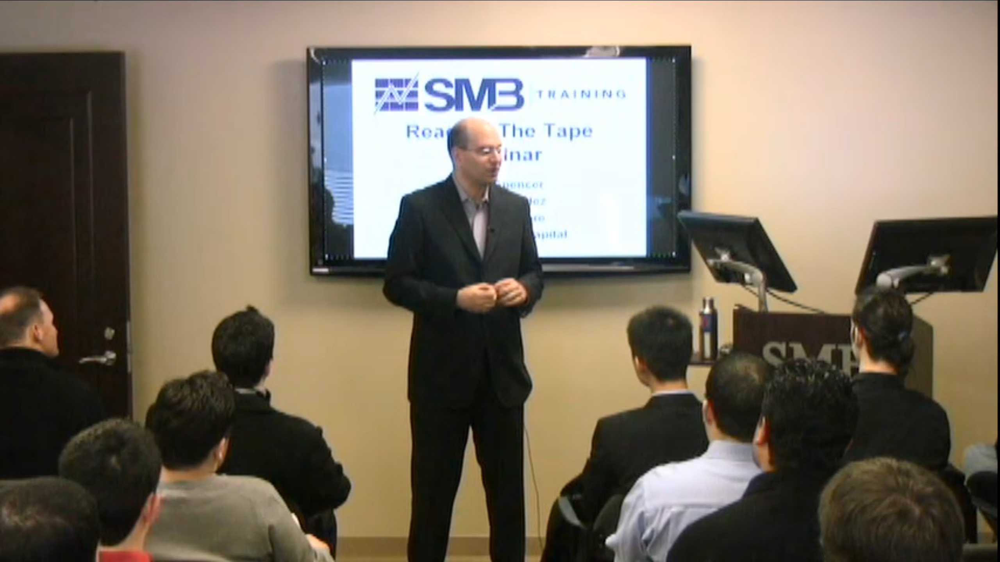

I guess I'll watch some of the old SMB course videos.

5pm. 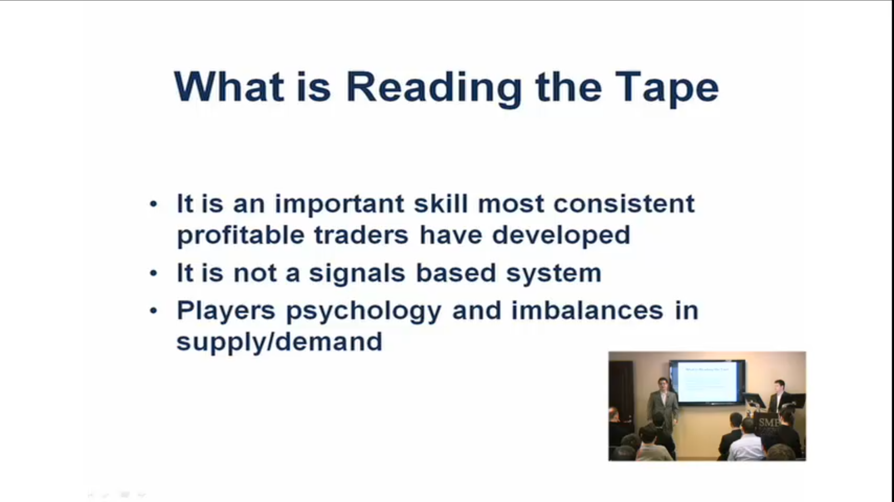

He says that they're trying to put a story on the stock.

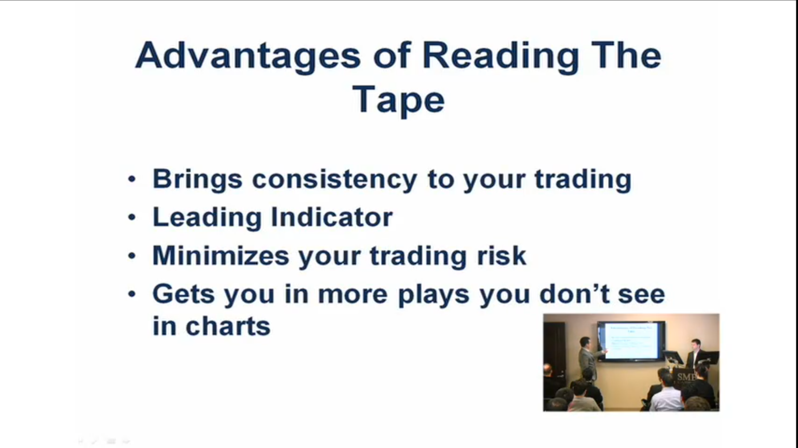
> Leading indicator.

I sure hope so.

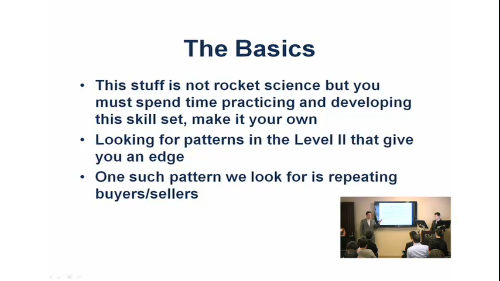

He says that this is really simple, but requires practice.

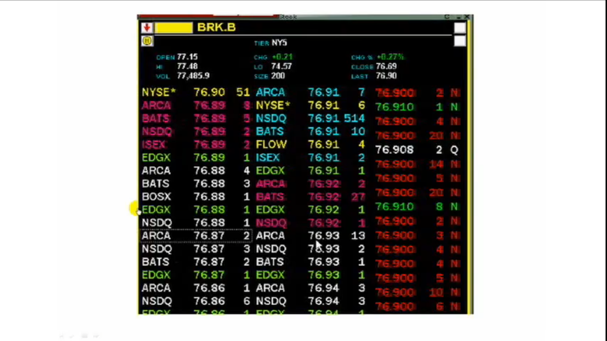

He says that when you spent time on this stuff the different algos are very easy to indentify. There are like 15 different algos he says.

Ok, I could code that up. Make a generative model, and then go the other way.

5:50pm. Done with the video.

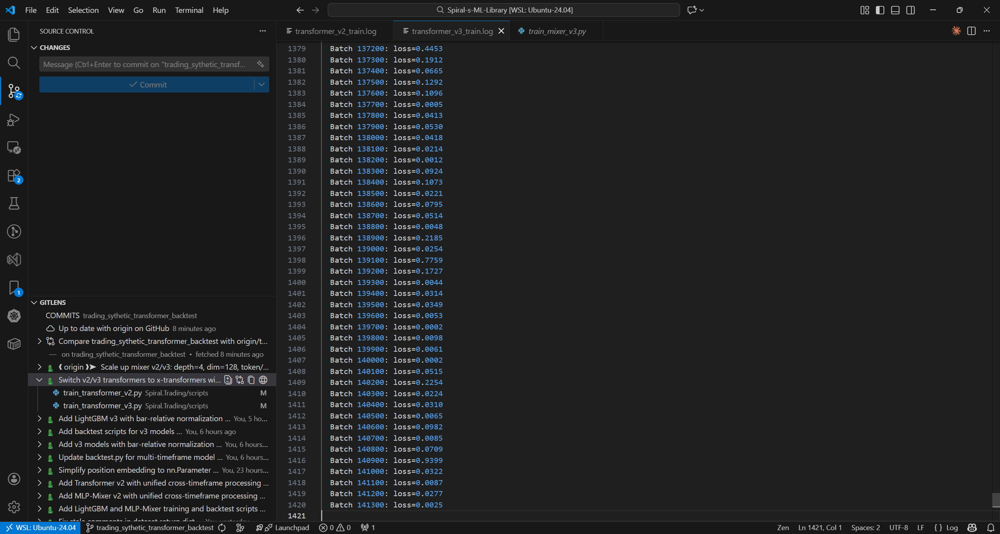

The training needs about 40k more batches until it's done. I guess I'll have to wait for that to finish before I can start playing Pathfinder.

6:45pm. Ugh, the training crashed after 6h. More details in the video.

1/28/2026

4:30pm. https://boards.4chan.org/a/thread/285630984/nia-liston-anime-confirmed

Nia Liston is getting an anime. Let me get back to trying out the gMLP architecture.

The recent successes are making more more hopeful. My motivation is going up.

1/29/2026

2:10pm. Had an apointment with an orthoped today. I'll take the chance to finally put together the clips I recorded and post them online.

I just realized that I haven't posted a video in over a month. It's going to be quite a lot of content.

2:50pm. It's rendering. Nice.

7pm. Time for WotR.

I am considering getting Rogue Trader as well. I didn't feel like doing any programming today. I'll get back into it tomorrow.

https://youtu.be/-mk6ad_5Qyg
Quantifying Order Flow (Pt. 2)

Here is the video. The next one is scheduled in a few days.

1/30/2026

11:30am. Got up over an hour ago. Let me finally start.

My right arm is quite stiff from the shoulder injection I got yesterday.

Hopefully this will melt that calcificate for good.

The previous attempt failed.

3:30pm. https://mangabuddy.com/magical-girls-defeat-trial/chapter-1

Holy crap, this is way more explicit than I thought it would be. FuckNovelpia is back in another form and I was looking for Magical Girl Defeat Addiction (it can be found under the name 'magic girl defeat addiction' now) and found this.

Lol, anyway let me chill for a bit longer and I will resume. Right now I am unclear on what my near term goals are.

7:25pm. 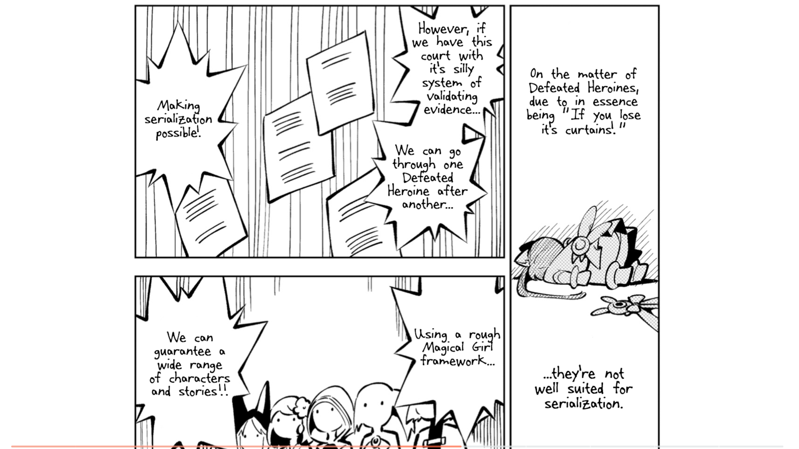
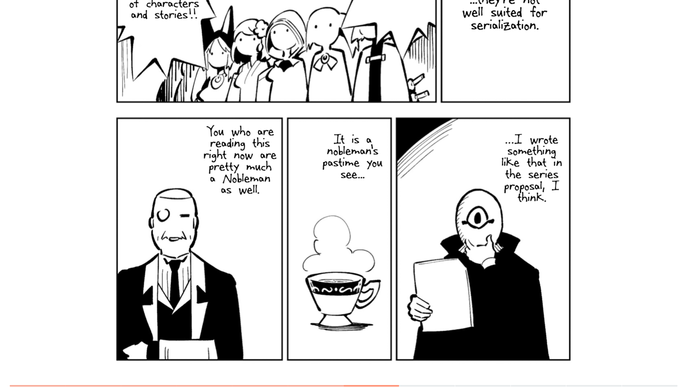
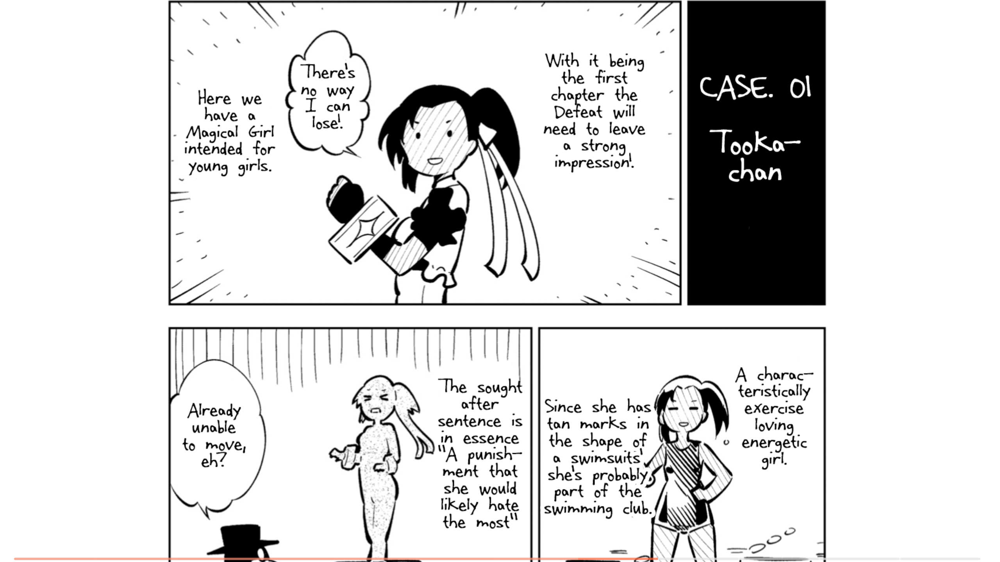
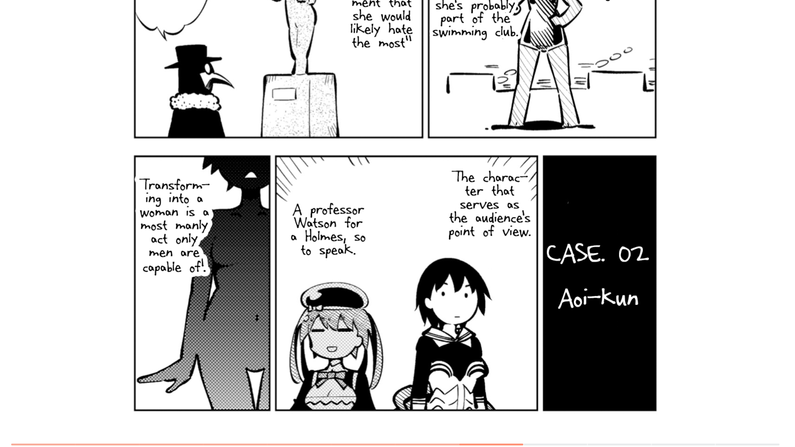

The author of this is turbo based.

8:30pm. 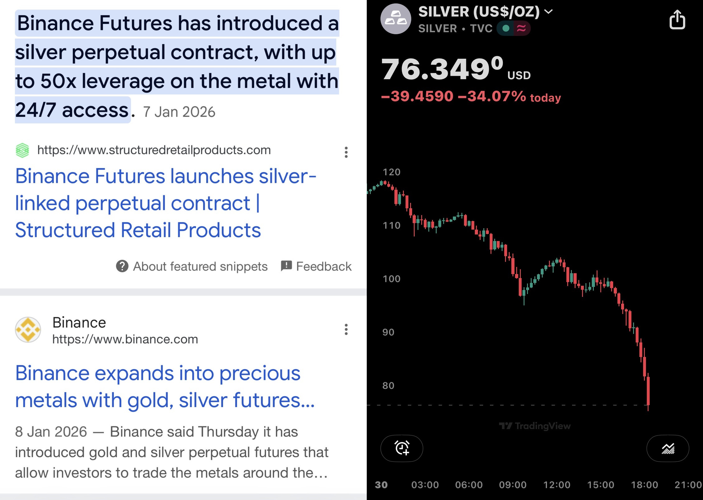

Trade of the month. One day I'll be capable of catching them.

2/3/2026

3:10pm. 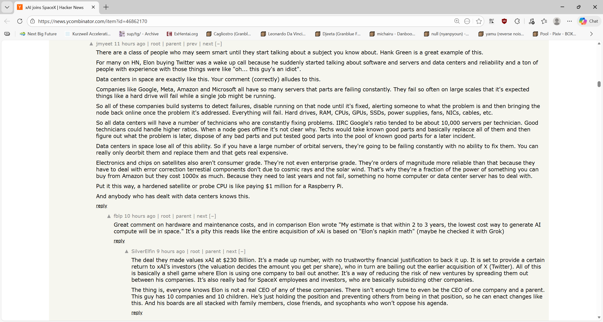

More data centers in space nonsense. I thought it was a joke by Bezos, but Elon is now seriously pushing it.

2/4/2026

3:40pm. 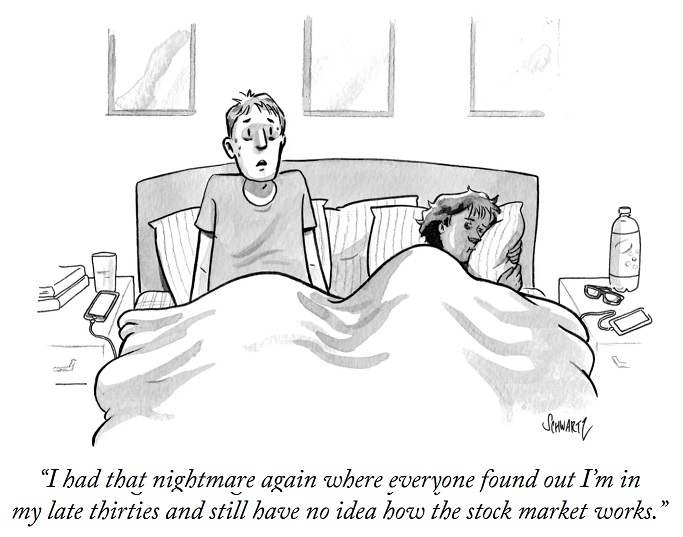

The Nightmare.

7:45pm. I guess this week it's another downleg in the market. Gold and silver dumped, and BTC is now solidly below 80k.

I myself am done making simplistic models. I need to move on to making realistic ones.

The plan is to take a break from programming and go through the SMB Capital course that I downloaded a while ago.

I need to start baking in actual order flow patterns into the generative model. Swapping between episodes is very obvious.

8:50pm. I'll slow down my pace and think more carefully how I want to do modeling.

In efficient markets it's hard to do trend following. The patterns where drift/volatility is greater than 0.1 is rare.

Most of the patterns are volatility with no drift.

9:05pm. Starting tomorrow, I am going to slow down. Yeah, just programming isn't going to get me far. I need to start studying again.

I know 1 pattern which is the held bid/offer, but there have to be other ones. I need to get everything I can from SMB.

Then I will try coding it up into a coherent system. If it turns out that tape reading absolutely cannot be distilled into a neural network then so be it. I'll apologize to Thomas for misleading him again (the first time was the Hopfield dictionary) and move on to something else.

The 107k I have lying around is permission for me to put the try this. If I am not going to do it now then when?

Ok, so price patterns on 1s charts are one thing, but there could very well be differences when I look into actual order flow, especially at extreme situations.

2:25pm. Here is what it takes to get hired at SMB.

* 100 trades in the last 60 trading sessions.
* Winners bigger than losses.
* Going through the SMB Training.

https://payment.smbtraining.com/smbspecial/trainingcamp-re.php

4k price tags. I don't have enough in my bank account even if I wanted to. I'll leave it for later.

I am going to focus on the old course, and if I am having success with that I'll definitely go through the main one even if it means paying 2-4k in fees. Because if I could attain profitability it would be worth it. Right now it isn't.

Who knows whether shelling out money for this is right or not, but either way it will take me time to build up a track record and make these systems. I am not in a hurry. Let me start with day 2 from the old course and I'll go from there.

2:30pm. Let me do the chores and then I will get started with the course.

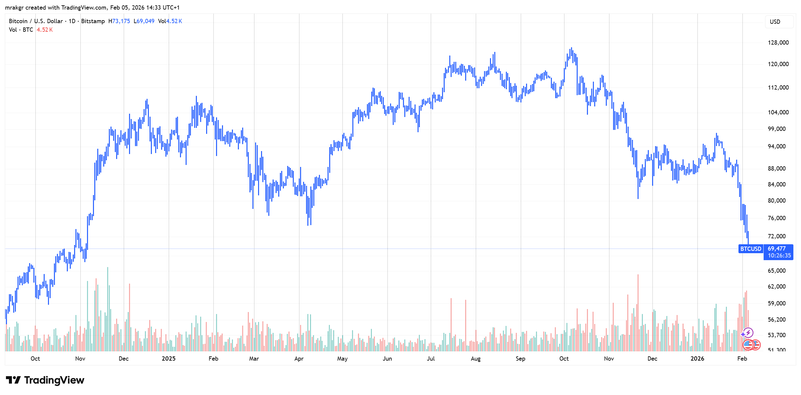

I wonder if the dumbass founders are still long this shit or if they've bailed earlier? I bet BTC is very scary to hold for many people right now. Stock indices just refuse to collapse though despite the fundamentals getting worse and worse.

3:45pm. https://youtu.be/9EFSF444b7Q
The Killer Mistake to Avoid at All Costs

Let me watch this.

I am trying to figure out what my goals are. I thought about the opening plays and yes, that is what I want to do. Forget generating the whole day, I'll cut out everything, but the first hour and focus solely on that to start off.

My beginner's strategy will be to focus only on the first hour. I'll generate some consolidations and some opening drives and focus solely on that.

The random price action model is quite powerful. I can take advantage of deviations from it.

As I go through the SMB course, I will focus just on that, the opening drive.

4:10pm. Let me start going through the course. This will take me a while.

4:15pm. 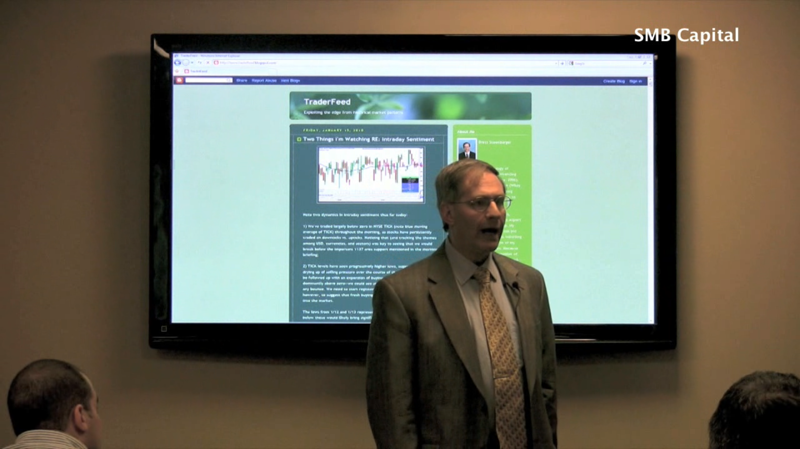

This is my first time seeing Brett Steenbarger talk. I used to read just blog a lot back in the day.

> You want to trade with a microscope - that's the tape, and trade with the telescope, that's the big picture.
> I want to be my goals, not just have goals! Do you see the difference? Too many people have goals, like you have a car, you have a goal. It's something separate from you.
> And finally the best goals are based on strengths, on what do well.

Great talk and I am already halfway in.

4:45pm. Balance vs imbalance. I think I understand it now. Balance is when drift < volatility. When it's below 0.1 the noise dominates the drift. And when it's the opposite That is when you breakouts. In the market, I find that it goes between extremes.

I'll really want to get my hands on trade sides and study those in nuance.

I think I need to introduce a concept. A trade can be highly probable to hit the bid or the ask, but at the same time when you have absorbtions or held levels, those levels tend to hold. In other words, in breakouts to the upside, the bids should be holding. Volume on the bid shouldn't drop the price, but volume on the ask should lead to the levels rising.

And in absorbtion, strong momentum to the upside where trades are mostly getting executed on the ask will start having difficulty pushing prices up.

The model I have now doesn't represent this well.

4:55pm. Yeah, this is a major weakness of my modeling effort.

I need to model the passive and aggresive flow and the interplay between them.

5pm. The sooner I start thinking about the bids and the asks the better. I have to admit the experiments really made me realize just how the drift and volatility components interact.

Let me finish the video instead of falling into thought here.

5:30pm. 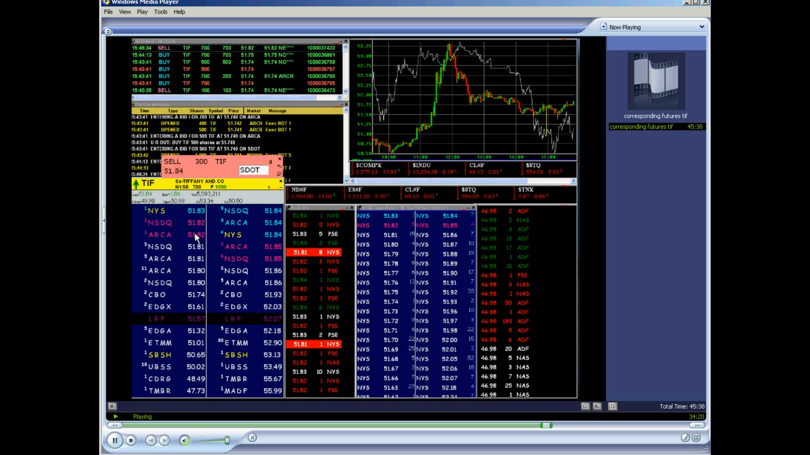

Watching this again. He says the downside is 1-2 pennies and the upside is 30-100 cents for unusual holds on the bid.

Yeah, this is what I want.

Imagine if I was a big buyer. I'd start off accumulating slowly and then stepping up once the level has been exhausted. I just need to look for those kinds of patterns, but at the same time I want to see all of SMB's setups, at least from that time.

I need to model this and the order book to a simplified degree.

6:20pm. 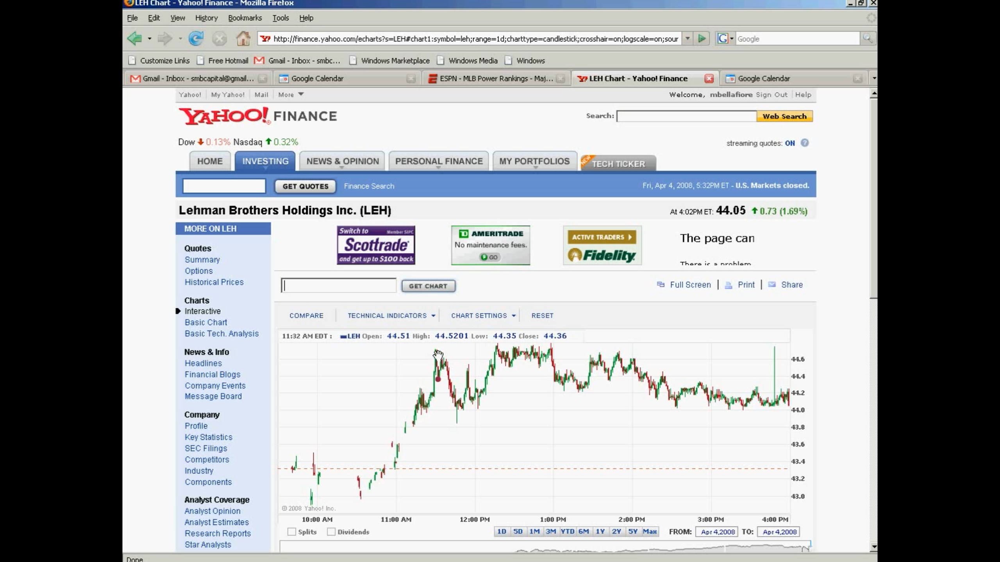

Today I learned about coming back to the bid pattern. 

6:25pm. I'll stop here for the day. It's going to be hell to bake all of this into the model. I am going to learn to both read the tape and model quantitatively.

This is only day 2 and the course is 25 days long so I have my work cut out for me.

I wonder why in the later courses they put less of an emphasis on tape reading? Do the retail fish traders not like it?

Who knows, maybe it's this course that I actually need rather than the up to date versions. It's all tape reading.

Let's see if I can maintain a pace of 1 day of the course per real life day.

9:25pm. 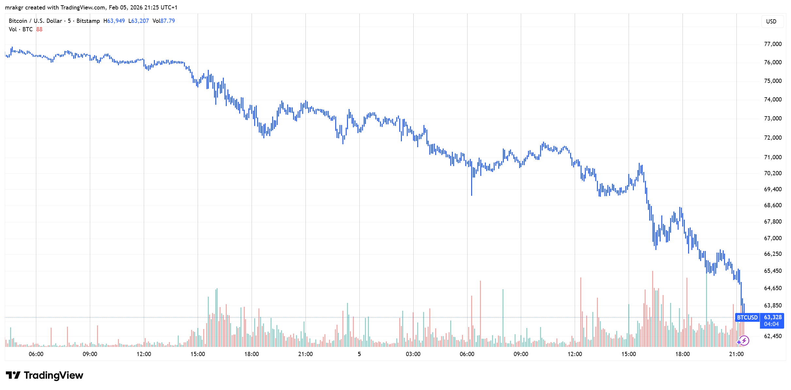

Bitcoin is absolutely melting. If this doesn't crush the markets eventually, I don't know what will. The indices just refuse to go down.

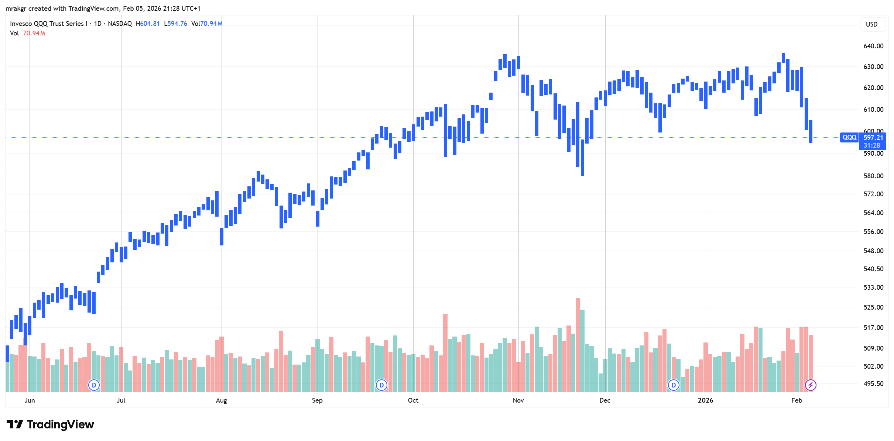

I mean, it is going down, but it's still solidly above April lows.

2/6/2026

5:45pm. I'll consider today a vacation. This really bring me to the old Spiral days when I was engrossed in my thoughts the whole day.

I have a bunch of a good ideas that I wrote in an email to Thomas. Here is a segment of it:

///

I've had some inspiration over the night about this which is making me feel more hopeful. A plan is coming together for me.

First, I don't think it's possible to emulate the reasoning that discretionary tape reading traders do with NNs. Another thing I am realizing is that my generative models won't be good when it comes to modeling realistic order flow. Another issue is that the most realistic price action so far is the one that is generated by completely random models (with no drift).

But now I've had a realization that if the market really is random, then it has to be random at the level of individual trades. So an experiment is coming to mind. If I train a NN on my synthetic moves and let is label the price of Bitcoin for example, would it conclude that the entire thing was generated from a completely random distribution, or will the network detect individual episodes which have positive and negative drift.

If there is a strong uptrending move that has lasted for a few minutes for example, there will be a large difference between it being generated by a distribution with a strong drift relative to volatility and a distribution with no drift and high volatility, even though it might look the same on a chart. I've realized that even if I am using 1s charts, that might obscure the underlying pattern.

It's very weird. This is something that only ever occurred to me now that I am creating generative models. The basic problem is that if have numerous distributions with different drift and volatility components, how can I prevent the NN from telling them apart purely based on volatility of individual trades? And the truth is that it's probably impossible. When I add the trade aggresor fields, it's going to be even easier. Adding trade sizes in the latest iteration already makes it very obvious when an episode has changed because the new episode has different volume patterns. But if that is how it is in simulated settings, what does that imply for real life ones? It never over occurred to me to think along these lines.

One great idea that I've had last night is that I could have the NN labels the moves it sees in real life data, and I could then use real life occurrences of those moves to adjust the generative model, which could make the model even more precise after it has been retrained on the updated model.

///

Some of the recent insights are completely changing the way I look at price action, and I am blown away by them.

If this really works, it could be huge. I'll finally be able to understand how the markets really work.

I really need to go through the SMB course and then I will put them to the test. SMB will give the nuances I might miss in my theoretic modeling.

I am also considering going into crypto because the high quality data is cheap there and gives me everything I need to try out my theories.

5:55pm. I am giddy right now. It's been a while since I've been engrossed in thinking like this.

11:50pm. https://youtu.be/tOMwDcdxd_c
Our Worst Market Week Ever — How We Make It Back x2

I am watching this as I prepare to go to bed, and am wondering once again why Chris has such a gambler's mentality. Double down bucket? Triple down bucket?

11:55pm. Why is he doing option trades on AMZN? Doesn't he have any infoarb trades to do?
 
The guy to the left says Chris is deep into margin.

Holy shit.

The AI bubble could easily pop and wipe him out.

12am. Let me stop at the 8m mark. Listening to Chris talk enrages me.

Look, there is nothing wrong just being 100% long and holding for the long term. But being on margin and holding long term is guaranteed to get you killed. Chris is going to find that out the hard way. Every gambler thinks that he is an exception and that risk management rules don't apply to him. They do.

2/7/2026

12:30pm. Let me get started with the SMB course videos. My sleeping pattern has changed during the past few days. I'd get up at 8 and go back to sleep only to get up at close to 12pm.

Which I guess is an improvement.

Right now my mindset is the same when I was working on Spiral. It such a fresh challenge.

1:25pm. Jan 2008 was the best trading market they've seen in 7 years.

2pm. Phew, done with day 2. So the held bids and offers the best trading ops according to them.

2:05pm. Let me take a short break and I'll continue to day 3.

https://youtu.be/JpK4fcFNKbM
ASTARTES 8K (Remastered)

I keep seeing Warhammer 40k vids on Youtube lately and it has gotten me curious.

3:45pm. Let me continue watching the course. Let's see if I can finish day 3 today.

4:10pm. 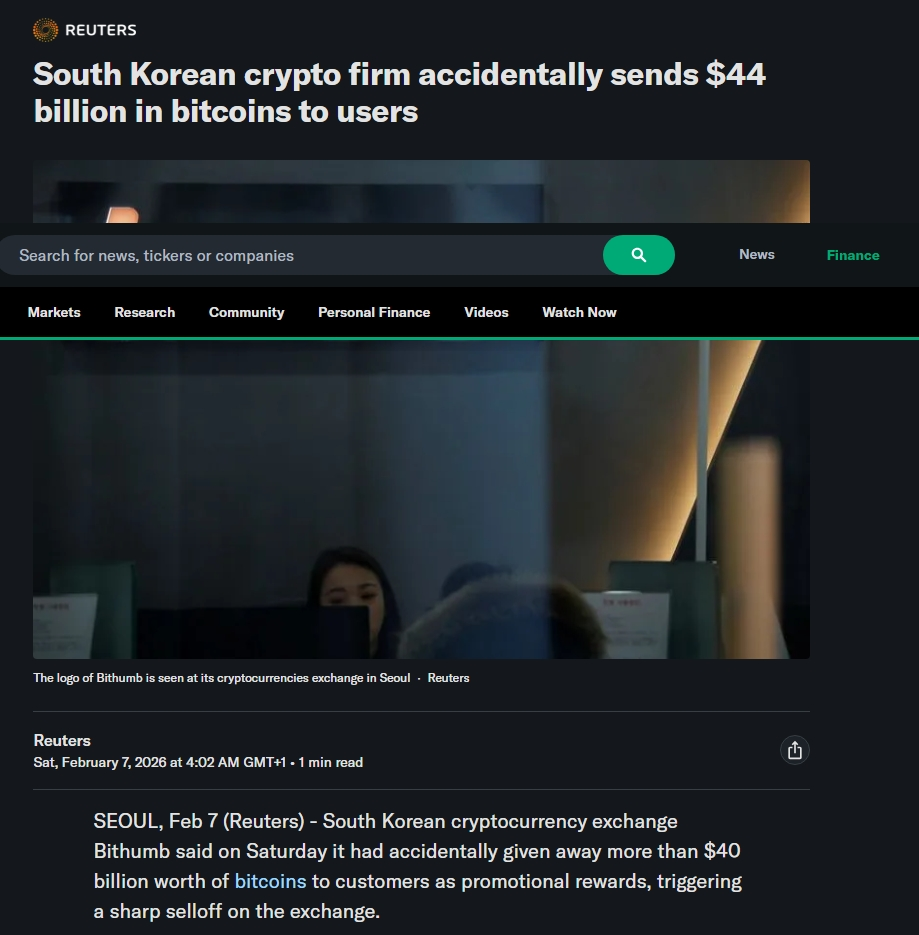

Lel. Let me go back to the vids. I've just finished one.

4:20pm. > When a stock gets good, it has a lot of volume. When a stock isn't trading it doesn't have a lot of volume.

Wisdom quote by Bella from 16 years ago.

4:30pm. 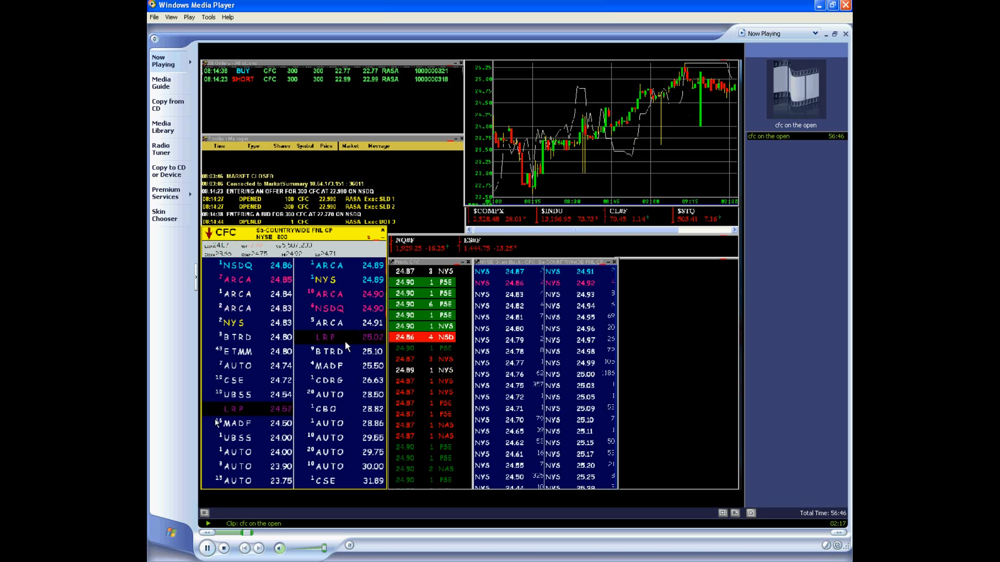

Here he is teaching me to get in front of a big offer, but otherwise get out if it goes away. Makes sense.

Yeah, it's not that trading is complicated, it's just that I completely got not even fooled, but defeated by randomness and my own laziness. This time around you can be sure I'll substitute my programming skill to make it a success.

All the edge in trading is learning to analyze order flow.

4:35pm. 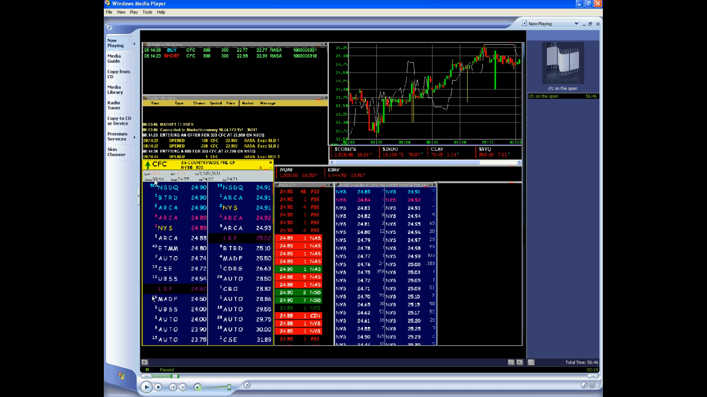

He's teaching to get long in front of a big bid. It does go away the next moment though.

4:40pm. It's really hard to focus on both the tape and the inside market. I have no idea how these guys could possibly be capable of tracking the volume.

In fact, tracking numerical quantities is the hardest thing there is.

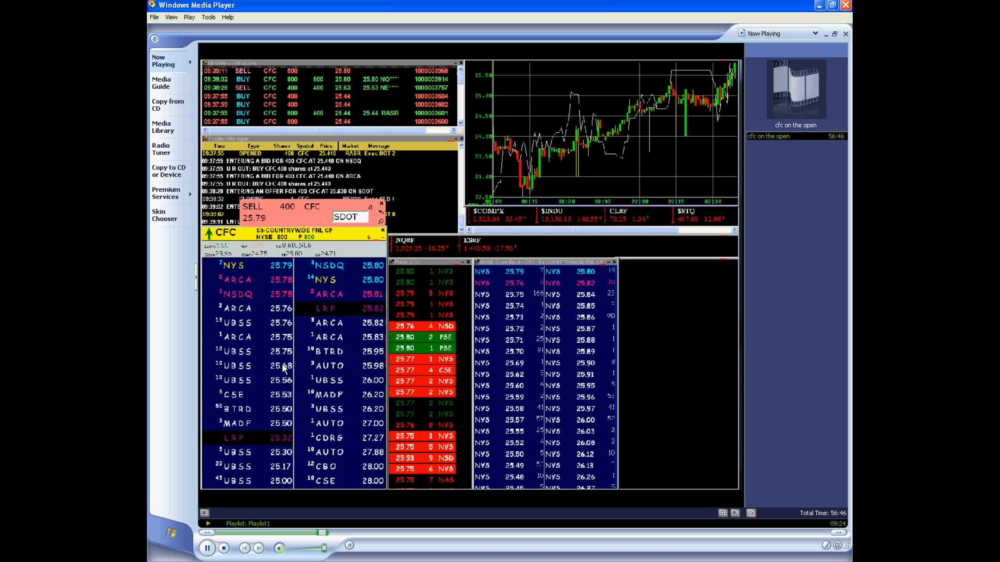

Damn, I cannot follow this at all. Does this guy have one eye on the inner market and the other on the tape? Things just change so fast.

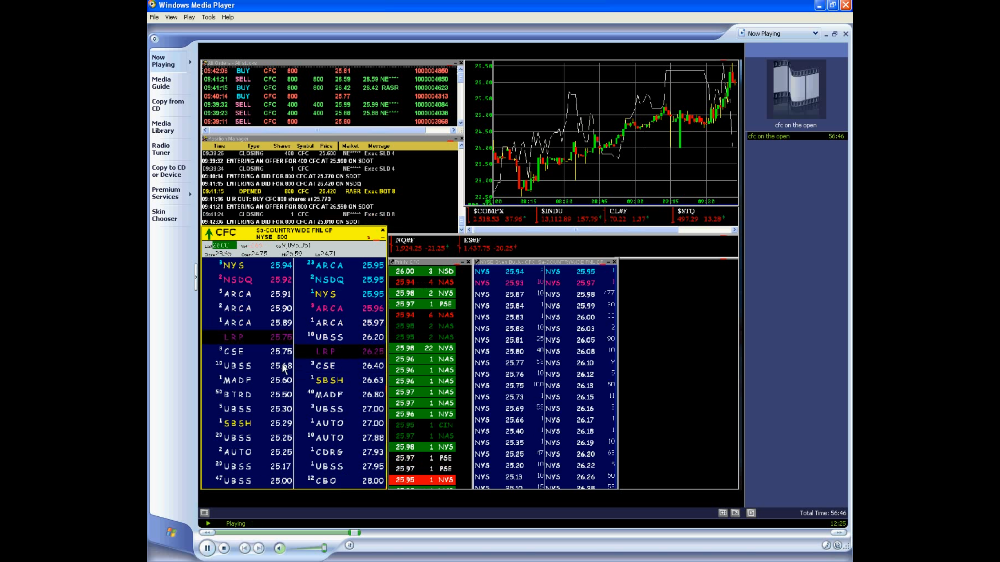

He is telling me how he'd go in front of big bids and then hitting out if they got decremented.

So it's not just held bids or offers.

6pm. The talk about the inside market is really good.

> You really can get to know the patterns based on bids and offers.

He is talking about buying programs.

> Who's the buyer, who's the seller.

I've noticed that they look for that a lot, but I find it very hard to keep track of things on the box.

6:15pm. Done with day 3. Damn, all this is bad news for me because to be on par with those guys I am going to require full quote data which costs thousands of dollars per month.

I don't think I'll need it all at the start so I might be able to get away with less.

This is good reason to maybe try out crpto trading instead.

...Nevermind, let me stop watching lectures here for the day. The stuff I learned about the inside market is noteworthy.

Those guys are hawks. I might be able to get away with less by picking my setups better. Like, do what Lance teaches and fade euphoric moves at the right time.

Like the BTC collapse recently. I really want to look into those kinds of patterns.

Let me do some research on how easy it is to get data from crypto exchanges.

> I think that full order book data should be easier to get for crypto than for stocks given that they trade openly on the blockchain.  For perpetual futures trading, how much would it cost to get the full trade data that includes the aggressor side as well as full order book data for a particular time period? I think for stocks it would cost thousands of dollars per month. I haven't seen it offered to retail traders anywhere.

///

You're raising an interesting point, but there's actually a common misconception here worth unpacking.

**Crypto exchange order books ≠ blockchain data**

Most crypto trading — especially perpetual futures — happens on **centralized exchanges** (Binance, Bybit, OKX, Deribit, etc.), not on-chain. The order book, matching engine, and trade execution all live on the exchange's internal infrastructure, just like a stock exchange. The blockchain only gets involved for deposits/withdrawals. So the order book transparency isn't inherently better because of blockchain technology.

Even on DEXs like dYdX v4 or Hyperliquid, the order book mechanics are off-chain or on an app-chain, not sitting transparently on Ethereum L1.

**That said, you're right that the data is vastly more accessible and cheaper.** But the reason isn't the blockchain — it's that crypto exchanges compete for retail flow and offer generous free APIs.

**What you can get for free or cheap:**

- **Real-time L2 order book snapshots** (typically top 5-20 levels) — free via WebSocket on Binance, Bybit, OKX, etc.
- **Full depth order book** — Binance offers this free via WebSocket (`depth@100ms` or snapshot endpoints with up to 5000 levels)
- **Trade stream with aggressor side** — free on virtually every major exchange. Every trade message includes whether the taker was a buyer or seller (i.e., the aggressor flag). This is the equivalent of what you'd need expensive data for in equities.
- **Aggregated trades** — also free, which bundle fills at the same price/time/side

**For historical data:**

- **Binance** publishes historical trades and aggregated trades as free CSV downloads on their data portal (data.binance.vision). This includes the `is_buyer_maker` flag (aggressor side). Order book snapshots are also available.
- **Tardis.dev** — probably the gold standard for historical crypto market data. Full L2/L3 order book, trades with aggressor side, liquidations, funding rates, etc. Pricing starts around **$0–$50/month** for individual/research tiers, with pay-per-use options. Compare that to thousands/month for equivalent equity data.
- **CoinAPI, Kaiko, Amberdata** — institutional-grade providers, more expensive ($hundreds–$thousands/month), but still cheaper than equity equivalents and with more generous trial/free tiers.

**So for your use case specifically:**

If you wanted full trade data with aggressor side + order book snapshots for, say, BTC-USDT perpetual on Binance for a 6-month historical window, you could realistically get it for **$0–$100** through a combination of Binance's free data portal and Tardis.dev. In real-time, it's completely free via the exchange WebSocket APIs.

The equity world is expensive because exchanges (NYSE, NASDAQ, CBOE) treat market data as a revenue stream and charge heavily for it, especially for full depth-of-book feeds like ITCH/PITCH. Crypto exchanges took the opposite approach — data accessibility drives volume drives fee revenue.

Worth noting: the *quality* of crypto order book data is lower in some ways (more spoofing, wash trading, less regulatory oversight on data integrity), so keep that in mind if you're training models on it.

///

Nice. Opus gives me a lot of options for crypto trading. It might be good to start at these places.

6:40pm. 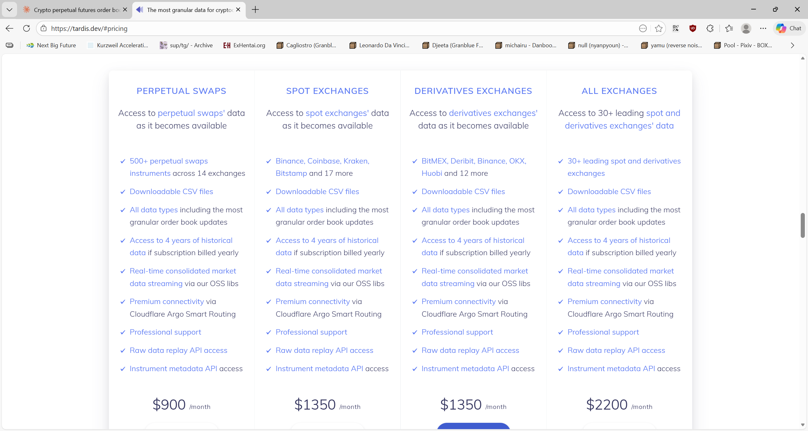

Actually Taris.dev is expensive as fuck.

> Taris.dev start at 700/month minimum. It's pretty expensive.

///

You're right, I should check the actual pricing rather than going from potentially outdated info. Let me look it up.Thanks for the correction. Tardis.dev's minimum order is $300 and their subscriptions are indeed in the hundreds per month range — not the cheap option I initially suggested.

Here's a more accurate picture of the landscape:

**Free options (the real story):**

Binance provides historical trades and aggTrades for free via data.binance.vision — these include the `is_buyer_maker` flag (aggressor side), so you get trade-level order flow for free. However, historical order book data for futures requires a Futures account and is restricted to VIP 1 or above users. So the trade data with aggressor side is free, but the full order book depth history is gated.

For real-time data, every major exchange gives you full depth order book + trade stream with aggressor side via WebSocket for free. The catch is you have to **collect and store it yourself** going forward — you can't go back in time.

**The DIY approach (actually $0):**

The most practical path for someone in your situation would be to start recording the data yourself now. Connect to Binance/Bybit perp WebSocket feeds, capture the L2 order book updates and trade stream, dump it into DuckDB or Parquet files. You'd have exactly the data you need within a few weeks/months of collection. The Tardis open-source `tardis-machine` library can help with normalized collection and is completely free to use for real-time data, connecting directly to exchanges' WebSocket APIs with no API key required.

**Paid historical options:**

- **Tardis.dev**: $300 minimum order for historical, subscriptions from there. Best quality according to most quants.
- **Crypto Lake** (crypto-lake.com): cheaper than Tardis but with less coverage — offers 20-level order book snapshots.
- **CCXT**: Free library for scraping normalized data from exchanges, though you're limited to what exchange REST APIs will give you historically.

You're right that it's still not trivially cheap for historical depth data. But the key difference from equities remains: you *can* collect it yourself for free going forward, and the trade data with aggressor labeling is genuinely free historically. For equities, even real-time depth-of-book feeds require expensive exchange subscriptions before you can even start recording.

///

Nevermind that for now. I need to know how the order book and the order flow behave.

7pm. > What is the SMB Capital Low Float Trade?

///

SMB Capital's **Low Float Trade** is a specific intraday trading setup taught by the proprietary trading firm SMB Capital (founded by Mike Bellafiore and Steve Spencer). Let me search for the most current details on this.Based on what I've found, SMB Capital actually teaches two related low float setups. The one most commonly referred to as **the** "Low Float Trade" is the **Low Float Reversal Trade** (sometimes just called the "Low Float Short" or "backside trade"). Here's how it works:

## The Setup

**Stock characteristics:**
- Stocks with less than ~10 million shares float, with a sweet spot around 5 million shares
- High short interest, often >20% of float
- These are typically low-priced, small-cap stocks that have experienced a parabolic run-up driven by promotion, news catalysts, or speculative momentum

**The Core Idea:**
SMB teaches traders to wait for the "backside of the trade" — staying away from the "front side" saves you from getting caught in a short squeeze and the potential for substantial trading losses. The "front side" is the parabolic move up (which is dangerous to short due to squeeze risk). The "backside" is where the stock has peaked and begins to reverse.

**Why it works:**
Low float stocks are not as competitive as other stocks, and thus easier to trade. When they reverse, the downmove is substantial and fast, with profits realized immediately. When they reverse, you can sit and hold a core position, making fewer trade decisions. Very little capital is necessary to take a very large position, and the risk/reward is enormous.

**The pattern repeats reliably:** These come every week, without fail, as there is a period of pump and then dump in these low float trades.

## How It's Traded

The general approach is:

1. **Identify** a low float stock that has had a parabolic run (often 50-200%+ in days)
2. **Wait** for the move to exhaust — look for the stock to fail at resistance, show declining volume on bounces, or break key intraday support levels
3. **Short the backside** once the reversal is confirmed, typically using VWAP, prior day levels, or intraday support breaks as entry triggers
4. **Manage risk tightly** — this trade requires extreme discipline and risk management given the wide spreads and potential for violent squeezes
5. **Hold a core position** as the stock unwinds, often over multiple days

## Key Nuance

SMB emphasizes this as a **short-side trade on the backside**, not trying to buy the pump or short into strength. The edge comes from patience — letting the overextended move play out and then capitalizing on the inevitable mean reversion in a stock with limited float and exhausted buying.

This ties directly into your interest in order flow analysis, Marko — the "unusual hold on bid/offer" patterns you're detecting could be very relevant for identifying when these low float names are being accumulated or distributed near turning points.

///

This is Tim's trade basically. On the Winning Trade course page they call it a favorite of beginning retail traders.

I myself like anything that is easy to spot.

I've been looking at some 1s charts of BTC and they have pretty smooth trends. But they are also mostly rangebound, and you can't really tell when the turns will come.

7:05pm. I am going to try to push through the entire course in the next week if possible so I can move on to programming. The sooner I can start scanning for setups the better. The sooner I can start studying the market the better. The sooner I can code up my insights the better. The sooner I can start making money the better.

I've thing I've realize from today's lectures is that I am really going to have to look into the order book in order to get a sense for the stocks' liquidity. Or rather my bot will. Whenever I take a position, I am going to have to look into easy it would be to get out if the market turns. It'd be terrible to take a position that's too large and get crushed.

Bella's definitely looking into order book imbalances when making trades. I wonder how I am going to model that?

They also look at very specific patterns. They recounted a pattern where the market would pop if there was a big buy order by JP Morgan below the bid. Some of their traders would trade that consistently for about a month.

One trade he talked about that sometimes happened is that there would be a big buyer on the bid, and then he would keep lifting the bid until it is exhausted.

If I just look at trades, I'd miss that completely.

You know, I don't have to bake everything into a NN model. I can have simpler rule based systems as well. We'll see.

But well, I did make the order book generator for a reason. I can simulate the order book imbalances using that.

If the move is strongly positive there should be an order book imbalance in some direction, right?

7:15pm. Sigh, this is really nice.

There is a challenge to this. And there is the possibility of a big win.

It's ironic that the easiest patterns (abnormal volume & tape speed, order book imbalances, held levels) to detect are also ones that are more likely to be long lasting. Patterns that require deep reads of the market like with that JPM bid, are the ones that are likely to be transient.

I really like that the 16 year old SMB course is all about tape reading. The Trader DNA and the Winning Trader courses aren't about that.

...You know what, once I push through this course, and get my fill, I'll get the tape reading course as well for 30$ off Yandex. It's a more up to date course and could be a great investment for that sum.

7:25pm. 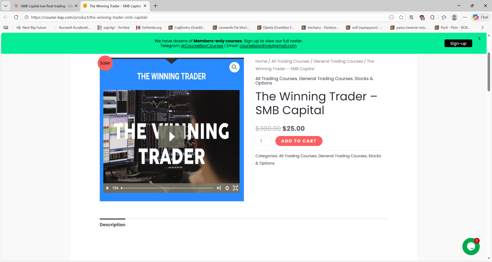

Oh lol, Opus accidentally found the Winning Trader course pirated on this site. I myself only ever found the Tape Reading one on Yandex.

Here is the Trader DNA one as well.

Damn, now I actually found a torrent for the SMB Tape Reading course on [LimeTorrents](https://www.limetorrents.fun/). It's downloading as we speak. It's only 2.7Gb large.

...It stalled at 97% of all things. At any rate, I should be able to download it tomorrow. I guess I'll change my plans a little.

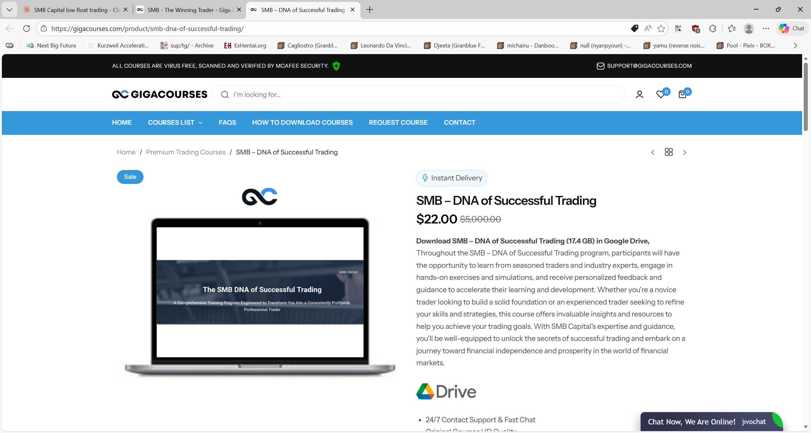

Also GigaCourses has the two SMB courses for cheap as well. Ok.

7:40pm. I didn't expect I'd be able to find the Tape Reading course today. It's annoying that it stalled at 97%, but if it can finish then...should I drop the Foundation course and move on to the tape reading one.

But the Foundation course is pretty much a tape reading course as it is so I am getting what I want either way.

2/8/2026

10:45am. Every hour I put into Patfinder worsens my sleep by some %.

11:20am. Let me get started for today. Let me resume the tape reading course torrent.

Forget gaming. Instead obsess. Obsess like you did about Spiral. Obsess like you did about the old projects. That is the way to build up skill.

Sigh, the tape reading course has no seeds and seems to be stuck at 97%.

11:30am. Ok, if I cannot download it the whole day today I'll just shell out 30$ to get it outright. It got 97% of it in a couple of minutes, and now I am finding waiting hours for it to get that last 3%.

12:35pm. Let me watch the last vid.

12:45pm. Bella says he's not a fan of the large bid trade.

12:50pm. > A really important level trumps the intraday trend of the stock.

1pm. Nice. Done with day 4.

Ugh, that stupid course is still stalled.

1:20pm. 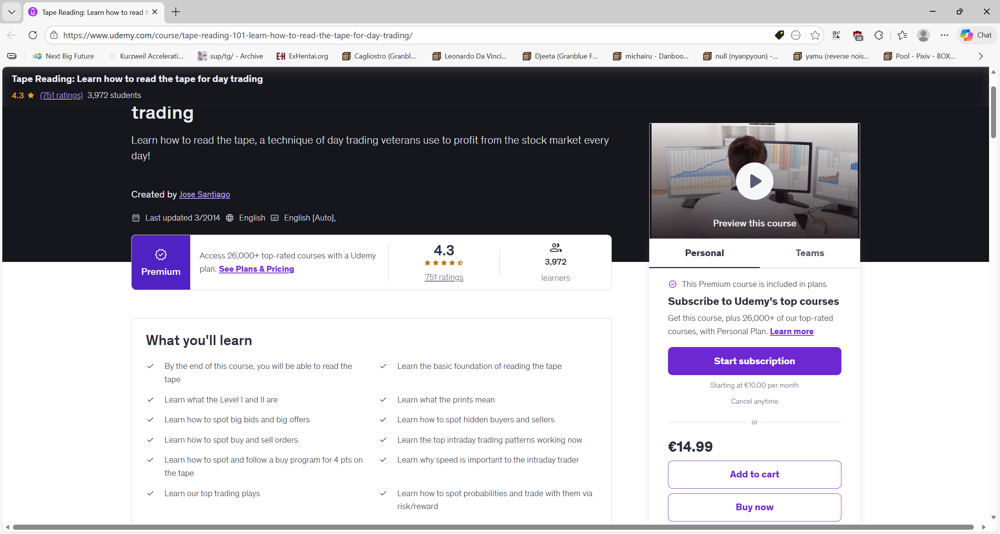

Wow, I am shocked that there are tape reading courses on Udemy.

4:35pm. Today's break took a bit too long. Let me resume the SMB course.

I was really enjoying catching up to Surviving As A Barbarian. The story is really good.

4:40pm. 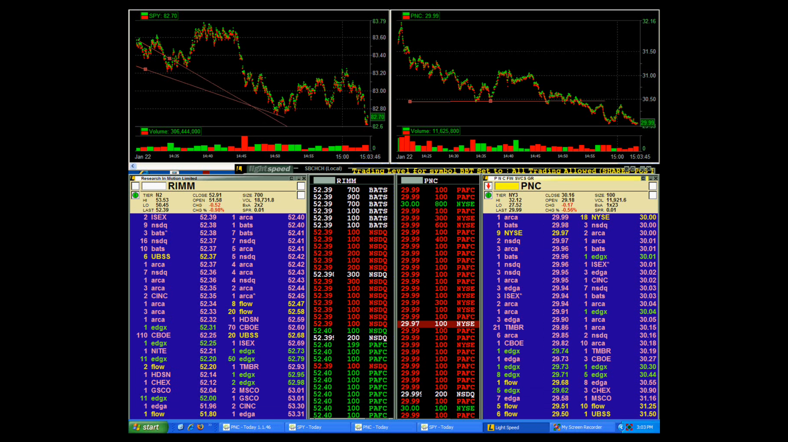

Held bid at 29.99 and he actually went short the moment it broke below.

4:55pm. 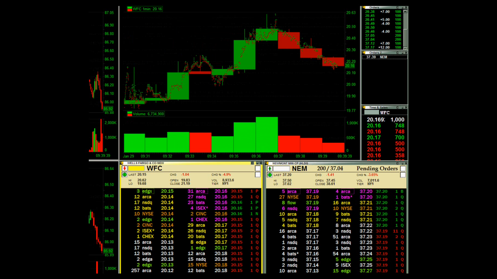

Oh, this guy actually is using a heat chart here.

5pm. 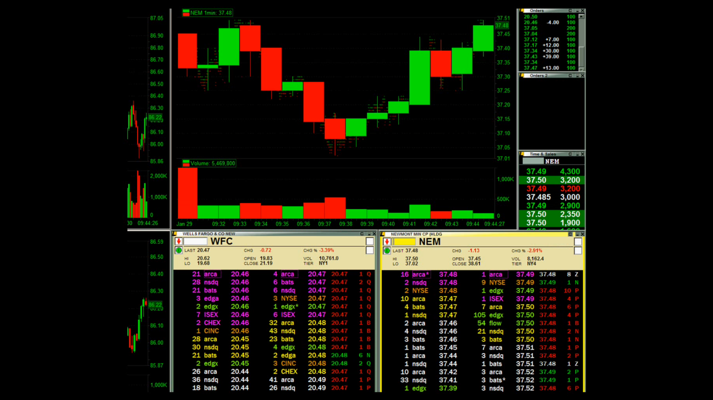

If you're going to use a heatmap what's even the point of these shitty candlesticks?

5:30pm. 

Good point on avoiding conference calls. I only learned about this yesterday.

5:45pm. 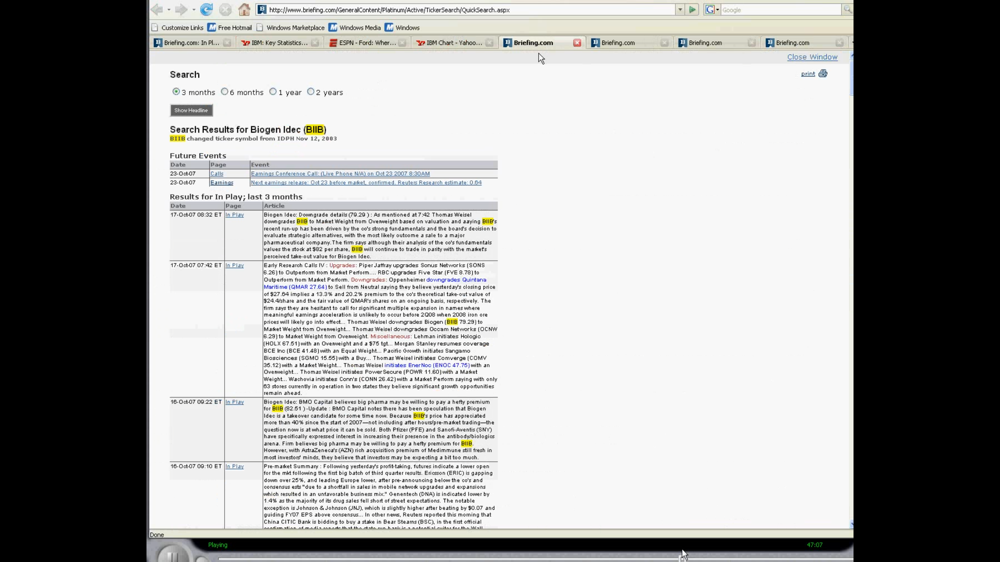

Interesting that he isn't looking at gap % and premarket volume first and is instead reading the news.

5:50pm. Sigh, just how much of a difference could having access to this info in 2007 and 2008 make which was the period when I was starting out as a trader. I botched that attempt completely didn't I?

5:55pm. Uf, the videos in day 5 are really long.

Good thing is that day 4 pretty much covered most of the trading plays that they do. I might not need the whole course necessarily.

6pm. No, I will.

6:05pm. To be honest, I am getting bored watching these videos, and that means I won't be able to just rush through them.

The video is bad, the audio is noisy, but none of the courses I've ever watched come close to the informational quality of this one.

It's really temping me to get the Trader DNA course instead since it is newer instead of persisting with this one. Like this video I've been watching is literally from 18 years ago.

6:30pm. Done with lunch.

You know what...

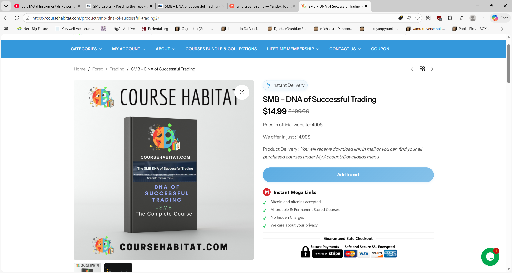

It's only 15$ so I'll get it tomorrow. There is no point in being so cheap here.

The Foundation course is very unpolished, so I might get better value for my time if I went through the newer one instead.

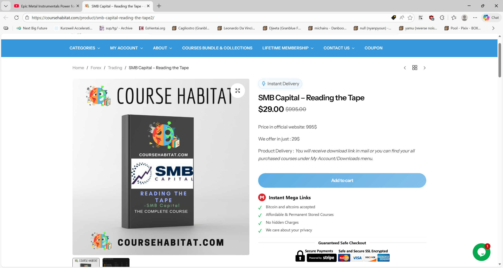

This one is 30$ here so it a bit more expensive, but it should be worth getting as well.

Let me do it right now.

The only thing the Trader DNA is making me hesitate about is that the tape reading is 1 module out of 14, but in the 2010 course it is almost half of it.

But what is 15$ to trial the course? Absolutely nothing. If I can succeed at trading, I'll want to try applying to SMB down the road, so they'll be making more money off me than they ever would by selling these courses.

6:40pm. Ugh, CourseHabitat doesn't accept cards, only crypto. I guess I'll pass. Gigacourses has them as well, but they are 30% more expensive there, but it's still in the acceptable range.

Gigacourses processes orders manually for some reason.

I ended up finding a torrent for the DNA of Successful Trading course and it has seeders. It's 20Gb and it seems like it has full availability.

7pm. 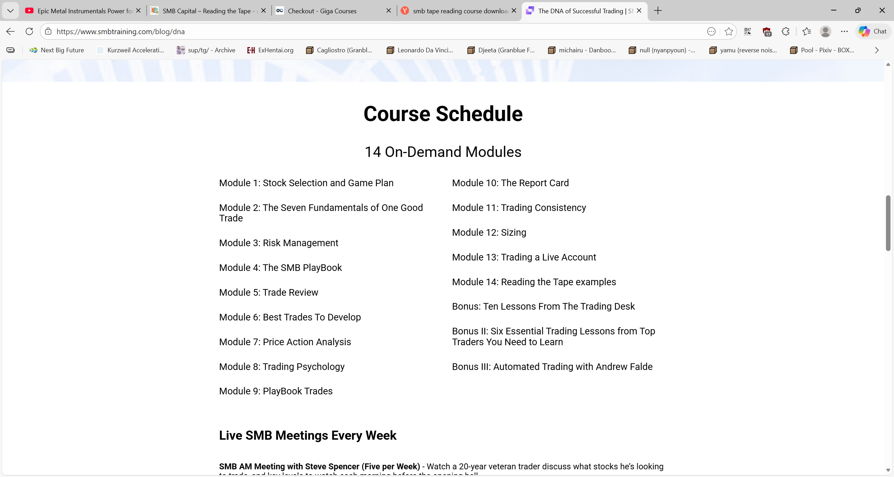

From what I can tell the torrent is from a version of the course in 2016. The newest one (in the screenshot) is split into 14 modules, while the 2016 course that I am torrenting is split into 9 weeks.

Ok, it's donwloading in the background. It doesn't matter too much. I'll focus on the 2010 course regardless.

7:15pm. Focus. I have the capability to go through the 2010 course in less than half a month and then I can start programming. I cannot let myself fall into the trap of just watching course videos forever. I'll build up the foundations and then start in earnest.

Plus just learning passively is boring. It's best when you can apply the lessons you've learned.

8:05pm. 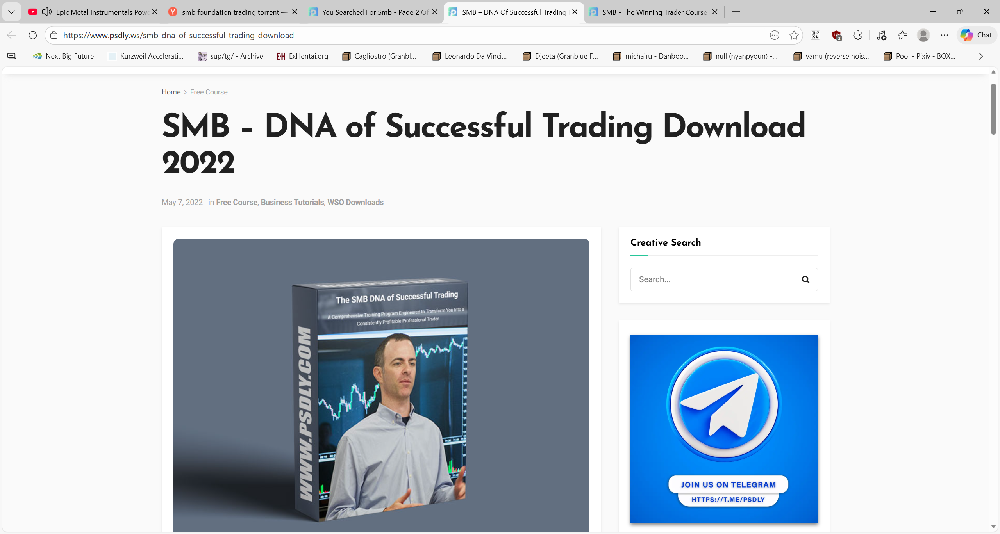

I might have found a more up to date version on this site.

You know what, let me chance it.

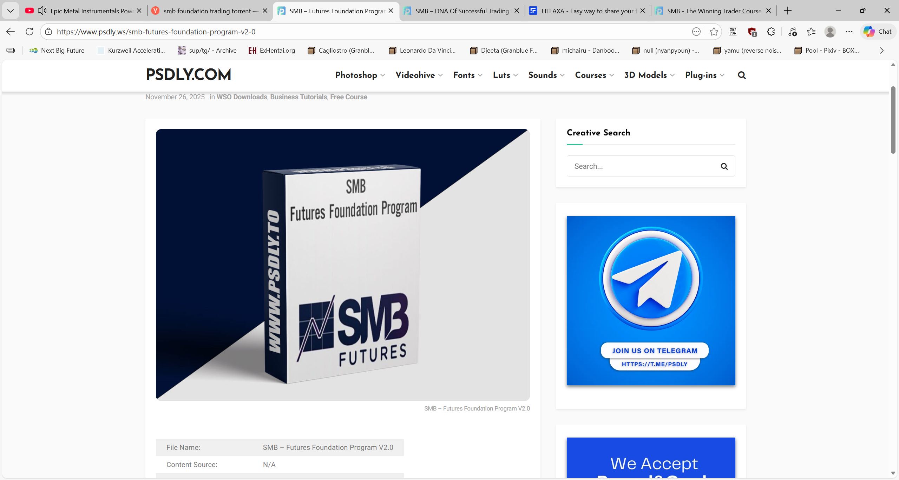

They also have the Futures Foundation program that I didn't know even exists, but the files require premium membership on FileAxa to download them.

8:20pm. Paid the 18 euro price for a 1 month subscription to FileAxa. Ok, let's see if the trader DNA course is the up to date one or the one from 2016.

Man, I have no idea where I even found the trading foundations torrent.

Let me stop the program.

Lol, yeah, I have fibre optic, so my download speeds should cap out at 125 Mb/s (megabytes). I am looking at 7mb/s and wondering if I have more room left. Yes, I do. I can get the course files in parallel.

8:35pm. Tsk, unfortunately the Trader DNA course was from the 2016.

8:45pm. 

This is how the video looks like. Some asshole must have downscaled it and pasted the watermarks all over it. Ptuu.

At any rate, I am going to focus on the trading foundations since it focuses on tape reading.

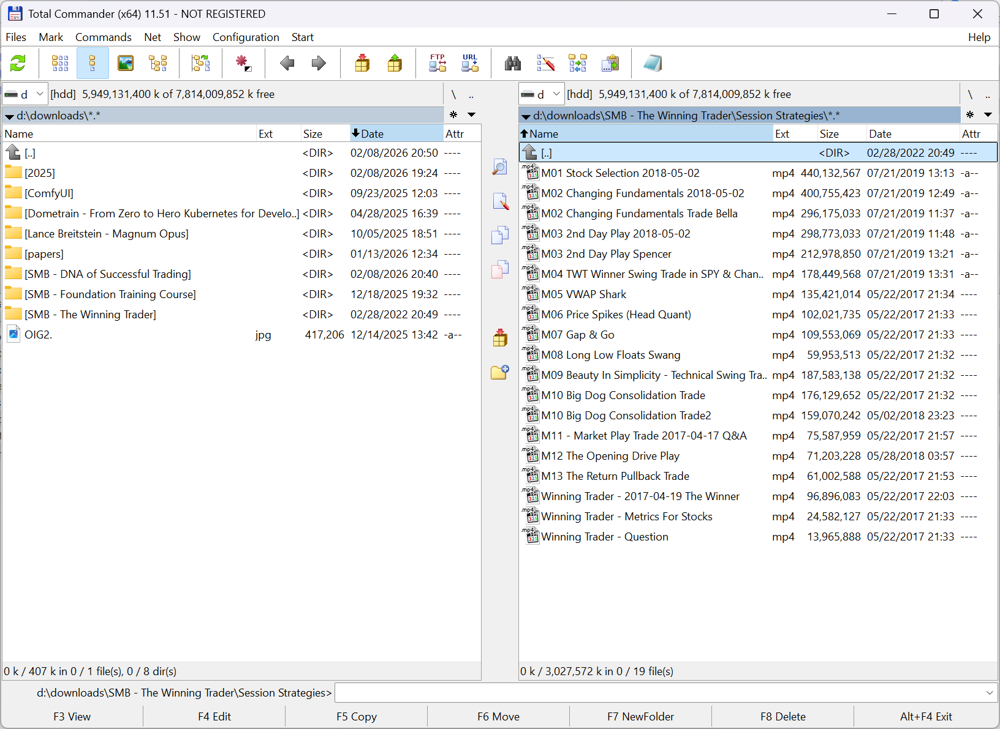

The winning trader course only goes up to 2018. But that's still a huge improvement.

8:55pm. Anyway, I can give the DNA course a pass. Without any order flow content it is useless to me.

Good news is that I have enough bandwidth to get all 3 courses today. I wonder what the futures course contains? It isn't even featured on the SMB Training site for whatever reason. Claude says it is sold through their futures division.

9:15pm. I like the futures course. It has pdfs instead of docx files, it is organized chronologically rather than having the files randomly strewn about, and the videos are high resolution and the audio isn't noisy. I have to add, the files are also named nicely.

9:25pm. Who knows, maybe the futures course will be a bigger gain than the other two stock courses.

It would have sucked to shell out 2k for the DNA course only to find out that it isn't very actionable.

Thankfully I only had to pay 18 euros instead.

9:25pm. Now if only the tape reading course would finish downloading.

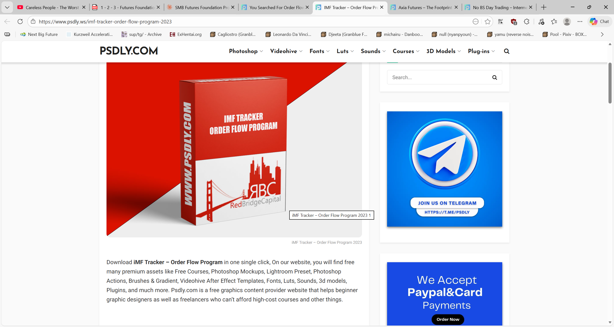
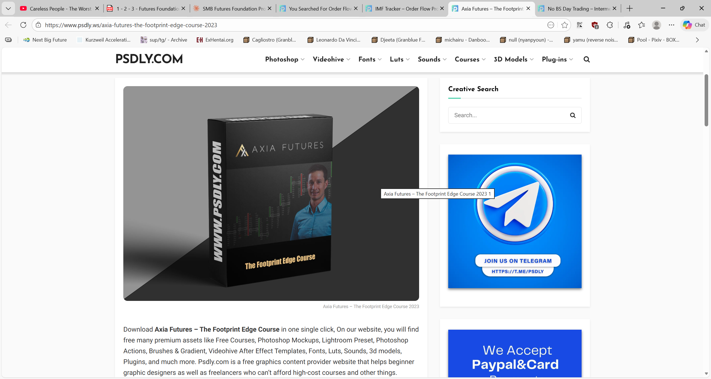

I haven't heard about iMF tracker, but I have about Axia futures.

9:40am. I might as well get these courses tomorrow after the midnight reset.

In fact, since I'll be starting out my systems development on crypto, the content might be more topical than the stock trading stuff in fact.

9:50pm. Nice, very nice.

This is how the post work rest period should be spent.

While I stopped watching the SMB course past 6pm, I put in the extra effort to get added educational material for myself. And as I watch the videos and learn these concepts I am thinking how I will express them through programming. I have had some idea for how to deal with order flow. It's not that difficult.

One thing I've realized as I watched the tape examples is that the tape is very bursty. You have many second where nothing gets printed and then you have anther page appearing in only a few frames of the video.

Trades are often hitting one side or the other in sequences, so it's not unusual to see 4-12 trades on the bid, followed by 4-12 trades on the offer in quick bursts. If I just randomly switch between bid and offer, things won't work well.

But that can be dealt with.

Most importantly though, I am going to have to make the model obey the delta time instead of just using it in expectation. I got that wrong in the video even though it was right initially. For when the trade count is above the mean, I'll instead scale the drift and volality directly.

9:55pm. Complete engrossment and obsession is how I created Spiral. It is how I became the programmer that I am today. I **am** going to master trading.

10:20pm. Weird that Merril Black is very bullish about market profile. He says that he traded price action and market profile made a huge difference to him.

Right now I am watching some intro psychology videos since he begged me to do it.

10:45am. 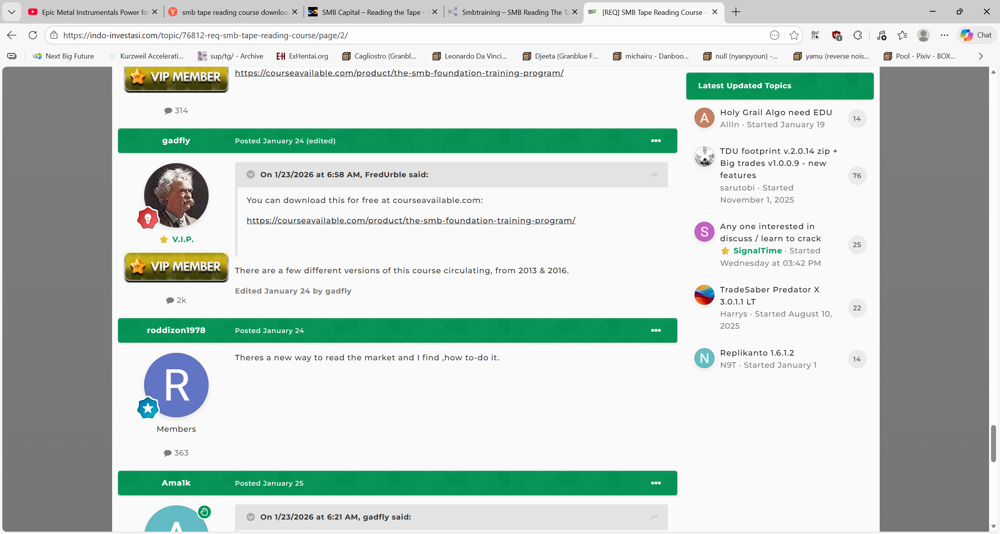

Confirmed that there is a version of it here for free. Interesting, I didn't know there are different versions of it.

And yes, had I looked, I could have found it 16 years ago. But good luck figuring out a probabilistic programming approach in that day and age.

I simply didn't have the skills then.

10:55am. Agh, so annoying the tape reading course is stuck at 97% the whole day. But probably its content is already baked in the Foundations course. The Foundations course might be their in-house offering according to Opus. I think its concent is now essentially split into 3 courses: DNA, Winning Trader and Tape Reading courses. All of this could set you back a cool 15k without any discounts.

11:15pm. 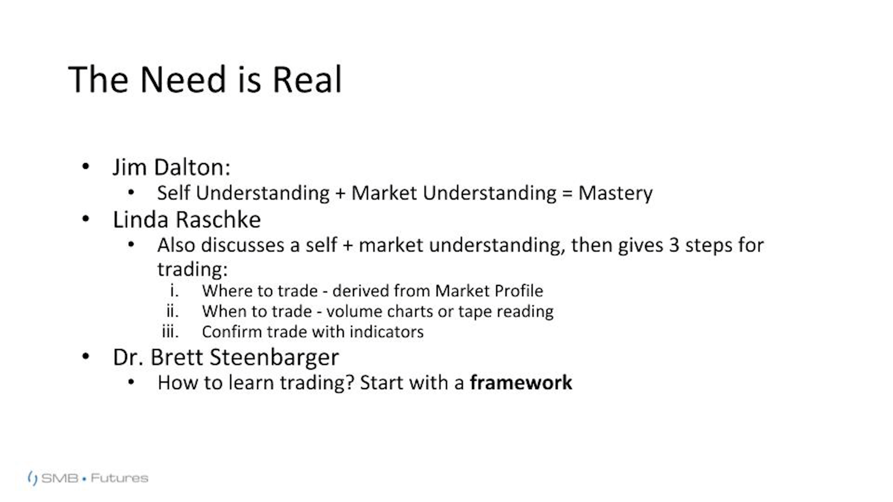

Linda Raschke recommends market profile? First time I heard about it.

11:20pm. Let me have dinner here. I'll leave the futures course for tomorrow. Futures traders really swear by market profile don't they. In fact, I couldn't find good resources on Youtube about this, so this material is a very good find for me.

Sigh, since I have the fondations course, I guess I don't really need the tape reading one. The examples in the videos have them trading defunct companies like RIMM and AIG. Those are already covered in the foundations course.

12:05am. 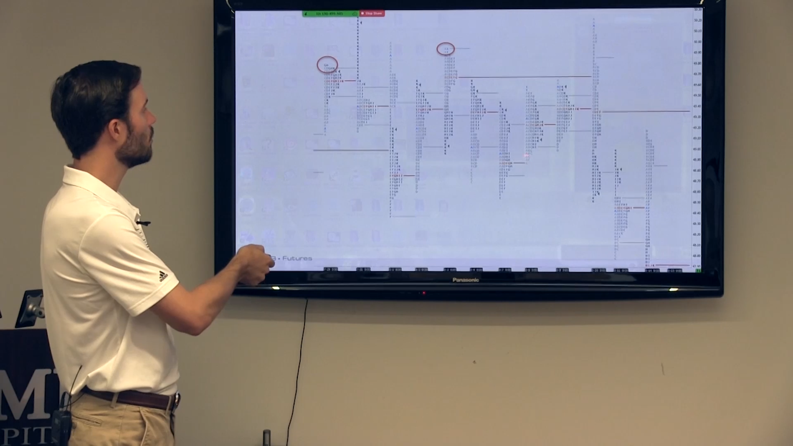

Feels like giberish. Let me go to bed here. I'll continue this tomorrow. The more I study, the more viable my quant analysis feels.

2/9/2026

11:20am. I am up. It's time to obsess again. In this state of mind, it seems I have early morning nightmares before falling back asleep, but I think this kind of pressure is preferable to playing games and then being tired during the day.

https://archive.is/OAEU2
Job Hunters Are So Desperate That They’re Paying to Get Recruited

> Landing a white-collar job is getting so tough that candidates—not companies—are paying recruiters to match them with positions. 

People are starting to pay recruiters to land them a job. Since Covid ended the labor market just keeps getting worse and worse. The Tao Ceti job as bad as it turned out to be in the end was a huge stroke of luck. I managed to get out of the market before the worst happened. What's going to happen is probably another market crash once the AI bubble pops.

This would just make the job market for software engineers even worse.

At some point it has to get better, but who knows how many years that will be? I'll be a profitable trader by that time.

> So AI writes the job applications that then get screened by AI to decide whether to proceed with an interview that may include an AI interviewer. Truly the machines are taking over.

Lol. Truly the machines are taking over.

12pm. Let me watch the market profile videos.

12:10pm. It seems the reset didn't happen last night for some reason, and I can't download the courses. I just got one by Mike Valtos. Crap, now I am just wasting my time getting gorged on that crap.

Let me focus on the SMB courses. I only have the capacity to digest so many courses.

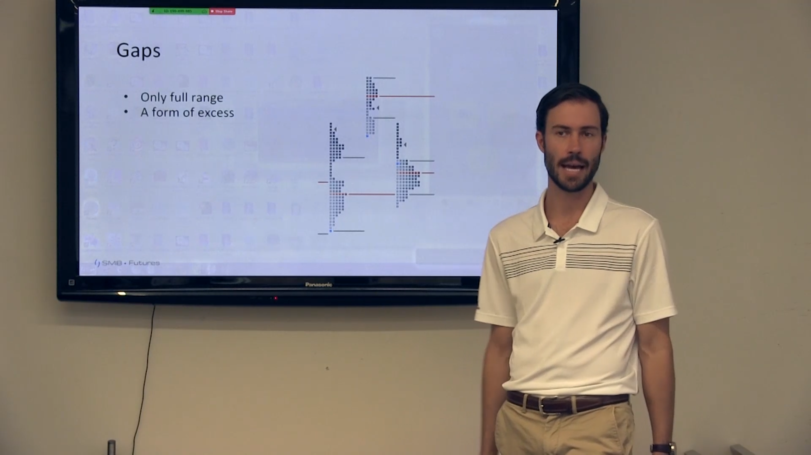

He says that market profile people only look at the range for the gaps instead of the close.

12:25pm. 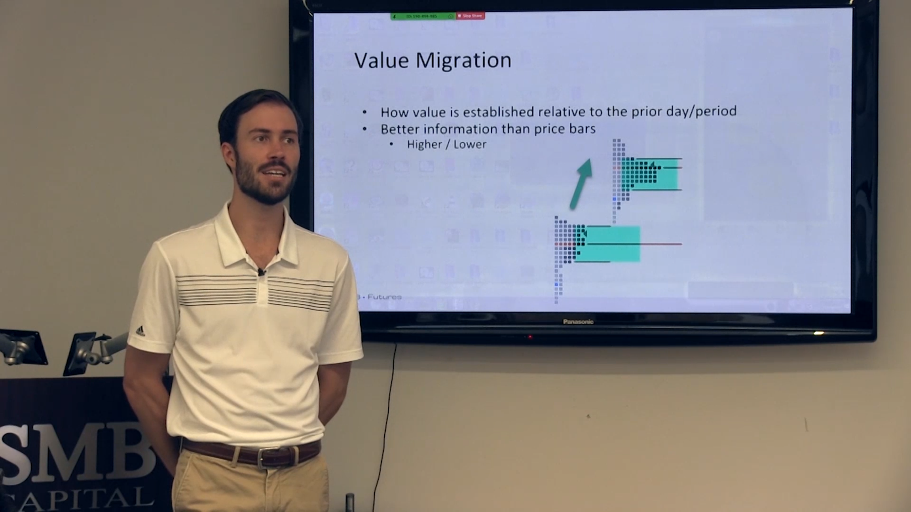
> There have been a lot of studies done on serial correlation in financial markets.

And no correlation was found. Is he going to say that there is correlation in value migration?

> Just because we close higher one day there is essentially a 50/50 chance that we close higher the following day.

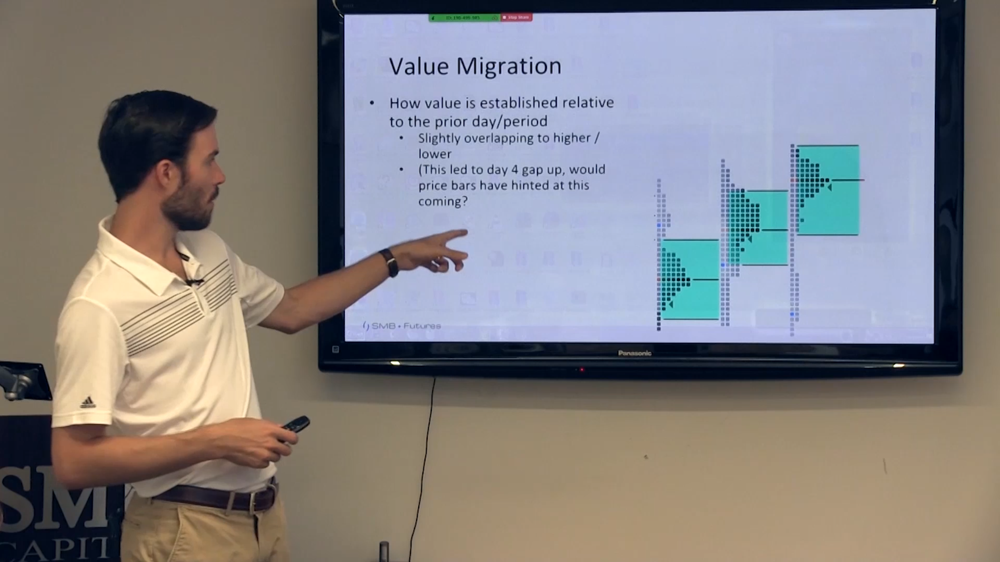

If this is an actual effect, I wonder if it could be used to swing trade?

But he hasn't yet said that it exists.

12:40pm. 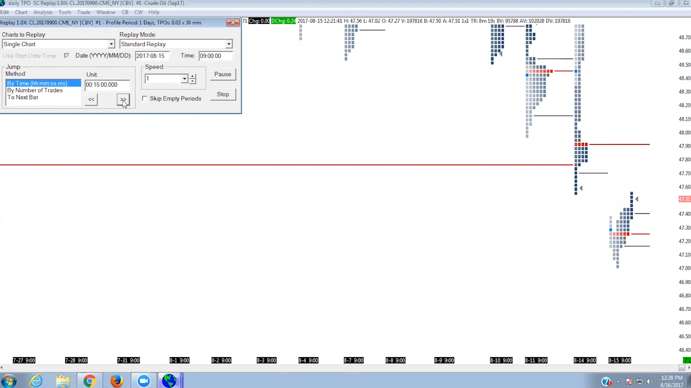

This feels like gibberish.

12:50pm. You know what, nevermind this course. I am not impressed by the market profile stuff. The tape reading SMB teaches is more interesting than this. Maybe I'll get back to this course later.

Sure, looking at volume profiles is better than looking than OHLC bars, but I knew that already.

Let me have breakfast here and I will get back to the foundations course. I want to prioritize getting through it. Then I'll look at the Winning Trader course to see the various setups they are teaching.

The foundations course is great. They come out with what is most important and effective (holds) and then move on from there.

My challenge is to quantify it, and then I will be minting money.

Now that I have some programming skills and ML knowledge, the trading material they are teaching feels so primitive. These guys don't know a lick of statistics.

Or rather, the language they are using to teach is dumb.

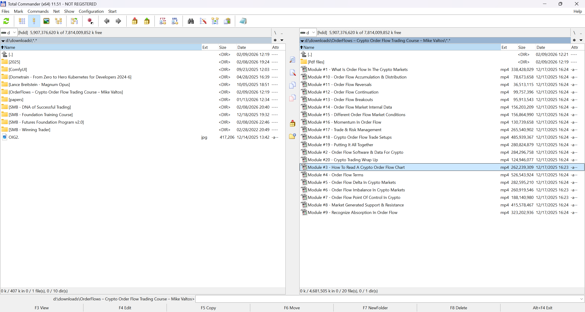

I'll give Mike Valtos' course a chance since it focuses on order flow.

2:15pm. 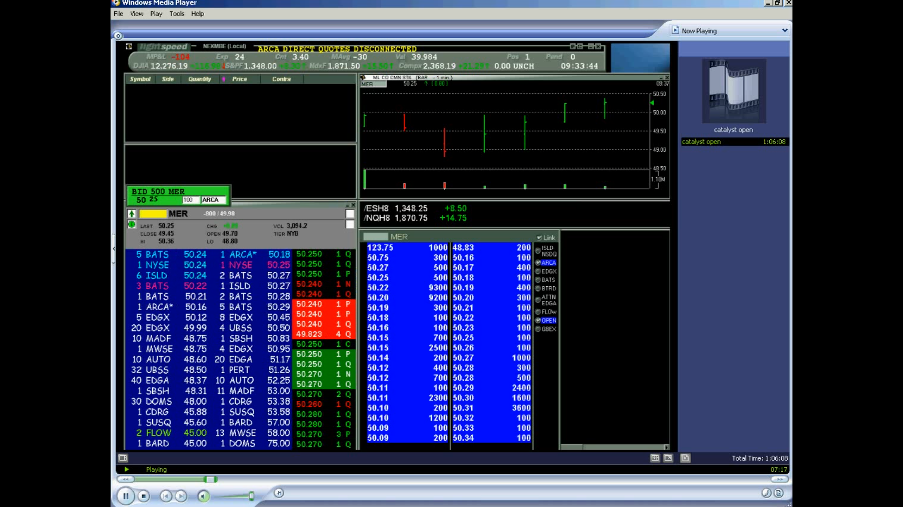

Why the fuck are the quotes crossed?

2:25pm. 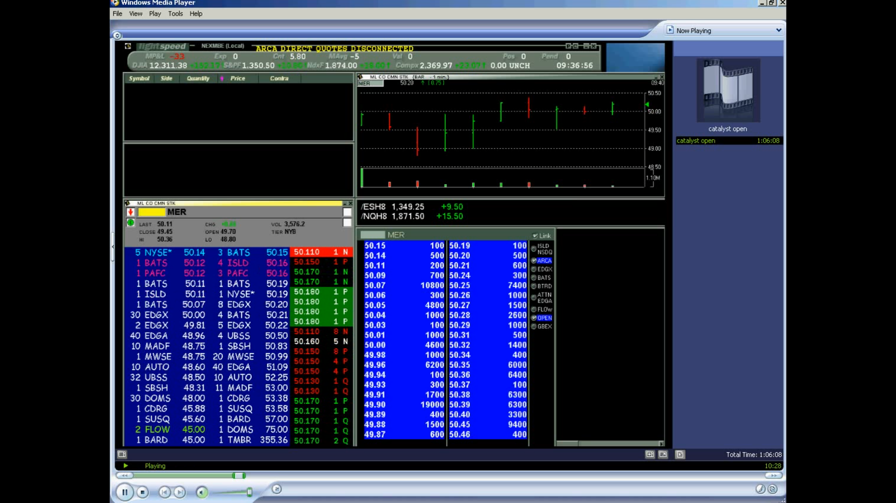

So over here he is waiting for the stock to tell him whether it is going to hold above 50 or not. So he's waiting for a hold. I really find it very hard to read both the time and sales and the order book. Sometimes large order would flash and get pulled, it's hard.

Right now the prices are just girating above and below 50.

Nikkei 225 caught my eye since it was up 4% on Friday. I didn't think it would be breaking out to new high.

2:30pm. 

This is interesting. NYSE stepped up with a big bid and got whacked. Bella is explaining how this is bearish. The seller might have a big sell order otherwise why would he hit it so aggressively? He would have tried to finese it.

2:35pm. 

This could be a part of the strategy. A big hit could be a catalyst, and I could look at the book just to make sure that no big orders are in front.


This is a bit interesting. A big bid comes in and gets taken out.


Yeah, it is making be a bit bullish that the price isn't going down despite the big bids getting taken out., but what it this trade right here? It totally messes up the chart. A tape reader would just ignore it though. This is why it's a poor idea to rely on price charts.


Oh, I think this is finally a hold.


50k on the bid. 7k on the bid. So this is what we've been waiting for.


He quietly went long 800 shares in front.

Yeah, this is it. This is what I've been missing in my trading education. You really cannot possibly miss this on the tape.


And it dropped.


It went back to 50 and now it broke again. He says that we'd want to play the downward momentum.


Oh, my god those quotes far from the action are driving me insane. The tape and the chart are telling a completely different story.

3:05pm. 

He went short below the 49.89 level as that was where last time a hold was there.


There is another trade here far out of line to mess up the charts.

3:15pm. 

Another hold at 50.

To be honest, I didn't really notice the hold at .89 that well. I should review.

...Let me backtrack.


Yeah, it should be around here, but it wasn't a very strong hold.

3:25pm. 

Lol, he is getting chopped up and squeezed. Shouldn't the plan be to cover above 50?


So now the plan is to look for a held bid around the current level.

3:40pm. 

Large seller at .49.

Not sure I like how this stock is trading. He's been trying to catch a move for quite a while now. It's been nearly an hour after the open and it still hasn't resulted in a clean move.

3:55pm. Wow, I am done with the 53m video.

Ok, that was informative.

Was that my first real life trading session where I could see an actual trader trade and have him explain his reasoning for being in the trade? Yes, it seems like it.

All the other sessions were bite sized pieces.

4pm. Let me watch the stocks for the close video and then I'll stop so I can do the chores and exercises.

Actually let me do it now.

If the levels are this important, maybe a different kind of model instead of geometric brownian motion would be better? Daytrading is very sensitive to execution, getting in too late would kill the results.

5:15pm. Let me resume. Let's see if I can watch some other vids in day 5.

I really find keeping track of the box quite difficult. I have no idea how Bella can watch both the inner market as well as the tape. I find it very hard to focus.

5:40pm. Ok, I am at my limit as to how much I can focus on the tape for one day. My eyes are just glazing over at this point.

If I had to do that as my real job, I think I'd rather just do something else. Thankfully I'll let a bot do it instead.

I'll skip some of these ultra low audio quality videos where they are just chatting around as they review the trades.

I want to focus on the most obvious trades which are holds and abnormal volume and speed.

As a rule, the easier it is for a bot to spot something, the easier it would be for me to spot it as well.

5:45pm. I'll do half and half. I'll watch the tape with the SMB guys for a bit, and maybe I'll watch some of the other courses when I am tired of that.

Let me see if the refresh has gone through.

...Not yet. I'll download the iMF and some other order flow courses tomorrow.

I am looking at the reset time on the dashboard, and last night it was 4h, but now it's saying 7h left.


This place is nice, it has a lot of 3d modeling courses. I used to be into that back in 2022. Never went far with it.

Well, even if I never download anything else from this site, it would still have been worth the price tag.

6:20pm. Nevermind, the SMB futures course is devoid of useful information. A lot of traders are deluded where their edge comes from given that they are buried in the noise and tend to ascribe it to the equivalent of reading tea leaves and astrology.

Wasn't there that market wizard who was making a lot of money using fibonacci's?

There are all kinds of cranks out there. No wonder it's not featured on the main site.

Let me take a look at the course by Mike Valtos.


At least this course is entirely on order flow.

6:35pm. 
> If you're watching this it's moving so fricking fast.

7:15pm. Done with lunch. Let me continue watching the course by Mike.

7:35pm. 

The essence of the system that Mike Bellafiore is teaching is that you want to be short below important levels and long above them. It's very nice and simple.

If you look back at 2025, I was spitting on breakouts considering them too unreliable, but I never considered trading around big volume price levels. Footprint charts should be a natural fit for that sort of trading.

You can see those big volume levels of 4-5 contracts each in the screenshot. Those are trades of 200k worth of Bitcoin.

The thing is, this system can be somewhat obscured by the noise, but what the other option? To trade in random places?

7:45pm. Remember the VWAP system?

What would be the easiest way of implementing the SMB system in a rules based mechanical fashion? Look back at the high volume levels in the last 1-10m and ask whether the inner market is above or below that. That is what the trend is.

Interestingly, it could be done off of footprint charts, but not based of candlesticks.

7:55pm. 

I am feeling so inspired right now. Bella was very persistent in flipping between long and short as the market moved between key levels.

These are the points of control on the footprint charts. This is way easier than I even though.

The VWAP system is adjancent to this one, but not quite it. It would always lag.

Oh yeah, remember that series on the Anchored VWAP system on Bookmap? I thought it was nonsense, but not really. You can see how the POCs dominate on the charts by Mike Valtos.'

8:25pm. I can do it. I should be able to do it with this insight.

I knew a lot of things about trading.

I knew about momentum. I knew about volatility.

But I didn't really understand volume up to now. I only understood it up to the level of knowing that elevated volume periods also lead to strong moves.

But if I understand the holds as points of control on a footprint chart, then that gives me a precise way to orient myself and control my risk - the main thing I was missing in my system!

Even after going through Carmine Rosato's Order Flow course I didn't really understand the essence of the abnormal deltas he was looking for. I sort of comprehended they happened at important places, but I didn't really understand the way to take advantage of them.

The advantage is that I can just trade around those levels, and ignore the random spots inbetween and it will give me a very good RR.

It should be enough to let me become a profitable trader.

Previously my best strategies were to flip around VWAP on the 1m chart or you know how my long term system was to flip every 2 weeks. Yeah, those are crappy systems which is why I am not using them.

But this is really good.

The disadvantage of using holds as levels is that the market can often whip around them, but the reality is, the market whips around either way. So I'll be whipped while trading either way.

The only choice is whether I want to give this system a try and be whipped on holds or whether I want to make random entries and exists and be whipped on them.


It's just crazy how much more volume the key level here has compared to the rest. If that isn't a trend indicator then nothing is.

This is what I was missing, the key conceptual insight! It's very counter unintuitive. I mean, Bella was talking about the levels in his book, the One Good Trade and I didn't understand it. It's like I was in a haze.

8:50pm. Let me stop for the day here for real. I need to take a bath.

I'll finish these courses, program a system and start trading for real.

Let's take it one step a time.

The most important thing of all is understanding.

Livermore said it best: "Millions come more easily to a trader than thousands did in the days of his ignorance."

This is the best feeling of all. The feeling of coming to an understanding of a difficult subject.

2/10/2026

10:35am. Had a hard time falling asleep as I was excited.

Now that I've finally internalized the concept of holds, the edge that I was struggling to find is finally in my grasp. Previously I wasn't really sure if I can make it, but now I think the odds are 100% in my favor.

10:40am. Let me see if I can download some of those other courses.

Yes, I can. Let me get the iMF Tracker Order Flow and the Axia Futures Footprint courses.

10:40am. Though I had a hard time falling asleep, I am decently rested. It seems it's gaming that does lasting damage.

Anyway since I know how to daytrade now, I could reasonably do some demo trading, but let's leave that until I am done with the courses.

11am. Come to think of it, had I bothered learning to daytrade back in 2000s I could have just focus on unusual holds and that would have gotten me above the 25k range.

...

Or maybe not. You need the capability to allow for some whipsaw in order to trade like this. It would have been excruciating to deal with the PDT rule. But I could have just opened a cash account.

Yeah, I see it. I could have won, but all the restrictions I placed on myself barred my path.

11:10am. 

Ugh, will this stupid torrent ever finish downloading? It's been stuck as 97% for days. I'll give it today and then stop.

11:50am. https://youtu.be/NIXd3PEbsNk
The Torture Will Continue Until Shareholder Value Improves

I'll leave this GN video for tomorrow.

Let me watch some videos. I'll finish SMB day 5 and then switch to the order flow course.

12:05pm. 
> Pattern recognition - A big offer coming lower

Let me watch this.

The main question for me is whether this large sell order would show up as a major POC on a footprint chart? Does the level really have a lot of volume? I'd hard for me to know just by looking at the tape. I might make this my last tape reading video. I should be focusing on the tape and it's not doing it for me. I end up defaulting to listening to the guy's voice and tuning out because trying to keep track of the volume in my head is hard work.

If this pattern is just going to be an easily detectable hold on a footprint chart then I am wasting my time reading the tape.

Ugh, I am a bit tired today and in need of a break.

12:15pm. 

Ok, this would definitely be a hold.

12:20pm. 

Yeah, this isn't that bad. Large offers are a good hint. There is no reason not to at least visualize them in a heatmap.

It could give you confidence while trading.

But the basic strategy is to be short below high volume POCs and long above them. The latest POC is the most important and the higher the volume the strong the expected trend. Using this I will be able to pick tops and bottoms much better. I'll be able to be in tune with the market.

I will be able to have something that has eluded me for a long time - skill and consistency. And I will be able to make money this time for good, without struggling to find jobs at companies. Much more upside, much more interesting work.

12:25pm. The trick is that you have to look at a chart relative to some strategy you have in mind.

I didn't understand footprint charts before because the price action was simply too noisy. POCs seem random, even after I learned about holds from SMB, I didn't at all connect them to POCs on a footprint chart. I didn't look at the chart with the intention of being whipped.

I looked at a footprint chart the same way I'd look at a candlestick, and so I didn't see the added possibilities it gave to me.

I used to try to frame high volume bars as being bullish, but as I gained experince as a trader I realizd that they are just as a random as anything else.

Yes, elevated volatility periods tend to be accompanied by high volume. Large moves tend to accompany high volume and it looks great on cheery picked example, but in practice I realized that this doesn't matter if the stock is just as likely to go down as it would to go up. High volatility without any ability to control the risk or direction just means I'd lose money faster.

But now I understand that I could trade around these levels. Be long if the bid is higher than the level, be short if the offer is lower than the level and I'll catch the move to either side with low risk. I needed this so badly.

Feb 9th 2026. The day I finally figured out the market. Or rather, I just came to an understanding of a single profitable setup and its variations, but that is enough to graduate from a loser to a winner.

12:40pm. Done with the video.

Done with day 5. I'll to the course by Mike Valtos.

Then I will be able to start playing around in demo mode maybe and also resume coding. Before that I'll also check out the other courses that I got.

There is one major thing I should do. I've been having Opus create candlestick charts, and I should test it's capability for creating footprint charts. I don't know why, but Quantconnect wasn't doing well with data from Massive.

I didn't want to bother testing Opus with footprint charts because I suspected it couldn't do it, but I think footprints and heatmaps are the next step in my own visualization work. Fuck it, I'll just create my own charting library if it's giving me trouble. Opus will be able to do that without much trouble.

Let me have breakfast here.

2:35pm. It seems the Axia Futures course has some file errors unfortunately.

I guess I'll give it a pass. The iMF Tracker course is also unordered.


Surprised there is a course by Neerav on building a data store of all things.


Thomas like this guy. I need to show this site to him.

2:55pm. 

I like this. These are really good charts.

You have to keep in mind that these are 5m charts. It's likely that 70 BTC worth of volume in a single level isn't something that is done in a single trade. It likely took half a minute to a minute for the trades to execute and the hold to develop.


Axia offers 3 self guided courses. One is based on footprint charts, one is on volume profiling and one is on price ladder trading.

I am interested in at least watching the intro for the other two.

And even though there was some data corruption in the rar files, most of the files are there as far as I can tell. I think I am missing the drill 1b in module 9, but that's about it.

3:10pm. 

A lot of the courses I've downloaded are actually from this site. The SMB course had the name of this site plastered over it.

I am watching the price ladder intro course I am curious as to how they are doing it.


Ngl, this course looks really interesting. Futures price ladders have an integrated volume, so they are much easier to deal with than stock boxes.

Anyway the site I mentioned is basically a course sharing site like many other. They don't give a bunch of free courses hosted on file sharing sites, so it's not as good of a value.

3:30pm. 

Stops runs, the bane of the retal trader.

3:40pm. 

Didn't know that footprint charting packages allow value areas.

Let me finish this video. I am really enjoying imagining how I am going to trade. I know that I only need to have the patience to wait for the holds and then I'll be able to profit off of them.

I'll drop the SMB course to focus on the futures order flow ones. Then I am going to start studying the data and modeling the price action.

I'll ditch the model I've made and ask Opus about the brownian bridge and move from there.

5:45pm. 

To be honest this course is pretty boring. Instead of just filling in the time, I wish he'd get to actual strategies. Descriptions aren't worth shit in the market.

At any rate, my bro's birthday is today so I am going out. Let me finish the video and I close up.

8:25pm. I am back. Before I left, the Axia Futures price ladder course finished downloading and I'll look into it tomorrow. I had some wine, plus it's late so no way do I feel like studying now.

2/11/2026

10:40am. I've been up for 20m. I am looking forward to resuming the courses. The tape reading course is still at 97%, but the Axia Futures price ladder course actually downloaded.

I am not sure what to think. It doesn't seem like resets work properly on FileAxa. I won't be able to download more courses today. At any rate, let me focus on the crypto course by Mike Valtos and then I'll check out the Axia Futures one.


This could finally be a first good module. I want to see whether the course by Mike actually end up offering me a strategy.

10:55am. 
> Wait until the bar closes for that confirmation.

You really shouldn't do this.

Is that guy any good at all?

The way Mike trades when these holds develop is that he wants to be long or short as soon as possible.


Using POCs is much better than than using bar lows and highs as the stop or entry points. I wonder why Lance it teaching crap with the 2 min bar trend system? That cannot be how he trades himself.

11:10am. 

Extreme volume at a level like on this chart here tends to be followed by a large move in either direction. You just have to follow the trend, and be patient in waiting for the setup.

I think this guy is kind of full of shit though, but the footprint charts are gold. I don't think the delta means anything at all.

Sigh, this is so fucking easy and I didn't realize it at all.

I really messed it up in 2007 - 2014. You know what, fine, it doesn't matter that I didn't make money during that periods. Maybe 3k would have been too little to succeed either way.

But the fact that I could not realize this concept is a large failure of research on my part.

Unless you understand how volume works, it's impossible to be successful as a trader and I didn't.

I couldn't do it as a gamer, but as a software developer my research abilities have gone up significantly. That is the main difference between me now and the me of 20 years ago.

In the end, the experience does count for something. I haven't wasted my time. I have a different mindset now.

11:20am. 
> Imagine getting short ahead of this guy that has 70 bitcoin to sell.

No, don't! Don't imagine that! That's the wrong way to trade. Rather just react. Short 1 tick below the lever or buy 1 tick above. 

This guy doesn't know how to trade, I am sure of that now. Maybe I should just switch to the Axia futures course before I get any more bad advice.

I mean, think about it, just what could these tiny delta differences tell you? Absolutely nothing.

Prior to the big hold developing the market has been moving sideways doing nothing. All the levels have low volume. It's a place to avoid trading.

> You could sell it right here, be happy and go downstairs to make your coffee...

So you'd active in a trade, but go off to do something else when you should be watching it? I am facepalming here.

11:25am. Let me skip to the Axia Futures course, hearing this guy talk is embarassing.

What he should have said is that you absolutely have to be paying attention when those big levels start to develop and when the volume starts coming in. Then you take a position. And would be absolutely impossible to notice this pattern on a candlestick chart.

You cannot actually anticipate that this pattern will develop based on deltas or anything else. You have to be present to see and take the trade.

Speed is the answer. The levels are the question.

11:35am. 

fttuts people suck. They paste their shitty watermark and they leave a cursor with a highlight in the recording. But it's better than nothing. It beats paying 1200k for this course.

This coures will have mentors doing live trading so I'll be able to learn exactly how they are doing it.

I already sort of know, but there might be strategies I am not aware of.

12:25pm. Let me resume. Took some time to send an email to Thom recommending Psdly to him.


I appreciate that they show strategies and will have live market trading.

The reason why I could figure it out in Bookmap is because even though they spell it out, I didn't really understand how to deal with noise.

12:45pm. 

I thought delta is nonsense, but if this guy is saying there could be a strategy around it, I am willing to give him the benefit of the doubt.

12:50pm. 
> You only need 1 trade strategy to be prosperous.

The video goes on for another 40m, so let me have breakfast here.

I really have high hopes for this video. Maybe learning from futures trades will be better than from stock traders. I feel like SMB could really have done more on the tech side.

2:10pm. 

First time I see the history of footprint charts here.

2:15pm. 

Pretty good intro.

2:25pm. 

I dislike these kinds of footprints. All the colors are distracting and I find it difficult to figure out the POCs.

In fact, if things are like this on a chart, then it would actually be far harder to do it on tape. I'd have to do math to sum up the number. Here I just have to add two numbers and I can barely do it.

> Certain strategies like momentum or flow tend to be better revealed using a Point & Figure chart.

Interesting.

> What are P&F charts?

///

Point & Figure (P&F) charts are a charting method that filters out time and focuses purely on **price movement**. Unlike candlestick or bar charts, they don't have a time axis — a new column or mark is only added when price moves by a specified amount.

**How they work:**

Columns of **X's** represent rising prices and columns of **O's** represent falling prices. Two key parameters define the chart:

- **Box size** — the minimum price increment each X or O represents (e.g., $1 per box).
- **Reversal amount** — how many boxes price must move in the opposite direction to start a new column (commonly 3 boxes, called a "3-box reversal").

So on a 3-box reversal chart, if price is rising (X column), it keeps adding X's as long as it moves up by at least one box. It only switches to a new O column if price drops by 3 or more boxes from the high.

**Why traders use them:**

- **Noise filtering** — by ignoring small moves and time, P&F charts strip out a lot of intraday chop and highlight meaningful supply/demand shifts.
- **Clear support/resistance** — horizontal rows of X's and O's at the same price level make S/R zones visually obvious.
- **Pattern recognition** — classic P&F patterns like double tops/bottoms, triple tops/bottoms, bullish/bearish catapults, and triangle formations have well-defined entry signals.
- **Price targets** — P&F has built-in target methods (horizontal and vertical counts) that project price objectives based on the width or height of consolidation patterns.

**Relevance to order flow:** P&F charts can be interesting for what you're working on because they're essentially a primitive form of filtering for "meaningful" price action — somewhat analogous to detecting when price is being held at a level versus just passing through. Some order flow traders overlay P&F logic to identify when accumulation/distribution is happening at key levels.

///

2:45pm. 

He says that color is great and make it easy to make quick effective decisions. Ok, I was wrong. The darker areas do make it easier to spot important levels.


Ah, the shades are showing delta. I thought they are showing absolute volume. Absolute volume at a level is more important.

2:55pm. 

So they use all 3 tools. I've never seen the market profile course anywhere. But nevermind it.


Didn't think they'd talk about Bookmap.

3pm. 

This course is starting out very strong.

It's not that it's just hyping up a particular tool, but is covering their strengths and weaknesses.

> Weaknesses of one tool can be a strength of another.

3:05pm. Regarding level 3, he says that it's very noisy and it can be nigh on impossible to make discretionary trading decisions. This is what SMB is trying to teach us to use.

Though I am wondering why he is putting Bookmap in the same bucket?


Here are the strengths of the footprint. He says that different tools offset the weaknesses of the other.

3:15pm. 

What a long video. Honestly I am curious about the price ladder and how it could be used effectively, so why don't switch between the two.


The way the course has been ripped is pretty weird. There was a free session 1 on the website and I am sure it had slides rather than just the presenter.

If I really like these courses I might want to buy them outright.

Why am I even watching the price ladder course? Because footprints feel natural, but the price ladder seems like black magic. I am really curious what sort of strategies they will represent.

I am really eating good here. Let me watch these 2 courses. I might end up not needing anything else.

3:35pm. 

So there might be an advantage of having just level 2 data.

3:45pm. 

Oh this is a good point. He is saying that you can tell when an event is a key event by the thinning out of the order book. Andrea Cimi talked about market markets taking off their positions before key reports.

He talks about acceleration and non-acceleration in the price ladder. The pace of the tape is something SMB talks about as well. Good breakouts have fast tape for example. This is something I wouldn't be able to see on a footprint chart.

Let me stop here so I can do the chores.

5:10pm. > When the market has a lot of activity, when the trader volume is going through the market very aggressively, very fast then in those types of conditions you're more prone to potential breakouts trades, or it's easier to see absorption plays.
> The picture that I am trying to paint you is that there is an entire personality to what you see to what is going on in the trading ladder and the level of intent can really help you put forth a really strong trading strategy and trading plan to profit from the personality and the acceleration and the non-acceleration of what is going through the price ladder.

5:45pm. 

He talks about peripheral awareness across all the markets. That with practice you can see a move in peripheral vision. Crazy.

5:50pm. 

Since I torrented the course, the problem I am having is that it's very downscaled.


> You might think this looks confusing, but the human brain is incredible. And the human brain over a period of time starts putting all of this into really one picture and you'll notice quite quickly how your proprial awareness starts picking up.

6:50pm. Yeah, let me stop here. As much as fun this is, there is only so much I can learn in a single day. Let me not push myself.

...


Ah what the hell, let me do a bit more.

7:10pm. 
> The charts don't show you the underlying intention of the market.

He's talking about using the speed and the intensity of orders at key levels as an indicator and how that is impossible to see on a chart.

> ...Whereas it approaches it by a couple of ticks, you've bought a lump, it's popped a coupld of tick and it's getting no follow through on the auction activity and the speed of orders that are going through on the ladder, you can quickly start reducing your exposure.

Yeah, this is what I am missing. This what I need.

Idiots learn to just never sell.

7:30pm. 
> You can really increase size when the order flow picks up towards a critical juncture point.

More price ladder hype.

7:40pm. Ok, I am feeling the fatigue. Let me stop here for real. Amazing that there are people capable of following 16 different price ladders.

I really want to know what kinds of order book patterns there are. Footprints will only show volume clustering in actual trades. If I am going to be looking at footprints, it would be great if I could also overlay the order book as a heatmap. But it isn't indispensable at the moment.

As long as learn the patterns in this course, I'll be able to make an informed decision as to how much I need the L2 data. Will Massive be enough for stock market data or should I shop higher?

I need to answer the question whether futures would be fine or should I really just stick to stocks in play?

If I can make a bot to just look for trade patterns without the need for L1 or L2 data that would be a great place to start. L2 data is expensive, so I'd need to first start earning enough to be able to afford it.

That having said, real time L2 data is much cheaper. I could restrict myself to Nasdaq stocks and get it for 100$/month.

Bookmap supports that.

...Yes, going through this course won't magically make me a good trader, but it will tell me what kinds of patterns I need to look for and that will open a realistic path of improvement as a trader. I'll clear the 2 Axia Futures courses by the end of the month.

7:55pm.

> Good people have the obligation to be good. Bad people do not have the obligation to be bad.

Yujiro helps an old lady today.

9:35pm. Let me note an idea I had today.

Instead of the drift model, I will pay more respect to support and resistance in the future.

The drift model has a major weakness - if the drift is positive, it will make it possible to distinguish the episode purely based on the % of upmoves. If you take a normal distribution and shift it up, then will no longer be 50% positive, but above that. It will be such a huge distinguishing mark, and the large the number of trades the more obvious it will be.

While I was thinking of how to represent support and resistance levels, I thought of a solution.

I'll make the S/R levels probabilistic, I'll sample them from a log normal distribution or maybe even normal, and just reject the moves through the level. That means that moves near the level will have some drift, but it will no longer be possible to have large trades smashing through the major levels by accident.

This kind of model would also give reason to buying on pullbacks and selling on upmoves.

If a move gets too far from the major levels it will be essentially 50/50 in EV.

The way the moves will work in the new system is that I am going to have two levels on every move and simply contract the initial level towards the other one as the move unfolds.

In an upmove for example, I'd just move the support towards the resistance in a linear fashion proportional to the time delta. If a trade tries to be generated below the support, it will have to roll for acceptance. And the same goes for going beyond resistance.

The drift model has a big weakness in that large moves in either direction have no particular meaning, but I don't feel it is like that in real trading. In real trading large moves are a good indicator of trend changes. At least that is how I used to feel.

Recently, the model work that I've been doing is making me feel that I might be overlooking the information provided by the smaller moves.

Large moves may grab attention, but they aren't the best indicator.

...I should just go to bed. I am looking forward to resuming the course tomorrow. Just by going through the Axia Futures one, I have so much to gain it's crazy.

I hadn't gotten AGI yet, but 2026 has its own perks. The learning is there for those who wish to receive it. I wish I had this 2 decades ago.

2/12/2026

11:10am. Let me get started.

11:20am. I did some thinking, and even if it turns out to be the case that I won't need L2 data to recognize the key levels, I still need it to estimate the liquidity and the risk of a trade. You know how the spread in LW became 10% on the hold released? Yeah. If I was entering that trade, it would really have been a good idea to see how much I would have lost if the trade reversed.

11:40am. Sergey Hoffman talked about this drill.


Like Jigsaw, Axia futures course has these drill that I could do. Not that I am going to do it. I am not going to trade off price ladders. Right now, I am just looking for conceptual understanding, and once I have it, I will start coding it up.

11:50am. 
> Platforms to develop your HFTs and algos.

I am really into that. Should be an interesting module for me.

12:35pm. 

Velocity of order flow is important.


> It's so critically important to understand market velocity.


Yeah, I think I made a mistake in my modeling. The speed differentials between consolidations and high intensity episodes should be as much as 10-50x. In fact, it's speed the produces a difference in volume in a zone.


> As you can see the trader is short.
> If the speed picks up as the market moves to the upside then you will potentially have to cover the trade.
> If the speed picks up you will have to start paying very close attention.
> If the speed start to pick up then the likelihood of a breakout starts increasing rapidly.

12:55pm. He's is saying that when the auctioning activity is only one way, like there is only a buyer taking the offers and no sellers, the probability of a reversal increases significantly. Healthy actioning activity would have both buyers and sellers on both sides of the spread.

I didn't know that. Though I am recalling the strategy Andrea Cimi is using, which was based on exactly this principle. He showed a strategy in one of his videos of waiting for a weep and then putting in the order to play the reversal of that sweep.


> When you have good speed and good auctioning activity, the likelihood of momentum play happening...

Yeah, this is exactly why I am taking this course. I had no idea about the importance of auctioning activity.

Shit, how am I going to model that? Figuring that out is my job. If I can surmount that challenge, I can have everything I ever wanted out of trading.


I am going to have to model this. I had no idea that trade velocity can vary by price zone.


> When the relative price starts slowing down, you're going to start booking your profits potentially.
> This is one of the most important things. Once you understand market velocity you're going to be able to seize up on that market velocity.

Yeah, the most important things are the most obvious. I won't put too much stock into whether the auction activity is one or two sided. It will be one sided on strong momentum moves.

1:15pm. Let me have breakfast here.


Yeah, I cannot eat and take notes, so let stop here.

2:45pm. Let me resume. I've been having plenty on insights ever since I started on his path. Previously discovering all of these new tools would have astounded me, but the essence of programming is creating my own tools. Footprint charts are nothing. I can do better.

Controlling representations to myself isn't that much different from controlling representations the NN will ingest.

> Absorbtion, flipping, momentum

Actually let me stop here I really need to get some exercise.

3pm. Nevermind, I'll have to wait until my dad finishes smoking. We have a bike in the living room that I ride for 20m every day. He just lit one up as soon as I was walking into the room.

3:05pm. 

Chart traps.

3:10pm. 

Very interesting matrix. I think I might not be understanding exactly what auctioning level is.

Can the auctioning level really be one sided if the velocity and the volume are high?

Is the sidedness of an auctioning level really expressed as being high or low?

3:15pm. I am so lucky to be able to get this course. Normally, I wouldn't have considered buying it and it is such a goldmine.

3:20pm. Maybe to simulate low auction levels, I could added serial correlation. If the previous trade was up, make the next trade more likely to be up. I could reject a trade down with some probability and reroll in order to get that effect.


If I want to be profitable, these are the patterns I need to recognize.

3:40pm. 

What is a large order?

> How do you measure a genuine nature of a large order?
> What is really important is that a genuine order wants to be filled.
> It's not a flipper or a spoofer who doesn't have the intention of being filled. It is actually an order that wishes to be filled.
> And most importantly is the duration. If the 
> If the large order has been sitting on the orderbook at that price for the entire morning or you saw it prior to the futures open at a key level, then that has a strong nature.
> If you just see a large order appear out of nowhere at a price the market is trading, then there is a strong likelihood that is not a genuine large order.

Large order wisdom.


> The large orders are most genuine when the market is in a high panic state.


> Sometimes you can get a quick 20 tick move when you notice the large order not being filled. It will chase up the order book.

He is also talking about how the market is running up quickly, it will bounce of a large order.

5pm. Done with chores. Let me resume. Tbh, there is less material in the modules that I though there would be.


Ok, I want the L2 data. I need to see these large orders in the order book. Especially if they've been there for a while.

> That's how you can see the larger order, because it's accepting being traded into.


Whoa, the 1,000 lots got cleared out in a flash. I would definitely have been too late to react!

Time for module 9.

Honestly watching the ladder, I would have joined in hitting the bid once it went below 500 lots, but the feeding accelerated far beyond my expections. I have no idea whether I could execute on this trade at all without the help of the machines.

This is a goldmine. I just have to implement these strategies and then I will start printing money. It's a great challenge for me as a programmer.


> It's always easy to spot the level. But the difficult part is to trade the level.

5:50pm. I might have to watch this multiple times, but what he is saying that the trading velocity is the most important in trading absorption patterns.

My focus is starting to wane. Let me see if I can finish this module today. This is quite interesting as it should be.


This might be a strategy more suited for footprints.

6:10pm. I'll leave the live examples for later. I am too tired.

But the story they are telling me is in line with what I learned from SMB.

I just want to see different perspectives on what I am learning to see that I am not missing anything when it is time to resume.

I got my fill figuring out MCMC and doing some modeling, but once I am done with the courses I am going to implement the systems that will be used with real money on the line.

So it's best that even if I cannot trade them manually that I have the right patterns in mind when I do my modeling. It's a basic principle of programming, to explore your problem domain before making a big commitment in coding.

Had I done this far back in late 2006, my life would have turned out so much more differently. People who don't know how to do reseach will inevitably get fucked.

I love this.

If I can master just one play - One Play, I will be able to align my life onto its proper course. The difference between 0 and positive is infinite. I've been stuck at 0 for far too long, dreaming of the day I would have power. The Tao Ceti job turned rotten, but if I can get this to work, I will have a clean edge that won't fade away. I will have a job worth doing until the end of the era of man.

It will be the kind of job where my profit factor will just keep increasing the stronger the machines become and the deeper our understanding of the algorithmic basis of intelligence becomes.

8:15pm. Damn, maybe I should just go to bed. I can't wait to go through the rest of the course. The chapter on spoofing I am particularly interested in.

I have no idea what sort of strategy they will suggest for when the activity is low. I am also really looking forward to seeing whether they will have something more interesting than my idea of just being long above and short below key levels.

After the footprints course, I am going to check out the SMB Winning Trader course to see the full list of setups within.

And that will be enough. After I am done with these 3 courses, I will have gotten what I needed and will be able to start researching real data and resume the modeling work. I already know that I want to do momentum and absorbtion plays. Dan Zanger most likely got to 40m using those setups and I'd like to replicate his success. I want to trade momentum.

I don't want to fight for a few ticks here and there in front of large orders.

Eventually, I'd like to be able to chain ORBs into longer term momentum moves.

Instead of doing ORBs when the highs get broken, if I instead use the order flow momentum patterns for them, my performance should skyrocket.

But I also want to try trading perp futures since the data is great on them, and they are easy to short. Maybe I'll be playing them on the short side long term.

I wonder if they will turn out to be anything other than a passing fad?

Ah whatever. I'll always have stocks either way. There are 100s of diffent instruments I will be able to play absorption and momo patterns on even excluding stocks. Unlike a single trader who will have only a single main market, the whole world will be my oyster.

Perp futures do have some appeal, but the companies they are based on are pure trash. I want crypto to grow up and move beyond scams.

2/13/2026

9:30am. Let me resume the courses.

It's time to pick up the pace. That larger order video gave me a lot to think about. In particular, the 4-5 tick wins could easily be 10 tick losses with poor execution. I've been thinking that I need to trade using scripts.

According to my own trading plan, I'd probably have leaned on the large order, and then promptly gotten hit for 10 ticks when the level broke. Oh yeah, today I intended to put that video into OBS so I can go through it frame by frame.

Ok, I've counted it. It took 15 frames for it to go from 950 to fully consumed. At 25 FPS, that would be slightly more than half a second of time to react. It took 8 frame to go from below 500 lots to consumed.


If I just try to automate this trade as a generic key level trade I'd end up selling below the 50.35 level and buying when it goes back up above it again. I'd lose money when I could have made it instead.


Let me get back to this. The price ladder traders try to scalp ticks here and there, while I'd like to hold for longer.

Hopefully that will be more rewarding in daytrading than it is on longer term timeframes.


> So what you want to see, is first you want to see the absorber and once you've observed the absorber or the iceberg, you want to see the velocity of the exchange start decreasing.
> The relative rate of exchange start decreasing.

Then you hit it.

10:30am. Done with the absorption module. Time for the next part.

Module 10 Market Flipping, Layering and Spoofing Price Patterns

I really wonder if momentum is just the opposite of absorption. We'll see. For now let me go through module 10.

He's telling me to read these links.

https://mahifx.com/mfxtrade/blog/an-interview-with-paul-rotter-adapting-to-survive

Damn, I think the first one is dead.

https://www.mql5.com/en/blogs/post/10367

Opus found it for me.

> Given your interest in order flow and market microstructure, the parts about how he used his own fills as information ("from my fills I could feel what the market wanted to do by how it reacted to my orders") and his description of reading market psychology at support/resistance levels are especially relevant.

https://www.elitetrader.com/et/threads/article-on-flipper-and-spoofing-strategies-from-john-arnold.289335/

Let's see if this is up. I am just using the text extractor tool from Powertools to get the URLs from the video.

I didn't think the interview by Paul Rotter was worth it my time to read.

> Front-running is profitable against traditional orders entered by humans. But with spoofers in the mix, the picture looks quite different: When the front-running HFT algorithm jumps ahead of a spoof order, the front-runner gets fooled and loses money. The HFT’s front-running algorithm can't easily distinguish between legitimate orders and spoofs. Suddenly the front-runner faces real market risk and makes the rational choice to do less front-running. In short, spoofing poses the risk of making front-running unprofitable. Because spoofing is only profitable if front-running exists, allowing both would ensure that neither is widespread.

This is nice.

http://uk.business.insider.com/what-is-spoofing-2015-10

Dead link. Ok, I get what spoofing is, let me move on with the video.


> Once you see the absorption on above the ladder, you join the absorption on the sell side.

Ah, I see, that's what he meant by auction activity. It's not whether it is one sided or two sided. Rather, it whether the bids are being pulled up strongly with low activity.

Usually, the market has to be hit by aggressive buying in order to move up, but when spoofing is going on, you'd just see the prices move up without without that aggressive buying happening.


So no auction implies a revisit. More broadly, Andrea Cimi did say that gaps get filled most of the time on the day they happen.

11:40pm. Let me take a break here. I'll take a look at the drill video after that.

Module 01 Learning Objectives, Outcomes & Methodology
Module 02 Introduction to The DOM (Depth of Market)
Module 03 Course Curriculum Outline and Roadmap
Module 04 What The Ladders Tell You That The Charts Don't
Module 05 Market Participants with Algorithms & High Frequency Trading
Module 06 Auctioning Exchange and Market Velocity
Module 07 Introduction to Order Flow Price Patterns
Module 08 Large Orders
Module 09 Absorption Order Flow Events
Module 10 Market Flipping, Layering and Spoofing Price Patterns
Module 11 Trend Reversal Order Flow Indicator
Module 12 Momentum Breakout Order Flow Patterns
Module 13 Practice - Confluence of Order Flow Strategies
Module 14 Evolution of Order Flow and Price Patterns
Module 15 What Makes an Elite Order Flow Trader
Module 16 Interviews with Elite Order Flow Traders
Module 17 Bonus Advanced Replay Drills and Practice

There are bunch of modules left to go, but I am going to skip 14 and up. Maybe even 13 and move on to the footprints course instead.

...Ugh, reading the tape course torrent is driving me insane. I never experienced being stuck at 97% for days.

1:20pm. Let me resume.

It occurs that spoofing would just appear as a low volume climb on a footprint chart.

1:35pm. Oh wow these patterns are so short term. I wouldn't have thought of them as being anything other than noise!

Time for module 11.

1:45pm. 

I wonder what he means by order type initiation?


He's not talking about absorptions, but about flow off tops here.

Sigh...

Isn't this fun? Being able to make actual realistic plans to reach your goals instead of just bashing your head against the wall on the dailies?

I couldn't reach the Singularity, but the pursuit of it gifted me this. I just kept believing that if I kept going that it would not be futile.

I should just enjoy myself studying the markets and slowly getting better at the game. That is how thing should go.


I am really happy to hear that the market has a consistent level of activity between the episodes. That's exactly how I am modeling them!

3:05pm. Let me go to module 12.

I think my focus is worse today compared to yesterday. I start preparing for bed past 10pm, but it's taking me too long to actually go to bed. I end wasting too much time instead of resting.


I feel like some of the videos must be missing in the torrent because some of these strategies weren't covered at all in the previous module.

3:20pm. 

Markets are in congested zones 70% of the time.

> When the market moves above or below the congestion you get this presure release.

Bu the way the image of traffic is great.

Yeah, this is how I want to trade. No doubt about it. I am not into scalping for ticks against the flippers.


Ohhh, actually it never even occured to me to track open interest. I should be able to feed that as a data point to a NN. But these patterns are easy enough to tell apart by volume, so I don't really need it.


Hold -> Move -> Hold -> Move

That is how I'll architect the next generative model.


Lance talked about combining multiple timeframe together when doing momentum plays.


This is the first time I saw it talk about automated entries and exists for momentum plays.

> Volume slam dunk is one of my favorite plays because you can get away with a lot of size with high probability.

I am also curious what the passive strategy is.


So they are using a stop (limit) order to enter the market on this trade?

I can only feel pity for the longer term trader who are using tight stops. They are market chow.

Let me take a break here.

I need to do the chores and the exercises.

My focus is low to day. I got up far too early and am not really giving it my all.

5:40pm. Done with chores.


Wow they are actually adding into the breakout as it progresses. These strategies are pretty complicated in fact.

My focus is not really there today. I'll want to maybe replay the practical examples in the future, but it fine if I don't completely get it right now.


Thankfully there are high volume levels that can mark the start of breakouts. But this idea of adding into breakouts is really interesting.

I haven't been able to figure out how to make pyramiding work, and here it does work.


Damn it spiked!

Is this an exhaustion top? No, not yet, a trend reversal move requires the tape to slow down first. You don't sell while it is still going up.

There is a shift that's visible on the tape, but not on the chart.


He says I could start entering the trades into low volume zones. That was the first pattern covered 2 vids ago.

You know, since this pattern does take a while to develop, I bet I could pick up quite a lot of size along the way. This doesn't matter at the start my trading career, but it will as I go along.

Ah, and I also realized why they are using a limit order in pattern 2. They aren't necessarily taking the other side of the market, but they don't want to use a market order and get massive slippage during the stop hunt. OCO is a bracket order, so when they are doing a stop hunt at the lows, they'd use a limit sell that automatically turns into a buy when they get filled.


Ah, so I want to buy the above the low volume node instead of inside it. He says that I don't want the market to trade there.

What the hell, it did go into it. I could have bought there. Isn't the theory that the market has a tendency to fill in the gaps, so I think it might make more sense to buy inside the low volume area.

6:05pm. Ok, let me deal with module 13 today as well. It only has 2 vids.

6:10pm. No, let me stop here, I am too tired to watch this properly right now.

I'll leave module 13 for much later and move on to the footprint course tomorrow. Now that I know some price ladder setups, I am really interested in contrasting that with footprints.

8:40pm. I give up. The SMB tape reading course cannot be torrented.


I've never encountered a situation like this before. Sometimes I see seeders coming in and going, but not contributing anything, it's maddening.

8:45pm. I think I should just get it for 20$ and be done with it. I just clicked on the Hunt Orders chapter at random and learned something new.

8:55pm. Oh I see. fttuts.com is actually better than I thought.


Some of the courses are free for members (which costs 34$/month), but other have an addon cost. I thought all of them had to be paid individually like with other course resellers.

9:05pm. Ok enough, I am done for the day here. Part of me is thinking what I should do and it would be best if I just went to bed.

Novels and games aren't interesting to me anymore, trading is where it is at. I haven't even read FX Senshi Kurumi yet. It's getting an anime along with Nia Liston.

I have the manga files sitting on my hard drive unread. I need to focus on finishing the courses and I will resume programming.

You know those spoofing trades are actually interesting. The only example was them showing a spoof order coming in, and then saying that that is a scalping opportunity and it is.

Even if that large order is only sitting there for a second, that still gives the machine plenty of opportunity to scalp. The same goes for the other large order trades. It's definitely an edge even if it feels to my eyes like random noise.

I feel like the Axia course is 10/10. I made the right choice to get it.

It's improved my understanding of order flow trading significantly. I am really looking forward to the footprint one.

It's very interesting though, that they didn't put much emphasis on key levels in the price ladder course.

Eh...well good night.

2/14/2026

10:15am. Ok, it's time for footprints.


Doing some research and it seems that DataBento offers L2 data and the trade aggressor sides.

My god, this fragmentation makes trading stocks far more difficult than it should be.


The full package would require paying 200$/month.

Ok, so now I know what getting good data would take. I've just been looking into whether it would be possible to do DOM trading on stocks and went down this hole.

10:55am. 

Interesting, he says we'll develop a strategy using the imbalance information. Is that sound?

2:50pm. 

I wonder if it makes sense to really bother with this course? This is just the usual techno analysis claptrap.

There is one thing I am realizing - the importance of speed. The faster I am as a trader the more money I will make.

Looking at charts will not get me far. Being in the flow will.

2:55pm. 

Ok, let me start skimming this course. I am not going to suffer through this chart claptrap. I have better ways of thinking and modeling.

The way the chart is shown with these useless colors is annoying. I can barely see the POCs. I am going to skip to the strategy sections.


Jesus Christ, so much for this being simple. He made a big deal about keeping it simple, but is just introducing principle after principle for 2 hours.

The price ladder traders on the other hand just concern themselves with auction activity, volume, liquidity and price velocity.

The first course of Neerav Vadera is also on DOM trading. He says that banks start of their traders with that, and in a later course does he bring in the footprint charts. Since it is on DOM trading, I'll check it out. I've already downloaded it.

I've spat on Mike Valtos' course, but the fact that he had POCs highlighted made it a lot easier to interpret them.

3:10pm. Nevermind this, I am jumping straight to the strategy sections.


Get to the strategy.

3:20pm. 

He has 3 different tools on his screen when one should suffice.

In fact the volume profile on the DOM is the ideal tool. You could see the volume clustering on it exactly.

Sigh, I really like the tape reading courses. The price ladder one just places the patterns into 4 sensible blocks.

Nevermind this course, I am skipping it.

Quant trading has far more in common with tape reading and price ladder trading than it does with chart reading ironically enough.

Contrary how I thought it would be, it's very easy to understand the price ladder course.

Let's say the large order patterns. You can do 3 things:

* Lean on the order scalp it.
* When it starts getting consumed, push into it and play the break.
* After it breaks play the reversal as the market fill in the gap.

For spoofing:
* You see a large order come out of the blue, lean on it and scalp it.

For absorbition patterns:
* You see reloading on the bid and offer, start scalping or build a core position.

For momentum patterns:
* Play the acceleration in the tape.

For reversals:
* Play the decceleration in the tap.

All the lessons are few minutes each and have fairly understandable criteria.

In fact those criteria are exactly what I am modeling in my own codebase. They are in-line what SMB has taught me.

What isn't in line is that SMB plays trends off key levels, while Axia Futures price ladder course has more niche patterns. The reason for that is because they trading assets that aren't in play that don't trend well.

SMB traders trade momentum in its various forms. Those patterns appear more frequently when there is a catalyst and abnormal volume at a broader level.

Let me skip to Neerav's course and then I will get the tape reading course by SMB.

It will be a lot easier for me to quantify tape reading than it will be to quantify chart analysis. I think chartists are full of shit.

Sigh, the only thing I like was him showing a volume footprint shart with the different shades. No bid or ask, just the volume. That makes it easy to read.

5:10pm. Time to resume.


I was thinking of getting the Jigsaw course, but the modules names here are exactly the same as for the Axia Futures course, so they are very likely the same courses.

I thought of a drill just now.

I should learn to read the ladder, and I should try to make it so that the market I am simulating is as indistinguishable from the one on the ladder as possible!

Yes, that is the golden standard I should be aiming towards as a quant trader.

Obviously I cannot make the simulation realistic if I don't understand what realistic should even look like.

I need to develop a feel for the markets so that I can develop a feel for the simulation.

Right now, I am still not doing enough. I am still my old lazy self. I need to push myself to the absolute limit. Only then will I succeed.

...Ok, let me check out the course by Neerav.

5:35pm. 

If the tape is too fast, maybe I should just replay it in slow motion.


In the first module he really wafles about irrelevant stuff so I skipped that, but this is interesting. 10 bid, 18 ask, but in the time and sales it's much more fragmented.

I need to backtrack in order to understand how the DOM is configured. It aggregated the trades, which is good.

5:55pm. I kind of like the approach of Neerav. I am going to get the fttuts membership and get all the order flow courses that have caught my eye.

I kind of feel more at ease with the the DOM. Wish stocks could be traded like this. Don't want to spend 1.5k a month just to practice on them.


> I've felt like this at the start. There's too much information, there's too many columns, there's too much.

He's saying that in a pro trading environment, the charts aren't even looked at for the first few months.


> The reason why it's such an excellent proxy for it...
> The people transacting in the futures market are massive institutions.

He's talking why forex futures are such a great proxy for spot. Honestly, this is new to me. I've been wondering why one would ever touch forex futures given that spot is so much bigger?

He's saying that the institutions see the order flow and that is reflected in the futures market.


> You're not going to have to spent the next few months staring at this going up and down.

Phew.

> The major reason for that is that the landscape has changed in the last 10-20 years. There is a lot more algorithmic flow now which is automated flow, machines. In particular big hedge funds have come into the space. Obviously banks as well and they are using automation.
> What that means that the speed of transactions at the microscopic level is very fast.

Yes, this is what I am afraid of. That 800 transaction hold in 3s in LW is something that I keep thinking about constantly.

> So the competition in that timeframe has increased severely.


> B is that the resting orders because of this algorithmic flow, a lot of it is fake.
> It doesn't mean it's not important for you to have an understanding of. But in terms of gaining an edge and being able to make money out of it...
> It's there 1 minute and gone the next.
> It's not something that's going to be helpful for you long term.

7:05pm. He says that we shouldn't waste 6-9 months watching the prices go up and down, but we should at least spend 2-3 weeks doing it.

His views are pretty interesting.

> Why is that? Why are we looking at T&S? Why don't we just over to the footprint & cumulative delta?

Incidentally, he things his education is better than what I could get at a prop firm. We'll see.


> You're not given charts. You'll be given multiple screens and this is what you'll be watching go up and down.

Nightmare.

> There is no difference to what is going on in the financial market to what is going on in any market in the world.
> It's like driving a car, you just get used to it.

7:30pm. Let me stop here for the day, the next video is 1.5h long. I"ll leave it for tomorrow.

It's Thomas who pointed the guy out to me a few months ago, but contrary to my expectations, it seems what he will teach me will be pretty promising. It seems like he found a way to merge DOM, footprints and volume profile tools.

I have things I want to do already in mind, but it simply makes sense to study pro methods before I go off on my own. Could save me months of wasted effort down the line.

7:45pm. 

> Why is Russia dependent on western communications for their C&C? Why wasn't Starlink shut down earlier?

///

Great question — let me search for the latest on this topic, as it touches on recent developments in the Russia-Ukraine conflict.This is a really fascinating story that's unfolding right now. Let me break down both of your questions.

## Why is Russia dependent on Western comms for C2?

Several converging factors:

**Russia's own military comms infrastructure is terrible.** A Russian war blogger wrote that "funds to create domestic military communications were embezzled," and that high-quality communications remain nonexistent. This is a consequence of decades of corruption hollowing out Russia's defense sector — the money earmarked for indigenous satellite and tactical communications systems was stolen.

**The battlefield demands outpaced legacy systems.** Drones now account for roughly 60% of all fire damage along the front compared to 40% by artillery, and drones need constant, high-bandwidth, jam-resistant connectivity to function. Russia's existing radio and relay systems simply can't provide this — they're vulnerable to Ukrainian electronic warfare, have limited range, and can't handle the data throughput needed for live video feeds and real-time drone control.

**Starlink is just far superior to anything else available.** As one Ukrainian analyst put it, alternatives exist, but nothing humanity has invented matches Starlink's capabilities. Russia's domestic alternatives are bleak — Gazprom Space Systems has only five communications satellites in orbit, offering limited coverage, weak signal, high costs, and difficult field maintenance. Russia has repeatedly attempted to create a Starlink equivalent through programs like "Sfera" and "Rassvet," but none were fully implemented, while SpaceX's constellation has surpassed 9,600 satellites.

So Russia took the path of least resistance: they illegally imported more than 50,000 terminals through third countries, primarily via Central Asia, disguising them as tourist equipment or auto parts. The terminals worked because they were technically located on Ukrainian territory where Starlink coverage exists.

## Why wasn't it shut down earlier?

This is the more politically charged question, and there are a few reasons:

**Technical difficulty of selective blocking.** Starlink coverage over or near the frontline cannot be deactivated or jammed without potentially harming Ukraine's own ability to use the system. The terminals used by Russian forces were technically on Ukrainian soil (occupied territory), making geofencing by location alone insufficient — you'd cut off Ukrainian forces too.

**The whitelisting solution took time to develop.** The approach that was finally implemented — requiring all terminals in Ukraine to register on a verified whitelist — is a significant logistical and technical undertaking. Ukraine's digital transformation minister had been talking about finding a solution to deactivate Russian terminals as far back as early 2024.

**Political dynamics around Musk/SpaceX.** SpaceX had a complicated relationship with the conflict from the start — providing terminals to Ukraine while simultaneously limiting their military use and resisting coverage expansion to Crimea. The willingness to cooperate on a crackdown seems to have been catalyzed by reports that Russian forces were strapping Starlink terminals to long-range drones — essentially weaponizing the system for terror strikes deep into Ukrainian territory, which crossed a line even for SpaceX.

The impact of the shutdown has been dramatic: nearly 90% of Russian units lost connectivity, Russian battlefield command was described as "effectively paralyzed," and they're now scrambling with inferior alternatives like chains of LTE modems and Wi-Fi bridges. One Russian soldier said they "completely descended into the Stone Age" overnight.

///

Holy crap, so that is how it was. Lol'd at the funds for comms infrastructure being embezzled.

Anyway, given that Russia was desperate enough to rely on Starlink before going to war, it seems that this might be the tipping point that is going to end it. It couldn't conquer Ukraine despite being at war with it for 4 years, so that speaks volumes about its strength or lack thereof. Russia is so fucked.

I would never had imagined that Russia could have such an vulnerability.

8:20pm. https://youtu.be/WXBxLHdYFi8
What Most Prop Desks Don't Want You To Know

This video is on grading setups. It's too long though, let me go to bed. I really want to go through these essential courses.

2/15/2026

7:40am. I am having trouble sleeping as usual, but it's different from when I was gaming when I would go late and wake up tired. Yesterday I went to bed early, and had a hard wakeup today. It must have been an hour ago. The reason for that is that for me the tension is running high.

I have a couple of path open to me, but for now I will focus on the courses.

And after that I might learn to read the tape or just do a study. It occurs to me that the quotes are only really important during hold releases. So even if I just study the raw trade data I should be able to get a good grasp on how well do key levels work.

If I could do that study, I could fit the NN to it and begin trading.

Once I do that study I'll be able to objectively confirm the edge. That will tell me exactly where I stand.

8am. Ok, let me get started. Let's see what Neerav's got to teach me.

Let me just make a commment. Though I dislike the footprint chart courses, the charts Mike Valtos posted of BTC were amazing. The key levels in them are so clear. But then I came into the forex futures markets and all of those levels stopped being so clear.

8:25pm. 

Wait, if everything in the supply side is really supply then would it become thin in extreme points?

Holy crap, the file is corrupted. I'll get that fttuts subscription and see whether that makes a difference.


This is such a waste of my time. I don't need him to explain bid/offer for an entire hour, but how to actually trade.

8:55pm. Let me aim to finish this course today.

9am. ...Or maybe I'll aim to finish it in the few minutes. This course is far too damn basic. I don't want to hear a guy explain for an hour how bid and asks work.

This is something that is obvious with a few minutes of thought.

Let me take a look at his real trade example.

9:15am. 

It took a while, but this example where he is walking me through a live trade is good. I pretty much skipped the whole course to get to this point.


> There are people who enter, leave a stop loss and a target. Crazy.
> As you can see, after you enter you're getting information all the time.


> Why am I not bailing out even though it has gone against me for the past 15 minutes? I am taking into account what has been happening over the last 15 minutes. We've seen absorption at all of the levels.

Now this is real education.


> Go out, do a screen recording.
> Watch it, try to do it in real time, but then play it back to yourself.

9:35am. Ok, there is one more live example there and then I am going to do some research on how to trade stocks with a DOM. I don't like the way SMB traders have so many windows open in different places.

The DOM tool is possibly the most ideal trading tool for a human. It has exactly the right info. But L3 is too much.

I need to learn to play the game.

I think I need to watch the DOM for a while, and I also need to do a quant study of volume clusters.

9:40am. He says that his next example in the FX markets not because he wants to teach us how to make money, but the opposite, to highlight how thin they are and why people should be trading the more orderly markets like treasuries and stocks.


This video is really interesting because he has a background in institutional FX trading and he is talking about it. He is saying that the size of the FX markets, while it is in the trillions, we don't have access to it.

> A lot of that flow is random.
> People are transacting foreign exchange for many different reasons.
> Believe it or not, someone going on a holiday holding currency and then using that currency is going to have a much more lasting impact on the foreign exchange market than a local even trading several lots.
> For example, he is not going to have nearly as much impact as someone merely buying 1,000 to 2,000 dollars.

Wow.

> And going on a holiday.
> Most teenagers are doing that. And they are doing it randomly.

Wiz.

> A huge part of that 5 trillion number is such...
> They say it as if it is a good thing.
> They say that the market is 5 trillion and that is why you should be looking at it. Like with most things in the retail FX market the opposite is true.
> The fact that it is so large and the flows are so random....
> Clearly it is not impossible to trade, I am trading it very profitably.
> "So you're telling as NV that the forex market is difficult and random, and that we should go to more orderly markets, and yet you're trading it and making money from it consistently?"

After a while he moves on to the point.

> You can significantly increase your range in these orderly markets.
> The way I am trading foreign exchange is very different and much more advanced than the way I'll be trading for example, some of the more established futures markets.

> Because the volume (in FX) is so random, it's very difficult for the market to establish where fair price is.

10am. Honestly, while I am tempted to just skip the pro course, the guy has convictions and that makes him interesting. He is really taking care to keep things simple.

I'll have to get the fttuts subscription then.

In fact, how I get it now while I am watching this video so I can download it in the background? I also want the tape reading course so that will kill two birds in one stone. There are other tape reading courses on that site.

10:05am. Ok, I paid 34$ for a fttuts subscription. The membership has manual activation, so I'll have to wait for the webmaster to do it. I'll get an email when it's done.

Once that happens I'll get the order flow courses that have caught my eye along with the Pro course by Neerav.

Honestly, I really do believe Neerav even though the first course isn't that useful. The FX market is the most random of all the markets, you can see it on the weekly charts as well. In the treasury markets you can see relative to the 2 week bar system that it often goes into trend mode, but in the FX market that doesn't work at all.

Meanwhile the footprint edge course just jumps straight into an example in the eurodollar futures. That's one of the factors that made me mistrust it. The main one is that it just kept heaping concepts upon another haphazardly.

10:10am. Ok, let me watch the video and then I will look into DOM trading in stocks. I wonder if Quanttower has a good DOM. TWS has one for sure, but I am not sure if I want to use it.

You know what, I'll look into crypto just to see whether the DOM works properly. In stocks I'd have to get an IBKR subscription.


> I am going to the edge of value and coming back in.


> I want to play to the next area of value or back in.
> Again it's just unbelievable how people push FX to be the best market to trade in the world. It's complete garbage. These orderly markets are the best.

> In the orderly markets, these clues that I talked about - they're available. You don't really have these clues in the FX markets.


> I wanted to see some volume build so I could key off it.
> Some volume build and we get the edge of it, and trade back in.

Interestingly, he is actually trading the opposite of how I want to do.


Ah, no, it is how I want to do it. He is waiting for an absorption pattern basically. The market is going down and he is waiting for volume to come in so he could go long above it. This is what my strategy would be in stocks.


> If we keep establishing value and we move higher, I am going to get long. Because that is a big clue.


He says that 140 node is a subtle area of value. In thicker markets is much easier, that is why he is recommending trading orderly markets.

Wow...ok.

I am convinced that the SMB traders have to be doing something wrong with their tech.

Like it's true that the bids and the asks can be fast, but I don't have to look at them, I can just look at the volume profile to understand how the market is trading in real time. I think bids and asks might be better just for the tempo.


> 1.50 carton of milk is up there.
> I am interested in trading down here, but I also want some mini pockets of value that I can lean on.

Yeah, this makes complete sense and is in line with how I want to trade.


Oh, he went short in the big value area and now his position is showing a profit right away.


This is super difficult. He is talking about value pockets, and to my eyes, the value area itself very wide. It's be much easier if it were narrower. Having it be on a single level would send a much clearer signal. A lot of this not that much better than random.


He is talking about how experienced traders know to take it all the way back up.


> I am fairly relaxed even though the market has gone against me a little bit.

I got it wrong, I don't think he went short at that time, instead he went long below.

11:20am. Yeah, you know what, once I get that fttuts membership, there has to be at least a single person in the world who think futures style DOM trading is better on stocks. Probably one of the tape reading courses will show me how it should be done.

Even though I have a goal, it should be better to let others give me a template first.

And yes, he made his point about FX. It's really hard to see key levels on FX.


He is saying that sellers weren't able to do anything in the value area, so once it breakthrough, it should go up strongly.

> These sellers were not able to achieve much in the context of the value.

Not in some random place, but the value.

> We established such a strong area of value that if we come back in, they are going to defend this area.
> Gives me a lot of confidence.


> He just got filled for 91 contracts. Real buyer, not fake seller. (He's talking about that 150 spoof offer half an hour ago.)
> Huge clue that we'll be going higher.


> Even this is a perfectly logical area to exit the trade because we've established some value.

11:55am. I'll take a break here.

I don't really understand why he played for a breakout through the second value area. 

Also, towards the end he says he expects it to consolidate at the third one. How do you tell a breakout from that one then?

Maybe I should have focused more. I admit I started tunning out halfway in.

12:05pm. I got the fttuts membership. Damn I have to email him the courses that I want?

Ok....

G7FX – Pro Course
SMB – Reading The Tape
Red Jacket Course by The Norden Method
Price Action Room – Tape Reading Explained
Price Action Room – The Scalper’s Boot Camp

I've heard about this guy. Didn't really like his interview, but since I have 5 courses a day, I might as well take advantage of it.


This one is definitely fake.

No BS Day Trading Webinar 2016 and Starter Course
No BS Day Trading – Intermediate Course
G7FX – Foundation Course
G7FX Fundamentals

Eh, whatever. I really want just the first 2 courses and now I am gorging myself. No way am I going to clear them all. No idea if PA Room will be any good, I've never heard of it before, but it on tape reading so I might as well give it a try. I'll leave the No BS courses for tomorrow.

I am going to set a limit how long I intend to consume courses. Since I am entering a whole new profession, doing it for another 2 weeks is fine, but otherwise I really have to either start coding or/and watching tape. Spending too much time studying will just leave me stuck in tutorial hell.

(Peeks at last commit in the ML repo.) Fuck, I've already been doing this for 10 days. I'll try to wrap it up in the next 10. While I wait for the links from the admin, I'll check out the Winning Trader course by SMB. I am curious about the setups they are trading. Only saw a few in the webinars.

Last night I've been trying to figure out what my goals are and I really I need to implement the system I have in mind and then do a study on how well it works on stocks in play.

I am not going to trade FX, it's far too hard to read. I want the key levels to be strong and tight, rather than weak and loose.

I want to trade the most volatile of the volatile stocks. I am not going to take large positions in treasuries or index futures.

As a general principle I should trade whatever the key levels work the best. Not sure if that will be penny stocks, crypto tokens or something else. We'll see.

12:45pm. Mhhh, I haven't even finished the Axia Futures ladder course.

1pm. Trading was very difficult for me in 2007 - 2014. I read Darwas and O'Neil's books and one exercise I did was to look at stocks making new highs and how consistent they were in their behavior after they broke out. My conclussion was that they were pretty random. If there is any edge in doing that, it was very thin.

Maybe I did spend some time looking at intraday charts, but what really stood out to me is that sometimes intraday stocks would be very volatile and other times they would be smooth and trending.

I guess what I am going to be doing this time around is repeating that same exercise with key levels.

I'll look at the trade activity carefully. When I read the tape I'll try to take note of the differences between successful and unsuccessful trades. I am not sure whether there will be a point to that, I didn't really understand Neerav's reasoning too well. We'll see. I'll need some time to digest what he demonstrated to me.

That trade where he held the treasury even though it ticked against him because he was seeing absorbtion was great. I wouldn't have thought of doing that myself.

If one looked at the chart, the trade might have appeared to be working.

2:05pm. Ok, let me watch some of the SMB videos. Damn I am tired. I really got up way too early today.


Oh my god, this asshole who recorded the video had some weird art program open and it's taking up half the screen.

2:25pm. 

Dogshit quality. 640 x 360 resolution. This is the worst rip out of all the courses thus far.

Anyway, I am really feeling the fatigue. I honestly don't care anymore, let me take a break here.

I want to see the pro course by Neerav, but otherwise I want to start coding.

The idea is to test the system on just the trades data (from Massive) on In Play stocks.

The system is simply, just be long/short above volume clusters. It will also take note of volume and trade frequency to estimate the strength of the trend. It's similar to what I have now, but I'll define the support and resistance in a better fashion.

I want to see some positive results on the most In Play stocks where such systems would have the greatest edge. If I cannot get some positive feedback on paper using such a system then I am just wasting my time trading.

Just trades vs quotes data should really only be a difference of a few seconds in the information quality at most.

I'd say that would be important for futures which are efficient markets, but not so much for penny stocks.

If getting in late by a second or two turns out to be ruining my trading then that is some competition!

I think I should be able to just code the trade initiations into the bot itself rather than have to bake it into the model.

My guess is that quotes matter the most on hold releases.

2:25pm. Yeah, I am tired. I don't want to read the tape. I don't want to study courses anymore. I want to get back to programming and data analysis.

I want to get a small edge, and then I will get a big one after that even if it means having to read the DOM or whatever else.

3pm. Ohhh, I get a reply from the admin. I got the courses!

Let me do the exercises while they finished downloading. The only course I really want to clear is the one by Neerav. I am really curious about it, the rest I will leave for later.

3:45pm. I am trying to unpack the G7FX course and it is corrupted.


What the fuck, did something go wrong with the download? I am trying to unpack one file and it's like it's trying to extract something else?

...Wierd.

3:55pm. I'll try downloading the files one by one.

...Fuck, but that messes up the directory structure.

This might be some bug by mega or windows or the browser that is causing it to mix data between different files. I'll try downloading the courses one by one instead of simultaneously.

Good, now that I've redownloaded it, it's extracting properly.

4:25pm. Here is the curriculum for the Red Jacket course.

///

Curriculum

01. Introduction
Welcome from Gary
Why Market Making

02 Our Approach
Our First Principles
Professional Standards
Win Rates
OODA Loop
Continuous Improvement

03 Our Tools
No Charts or Technical Analysis
Only DOM & Tape
Watchlists and Newsfeed
Every Trade Counts

04 Our Edge
Due Diligence First
The Edge of the Spread
Precision Order Entry
Precision Entry
The Trades You Wouldn’t Have Seen Previously
How Frequency Compounds
Importance of Queue Position
Effective Queue Position
Avoiding Larger Traders
Importance of a Quick Fill
Liquidity and Order Flow

05 Value
How We Determine Value
Value in Slow Market
Value in Faster Markets
Waiting Until Everything Lines Up
Value Change When Price Doesn’t In Slow Market
Anticipating Value Change in a Slower Market
Debunking Highs, Lows, and Levels
Buying the High, Selling the High
Buying the Low, Selling the Low
Supplemental Correlations Video

06 Application
Trade Setups & Scratching
Faster & Thinner Markets
Getting Filled First Time
Pulling Orders
Pulling and Fill
Trading the Chop vs. Moves
Chop vs. Move
Two-way Order Flow
Two-Way Business, Two-Way RTH
One Way Business
DOM Tips & Unusual Activity
DOM Tips
Trading During Extreme Volatility
Post Fill Checklist
Norden Method Exit Rules
Scratch
Missing The Scratch
How Many Ticks
Faster Market Unwanted Trade
Increasing Size & Automating Exits
Bringing It All Together: Three Trades
Bringing It All Together: NQ

07 Improvement
Premarket Preparation
Purposeful Practice
Performance Assessment
Trader Review Video

08 Summary
Closing Thoughts
Next Steps

///

Yeah, this is exactly what I am looking for.

I need to take a look at this course.

4:30pm. Nice I got all the courses.


Let me try tracking down the End To The Bull article.


Ah, I see, it is just his book.

4:35pm. At any rate, now that I have the courses I feel more motivated to at least sample them. They say it's going to take months and I believe them.


Interesting that he puts the value of tape reading at only 5%. Maybe it is only 5% when you're good at it?

> If you've not done the exercises, you will suffer in this section.

Bring it on.


He says that the tools he'll teach me are the ones they teach at best investment firms and proprietary trading desks.

4:50pm. He says that most of the order flow is now machines so the humans don't have the same kind of edge trading the DOM.

> In fact, I don't know any traders that are profitable trading the DOM manually. I know quite a few, and I actually have a few friends that make a signficiant sums of money trading in the DOM using an algorithm. So they programmed an algorithm, they're very good at programming. And obviously they've programmed an algorithm to read the volume profile.
> And volume at each level and do things accordingly. But it's done by a machine.
> That program, that algorithm can do in milliseconds, the changes in bids and offers on the DOM.
> We can't do that!

This talk is excellent.

> We just don't have the hand eye coordination to keep up with the machine at any point in life.
> So rather than accept that, I look now still, and I did my research before I put this program together and I spoke with a few contacts that I had to see since I did my proprietary trader training many years ago to now has much changed?
> And I've really noticed through speaking to the people in the industry, they haven't changed it.
> They still want you to sit on the DOM for 12 months. Become profitable.
> That can take a year, it can be a difficult endeavor to master.
> And I just don't think that is healthy for you, to be staring at the numbers all day.
> It's not going to be good for you, your soul. Your wellbeing.

Neerav Vadera really has an interesting view. I do recommend that people get his courses.

> But much more importantly, I just don't think that is the most efficient way to become profitable. Because you're competing agains the machines.

An important point.


You know, since he is so insistent on this framework, maybe I should actually learn it instead of treating it the same I would technical analysis?

Ok, I'll give it a chance. It wasn't on my list, but I trust him more than the other courses, he has made sense so far.

I'll put my return to coding on hold.

5:25pm. I am thinking how I could get these courses to Thomas down the road. It turns out there is an utility called `croc`.

///

croc is much more suited to a one-off transfer like yours. It's a command-line tool where the sender runs something like croc send myfile.zip, gets a code phrase, and the receiver runs croc <code phrase> to receive it. It handles NAT traversal automatically (so no port forwarding needed), encrypts everything end-to-end, and can resume interrupted transfers — which matters a lot at 20GB. There's no size limit since it goes directly between the two machines via a relay that just brokers the connection.

For a one-time 20GB transfer, croc is probably the better pick — it's minimal setup, just install and run one command on each end. The only catch is you both need to be comfortable opening a terminal. If that's a dealbreaker, Syncthing has a nice web-based GUI.

///

Nice.

5:35pm. 

He says that the footprint is just fine tuning and that context is every thing.

And he says that the volume profile on a weekly timeframe is the same as the DOM. Hmmmmmm...

I am actually pretty focus when I hear him speak now.

"If you want to learn how to trade - learn a framework." -Brett Steenbarger

I think I saw this quote by Brett in one of the SMB videos most likely.

And indeed this is definitely my weakness.

He says that every institutional trader learns to develop hypotheses and then tests the in the market, but I do not have such a skill.

I am trying to substitute it with momentum, but I know that I am still missing something.

Thinking back to his forex trade I am especially taken how the market profiles can be nested on different timeframes. This is in fact what my episodic splits would result in.

Hmmm, I'll have to construct volume and time profiles to verify that though.

Ok, let me just continue with this.

Rather than push my half baked approach, I might as well take in what he has to teach me.

5:55pm. 

Reality check. 

Why is he telling not to trade futures? Isn't the course based on that?


> I've never met a trader who has used traditional retail tools and has succeeded. Not one. The success rate is 0%.
> We've got to be very careful. I am talking about retail traders who use retail tools.
> I actually know a lot, maybe not a lot, but quite a few retail traders who've never worked in institutional environments, but they are using institutional tools

> People using those tools, the success rate is very low, buuuut...a good 10-20% make it.
> But firstly, I don't want you to be disheartened by that figure because a big chunk of that is, the reasons why people don't make it, is not necessarily to do with people not understanding the market. It's for non-direct trading elements.


> It's really important that you make a distinction between technical analysis and institutional analysis.


> In a professional trading firm they will not let you touch real money for a good 6 to 9 months.

6:45pm. Uah, let me stop at the 24m mark. I am too tired to keep listening to this lecture.

So I'll proceed with the change of plans and actually go through Neerav's entire course. I wasn't really into the bare basics, but given how he obsessively drills down into topics, am really interested in his lectures on volume profiling and context building. Mostly because I haven't bee able to figure out how once could find that useful apart from on the very short term scale. Maybe I did get a few hints though.

What I think are holds are subsets of what would be volume profiles humps on a chart.

Those clear key levels are really just a very specific pattern of a more broader one. That's my hypothesis.

2/16/2026

8:35am. Time to resume. A framework is what I am lacking the most right now, so if Neerav could improve my understanding of the markets, that could be a huge step forward.

No BS Day Trading Webinar 2016 and Starter Course
No BS Day Trading – Intermediate Course
G7FX – Foundation Course
G7FX Fundamentals
Steven Dux – Freedom Challenge Course

Let me prep the next batch of courses. The foundation course has a corrupted file so I'll try to get it again and this time from fttuts.

What else should I get?

Ok, how about this? I really wasn't sure about the 5th, so the course by Steven Dux caught my eye. Steven Dux was Tim Sykes' top student and made tens of millions personally. To be honest, I have all the courses that I want already, so these are just the icing on the cake.

8:50am. Ok, for tomorrow...

Axia Futures – Volume Profiling with Strategy Development
Axia Futures – Futures Trading and Trader Development
AXIA Futures – Central Bank Trading Strategies
Axia Futures – The Footprint Edge Course
The Volume Traders – Order Flow Mastery 2024

I'll get the courses by Axia Futures since I am paying for the membership. I am not interested in these at all. The only reason I am getting the footprint edge again is because it had a corrupt file.

The volume traders course is just a punt. I probably won't even look at it.

9:05am. 

I wonder what he will recommend that we trade since he is saying not to trade futures...

Mhhh, why am I even asking this? What else is there to trade, but stocks for the smaller account? Crypto tokens perhaps?

At any rate, this is pretty good video. But I feel such an allure in becoming able to beat the market. I do feel like betting on my own approach.


> My first two years in proprietary trading were very flat.
> Let's say there were 10 of us in our cohort. Out of all of us, most did go to business school and had a very structured background in terms of education, but they all failed.
> I'll be very blunt with you. They All Failed.
> The ones that actually made it didn't have traditional backgrounds. They studied random things.

He says that one of the important changed that he made is that he accepted that he was never gonna be able to copy someone else.

> You're going to have to accept that when it comes to specifics, the actual fine tuning of entries, you getting the same entry point as me, forget about it.

He is talking to make a point how you cannot predict the behavior of a person in the real world using some indicator. And multiply that times a million and you get the market.


> Just be discreet with the information I am showing you and I'd appreciate it if you didn't go and talk about it on public forums and things like that.

Honestly, if this journal starts causing trouble, I might have to take it private. But I am such a small fry that it doesn't matter right now in the least. I am doing my coding out in the open, so the edge I'll be giving away personally will be much greater than this discretionary stuff anyway.

Honestly if it hurts me a little, I'd like other people to succeed. I feel that it is unfair that people that put in the effort shouldn't be able to succeed.

For those that desire, there should be a path.

> You've got to understand, if you started in a professional trading firm tomorrow, you'd be spending 8-10 hours a day sitting and listening to a teacher talking to you about the markets.

For a 3-4 months he means.

He says he is going to be talking about probability distributions. That should be interesting. I wonder how he uses them?

10:20am. A big point he is hammering down is that financial markets are the same as any other market, and big companies have systems in place to collect what is essentially volume profile data.

10:35am. Got the next batch of courses, my guess is that he is using an LLM to automate the process.


> Do you think they are looking at this trendline or this RSI or this MACD or do you think they use actual transactions 95p (to set the price)?

The large companies are constantly testing the market to find where the demand is. And they are using the actual market feedback to set the price.

11am. Oh, an idea occurs to me.

The volume profile might look like a normal distribution over a particular day, but that doesn't mean that in any given second it is like that. It's actually possible for there to be a lot of demand at the lows and highs and a little demand in the middle of the range in terms of volume, but because it spends most of the time trading there, it ends up being normal.

I am listening to him drone on about this, and looking at that bell curve and thinking, how exactly do the tails being thin make sense relative to what my volume clustering system implies about the market.

Let's say we're trading bread. In the fair value area people wouldn't be rushing out to buy it. The price would just consolidate there and draw out the bell shaped volume profile over time. But at the extremes where the volume profile is thin, that is where the buyers would react significantly. At the lows they would step in, and at the highs they would step back and look for alternatives.

Stocks are a liquid two way market, so it would have different behaviors. In bread you'd just have buyers stepping away at the higher extreme, but since financial assets are two way, the sellers would also step in bigly to meet the demand.

I didn't realize the implications of auction market theory, but you would expect volume and activity to be subdued in the value area over time on the lower timeframes. And you'd expect on the lower timeframes that they anormal volume and pace on a particular level would occur only at longer timeframe extremes.

...

Wait, is that why the opening range breakout system works?

The volume and the intensity of trading is always the strongest near the open, so according to theory you'd expect it to be an extreme. And that is in fact what you see in practice.

11:15am. Wow, I am really starting to put things together. You wouldn't expect that volume extremes on a 1s timeframe to be the low volume tails on a daily timeframe, but it does make sense.

This thought never occured to me even once in 2007 - 2014. I know I am just rationalizing what I learned from SMB and the price ladder course, and giving it a different perspective, but it's powerful.

Let me resume the course.

11:25am. Ah, and this also gives me a lens into high volume breakouts. They aren't bullish or bearish. They are extremes. A few months ago I tried paper trading them and got absolutely smoked. That was kind of my experience in the past with them. I keep expecting they should be powerful bullish signals, but what they should be looked at is as extremes.

Of course I am going to get fucked in big way (paper) trading them naively. But that was roughly what I expected, I knew they didn't work.

> This is the other reason, supply is irrelevant. There is always supply an abundance of supply.

He's talking about the financial markets compared to actual goods like bread. Large retails are dominant in controlling the price of bread and they can decide to raise or lower prices, but in financial markets the supply is such is that if you try raising prices, somebody else will replace you in a second.

> So who is dictating the price? Market orders. They are now becoming the dominant force in financial markets.

> You've been watching the DOM for 3 months, and when have you seen the supply just clear out without the market orders not getting involved? It doesn't happen. Why? Because there is an abundance of supply.


> Can you see why in my career I've moved away from the supply side?

Wonderful course. I think I am going to pay the full price once I've made enough trading profits for it. I said to Lance that I would buy his and I owe it that much to this guy as well.

So far, it's Lance, SMB (I need to see if the tape reading course specifically is worth it), and the Axia price ladder course that I'd put in the top tier of courses. It's only fair that I actually pay the price for them when I've earned what I've learned. In fact, I want to spend money on such luxuries when I have the freedom to do so.

12:25pm. I'll stop here for breakfast. The video are pretty long, the last one was nearly 2h.

It will take me a while to cover the entirety of the course, but I am looking forward to it.

Rather than a few setups, understanding how the market actually works might be a lot more valuable.

SMB and Axia give me the practice, but not so much the theory. Neerav is different.

He said I'd be struggling, but everything he is saying pretty easy to understand.

12:35pm. I really feel I've made a conceptual leap in my understanding of the markets today. Whereas yesterday I knew a bunch of setups, now I have a general principle which is much more valuable. And thanks to this I will be able to really understand what the market is telling me.

Like what I am writing here feels like common sense now, but I was completely blind to it for 6 years when I tried trading seriously almost 2 decades ago. And for 6 years I didn't realize it.

2:40pm. Princess Principal is as good as it ever was. Just finished movie 4. By now I complely forgot what the previous eps were about. The only thing remaining in my memory is how good the anime series is.

2:45pm. Let me do the chores and the exercises here.

3:55pm. Let me resume.


> Very few people understand what the market is. They just don't understand it.
> Even these guys coming through the professional firms. And that why I realized even when they are given these tools as I am going to give you, very few people make it.

He's talking about why the failure rate is so high even excluding the retail traders using retail tools which have a 0% success rate.

4:20pm. Oh my god, he is droning about the differences between financial and common markets. I wish he'd just move on, I get it.

> (In the financial markets) profit opportunities for the suppliers simply don't exist as they do in the real world because there are so many of them.


> People try to see opportunity...
> All this zigzagging it doesn't mean anything.
> It's just the effect.

He's preparing to explain how can we close the gap with value, meaning how real businesses in the real world try to discover it.

He's saying that isn't not about individual price points and the market is efficient on a per price basis. He's starting to talk about volume profile and value areas.


> There is no fair price.

There is only the value it seems. He says that I really to grasp that the odds of the next price is 50/50.

I might be misinterpreting it.

He talks about value, but is saying there is no fair price. Aren't prices fair in a value area?

I am a bit confused about this, but whatever. The proof is in the pudding.

> People get so specific about prices. It's about range of values, it a value area.

Ok, I think I get it. Maybe if you're not trying to predict the next step at every moment it does get easier.

> At any given time the market doesn't have a specific price, it has a value area.


> Fair value is not one point, but it's basically this. The whole thing.
> You've got to start moving away from thinking price moving to another price.
> Because you've basically got no profit opportunity.
> You've got to start thinking of the concept of value.
> Perfect price doesn't exist. Market will close that. But value opportunities do exist.

5:45pm. Uah, I need to take a break.

The videos in module one are all massive. The other modules have shorter chapters thankfully.

He can get a bit tedious. At this point, I am just watching if what he is going to say will confirm or reject my theories.

5:50pm. A while earlier I took a peek at some of the contents of Steven Dux's course and I see he has stats on some simple systems like gap fills.

The reason why I didn't get Tim Sykes' videos instead is that I know the short setup Tim was promoting 1.5 decades ago, and even though he has probably changed, back then I did follow his trading and he would often violate his stops. I really didn't like it. The annoying thing is even though I recognized the validity of the setup I couldn't hack it myself because there were simply no shares to short for any of such stocks on IBKR. So he might as well have been paper trading the whole time.

7:10pm. Time to work more. I'll watch 30m more of his video.

Actually make it 10m, just so I can see what I can expect. I really don't feel like it anymore. I guess there is no hurrying trader skill development.

7:15pm. Ok, nevermind, I cannot take any more of this today. He is going to talk about bread again.

7:25pm. 
> If I had to rank them in terms of effectiveness it'd be just as it is shown here.

I am surprised that pure tape would be better than the DOM for him. He also said that doing it purely off the charts is the hardest thing he ever tried.

Right now I am sampling some other courses briefly. I never heard about this guy so I am going in blind.

8:25pm. https://news.ycombinator.com/item?id=47037628

https://anthony.noided.media/blog/ai/programming/2026/02/14/i-guess-i-kinda-get-why-people-hate-ai.html
> But Microsoft’s AI CEO is saying AI is going to take everybody’s job. And Sam Altman is saying that AI will wipe out entire categories of jobs. And Matt Shumer is saying that AI is currently like Covid in January 2020—as in, “kind of under the radar, but about to kill millions of people”.

Lel.

> I legitimately feel like I am going insane when I hear AI technologists talk about the technology. They’re supposed to market it. But they’re instead saying that it is going to leave me a poor, jobless wretch, a member of the “permanent underclass,” as the meme on Twitter goes. Half the videos and blog posts I see about new models boil down to somebody running it through a benchmark, then saying “chat we’re cooked, might as well end it all now.” This isn’t just a strange way of marketing a product, it is a completely psychotic one.

8:50pm. https://news.ycombinator.com/item?id=47034192
> Socialism is always talked out how it works out in practice, capitalism is talked about how it works out in theory

I'll remember this quote.

2/17/2026

8:10am. Time to make more headway into the course.

8:30am. Done with chilling. Let me finally start. What was the last batch of courses?

8:35pm. Ok, sent an email. For tomorrow:

Mark Minervini – Private Access 2024

Maybe I should have gotten this one instead of that unknown volume traders course. But nevermind. Let me watch the course by Neerav.


> People have this notion of relating price to price.

He's explaining how wrong that is and how irrelevant prices are. Even though he was using the volume profile on a DOM there was a period where he fell into the trap of using charts. Retail traders use support and resistance levels and fall into the trap of relating prices to prices.

> Prices is the effect. Effect of what? Tesco moving. Tesco looking at demand and thinking, "Let's move the price."
> How can we capture the cause?
> I always knew that market orders - demand, depth of market - supply, whatever, was pretty much like 80% of it.
> This is when I realized it is 100%.

> You've got to stop looking at the line, it's meaningless.
> The thing that is driving the line is not the line, or the previous lines.

I get the sense that this course will have a profound influence on my thinking. Not sure how it will affect my strategy design. I don't have any better ideas that the trifecta of velocity, volume and auction intensity.

> Tesco is not looking at the chart.
> It's looking at demand.
> And it happening off the chart.

> I really recommend you stop looking at the chart as price vs price.

He says that all the profitable algorithms in the world (bar none) are looking at volume at every single level.

> Unless the aggression comes in, can you see the price isn't going to move?

He's saying that absorption just by itself doesn't move the price.


Why is he even trying to prove that the thing on the left is the same as the thing on the right? The volume profile I mean.

It's obvious.


Those arrows in the screenshot indicate absorption. He is saying how he went from looking at the profile on the window on the right to the right (in the DOM) to the profile on the window on the left (on the chart) because looking at it on the right was a waste of time.

So he got more efficient at his work.

> I am going to show you, I literally remove price from my chart.

Now that is thinking out of the box!


> People who are trading the depth of market don't see the previous days, but I am going to show you they are absolutely crucial.


> You need to stop looking at the effect and you need to start looking at the cause and then you've got a fighting chance.

The price is the effect and the cause is the volume.

10:20am. I am going to die of boredom here. He is really overdoing it. I wish he'd get to the meat of the course. If he does stop talking about bread, starting with the next video I'll start skimming.

I never used indicators to begin with, but I did try to find places where momentum worked. I could never do so consistently, and just by looking at volume profile, it's hard to see how one could trade using it either.


I wonder if I am really not wasting my time with this course? If somebody showed me this picture I wouldn't say that that this is any more useful than charts.

> When I show you trading opportunities, all this theory stuff and me talking to you is going to pay off.

At this point I've crossed some threshold of boredom so I hope he gets on with it. 


RIP Dog.

This is bringing a tear to my eye. He is talking about how she was the happiest when could hear him talk.

> The market doesn't trend. The market is never trending.

11:30am. Let me take a break here.

12:15pm. 

> You shouldn't be trading gold because it is a very thin profile.
> The same goes for the forex markets.
> No professional firm is going to let you trade those markets because they understand how thin the volume is.


He said he worked on an options desk and the math on the top right was like English to him.

> The reason why I am telling you this is because it's worked to my disadvantage massively!

Lol.

He was actually mathematician, can you believe that?

> Markets in a balanced environment behave as a statistical normal distribution.

12:45pm. 

Let me stop here so I can have breakfast. This is so boring.

2:25pm. Let me resume. I'll watch for another hour and then do the exercises and take a bath.


Ok, I cannot take it anymore. Let me start skimming here.

2:50pm. > I hope you've been like me and taken a few days off after that heavy market auction theory part.

Nope. Let's keep going for a bit longer. Time for the next video. I lost my patience over the normal distribution. I know what it is, so let's move on.

3pm. Let me take a break here.

4:15pm. Taken a bath. I'll skip today's exercises to give my shoulders time to rest.

Let me watch the video.


In this part he is going to explain market profile vs volume profile.

> They are really wishy washy? Did I learn anything from them, even Market Wizards? No.
> It was a good read, yeah, just to see what different traders are doing, but there was no strategy in there. It was more like interviewing them and they gave a lot of the cliches, you know the trading cliches like...I don't know if you've watched on Instagram, you get some of those Instagram posts going up and down, they have like quotes on them and I do quotes myself, but I hope you agree I do institutional quotes. But some of the quotes, let's be honest, are just ridiculous. You know, leave your emotions out the door and all that stuff. Does that really help you, it's not going to really help you become a better trader.
> And that what I found a lot of the books they recommend to you I found were.
> If there was one of all of the sort of wishy washy books that they recommend, I'd say read market wizards if you want. It's a decent read. But if you don't it's honestly not going to make a difference. 
> But more interesting are these two books.

He's refering by the two books by Dalton and Steildermeyer.

> The problem is with them, they are incredibly dogmatic.

He is telling me to never take anyone's word ever, even himself, and not to do due diligence, but double due diligence.

> Don't take anyone's word for it. It's going to propel you to different levels if that is how you approach things.
> It's going to make you an amazing trader because while you're doing that you're going to figure out other things.

4:55pm. Ah, fuck. I just realized that on Sunday I noticed that my company was finally closed. I completely forgot it yesterday.

I only remembered now. I guess I should go to the unemployment office again.

Agh, ok, I'll think about it. If I can get unemployment that will be 500/euro month roughly for a couple of months so I have to do it even though I have to wade through a shitshow of bureaucracy. It's going to be a boring grind.


He says that we'll only be focusing on S&P and Crude Oil for the rest of the pro course. They are only a proxy for a market that has volume. He reiterates that we shouldn't trade futures.

> Let's ignore treasuries for now because they are quite a specialized market.
> There is of course speculation going on there, but it's a different type of speculation generally and can be a little more complex.
> And as you've seen, more importantly the action on the depth of market is very slow.
> It's more about taking small ticks and we want to move away from that.
> In terms of range the best market is the S&P 500. And globally, can you see a single currency? I can't.

Then he shits on forex some more. It's a gray market, it's very difficult and...

> There is not a single professional firm on this planet that will let you trade foreign exchange when you start, they all - check it! Go and check! They're all gonna get you trading the S&P 500 and maybe if you're lucky crude oil.

5:20pm. He is saying to trade liquid markets and to avoid illiquid ones.

> Everyone around me traded S&P, crude oil, treasuries.

FX is a 24h market with random players and thin volume. Much like the markets themselves he can't let this go can't he? He keeps poking around the subject.

He is also saying that the market profile shouldn't include the overnight session and I agree. I mean why even use market profile? Just use volume profile to get a clearer picture of what actually matters.

5:50pm. Oh yeah, I need to leave a note on his style. He said that crude is volatile so he's avoiding it. Personally, I'd like to do exactly the opposite. I'll make a study on penny stocks and see what I can get out of super volatile stocks in general.


> We've got the depth of market and we've got the volume profile. Why are we even looking at market profile?

Yes, that is exactly what I've been wondering for the past 20 minutes.

6:50pm. Ok, that is enough. Let me stop at the 1:40h mark. There is another hour left in this video and I don't feel like going through it today.

Honestly, listening to this market/volume profile stuff feels like nonsense. I'd rather do my own modeling and teach the machine to read the tape, but I'll persevere.

I won't lie that it is giving me some inspiration.

Damn, even after all of this, while I don't feel like going through the SMB foundation course, I do need to study the tape reading one. Thankfully that one is much shorter, and is mostly documents.

After that, I still haven't finished the Jigsaw course. And I saw that Steven Dux has some statistics which an approach we can learn from.

You know how about I spend a little time watching that SMB video?

https://youtu.be/WXBxLHdYFi8
What Most Prop Desks Don't Want You To Know

> The most undertalked about part of trading is the value of trading your setups correctly. In fact I'd argue it is the whole game.