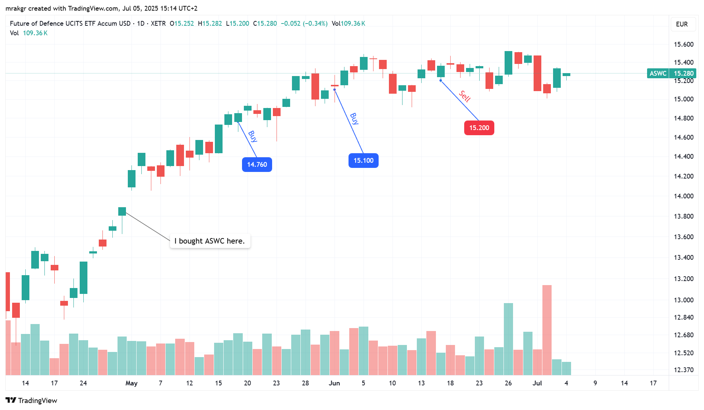
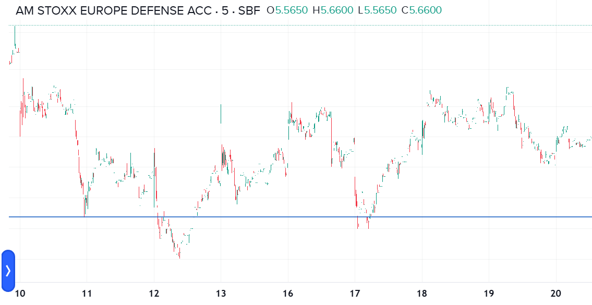
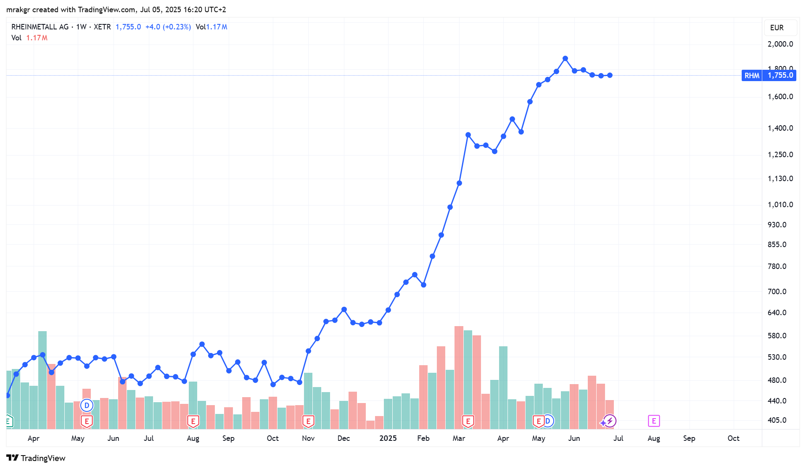
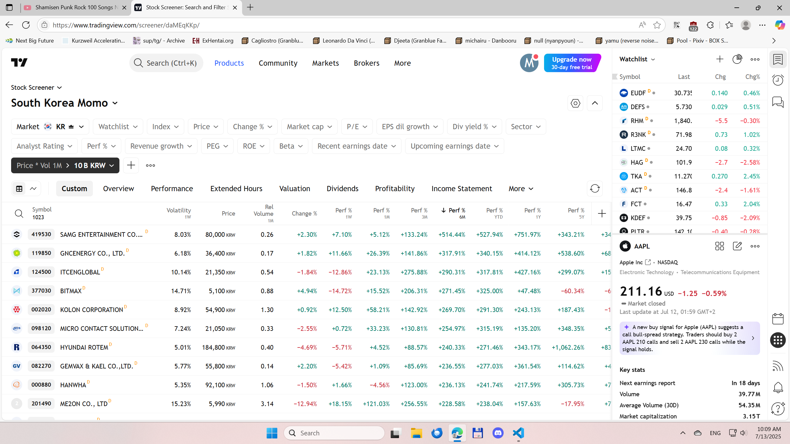
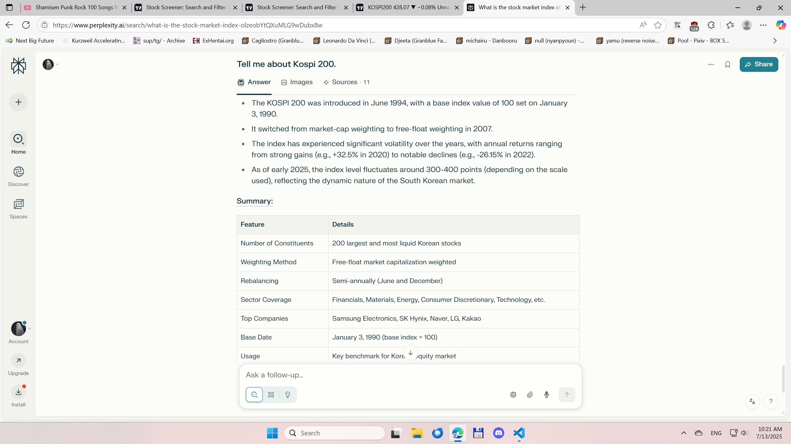

# Trading System

## Core Beliefs

Based on my 2007-2014 experience where I sent an inordinate amount of time breaking even at trading with a tiny account before throwing in the towel, and then subsequently coming back in 2025, my conclussion is that timeframes shorter than 2 weeks are essentially noise. And to determine the trend of a stock or the overall market you need to hold for at least 4 weeks.

Furthermore, many big winners have 3-6 week flat consolitation periods where they are essentially flat even during their strong uptrends, so a good strategy is to buy 4 weeks into those and then hold for 4 weeks to determine if the uptrend is intact. The same goes for buying dips. Big winners during the smooth and strong part of the uptrend often have 4 week dips or consolitations, but it's rare to see 8 week periods where they don't make a new high on a weekly line chart. And they always go up after 12 weeks assuming they are in a strong uptrend.

So thinking about it in counterfactuals, if you buy 4 weeks into a consolitation and after 4 weeks the stock hasn't made another leg up, that makes it much more likely that it's topping, or that it's in a weak uptrend, and you don't want to participate in that.

If there has been a 12 week period on the weekly line chart where the stock has made tepid progress, then most likely the trend is flat.

If possible I wish that needing to trade on a 2-12 week timescale wasn't the market reality, and during my failure years, I spent a lot of time trying to find places where there'd be daily trending behavior instead of monthly, but monthly (4 week) trends are where the money is in the market. I wanted to buy after updays and sell after downdays, but the price behavior at those timescales is just too noisy to be tradable. In fact, there is a tendency to counter trend instead, so what works is buying dips and selling rallies, but in the risk/reward is very asymetric there. Though it's very much possible to be profitable trading like that, I'd rather take a small risk for a large gain than vice versa.

Ideally, rather than spending 12 weeks to determine whether to exit, I should strive to trade the market leaders and use a 8 week period instead to determine when to exit. I've observed that market leaders often slow down on an 8 week timescale despite them going up and that turns out to be a good sell signal. Once their strong uptrend changes to a weak uptrend, it becomes a good idea to sell into the highs and move to a different stock. Another good time to sell is once the uptrend turns into a buying histeria and the price explodes upwards.

Hence, I want to trade in a trend following manner with the right beliefs, and it's actually took me an insane amount of time to finally conclude that the daily price action is noise, and that the main issue with my trading in the 2007-2014 timeframe was I was getting fooled by noise. Even though back then I tried to let my profits run and cut my losses, I was simply too desperate to limit risk, and just kept getting stopped out prematurely.

I was irrationally afraid of holding stocks for longer, and wasn't listening to what the market and my own results were telling me. I kept searching for the silver bullet, and a part of that reason is that my account was simply too small for me to trade comfortably. Looking back, you could say that my account size was the primary factor in determining my trading style and strategy, rather than any objective analysis of the price action. I just kept rotating from stock to stock, hoping that the obviously failing system would work.

Another reason why I failed is that I set a goal of becoming rich quickly. I rember saying to myself that I need to make a lot of money within 6 months, otherwise I would be losing too much time. Given that kind of mindset, combined with limited funds to trade, it was no wonder that even though I had to trade on montly timescales, the market noise whipped me into contracting my time horizons to the daily scale. Had it not been for the pattern daytrading rule, it's likely that I would have tried trading even shorter term.

Trying to make money quickly ended up wasting over half a decade of my life. Combined that with the opportunity cost of the 11 years I was out of the market after giving up makes the price that I paid was enormous, despite not losing money.

## Trade Entries

Lately, I've read Mark Minervini's books, whose trading methodology is very similar to Wiliam O'Neil's and they recommend buying breakouts right at the precise pivot point. The issue with this approach is that the examples feel very cheery picked, and in the example charts of past big winners, the main commonality that I could find is that they keep going up month after month.

I haven't found buying breakouts to work well, so I actually think that once a stock has been assumed to be in a strong uptrend, that it's actually okay to buy at random times, or minor dips despite their advice no to buy when a stock is extended past its buy point.

One criticism of this approach is that often these breakouts happen at random stocks on random days, so unless you're a full time trader watching a 1,000 of stocks you'll miss them. You'll also miss them due to holding other stocks and not having the money to buy them.

So what I'll do is aim to rotate my failures into perceived market leaders every 4 weeks, and not worry too much about precise entry timing, hoping the trend will take care of it.

The general plan is that I should be holding market leaders in strong uptrends. Suppose one of such supposed leaders ends up being a failure and I sell it. I'd now have the cash that I could put in other stocks. At that point, I can do two things:

* Wait for another stock to break out and buy it at its pivot point.
* Add more to existing leaders which have broken out in the past and have proven themselves.

I am leaning towards the latter even if it means chasing a stock that might be overextended. I'll try to buy them on 4 week dips or consolidations.

I am convinced that holding stocks for a proper amount of time is more important than precise entries.

Also, precise entries are in coflict with averaging up as the trend progresses. Since 2 week periods have some signal, I think that adding to a position that appreciates every 2 weeks is how it should be done.

The reality is that trading commitions have gone down, the markets have become more efficient than in the 20th century due to the digital revolution, everybody is looking at charts, and everybody knows to buy new highs and sell lows now. It's common trading knowledge at this juncture, popularized in no small part by William O'Neil. Stocks will just blow past the ideal buy points without mercy, or emerge in a noisy manner in order to shake out weak momentum traders. The evolution of the markets is needs to be factored into one's trading, and it will only ever be that systems that worked in the past will stop working. And the shorter the timescale, the more efficient the markets will be and consequence, the more the price action will resemble noise.

The more the price action resembles noise, the less important precise entries become, because if it is noise, whether it it goes up or down after you buy it is just a matter of luck. So it's fine to buy on dips or consolidations.

Breakouts are extremely obvious, and they do have an important function of telling me that the stock is in an uptrend, but if I could already see that this is the case I won't assume they have any other added benefit.

## Trade Selection

I am at a huge informational disadvantage in the market. Lately I've been reading the Unknown Market Wizards book by Jack Schwager and it made me realize that I could never immitate some of the approaches due to lack of real world awareness or knowledge. Even if I take some financial or economics classes, I'll likely never know much more than the guy on the street. No wait, scratch that.

The guy on the street is at least interacting with the real world, while I am in front of my computer screen 12h a day, trading only part time and doing introvent work like programming. And I will mostly be trading stocks in other countries like the US or in the EU, while I am all the way in Croatia.

So for selecting my trading vehicle, I don't have much choice than to go with a momentum approach.

I do think that a stock's overall pattern provides important hints as to its future trajectory, and in addition it does provide hints what it's trajectory will be. High momentum stocks continue to be high momentum stocks, smooth stocks continue to be smooth, and volatilty perists during the uptrend. It's best to buy low volatility stocks that have good persistence on the weekly line charts because once the the trend starts to shift, low volatility will become high volatility and the persistence will become weak. It's best to judge this on the basis of past 8 weeks. In fact, when it comes to estimating volatility it pays to look at the daily charts.

For estimating the trend, you have to look at 2 week segments, but for estimating the volatility, the candle ranges on the daily charts offer important clues. Generally the volatility goes through the roof after a huge rise, but sometimes it ends up being just as small as before. I'd want to sell after huge rises, but if the stock isn't going down for 4 weeks after that and it's daily volatility is still low, I'd consider going back in.

Sometimes a stock that seems very choopy on the weekly chart will suddenly contract and it's weekly closes will start to cluster together, and it will persistently start to go up month after month. That's an important clue.

In fact, for this particular paragraph, one of the recent leaders that comes to mind isn't even a stock, but a crypto currency. It used to be very choopy, then the volatility contracted and it went into a 2 year long uptrend, the same principles apply for them.

Recently I've read the `Quantitative Momentum: A Practitioner’s Guide to Building a Momentum-Based Stock Selection System` book, which showed an edge for buying stocks with 6-12 relative momentum and rebalancing montly. They also discovered that for shorter term momentum the edge goes away, and for 1-month momentum it's even negative. This finding is consistent with my view that I should be buying either randomly or 4 week dips or consolitations. It doesn't have to strictly be flat, it can be up a little, but it's probably best to avoid buying into sharp rises.

So I'd look for high 6-month performance, and look at whether the stock has made large moves even before that time. I'd also carefully observe how it made those moves. Looking at the past 6 month of a stock that has gone up by 200% as an example, it's better if a stock has made those moves by going up 20% month after month, than with huge infrequent gap moves.

Besides this, one important thing is to look at how ETFs are behaving.

A whole group going up by 50% in the last 6 months, is a lot more powerful signal than a single stock going up by that amount. To eliminate the chance of randomness from price moves, a very strategy is to find the best performing ETFs and buy just their best performers. I've seen some market research that said that buying best performing groups gives you 20% per year, but they called buying the best performing stock in a group the holy grail of investing as it gives 50% per year.

With group moves you know the strong move isn't an illusion, and that other investors will be directing their funds into the broad group.

In fact, I'd rather trade this than random momentum picks.

Right now (6/29/2025, Sunday) for example, I am long an european defense stock ETF. The uptrend is very obvious as is the fundamental catalyst, so there is a decent chance of it persisting. Also, the market broke 2 months ago due to Trump's tariff announcement, and the group showed extreme resilience to that break, so I am expecting another leg up. Also it has consolitated it's gains for the last 4 weeks, so according to my theory of how a stock in a strong uptrend should behave, it should make another upleg in the next 4 weeks.

Since I've just re-entered trading after a 11 year hiatus, I am really looking forward to finding out how well my current theory will work. The thing I am most afraid of is what I'll do if it closes flat 4 weeeks from now. It's going to be super awkward to sell a proven market leader and the best group just as the general market is starting a new upleg, that had shown strong resilience to the earlier break, which is a signal superior to any other technical pattern that I know, and with a strong fundamental catalyst. I'll just have to do it and rotate into rando momentum stocks, but I do hope I won't need to as the pattern here is a huge opportunity.

If it does poorly in the next 2 weeks, I'll sell it right then instead of waiting for full 4 weeks to elapse.

## Market Timing

Back when I was starting out in 2007, I was essentually trying out the same approach as I am now. I would load up my porfolio that had nothing to do with the market. If you'd taken any of their charts, and compared them to the S&P or the Nasdaq, you'd see nothing in common. And yet, I was shocked to find that when rougly speaking, when the market would go up 1%, my portfolio would go up 2%, and when it would go down 1%, my porfolio would go down 2%. I couldn't understand it at the time, but I realized quickly that in the short term, the primary factor in the motion of a stock is where the rest of the market is going.

I don't have good rules at this point where to get out, but market leaders top ahead of the general market so the 8 week rule should suffice to get me out of the leaders ahead of time before the broader market cracks. In fact their breakdowns is what will drag the rest of the market down.

One of the rules is to avoid making any new trades while the past leaders are cracking and the market is in a general decline. If you're holding stocks have recently broken out and might be future market leaders, and are acting resilient, it's hard to tell purely by price action whether they'll break and get swept up by the general market action and declining sentiment.

The general market breaks tend to be fast, so I'd use a 2-4 week period to evaluate this.

According to this insight, if the market is acting awkward, I plan to get out, and wait 2 weeks and after it has been confirmed that the decline has been arrested, I will turn bullish again with the intention of buying in two week steps on the way up.

And there are special rules for how to get in.

In short, in two week steps on the way up after a big break.

# Trade Analysis

## March 2025 - June 2025

### ESPO & ASWC

At the time of writing this (6/29/2025), I am 3.5 months roughly into my part time trading career. Having written out these rules, I realize that it's not going to be good enough to just have them down and expect anyone to be able to apply them. I also forgot to cover how to take losses, which should be done using 2 week time stops. We'll do that during actual trade analysis. The market timing got a bit complicated in April and had I obeyed the 2 week rule to sell losses, I would have sold out in a panic, so it's great that I didn't do it. Let's go over it from the start, which is roughly mid March.

I think I only opened my brokerage account at around late February, and by that point I wasn't following the market actively. I would occassionally glance at the charts of Nasdaq or some big winner ETFs, but I wasn't really thinking too seriously about getting in.

If you take a look at the chart, by that point the market has essentially been going up without interruption for almost 2 years, so I thought that give at most couple of more months, there would be a big break which would give me a buying opportunity and a chance to get started. I certainly didn't want to plow my money into momentum stocks late in the cycle only to have them be crushed when the market corrected.

Unbeknowst to me, the decline would come sooner that I suspected, and in a month, mid March, I had started to become bullish.

It really didn't take much to make me bullish, and I wasn't really thinking nor particularly interested in why the market had declined. All I knew was that the market was down, and that I should make that the psychological buying point according to the rules. I simply decided that in order to break away from who I was in 2007 - 2014, I need to expand my time horizon significantly in order to escape the noise.

So after screening for appropriate high momentum ETFs, I put in 33% of my account into the market, or at least that was the plan. I had two main candidates in mind.

ESPO - Van Eck Sports ETF.

ASWC - Future of Defense ETF

As you can see on the weekly line charts, both of them had excellent trend persistence, and it felt that having broken out earlier and declining along with the general market that ESPO was a safer bet. 

If you look at the chart of ASWC with daily candles, you'll see that it had some scary selling that looked like climax selling, so I wasn't sure what to think. I thought that if it could show resistance for a 4 more weeks that that it would be a great buy, but I was feeling squeeamish about assuming how strong it would trully so easily. The market can do weird things and didn't want to get crushed by buying into overbought conditions at the wrong time.

I really thought that I could try ESPO now, and if a month down the road it turned out that ASWC's strength is legit, I could always just rotate into it.

I bungled the entry into ESPO very badly, and got in 5% higher than I should. I put in a limit order at 52, watched it go up for nearly 2 weeks without me and not being able to stand it bought the first dip.

I was thinking: "Ah, for fuck's sake, am I going to miss the entry into the market at this rate. I need to start buying other wise I am going to miss the ride completely."

Looking at it now, I could have justified not getting in by the two week rule. I did say earlier that it's best to just wait two weeks for the decline to become arrested and only then get in. Had I only waited a single day more I could have gotten in at a much better price. At that time I didn't really care too much about risk of the market decline, thought that it's positive EV (expected value) regardless so I wanted in.

Honestly, more than breaking the two week rule or getting a bad entry, I am more embarassed that the two week upmove pressured me to enter early. I let the price action which is supposed to be noise at this time scale affect my judgement and couldn't bear to wait. That's what was really messed up about how this trade started.

On Friday when I lost 2 points, I was miffed, but I dediced that I'd just hold it for 2 weeks and sell it doesn't recover.

Anyway, I didn't know at the time why the market had a decline in the prior month, I thought maybe it was simply overextended after rising for 2 straight years and needed a release, but it might have anticipated the chaos that would be caused by Trump's tariff announcement and dove in anticipation of that.

In act of brazen idiocy, thanks to Trump, over the next 3 days there was a literal panic in the markets and ESPO got crushed.

I had only 33% of my account in this, and at that time I wasn't even looking at the market. Not so much because I was afraid to look at the screen, but was disinterested in the market and decided to just make it a rule to look at it only every 2 weeks. I didn't want to get emotionally involved in the price action. I just let it ride down and when mid April came, it triggered my time stop rule and I had to decide whether I want to sell or not.

It was an interesting situation since I was ina bad position and needed to think about the solution. And I think at this point is where I actually showed my true skills.

First of all, this situation warrants a discussion of loss taking and why one would consider doing it.

You want to take a loss because you aren't sure about the trend. If you look at big winning stocks in hindsight, it seems obvious that one neeed to ride the trend, but you can never be sure that a stock is a true market leader regardless of volume or price action.

You know how I said that every stock in a strong uptrend has a strong 8 week period? Or rather that's what I said we should assume.

So by that reasoning if you buy 4 weeks into a consolidation, you shortcut the process a little and get a great trade because you only need to wait 4 weeks for the next leg up instead of 8 had you bought it at the beginning of a consolidation. But because you cannot see into the future, you cannot put 100% probability that it's in a strong uptrend. You assume it's something like 70% in a strong uptrend, 20% that it's flat trend, and 10% that it's in a negative trend.

So these are 3 different basic scenarios you keep in mind, and you cannot even know their exact probabilities, but you just assume some priors like I did, and you know that it being flat for 8 weeks in a row or even declining make the other scenarios much more likely.

Let's say after 8 weeks of flat price action, you cannot rule out that the uptrend will resume, but you have to assume that the probabilities have changed, and that it's now 40% strong uptrend, 50% flat trend, and the rest are negative scenarios. You just sell and put your money into a better opportunity. That's essentially my plan.

I assume that the longer the decline, and the deper it is, the worse my odds are.

So yes, it makes complete sense to take losses when you think of it in probabilitic terms like these. The rules to sell fall out of the probabilities you set to different scenarios. You sell when your expected value becomes degraded, or when you're overleveraged and taking too much risk.

So in the light of that let's look at the chart of QQQ and think about whether the market is oversold here.

Back in the 2007 - 2014, I was reading various blogs, some of them by quants and they would backtest strategies on the S&P or Nasdaq comparing buying on advances vs buying on declines or buying on highs vs buying lows. This was long ago, but the market's tendencies haven't changed.

A common trading aphorism that you should buy strength and sell weakness and what they found was the complete opposite. Buying lows was much better than buying highs and the stronger the decline, the bigger the profits on average. Maybe I'll dig up some of those blogs in the future. But you'll notice this tendency even if you look at the charts. When the big indices hit a high, they suddenly slow down and meander aimlessly in a flat line, but when they hit a low, they positively surge.

The only profitable non-intraday trading strategy when it comes to trading the S&P is to buy panics such as these.

But it goes contrary to the usual trading cliches of cutting loses and letting profits run, in fact here it is the complete opposite. The lower the big indices go, the stronger the expected value is going into the future!

That is basically according to simple statistics, but unlike trend following it's very difficult to try and understand how to take advantage of it.

If you're a pure stock trader, it'd be very difficult to stay out of the market and then finally buy when it goes low. If you look at my own ESPO trade, I never expected the market would panic out of the blue, and even though I was patient to wait for a decline, I entered way too early.

So what I think is this:
* You cannot buy this market on the way down.
* You cannot sell this market because it is negative EV.

I didn't want to buy this market even though I knew that statistically it would be positive EV, because I didn't want to take any more risk. During declines like these the volatility explodes and buying short term panics like this isn't my main strategy. I probably would have bought a little had I entered this scenario completely flat.

But I am getting ahead of myself here, going back to our earlier discussion about how in trading it is necessary to imagine different scenarios and assign probabilities to them.

What I think is that in bull markets, buying panics works so I assumed that in a bull market buying a panic like this will be deeply profitable and the decline will be reversed within 4 weeks. And if this was a start of a bear market then that wouldn't be the case and I'd need to close out this position at a loss.

So at that key moment in the chart I simply decided to hold the position for two more weeks.

A week later...

I thought this was a key moment. The market had a flat week, and I decided to wait one more week according to plan.

The market surged and deciding that we're not in a bear market I decided to hold my position. Had it close down or flat, I would have sold it.

Anyway, this episode demonstrated the power of using your imagination and experience to trade. The market acts roughly similarly in bull and bear markets, you just aren't sure of what they are, so you take a risk. You take and hold a position for a month to let the market determine the trend for you.

That's how I did it here. But also, I knew that even if Trump's tariff's were such horrible policy that they would cause economic collapse in the future, I still would have bought it because bear markets don't start with a single news item. Even in early 2007, way before the 2008 crash there were banks going under due to bad loans, but it took 1.5 years for that to torpedo the market with huge rallies inbetween.

Bear vs bull market is more of a matter of investor sentiment.

When 2008 started, the declines were lot deeper and took longer than a month to recover.

Had I sold the position in late April due to bad price action, and waited two weeks as per plan and it rallied in the interim I would have gotten back in again. But there is always a chance that it wouldn't or that it would take a while for that to happen, and had that been the case, I would have significantly increased the probability of a bear market scenario and been much more careful on the long side.

Maybe I'll study the chart 2008 period here. They key finding from that period is that XLF had unbroken strings of negative quarters, meaning it would have been possible to short sell 8 weeks into the rallies and ride the trend down.

This reinforced my view that trends manifest themselves within 12 weeks regardless of what happens inbetween.

In the market, you cannot just buy the highs or sell the lows and expect to be profitable, but I realized in my absence from the market that I need to take advantage of such trend timings if I wanted to be successful.

If you go back to the 2001-2003 bear market, there were such 8 week rallies like in 2008 before the market collapsed.

All you really needed to avoid the 2008 bear market is wait full 12 weeks in order to assert that the downtrend is broken. That's it.

Sell 8 weeks into a rally, and wait 4. If the cost is clear, and the market isn't declining then get back in.

That's why I have time based loss rules now.

Here in 2025, I was just using a similar kind of reasoning to hold through the decline. This time it was actually pretty easy. 

I had only a 33% position so I wasn't worried about taking a loss.

Anyway, it took a while, but ESPO recovered and I got out below where I bought it for a minor loss. Had I gotten in at a better price point, I would have actually had a profit to show for my effort.

At any rate, I didn't really miss the rally since as soon as I sold ESPO, I also rotated right into ASWC.

I added to it every two weeks until I brough my equity up to 100%. This was actually a huge mistake because it turned out that I had stupidly assumed that the fund has 100% Europe exposure, when it fact 50% North America and 30% Europe, and the actual bull market in defense stocks is in european ones, but more on that later.

Despite some mistakes due me not being omniscient, I am incredibly pleased with this trade.

I absolutely never did something like this in 2007 - 2014. Looking back on that period, I don't remember a single trade that I made during that period, not a single one! That's proof that I was never thinking at all about what I was doing. I was just looking at fucking breakouts on the charts, buying them and hoping they go up while limiting my risk just like all the trading books that I've read suggested that I should act, not understanding why my performance wasn't improving.

I remember back then that I traded desperately, while now I get a really good feeling when I think about my prospects.

Back then I just couldn't find any way to predict the market, but in the ESPO trade, have I ever predicted the market even once? I've never tried buying breakouts or selling breakouts, or buying lows or selling the lows, just because the trading wisdom says you have to do that. I never looked at the charts and tried to guess what the market should do tomorrow.

Rather I gathered the characteristics of uptrends and downtrends in my mind as it relates to the major indices, weighted the uptrend as being more likely in the given context and simply decided to hold, ignoring the daily price action all the while.

It honestly gives me an euphoric feeling to even write this. Despite my flaws, I feel like this is what I've been so desperately seeking for 6 years a decade ago, without ever being able to grasp it. This is really trading.

Well, we'll see. Maybe I'll get killed by some market top that I couldn't get out of in time. There is a lot of opportunty to lose all your money in the market.

Anyway, I just want everyone reading this to know that the trading rules I suggested here are based on real world price characterics of instruments that I studied. I am pretty sure that if you used them to trade bonds or currencies that they'd get you nowhere.

With the stock market, it's very risk on/risk off kind of market, so it's easy to tell what the majority is thinking purely by the price action. I find this a lot harder in other markets. I've decided to focus on stocks (and crypto-currencies) for a reason. There are a lot of strong uptrends in those instruments, and it's easy to understand broad market sentiment.

### DEFS

I am currently in DEFS, and it's really hard to get a chart of it as the intraday price action doesn't show all the trades on TradingView like it does in my Interactive Brokers account. I don't want to take a screenshot of it from my account directly as it shows my actual size, but let me show you chart of a similar ETF to it. DEFS also have very little in terms of historical data. I made a mistake buying it instead of the more liquid EUDF.

When you look at the daily chart like this, it gives the wrong impression as your mind keeps homing in on the peaks and valleys automatically. It can distort your trend evaluation, so let's switch back to line with marker charts.

Much better. Right now it's basically consolidating while the rest of the market is catching up to it, but you can see on these two charts how it went ahead of the market.

So right now the rule is to just count. It's been down 3 weeks from its high. 1 more and it's a 4 week consolidation or minor dip. 4-5 more and it should go up according to our assumed uptrend model. Otherwise I'll have to rotate.

When you look at a chart of a big winner, the consolidation gyrations seem minor, but up close, you'll observe that they can move quite a bit. It's just small relative to the rest of the chart's scale. If it goes up a lot, these gyrations will seem like nothing in retrospect, but now I am watching my portfolio change value at a rate of 2-3% per day.

## 7/5/2025

First of all, since I got tired last week when writing this document and couldn't cover my exact ASWC buys, let me do so now.

I put 33% of my account into ASWC on each of the buy points market on the chart before selling out completely at 15.2 and putting my entire account into DEFS.

The story behind that is a bit interesting. Up to that point since late mid-March, I wasn't really looking at the market. I hadn't too much at stake and didn't want to through emotional turmoil like I've been recently so I wasn't looking at the market or the trade closely. I would just come in at the end of every week to see where ASWC was and moved according to the 2 week rule. I'd add to it every two weeks, and my original intention was to keep holding it.

My reason for buying ASWC is entirely based on its price action. It was incredibly smooth and was amongst the top % of ETFs by 6 month momentum, and it shrugged off the recent market panic without issue.

The reason why (I thought) it was going up was due to the european defense spending increase, and given that it's trading in the German market, it was a no brainer for me.

I should have done more research. On a talk with my CTO at the company I work for, he mentioned he was invested in european defense stock ETF and when I looked up the chart and compared it to ASWC, I noticed right away that his ETF was up much more than ASWC! At first I thought it might have been due to currency movements, but the gap was simply too large to explain that, and when I looked at the composition of ASWC I realized that it had 50% in North America.

Realizing I had made a mistake (and probably made my CTO think I am retarded) I immedially put a buy order for DEFS at 5.40.

I apologize for posting a chart like this without the price levels, but I want to keep my exact sizes a secret. The issue with the TradingView chart is that it's missing most of the volume and so look much more sparse.

It was a pretty furtuitous entry point. I didn't get greddy with market orders, rather it seems I picked nearly the exact low.

Having realized my mistake, I put in the limit order for DEFS, and when it goes hit I rotated it in two batches. My DEFS got hit for 33% of the position, then I sold 33% ASWC, put in another order DEFS which got hit for 66%, then I sold the rest of ASWC.

It was actually a pretty exciting day, as I was essentially daytrading with delayed market data.

In fact after the first 2 DEFS buys, I wanted to make a 3rd one, but the market got away from me.

What made it so interesting is that I had to make decisions on how long to wait on every step of the way as I was doing programming in the background. For example, I realized that my second lot of ASWC wasn't selling at 15.3 so I had to drag my limit lower to 15.21 otherwise I risked being overexposed to the market overnight.

When I saw how DEFS traded over the following few days, it made me very please about how I timed the purchases. The blue line marks my average buying price.

I put in another limit to increase my position by 16.6% and it luckily got triggered on the 23rd of June when it retested the lows.

In truth, I rushed in to buy DEFS, and would have been better off with the more liquid WDEF.

But it's fine. I am not going to switch my entire portfolio just so I can see a prettier intraday chart on TradingView.

That covers the exact trades.

First of all, I want to say that trading ETFs and stock indices is not at all like trading individual stocks, and studying their price action is what finally made me realize that I have to loosen up significantly and not be so anal about breakouts. It made me realize that even if come in at random times, if I hold for 2 weeks and move in 2 week steps, my odds were actually pretty decent as long as I focus on the strongest movers.

Furthermore, buying breakouts can be at odds with pyramiding up. If the breakout is the ideal buy point, then by definion if you are pyramiding up then you'll be buying an overextended stock.

Based on that thinking, I concluded that I was overweighting breakouts and underweighting longer term price action. The fact that breakout trading doesn't work on ETFs or indices is proof that it's not general enough as a trading method.

Stock markets are money sucking machines, and the reason to hold stocks for longer periods of time is that the odds are decent that simply doing that will capture it's general drift. It depends on market conditions, but during bull markets the odds of it having an upmonth is at least 60%.

As long as you have at least a few stocks in your portfolio and hold for 4 weeks or more, the drift will put the odds in your favor.

So the market's upwards drift is one thing which I consider when placing a trade. It's not like buying a random commodity (which are deflationary) when it's making a new high and hoping the trend is my friend.

When I bought ASWC and DEFS near the short term lows instead of using market orders, or god forbid, when they were making new highs, I was taking this into consideration. By simple reasoning, if you expect it is likely that the market will finish the month higher than when it started, then it makes sense to buy short term lows. And that is what I did.

Back in 2007 - 2014 I remember using market orders constantly instead of being patient like I am now.

There is a risk like in March that the market might get away from me, but the difference between me of now and then is that I decided to accept such risk.

With individual stocks, I'll probably rate breakouts from tight bases more highly in terms of opportunity, but they aren't the only way to trade.

At any rate, that covers some of the more phylosophical aspects of my stock trading system. I've been watching interviews by Minervini and reading his books, but even though buying breakouts has worked very well for him, I realized that he has an idea of there the stock is overextended and avoiding that, so he isn't getting hit by mean reversal effect of high 4 week momentum.

I think getting hit by that was a big problem with my 2007 - 2014 trading because I couldn't quite understand the difference between letting winners run and not buying stocks that are overextended. As a simple rule, if a stock goes up 20% in 4 weeks, one can expect it to pullback half of that move even in a strong uptrend. In light of that, you can't really fault traders who go for quick 20% gains once the stock surges. Selling into strength is a viable system given the mean reversal effect.

In fact, one could argue that letting winners run is gambling.

I guess it depends on what you're trading.

And on that note, I am starting to really sweat here. The rule is to hold 8 weeks, but given that the euro defense stocks have been selling off for 5 weeks in a row while the stocks on my TradingView watchlist have all been screaming higher, at an emotional level I've already hit my stopping point. Not that I am going to let it trigger even if it means losing sleep over it.

First of all, I wasn't really sure last week where to start the count for the decline, so let me resolve that here.

Here is a chart of the hottest stock on the German market right now. The selloff/consolidation period in euro defense stocks started just about the time it topped and started selling off.

Looking at the weekly chart it seems like the selloff is a minor dip, but it has been 30% from the top. Every time the stock made a decisive new low, the euro defense stocks in general got hammered.

So it's fair to say that the decline is at least 4 weeks in.

RHM is the is the actual leader, and it has been down for 5 weeks.

It's intraday chart in terms of shape looks identical to the intraday ETF charts that have been posted.

Both DEFS and WDEF have only 10% allocated to RHM, and perhaps it'd have been better to have more.

Holding this trade for the past 3 weeks hasn't been pleasant, and I partly think I should sell DEFS out and start trading individual stocks. A part of me really wants this, as I know that buying the leader is better than buying the sector.

And the disadvantage of not having a diversified portfolio is something I've been really feeling during this period. I've started to think that if I had to do all of this again, I won't put so much into a single group.

My preferred method of trading going forward will be to put 20-25% of my money into carefully selected issues each and hold them according my position trading rules.

ETFs were always there as training wheels for me.

That having said, after spent my entire Thursday night without getting a wink of sleep because I was so anxious, I am going to take them off after this trade is over.

As much as I want to switch, the market rewards conviction so I am going to act as such. I can spend the next 4 weeks to see if there is any steam in this trade.

I am also worried about the entire group going down below my buy point, but it'd be very weird for a leading group to turn tail and start downtrending against the rest at the start of a bull market even if right now it does look like it might be topping. I need to persevere and hold steadfast to the 8 week rule for true market leaders.

Maybe I am wrong, and there is no reason the very solid buying pattern during the April panic couldn't be a fluke, but assuming the general market doesn't tank, I think that the worst that should happen is that the group should finish flat by the end of the month. In that case I'll spit to the side and sell the stocks before getting into the US markets.

In that case I'll find another vehicle to park my money in.

I think a sharp selloff next week would also cause me to exit prematurely.

While usually I'll use a 2 week time stop, I'll also sell with a price stop if it starts breaking down decisively.

No reason why I shouldn't use both kinds of stops.

It will give me some added protection when I start trading individual stocks. I'll aim to keep my losses to 10%.

I've also added some selling rules to my arsenal for when a stock goes on a tear. If in the future I end up being lucky to be in a multi week move where a stock goes up 100% or more, I am going to tighten the 8 week rule to 2 weeks and sell on the first downweek.

A good example of where I'd put that rule to good use in the current period would be for a stock like SEZL. And of course R3NK.

As a general rule the sharper the upmove, the more you should tighen the stops because the more likely and the more severe the counter trend move will be.

That is what I am going to do.

Some large daily movers for example....

You can see a sharp rise in GME from 10 to 50, then a single downday from 50 to 40 signaling that the momentum has stalled out. This is actually a very effective short pattern, so you definitely don't want to be stuck holding after short term momentum has stalled out. Too bad these kinds of stocks are so hard to borrow otherwise I'd make playing them my bread and butter.

So for this kind of pattern you could say that the time stop is 2 days rather than 2 weeks. Why 2 days instead of 1? The negative momentum is what pushes them to 1 effectively.

My TradingView watchlist is filled up so let me note this stock here. We'll revisit it later to see if the 2 week timestop rule would have been effective for it. Incidentally, IPOs have been very good for the past months. I think I am going to add buying new highs from a 4 week basing period to my arsenal.

Right now it's very overextended, but it could work off the short term momentum reversal headwinds and be a good buy a couple of weeks down the road. At the very least, I want to see it build some trading history before I get in.

First Solar might be a good model for when to get in. We want CoreWeave to be at last flat or up a minor 10% for the 4 week period before we try buying.

Pretty much, anywhere in April and May 2007 would have been a good buy point by that criteria.

The stock had very good resistance against the Feb 2007 selloff and it consolidated for a bit before taking off again. I hope RHM and Euro defense stocks will act like that.

It had some pretty nice dips during that period that could have served as entry points.

There is something to be said about tightening the time stop to two weeks, and selling after 2 weeks if the stock's momentum has stalled. Unlike the usual 2 weeks, this one would even sell into a decline.

I have an idea of how I want to handle RHM and DEFS.

I think I'll sell DEFS by the end of the month even if it goes up if it doesn't go up far enough. I want it to go up to at least 6.2 in order for it to justify me holding it.

I think market leaders should be treated specially. With regular stocks, you can't know how far they will go, so it's not bad to use the 2 week rule to get out when short term upwards momentum has stalled, but with actual leaders, I can use the 8 week rule and ride out the pullbacks.

Doing the math, if I can catch a couple of 20-30% moves per quarter, keep my losses to 10%, that means that I could be making 20% per quarter on average. That means I could realistically end the year up 80%. Even 40% wouldn't be too bad. I could justify trading full time in either case.

I don't have to be the best, all I have to do is manage risk and make sure the edge works out in my favor.

I should be trying to cause the technological Singularity rather than trying to be a market wizard anyway.

At any rate, I'll decide whether I want to rid out the pullbacks with DEFS or use the 2 week rule instead.

I think despite my initial intent, I'll go with the 2 week rule.

It might have the benefit of rotating me out of the leaders that are stalling and into fresh opportunities.

It does look very stretched out doesn't it? Even it doesn't go down specifically, it might have a protracted period of consolidation.

But I should at least play the euro defense stocks for one more upleg.

If it turns out DEFS doesn't have much momentum and only closes out at 5.8-6.0 in the next 4 weeks, I'll gratefully accept the 10% profit and move to greener pastures.

If it closes flat by the end of next week, I'll keep holding it, but if it closes below 5.4 to something like 5.3 or less, I am getting out. I am not interested in holding the bag when everyone else is getting out.

7/12/2025

I've decided to sell 40% of DEFS and put them into individual stocks later this week. I'll do it on Friday.

To be specific in these 3.

I'll put 20% into RHM, 10% into R3NK and 10% into LTMC.

LTMC is a casino stock and not related to defense, but the chart pattern is a high tight flag, so I want to give it a try. I am feeling strong attraction to it. If it was a defense stock, I'd put 20% into instead.

R3NK is a bit too volatile, so I don't want to put 20% into it yet.

DEFS has done well this week and is up to 5.73.

I don't want to sell all of that position, but I think it's time that I slowly start to wean myself off ETFs and start trading individual stocks.

7/13/2025

I think one of my weaknesses still is that I am not taking in enough context. I've been inspired by the Janus Factor book, and it made me think about market timing more in depth. I know that it can be done much better by looking at the price action of market leaders. For example, in 2008, the finance stocks lead on the downside until the market crashed. To sense the trend of the overall market, all I had to do was to recognize that and use my trend trading systems in a hypothetical fashion.

For example, I could have imagined using the tred trading systems from the short side, and see how well the stocks obey the 8 week and 12 week rules on the downside.

If I were trading in 2008, I'd have seen that the momentum list was expanding and that the imaginary system was working well from the short side.

From the long side in 2025, I doubt I'll get much use from looking at the losers, but I will be able to tell when the market has topped by seeing the leaders violate the 8 week and 12 week rules ahead of the pack.

Currently, I am using momentum screens to pick stocks, but that isn't exactly what I should be doing for market timing. The act of reading charts to find the best leaders is different from the act of reading charts to get a sense of the market.

So in order to ensure my success, I should recognize my weakness, and do something smart.

I am going to create market timing indicators. It's really easy. It's just going to be a momentum screen of the big index stocks.

Currently for example, my EU momentum screen looks like this. I am looking at stocks in Germany, Italy and France. UK only has trash so I eliminated it from observation.

But for market timing, it should be more like this...

I have to either look at index stocks or large caps specifically. I'll do the same for Europe.

Let me use this one for Europe.

Perfect. In order to time, all I have to do is pay attention to market momentum and whether these leaders are making new highs on weekly line charts with at least 8 and 12 week regularity. Once they start violating the 8 week rule, that will be a warning sign, and the 12 week rule is the stop out point.

What makes these screens different from regular momentum screens is that I can flip them.

Once the market goes sideways, the stocks on this page will start to expand ahead of the market decline. Looking at the chart of an index is only good for gauging sentiment, and not anticipating the decline.

The way panic works in the market is that leaders either on the bear or bull side break, and then the panic spreads from them to the rest of the market. The chart of the index itself can hide this until it's too late.

If I am only looking at random momentum stocks, I won't be able to notice the impacts in time. And also, the best momentum stocks aren't necessarily the one in the index. The best performers aren't necessarily the leaders in terms of actually having an impact on the rest of the market. What leads the market is what the big investors are looking at. Small cap companies breaking down isn't going to affect them.

Right now it's a bull market so there aren't many big losers. Europe also has a lot more big winners than the US does. I need to pay careful attention to the top and the bottom of this list.

Every week, I am going to post a screenshot of these two screens which will allow us to compare them to the previous weeks. It should be fun.

Let's do it like this.

The EU Timing (6 month winners) screen says 23 symbols.

And its opposite has only 5 on it. That's useful information to have. I'll know whether the universe of losers is expanding through it.

Let's compare that to the S&P.

10 vs 5. EU wins again. The EU ones are also far stronger than the US stocks.

I am comparing the number of 50% winners to the number of 33% losers.

It's not bad to have a momentum cutoff figure. We can do trend following on these numbers by comparing them week to week.

I am reminded of the Quantitative Momentum book, and how they complained than in 2008, there was only a single stock above the 50% bull line leading into the crash. Pretty stupid of them not to interpret that as a signal.

You have to take what you read in these books with a grain of salt. You have to do the same even with successful traders.

https://youtu.be/JcFbWRs1myU
Mark Minervini Explains the Holy Grail in Trading

Minervini is a very good trader, but even so, such people can be unaware of what really makes them successful. A trader's edge is a different thing from his risk management strategy. An edge is actually what makes a trader successful. I'd consider having an edge the holy grail.

In the stock market though, risk management and edge can blur due to the existence of pyramiding strategies.

Trading according to the 3:1 ratio like he suggests wouldn't give you an edge by itself, so I'd personally just ignore this advice. I've read the Momentum Masters book with Minervini, Zanger, Ryan and Ritchie II. Based on it, they rarely outright sell into strength, the generally pull their stops in instead to lock in profits.

Trading according to the 3:1 ratio is also incompatible with the notion of being long the leaders for the duration of the bull market.

Pro chartists review a 1,000 charts per day. Besides finding good setups, that also serves the purpose of tuning them into the broader market momentum. They might not be aware that this is a large part of their edge. An amateur might look at a couple of charts and conclude they are random, but true momentum traders go all the way.

I cannot compete with pro traders like Minervini, but I can at least attempt to comprehend the true sources of their power, and act upon that insight.

When I was starting out in 2007, I had no idea just how connected the stocks in the market are and how they relate to the broader market. I won't make that mistake again.

To finish today's section off, let me just check out the South Korean indices.

The South Korean market is bonkers right now and there are a ton of high quality picks in that market. If I was in Asia or the US, I'd switch to trading that market instead of the US. Because I am in Croatia, it's in my night period.

Oh, wow. A literal quarter of the stocks in the Kospi 200 are over the 50% line. A lot of them are above 100%. Even in Europe, it's only like 5%. As for the losers...

Only 4. This is nothing. This is what a bull market looks like.

The actual index itself hasn't gone up by that much...

About 30% in 3 months. Which arguably is a lot for an entire country's index.

I am paying attention.

When a stock makes a 30% move, it isn't a big deal, but when the entire market does it, you pay attention. Instead of Europe, maybe I should stay up late and trade the Korean market instead?

I am just joking. I have a full time job, so there is no way I could do that, but if I was trading full time, I'd really consider it.

I only noticed this because the South Korean Defense ETF is so hot. 

I think moves like this precede strong multi year bull markets. I don't know anything about the situation on the ground in Korea, but the market is sending a message that there will be good times ahead for them.

My long term plan is to trade like this, and get a sense of what my expected annual returns are. Even if I get good results for my first year, that doesn't mean I can just quit my job, as it could be a fluke. If I can survive and prosper for at least 3 years, that would be the start of a signal for me.

If I can do well over a 5 year timespan, I'll drop software engineering as a career and become a trader.

I won't stop programming because my true goal is to cause the Singularity, but dreams are dreams, and cash is cash. I need to keep the two separate and focus on the present.

I'd be great if I turned out to be a market wizard, but planning for that to happen would be foolish.

And even if I knew that would turn out to be the case, I can't quit now as working at this job for another 6 months would increase my net worth by 60%. It just makes financial sense to stay. The job that I have will also help absorb any financial lumps along the way. I might end up screwing my trades up in 2025 and taking losses, and in that case the job will be very helpful in getting me back to even.